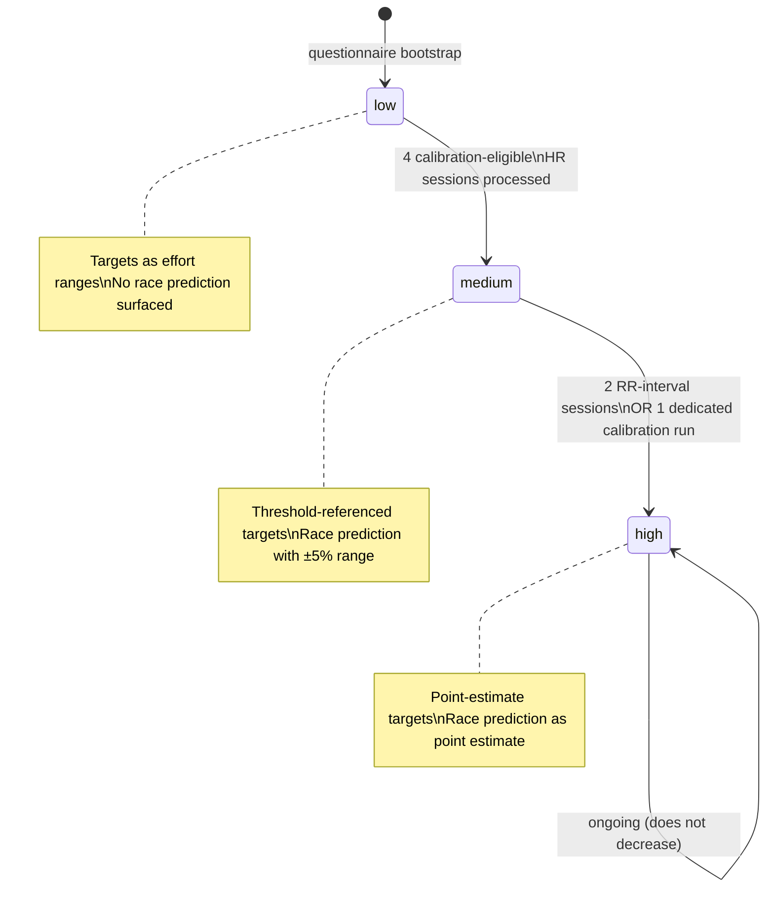
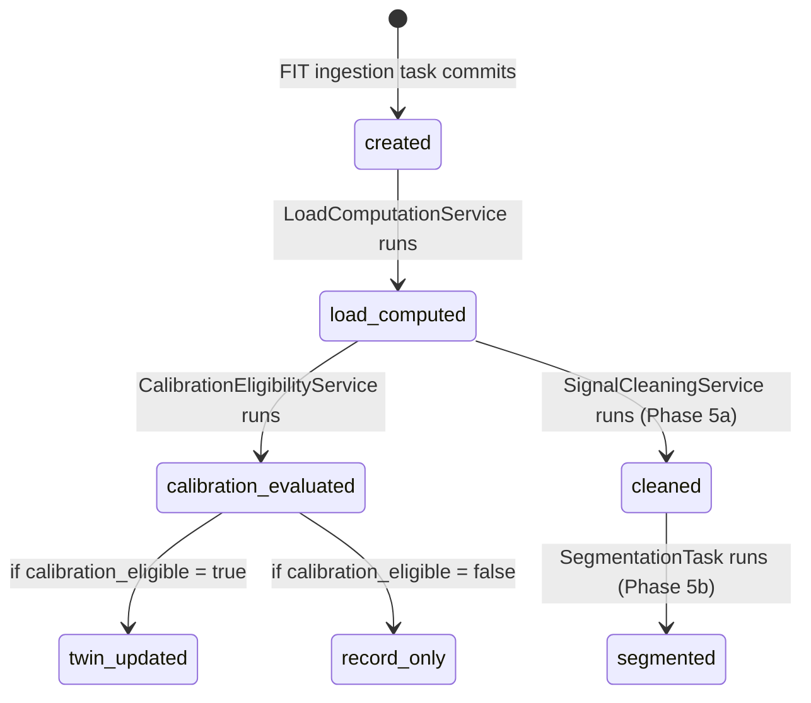
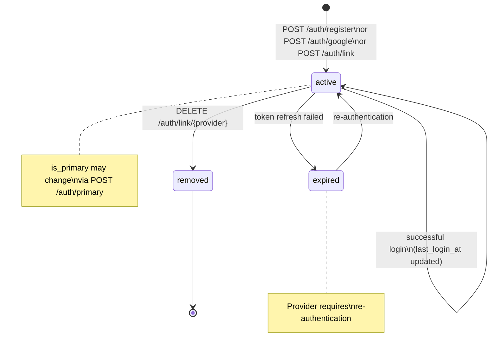
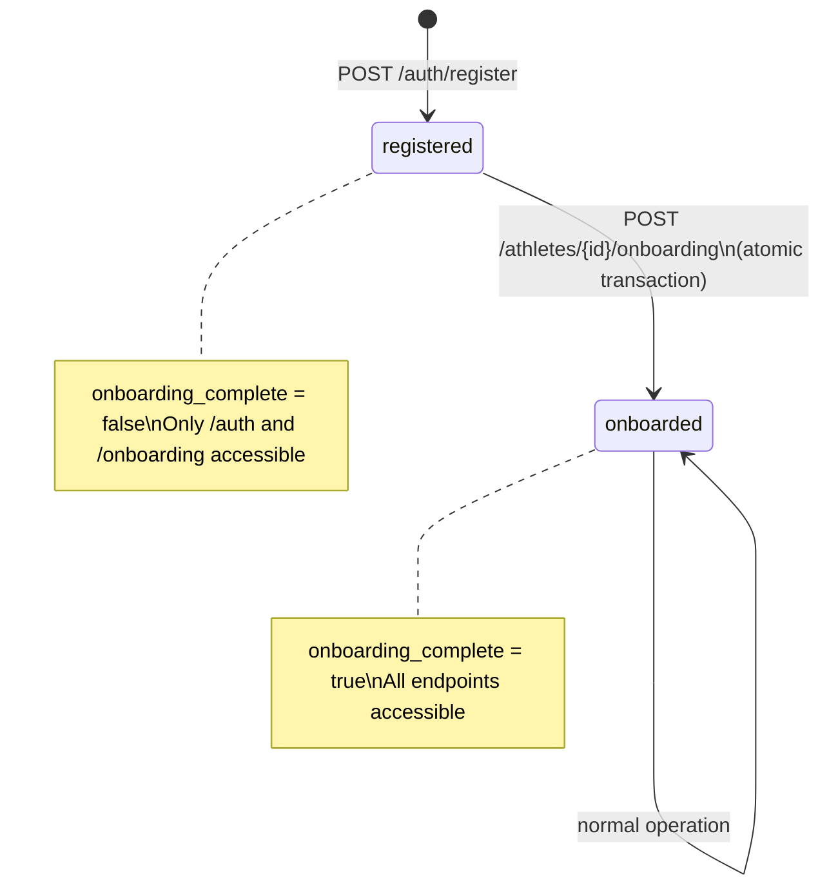
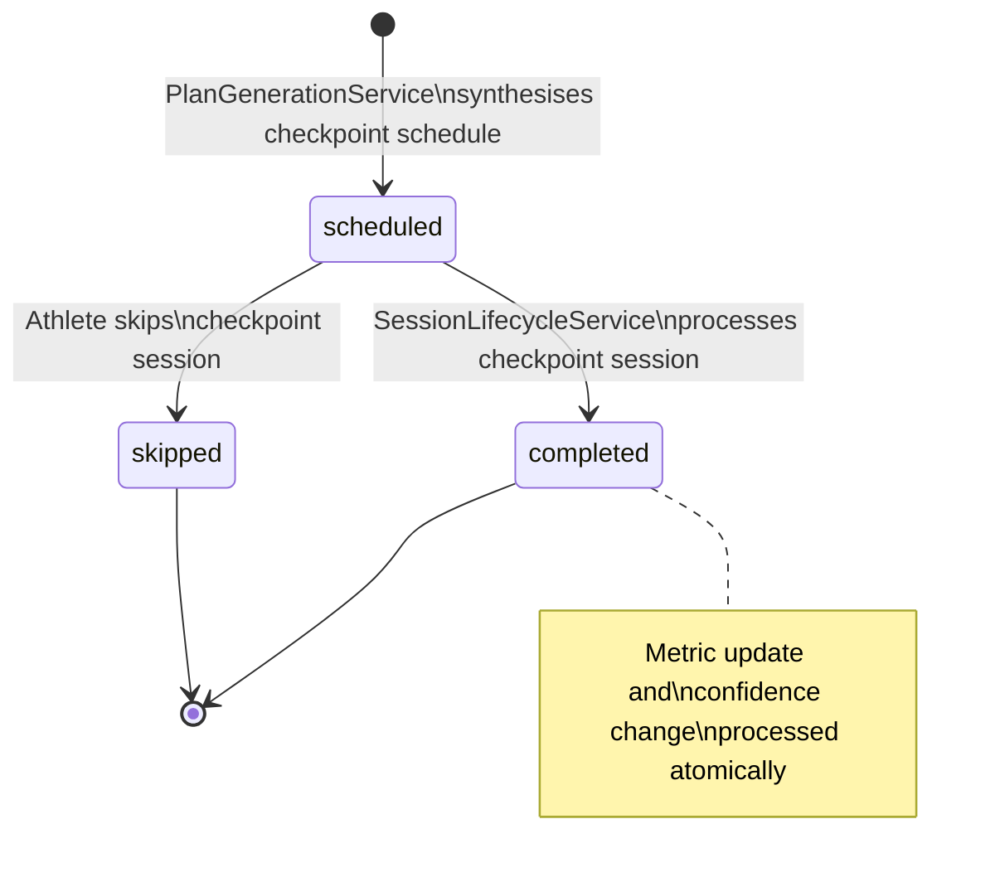
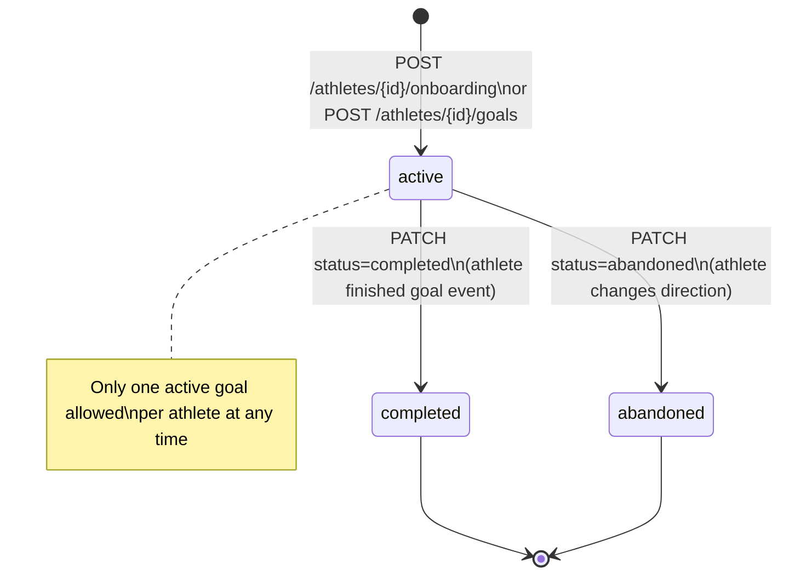
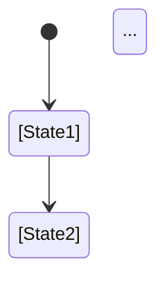

```mermaid
stateDiagram-v2
    [*] --> bootstrapped : questionnaire_estimate\n(all parameters; low weight)
    bootstrapped --> training_calibrated : training_hr_deflection or\ntraining_rr_inflection\n(4 sessions → MEDIUM confidence)
    training_calibrated --> training_calibrated : ongoing training updates\n(slow posterior drift)
    training_calibrated --> field_calibrated : field_test observation\n(dominant source shifts)
    training_calibrated --> lab_calibrated : lab_test observation\n(dominant source shifts strongly)
    field_calibrated --> lab_calibrated : lab_test supersedes
    lab_calibrated --> training_calibrated : prior decays over ~18 months\n(lab weight < training accumulated weight)
```

```mermaid
stateDiagram-v2
    [*] --> pending : created by PlanGenerationService
    pending --> generated : WorkoutGenerationAgent runs
    pending --> redistributed : proactive move before target_date
    generated --> completed : Activity with planned_session_id ingested
    generated --> skipped : athlete signals skip
    generated --> missed : nightly sweep; target_date passed
    skipped --> redistributed : SessionLifecycleService finds window
    skipped --> [*] : load dropped (fatigue/illness)
    missed --> redistributed : athlete decides to make up session
```

# Pheidipp Architecture - Combined Documentation

Generated: 2026-06-01 21:52:51

---

## Table of Contents

- [00-foundations/confidence-model](#00-foundations-confidence-model)
- [00-foundations/data-tiers](#00-foundations-data-tiers)
- [00-foundations/event-catalogue](#00-foundations-event-catalogue)
- [00-foundations/principles](#00-foundations-principles)
- [00-foundations/terminology](#00-foundations-terminology)
- [01-entities/activity](#01-entities-activity)
- [01-entities/adaptation-observation](#01-entities-adaptation-observation)
- [01-entities/athlete-auth](#01-entities-athlete-auth)
- [01-entities/athlete-fitness](#01-entities-athlete-fitness)
- [01-entities/athlete-integration](#01-entities-athlete-integration)
- [01-entities/athlete-physiology](#01-entities-athlete-physiology)
- [01-entities/athlete-preferences](#01-entities-athlete-preferences)
- [01-entities/athlete-profile](#01-entities-athlete-profile)
- [01-entities/athlete-wellness-baseline](#01-entities-athlete-wellness-baseline)
- [01-entities/athlete-wellness](#01-entities-athlete-wellness)
- [01-entities/athlete](#01-entities-athlete)
- [01-entities/checkpoint](#01-entities-checkpoint)
- [01-entities/coaching-message](#01-entities-coaching-message)
- [01-entities/cycle-phase-log](#01-entities-cycle-phase-log)
- [01-entities/execution-observation](#01-entities-execution-observation)
- [01-entities/generated-workout](#01-entities-generated-workout)
- [01-entities/generation-event](#01-entities-generation-event)
- [01-entities/objective](#01-entities-objective)
- [01-entities/physiological-segment](#01-entities-physiological-segment)
- [01-entities/planned-session](#01-entities-planned-session)
- [01-entities/race-prediction](#01-entities-race-prediction)
- [01-entities/raw-sensor-stream](#01-entities-raw-sensor-stream)
- [01-entities/training-goal](#01-entities-training-goal)
- [01-entities/training-plan](#01-entities-training-plan)
- [01-entities/twin-state](#01-entities-twin-state)
- [01-entities/weather-forecast](#01-entities-weather-forecast)
- [01-entities/weekly-plan](#01-entities-weekly-plan)
- [01-entities/workout-library-entry](#01-entities-workout-library-entry)
- [01-entities/workout-step](#01-entities-workout-step)
- [02-computations/adaptation-signature](#02-computations-adaptation-signature)
- [02-computations/banister-update](#02-computations-banister-update)
- [02-computations/comparable-sessions](#02-computations-comparable-sessions)
- [02-computations/effort-normalisation](#02-computations-effort-normalisation)
- [02-computations/load-computation](#02-computations-load-computation)
- [02-computations/objective-management](#02-computations-objective-management)
- [02-computations/physiology-update](#02-computations-physiology-update)
- [02-computations/plan-generation](#02-computations-plan-generation)
- [02-computations/segmentation-heuristic](#02-computations-segmentation-heuristic)
- [02-computations/segmentation-hmm](#02-computations-segmentation-hmm)
- [02-computations/signal-cleaning](#02-computations-signal-cleaning)
- [02-computations/threshold-detection](#02-computations-threshold-detection)
- [02-computations/wellness-modifier](#02-computations-wellness-modifier)
- [03-agents/context-budget-service](#03-agents-context-budget-service)
- [03-agents/first-message-agent](#03-agents-first-message-agent)
- [03-agents/hypothesis-agent](#03-agents-hypothesis-agent)
- [03-agents/hypothesis-selector-agent](#03-agents-hypothesis-selector-agent)
- [03-agents/post-workout-agent](#03-agents-post-workout-agent)
- [03-agents/pre-week-review-agent](#03-agents-pre-week-review-agent)
- [03-agents/session-planner-agent](#03-agents-session-planner-agent)
- [03-agents/skip-conversation-agent](#03-agents-skip-conversation-agent)
- [03-agents/weekly-synthesis-agent](#03-agents-weekly-synthesis-agent)
- [03-agents/wellness-alert-agent](#03-agents-wellness-alert-agent)
- [03-agents/workout-generation-agent](#03-agents-workout-generation-agent)
- [04-platform/async-pipeline](#04-platform-async-pipeline)
- [04-platform/event-topology](#04-platform-event-topology)
- [04-platform/failure-handling](#04-platform-failure-handling)
- [04-platform/observability](#04-platform-observability)
- [04-platform/storage-topology](#04-platform-storage-topology)
- [04-platform/versioning-and-reprocessing](#04-platform-versioning-and-reprocessing)
- [architecture-index](#architecture-index)
- [document-template](#document-template)

---

## 00-foundations > confidence-model

# Confidence Model — How Certainty Flows Through the System

## Purpose
- Defines the three confidence levels and what each permits in coaching output
- Specifies the exact transition thresholds and how confidence propagates downstream

## TypeScript Schema

```typescript
type TwinConfidenceLevel = 'low' | 'medium' | 'high'

type ConfidenceTransition = {
  from: TwinConfidenceLevel
  to: TwinConfidenceLevel
  trigger: ConfidenceTransitionTrigger
  requirements: string
}

type ConfidenceTransitionTrigger =
  | 'four_hr_calibration_sessions'       // LOW → MEDIUM
  | 'two_rr_sessions'                    // MEDIUM → HIGH
  | 'one_dedicated_calibration_run'      // MEDIUM → HIGH

// Per-metric confidence breakdown on TwinState
// Each derived from respective AthletePhysiology parameter prior weight
type TwinMetricConfidence = {
  lt1_hr: TwinConfidenceLevel
  lt1_power: TwinConfidenceLevel | null    // null if no power data
  lt1_pace: TwinConfidenceLevel | null     // null if no pace data
  lt2_hr: TwinConfidenceLevel
  lt2_power: TwinConfidenceLevel | null      // null if no power data
  lt2_pace: TwinConfidenceLevel | null       // null if no pace data
  cp: TwinConfidenceLevel | null              // null if no power data
}
```

## State Transitions



## Confidence Level Definitions

### LOW
**When:** Initial state after questionnaire-only bootstrap. No real training data processed.
**Threshold estimates:** From age-graded population norms. Unreliable for individual precision.
**Coaching language:** Conservative. Targets expressed as effort descriptions ("easy aerobic effort") and ranges ("5:30–5:50/km"). Never precise numbers.
**Race prediction:** Not surfaced. `GET /athletes/{id}/prediction` returns 204.
**Plan structure:** Conservative session volumes. Long recovery buffers.

### MEDIUM
**When:** After four calibration-eligible sessions with HR data have been processed.
**Threshold estimates:** Have moved from population norms toward real data. MEDIUM confidence means the Bayesian prior has been meaningfully updated by at least four observations.
**Coaching language:** Threshold-referenced. Targets can reference threshold estimates (e.g. "target 10 seconds per km below your threshold pace"). Expressed as ranges.
**Race prediction:** Surfaced with explicit ±5% range framing.
**Plan structure:** More precisely calibrated to the athlete's actual threshold data.

### HIGH
**When:** After two RR-interval sessions OR one dedicated calibration run.
**Threshold estimates:** Sufficient data density for reliable point estimates. The Bayesian posterior has converged.
**Coaching language:** Precise. Point estimates used. Coach can make specific claims about threshold pace, zones, targets.
**Race prediction:** Surfaced as a point estimate.
**Plan structure:** Fully personalised to demonstrated threshold values.

## Confidence Does Not Decrease

Confidence ratchets upward only. It does not decrease even if the athlete stops training for an extended period.

**Rationale:** The threshold estimates may drift as fitness changes, but the Bayesian prior's data density does not un-accumulate. What changes is the prior decay — older observations carry less weight, making the estimate less certain — but this is handled within the Bayesian update formula, not by downgrading the confidence enum.

If a significant fitness disruption (illness, injury, extended break) occurs, a new TwinState is created with the current confidence level. The prior decay in the threshold detection system naturally handles stale estimates.

## Downstream Effects of Confidence Level

| Consumer | Uses | LOW behaviour | MEDIUM behaviour | HIGH behaviour |
|---|---|---|---|---|
| **TwinState** | `confidence_level` (coarse) | Conservative coaching language | Threshold-referenced ranges | Point estimates |
| **TwinState** | `metric_confidence` (per-metric) | Null fields for missing metrics | Available metrics with appropriate precision | All available metrics at high precision |
| Workout generation agent | `metric_confidence` for primary metric | Effort descriptions | Threshold-referenced ranges | Threshold-referenced point estimates |
| Post-workout agent | `metric_confidence` per step | Avoids specific claims | Moderate specificity | High specificity; names exact thresholds |
| Plan generation | `confidence_level` (coarse) | Conservative volumes; more checkpoints | Calibrated to threshold; moderate checkpoints | Fully personalised; fewer checkpoints |
| Checkpoint scheduling | `metric_confidence` to target weak areas | Strongly recommend calibration checkpoints | Recommend calibration for medium-confidence metrics | Skip checkpoints for high-confidence metrics |
| Race prediction endpoint | `confidence_level` | 204 No Content | Returns with ±5% range | Returns point estimate |
| First message agent | `confidence_level` | Acknowledges uncertainty | Moderate confidence language | Can make specific physiological claims |

## Invariants
- `confidence_level` is stored on every `TwinState` record at the time of creation. Derived from `AthletePhysiology.lt2.hr.prior_weight` (coarse signal for simple consumers).
- `metric_confidence` provides per-metric confidence breakdown on `TwinState`. Each derived from respective `AthletePhysiology` parameter prior weights at snapshot time.
- The confidence level of a `TwinState` never changes after creation
- A new `TwinState` record is created when confidence transitions
- `RacePrediction` with `confidence_level = low` is never written — the service returns null

## Runtime Ownership
Owns:
- Transition thresholds
- What each level permits in downstream systems

Does Not Own:
- How the Bayesian update accumulates evidence → `02-computations/threshold-detection.md`
- Which specific `TwinState` trigger fires → `01-entities/twin-state.md`
- How agents translate confidence into language → `03-agents/`

## Open Questions
- The transition thresholds (4 HR sessions for MEDIUM, 2 RR for HIGH) are initial defaults. These should be validated against real convergence data once sufficient athletes have been onboarded.

## 00-foundations > data-tiers

# Data Tiers — Hardware Capability Classification

## Purpose
- Defines the six data tiers that determine what signals are available for computation
- Establishes which tiers enable which analytical capabilities

## TypeScript Schema

```typescript
type DataTier = 1 | 2 | 3 | 4 | 5 | 6

type DataTierCapabilities = {
  tier: DataTier
  hardware: string
  has_power: boolean
  has_rr_intervals: boolean
  has_hr: boolean
  has_gps: boolean
  calibration_eligible: boolean
  load_dimensions_available: ('aerobic' | 'neuromuscular' | 'structural')[]
  threshold_detection: 'rrv_inflection' | 'hr_deflection' | 'inferred_only' | 'none'
  notes: string
}
```

## Tier Definitions

| Tier | Hardware | Power | RR | HR | GPS | Calibration | Notes |
|---|---|---|---|---|---|---|---|
| 1 | Running power meter + chest strap (RR) | ✓ | ✓ | ✓ | ✓ | ✓ | Most precise. Passive threshold tracking via RR. |
| 2 | Running power meter + optical HR | ✓ | ✗ | ✓ | ✓ | ✓ | Very strong for load. No RR for threshold detection. |
| 3 | Chest strap (RR) + GAP + GPS | ✗ | ✓ | ✓ | ✓ | ✓ | RR data available. GAP as mechanical proxy. |
| 4 | Optical HR + GAP + GPS | ✗ | ✗ | ✓ | ✓ | ✓ | Realistic baseline for core audience. Fully usable. |
| 5 | GAP + GPS only (no HR) | ✗ | ✗ | ✗ | ✓ | ✗ | Logged for record. Excluded from twin calibration. |
| 6 | Manual entry only | ✗ | ✗ | ✗ | ✗ | ✗ | Training record only. No analytical value. |

## Load Dimensions by Tier

| Tier | Aerobic Load | Neuromuscular Load | Structural Load |
|---|---|---|---|
| 1 | Power-based (most precise) | ✓ | ✓ |
| 2 | Power-based | ✓ | ✓ |
| 3 | HR reserve integration | ✓ | ✓ |
| 4 | HR reserve integration | ✓ | ✓ |
| 5 | GAP-estimated (low confidence) | ✓ | ✓ |
| 6 | None | None | None |

## Threshold Detection by Tier

| Tier | Algorithm | Confidence Weight |
|---|---|---|
| 1, 3 | HRV inflection point (RR) | High |
| 1, 2 | Power-to-HR ratio analysis | Supplementary only |
| 2, 4 | HR deflection analysis | Moderate |
| 5, 6 | Historical inference only | No update |

## Tier Inference from AthletePreferences

Tier is inferred from `AthletePreferences.hr_source` and `power_source`:

```typescript
function inferDataTier(hrSource: HrSource, powerSource: PowerSource): DataTier {
  if (powerSource === 'running_power_meter') {
    return hrSource === 'chest_strap_rr' ? 1 : 2
  }
  if (hrSource === 'chest_strap_rr') return 3
  if (hrSource === 'chest_strap_no_rr' || hrSource === 'wrist_optical') return 4
  if (hrSource === 'none') return 5
  return 6  // manual entry
}
```

## Invariants
- Tier 5 and 6 activities are never `calibration_eligible`
- Tier 6 activities have null `aerobic_load`, `neuromuscular_load`, `structural_load`
- A session without GPS (`has_gps = false`) defaults to Tier 6 for structural load purposes even if HR is present
- Optical HR (`wrist_optical`) is adequate for zone-based load calculation. Its limitation versus chest strap is specifically the absence of RR intervals for threshold detection — not HR accuracy for sustained aerobic efforts

## Runtime Ownership
Owns:
- Tier classification from hardware signals
- Which analytical capabilities each tier enables

Does Not Own:
- The load formulas themselves → `02-computations/load-computation.md`
- The threshold detection algorithms → `02-computations/threshold-detection.md`

## Implementation Notes
- Tier is stored on `TwinState.data_tier` at the time of the TwinState creation
- If an athlete upgrades their hardware (e.g. adds a power meter), the new tier is reflected in the next TwinState after an activity is processed
- The tier ceiling is determined at onboarding from preferences but may differ per-session if the athlete forgets their chest strap (Tier 4 session for a Tier 3 athlete)

## 00-foundations > event-catalogue

# Event Catalogue — All System Events

## Purpose
- Provides the authoritative list of all events produced and consumed across the system
- Defines event schemas and the producer/consumer contract for each

## TypeScript Schema

```typescript
type SystemEvent<T = unknown> = {
  event_id: string          // UUID
  event_type: EventType
  version: string           // e.g. "v1"
  produced_at: string       // ISO 8601
  athlete_id: string        // UUID — all events are scoped to an athlete
  payload: T
}

type EventType =
  // Ingestion events
  | 'fit_file_received'
  | 'activity_ingested'
  | 'activity_calibration_eligible'
  // Auth events
  | 'athlete_registered'
  | 'athlete_logged_in'
  | 'auth_method_added'
  | 'auth_method_removed'
  // Twin events
  | 'twin_recalibrated'
  | 'twin_confidence_upgraded'
  | 'twin_model_ready'
  // Physiology events
  | 'physiology_updated'
  | 'physiology_lab_test_ingested'
  // Fitness events
  | 'fitness_updated'
  | 'fitness_time_constants_fitted'
  // Wellness events
  | 'wellness_record_ingested'
  | 'wellness_baseline_updated'
  | 'recovery_modifier_changed'
  // Planning events
  | 'onboarding_completed'
  | 'training_block_created'
  | 'secondary_event_registered'
  | 'secondary_event_removed'
  | 'training_plan_generated'
  | 'planned_session_generated'
  | 'session_skipped'
  | 'session_missed'
  | 'session_completed'
  // Weekly synthesis events
  | 'pre_week_review_completed'
  | 'weekly_plan_created'
  | 'week_completed'
  // Coaching events
  | 'workout_generated'
  | 'post_workout_analysis_requested'
  | 'coaching_message_generated'
  | 'objective_updated'
  | 'race_prediction_updated'
  // Cycle events
  | 'cycle_day_one_logged'
  | 'cycle_phase_changed'
  // Checkpoint events
  | 'checkpoint_completed'
```

## Event Schemas

### `fit_file_received`
```typescript
type FitFileReceivedPayload = {
  source: 'intervals_icu' | 'manual_upload' | 'garmin_direct'
  external_id: string | null
  fit_file_key: string
  raw_bytes_size: number
}
```
**Producer:** `FitIngestionTask`
**Consumers:** `LoadComputationService`, `SignalCleaningService`

---

### `athlete_registered`
```typescript
type AthleteRegisteredPayload = {
  auth_provider: 'email' | 'google' | 'strava'
  has_password: boolean              // false for OAuth-only accounts
  profile_completed: boolean         // was profile data provided at registration
}
```
**Producer:** `AuthService` (POST /auth/register or POST /auth/google or POST /auth/strava)
**Consumers:** Audit log, analytics pipeline

---

### `athlete_logged_in`
```typescript
type AthleteLoggedInPayload = {
  auth_provider: 'email' | 'google' | 'strava'
  token_type: 'access' | 'refresh'
  ip_address: string | null
  user_agent: string | null
}
```
**Producer:** `AuthService` (POST /auth/login or POST /auth/login/google)
**Consumers:** Security monitoring, audit log

---

### `auth_method_added`
```typescript
type AuthMethodAddedPayload = {
  provider: 'email' | 'google' | 'strava'
  is_primary: boolean
  has_password: boolean
}
```
**Producer:** `AuthService` (POST /athletes/{id}/auth/link)
**Consumers:** Audit log

---

### `auth_method_removed`
```typescript
type AuthMethodRemovedPayload = {
  provider: 'email' | 'google' | 'strava'
  remaining_methods: ('email' | 'google' | 'strava')[]
  was_primary: boolean
}
```
**Producer:** `AuthService` (DELETE /athletes/{id}/auth/link/{provider})
**Consumers:** Audit log

---

### `activity_ingested`
```typescript
type ActivityIngestedPayload = {
  activity_id: string
  activity_date: string      // YYYY-MM-DD
  duration_seconds: number
  has_hr: boolean
  has_rr_intervals: boolean
  has_power: boolean
  fit_file_key: string
  ingestion_pipeline_version: string
}
```
**Producer:** `FitIngestionTask` (after Activity record created)
**Consumers:** `LoadComputationService`, `CalibrationEligibilityService`

---

### `activity_calibration_eligible`
```typescript
type ActivityCalibrationEligiblePayload = {
  activity_id: string
  aerobic_load: number
  neuromuscular_load: number
  structural_load: number
}
```
**Producer:** `CalibrationEligibilityService`
**Consumers:** `TwinRecalibrationTask`, `ThresholdDetectionService`

---

### `twin_recalibrated`
```typescript
type TwinRecalibratedPayload = {
  twin_state_id: string
  previous_twin_state_id: string | null
  trigger: 'questionnaire' | 'activity_sync' | 'calibration' | 'wellness_update'
  confidence_level: 'low' | 'medium' | 'high'
  fitness_score: number
  fatigue_score: number
}
```
**Producer:** `TwinRecalibrationService`
**Consumers:** `PlanGenerationService` (on confidence upgrade), `WorkoutGenerationAgent` (next workout), `RacePredictionService`

---

### `twin_confidence_upgraded`
```typescript
type TwinConfidenceUpgradedPayload = {
  twin_state_id: string
  from: 'low' | 'medium'
  to: 'medium' | 'high'
}
```
**Producer:** `TwinRecalibrationService` (only when confidence level increases)
**Consumers:** `PlanGenerationService` (triggers plan regeneration), `ProactiveMessageService`

---

### `wellness_record_ingested`
```typescript
type WellnessRecordIngestedPayload = {
  date: string               // YYYY-MM-DD
  source: string
  signals_present: string[]  // which fields are non-null
}
```
**Producer:** `WellnessIngestionService`
**Consumers:** `BaselineComputationTask` (scheduled, not per-event)

---

### `recovery_modifier_changed`
```typescript
type RecoveryModifierChangedPayload = {
  previous_level: 'green' | 'amber' | 'red' | null
  new_level: 'green' | 'amber' | 'red'
  driving_signals: string[]  // which signals exceeded threshold
}
```
**Producer:** `WellnessModifierService`
**Consumers:** `TwinRecalibrationService` (wellness_update trigger if AMBER/RED), `ProactiveMessageService`

---

### `onboarding_completed`

```typescript
type OnboardingCompletedPayload = {
  training_block_id: string
  twin_state_id: string
  data_tier: number
  confidence_level: 'low'    // always low at onboarding
}
```

**Producer:** `OnboardingService`
**Consumers:** `TwinBootstrapService` (starts twin model build). Note: plan generation is triggered by `twin_model_ready`, NOT by `onboarding_completed`. For Tier 1 athletes, `twin_model_ready` fires after historical data ingestion completes.

---

### `training_plan_generated`

```typescript
type TrainingPlanGeneratedPayload = {
  training_plan_id: string
  training_block_id: string
  phase_count: number
  total_weeks: number
  supersedes_plan_id: string | null
  trigger: 'new_block' | 'goal_date_change' | 'confidence_upgrade'
}
```

**Producer:** `PlanGenerationService`
**Consumers:** `PreWeekReviewAgent` (schedules first weekly synthesis), `FirstMessageAgent` (generates first message from WeeklyPlan), `ProactiveMessageService` (plan regeneration notification), `WeatherForecastService` (prefetch for upcoming session dates)

---

### `session_completed`
```typescript
type SessionCompletedPayload = {
  planned_session_id: string
  activity_id: string
  session_type: string
  calibration_eligible: boolean
}
```
**Producer:** `SessionLifecycleService`
**Consumers:** `PostWorkoutAgent`, `ObjectiveUpdateService`

---

### `session_skipped`
```typescript
type SessionSkippedPayload = {
  planned_session_id: string
  skip_reason: string
  redistributed_to_date: string | null
}
```
**Producer:** `SessionLifecycleService`
**Consumers:** `SkipConversationAgent`

---

### `coaching_message_generated`
```typescript
type CoachingMessageGeneratedPayload = {
  coaching_message_id: string
  message_type: string
  generation_event_id: string
  prompt_version: string
}
```
**Producer:** All coach agents
**Consumers:** API layer (notification delivery)

---

### `race_prediction_updated`
```typescript
type RacePredictionUpdatedPayload = {
  race_prediction_id: string
  training_block_id: string
  baseline_prediction_seconds: number
  confidence_level: 'medium' | 'high'
  update_trigger: 'activity_sync' | 'weather_update' | 'course_profile' | 'new_block' | 'secondary_event_added' | 'secondary_event_removed'
}
```
**Producer:** `RacePredictionService`
**Consumers:** API layer (home screen refresh signal)

---

### `secondary_event_registered`
```typescript
type SecondaryEventRegisteredPayload = {
  secondary_event_id: string
  training_block_id: string
  event_type: SecondaryEventType
  event_date: string
  priority: SecondaryEventPriority
}
```
**Producer:** `TrainingBlockService` (secondary event endpoint)
**Consumers:** `PlanGenerationService`, `RacePredictionService`

---

### `secondary_event_removed`
```typescript
type SecondaryEventRemovedPayload = {
  secondary_event_id: string
  training_block_id: string
  event_date: string
}
```
**Producer:** `TrainingBlockService` (secondary event endpoint)
**Consumers:** `PlanGenerationService`, `RacePredictionService`

---

### `checkpoint_completed`
```typescript
type CheckpointCompletedPayload = {
  checkpoint_id: string
  planned_session_id: string
  checkpoint_type: CheckpointType
  target_metric: string
  metric_updated: boolean
  confidence_changed: boolean
  replan_triggered: boolean
}
```
**Producer:** `SessionLifecycleService` (when a checkpoint session completes)
**Consumers:** `PlanGenerationService` (replan if needed), `ProactiveMessageService` (athlete notification)

---

### `physiology_updated`
```typescript
type PhysiologyUpdatedPayload = {
  parameters_updated: PhysiologyParameter[]
  dominant_sources: Partial<Record<PhysiologyParameter, MeasurementSource>>
  prior_weights: Partial<Record<PhysiologyParameter, number>>
}
```
**Producer:** `PhysiologyUpdateService`
**Consumers:** `TwinRecalibrationService` (appends new TwinState)

---

### `physiology_lab_test_ingested`
```typescript
type PhysiologyLabTestIngestedPayload = {
  parameters_measured: PhysiologyParameter[]
  measurement_date: string
  source: 'lab_test' | 'field_test'
}
```
**Producer:** `PhysiologyInputService`
**Consumers:** `PhysiologyUpdateService`, `ProactiveMessageService`

---

### `fitness_updated`

```typescript
type FitnessUpdatedPayload = {
  aggregate_form: number
  form_descriptor: string
  last_activity_id: string
}
```

**Producer:** `FitnessUpdateService`
**Consumers:** `TwinRecalibrationService` (if form shift > 1)

---

### `twin_model_ready`

```typescript
type TwinModelReadyPayload = {
  twin_state_id: string
  data_tier: DataTier
  confidence_level: TwinConfidenceLevel
}
```

**Producer:** `TwinRecalibrationService` (fires once after onboarding when twin has sufficient data)
**Consumers:** `PlanGenerationService` (triggers initial plan generation + first WeeklyPlan)

Trigger criteria by onboarding tier:
- **Tier 1** (imported history): Fires after historical data ingestion completes and first `activity_sync` or `calibration` TwinState is created
- **Tier 2** (peer-similar or lab test): Fires immediately after twin bootstrap
- **Tier 3** (questionnaire only): Fires immediately after twin bootstrap

---

### `session_missed`

```typescript
type SessionMissedPayload = {
  planned_session_id: string
  target_date: string
  session_type: string
}
```

**Producer:** `MissedSessionSweepTask` (nightly sweep)
**Consumers:** `WeeklyPlanService` (updates WeeklySession status; checks if week is complete)

---

### `pre_week_review_completed`

```typescript
type PreWeekReviewCompletedPayload = {
  training_plan_id: string
  week_number: number
  adjustment_made: boolean
  adjustment_source: 'plan_unchanged' | 'fatigue_correction' | 'schedule_constraint' | 'adaptation_acceleration' | 'checkpoint_result'
}
```

**Producer:** `PreWeekReviewAgent`
**Consumers:** `WeeklySynthesisAgent` (creates WeeklyPlan from AdjustedWeeklyIntent)

Note: Payload contains `training_plan_id` and `week_number`, NOT `weekly_plan_id` — the WeeklyPlan does not exist yet at the time of the review.

---

### `weekly_plan_created`

```typescript
type WeeklyPlanCreatedPayload = {
  weekly_plan_id: string
  training_plan_id: string
  week_number: number
  session_count: number
}
```

**Producer:** `WeeklySynthesisAgent`
**Consumers:** `WorkoutGenerationAgent` (reads today's session from new WeeklyPlan), `WeatherForecastService` (prefetch for session dates)

---

### `week_completed`

```typescript
type WeekCompletedPayload = {
  weekly_plan_id: string
  week_number: number
  sessions_completed: number
  sessions_missed: number
  accumulated_fatigue_delta: number
}
```

**Producer:** `WeeklyPlanService` (when all sessions in week are completed or missed)
**Consumers:** `PreWeekReviewAgent` (reviews next week's intent), `AdaptationBlockDetectionTask` (checks if hard block completed)

---

### `wellness_baseline_updated`

```typescript
type WellnessBaselineUpdatedPayload = {
  athlete_id: string
  signals_updated: string[]
  sample_counts: Record<string, number>
}
```

**Producer:** `BaselineComputationTask`
**Consumers:** `WellnessModifierService` (recovers modifier with updated baselines)

---

## Invariants
- All events are scoped to a single `athlete_id`
- `event_id` is a UUID, generated at the point of production
- All events are append-only — events are never updated or deleted
- Failed event processing is retried; events are not consumed destructively

## Storage Model
| Data | Strategy | Consistency | Retention |
|---|---|---|---|
| System events | append-only event log | eventual | 90 days (operational window) |
| Event dead-letter queue | append-only | strong | 30 days |

## Runtime Ownership
Owns:
- Event schema definitions and versioning
- Producer/consumer mapping

Does Not Own:
- Event routing infrastructure → `04-platform/event-topology.md`
- Retry and failure handling → `04-platform/failure-handling.md`

## Implementation Notes
- Events are the primary mechanism for decoupling async pipeline stages
- The event catalogue is the source of truth for integration contracts between services
- When a new service needs to react to something another service does, an event is the correct mechanism — not a direct service call

## 00-foundations > principles

# Principles — Architectural Invariants & Core Decisions

## Purpose
- Defines the non-negotiable rules every engineer must internalise before touching any part of the system
- Establishes the five-layer separation of concerns that governs all data flow

## Invariants

1. **Activities are physiological observations, not workout summaries.** `Activity` stores what the twin model needs. It never stores avg_hr, avg_pace, avg_power, or lap dumps. The FIT file is the source of truth.

2. **The twin is deterministic Python. The LLM writes narrative.** All analytical computation — fitness scoring, threshold estimation, execution classification, load accumulation, wellness trend analysis — lives in Python services. LLM agents receive a pre-computed digest and write coaching text. They never derive findings.

3. **`fit_file_key` is a hard prerequisite.** No `Activity` record commits without its raw file stored in object storage. This is the reprocessing anchor. If object storage fails, the task retries. No exceptions.

4. **TwinState is append-only.** Every recalibration appends a new record. Old records are never updated or deleted. This is what makes coaching decisions auditable and reprocessing safe.

5. **Every analytical output is versioned.** `ingestion_pipeline_version`, `cleaning_pipeline_version`, `segmentation_version`, `analysis_version`, `model_version`. A version string is a frozen, reproducible pipeline snapshot — not a mutable label.

6. **No global session averages are persisted.** Average HR, pace, power — none of these are on `Activity`. Ever.

7. **All heavy processing is async.** FIT parsing, twin recalibration, post-workout analysis — all run in a worker queue (Celery or ARQ over Redis). API responses never wait for these.

8. **Non-running activities are excluded from twin calibration.** They appear in the training record. They never feed load computation, threshold detection, execution analysis, or adaptation modelling.

9. **Raw pace is never used.** Grade-adjusted pace (GAP) is the standard input throughout. See `02-computations/effort-normalisation.md`.

10. **Old analytical records are never deleted.** Superseded records receive `superseded_at`. New records are inserted alongside.

11. **Anti-goals are architectural constraints.** The following product boundaries are enforced through bounded models and API design: no dashboard UX, no raw-data-first experiences, no multi-sport conversion factors, no athlete-authored training plans. These are not merely product preferences — they are architectural governance boundaries. Future system evolution must be evaluated against these constraints.

12. **Premium features require architectural foresight.** Free Coach Chat (conversational agent), Group & Team Training (shared plan, individual twins), and Voice Companion (audio delivery surface) are defined in product vision but have no current architecture. When implemented, they must integrate with existing agent architecture, context budgeting, and coach voice constraints. These features should not bolt on as separate systems.

13. **Peer-similar bootstrap is a Tier 2 onboarding path.** For athletes without importable training history, the twin can bootstrap from anonymised models of similar athletes. This peer-similar model source, selection criteria, and application mechanism must be defined in architecture before implementation. The peer-similar path produces initial physiological estimates that are replaced by real training data as sessions accumulate.

14. **Algorithm improvements reprocess recent history.** When a calibration algorithm improves or a new metric becomes available, the system reprocesses recent calibration-eligible sessions through the new algorithm. This accelerates the benefit of improvements without waiting passively for new data. The current state (`AthletePhysiology`, `AthleteFitness`) updates to reflect the improved algorithm. Historical records (`TwinState`, `PhysiologyMeasurement`) remain untouched — the audit trail is preserved through version strings and append-only writes. The athlete receives a coaching communication explaining what changed and why.

## Five-Layer Separation of Concerns

```
┌──────────────────────────────────────────────────────┐
│  5. TWIN INTERPRETATION                               │
│     TwinState recalibration · coaching signals        │
├──────────────────────────────────────────────────────┤
│  4. ADAPTATION OBSERVATION                            │
│     Block-level response · yield profiles             │
├──────────────────────────────────────────────────────┤
│  3. PHYSIOLOGICAL ANALYSIS                            │
│     ExecutionObservation · segmentation               │
├──────────────────────────────────────────────────────┤
│  2. WORKOUT EXECUTION STRUCTURE                       │
│     PlannedSegment · DeviceSegment · PhysSegment      │
├──────────────────────────────────────────────────────┤
│  1. RAW SENSOR INGESTION                              │
│     FIT file · stream cleaning · load computation     │
└──────────────────────────────────────────────────────┘
```

Lower layers feed upper layers. Upper layers never reach down to read raw data directly. Each layer can be upgraded independently as long as its output interface remains stable.

## Runtime Ownership

**Owns:**
- All invariants listed above as system-wide constraints
- The five-layer dependency direction

**Does Not Own:**
- Individual entity contracts → `01-entities/`
- Computation algorithms → `02-computations/`
- Agent architecture → `03-agents/`
- Platform concerns → `04-platform/`

## Implementation Notes
- The layer independence invariant is what makes segmentation algorithm upgrades (Gen 1 → Gen 3) safe — `PhysiologicalSegment` schema is stable; only `segmentation_version` changes
- The append-only TwinState invariant is what makes it possible to explain any historical coaching decision
- The LLM narration rule keeps context windows small (2k–6k tokens) and keeps analytical logic auditable in Python

## Open Questions
- None. These invariants are settled.

## 00-foundations > terminology

# Terminology — Canonical Domain Definitions

## Purpose
- Defines every domain term used across architecture documents with precision
- Eliminates ambiguity when terms have common meanings that differ from their Pheidipp meaning

## Core Domain Terms

### Activity
A lean physiological observation record for a single completed training session. Not a workout summary. Stores what the twin needs, never what Garmin already computed. See `01-entities/activity.md`.

### Calibration-Eligible
An `Activity` that meets the five-rule gate for twin recalibration. See `02-computations/load-computation.md`. A session that is not calibration-eligible still exists in the training record but does not update the twin model.

### Coaching Observation
A pre-computed structured finding produced by the `ExecutionAnalysisService` and stored in `ExecutionObservation.coaching_observations`. The LLM receives this and writes narrative from it. The LLM does not produce the observation.

### Confidence Level
An assertion about how much real training data the twin has learned from for a given athlete. Three values: `low`, `medium`, `high`. Affects coaching language precision and whether race predictions are surfaced. See `00-foundations/confidence-model.md`.

### Data Tier
A classification of an athlete's hardware capability that determines which signals are available for load computation and threshold detection. Six tiers from Tier 1 (running power + chest strap RR) to Tier 6 (manual entry only). See `00-foundations/data-tiers.md`.

### Digital Twin
The ensemble of all TwinState, ExecutionObservation, AdaptationObservation, AthleteWellness, and CyclePhaseLog records for an athlete, plus the computation services that interpret them. Not a single entity — a living model of the athlete's physiological state.

### Effort Normalisation
The process of converting raw pace to a physiologically comparable effort measure, accounting for terrain grade and eventually individual biomechanics. Three generations: static GAP → per-athlete curve → personalised cost model. See `02-computations/effort-normalisation.md`.

### FIT File
The binary file format produced by Garmin and other sports devices. The raw, immutable source record for all analytical computation. Stored in object storage; never modified; referenced by `fit_file_key` on every `Activity`.

### `fit_file_key`
The object storage key referencing the raw FIT file for an Activity. The reprocessing anchor for the entire analytical pipeline. Required on every Activity that is not a manual entry.

### GAP (Grade-Adjusted Pace)
Pace normalised for terrain gradient so that uphill and flat efforts are comparable. The system-wide standard for all pace-based computations. Raw pace is never used in any calculation. See `02-computations/effort-normalisation.md`.

### Generation Event
A log record written for every LLM API call attempt, whether successful or failed. The primary operational observability primitive for the coaching layer. See `01-entities/generation-event.md`.

### Hard Block
A training unit of two to three quality sessions in close succession. The atomic unit for adaptation signature computation. See `02-computations/adaptation-signature.md`.

### LT1
Lactate threshold 1 — the intensity at which blood lactate first begins to rise above resting baseline. Corresponds to the aerobic threshold and the lower boundary of the high aerobic zone. Estimated by threshold detection from HR or RR signal.

### LT2
Lactate threshold 2 — the intensity at which lactate accumulation exceeds the body's buffering capacity. Corresponds to the anaerobic threshold / functional threshold. The primary reference for threshold zone workout targets.

### PhysiologicalIntent
The canonical enum representing the physiological adaptation a session targets. Eight values: `low_aerobic`, `high_aerobic`, `threshold`, `vo2max`, `race_specific`, `neuromuscular`, `recovery_support`, `calibration`. This is the middle layer of the three-layer hierarchy: MethodologyTraitVector → PhysiologicalIntent → SessionType. See `00-foundations/terminology.md` → Shared Enums.

### Readiness
The twin's current assessment of an athlete's capacity for today's training, computed from the combination of TwinState fitness/fatigue scores and Layer 4 wellness modifier. Expressed as GREEN / AMBER / RED in the recovery modifier and as plain language in coaching messages.

### Recovery Modifier
The GREEN / AMBER / RED classification of an athlete's current readiness relative to their wellness baseline. Computed by `WellnessModifierService`. Applied to `GeneratedWorkout.adjusted_targets`. See `02-computations/wellness-modifier.md`.

### Reprocessing Anchor
The `fit_file_key` stored on every non-manual Activity. Because the raw FIT file is always available, any analytical record derived from it (load scores, segments, execution observations) can be regenerated through an improved algorithm. See `00-foundations/data-tiers.md` and `04-platform/versioning-and-reprocessing.md`.

### Session Shape
A classification of how a session unfolded relative to prescribed intent. Values: `steady`, `progressive_fade`, `positive_split`, `w_shape`, `strong_finish`. Computed by `ExecutionAnalysisService`; stored on `ExecutionObservation`.

### Training Goal
A period of goal-directed training with a defined start, status, and optional goal event. The temporal container for a `TrainingPlan`. One active goal per athlete at a time. See `01-entities/training-goal.md`.

### TwinState
An append-only snapshot of the twin's understanding of an athlete at a point in time. Never updated in place. The most recent TwinState is the current state; older records are the audit trail. See `01-entities/twin-state.md`.

### Version String
A frozen identifier for a specific pipeline snapshot. Format: `v1`, `v1.1`, `v2-rr-threshold`. Stored on every analytical record. Enables offline reprocessing and historical record comparison. See `04-platform/versioning-and-reprocessing.md`.

## Shared Enums

### PhysiologicalIntent
```typescript
type PhysiologicalIntent =
  | 'low_aerobic'
  | 'high_aerobic'
  | 'threshold'
  | 'vo2max'
  | 'neuromuscular'
  | 'recovery'
```
The physiological adaptation a session targets. Each workout step has exactly one intent. This is the primary coaching abstraction — the system works directly with intents, not zones. Many:1 mapping from SessionType (16 sessions → 6 intents).

**Compliance families:**
- **Aerobic family** (intensity ladder): `recovery` → `low_aerobic` → `high_aerobic` → `threshold` → `vo2max`
- **Neuromuscular family** (orthogonal): `neuromuscular`

Neuromuscular efforts are not "above VO2max" or "below threshold" — they are a different physiological system entirely.

### TwinConfidenceLevel
```typescript
type TwinConfidenceLevel = 'low' | 'medium' | 'high'
```

### RecoveryModifierLevel
```typescript
type RecoveryModifierLevel = 'green' | 'amber' | 'red'
```

### SessionType
```typescript
type SessionType =
  | 'rest'
  | 'recovery_run'
  | 'easy_run'
  | 'long_run'
  | 'medium_long_run'
  | 'steady_state'
  | 'tempo'
  | 'threshold'
  | 'vo2max'
  | 'hill_repeats'
  | 'fartlek'
  | 'strides'
  | 'drills_mobility'
  | 'cross_training'
  | 'test_session'
  | 'optional_run'
```
The concrete workout prescription. The coaching construct that appear on the calendar. Maps to PhysiologicalIntent via `SESSION_INTENT_MAP`.

Note: `race_specific` is NOT a SessionType — it is a SessionPurpose. A marathon pace long run is `session_type: long_run, purpose: race_specific`.

### SessionPurpose
```typescript
type SessionPurpose =
  | 'general'            // Standard training session
  | 'race_specific'      // Race-pace, race strategy
  | 'calibration'        // Test, time trial, benchmark
```
The contextual reason for the session. Not the adaptation, but the coaching rationale. Affects how results are interpreted, not compliance assessment.

**Interpretation rules:**
- `general`: Standard compliance assessment (was intensity matched?)
- `race_specific`: Execution quality assessment (did the athlete race well?)
- `calibration`: Data quality assessment (was sufficient signal collected?)

### SessionSlot
```typescript
type SessionSlot = 'am' | 'pm'
```
Used to distinguish AM/PM sessions on double-day schedules. Null for single-session days.

### SessionPriority
```typescript
type SessionPriority = 'primary' | 'secondary'
```
Primary sessions receive full workout generation. Secondary sessions may be suggested without detailed targets (e.g. strength, yoga). Recovery time is measured from primary to primary.

### InjurySeverity
```typescript
type InjurySeverity = 'minor' | 'moderate' | 'major'
```
Used when `goal_type = 'recovery'` to determine phase duration and load progression.

### GoalType
```typescript
type GoalType =
  | 'race_event'        // periodised toward specific goal; peaking, tapering, race-specific preparation
  | 'fitness_improvement' // active development; progressive overload; measurable gains
  | 'maintenance'       // consistency-focused; habit preservation; fitness preservation
  | 'recovery'          // healing-focused; conservative load; protective coaching
```

### PhaseLabel
```typescript
type PhaseLabel =
  | 'base_building'
  | 'threshold_development'
  | 'race_specific'
  | 'taper'
  | 'race_week'
  | 'recovery'
  | 'rolling_block'
```

### CyclePhase
```typescript
type CyclePhase = 'menstrual' | 'follicular' | 'ovulatory' | 'luteal' | 'unknown'
```

### DataTier
```typescript
type DataTier = 1 | 2 | 3 | 4 | 5 | 6
```
See `00-foundations/data-tiers.md` for hardware mapping.

### CheckpointType

```typescript
type CheckpointType =
  | 'calibration'        // test workout for specific metric
  | 'benchmark'          // standardised progress measurement
  | 'race_simulation'    // race-pace effort without full stress
  | 'secondary_race'     // B-race or C-race as assessment
  | 'progress_review'    // periodic adaptation check
```

### MethodologyTrait
```typescript
type MethodologyTrait =
  | 'high_aerobic_volume'
  | 'low_intensity_dominant'
  | 'threshold_density'
  | 'high_intensity_sparse'
  | 'high_frequency'
  | 'structural_durability'
  | 'race_specificity'
  | 'variety_emphasis'
  | 'neuromuscular_support'
  | 'conservative_progression'
```
One of ten fixed dimensions describing coaching philosophy expression. Closed ontology — not extensible. Hidden from athletes, optionally explainable in plain language.

### MethodologyTraitVector
```typescript
type MethodologyTraitVector = {
  high_aerobic_volume: number        // 0.0 - 1.0 expression
  low_intensity_dominant: number
  threshold_density: number
  high_intensity_sparse: number
  high_frequency: number
  structural_durability: number
  race_specificity: number
  variety_emphasis: number
  neuromuscular_support: number
  conservative_progression: number
}
```
Fixed vector — all traits present, omitted = zero. Expression/strength values (0.0–1.0), not weights. Highest layer of the three-layer hierarchy: MethodologyTraitVector → PhysiologicalIntent → SessionType. Phase-level evolution, not weekly.

### SessionIntentMapping
```typescript
type SessionIntentMapping = {
  [key in SessionType]: PhysiologicalIntent
}

const SESSION_INTENT_MAP: SessionIntentMapping = {
  'rest': 'recovery',
  'recovery_run': 'recovery',
  'easy_run': 'low_aerobic',
  'long_run': 'high_aerobic',
  'medium_long_run': 'high_aerobic',
  'steady_state': 'high_aerobic',
  'tempo': 'threshold',
  'threshold': 'threshold',
  'vo2max': 'vo2max',
  'hill_repeats': 'vo2max',
  'fartlek': 'vo2max',
  'strides': 'neuromuscular',
  'drills_mobility': 'neuromuscular',
  'cross_training': 'low_aerobic',
  'test_session': 'vo2max',  // default; actual intent depends on test protocol
  'optional_run': 'recovery'
}
```
Many:1 mapping from 16 session types to 6 intents. Canonical reference for session→intent derivation. Note: `test_session` intent depends on the specific test protocol — the default is `vo2max` but may be `threshold` or `high_aerobic` depending on the test.

### WorkoutTarget
```typescript
type WorkoutTarget = {
  signal_type: 'power' | 'gap' | 'hr' | 'description'
  primary: {
    min: number | null
    max: number | null
    unit: string
  }
  fallback: WorkoutTarget | null
  description: string  // always present; plain English
}
```
Range-based target for a workout step. The athlete sees explicit numbers (e.g., "250-280W"), never zone numbers. The system selects the best signal type based on session type, physiological intent, signal availability, and signal quality.

### IntentRange
```typescript
type IntentRange = {
  min: number
  max: number | null  // null for open-ended ranges
}

type IntentRanges = {
  [key in PhysiologicalIntent]: {
    hr: IntentRange | null
    power: IntentRange | null
    gap: IntentRange | null
  }
}
```
Computed on-the-fly from the athlete's current PhysiologyThresholds. Not stored as a separate entity. Architecture owns "intent → physiological region"; exact multiplier constants belong in implementation.

### ComplianceFamily
```typescript
type ComplianceFamily =
  | 'aerobic'        // recovery, low_aerobic, high_aerobic, threshold, vo2max
  | 'neuromuscular'  // neuromuscular only
```
Physiological intents belong to compliance families. Compliance is assessed within families only. Neuromuscular is orthogonal to the aerobic intensity ladder.

### ComplianceResult
```typescript
type ComplianceResult = {
  step_id: string
  prescribed_intent: PhysiologicalIntent
  actual_intent: PhysiologicalIntent
  compliance: 'compliant' | 'under' | 'over' | 'mismatch'
  deviation: number
  family: ComplianceFamily
  session_purpose: SessionPurpose
  purpose_interpretation: string
}
```
Step-level compliance result. Prescribed vs actual intent, assessed within compliance families.

### WorkoutComplianceSummary
```typescript
type WorkoutComplianceSummary = {
  workout_id: string
  step_results: ComplianceResult[]
  overall_compliance: 'compliant' | 'under' | 'over' | 'mixed'
  intent_distribution: Record<PhysiologicalIntent, number>
  purpose: SessionPurpose
  summary: string  // plain English; narrated by agent
}
```
Session-level compliance aggregation. Combines step-level results into an overall workout assessment.

### Weekly Synthesis Types

```typescript
type PhaseArcEntry = {
  week_number: number
  phase_label: PhaseLabel
  methodology: MethodologyTraitVector
  physiological_emphasis: string
  intensity_bias: 'easy' | 'balanced' | 'moderate' | 'quality'
  race_considerations?: string
  checkpoint_intent?: string
  target_session_count: number
}

type AdjustedWeeklyIntent = {
  phase_label: PhaseLabel
  methodology: MethodologyTraitVector
  physiological_emphasis: string
  intensity_bias: 'easy' | 'balanced' | 'moderate' | 'quality'
  adjustment_made: boolean
  adjustment_reason: string | null
  adjustment_source: 'plan_unchanged' | 'fatigue_correction' | 'schedule_constraint' | 'adaptation_acceleration' | 'checkpoint_result'
  max_sessions: number | null
  session_types_preferred: SessionType[] | null
  avoid_session_types: SessionType[] | null
}

type WeeklyPlanStatus = 'synthesised' | 'active' | 'completed'

type PriorWeekSummary = {
  week_number: number
  phase_label: PhaseLabel
  planned_sessions: number
  completed_sessions: number
  missed_sessions: number
  skipped_sessions: number
  accumulated_fatigue_delta: number
  average_recovery_modifier: RecoveryModifierLevel
  adaptation_block_completed: boolean
  checkpoint_completed: boolean
  checkpoint_result?: {
    metric_updated: boolean
    confidence_changed: boolean
  }
  session_type_distribution: Record<SessionType, number>
}

```

## Implementation Notes
- When a term in this document conflicts with common industry usage, the definition here is authoritative within this system
- `PhysiologicalIntent` is the most important enum — any new system that touches sessions must speak this language

## 01-entities > activity

# Activity — Physiological Observation Index

## Purpose
- Lean index record for a single completed training session, storing what the twin needs
- Never stores workout summaries; the FIT file is the source of truth for everything else

## TypeScript Schema

```typescript
type ActivitySource = 'intervals_icu' | 'manual_upload' | 'garmin_direct' | 'manual_entry'

type QualityFlags = {
  hr_dropout_pct?: number           // if > 20%, disqualifies calibration eligibility
  gps_loss?: boolean
  sensor_malfunction?: boolean
  elevated_laxity_risk?: boolean    // ovulatory phase flag (3c)
}

type Activity = {
  id: string                        // UUID, PK
  athlete_id: string                // UUID, FK → Athlete
  planned_session_id: string | null // FK → PlannedSession; null for unplanned
  source: ActivitySource
  external_id: string | null        // source platform ID; for deduplication
  activity_date: string             // YYYY-MM-DD
  start_time: string                // ISO 8601 datetime
  duration_seconds: number

  // Load scores — persisted for query performance (twin reads across weeks of history)
  aerobic_load: number | null       // null for Tier 6; low-confidence for Tier 5
  neuromuscular_load: number | null // null for Tier 5 and 6
  structural_load: number | null    // null for Tier 6

  // Signal availability
  has_hr: boolean
  has_rr_intervals: boolean
  has_power: boolean

  // Calibration
  calibration_eligible: boolean
  quality_flags: QualityFlags

  // Reprocessing anchor — REQUIRED for all non-manual-entry sources
  fit_file_key: string | null       // null ONLY for source = 'manual_entry'

  // Versioning
  ingestion_pipeline_version: string | null
  cleaning_pipeline_version: string | null  // set after 5a cleaning pipeline runs
  notes: string | null
  created_at: string
}
```

## Invariants
- `fit_file_key` is REQUIRED and never null for any source other than `manual_entry`. The ingestion task must store the FIT file in object storage before creating the Activity record. If storage fails, no Activity is created and the task retries.
- `avg_hr`, `avg_pace`, `avg_power`, `avg_cadence`, `lap_data` — these fields do not exist on `Activity`. They are never added.
- `aerobic_load`, `neuromuscular_load`, `structural_load` are null at initial creation and populated by `LoadComputationService` synchronously within the ingestion task.
- `calibration_eligible` is set by `CalibrationEligibilityService` and never manually overridden.
- Source `manual_entry` activities always have `calibration_eligible = false`, null load scores, and null `fit_file_key`. These are not error conditions.
- Deduplication: `(athlete_id, external_id, source)` is unique where `external_id` is non-null. Duplicate ingestion attempts for the same external session create one Activity.

## State Transitions



## Events

### Produced
| Event | Trigger | Version | Payload |
|---|---|---|---|
| `activity_ingested` | Activity record created | v1 | `{activity_id, date, duration, has_hr, has_rr, has_power, fit_file_key}` |
| `activity_calibration_eligible` | calibration_eligible set true | v1 | `{activity_id, aerobic_load, neuromuscular_load, structural_load}` |

### Consumed
| Event | Action | Version |
|---|---|---|
| `session_completed` | Sets `planned_session_id` FK | v1 |

## APIs

```yaml
POST /athletes/{athlete_id}/activities/upload
Request: multipart/form-data
  file: FIT file, required
  planned_session_id?: UUID
Response: 202 Accepted
  task_id: string  # track ingestion progress
Auth: Bearer JWT, require_self

POST /athletes/{athlete_id}/activities
Request: (manual entry)
  source: 'manual_entry'
  activity_date: string
  duration_seconds: number
  planned_session_id?: UUID
  has_hr?: boolean
  notes?: string
Response: 201
  activity: ActivityResponse
Auth: Bearer JWT, require_self

GET /athletes/{athlete_id}/activities
Query:
  from?: date
  to?: date
  limit?: number (default 20, max 100)
  offset?: number
Response: 200
  activities: ActivityResponse[]
  total: number
Auth: Bearer JWT, require_self

GET /athletes/{athlete_id}/activities/{activity_id}
Response: 200
  activity: ActivityResponse
Auth: Bearer JWT, require_self
```

## Storage Model
| Data | Strategy | Consistency | Retention |
|---|---|---|---|
| `activities` table | append-only (no UPDATE after load scores written) | strong | indefinite |
| Raw FIT file | object storage, immutable | eventual | indefinite |
| Cleaned stream | object storage, immutable | eventual | indefinite |

## Mutation Rules
| Layer | Read | Write | Delete |
|---|---|---|---|
| API | Yes | Via upload/manual endpoints only | No |
| Service | Yes | Load scores, calibration flag, version fields only | No |
| Repository | Yes | Yes | No |

## Runtime Ownership
Owns:
- The lean observation index
- The `fit_file_key` reprocessing anchor
- Calibration eligibility flag

Does Not Own:
- Load score formulas → `02-computations/load-computation.md`
- Segmentation records → `01-entities/physiological-segment.md`
- Execution analysis → `01-entities/execution-observation.md`
- Session lifecycle (planned_session_id linkage) → `01-entities/planned-session.md`

## Idempotency
- FIT file ingestion is idempotent for the same `(athlete_id, external_id, source)` — second call returns the existing Activity
- Manual FIT upload: if the same file is uploaded twice, deduplication relies on the athlete to check; no automatic deduplication for `source = manual_upload`

## Authorization
- All endpoints require `require_self`: JWT athlete_id must match path athlete_id
- Activity data is never shared between athletes

## Failure Semantics
- Object storage failure during FIT upload → task retries; no Activity record created; 202 Accepted returns a task_id; athlete can poll for status
- `LoadComputationService` failure → Activity exists with null load scores; retry scheduled; `calibration_eligible` remains false until recomputed
- FIT parsing failure (corrupt file) → Activity NOT created; 422 returned to caller with parse error detail

## Performance Constraints
Synchronous API latency:
- `POST /activities/upload`: p95 < 500ms (async; just stores file and enqueues task)
- `GET /activities`: p95 < 200ms
- `GET /activities/{id}`: p95 < 50ms

Asynchronous operations:
- Full ingestion pipeline (parse + load + clean): p95 < 30s
- Segmentation task: p95 < 60s (runs after cleaning)

## Observability
Metrics:
- `activity.ingested.total`: by source
- `activity.calibration_eligible.rate`: percentage of ingested activities that are eligible
- `activity.ingestion.latency_ms`: time from FIT upload to load scores written
- `activity.fit_parse.failures`: count of corrupt/unreadable files
Logs:
- `activity.ingested`: activity_id, source, has_hr, has_rr, has_power, calibration_eligible
- `activity.fit_parse.failed`: athlete_id, source, error_type
Traces:
- `ingestion_pipeline`: fit_received → object_storage → parse → load_compute → calibration → twin_update

## Implementation Notes
- The `fit_file_key` pattern `fit-files/{athlete_id}/{activity_date}/{uuid}.fit` ensures activities are retrievable by athlete without a DB query
- Load scores are indexed on the `activities` table because `TwinRecalibrationService` queries them with a rolling window (e.g. last 90 days) — this passes the reprocessing test
- The `cleaning_pipeline_version` null → non-null transition is the signal that a `RawSensorStream` has been created for this activity

## 01-entities > adaptation-observation

# AdaptationObservation — Window Adaptation Signal

## Purpose
- ### Purpose

- Records the relationship between training load applied and fitness change produced for an **adaptation observation window** (2-3 quality sessions followed by recovery)
- The source data for the athlete's adaptation signature and yield profiles
- Drives plan personalisation in PlanGenerationService once sufficient observations accumulate
- The source data for the athlete's adaptation signature and yield profiles
- Drives plan personalisation in PlanGenerationService once sufficient observations accumulate

## TypeScript Schema

```typescript
type AdaptationObservation = {
  id: string                          // UUID, PK
  athlete_id: string                  // UUID, FK → Athlete
  adaptation_window_id: string          // UUID, identifies the adaptation observation window (2-3 quality sessions + recovery)
  window_start_date: string           // YYYY-MM-DD
  window_end_date: string               // YYYY-MM-DD
  total_aerobic_load: number
  total_neuromuscular_load: number
  total_structural_load: number
  fitness_delta: number               // TwinState fitness_score change across window
  recovery_trajectory: RecoveryTrajectory
  yield_by_intent_state: Partial<Record<PhysiologicalIntentState, number>>
  analysis_version: string
}
```

## Yield Profiles

`yield_by_intent_state` maps `PhysiologicalIntentState` → `fitness_change_per_unit_load`:

```typescript
// Example observation:
{
  threshold: 0.042,     // 0.042 fitness points gained per unit of threshold load
  low_aerobic: 0.018,   // lower yield from easy aerobic
  vo2: 0.031
}
```

Over multiple blocks, these values build the athlete's adaptation signature. An athlete with high threshold yield gets more threshold work in the plan; an athlete with high aerobic volume yield gets more volume. See `02-computations/adaptation-signature.md`.

## Block Boundary Detection

`AdaptationBlockDetectionTask` identifies block boundaries as:
- 2+ quality sessions (`threshold`, `vo2max`, `tempo`, `hill_repeats`, `fartlek`, `long_run`) in the preceding 5 days followed by 2+ `easy_run` or `rest` sessions — the "hard block + recovery" pattern
- OR: week boundaries in the `TrainingPlan.phases` array

## Invariants
- `AdaptationObservation` is only created for athletes with ≥ 6 weeks of calibration-eligible sessions (earlier data lacks sufficient signal).
- Records are append-only. Analysis version changes increment `analysis_version` and new records are created alongside old ones (old records receive `superseded_at`).
- `yield_by_intent_state` only contains keys for states that appeared in the block's `PhysiologicalSegment` records. Missing keys mean no exposure to that state during the block.

## Events

### Produced
| Event | Trigger | Version | Payload |
|---|---|---|---|
| `adaptation_observation_created` | Record inserted | v1 | `{observation_id, training_block_id, fitness_delta, days_to_baseline_return}` |

## Storage Model
| Data | Strategy | Consistency | Retention |
|---|---|---|---|
| `adaptation_observations` table | append-only | strong | indefinite |

## Runtime Ownership
Owns:
- Block-level adaptation measurements

Does Not Own:
- How yield profiles drive plan generation → `02-computations/plan-generation.md`
- Adaptation signature computation → `02-computations/adaptation-signature.md`

## 01-entities > athlete-auth

# AthleteAuth

## Purpose

- Stores authentication credentials and provider state for each athlete
- Abstracts authentication method (email/password, Google, Strava) from the core identity entity
- Enables multi-provider authentication and account linking without mutating the Athlete entity
- Owns credential lifecycle: creation, validation, token refresh, revocation

## TypeScript Schema

```typescript
type AuthProvider = 'email' | 'google' | 'strava'

type AthleteAuth = {
  id: string                          // UUID, PK
  athlete_id: string                  // UUID, FK → Athlete
  provider: AuthProvider              // authentication method
  provider_user_id: string | null     // provider-specific user ID (Google sub, Strava athlete_id)
  hashed_password: string | null      // bcrypt; null for OAuth providers
  provider_tokens: AuthTokens | null  // encrypted JSON; null for email provider
  is_primary: boolean                 // primary auth method for login
  last_login_at: string | null        // ISO 8601; updated on each login
  created_at: string                  // ISO 8601
  updated_at: string                  // ISO 8601
}

type AuthTokens = {
  access_token: string                // provider access token
  refresh_token: string | null        // provider refresh token
  expires_at: string | null           // ISO 8601; when access_token expires
  scope: string | null                // granted scopes
}

type AthleteAuthCreateRequest = {
  provider: AuthProvider
  email?: string                      // required for email provider
  password?: string                   // required for email provider; min 8 chars
  id_token?: string                   // required for Google provider
  provider_user_id?: string           // required for Strava provider
  provider_tokens?: AuthTokens        // required for Strava provider
}

type AthleteAuthLinkRequest = {
  provider: AuthProvider
  email?: string
  password?: string
  id_token?: string
  provider_user_id?: string
  provider_tokens?: AuthTokens
}

type AthleteAuthResponse = {
  id: string
  provider: AuthProvider
  is_primary: boolean
  last_login_at: string | null
  created_at: string
  // hashed_password, provider_tokens, provider_user_id never included
}
```

## Invariants

- One `AthleteAuth` record per `(athlete_id, provider)`. An athlete cannot link the same provider twice.
- `hashed_password` is never returned by any API endpoint or included in any log. Encrypted at rest.
- `provider_tokens` is never returned by any API endpoint or included in any log. Encrypted at rest.
- `provider_user_id` is never returned in API responses. Used for OAuth account matching only.
- Exactly one `AthleteAuth` record per athlete must have `is_primary = true`. Primary cannot be removed without reassigning.
- Email provider requires `hashed_password` (bcrypt). Google provider requires `provider_tokens`. Strava provider requires both `provider_tokens` and `provider_user_id`.
- OAuth tokens are refreshed transparently. A failed refresh marks the provider as requiring re-authentication.

## State Transitions



## Events

### Produced
| Event | Trigger | Version | Payload |
|---|---|---|---|
| `athlete_registered` | Athlete + AthleteAuth created (POST /auth/register or /auth/google) | v1 | `{auth_provider, has_password, profile_completed}` |
| `athlete_logged_in` | Successful login validation | v1 | `{auth_provider, token_type, ip_address, user_agent}` |
| `auth_method_added` | New AthleteAuth record created | v1 | `{provider, is_primary, has_password}` |
| `auth_method_removed` | AthleteAuth record deleted | v1 | `{provider, remaining_methods, was_primary}` |

### Consumed
None.

## APIs

```yaml
# Registration endpoints (create Athlete + AthleteAuth + AthleteProfile atomically)
POST /auth/register
Request:
  email: string, required, valid email
  password: string, required, min 8 chars
  profile: { date_of_birth, sex, height_cm?, weight_kg? }
Response: 201
  athlete: AthleteResponse
  access_token: string
  refresh_token: string
Note: Creates Athlete, AthleteAuth (provider=email), and AthleteProfile in single transaction.

POST /auth/google
Request:
  id_token: string, required  # Google ID token from client-side OAuth flow
  profile: { date_of_birth, sex, height_cm?, weight_kg? }
Response: 201
  athlete: AthleteResponse
  access_token: string
  refresh_token: string
Note: Validates id_token with Google, extracts email/sub, creates Athlete + AthleteAuth + AthleteProfile.

POST /auth/strava
Request:
  code: string, required  # Strava authorization code from client-side OAuth flow
  profile: { date_of_birth, sex, height_cm?, weight_kg? }
Response: 201
  athlete: AthleteResponse
  access_token: string
  refresh_token: string
Note: Exchanges code for tokens with Strava API, creates Athlete + AthleteAuth + AthleteProfile.

# Login endpoint
POST /auth/login
Request:
  email: string, required
  password: string, required
Response: 200
  athlete: AthleteResponse
  access_token: string
  refresh_token: string
Note: Validates credentials against AthleteAuth record. Returns 401 on failure.

POST /auth/login/google
Request:
  id_token: string, required
Response: 200
  athlete: AthleteResponse
  access_token: string
  refresh_token: string
Note: Validates Google id_token, matches provider_user_id to existing AthleteAuth.

# Token refresh
POST /auth/refresh
Request:
  refresh_token: string, required
Response: 200
  access_token: string
  refresh_token: string

# Account linking (requires authenticated athlete)
POST /athletes/{athlete_id}/auth/link
Request:
  provider: AuthProvider, required
  password?: string               # required for email provider
  id_token?: string               # required for Google provider
  provider_user_id?: string       # required for Strava provider
  provider_tokens?: AuthTokens    # required for Strava provider
Response: 201
  auth_method: AthleteAuthResponse
Auth: Bearer JWT, require_self
Note: Returns 409 if provider already linked. Returns 422 if required fields missing for provider.

DELETE /athletes/{athlete_id}/auth/link/{provider}
Response: 204
Auth: Bearer JWT, require_self
Note: Returns 409 if attempting to remove last auth method or primary without reassignment.

# Auth method management
GET /athletes/{athlete_id}/auth/methods
Response: 200
  auth_methods: AthleteAuthResponse[]  # credentials excluded
Auth: Bearer JWT, require_self

PATCH /athletes/{athlete_id}/auth/primary
Request:
  provider: AuthProvider, required
Response: 200
  auth_methods: AthleteAuthResponse[]
Auth: Bearer JWT, require_self
Note: Sets the specified provider as primary. Old primary becomes non-primary.

# Password management
PATCH /athletes/{athlete_id}/auth/password
Request:
  current_password: string, required
  new_password: string, required, min 8 chars
Response: 200
Auth: Bearer JWT, require_self
Note: Only for email provider. Returns 404 if no email provider linked.
```

## Storage Model

| Data | Strategy | Consistency | Retention |
|---|---|---|---|
| `athlete_auths` table | mutable | strong | indefinite |

**Indexes:**
- `UNIQUE (athlete_id, provider)` — one record per provider per athlete
- `INDEX (provider_user_id)` — OAuth account lookup (nullable; only set for OAuth providers)

## Mutation Rules

| Layer | Read | Write | Delete |
|---|---|---|---|
| API | Yes (excluding credentials) | POST link, PATCH password/primary | DELETE unlink |
| Service | Yes (including credentials) | Yes | Yes |
| Repository | Yes | Yes | Yes |

## Runtime Ownership

Owns:
- Authentication credentials (hashed_password, provider_tokens)
- Provider identity mapping (provider_user_id)
- Primary auth method designation
- Last login timestamp

Does Not Own:
- Athlete identity (email, onboarding status) → `01-entities/athlete.md`
- JWT token signing and verification → `03-agents/` (auth service)
- Third-party platform credentials (intervals.icu, Garmin) → `01-entities/athlete-integration.md`

## Failure Semantics

- Registration with duplicate email → 409 Conflict; no partial state created
- Google id_token validation failure → 401 Unauthorized
- Strava token exchange failure → 502 Bad Gateway (upstream provider error)
- Link already-connected provider → 409 Conflict
- Unlink last auth method → 409 Conflict
- Password validation failure → 401 Unauthorized (no timing leak; constant-time comparison)
- OAuth token refresh failure → marks provider as expired; athlete must re-authenticate

## Performance Constraints

- `POST /auth/register`: p95 < 300ms (creates Athlete + AthleteAuth + AthleteProfile atomically)
- `POST /auth/login`: p95 < 200ms (bcrypt verification)
- `POST /auth/refresh`: p95 < 100ms (token signing only)
- `POST /auth/link`: p95 < 200ms
- `GET /auth/methods`: p95 < 50ms

## Observability

Metrics:
- `athlete.auth.registrations.total`: count of new registrations by provider
- `athlete.auth.logins.total`: count of successful logins by provider
- `athlete.auth.logins.failed.total`: count of failed login attempts
- `athlete.auth.methods.linked.total`: count of linked auth methods by provider
- `athlete.auth.methods.removed.total`: count of removed auth methods by provider
- `athlete.auth.oauth.refresh.failures.total`: count of OAuth token refresh failures

Logs:
- `athlete.registered`: athlete_id, auth_provider, has_password (never log email or credentials)
- `athlete.logged_in`: athlete_id, auth_provider, success (never log credentials)
- `auth_method.linked`: athlete_id, provider
- `auth_method.removed`: athlete_id, provider

## Implementation Notes

- Registration atomically creates `Athlete` + `AthleteAuth` + `AthleteProfile` in a single database transaction. If any part fails, all roll back.
- `hashed_password` uses bcrypt with cost factor ≥12. Never stored in plaintext.
- `provider_tokens` are encrypted at rest using application-layer encryption (AES-256-GCM). The encryption key is not stored in the database.
- OAuth token refresh is handled transparently by a background task. If refresh fails, the `AthleteAuth` record is not deleted — it is marked as requiring re-authentication.
- The `require_self` FastAPI dependency validates `JWT.athlete_id === path.athlete_id`. It does not validate auth provider — all providers use the same authorization model.
- JWT claims include `athlete_id` and optionally `auth_provider`. The `auth_provider` claim is informational and does not affect authorization logic.

## 01-entities > athlete-fitness

# AthleteFitness — Banister Model Rolling State

## Purpose
- Stores the current Banister impulse-response model state: fitness and fatigue scores per dimension
- Updated on every calibration-eligible activity; the most frequently written entity in the system
- Separate from AthletePhysiology because fitness/fatigue update daily while physiological parameters update slowly

## TypeScript Schema

```typescript
type DimensionalScores = {
  fitness: number   // accumulated training stimulus; decays slowly (τ_fitness ≈ 42 days default)
  fatigue: number   // accumulated training load; decays faster (τ_fatigue ≈ 7 days default)
  form: number      // computed: fitness - fatigue; readiness signal
}

type BanisterTimeConstants = {
  aerobic: {
    fitness_tau_days: number    // population default: 42
    fatigue_tau_days: number    // population default: 7
  }
  neuromuscular: {
    fitness_tau_days: number    // population default: 21
    fatigue_tau_days: number    // population default: 3
  }
  structural: {
    fitness_tau_days: number    // population default: 56
    fatigue_tau_days: number    // population default: 14
  }
  source: 'population_default' | 'individual_fitted'
  fitted_at: string | null     // ISO date; null if source = 'population_default'
}

type AthleteFitness = {
  id: string                          // UUID, PK
  athlete_id: string                  // UUID, FK → Athlete (one-to-one; current state)

  // Single aggregate score pair (always populated)
  aggregate: DimensionalScores

  // Three-dimensional scores (populated when data quality permits)
  aerobic: DimensionalScores | null
  neuromuscular: DimensionalScores | null
  structural: DimensionalScores | null

  // Time constants used in the most recent update
  time_constants: BanisterTimeConstants

  // Context
  last_activity_id: string | null     // FK → Activity; the session that last updated this record
  updated_at: string                  // ISO 8601
}
```

## Invariants
- One `AthleteFitness` record per athlete. **Mutable current-state entity** — scores are updated in place on every calibration-eligible activity. Historical state is captured in `TwinState` (inline values).
- `aggregate` is always populated. `aerobic`, `neuromuscular`, `structural` are populated when data quality permits dimension-specific scoring.
- `form` is always a computed field (`fitness - fatigue`). It is stored for query convenience but derived value — it must always equal `fitness - fatigue`.
- `time_constants.source` starts as `population_default`. It transitions to `individual_fitted` only once, when `TimeConstantFittingService` produces a fit with sufficient data quality. It never reverts to `population_default`.
- Negative `form` is valid and normal. It indicates the athlete is in a training load phase. An athlete with `form = -20` is heavily loaded but not necessarily overreached.

## Events

### Produced
| Event | Trigger | Version | Payload |
|---|---|---|---|
| `fitness_updated` | `AthleteFitness` written after session | v1 | `{athlete_id, aggregate_form, last_activity_id}` |
| `fitness_time_constants_fitted` | Individual constants activated | v1 | `{athlete_id, fitness_tau, fatigue_tau, fitted_from_weeks}` |

### Consumed
| Event | Action | Version |
|---|---|---|
| `activity_calibration_eligible` | Triggers `FitnessUpdateService` | v1 |

## APIs

```yaml
GET /athletes/{athlete_id}/fitness
Response: 200
  fitness: AthleteFitnessResponse
  # form_descriptor: string (plain language readiness; not raw scores)
  # raw scores are not included in the response — they are internal
Auth: Bearer JWT, require_self

GET /athletes/{athlete_id}/fitness/history
Description: Rolling fitness/fatigue/form over time (for the prediction arc visualisation)
Query:
  days?: number (default 90, max 365)
Response: 200
  # Reconstructed from TwinState history; not a separate time-series table
  history: FitnessHistoryPoint[]
Auth: Bearer JWT, require_self
```

Note: Raw fitness/fatigue scores are never returned as numbers to the athlete. `GET /fitness` returns only the `form_descriptor` and contextual information. The numerical values are internal to the twin model.

## Storage Model
| Data | Strategy | Consistency | Retention |
|---|---|---|---|
| `athlete_fitness` table | mutable (scores updated in place) | strong | indefinite |

Unique constraint: `(athlete_id)` — one record per athlete.

Historical fitness state is captured in `TwinState` records (inline snapshot values). The `TwinState` is the authoritative historical record for fitness/fatigue/form at any point in time.

## Mutation Rules
| Layer | Read | Write | Delete |
|---|---|---|---|
| API | Yes (form_descriptor only) | No | No |
| Service | Yes | update (scores + time_constants) | No |
| Repository | Yes | Yes | No |

## Runtime Ownership
Owns:
- Banister model fitness, fatigue, and form scores
- Time constants (population or individual)

Does Not Own:
- Load scores that feed the Banister update → `01-entities/activity.md`
- Threshold estimates that define zones → `01-entities/athlete-physiology.md`
- TwinState snapshot assembly → `01-entities/twin-state.md`

## Failure Semantics
- `FitnessUpdateService` failure → previous scores remain current; retry scheduled; `TwinState` for this session not appended until retry succeeds
- Negative fitness score (should not occur) → alert; value clamped to 0; investigation required

## Performance Constraints
- `FitnessUpdateService.update()`: p95 < 50ms
- `GET /fitness`: p95 < 30ms

## Observability
Metrics:
- `athlete_fitness.form.distribution`: histogram of current form scores across athlete base
- `athlete_fitness.time_constants.fitted.total`: athletes with individual constants
- `athlete_fitness.update.latency_ms`
Logs:
- `athlete_fitness.updated`: athlete_id, aggregate_form, last_activity_id
- `athlete_fitness.time_constants.fitted`: athlete_id, fitness_tau, fatigue_tau

## Implementation Notes

- The `form_descriptor` is the only fitness signal exposed to athletes and LLM agents. Raw scores produce anxiety and gaming behaviour — athletes optimise for the number rather than the training. The coach uses the descriptor to contextualise readiness in plain language.
- The historical fitness arc (for visualisations like the prediction arc) is reconstructed from `TwinState` records, which contain inline snapshot values of fitness, fatigue, and form at each point in time.
- Banister update formula and time constant semantics are defined in `02-computations/banister-update.md`.
- Lab tests update `AthletePhysiology` — not `AthleteFitness`. A lab test triggers a new `TwinState` via `trigger = 'calibration'` but does not recalculate fitness/fatigue scores.

## 01-entities > athlete-integration

# AthleteIntegration — Third-Party Platform Connection

## Purpose
- Stores credentials and sync state for each connected training platform
- One record per athlete per platform; supports intervals.icu at launch, Garmin Connect planned

## TypeScript Schema

```typescript
type IntegrationPlatform = 'intervals_icu' | 'garmin_connect'

type AthleteIntegration = {
  athlete_id: string          // UUID, FK → Athlete
  platform: IntegrationPlatform
  credentials: string         // encrypted JSON; token storage; never returned by API
  last_synced_at: string | null  // ISO 8601; null if never synced
  sync_cursor: string | null     // opaque string; incremental sync position
  created_at: string
  updated_at: string
}
```

## Invariants
- Unique constraint on `(athlete_id, platform)`. One integration record per platform per athlete.
- `credentials` is encrypted at rest. Never returned by any API response.
- DELETE is supported — disconnecting removes credentials but leaves Activity records intact.
- `sync_cursor` is an opaque string owned by the sync task. It is updated atomically with `last_synced_at` after each successful sync batch.

## Events

### Produced
| Event | Trigger | Version | Payload |
|---|---|---|---|
| `integration_connected` | Record created | v1 | `{athlete_id, platform}` |
| `integration_disconnected` | Record deleted | v1 | `{athlete_id, platform}` |

### Consumed
None.

## APIs

```yaml
POST /athletes/{athlete_id}/integrations/intervals-icu
Request:
  token: string  # intervals.icu API token
Response: 201
  integration: AthleteIntegrationResponse  # credentials excluded
Auth: Bearer JWT, require_self

GET /athletes/{athlete_id}/integrations
Response: 200
  integrations: AthleteIntegrationResponse[]  # credentials excluded
Auth: Bearer JWT, require_self

DELETE /athletes/{athlete_id}/integrations/intervals-icu
Response: 204
Auth: Bearer JWT, require_self

POST /athletes/{athlete_id}/integrations/intervals-icu/sync
Response: 202 Accepted
  task_id: string
Auth: Bearer JWT, require_self
```

## Storage Model
| Data | Strategy | Consistency | Retention |
|---|---|---|---|
| `athlete_integrations` table | mutable (sync state updates) | strong | until deleted |

## Mutation Rules
| Layer | Read | Write | Delete |
|---|---|---|---|
| API | Yes (no credentials) | POST only | DELETE |
| Service | Yes (including credentials) | Yes | Yes |
| Repository | Yes | Yes | Yes |

## Runtime Ownership
Owns:
- Platform credentials and sync cursor state

Does Not Own:
- Sync task execution → `04-platform/async-pipeline.md`
- FIT file ingestion after sync → `01-entities/activity.md`

## 01-entities > athlete-physiology

# AthletePhysiology — Physiological Parameter Estimates

## Purpose
- Stores the current best estimate of the athlete's stable physiological parameters
- Maintains the full measurement history that produced each estimate
- The authoritative source of LT1, LT2, CP, VO2max, and max HR for all downstream consumers

## TypeScript Schema

```typescript
type ThresholdDimension = 'hr' | 'power' | 'pace'

type ThresholdState = {
  value: number
  confidence: number
  source: MeasurementSource
  last_observed: string
}

type AthletePhysiology = {
  id: string                           // UUID, PK
  athlete_id: string                   // UUID, FK → Athlete, one-to-one
  
  lt1: {
    hr: ThresholdState | null
    power: ThresholdState | null
    pace: ThresholdState | null
  }
  
  lt2: {
    hr: ThresholdState | null
    power: ThresholdState | null
    pace: ThresholdState | null
  }
  
  cp: ThresholdState | null           // Critical Power (running)
  
  vo2max: {
    ml_kg_min: ThresholdState | null
    power: ThresholdState | null
  }
  
  max_hr: ThresholdState | null
  
  updated_at: string
}

type MeasurementSource =
  | 'questionnaire_estimate'   // Tier 3 bootstrap from age/fitness_level population norms
  | 'training_hr_deflection'   // HR deflection analysis from calibration-eligible session
  | 'training_rr_inflection'   // HRV inflection from RR intervals — higher quality than HR deflection
  | 'training_power_hr_ratio'  // Power-to-HR ratio breakpoint — supplementary; CP only
  | 'field_test'               // Structured field protocol (time trial, critical power test)
  | 'lab_test'                 // Gold standard: lactate profile, VO2max direct measurement
```

### Multi-Dimensional Thresholds

LT1 and LT2 are physiological states, not signal values. They can be expressed in multiple signal types:

```
LT2 (physiological state)
  ├── HR expression:    172 bpm
  ├── Power expression: 285 watts (if power meter available)
  └── Pace expression:  4:05/km GAP (from GAP model)
```

The athlete's physiology doesn't change based on which sensor you're reading. But the *expression* of that physiology in signal units does change.

### Critical Power (CP)

CP is the primary performance anchor for runners with power meters. LT2 is the primary physiological anchor. When direct LT2 power estimation is unavailable, CP may be used as a proxy.

The relationship between CP and LT2:
- CP is a performance proxy for LT2 power — approximately equal for well-trained athletes
- LT2 is the physiological anchor — ranges derive from LT2
- CP is the performance reference — for training targets and comparison
- If only CP is available, treat it as LT2_power with an explicit note that it's an approximation

## Invariants
- One `AthletePhysiology` record per athlete. **Mutable current-state entity** — posterior estimates are updated in place on each threshold detection event. Historical state is captured in `TwinState` (inline values). The full measurement history is in `PhysiologyMeasurement` (append-only).
- `cp` and `vo2max` are null until a qualifying observation is made. They are never bootstrapped from questionnaire estimates — the uncertainty would be too high to be useful.
- `max_hr` is bootstrapped from `220 - age` at onboarding. It updates from observed maximum HR across sessions and is often the most accurate estimate for experienced athletes.
- `dominant_source` on each parameter reflects the source that currently dominates the posterior. For a recently lab-tested athlete this is `lab_test`; for a well-trained athlete with no lab data this is `training_rr_inflection`.
- `prior_weight` decays over time via the formula above. After ~3 years with no new observations, the prior weight approaches zero — the system becomes appropriately uncertain and reverts toward more conservative coaching language.

## State Transitions



## Events

### Produced
| Event | Trigger | Version | Payload |
|---|---|---|---|
| `physiology_updated` | Any parameter posterior shifts > 1 unit | v1 | `{athlete_id, parameters_updated: PhysiologyParameter[], dominant_sources: Record<string, MeasurementSource>}` |
| `physiology_lab_test_ingested` | lab_test measurement created | v1 | `{athlete_id, parameters_measured: PhysiologyParameter[], notes}` |

### Consumed
| Event | Action | Version |
|---|---|---|
| `activity_calibration_eligible` | Triggers `ThresholdDetectionService` → `PhysiologyUpdateService` | v1 |

## APIs

```yaml
GET /athletes/{athlete_id}/physiology
Response: 200
  physiology: AthletePhysiologyResponse
  # Includes parameter states but not full measurement history
Auth: Bearer JWT, require_self

GET /athletes/{athlete_id}/physiology/measurements
Query:
  parameter?: PhysiologyParameter
  source?: MeasurementSource
  from?: date
  to?: date
  limit?: number (default 50)
Response: 200
  measurements: PhysiologyMeasurementResponse[]
Auth: Bearer JWT, require_self

POST /athletes/{athlete_id}/physiology/measurements
Description: Enter lab test, field test, or manual measurement results
Request:
  measurements:
    - parameter: PhysiologyParameter, required
      observed_value: number, required
      source: MeasurementSource, required  # field_test or lab_test only; training sources are auto-detected
      measurement_date: string, required
      raw_data_reference?: string
      notes?: string
Response: 201
  measurements: PhysiologyMeasurementResponse[]
  updated_physiology: AthletePhysiologyResponse
  recalibration_triggered: boolean
Auth: Bearer JWT, require_self
Note: source must be 'field_test' or 'lab_test' for manual entry.
      Training-derived sources are created automatically by ThresholdDetectionService.
```

## Storage Model

| Data | Strategy | Consistency | Retention |
|---|---|---|---|
| `athlete_physiology` table | mutable (posterior updated in place) | strong | indefinite |
| `physiology_measurements` table | append-only | strong | indefinite |

Unique constraint: `(athlete_id)` — one record per athlete.

Historical physiology state is captured in `TwinState` records (inline snapshot values). The full measurement history is in `physiology_measurements` (append-only).

## Mutation Rules

| Layer | Read | Write | Delete |
|---|---|---|---|
| API | Yes | POST /measurements only | No |
| Service | Yes | upsert (physiology), insert (measurements) | No |
| Repository | Yes | Yes | No |

## Runtime Ownership

Owns:
- Current posterior estimates for all physiological parameters
- Full measurement history (source, weight, date)
- The Bayesian update computation

Does Not Own:
- How training sessions produce observations → `02-computations/threshold-detection.md`
- Fitness and fatigue Banister scores → `01-entities/athlete-fitness.md`
- TwinState assembly → `01-entities/twin-state.md`

## Idempotency

- Submitting identical lab test measurements twice creates two `PhysiologyMeasurement` records but shifts the posterior only once from the first. The second is a duplicate that does not trigger recalibration (detected by: same `parameter`, `observed_value`, `measurement_date`, `source`).

## Failure Semantics

- `PhysiologyUpdateService` failure → `PhysiologyMeasurement` still written; posterior not updated; retry scheduled; existing estimates remain valid
- Invalid measurement value (e.g. LT2 < LT1) → 422 with specific validation error; no record written

## Performance Constraints

- `GET /physiology`: p95 < 30ms
- `POST /physiology/measurements` (with recalibration): p95 < 500ms (recalibration is async)

## Observability

Metrics:
- `athlete_physiology.dominant_source.distribution`: by parameter (monitors data quality across athlete base)
- `athlete_physiology.lab_test.ingested.total`: count of lab test inputs
- `athlete_physiology.prior_weight.distribution`: by parameter (monitors how well-calibrated athletes are)
Logs:
- `physiology.updated`: athlete_id, parameters_updated, dominant_source_after
- `physiology.lab_test.ingested`: athlete_id, parameters_measured

## Implementation Notes

- The `dominant_source` field is informational — it reflects the source type that currently holds the most weight in the posterior, not the most recent observation. A training session done today does not make `dominant_source = training_hr_deflection` if the prior is still dominated by last month's lab test.
- The prior decay formula uses 42 days as the time constant. This is the same time constant used for aerobic fitness in the Banister model — a deliberate alignment so that threshold estimates and fitness scores decay at roughly the same rate. As fitness drifts, so does the reliability of older threshold observations.
- For onboarding, `max_hr = 220 - age` with weight 0.5 is the bootstrap. It is quickly superseded by the first session where the athlete reaches near-maximum HR. The questionnaire does not ask for max HR directly because self-reported max HR is notoriously inaccurate.
- Bayesian update formula, observation weights by source, and ingestion flows are defined in `02-computations/physiology-update.md`.
- Threshold detection algorithms (how training-derived observations are produced) are defined in `02-computations/threshold-detection.md`.

## 01-entities > athlete-preferences

# AthletePreferences — Mutable Training Configuration

## Purpose
- Stores the athlete's training setup, hardware, schedule availability, and platform connections
- Drives data tier inference, plan session distribution, and wellness modifier time-of-day correction
- Mutable via PATCH; changes affect future plan generation but never historical analysis

## TypeScript Schema

```typescript
type SportBackground =
  | 'running_primary' | 'cycling' | 'swimming'
  | 'triathlon' | 'team_sport' | 'gym_fitness' | 'none'

type TrainingTimeOfDay = 'morning' | 'afternoon' | 'evening' | 'variable'

type GpsSource =
  | 'garmin_watch' | 'apple_watch' | 'polar'
  | 'suunto' | 'coros' | 'other'

type HrSource =
  | 'chest_strap_rr'      // enables RR intervals → Tier 1 or 3
  | 'chest_strap_no_rr'   // HR only → Tier 4
  | 'wrist_optical'       // HR only → Tier 4
  | 'none'                // no HR → Tier 5

type PowerSource = 'running_power_meter' | 'none'

type PrimaryTrainingPlatform = 'intervals_icu' | 'garmin_connect' | 'manual'

type DaySchedule = {
  available: boolean
  max_hours: number        // ignored if available = false
  long_workout: boolean    // marks the day as eligible for long run placement
}

type WeeklySchedule = {
  monday: DaySchedule
  tuesday: DaySchedule
  wednesday: DaySchedule
  thursday: DaySchedule
  friday: DaySchedule
  saturday: DaySchedule
  sunday: DaySchedule
}

type AthletePreferences = {
  id: string                        // UUID, PK
  athlete_id: string               // UUID, FK → Athlete, one-to-one
  sport_background: SportBackground
  years_structured_training: number  // >= 0
  training_time_of_day: TrainingTimeOfDay
  weekly_schedule: WeeklySchedule
  gps_source: GpsSource
  hr_source: HrSource
  power_source: PowerSource
  primary_training_platform: PrimaryTrainingPlatform
  updated_at: string               // ISO 8601
}
```

## Invariants
- One `AthletePreferences` per `Athlete`. Created during onboarding. Enforced by unique constraint on `(athlete_id)`.
- `years_structured_training >= 0`. CHECK constraint at DB level.
- No DELETE endpoint. Preferences are always present once onboarding completes.
- `sport_background` not `running_primary` activates the crossover athlete structural capacity ramp in plan generation. See `02-computations/plan-generation.md`.
- `training_time_of_day` feeds the time-of-day modifier in `WellnessModifierService`. See `02-computations/wellness-modifier.md`.
- `hr_source` is the primary input for data tier inference. See `00-foundations/data-tiers.md`.
- Changes to `hr_source` or `power_source` affect the data tier of the next ingested Activity but do not retroactively alter historical Activities.
- `weekly_schedule` is stored as structured JSONB. Each day's `available` and `max_hours` directly constrain `PlanGenerationService` session distribution.

## Data Tier Inference

```typescript
function inferDataTier(prefs: AthletePreferences): DataTier {
  if (prefs.power_source === 'running_power_meter') {
    return prefs.hr_source === 'chest_strap_rr' ? 1 : 2
  }
  if (prefs.hr_source === 'chest_strap_rr') return 3
  if (prefs.hr_source === 'chest_strap_no_rr' || prefs.hr_source === 'wrist_optical') return 4
  if (prefs.hr_source === 'none') return 5
  return 6
}
```

## Events

### Produced
| Event | Trigger | Version | Payload |
|---|---|---|---|
| None | — | — | — |

### Consumed
| Event | Action | Version |
|---|---|---|
| `onboarding_completed` | Preferences already written; no action | v1 |

## APIs

```yaml
POST /athletes/{athlete_id}/preferences
Description: Created during onboarding; not a standalone endpoint
Response: embedded in onboarding response

GET /athletes/{athlete_id}/preferences
Response: 200
  preferences: AthletePreferences
Auth: Bearer JWT, require_self

PATCH /athletes/{athlete_id}/preferences
Request:
  # any subset of AthletePreferences fields
  sport_background?: SportBackground
  years_structured_training?: number
  training_time_of_day?: TrainingTimeOfDay
  weekly_schedule?: Partial<WeeklySchedule>
  gps_source?: GpsSource
  hr_source?: HrSource
  power_source?: PowerSource
  primary_training_platform?: PrimaryTrainingPlatform
Response: 200
  preferences: AthletePreferences
Note: Changes to hr_source or power_source may trigger plan regeneration
     if the data tier ceiling changes materially.
Auth: Bearer JWT, require_self
```

## Storage Model
| Data | Strategy | Consistency | Retention |
|---|---|---|---|
| `athlete_preferences` table | mutable (PATCH) | strong | indefinite |

Unique constraint: `(athlete_id)` — one record per athlete.

Changes are not versioned — only `updated_at` is tracked. Historical preference states are not retained. This is intentional: preferences affect future plan generation, not historical analysis.

## Mutation Rules
| Layer | Read | Write | Delete |
|---|---|---|---|
| API | Yes | PATCH only | No |
| Service | Yes | Yes | No |
| Repository | Yes | Yes | No |

## Runtime Ownership
Owns:
- Hardware and platform configuration
- Weekly schedule availability
- Data tier ceiling inference

Does Not Own:
- Data tier assigned to a specific Activity (that is inferred per-session at ingestion)
- Plan generation decisions → `02-computations/plan-generation.md`
- Wellness modifier time-of-day correction → `02-computations/wellness-modifier.md`

## Failure Semantics
- PATCH with invalid `weekly_schedule` (e.g. `max_hours < 0`) → 422 Unprocessable Entity
- PATCH that changes `hr_source` or `power_source` → triggers async plan regeneration check; PATCH response returns immediately

## Performance Constraints
- `GET /athletes/{id}/preferences`: p95 < 50ms
- `PATCH /athletes/{id}/preferences`: p95 < 100ms

## Observability
Metrics:
- `athlete_preferences.data_tier.distribution`: count by tier (monitoring hardware adoption)
Logs:
- `athlete_preferences.updated`: athlete_id, changed_fields, new_data_tier

## Implementation Notes
- `weekly_schedule` partial PATCH merges at the day level — sending `{saturday: {available: false}}` disables Saturday without touching other days
- Plan generation reads `weekly_schedule` to determine which days can receive sessions and which day receives the long run (`long_workout: true`)
- The crossover athlete flag is derived from `sport_background !== 'running_primary'` — no separate boolean field

## 01-entities > athlete-profile

# AthleteProfile — Stable Demographics

## Purpose
- Stores stable physiological and demographic identity distinct from training preferences
- Provides age and sex inputs required for Tier 3 twin bootstrap and cycle tracking

## TypeScript Schema

```typescript
type Sex = 'male' | 'female' | 'not_specified'

type AthleteProfile = {
  id: string                         // UUID, PK
  athlete_id: string          // UUID, FK → Athlete, one-to-one
  date_of_birth: string       // ISO date YYYY-MM-DD
  sex: Sex
  height_cm: number | null
  gap_curve_model: GapCurveModel | null           // per-athlete GAP curve (null = use population)
  weather_response_model: WeatherResponseModel | null  // per-athlete weather response (null = use population)
  banister_constants: BanisterConstants | null     // per-athlete fitted time constants (null = use population defaults in AthleteFitness)
  cycle_personal_model: CyclePersonalModel | null  // per-athlete cycle model (null = no cycle tracking)
  location_lat: number | null
  location_lng: number | null
  updated_at: string          // ISO 8601
}

type GapCurveModel = {
  formula: 'population_v1' | 'per_athlete_v1'
  coefficients: { a: number; b: number }
  fitted_from_sessions: number
  fitted_at: string
  r_squared: number
}

type WeatherResponseModel = {
  heat_sensitivity_coeff: number      // population default: 0.006
  fitted_from_sessions: number
  fitted_at: string
  r_squared: number
  heat_index_range_observed: [number, number]
}

type BanisterConstants = {
  aerobic: {
    fitness_tau_days: number          // population default: 42
    fatigue_tau_days: number          // population default: 7
  }
  neuromuscular: {
    fitness_tau_days: number          // population default: 21
    fatigue_tau_days: number          // population default: 3
  }
  structural: {
    fitness_tau_days: number          // population default: 56
    fatigue_tau_days: number          // population default: 14
  }
  fitted_from_weeks: number
  fitted_at: string
}

type CyclePersonalModel = {
  avg_cycle_length_days: number
  phase_boundaries: {
    menstrual_end: number
    follicular_end: number
    ovulatory_end: number
  }
  phase_sensitivity: {
    menstrual: number    // 0.0–1.0; how strongly this athlete shows phase-correlated variation
    follicular: number
    ovulatory: number
    luteal: number
  }
  computed_at: string
}
```

## Invariants
- One `AthleteProfile` per `Athlete`. Created at registration. Enforced by unique constraint on `(athlete_id)`.
- `sex = 'female'` enables menstrual cycle tracking (`CyclePhaseLog`) and cycle modifier in wellness computation.
- `gap_curve_model` is only applied when `r_squared >= 0.70`. Below this, the population formula is used.
- `weather_response_model` is only applied when `r_squared >= 0.65`.
- `banister_constants` stores per-athlete fitted time constants. When set, `AthleteFitness.time_constants` references these values (source='individual_fitted'). When null, `AthleteFitness.time_constants` uses population defaults (source='population_default').
- `cycle_personal_model.phase_sensitivity` of `0.0` means the model detected no phase correlation — cycle modifier is effectively zeroed for this athlete. This is a valid outcome.

## Events

### Produced
| Event | Trigger | Version | Payload |
|---|---|---|---|
| None | — | — | — |

### Consumed
| Event | Action | Version |
|---|---|---|
| `activity_ingested` (outdoor, ≥20 sessions) | Triggers `GapCurveFittingTask` | v1 |
| `activity_ingested` (outdoor, ≥25 sessions, heat_index range ≥10°C) | Triggers `WeatherResponseCurveFittingTask` | v1 |
| `cycle_day_one_logged` (≥3 complete cycles) | Triggers `CyclePersonalisationTask` | v1 |

## APIs

```yaml
GET /athletes/{athlete_id}/profile
Response: 200
  profile: AthleteProfile (gap_curve_model, weather_response_model, banister_constants excluded)
Auth: Bearer JWT, require_self

PATCH /athletes/{athlete_id}/profile
Request:
  height_cm?: number
  weight_kg?: number
  location_lat?: number
  location_lng?: number
Response: 200
  profile: AthleteProfile
Auth: Bearer JWT, require_self
Note: date_of_birth and sex are immutable after creation
```

## Storage Model
| Data | Strategy | Consistency | Retention |
|---|---|---|---|
| `athlete_profiles` table | mutable (PATCH for user fields) | strong | indefinite |
| `gap_curve_model` JSONB | mutable (overwritten on refit) | strong | indefinite |
| `cycle_personal_model` JSONB | mutable (overwritten on refit) | strong | indefinite |

Unique constraint: `(athlete_id)` — one record per athlete.

## Mutation Rules
| Layer | Read | Write | Delete |
|---|---|---|---|
| API | Yes (excluding model fields) | Partial (height, weight, location only) | No |
| Service | Yes | Yes (all fields) | No |
| Repository | Yes | Yes | No |

## Runtime Ownership
Owns:
- Stable demographic data
- Fitted personalisation models (GAP curve, weather, Banister constants, cycle model)

Does Not Own:
- Training preferences (mutable) → `01-entities/athlete-preferences.md`
- When fitting tasks trigger → `02-computations/effort-normalisation.md`, `02-computations/adaptation-signature.md`

## Failure Semantics
- If `GapCurveFittingService` produces `r_squared < 0.70`, `gap_curve_model` is not updated. Population formula continues.
- If location is null, weather fetch is skipped gracefully. No error surfaced.

## Performance Constraints
- `PATCH /athletes/{id}/profile`: p95 < 100ms

## Observability
Metrics:
- `athlete_profile.gap_curve.fitted`: count of athletes with `r_squared >= 0.70`
- `athlete_profile.banister_constants.fitted`: count of athletes with individual constants
Logs:
- `athlete_profile.gap_curve.fitted`: athlete_id, r_squared, session_count
- `athlete_profile.banister_constants.fitted`: athlete_id, fitted_from_weeks

## Implementation Notes
- `date_of_birth` and `sex` are immutable after creation. If an athlete needs to correct them, this requires a support process, not a self-service PATCH.
- The personalisation model JSONB fields are written by background computation services, never by the athlete directly.
- `location_lat/lng` is used only for weather fetch. It is populated from GPS tracks in recent Activity records if not explicitly set by the athlete.

## 01-entities > athlete-wellness-baseline

# AthleteWellnessBaseline — Cached Rolling Wellness Reference

## Purpose
- Stores the computed rolling baseline per wellness signal per athlete
- The reference point against which daily values are compared to produce deviation scores
- Recomputed nightly; one row per athlete per signal

## TypeScript Schema

```typescript
type WellnessSignal =
  | 'avg_sleeping_hr_bpm'
  | 'min_sleeping_hr_bpm'
  | 'hrv_overnight_avg_ms'
  | 'hrv_overnight_min_ms'
  | 'total_sleep_minutes'
  | 'deep_sleep_minutes'
  | 'rem_sleep_minutes'

type BodyCompositionSignal =
  | 'weight_kg'
  | 'body_fat_pct'
  | 'muscle_mass_kg'
  | 'bone_mass_kg'

type AthleteWellnessBaseline = {
  athlete_id: string          // UUID, FK → Athlete
  signal: WellnessSignal      // unique per athlete per signal
  baseline_value: number      // median of last 28 days of non-null values
  baseline_variability: number // IQR of last 28 days of non-null values
  sample_count: number        // number of non-null values used
  computed_from: string       // YYYY-MM-DD (start of 28-day window)
  computed_to: string         // YYYY-MM-DD (end of 28-day window)
  computed_at: string         // ISO 8601
}
```

## Computation Formula

```typescript
// Requires minimum 14 non-null values in the past 28 days
// Uses median (not mean) to resist outlier nights (illness, travel)
// Uses IQR (not std dev) for the same reason

function computeBaseline(values: number[]): { median: number; iqr: number } {
  const sorted = [...values].sort((a, b) => a - b)
  const q1 = sorted[Math.floor(sorted.length * 0.25)]
  const q3 = sorted[Math.floor(sorted.length * 0.75)]
  const median = sorted[Math.floor(sorted.length * 0.5)]
  return { median, iqr: q3 - q1 }
}
```

If `sample_count < 14`, no baseline is written for that signal. The signal is excluded from recovery modifier computation for this athlete until sufficient data accumulates.

## Signal Weights in Recovery Modifier

These weights are defined here as the authoritative reference for `WellnessModifierService`:

| Signal | Weight | Direction of concern |
|---|---|---|
| `avg_sleeping_hr_bpm` | 0.35 | Elevated above baseline |
| `hrv_overnight_avg_ms` | 0.30 | Suppressed below baseline |
| `total_sleep_minutes` | 0.20 | Reduced below baseline |
| `min_sleeping_hr_bpm` | 0.10 | Elevated above baseline |
| `deep_sleep_minutes` | 0.05 | Reduced below baseline |

Deviation score formula:
```typescript
deviation[signal] = (rolling_avg_3night[signal] - baseline_value) / baseline_variability
// Positive deviation on HR signals = worse than baseline
// Negative deviation on HRV/sleep signals = worse than baseline
// Both directions normalised to: negative = worse
normalised_deviation[signal] = signal_is_hr ? deviation : -deviation
```

## Invariants
- Unique constraint on `(athlete_id, signal)` — one row per signal per athlete. Recomputed values **overwrite** the existing row (unlike `AthleteWellness` which is additive). The baseline is always a fresh window computation, not cumulative.
- A missing row means insufficient data for that signal. `WellnessModifierService` skips that signal gracefully.
- Baselines are always computed from the past 28 calendar days from `computed_to` date. The window does not slide mid-day.

## Events

### Produced
| Event | Trigger | Version | Payload |
|---|---|---|---|
| `wellness_baseline_updated` | Any baseline row updated | v1 | `{athlete_id, signals_updated: string[], sample_counts: Record<string, number>}` |

### Consumed
| Event | Action | Version |
|---|---|---|
| `wellness_record_ingested` | Schedules `BaselineComputationTask` (not immediate) | v1 |

## Storage Model
| Data | Strategy | Consistency | Retention |
|---|---|---|---|
| `athlete_wellness_baselines` table | upsert (overwrite on recompute) | strong | indefinite |

Index: `(athlete_id, signal)` — primary key equivalent.

## Mutation Rules
| Layer | Read | Write | Delete |
|---|---|---|---|
| API | No (internal only) | No | No |
| Service | Yes | upsert (overwrite) | No |
| Repository | Yes | upsert | No |

## Runtime Ownership
Owns:
- Rolling baseline values and variability per signal
- Minimum sample count gate (14 values)

Does Not Own:
- Recovery modifier classification → `02-computations/wellness-modifier.md`
- Raw wellness data → `01-entities/athlete-wellness.md`

## Performance Constraints
- `BaselineComputationTask` for one athlete: p95 < 500ms
- Nightly batch for all athletes: must complete within 2 hours

## Observability
Metrics:
- `wellness_baseline.athletes_with_full_coverage`: count of athletes with ≥5 signals baselined
- `wellness_baseline.computation.latency_ms`

## 01-entities > athlete-wellness

# AthleteWellness — Passive Daily Wellness Record

## Purpose
- One record per athlete per calendar date, storing passive physiological wellness signals
- The raw input for baseline computation and recovery modifier classification
- Populated from wearable platforms; never from questionnaires

## TypeScript Schema

```typescript
type WellnessSource = 'garmin' | 'whoop' | 'oura' | 'polar' | 'manual'

type BodyCompositionSource = 'garmin_scale' | 'withings' | 'manual'

type AthleteWellness = {
  athlete_id: string            // UUID, FK → Athlete
  date: string                  // YYYY-MM-DD; unique per athlete
  total_sleep_minutes: number | null
  deep_sleep_minutes: number | null
  rem_sleep_minutes: number | null
  avg_sleeping_hr_bpm: number | null
  min_sleeping_hr_bpm: number | null   // overnight minimum; used as resting HR anchor
  hrv_overnight_avg_ms: number | null  // RMSSD average
  hrv_overnight_min_ms: number | null
  source: WellnessSource
  source_record_id: string | null  // deduplication key from source platform
  ingested_at: string              // ISO 8601
}

// Body composition metrics (separate ingestion path, separate source)
type BodyCompositionRecord = {
  athlete_id: string                   // UUID, FK → Athlete
  date: string                         // YYYY-MM-DD; unique per athlete
  weight_kg: number                    // required for body composition record
  body_fat_pct: number | null
  muscle_mass_kg: number | null
  bone_mass_kg: number | null
  source: BodyCompositionSource
  source_record_id: string | null        // deduplication key from source platform
  ingested_at: string                   // ISO 8601
}
```

## Field Semantics

**`min_sleeping_hr_bpm`** is the overnight minimum — the true physiological floor during deepest sleep. This is the resting HR anchor used for zone calculations throughout the system. NOT `avg_sleeping_hr_bpm`. The distinction matters because `avg_sleeping_hr_bpm` is influenced by sleep quality and position, while `min_sleeping_hr_bpm` is more stable.

**`hrv_overnight_avg_ms`** is the average across the full overnight period, not a point measurement. This is more stable than a dedicated morning measurement, which athletes perform inconsistently and eventually abandon.

**`avg_sleeping_hr_bpm`** is the primary trend signal for recovery state. Rising trend over consecutive nights → early warning for overreaching or illness onset, often 3-4 days before the athlete consciously feels fatigued.

## Invariants
- Unique constraint on `(athlete_id, date)`. One record per day per athlete. **Upsert semantics:** a second ingestion for the same `(athlete_id, date)` updates non-null fields but does not overwrite existing non-null values with null. Different wearables may contribute different fields on the same day — the record is additive.
- No field is required to be non-null. Partial records (only some signals present) are valid and normal.
- Source `manual` records are accepted but weighted lower in modifier computation than wearable-derived records.
- Records are never deleted once created.

## Events

### Produced
| Event | Trigger | Version | Payload |
|---|---|---|---|
| `wellness_record_ingested` | Record upserted | v1 | `{date, source, signals_present[]}` |

### Consumed
None. `AthleteWellness` records are read by `WellnessBaselineService` on a schedule.

## APIs

```yaml
POST /athletes/{athlete_id}/wellness
Request:
  date: string, required
  total_sleep_minutes?: number
  deep_sleep_minutes?: number
  rem_sleep_minutes?: number
  avg_sleeping_hr_bpm?: number
  min_sleeping_hr_bpm?: number
  hrv_overnight_avg_ms?: number
  hrv_overnight_min_ms?: number
Response: 201 | 200  # 200 if upsert
  wellness: AthleteWellnessResponse
Auth: Bearer JWT, require_self

GET /athletes/{athlete_id}/wellness
Query:
  from?: date
  to?: date
  limit?: number (default 30)
Response: 200
  records: AthleteWellnessResponse[]
Auth: Bearer JWT, require_self

GET /athletes/{athlete_id}/wellness/{date}
Response: 200 | 404
  wellness: AthleteWellnessResponse
Auth: Bearer JWT, require_self
```

## Storage Model
| Data | Strategy | Consistency | Retention |
|---|---|---|---|
| `athlete_wellness` table | upsert (additive merge on conflict) | strong | indefinite |

Index: `(athlete_id, date DESC)` for rolling window queries.

## Mutation Rules
| Layer | Read | Write | Delete |
|---|---|---|---|
| API | Yes | POST (upsert) | No |
| Service | Yes | upsert() | No |
| Repository | Yes | upsert() with additive merge | No |

## Runtime Ownership
Owns:
- Raw daily wellness signals
- Upsert/merge semantics for multi-source records

Does Not Own:
- Baseline computation from wellness records → `01-entities/athlete-wellness-baseline.md`
- Recovery modifier classification → `02-computations/wellness-modifier.md`
- Cycle phase modifier → `01-entities/cycle-phase-log.md`

## Failure Semantics
- Upsert of a record with all-null fields → accepted; existing record unchanged
- Platform sync failure → no record created; retry on next sync cycle; no error surfaced to athlete

## Performance Constraints
- `POST /wellness` (upsert): p95 < 100ms
- `GET /wellness` (30-day window): p95 < 100ms

## Observability
Metrics:
- `athlete_wellness.coverage_rate`: percentage of athletes with ≥14 records in the past 28 days
- `athlete_wellness.signal_completeness`: by signal field (monitors what wearables are providing)
Logs:
- `athlete_wellness.ingested`: athlete_id, date, source, signals_present_count

## Implementation Notes
- The additive merge upsert: `INSERT ... ON CONFLICT (athlete_id, date) DO UPDATE SET col = COALESCE(EXCLUDED.col, col)` — this preserves existing non-null values when the new row has null for that field
- intervals.icu serves as the aggregator for Garmin, Whoop, Oura, and Polar data. Direct platform connections are future work.
- No single-night values are used for any coaching decision. The raw data lands here; interpretation is entirely in `WellnessBaselineService` and `WellnessModifierService`.

## 01-entities > athlete

# Athlete — Root Identity Entity

## Purpose
- The root entity for every user in the system; every other entity belongs to an Athlete
- Owns authentication credentials and the onboarding completion gate

## TypeScript Schema

```typescript
type Athlete = {
  id: string                    // UUID, PK
  email: string                 // unique, indexed, lowercase
  onboarding_complete: boolean  // set true atomically with first TwinState creation
  created_at: string            // ISO 8601
}

type AthleteCreateRequest = {
  email: string
  // password is not part of Athlete — it lives in AthleteAuth
}

type AthleteResponse = {
  id: string
  email: string
  onboarding_complete: boolean
  created_at: string
  // authentication credentials are in AthleteAuth, never included here
}
```

## Invariants

- `email` is unique across all athletes. Case-insensitive uniqueness enforced at DB level via unique index on `lower(email)`.
- `onboarding_complete` is set to `true` within the same transaction that creates the first `TrainingBlock`, `TwinState`. If any part fails, it remains `false`.
- An athlete with `onboarding_complete = false` cannot access plan, coaching, or workout endpoints.
- Authentication credentials are stored in `AthleteAuth`, not in `Athlete`. See `01-entities/athlete-auth.md`.

## State Transitions



## Events

### Produced
| Event | Trigger | Version | Payload |
|---|---|---|---|
| `athlete_registered` | Athlete + AthleteAuth created (POST /auth/register or /auth/google) | v1 | `{auth_provider, has_password, profile_completed}` |
| `onboarding_completed` | Onboarding transaction commits | v1 | `{training_block_id, twin_state_id, data_tier, confidence_level}` |

### Consumed
None. `Athlete` is a root entity with no upstream dependencies.

## APIs

```yaml
POST /auth/register
Description: Creates Athlete + AthleteAuth + AthleteProfile atomically. See 01-entities/athlete-auth.md for full auth API details.
Request:
  email: string, required, valid email
  password: string, required, min 8 chars
  profile: { date_of_birth, sex, height_cm?, weight_kg? }
Response: 201
  athlete: AthleteResponse
  access_token: string
  refresh_token: string

GET /athletes/{athlete_id}
Response: 200
  athlete: AthleteResponse
Auth: Bearer JWT, require_self
```

## Storage Model
| Data | Strategy | Consistency | Retention |
|---|---|---|---|
| `athletes` table | mutable | strong | indefinite |

## Mutation Rules
| Layer | Read | Write | Delete |
|---|---|---|---|
| API | Yes | No (use service) | No |
| Service | Yes | Yes (`onboarding_complete` only) | No |
| Repository | Yes | Yes | No (soft-delete only if ever needed) |

## Runtime Ownership

Owns:
- Athlete identity (email, onboarding status)
- Onboarding gate (onboarding_complete flag)

Does Not Own:
- Authentication credentials (password, OAuth tokens) → `01-entities/athlete-auth.md`
- Training preferences → `01-entities/athlete-preferences.md`
- Demographic profile → `01-entities/athlete-profile.md`
- JWT token lifecycle → `03-agents/` (auth service)

## Idempotency
- `POST /auth/register` with an existing email returns 409. No partial state created.

## Authorization

- All `GET /athletes/{athlete_id}` endpoints require `require_self` — the JWT `athlete_id` must match the path parameter
- Authentication credentials are stored in `AthleteAuth` and never included in any Athlete response

## Failure Semantics
- Registration with duplicate email → 409 Conflict
- Onboarding transaction failure → full rollback; `onboarding_complete` remains `false`; 500 with retry guidance

## Performance Constraints
Synchronous API latency:
- `POST /auth/register`: p95 < 300ms
- `GET /athletes/{id}`: p95 < 50ms

## Observability

Metrics:
- `athlete.registrations.total`: count of new registrations by auth provider
- `athlete.onboardings.total`: count of completed onboardings
- `athlete.onboardings.abandoned`: registrations with `onboarding_complete = false` > 24h
- `athlete.auth.login.total`: count of successful logins by provider
- `athlete.auth.login.failed.total`: count of failed login attempts
Logs:
- `athlete.registered`: athlete_id, auth_provider (not email or credentials)
- `athlete.onboarding.completed`: athlete_id, data_tier, confidence_level

## Implementation Notes

- Registration atomically creates `Athlete` + `AthleteAuth` + `AthleteProfile` in a single database transaction. See `01-entities/athlete-auth.md` for auth-specific details.
- The `require_self` FastAPI dependency validates that JWT athlete_id === path athlete_id and returns 403 on mismatch — never 404
- The `require_self` dependency does not validate auth provider — all providers use the same authorization model

## 01-entities > checkpoint

# Checkpoint — Scheduled Assessment
*A scheduled moment of assessment that provides data, reduces uncertainty, and validates progress.*

---

## Purpose
- Represents a planned assessment point within a training plan that targets a specific physiological metric or progress indicator
- Provides a common abstraction for different assessment types (calibration, benchmark, race simulation, secondary race, progress review)

---

## TypeScript Schema

```typescript
type CheckpointType =
  | 'calibration'        // test workout for specific metric
  | 'benchmark'          // standardised progress measurement
  | 'race_simulation'    // race-pace effort without full stress
  | 'secondary_race'     // B-race or C-race as assessment
  | 'progress_review'    // periodic adaptation check

type CheckpointStatus =
  | 'scheduled'          // future; no data collected yet
  | 'completed'          // session performed; data processed
  | 'skipped'            // athlete skipped the checkpoint session

type Checkpoint = {
  id: string                         // UUID, PK
  planned_session_id: string         // UUID, FK → PlannedSession (one-to-one; the session that IS the checkpoint)
  
  // Checkpoint definition
  type: CheckpointType
  target_metric: string              // e.g. "LT2", "aerobic_fitness", "race_readiness"
  secondary_metrics: string[]        // additional metrics we'll learn about
  
  // Expected outcomes
  twin_update_expected: boolean      // will this update twin state?
  replan_trigger: boolean            // will this trigger replanning if confidence changes?
  
  // Status
  status: CheckpointStatus
  
  // Completion data (set when status = completed)
  metric_updated: boolean | null     // did the target metric change?
  confidence_changed: boolean | null  // did confidence level change?
  replan_triggered: boolean | null   // was replanning triggered?
  
  created_at: string                 // ISO 8601
  completed_at: string | null        // ISO 8601; set when status → completed
}
```

---

## Invariants

- **One checkpoint per PlannedSession.** A PlannedSession may be flagged as a checkpoint, but a checkpoint cannot exist without a corresponding PlannedSession. The `training_plan_id` is derived from the PlannedSession's FK — no redundant FK on Checkpoint.
- **Checkpoint type determines expected behaviour.** Calibration checkpoints expect metric updates. Benchmark checkpoints expect progress comparison. Race simulation expects race-pace validation. Secondary race expects race performance data. Progress review expects adaptation signal.
- **Completion fields set atomically.** `metric_updated`, `confidence_changed`, `replan_triggered`, and `completed_at` are set together when status transitions to completed.
- **Checkpoint cannot be created retroactively.** Checkpoints are scheduled during plan synthesis, not after session completion.
- **Overshoot recovery uses static default until individual data is available.** The `+2 day` default applies unless `TwinState.confidence_level = 'high'` AND `AdaptationSignature` has ≥ 3 complete block observations. This prevents premature personalization from noisy data.

---

## State Transitions



---

## Checkpoint Scheduling Logic

Checkpoints are scheduled during Phase 2 (synthesis) of plan generation based on:

| Factor | Trigger | Example |
|--------|---------|---------|
| **Confidence gaps** | Low/medium confidence in a metric | LT2 confidence = MEDIUM → calibration checkpoint at week 10 |
| **Race calendar** | B/C-races exist in plan | Half-marathon B-race at week 16 → secondary race checkpoint |
| **Phase transitions** | Moving from base to build | Week 8 transition → benchmark checkpoint for aerobic fitness |
| **Regular intervals** | Every 3–4 weeks | Progress review checkpoints at weeks 4, 8, 12, 16 |

---

## Checkpoint Type Behaviours

| Type | Session Type | Primary Purpose | Twin Update | Replan Trigger |
|------|--------------|-----------------|-------------|----------------|
| `calibration` | submaximal_tempo, threshold | Refine specific metric estimate | Yes | Yes (if confidence changes) |
| `benchmark` | long_run_hr_drift, time_trial | Measure progress against baseline | Yes | Possibly |
| `race_simulation` | marathon_pace_long_run | Test readiness without full stress | Yes | Possibly |
| `secondary_race` | (actual race) | Leverage race as assessment | Yes | Yes |
| `progress_review` | weekly_form_check | Periodic adaptation signal | No | No |

---

## Events

### Produced
| Event | Trigger | Version | Payload |
|---|---|---|---|
| `checkpoint_completed` | status → completed | v1 | `{checkpoint_id, planned_session_id, checkpoint_type, target_metric, metric_updated, confidence_changed, replan_triggered}` |

### Consumed
| Event | Action | Version |
|---|---|---|
| `session_completed` | If PlannedSession is a checkpoint, transition checkpoint status | v1 |

---

## APIs

```yaml
GET /athletes/{athlete_id}/plan/checkpoints
Response: 200
  checkpoints: CheckpointResponse[]  # all checkpoints for active plan
Auth: Bearer JWT, require_self

GET /athletes/{athlete_id}/plan/checkpoints/{checkpoint_id}
Response: 200
  checkpoint: CheckpointResponse
Auth: Bearer JWT, require_self
```

---

## Storage Model

| Data | Strategy | Consistency | Retention |
|---|---|---|---|
| `checkpoints` table | append-only (status and completion fields mutable) | strong | indefinite |

Index: `(planned_session_id)` for checkpoint lookup on session completion.
Index: `(type, status)` for filtered checkpoint queries.

---

## Mutation Rules

| Layer | Read | Write | Delete |
|---|---|---|---|
| API | Yes (read-only) | No | No |
| Service | Yes | status, completion fields | No |
| Repository | Yes | Yes | No |

---

## Runtime Ownership

Owns:
- Checkpoint scheduling logic (when and where to place checkpoints)
- Checkpoint status lifecycle
- Metric update and confidence change tracking
- Overshoot recovery rules (extension calculation and effort deviation classification)

Does Not Own:
- Session distribution rules → `02-computations/plan-generation.md`
- Twin metric updates → `01-entities/twin-state.md`
- Plan regeneration logic → `02-computations/plan-generation.md`
- Adaptation observation data → `01-entities/adaptation-observation.md`

---

## Failure Semantics

- Checkpoint completion without PlannedSession found → integrity violation; alert
- Metric update fails → checkpoint marked completed with `metric_updated = false`; standard load update continues
- Replan trigger fires but synthesis fails → checkpoint completed; replan retried on next trigger

---

## Overshoot Recovery Rules

When a checkpoint completes and the athlete's actual effort deviates from prescription, recovery windows are adjusted to reflect actual physiological stress.

### Constants and Overrides

```typescript
// Static default — applied when individual data is insufficient
const OVERSHOOT_RECOVERY_EXTENSION_DAYS = 2

// Eligibility for dynamic override:
// - TwinState.confidence_level = 'high'
// - AdaptationSignature has ≥ 3 complete block observations
// If eligible, extension is scaled by the athlete's observed recovery trajectory
function computeOvershootRecovery(
  athlete_recovery_profile: AdaptationObservation[] | null,
  twin_confidence: TwinConfidenceLevel
): number {
  if (twin_confidence === 'high' && athlete_recovery_profile && athlete_recovery_profile.length >= 3) {
    const avg_recovery_days = mean(athlete_recovery_profile.map(o => o.recovery_trajectory.days_to_baseline_return))
    // Scale: athletes who recover faster get smaller extensions, slower athletes get larger
    // Floor of 1 day, ceiling of 5 days
    return clamp(Math.round(avg_recovery_days * 0.5), 1, 5)
  }
  return OVERSHOOT_RECOVERY_EXTENSION_DAYS
}
```

### Classification Logic

```typescript
type EffortDeviation = 'followed_plan' | 'overshot' | 'undershot'

function classifyEffortDeviation(
  prescribed: SessionType,
  actual_load: number,
  prescribed_load: number
): EffortDeviation {
  const deviation_ratio = actual_load / prescribed_load
  if (deviation_ratio > 1.3) return 'overshot'    // >30% above prescribed load
  if (deviation_ratio < 0.7) return 'undershot'   // >30% below prescribed load
  return 'followed_plan'
}
```

### Recovery Adjustment by Deviation

| Deviation | Recovery Adjustment | Data Quality Impact |
|-----------|--------------------|--------------------|
| `followed_plan` | Standard recovery | Normal calibration value |
| `overshot` | Extended by `computeOvershootRecovery()` days | Normal calibration value (actual stress was higher) |
| `undershot` | Standard recovery | Reduced calibration value (effort below threshold signal) |

### Invariants

- Overshoot recovery extension is applied to the next quality session spacing, not to the session itself
- The extension is communicated to the athlete in plain language by the coach
- Undershot sessions are still processed for twin calibration but flagged as lower confidence observations
- The dynamic override requires both HIGH confidence AND ≥ 3 adaptation block observations; either condition missing falls back to static default

---

## Performance Constraints

- `GET /plan/checkpoints`: p95 < 50ms
- Checkpoint completion processing: p95 < 200ms (async twin update)

---

## Observability

Metrics:
- `checkpoint.completed.total`: by type
- `checkpoint.metric_updated.rate`: metric_updated=true / total completed
- `checkpoint.replan_triggered.rate`: replan_triggered=true / total completed

Logs:
- `checkpoint.completed`: checkpoint_id, type, target_metric, metric_updated, confidence_changed

---

## Implementation Notes

- Checkpoints are scheduled as part of the strategic framework synthesis, not as separate operations.
- A PlannedSession that is a checkpoint has `checkpoint_type` and `checkpoint_metric` fields set on the PlannedSession record itself. The Checkpoint entity is created atomically with the PlannedSession.
- When a checkpoint session completes, `SessionLifecycleService` checks if the PlannedSession is a checkpoint and processes the checkpoint logic accordingly.
- Checkpoint data flows into the twin update pipeline via the existing `session_completed` event. The checkpoint-specific logic (metric update, confidence assessment, replan trigger) is handled by a dedicated checkpoint completion handler.

## 01-entities > coaching-message

# CoachingMessage — LLM-Generated Message to the Athlete

## Purpose
- Stores every message the coach sends to the athlete, regardless of trigger
- The persistent record of the coaching relationship
- Always linked to the TwinState that produced it

## TypeScript Schema

```typescript
type MessageType =
  | 'first_message'        // onboarding; one per athlete per block
  | 'post_workout'         // after session analysis; one per activity
  | 'wellness_alert'       // proactive wellness pattern detection
  | 'phase_transition'     // plan moves to a new phase
  | 'plan_regeneration'    // plan was restructured
  | 'confidence_upgrade'   // twin moved from low→medium or medium→high
  | 'cycle_check_in'       // prompt to log next cycle start (female athletes)
  | 'weekly_summary'       // optional weekly review (future)

type CoachingMessage = {
  id: string                    // UUID, PK
  athlete_id: string            // UUID, FK → Athlete
  twin_state_id: string         // UUID, FK → TwinState (active at generation)
  activity_id: string | null    // UUID, FK → Activity; set for post_workout only
  message_type: MessageType
  content: string               // the plain-text message; no markdown
  prompt_version: string        // version string of the prompt used
  generated_at: string          // ISO 8601
}
```

## Content Rules

All content must comply with the coach voice rules in `vision/coach/voice-and-format.md`:
- Three natural paragraphs (post_workout, first_message)
- No bullets, headers, or emojis
- No raw numbers without coaching context
- No acronyms without explanation
- No generic encouragement
- Plain English throughout

Proactive messages (wellness_alert, phase_transition, etc.) are typically one paragraph.

## Message Type Constraints

| Type | Trigger | One-per? | activity_id |
|---|---|---|---|
| `first_message` | Onboarding complete | One per block | null |
| `post_workout` | Activity analysed | One per activity | Required |
| `wellness_alert` | Sustained AMBER/RED (no alert in 5 days) | Rate-limited | null |
| `phase_transition` | First day of new plan phase | One per phase | null |
| `plan_regeneration` | Plan superseded | One per regeneration | null |
| `confidence_upgrade` | Confidence level increased | One per transition | null |
| `cycle_check_in` | ~21 days since last cycle log | Rate-limited (7 days) | null |

## Invariants
- `content` is never modified after creation. Messages are immutable.
- `first_message` — only one per athlete per active block. A second call to the generation endpoint returns 409.
- `post_workout` — only one per `activity_id`. Idempotent: second call returns existing message.
- Proactive messages have frequency guards enforced at the service layer (not DB constraints).
- Every message creation is preceded by a `GenerationEvent` record. A `CoachingMessage` without a corresponding `GenerationEvent` indicates a recording failure — monitored as an alert.

## Events

### Produced
| Event | Trigger | Version | Payload |
|---|---|---|---|
| `coaching_message_generated` | Message inserted | v1 | `{message_id, message_type, generation_event_id, prompt_version}` |

### Consumed
None.

## APIs

```yaml
GET /athletes/{athlete_id}/coach/messages
Query:
  message_type?: MessageType
  limit?: number (default 20)
  offset?: number
Response: 200
  messages: CoachingMessageResponse[]
  total: number
Auth: Bearer JWT, require_self

GET /athletes/{athlete_id}/coach/messages/{message_id}
Response: 200
  message: CoachingMessageResponse
Auth: Bearer JWT, require_self

POST /athletes/{athlete_id}/coach/first-message
Response: 201 | 409 (if already exists for this block)
  message: CoachingMessageResponse
Auth: Bearer JWT, require_self

POST /athletes/{athlete_id}/activities/{activity_id}/analyse
Response: 201 | 200 (idempotent)
  message: CoachingMessageResponse
Auth: Bearer JWT, require_self
```

## Storage Model
| Data | Strategy | Consistency | Retention |
|---|---|---|---|
| `coaching_messages` table | append-only | strong | indefinite |

Index: `(athlete_id, generated_at DESC)` for message feed.
Index: `(athlete_id, message_type, generated_at DESC)` for frequency guard queries.

## Mutation Rules
| Layer | Read | Write | Delete |
|---|---|---|---|
| API | Yes | Via agent endpoints | No |
| Service | Yes | insert() only | No |
| Repository | Yes | insert() only | No |

## Runtime Ownership
Owns:
- Persistent message storage
- Message feed for the athlete

Does Not Own:
- Message content generation → `03-agents/`
- Frequency guards → `03-agents/` (service layer)
- GenerationEvent logging → `01-entities/generation-event.md`

## Failure Semantics
- Agent failure → `GenerationEvent` written with success=false; no `CoachingMessage` created; 503 to caller
- Duplicate first_message request → 409 with the existing message_id in the response

## Performance Constraints
- `GET /coach/messages`: p95 < 100ms
- `GET /coach/messages/{id}`: p95 < 30ms

## Observability
Metrics:
- `coaching_message.generated.total`: by message_type
- `coaching_message.generation.success_rate`: by agent
- `coaching_message.generation.latency_ms`: by agent
Logs:
- `coaching_message.generated`: athlete_id, message_type, prompt_version, input_tokens, output_tokens
- `coaching_message.generation.failed`: athlete_id, message_type, failure_reason

## 01-entities > cycle-phase-log

# CyclePhaseLog — Menstrual Cycle Tracking Record

## Purpose
- Records each athlete-reported cycle start date, enabling phase computation
- The sole input for cycle phase classification; no ongoing daily input required
- Activates only for athletes with AthleteProfile.sex = 'female'

## TypeScript Schema

```typescript
type CycleLoggedBy = 'athlete_self_report' | 'coach_prompt_response'

type CyclePhaseLog = {
  id: string               // UUID, PK
  athlete_id: string       // UUID, FK → Athlete
  cycle_day_one_date: string  // YYYY-MM-DD; first day of menstruation
  logged_at: string        // ISO 8601
  logged_by: CycleLoggedBy
}

// Derived — not stored; computed on demand by CyclePhaseService
type CurrentCycleState = {
  phase: CyclePhase
  cycle_day_number: number        // 1-indexed from most recent cycle_day_one_date
  days_since_last_log: number
  using_personal_model: boolean   // true when AthleteProfile.cycle_personal_model is set
}
```

## Phase Computation

```typescript
// Default 28-day population boundaries
const DEFAULT_BOUNDARIES = {
  menstrual_end: 5,
  follicular_end: 13,
  ovulatory_end: 16
}

function computePhase(
  cycleDay: number,
  boundaries = DEFAULT_BOUNDARIES
): CyclePhase {
  if (cycleDay <= boundaries.menstrual_end) return 'menstrual'
  if (cycleDay <= boundaries.follicular_end) return 'follicular'
  if (cycleDay <= boundaries.ovulatory_end) return 'ovulatory'
  return 'luteal'
}

// Returns 'unknown' when:
// - No CyclePhaseLog exists for this athlete
// - Most recent log is > 45 days ago (anomaly/missing data)
```

When `AthleteProfile.cycle_personal_model` is set (Phase 4f+), the phase boundaries from the personal model replace `DEFAULT_BOUNDARIES`. The computation logic is identical; only the boundary values change.

## Recovery Modifier Composite Adjustments

These adjustments are applied by `WellnessModifierService` to the composite score before GREEN/AMBER/RED classification. Population priors until `cycle_personal_model` is set.

| Phase | Composite adjustment | Physiological rationale |
|---|---|---|
| `menstrual` | +0.2 to +0.4 (days 1-2 weighted higher) | Lowest oestrogen and progesterone; reduced readiness |
| `follicular` | −0.1 | Peak adaptation window; slight positive modifier |
| `ovulatory` | 0.0 | Performance peak; no adjustment |
| `luteal` early (days 17-23) | +0.2 | Progesterone rising; moderate readiness reduction |
| `luteal` late (days 24+) | +0.4 | Late luteal sleep degradation; strongest modifier |
| `unknown` | 0.0 | No adjustment when phase is unknown |

## Luteal Thermoregulatory Modifier

During the luteal phase, a temperature offset of +0.35°C (midpoint of +0.3–0.5°C range) is added to `WeatherForecast.heat_index_c` before weather adjustment computation. This stacks additively with ambient weather because the mechanisms are physiologically distinct (central thermostat shift vs ambient heat stress). See `02-computations/wellness-modifier.md`.

## Ovulatory Structural Load Flag

During the ovulatory phase, `Activity.quality_flags.elevated_laxity_risk = true` is set during FIT ingestion. This annotates the record for downstream coaching reference — it does not affect `calibration_eligible`.

## Invariants
- CyclePhaseLog only created for athletes with `AthleteProfile.sex = 'female'`. `POST /cycle` returns 403 for other athletes.
- No unique constraint on `(athlete_id, cycle_day_one_date)` — an athlete can correct a mis-entry by logging a new date. The most recent log is always the active one.
- No DELETE. Logs accumulate as the training history of the coaching relationship.
- Phase computation returns `unknown` (not an error) when no log exists or the most recent log is stale (> 45 days). This is a valid, graceful state.

## Events

### Produced
| Event | Trigger | Version | Payload |
|---|---|---|---|
| `cycle_day_one_logged` | Log inserted | v1 | `{athlete_id, cycle_day_one_date, logged_by}` |
| `cycle_phase_changed` | Phase changes based on new log or day advancement | v1 | `{athlete_id, previous_phase, new_phase, cycle_day}` |

### Consumed
| Event | Action | Version |
|---|---|---|
| `cycle_day_one_logged` | Triggers `CyclePersonalisationTask` if ≥3 complete cycles | v1 |

## APIs

```yaml
POST /athletes/{athlete_id}/cycle
Request:
  cycle_day_one_date: string  # YYYY-MM-DD
Response: 201
  log: CyclePhaseLogResponse
  current_phase: CurrentCycleState
Auth: Bearer JWT, require_self
Note: Returns 403 if AthleteProfile.sex != 'female'

GET /athletes/{athlete_id}/cycle/current
Response: 200
  current: CurrentCycleState
Auth: Bearer JWT, require_self

GET /athletes/{athlete_id}/cycle/history
Response: 200
  logs: CyclePhaseLogResponse[]  # ordered by cycle_day_one_date desc
Auth: Bearer JWT, require_self
```

## Storage Model
| Data | Strategy | Consistency | Retention |
|---|---|---|---|
| `cycle_phase_logs` table | append-only | strong | indefinite |

Index: `(athlete_id, cycle_day_one_date DESC)` for most-recent log query.

## Mutation Rules
| Layer | Read | Write | Delete |
|---|---|---|---|
| API | Yes | POST only | No |
| Service | Yes | insert() only | No |
| Repository | Yes | insert() only | No |

## Runtime Ownership
Owns:
- Cycle start date log records
- Phase computation (via `CyclePhaseService`)

Does Not Own:
- How phase feeds recovery modifier → `02-computations/wellness-modifier.md`
- Cycle personalisation model fitting → `01-entities/athlete-profile.md` (`cycle_personal_model`)
- Proactive check-in prompt timing → `03-agents/wellness-alert-agent.md`

## Failure Semantics
- `POST /cycle` for a non-female athlete → 403 Forbidden (not 422)
- Duplicate date logged → second log inserted; most recent is used; no error

## Performance Constraints
- `POST /cycle`: p95 < 100ms
- `GET /cycle/current`: p95 < 30ms (single indexed lookup)

## Observability
Metrics:
- `cycle_phase_log.athletes_tracking`: count of female athletes with ≥1 log
- `cycle_phase_log.coverage`: percentage of female athletes with active cycle tracking
Logs:
- `cycle_phase_log.created`: athlete_id, logged_by

## 01-entities > execution-observation

# ExecutionObservation — Structured Session Analysis

## Purpose
- Stores pre-computed execution findings for a completed activity
- The structured digest that LLM agents receive — they narrate from it, never derive from raw data
- Versioned so analysis can be reprocessed as algorithms improve

## TypeScript Schema

```typescript
type SessionShape =
  | 'steady'
  | 'progressive_fade'
  | 'positive_split'
  | 'w_shape'
  | 'strong_finish'

type RepAnalysis = {
  rep_index: number
  inferred_state: PhysiologicalIntent
  confidence: number
  mean_gap_sec_per_km: number | null
  mean_hr_bpm: number | null
  drift_pct: number | null           // within-rep drift percentage
  vs_target_pct: number | null       // deviation from WorkoutStep target
}

type RecoveryAnalysis = {
  rep_index: number                  // the recovery after rep N
  pace_pullback_to_target: boolean | null
  hr_decline_direction: 'declining' | 'flat' | 'rising' | null
  hr_decline_rate_bpm_per_min: number | null
  // NOTE: hr_zone_during_recovery is deliberately absent
  // See vision/twin/execution-patterns.md for why HR zone is wrong here
}

type CoachingObservations = {
  headline: string                   // one-sentence summary
  session_type_specific: {
    // Aerobic sessions:
    cardiac_drift_score?: number
    decoupling_ratio?: number
    // Threshold/interval sessions:
    cross_rep_trend?: 'even' | 'progressive_fade' | 'positive_split' | 'w_shape'
    final_rep_delta_pct?: number
    recovery_quality?: 'good_hr_decline' | 'flat_hr' | 'incomplete_pace_pullback'
    // VO2max sessions:
    sandbagging_flag?: boolean
    positive_split_flag?: boolean
    controlled_fade_score?: number
  }
  per_rep_analysis?: RepAnalysis[]   // null until Phase 5c (segment-level analysis)
  recovery_analysis?: RecoveryAnalysis[]
  flags: string[]                    // notable anomalies
}

type IntentCompliance = {
  step_id: string
  prescribed_intent: PhysiologicalIntent
  actual_intent: PhysiologicalIntent
  compliance: 'compliant' | 'under' | 'over' | 'mismatch'
  deviation: number
  family: ComplianceFamily
}

type ExecutionObservation = {
  id: string                         // UUID, PK
  activity_id: string                // UUID, FK → Activity (one-to-one)
  session_shape: SessionShape
  intent_compliance: IntentCompliance[]  // step-level intent compliance
  effort_compliance: Record<string, unknown>  // lap-level compliance pre-5b
  key_signals: Record<string, unknown>
  coaching_observations: CoachingObservations
  analysis_version: string           // 'lap-v1' pre-5c; 'segment-v1' post-5c
}

type WorkoutComplianceSummary = {
  workout_id: string
  step_results: IntentCompliance[]
  overall_compliance: 'compliant' | 'under' | 'over' | 'mixed'
  intent_distribution: Record<PhysiologicalIntent, number>
  purpose: SessionPurpose
  summary: string  // plain English; narrated by agent
}
```

## Invariants
- One `ExecutionObservation` per `Activity`. One-to-one.
- Only created for `calibration_eligible = true` activities with a linked `GeneratedWorkout` (the prescribed intent must be known for compliance assessment). Activities without `planned_session_id` or without `calibration_eligible = true` receive a simplified analysis with null `per_rep_analysis` and `effort_compliance`.
- `coaching_observations` is computed by Python services — never by an LLM.
- `per_rep_analysis` and `recovery_analysis` are null until Phase 5c. Pre-5c analysis works from lap data; post-5c it works from `PhysiologicalSegment` records.
- `analysis_version` must be updated when the analysis algorithm changes materially. Old records retain the old version string for auditability.

## Phase Evolution

| Phase | `analysis_version` | Source data | `per_rep_analysis` |
|---|---|---|---|
| 4a | `lap-v1` | FIT lap messages + raw time-series | null |
| 5c | `segment-v1` | `PhysiologicalSegment` records | populated |

## Events

### Produced
| Event | Trigger | Version | Payload |
|---|---|---|---|
| None | — | — | ExecutionObservation is consumed by agents directly |

### Consumed
| Event | Action | Version |
|---|---|---|
| `activity_calibration_eligible` | Triggers `ExecutionAnalysisService` | v1 |

## APIs

ExecutionObservation is not exposed directly. It is consumed by:
- `PostWorkoutAgent` (via `ContextBudgetService`)
- `ComparableSessionService` (reads `coaching_observations` for matching)
- `ObjectiveUpdateService` (reads `coaching_observations` for objective evaluation)

```yaml
GET /athletes/{athlete_id}/activities/{activity_id}/analysis
Response: 200
  post_workout_analysis: PostWorkoutAnalysisResponse  # includes coaching_message + execution_findings summary
Auth: Bearer JWT, require_self
```

## Storage Model
| Data | Strategy | Consistency | Retention |
|---|---|---|---|
| `execution_observations` table | append-only | strong | indefinite |

## Mutation Rules
| Layer | Read | Write | Delete |
|---|---|---|---|
| API | Yes (via PostWorkoutAnalysis) | No | No |
| Service | Yes | insert() only | No |
| Repository | Yes | insert() only | No |

## Runtime Ownership
Owns:
- Pre-computed execution findings
- The structured digest for agent narration

Does Not Own:
- How findings are computed → `02-computations/execution-analysis.md`
- Agent narration → `03-agents/post-workout-agent.md`
- Comparable session selection → `02-computations/comparable-sessions.md`

## Failure Semantics
- `ExecutionAnalysisService` failure → no `ExecutionObservation` created; post-workout message proceeds without it (agent uses compliance-only context)
- FIT file fetch failure during analysis → task retried up to 3 times

## Performance Constraints
- `ExecutionAnalysisService.analyse()`: p95 < 10s (reads from object storage)

## Observability
Metrics:
- `execution_observation.created.total`: by analysis_version
- `execution_observation.session_shape.distribution`
- `execution_observation.analysis.latency_ms`

## 01-entities > generated-workout

# GeneratedWorkout — Day-of Workout for a PlannedSession

## Purpose
- The specific, target-bearing workout generated on the day from the athlete's current twin state
- Stores both theoretical and adjusted targets so the two-column display is always available
- Parent to WorkoutStep records; owned by a PlannedSession

## TypeScript Schema

```typescript
type TargetSet = {
  targets: WorkoutTarget[]
  description: string  // plain English; always present
}

type GeneratedWorkout = {
  id: string                         // UUID, PK
  planned_session_id: string         // UUID, FK → PlannedSession (one-to-one)
  twin_state_id: string              // UUID, FK → TwinState (the twin version used)
  theoretical_targets: TargetSet     // from current dynamic thresholds; no modifiers applied
  adjusted_targets: TargetSet        // after recovery modifier + cycle modifier + weather
  recovery_modifier_level: RecoveryModifierLevel  // default: 'green'
  recovery_modifier_reason: string | null  // structured text; narrated agent
  generated_at: string               // ISO 8601
}

type WorkoutTarget = {
  signal_type: 'power' | 'gap' | 'hr' | 'description'
  primary: {
    min: number | null
    max: number | null
    unit: string
  }
  fallback: WorkoutTarget | null
  description: string  // always present; plain English
}
```

## Invariants
- One `GeneratedWorkout` per `PlannedSession`. Generation is idempotent for the same `(planned_session_id, date)` — calling the generation endpoint twice returns the existing workout.
- `theoretical_targets` and `adjusted_targets` are always both written, even when identical (GREEN modifier with no weather).
- `pace_sec_per_km` in both target sets uses GAP values only. Never raw pace.
- `recovery_modifier_level` defaults to `green`. It is set to `amber` or `red` only when `WellnessModifierService` produces that classification.
- `twin_state_id` records which twin version drove target generation. If the twin is recalibrated after a workout is generated, the generated workout is not retroactively updated.

## Target Computation Chain

```
TwinState (threshold estimates)
  ↓ TwinContextAssemblerService
  → theoretical_targets (range-based targets from IntentRanges)
    ↓ WellnessModifierService (recovery level + scale factor)
    ↓ CyclePhaseService (luteal temp offset if applicable)
    ↓ WeatherAdjustmentService (heat_index + wind)
    → adjusted_targets
```

## Events

### Produced
| Event | Trigger | Version | Payload |
|---|---|---|---|
| `workout_generated` | GeneratedWorkout inserted | v1 | `{generated_workout_id, planned_session_id, recovery_modifier_level}` |

### Consumed
| Event | Action | Version |
|---|---|---|
| `twin_recalibrated` | Informs next workout generation; does not update existing workouts | v1 |

## APIs

```yaml
GET /athletes/{athlete_id}/today
Response: 200
  planned_session: PlannedSessionResponse
  generated_workout: GeneratedWorkoutResponse  # triggers generation if not exists
  steps: WorkoutStepResponse[]
Auth: Bearer JWT, require_self

POST /athletes/{athlete_id}/plan/sessions/{session_id}/generate-workout
Response: 201 | 200  # 200 if already generated (idempotent)
  generated_workout: GeneratedWorkoutResponse
  steps: WorkoutStepResponse[]
Auth: Bearer JWT, require_self

GET /athletes/{athlete_id}/plan/sessions/{session_id}/workout
Response: 200 | 404
  generated_workout: GeneratedWorkoutResponse
  steps: WorkoutStepResponse[]
Auth: Bearer JWT, require_self
```

## Storage Model
| Data | Strategy | Consistency | Retention |
|---|---|---|---|
| `generated_workouts` table | append-only (no mutations after creation) | strong | indefinite |
| `workout_steps` table | append-only | strong | indefinite |

## Mutation Rules
| Layer | Read | Write | Delete |
|---|---|---|---|
| API | Yes (read-only) | Via generate endpoints | No |
| Service | Yes | insert() only | No |
| Repository | Yes | insert() only | No |

## Runtime Ownership
Owns:
- The day-of workout structure and targets
- Two-column target storage (theoretical and adjusted)
- Recovery modifier annotation

Does Not Own:
- Target computation → `WorkoutGenerationAgent` in `03-agents/workout-generation-agent.md`
- Recovery modifier computation → `02-computations/wellness-modifier.md`
- Weather adjustment → `02-computations/wellness-modifier.md`
- Step-level detail → `01-entities/workout-step.md`

## Idempotency
- Generating a workout for a session that already has one → returns existing (200, not 201)

## Failure Semantics
- LLM agent failure → 503; `GenerationEvent` written with success=false; workout not created
- Weather fetch failure → workout generated with adjusted_targets = theoretical_targets; noted in recovery_modifier_reason

## Performance Constraints
- `GET /today`: p95 < 500ms (may trigger synchronous generation)
- Pre-generated workout retrieval: p95 < 50ms

## Observability
Metrics:
- `generated_workout.generation.latency_ms`
- `generated_workout.recovery_modifier.distribution`: by level (green/amber/red)
- `generated_workout.target_delta`: percentage difference between theoretical and adjusted (monitors modifier effectiveness)
Logs:
- `generated_workout.created`: session_id, recovery_modifier_level, twin_state_id, data_tier

## 01-entities > generation-event

# GenerationEvent — LLM API Call Audit Log

## Purpose
- Records every LLM API call attempt, success or failure
- The primary operational observability primitive for the coaching layer
- Enables cost monitoring, quality tracking, prompt version analysis, and failure alerting

## TypeScript Schema

```typescript
type GenerationEvent = {
  id: string                    // UUID, PK
  athlete_id: string            // UUID, FK → Athlete
  agent_name: string            // e.g. 'first_message_agent', 'post_workout_agent'
  prompt_version: string        // version string from PromptRegistry
  trigger_context: string       // what caused this generation
  input_token_count: number
  output_token_count: number
  latency_ms: number
  success: boolean
  failure_reason: string | null // null on success; error type on failure
  created_at: string            // ISO 8601
}
```

## Invariants
- **Every LLM call writes a GenerationEvent, whether successful or not.** A `CoachingMessage` created without a corresponding `GenerationEvent` indicates an instrumentation failure.
- `failure_reason` is never null when `success = false`.
- Records are never modified after creation.
- `input_token_count` and `output_token_count` are required even on failure — capture whatever was available before failure.
- `agent_name` matches the class name of the agent that made the call.

## Events
None produced or consumed. `GenerationEvent` is a terminal write — nothing downstream reacts to it.

## APIs

```yaml
# No public API for GenerationEvent — operational use only

# Internal admin/observability:
GET /internal/generation-events
Query:
  agent_name?: string
  success?: boolean
  from?: datetime
  to?: datetime
  athlete_id?: UUID
Response: 200
  events: GenerationEventResponse[]
Auth: Internal service token only
```

## Storage Model
| Data | Strategy | Consistency | Retention |
|---|---|---|---|
| `generation_events` table | append-only | eventual (written async) | 90 days operational; archived to cold storage after |

Index: `(athlete_id, created_at DESC)` for per-athlete audit.
Index: `(agent_name, created_at DESC)` for per-agent monitoring.
Index: `(success, created_at DESC)` for failure rate dashboards.

## Mutation Rules
| Layer | Read | Write | Delete |
|---|---|---|---|
| API | Internal only | No | No |
| Service | Yes (monitoring) | insert() only | No |
| Repository | Yes | insert() only | No |

## Runtime Ownership
Owns:
- LLM call audit records
- Operational cost and performance data

Does Not Own:
- CoachingMessage content → `01-entities/coaching-message.md`
- Prompt content → `03-agents/` (PromptRegistry)

## Failure Semantics
- If writing the `GenerationEvent` itself fails (DB unavailable), the error is logged to the application log and the LLM response is not discarded. `GenerationEvent` write failure never blocks the `CoachingMessage` write.

## Performance Constraints
- `insert()`: p95 < 50ms (async write; does not block API response)

## Observability
This entity IS the observability primitive. Dashboards built from it:
- Cost per agent per day (sum of `input_token_count + output_token_count` by `agent_name`)
- Success rate by agent
- p50/p95/p99 latency by agent
- Failure type distribution (`failure_reason`)
- Prompt version migration tracking (`prompt_version` distribution over time)

## 01-entities > objective

# Objective — Coaching Objective Within a Training Block

## Purpose
- Represents a named, trackable coaching goal for the current training goal
- Bridges individual sessions to long-term physiological development
- Updated after relevant sessions via ObjectiveUpdate records

## TypeScript Schema

```typescript
type ObjectiveCategory =
  | 'aerobic_base'
  | 'threshold_quality'
  | 'pacing_discipline'
  | 'intensity_distribution'
  | 'structural_tolerance'
  | 'neuromuscular_sharpness'
  | 'durability'
  | 'zone_compliance'
  | 'recovery_efficiency'

type ObjectiveDirection = 'improve' | 'maintain' | 'address_risk'

type ObjectiveStatus = 'active' | 'achieved' | 'superseded'

type ObjectiveSeedSource =
  | 'first_message_agent'
  | 'post_workout_agent'
  | 'plan_regeneration'

type Objective = {
  id: string                        // UUID, PK
  athlete_id: string                // UUID, FK → Athlete
  training_goal_id: string         // UUID, FK → TrainingGoal; scoped to goal
  category: ObjectiveCategory
  title: string                     // brief label shown to athlete
  description: string               // plain English; generated by agent
  direction: ObjectiveDirection
  status: ObjectiveStatus
  seeded_by: ObjectiveSeedSource
  session_types_relevant: SessionType[]  // filters pre-workout display
  last_updated_at: string           // ISO 8601
  achieved_at: string | null        // set when status → achieved
}

type ObjectiveDirectionOfChange =
  | 'improving' | 'regressing' | 'stable' | 'achieved'

type ObjectiveUpdate = {
  id: string                        // UUID, PK
  objective_id: string              // UUID, FK → Objective
  activity_id: string | null        // FK → Activity; null for weekly reviews
  direction_of_change: ObjectiveDirectionOfChange
  evidence: string                  // Python-computed description; not LLM-generated
  coach_note: string | null         // LLM-generated narration; null for silent updates
  created_at: string                // ISO 8601
}
```

## Seeding Rules

Applied by `ObjectiveSeedingService` after first message generation:

1. **Maximum 5 active objectives per athlete per block.** Typically 3-4 are seeded.
2. **At least one `direction = 'maintain'` objective is always seeded.** Strengths are surfaced explicitly alongside gaps. This is an invariant, not a suggestion.
3. **Tier-based category availability:**
   - Tier 3 cold start (questionnaire only): `aerobic_base`, `structural_tolerance`, `pacing_discipline` available
   - Tier 1 with imported history: all 9 categories available
4. **Category selection is Python-determined from TwinState and ExecutionObservation data.** The LLM writes `title` and `description` only (< 50 tokens each). The LLM never selects categories or directions.

## Day-of Integration

```typescript
// Filter applied before including objectives in workout generation context
function filterForSession(objectives: Objective[], sessionType: SessionType): Objective[] {
  const relevant = objectives.filter(o =>
    o.status === 'active' &&
    o.session_types_relevant.includes(sessionType)
  )
  return relevant.slice(0, 2)  // maximum 2 in context to stay within budget
}
```

## Post-Session Update Flow

`ObjectiveUpdateService.evaluate_post_session()` runs before `PostWorkoutAgent`:
1. Reads `ExecutionObservation.coaching_observations` for the completed activity
2. For each active objective where `session_types_relevant` includes the session type:
   - Computes `direction_of_change` from Python logic (not LLM)
   - Writes `evidence` string describing the specific signal
   - Creates `ObjectiveUpdate` record
3. Flags any milestone (first `achieved`) for the post-workout agent

The agent receives pre-computed `ObjectiveUpdate` records — it narrates findings, does not evaluate them.

## Invariants
- `direction_of_change` and `evidence` on `ObjectiveUpdate` are always Python-computed. Never LLM-derived.
- `Objective.title` and `description` are always LLM-generated (short strings only).
- Objectives are scoped to a `training_goal_id`. When a goal closes, objectives for that goal are not carried to the new goal — new objectives are seeded.
- `ObjectiveUpdate` is append-only. Updates accumulate as a history.
- A maximum of 5 active objectives per goal. New objectives supersede old ones when the limit is reached.

## Events

### Produced
| Event | Trigger | Version | Payload |
|---|---|---|---|
| `objective_updated` | ObjectiveUpdate created | v1 | `{objective_id, direction_of_change, is_milestone: boolean}` |

### Consumed
| Event | Action | Version |
|---|---|---|
| `session_completed` | Triggers `ObjectiveUpdateService.evaluate_post_session()` | v1 |

## APIs

```yaml
GET /athletes/{athlete_id}/objectives
Query:
  status?: ObjectiveStatus (default: 'active')
  training_goal_id?: UUID
Response: 200
  objectives: ObjectiveResponse[]
Auth: Bearer JWT, require_self

GET /athletes/{athlete_id}/objectives/{objective_id}
Response: 200
  objective: ObjectiveResponse
  updates: ObjectiveUpdateResponse[]  # full history
Auth: Bearer JWT, require_self

GET /athletes/{athlete_id}/objectives/for-session/{session_id}
Response: 200
  objectives: ObjectiveResponse[]  # filtered by session_types_relevant; max 2
Auth: Bearer JWT, require_self
```

## Storage Model
| Data | Strategy | Consistency | Retention |
|---|---|---|---|
| `objectives` table | mutable (status, achieved_at) | strong | indefinite |
| `objective_updates` table | append-only | strong | indefinite |

## Mutation Rules
| Layer | Read | Write | Delete |
|---|---|---|---|
| API | Yes (read-only) | No | No |
| Service | Yes | status, achieved_at, last_updated_at | No |
| Repository | Yes | Yes | No |

## Runtime Ownership
Owns:
- Objective definitions and status lifecycle
- ObjectiveUpdate history

Does Not Own:
- Seeding logic → `02-computations/objective-management.md`
- Evaluation logic → `02-computations/objective-management.md`
- Agent narration → `03-agents/post-workout-agent.md`

## Failure Semantics
- `ObjectiveUpdateService` failure → post-workout message proceeds without objective updates; retry scheduled
- Seeding failure → first message proceeds without objectives; seeding retried on next session

## Performance Constraints
- `GET /objectives` (active only): p95 < 50ms
- `GET /for-session/{id}`: p95 < 30ms (indexed by session_types_relevant)

## Observability
Metrics:
- `objective.seeded.total`: by category, by direction
- `objective.achieved.total`: time_to_achievement histogram
- `objective.update.direction_distribution`: improving/regressing/stable/achieved rates

## 01-entities > physiological-segment

# PhysiologicalSegment — Inferred Physiological State During a Session

## Purpose
- Records what physiological state the athlete was actually in at each moment during a session
- The stable interface between the segmentation pipeline and all consuming systems
- All three segmentation pipeline generations produce identically-structured records

## TypeScript Schema

```typescript
type SegmentationType = 'heuristic-v1' | 'statistical-v1' | 'hmm-v1'

// PlannedSegment — what was intended (derived from WorkoutStep)
type PlannedSegment = {
  id: string
  workout_step_id: string              // FK → WorkoutStep
  planned_start_offset_seconds: number
  planned_duration_seconds: number
  target_state: string  // segment-level intent (not session-level PhysiologicalIntent)
}

// DeviceSegment — what the watch recorded (from FIT lap messages)
type DeviceSegment = {
  id: string
  activity_id: string                  // FK → Activity
  lap_index: number
  start_offset_seconds: number
  duration_seconds: number
  lap_trigger: string                  // 'manual', 'distance', 'time', 'position_start', etc.
}

// PhysiologicalSegment — inferred from signal data (stable interface)
type PhysiologicalSegment = {
  id: string                           // UUID, PK
  activity_id: string                  // UUID, FK → Activity
  planned_segment_id: string | null    // FK → PlannedSegment; null if alignment failed
  start_offset_seconds: number
  duration_seconds: number
  inferred_state: string  // segment-level intent; 'unknown' when confidence < 0.45
  confidence: number                   // 0.0–1.0; posterior probability of inferred_state
  state_probabilities: Record<string, number> | null
  // null for heuristic-v1 and statistical-v1
  // populated for hmm-v1 (full posterior distribution)
  observed_signals: {
    mean_hr_bpm: number | null
    mean_gap_sec_per_km: number | null
    mean_power_watts: number | null
    mean_cadence_rpm: number | null
    hr_variability_index: number | null
  }
  segmentation_version: SegmentationType
  superseded_at: string | null         // set when a better-version record replaces this
}
```

## Invariants
- **Stable interface.** All three segmentation pipeline generations produce `PhysiologicalSegment` records with identical schema. Only `segmentation_version` changes between generations.
- **`inferred_state = 'unknown'`** when `confidence < 0.45`. This is the correct output for ambiguous transitions — not a fallback or error state.
- **Unaligned segments** (no matching `PlannedSegment`) retain `planned_segment_id = null`. They are never discarded — they carry information about unplanned effort.
- **Superseded records** receive `superseded_at` when a higher-quality version is produced for the same activity. Old records are never deleted. Both old and new records coexist; consumers should use the most recent non-superseded record.
- **`state_probabilities`** is null for `heuristic-v1` and `statistical-v1`. Only `hmm-v1` produces full posterior distributions. Consumers must null-check.
- Segments with `confidence < 0.4` in `heuristic-v1` are not used in `per_rep_analysis` in `ExecutionObservation`. The coach makes no claims about unknown-state segments.

## Three-Way Comparison

```
PlannedSegment.target_state     → what was prescribed
DeviceSegment.lap_trigger       → how the device recorded boundaries
PhysiologicalSegment.inferred_state → what the physiology actually showed
```

The gap between `PlannedSegment.target_state` and `PhysiologicalSegment.inferred_state` is the compliance signal for all execution analysis.

## Events

### Produced
None. Segments are consumed by `ExecutionAnalysisService` and `ObjectiveUpdateService`.

### Consumed
| Event | Action | Version |
|---|---|---|
| `activity_ingested` (after cleaning) | Triggers `SegmentationTask` | v1 |

## APIs

```yaml
GET /athletes/{athlete_id}/activities/{activity_id}/segments
Response: 200
  planned_segments: PlannedSegmentResponse[]
  device_segments: DeviceSegmentResponse[]
  physiological_segments: PhysiologicalSegmentResponse[]  # latest non-superseded only
Auth: Bearer JWT, require_self
```

## Storage Model
| Data | Strategy | Consistency | Retention |
|---|---|---|---|
| `planned_segments` table | append-only | strong | indefinite |
| `device_segments` table | append-only | strong | indefinite |
| `physiological_segments` table | append-only + superseded_at | strong | indefinite |

Index: `(activity_id, segmentation_version, superseded_at NULLS FIRST)` for latest-version queries.

## Mutation Rules
| Layer | Read | Write | Delete |
|---|---|---|---|
| API | Yes | No | No |
| Service | Yes | insert() only; superseded_at update only | No |
| Repository | Yes | insert(); update superseded_at | No |

## Runtime Ownership
Owns:
- Inferred physiological state records
- The segmentation version chain for an activity

Does Not Own:
- Segmentation algorithms → `02-computations/segmentation-heuristic.md`, `02-computations/segmentation-hmm.md`
- How segments feed execution analysis → `01-entities/execution-observation.md`
- Signal preprocessing → `02-computations/signal-cleaning.md`

## Failure Semantics
- Segmentation failure → no segments created for this activity; execution analysis falls back to lap data; retry scheduled
- Partial segmentation (some segments have `confidence = 0.0`) → those segments created with `inferred_state = unknown`; not a failure

## Observability
Metrics:
- `physiological_segment.created.total`: by segmentation_version
- `physiological_segment.unknown_state.rate`: percentage of segments with inferred_state=unknown
- `physiological_segment.confidence.distribution`: histogram
- `physiological_segment.segmentation.latency_ms`

## 01-entities > planned-session

# PlannedSession

- One or more records per day in a weekly plan, representing what the plan intends on a given date
- The link between weekly plan structure and both day-of workout generation and activity logging
- Tracks the full lifecycle from pending through completion, skip, miss, or redistribution
- Created by the weekly synthesis agent, not by plan generation
- Sessions may be grouped into blocks (2-3 consecutive quality sessions treated as one compound stimulus for adaptation learning)
- Supports same-day doubles with AM/PM slots and primary/secondary designation

---

## TypeScript Schema

```typescript
type SessionSlot = 'am' | 'pm'

type SessionPriority = 'primary' | 'secondary'

type PlannedSession = {
  id: string                       // UUID, PK
  weekly_plan_id: string           // UUID, FK → WeeklyPlan (weekly synthesis creates these)
  training_plan_id: string         // UUID, FK → TrainingPlan (denormalized for query performance; source of truth is WeeklyPlan.training_plan_id)
  target_date: string              // YYYY-MM-DD
  week_number: number              // 1-indexed; derived from WeeklyPlan
  phase_label: PhaseLabel          // derived from WeeklyPlan.adjusted_intent
  session_type: SessionType        // canonical type enum
  intent_description: string       // plain English; shown in near-term preview
  approximate_duration_minutes: number

  // Checkpoint metadata (set if this session is a checkpoint)
  checkpoint_type: CheckpointType | null   // null = not a checkpoint
  checkpoint_metric: string | null         // primary metric being assessed

  // Status lifecycle
  status: PlannedSessionStatus
  skip_reason: string | null       // set when status → skipped
  redistributed_to_date: string | null  // set when status → redistributed

  // Completion linkage
  activity_id: string | null       // FK → Activity; set when status → completed

  // Slot designation
  session_slot: SessionSlot | null     // null = single session day; 'am'/'pm' = double day
  session_priority: SessionPriority    // default: 'primary'

  // Block membership
  block_id: string | null          // null = standalone session; non-null = part of a block
  block_position: 'first' | 'middle' | 'last' | null  // position within block
  block_session_count: number | null  // total sessions in this block (set on all block members)

  // Non-running session support
  is_suggested: boolean               // true = suggested session (e.g. strength, yoga); false = full workout generated
}
```

---

## Invariants

- **Multiple PlannedSession records per day are allowed.** Uniqueness is enforced on `(weekly_plan_id, target_date, session_slot)` where `session_slot` distinguishes AM/PM sessions.
- **`activity_id` is set only when `status = 'completed'`.**
- **`redistributed_to_date` is set only when `status = 'redistributed'`.** A new `PlannedSession` is created for the target date when redistribution occurs — the original is not moved.
- **Primary sessions receive full workout generation.** Secondary sessions may be suggested without detailed targets (e.g. "Strength & conditioning — 30 min").
- **Recovery time is measured from primary to primary.** Secondary sessions do not reset the recovery clock.
- **Same-day doubles: AM primary + PM secondary is preferred.** This provides adequate recovery between sessions. Reverse ordering (PM primary + AM primary next day) provides longer recovery.

### Block Invariants

- **Block members must be consecutive dates.** Sessions in the same block must occur on consecutive training days.
- **Block members must all be quality sessions.** Rest, recovery_run, and easy sessions cannot be block members.
- **Block cannot span more than 3 sessions.** Prevents abuse of the block concept.
- **Block must include recovery after the last session.** The session following a block's final session must be rest or recovery_run.
- **Block is optional.** Consecutive quality sessions without a block_id are forbidden by the existing structural rule.

### Structural Session Distribution Rules

(Enforced by `WeeklySynthesisAgent` at creation and by `SessionLifecycleService` when redistributing):

- Long runs are always followed by a rest or recovery_run session
- Threshold and vo2max sessions are sandwiched between easy or rest days
- No two quality sessions (`threshold`, `vo2max`, `tempo`, `hill_repeats`, `fartlek`, `long_run`) on consecutive dates **unless they share a `block_id`**. Blocks must include recovery after the final session.

These rules serve dual purposes: they protect training quality (adequate recovery between hard efforts) and they create clean observation windows for adaptation signature learning (uninterrupted recovery signals after compound stimuli).

---

## State Transitions



---

## Recovery Calculation

Recovery windows are measured from **primary to primary**, not session to session.

| Current Session | Next Session | Recovery Window |
|-----------------|--------------|-----------------|
| Primary | Primary | Full recovery (standard rules) |
| Primary | Secondary | Reduced recovery (same day only) |
| Secondary | Primary | Standard recovery |
| Secondary | Secondary | Minimal (same day doubles) |

This means a double day with AM primary + PM secondary followed by a single primary session the next day provides more recovery than two primary sessions on consecutive days.

---

## Weekly Load Calculation

Weekly load is based on **total athlete availability**, not session count.

- Single session days: load = session load
- Double days: load = sum of both sessions, capped at 1.5× single session maximum

The weekly synthesis agent uses total availability (including doubles capacity) when defining macro weekly load in the phase arc.

---

## Non-Running Sessions

Secondary sessions can be suggested without full workout generation:

- **Running sessions (primary):** Full workout generated with targets
- **Non-running sessions (secondary):** Suggested with type and duration only
  - Examples: "Strength & conditioning — 30 min", "Yoga mobility — 45 min"
  - No `GeneratedWorkout` created
  - `is_suggested = true` flags these sessions

This allows the coach to prescribe non-running work (strength, yoga, mobility) when it serves running goals, without requiring detailed workout design.

---

## Events

### Produced

| Event | Trigger | Version | Payload |
|---|---|---|---|
| `planned_session_generated` | status → generated | v1 | `{planned_session_id, target_date, session_type}` |
| `session_completed` | status → completed | v1 | `{planned_session_id, activity_id, session_type, calibration_eligible, checkpoint_type?, checkpoint_metric?}` |
| `session_skipped` | status → skipped | v1 | `{planned_session_id, skip_reason, redistributed_to_date}` |
| `session_missed` | status → missed (nightly sweep) | v1 | `{planned_session_id, target_date, session_type}` |

### Consumed

| Event | Action | Version |
|---|---|---|
| `activity_ingested` | Matches to planned_session_id if provided; transitions to completed | v1 |
| `workout_generated` | Transitions status pending → generated | v1 |

---

## APIs

```yaml
GET /athletes/{athlete_id}/plan/sessions/{session_id}
Response: 200
  session: PlannedSessionResponse
Auth: Bearer JWT, require_self

POST /athletes/{athlete_id}/plan/sessions/{session_id}/skip
Request:
  reason?: string  # free text; classified by SkipConversationAgent
Response: 202 Accepted
  session: PlannedSessionResponse  # status = skipped
Auth: Bearer JWT, require_self

POST /athletes/{athlete_id}/plan/sessions/{session_id}/redistribute
Request:
  target_date: string  # YYYY-MM-DD; must not violate structural rules
Response: 200
  original_session: PlannedSessionResponse  # status = redistributed
  new_session: PlannedSessionResponse       # status = pending
Auth: Bearer JWT, require_self

GET /athletes/{athlete_id}/plan/sessions/{session_id}/substitutes
Response: 200
  substitutes: WorkoutLibraryEntryResponse[]  # up to 3 options
Auth: Bearer JWT, require_self

POST /athletes/{athlete_id}/plan/sessions/{session_id}/accept-substitute
Request:
  library_entry_id: UUID
Response: 201
  generated_workout: GeneratedWorkoutResponse
Auth: Bearer JWT, require_self
```

---

## Storage Model

| Data | Strategy | Consistency | Retention |
|---|---|---|---|
| `planned_sessions` table | append-only (status/linkage fields mutable) | strong | indefinite |

Index: `(training_plan_id, target_date, session_slot)` for plan retrieval.
Index: `(athlete_id via plan join, status, target_date)` for upcoming session queries.

---

## Mutation Rules

| Layer | Read | Write | Delete |
|---|---|---|---|
| API | Yes | status, skip_reason, redistributed_to_date, activity_id via service | No |
| Service | Yes | All status transitions and linkage fields | No |
| Repository | Yes | Yes | No |

---

## Runtime Ownership

Owns:
- Session lifecycle state machine
- Skip, miss, redistribute transitions
- Linkage between weekly plan and activity
- Block membership for compound stimuli
- Slot and priority designation for doubles

Does Not Own:
- Session distribution rules → `03-agents/weekly-synthesis-agent.md`
- Skip conversation classification → `03-agents/skip-conversation-agent.md`
- Workout library queries → `01-entities/workout-library-entry.md`
- Day-of workout generation → `01-entities/generated-workout.md`

---

## Idempotency

- Transitioning `status` to its current value → 200 no-op
- Redistribution to a date that violates structural rules → 422 with specific rule violated

---

## Failure Semantics

- Redistribution target date creates consecutive quality sessions → 422
- Redistribution target date is in the past → 422
- `session_missed` sweep failure → sessions remain `generated`; swept on next run

---

## Performance Constraints

- `GET /plan/upcoming` (5 sessions): p95 < 50ms
- Skip/redistribute: p95 < 200ms (async classification runs after response)

---

## Observability

Metrics:
- `planned_session.skip_rate`: skipped / (completed + skipped) by session_type
- `planned_session.miss_rate`: missed / (completed + missed + skipped) by phase_label
- `planned_session.redistribution_rate`
Logs:
- `planned_session.skipped`: session_id, session_type, phase_label
- `planned_session.missed`: session_id, session_type, target_date

---

## Implementation Notes

- The structural rules checked during redistribution are the same rules applied during plan generation. `SessionLifecycleService.find_redistribution_window()` runs the same validation.
- The nightly `MissedSessionSweepTask` only transitions sessions with `status = 'generated'` (workout was shown to athlete) — never `pending` sessions that were not yet due.
- When `accept-substitute` is called, a `GeneratedWorkout` is created from the library entry's embedded steps. The `PlannedSession` remains linked to the original planned session — no new PlannedSession is created for a substitution.
- Block membership is set by the weekly synthesis agent during plan creation. The agent identifies consecutive quality sessions and groups them into blocks when appropriate for adaptation learning.
- Same-day doubles are scheduled by the weekly synthesis agent based on athlete availability. The agent respects the preference for AM primary + PM secondary ordering.

## 01-entities > race-prediction

# RacePrediction — Living Race Finish Time Estimate

## Purpose
- Point-in-time prediction of the athlete's finish time for their goal event
- Updates as fitness evolves; every update creates a new record (the prediction arc)
- B-race predictions generated for secondary events, providing calibration feedback without target-setting pressure
- Not surfaced at LOW confidence; not created for open training blocks

## TypeScript Schema

```typescript
type PredictionUpdateTrigger =
  | 'activity_sync'        // calibration-eligible session processed
  | 'weather_update'       // race-day forecast updated within 14 days
  | 'course_profile'       // athlete uploaded course GPX
  | 'new_goal'            // new training goal created

type RacePrediction = {
  id: string                             // UUID, PK
  athlete_id: string                     // UUID, FK → Athlete
  training_goal_id: string              // UUID, FK → TrainingGoal
  twin_state_id: string                  // UUID, FK → TwinState used for computation
  predicted_at: string                   // ISO 8601
  target_distance_km: number
  baseline_prediction_seconds: number    // flat course, neutral conditions, fresh athlete
  weather_adjusted_seconds: number | null  // set within 14 days of race; null otherwise
  course_adjusted_seconds: number | null   // set when course profile provided; null otherwise
  course_profile_source: string | null     // URL or upload reference
  weather_forecast_id: string | null       // UUID, FK → WeatherForecast used
  confidence_level: 'medium' | 'high'    // never 'low' — service returns null at LOW
  prediction_method_version: string
}
```

## Baseline Prediction Formula

```typescript
// Grounded in actual observed threshold pace from recent sessions,
// not just the TwinState lt2_estimate_bpm
// This makes the prediction more robust to model uncertainty

type BaselinePredictionInputs = {
  observed_pace_at_lt2_sec_per_km: number  // from last 3 calibration threshold sessions
  lt1_estimate_bpm: number                 // from TwinState
  lt2_estimate_bpm: number                 // from TwinState
  target_distance_km: number
}

function computeBaseline(inputs: BaselinePredictionInputs): number {
  const { observed_pace_at_lt2_sec_per_km, lt1_estimate_bpm, lt2_estimate_bpm, target_distance_km } = inputs

  // Aerobic base ratio: how wide the aerobic base is relative to threshold
  // Higher ratio → better aerobic efficiency → less pace degradation over distance
  const aerobic_base_ratio = lt1_estimate_bpm / lt2_estimate_bpm

  // Endurance factor: how much slower than threshold pace for a given distance
  // population curve; adjusted by aerobic_base_ratio
  const endurance_factor = distanceEnduranceCurve(target_distance_km, aerobic_base_ratio)
  // Examples: 5K ≈ 0.97, half marathon ≈ 0.90, marathon ≈ 0.83 at median base ratio

  const predicted_pace = observed_pace_at_lt2_sec_per_km / endurance_factor
  return Math.round(predicted_pace * target_distance_km)
}
```

`observed_pace_at_lt2_sec_per_km` requires at least 1 calibration-eligible threshold session. If none exist, falls back to raw `lt2_estimate_bpm` converted via population HR-to-pace curve. Confidence is flagged lower in this fallback case.

## Course Adjustment

```typescript
// Uses effort normalisation Generation 2 or 3 (per athlete profile)
function courseAdjustment(
  baseline_seconds: number,
  elevation_data: ElevationProfile,
  gap_model: GapCurveModel | null
): number {
  const difficulty_factor = computeCourseDifficultyFactor(elevation_data, gap_model)
  return Math.round(baseline_seconds * difficulty_factor)
}
// difficulty_factor > 1.0 for net positive elevation; < 1.0 for net negative
```

## Weather Adjustment (Race Day)

```typescript
function weatherAdjustment(
  baseline_seconds: number,
  weather_forecast: WeatherForecast,
  weather_response_model: WeatherResponseModel | null,
  cycle_temp_offset_c: number  // 0.0 if not luteal phase
): number {
  const effective_heat_index = weather_forecast.heat_index_c + cycle_temp_offset_c
  const coeff = weather_response_model?.heat_sensitivity_coeff ?? 0.006
  const heat_factor = heatPaceAdjustment(effective_heat_index, coeff)
  const wind_factor = windPaceAdjustment(weather_forecast.wind_speed_ms, true)  // assume headwind
  return Math.round(baseline_seconds * heat_factor * wind_factor)
}
```

## Invariants
- `RacePredictionService` returns `null` and writes no record when `TwinState.confidence_level = 'low'`. The API endpoint returns 204.
- Only created for `TrainingGoal.goal_type = 'race_event'`. Open training goals return 204.
- Every update trigger creates a new record. Old predictions are retained — they form the prediction arc visible in history.
- `weather_adjusted_seconds` is only computed and set within 14 days of `TrainingGoal.goal_event_date`. Before that window, it is null.
- Records are never modified after creation.

## Events

### Produced
| Event | Trigger | Version | Payload |
|---|---|---|---|
| `race_prediction_updated` | New record created | v1 | `{race_prediction_id, training_block_id, baseline_prediction_seconds, confidence_level, update_trigger}` |

### Consumed
| Event | Action | Version |
|---|---|---|
| `twin_recalibrated` | Triggers `RacePredictionService.compute()` | v1 |
| `weather_forecast_fetched` (within 14 days) | Triggers weather adjustment recomputation | v1 |

## APIs

```yaml
GET /athletes/{athlete_id}/prediction
Response: 200 | 204
  prediction: RacePredictionResponse  # most recent for active block
  # 204 when: confidence=low, goal_type≠race_event, or no prediction yet
Auth: Bearer JWT, require_self

GET /athletes/{athlete_id}/prediction/history
Response: 200
  predictions: RacePredictionResponse[]  # all for active block; ordered predicted_at desc
  # The prediction arc — shows fitness progression
Auth: Bearer JWT, require_self

POST /athletes/{athlete_id}/prediction/course-profile
Request:
  profile_url?: string      # public URL to GPX
  # or multipart GPX file upload
Response: 200
  prediction: RacePredictionResponse  # recomputed with course adjustment
Auth: Bearer JWT, require_self
```

## Storage Model
| Data | Strategy | Consistency | Retention |
|---|---|---|---|
| `race_predictions` table | append-only | strong | indefinite |

Index: `(athlete_id, training_goal_id, predicted_at DESC)` for latest prediction query.

## Mutation Rules
| Layer | Read | Write | Delete |
|---|---|---|---|
| API | Yes (read-only except course-profile trigger) | No | No |
| Service | Yes | insert() only | No |
| Repository | Yes | insert() only | No |

## Runtime Ownership
Owns:
- Prediction record storage and arc history
- Confidence gating (null at LOW; not written at LOW)

Does Not Own:
- Prediction formula → `02-computations/race-prediction.md`
- Course adjustment formula → `02-computations/effort-normalisation.md`
- Weather adjustment formula → `02-computations/wellness-modifier.md`

## Failure Semantics
- `RacePredictionService` failure → previous prediction remains current; error logged; no 5xx to athlete (prediction is background-computed)
- `observed_pace_at_lt2` fallback (no threshold sessions yet) → prediction created with note in `prediction_method_version`

## Performance Constraints
- `GET /prediction`: p95 < 50ms (indexed lookup)
- `RacePredictionService.compute()`: p95 < 500ms (reads recent sessions + TwinState)

## Observability
Metrics:
- `race_prediction.created.total`: by update_trigger
- `race_prediction.confidence_distribution`: medium vs high at creation
- `race_prediction.improvement_rate`: percentage of consecutive predictions where baseline improved

## 01-entities > raw-sensor-stream

# RawSensorStream — Cleaned Time-Series Metadata Record

## Purpose
- DB metadata record for the cleaned sensor stream stored in object storage after Phase 5a
- The cleaned stream is the input for segmentation; the metadata record enables efficient lookup
- Separate key from the raw FIT file — both are retained

## TypeScript Schema

```typescript
type AvailableChannels = {
  hr: boolean
  rr_intervals: boolean
  power: boolean
  pace: boolean
  cadence: boolean
  elevation: boolean
}

type RawSensorStream = {
  id: string                       // UUID, PK
  activity_id: string              // UUID, FK → Activity (one-to-one)
  fit_file_key: string             // object storage key for CLEANED stream (not raw FIT)
  sampling_rate_hz: number         // after resampling; typically 1 Hz
  available_channels: AvailableChannels
  cleaning_pipeline_version: string
  created_at: string
}
```

## Object Storage Key Pattern
- Raw FIT: `fit-files/{athlete_id}/{activity_date}/{uuid}.fit`
- Cleaned stream: `cleaned-streams/{athlete_id}/{activity_id}/stream.gz`

Both keys are retained indefinitely. The raw FIT is the reprocessing anchor; the cleaned stream is the segmentation input.

## Invariants
- One `RawSensorStream` per `Activity`. Created atomically with the cleaned stream upload.
- If cleaning fails (stream too short, all HR artifacts), no `RawSensorStream` is created. The Activity exists with null `cleaning_pipeline_version`. Segmentation is skipped for this activity.
- The `fit_file_key` on `RawSensorStream` is the cleaned stream key — different from `Activity.fit_file_key` (raw FIT). The naming is intentional: both entities use the same field name pointing to different keys.
- `available_channels` reflects what survived artifact removal — an activity that had HR but all values were flagged as artifacts will have `hr: false`.

## Storage Model
| Data | Strategy | Consistency | Retention |
|---|---|---|---|
| `raw_sensor_streams` table | append-only | strong | indefinite |
| Cleaned stream (object storage) | immutable | eventual | indefinite |

## Runtime Ownership
Owns:
- Reference to cleaned stream in object storage
- Channel availability after cleaning

Does Not Own:
- Cleaning algorithm → `02-computations/signal-cleaning.md`
- Segmentation that reads this stream → `01-entities/physiological-segment.md`

## 01-entities > training-goal

# Training Goal

- Holds the athlete's current training goal and self-reported fitness context
- The temporal container for a TrainingPlan; one active goal per athlete at a time
- Append-only: semantic fields are immutable after creation; only status transitions

---

## TypeScript Schema

```typescript
type GoalType =
  | 'race_event'        // periodised toward specific goal; peaking, tapering, race-specific preparation
  | 'fitness_improvement' // active development; progressive overload; measurable gains
  | 'maintenance'       // consistency-focused; habit preservation; fitness preservation
  | 'recovery'          // healing-focused; conservative load; protective coaching

type GoalEventType =
  | 'marathon' | 'half_marathon' | '10k' | '5k'
  | 'ultra' | 'trail_race' | 'custom'

type TrainingGoalStatus = 'active' | 'completed' | 'abandoned'

type SecondaryEventType =
  | 'half_marathon' | '10k' | '5k' | 'trail_race'

type SecondaryEventPriority = 'B' | 'C'

type SecondaryEvent = {
  id: string                      // UUID, PK
  training_goal_id: string       // UUID, FK → TrainingGoal
  event_type: SecondaryEventType
  event_date: string              // YYYY-MM-DD
  event_name: string | null
  priority: SecondaryEventPriority
}

type TrainingGoal = {
  id: string                         // UUID, PK
  athlete_id: string                 // UUID, FK → Athlete

  // Goal definition — immutable after creation
  goal_type: GoalType
  goal_event_type: GoalEventType | null   // null when goal_type ≠ 'race_event'
  goal_event_name: string | null
  goal_event_date: string | null     // YYYY-MM-DD; null for non-race_event goal types
  custom_distance_km: number | null  // > 0; only when goal_event_type = 'custom'
  goal_description: string | null    // free text; surfaced to first message agent

  // Secondary events — mutable; max 3 per goal
  secondary_events: SecondaryEvent[]

  // Self-reported context at creation — immutable after creation
  weekly_volume_hours: number        // >= 0; CHECK constraint
  weekly_volume_km: number           // >= 0; CHECK constraint
  fitness_level: number              // 1–5; CHECK constraint; feeds Tier 3 bootstrap
  recent_injury: string | null       // free text; surfaced to plan generation

  // Recovery context — required when goal_type = 'recovery'
  injury_severity: InjurySeverity | null  // null for other goal types

  // Intermediate goal — set when training length gate triggers
  intermediate_goal: IntermediateGoal | null

  // Status — the only mutable fields
  status: TrainingGoalStatus
  created_at: string                 // ISO 8601
  closed_at: string | null           // set when status → completed or abandoned
}

type IntermediateGoal = {
  description: string                         // plain English; e.g. "12-week aerobic base block"
  physiological_objectives: string[]          // e.g. ["aerobic_fitness", "threshold_power", "structural_resilience"]
  duration_weeks: number                      // 8–12 weeks
}
```

---

## Invariants

- **One active goal per athlete.** Enforced by a partial unique index on `(athlete_id) WHERE status = 'active'`. Attempting to create a second active goal returns 409 Conflict. The caller must explicitly close the existing goal first.
- **Semantic fields are immutable after creation.** `goal_type`, `goal_event_type`, `goal_event_date`, `custom_distance_km`, `weekly_volume_hours`, `weekly_volume_km`, `fitness_level`, `recent_injury`, `injury_severity` cannot be changed via PATCH. Secondary events are mutable and managed via dedicated endpoints.
- **PATCH is restricted to** `status`, `goal_event_date`, and `goal_description` only. `goal_event_date` is an exception to the immutability rule because races get rescheduled; it triggers plan regeneration if the change is > 7 days.
- **Secondary events are mutable.** `POST /athletes/{athlete_id}/goals/{goal_id}/secondary-events` creates secondary events. `PATCH` and `DELETE` on these endpoints update/remove them. Max 3 secondary events per goal.
- **Secondary events cannot conflict with A-race schedule.** Validation constraint prevents scheduling within taper phase or race week of the primary goal.
- **Recovery mode requires injury_severity.** `injury_severity` is mandatory when `goal_type = 'recovery'`.
- **Intermediate goal is set by training length gate.** `intermediate_goal` is populated when the training length gate determines the goal is >24 weeks away. The plan then covers only the intermediate duration.
- No DELETE. Status transitions to `completed` or `abandoned` are the end state.
- `fitness_level` (1–5) feeds the Tier 3 twin bootstrap in `TwinBootstrapService`. It is the athlete's self-assessment and is never updated automatically.

---

## State Transitions



---

## Events

### Produced

| Event | Trigger | Version | Payload |
|---|---|---|---|
| `training_goal_created` | Goal inserted with status=active | v1 | `{training_goal_id, goal_type, goal_event_type, goal_event_date, fitness_level}` |
| `secondary_event_registered` | Secondary event added to goal | v1 | `{secondary_event_id, training_goal_id, event_type, event_date, priority}` |
| `secondary_event_removed` | Secondary event removed from goal | v1 | `{secondary_event_id, training_goal_id, event_date}` |

### Consumed

| Event | Action | Version |
|---|---|---|
| `onboarding_completed` | Goal already created; twin model build begins | v1 |

Note: `onboarding_completed` does NOT directly trigger plan generation. Plan generation is triggered by `twin_model_ready` (produced by `twin-state.md` when the twin model is built with sufficient data). For Tier 1 athletes, this fires after historical data ingestion completes. For Tiers 2-3, this fires immediately after twin bootstrap.

---

## APIs

```yaml
POST /athletes/{athlete_id}/goals
Description: Creates a new TrainingGoal. Returns 409 if one is already active.
Request:
  goal_type: GoalType, required
  goal_event_type?: GoalEventType
  goal_event_date?: string (YYYY-MM-DD)
  goal_event_name?: string
  custom_distance_km?: number
  goal_description?: string
  weekly_volume_hours: number, required
  weekly_volume_km: number, required
  fitness_level: number (1–5), required
  recent_injury?: string
  injury_severity?: 'minor' | 'moderate' | 'major'  # required when goal_type = 'recovery'
Response: 201
  training_goal: TrainingGoalResponse
Auth: Bearer JWT, require_self

GET /athletes/{athlete_id}/goals/active
Response: 200 | 404
  training_goal: TrainingGoalResponse
Auth: Bearer JWT, require_self

PATCH /athletes/{athlete_id}/goals/{goal_id}
Request:
  status?: 'completed' | 'abandoned'
  goal_event_date?: string  # triggers plan regen if delta > 7 days
  goal_description?: string
Response: 200
  training_goal: TrainingGoalResponse
Auth: Bearer JWT, require_self

GET /athletes/{athlete_id}/goals
Response: 200
  goals: TrainingGoalResponse[]  # all goals, ordered by created_at desc
Auth: Bearer JWT, require_self

POST /athletes/{athlete_id}/goals/{goal_id}/secondary-events
Description: Registers a secondary event (B-race or C-race) on an active goal. Returns 422 if validation fails (max 3, conflict with A-race schedule).
Request:
  event_type: SecondaryEventType, required
  event_date: string (YYYY-MM-DD), required
  event_name?: string
  priority: SecondaryEventPriority, required  # 'B' or 'C'
Response: 201
  secondary_event: SecondaryEventResponse
Auth: Bearer JWT, require_self

PATCH /athletes/{athlete_id}/goals/{goal_id}/secondary-events/{event_id}
Request:
  event_date?: string  # triggers redistribution if needed
  event_name?: string
Response: 200
  secondary_event: SecondaryEventResponse
Auth: Bearer JWT, require_self

DELETE /athletes/{athlete_id}/goals/{goal_id}/secondary-events/{event_id}
Response: 200
  secondary_event: SecondaryEventResponse
Auth: Bearer JWT, require_self
```

---

## Storage Model

| Data | Strategy | Consistency | Retention |
|---|---|---|---|
| `training_goals` table | append-only (status mutable) | strong | indefinite |

Partial unique index: `CREATE UNIQUE INDEX ON training_goals (athlete_id) WHERE status = 'active'`

---

## Mutation Rules

| Layer | Read | Write | Delete |
|---|---|---|---|
| API | Yes | status, goal_event_date, goal_description only | No |
| Service | Yes | All fields at creation; status/date/description after | No |
| Repository | Yes | Yes | No |

---

## Runtime Ownership

Owns:
- Goal context for plan generation and first message agent
- Active goal enforcement (one per athlete)

Does Not Own:
- Plan generation logic → `02-computations/plan-generation.md`
- TwinState bootstrap values → `02-computations/load-computation.md`
- TrainingPlan that belongs to this goal → `01-entities/training-plan.md`

---

## Idempotency

- Creating a goal when one is already active → 409 (no partial state created)
- PATCH with the same `status` it already has → 200 (no-op)

---

## Failure Semantics

- `POST /goals` with conflicting active goal → 409 Conflict with message identifying the existing active goal
- `PATCH` attempting to modify an immutable field → 422 Unprocessable Entity
- `PATCH status=completed` on an already-completed goal → 422

---

## Performance Constraints

- `GET /goals/active`: p95 < 50ms (indexed on athlete_id WHERE status='active')
- `POST /goals`: p95 < 200ms

---

## Observability

Metrics:
- `training_goal.created.total`: by goal_type (race_event, fitness_improvement, maintenance, recovery)
- `training_goal.completed.total`
- `training_goal.abandoned.total`
Logs:
- `training_goal.created`: athlete_id, goal_type, goal_event_type, fitness_level
- `training_goal.closed`: athlete_id, goal_id, status, duration_days

---

## Implementation Notes

- The partial unique index on `(athlete_id) WHERE status = 'active'` enforces the constraint at the database level without application-layer race conditions
- `recent_injury` free text is passed verbatim to `PlanGenerationService` as a constraint — it is not parsed or classified
- The `goal_event_date` exception to immutability is intentional: races get postponed or changed. The 7-day delta gate prevents constant noise plan regenerations from minor date adjustments.

## 01-entities > training-plan

# TrainingPlan — Periodised Plan for a TrainingBlock

## Purpose

- The generated periodised training structure for an active TrainingGoal
- One active plan per goal at a time; old plans are superseded, never deleted
- Contains the phase arc (strategic intent per week), strategic rationale (race_event mode), and checkpoint schedule
- Session-level detail lives on WeeklyPlan records, not on the TrainingPlan itself

## TypeScript Schema

```typescript
type TrainingPlanStatus = 'active' | 'superseded' | 'completed'

type PhaseDescriptor = {
  label: PhaseLabel
  start_date: string      // YYYY-MM-DD
  end_date: string        // YYYY-MM-DD
  weeks: number
  primary_focus: string   // plain English; surfaced in plan visibility API
  weekly_session_count: number
}

// PhaseLabel values: see 00-foundations/terminology.md

type PhaseArcEntry = {
  week_number: number
  phase_label: PhaseLabel
  methodology: MethodologyTraitVector
  physiological_emphasis: string      // plain English; what this week is about
  intensity_bias: 'easy' | 'balanced' | 'moderate' | 'quality'
  race_considerations?: string        // "B-race this week, reduce pre-race"
  checkpoint_intent?: string          // "benchmark aerobic fitness"
  target_session_count: number        // hint, not constraint — weekly planner decides
}

type TrainingPlan = {
  id: string                      // UUID, PK
  training_goal_id: string       // UUID, FK → TrainingGoal
  twin_state_id: string           // UUID, FK → TwinState (the twin version that generated this plan)
  phases: PhaseDescriptor[]       // ordered array; non-overlapping; covers full duration
  phase_arc: PhaseArcEntry[]      // strategic intent per week; no session-level detail
  status: TrainingPlanStatus
  superseded_at: string | null    // set when a newer plan is created for the same goal
  created_at: string              // ISO 8601

  // Strategic rationale (set for race_event mode; null for other modes)
  strategic_rationale: StrategicRationale | null
  
  // Checkpoint schedule (set for race_event mode; empty for other modes)
  checkpoint_schedule: CheckpointDescriptor[]
}

type StrategicRationale = {
  primary_driver: string           // plain English; why this approach suits the athlete
  methodology_summary: string      // high-level approach description (internal reasoning summary)
  intensity_distribution: {
    low_aerobic: number            // percentage of session time (0-1)
    high_aerobic: number
    threshold: number
    vo2max: number
    neuromuscular: number
    recovery: number
  }
  risk_notes: string[]
}

type CheckpointDescriptor = {
  type: CheckpointType
  week_number: number
  target_date: string
  target_metric: string
  session_type: SessionType
  planner_message: string
}
```

## Invariants
- **One active plan per TrainingGoal at any time.** When a new plan is generated for a goal, the previous plan's `status` → `superseded` and `superseded_at` is set, atomically with the new plan's creation.
- **Old plans are never deleted.** `superseded_at` is the only mutation on an inactive plan.
- **`phases` is a non-overlapping, ordered array.** The combined date range covers from the plan start date to `TrainingGoal.goal_event_date` without gaps.
- **`phase_arc` contains strategic intent only.** No session-level detail. Session schedules live on `WeeklyPlan` records. The phase arc provides the methodology, physiological emphasis, and intensity bias for each week; the weekly synthesis agent produces the actual sessions.
- **`twin_state_id` records which twin version produced this plan.** A plan produced at LOW confidence will have different phase structures than one produced at MEDIUM or HIGH.
- **`strategic_rationale` is set only for `race_event` mode plans.** Contains the coach's rationale and resulting intensity distribution. Internal hypothesis exploration names are not persisted. For `fitness_improvement`, `maintenance`, and `recovery` modes, it is null.
- **`checkpoint_schedule` contains all checkpoints for the plan.** Checkpoints are scheduled during synthesis and correspond to PlannedSession records with `checkpoint_type` set.

## Phase Arc Computation

The phase arc is computed differently depending on `goal_type`:

### `race_event` mode

Phase structure is **LLM-derived**, not deterministic. The `PlanStructureAgent` generates strategic hypotheses that determine phase emphasis, duration, and focus areas. The resulting phase arc is synthesised from the selected hypothesis and stored in `phases`. See `02-computations/plan-generation.md` for the full pipeline.

The strategic framework determines:
- Phase durations and emphasis (base, build, race-specific, taper)
- Intensity distribution across phases
- Checkpoint placement
- Race integration windows

### Non-race modes (deterministic)

Computed by `PlanGenerationService` from `TrainingBlock`. See `02-computations/plan-generation.md` for the authoritative formulas.

**`fitness_improvement`:** Progressive development with threshold emphasis. No taper. Fixed 8-week rolling progression.

**`maintenance`:** Consistency-focused. 4-week rolling block emphasizing aerobic base and form preservation. No intensity peaks.

**`recovery`:** Healing-focused. Conservative load distribution, gradual return progression over 2-4 weeks based on injury severity.

## Regeneration Triggers

A new plan is generated (old one superseded) when:
- A new TrainingGoal is created
- `goal_event_date` changes by more than 7 days
- TwinState `confidence_level` upgrades (LOW → MEDIUM allows more precise session targets)
- More than 20% of PlannedSession records within a 3-week window are `skipped` or `missed`
- `checkpoint_completed` event fires with `replan_triggered = true` (confidence changed materially)
- `secondary_event_added` or `secondary_event_removed` — when B/C-races change and disruption window cannot be accommodated

## Events

### Produced
| Event | Trigger | Version | Payload |
|---|---|---|---|
| `training_plan_generated` | Plan inserted | v1 | `{training_plan_id, training_goal_id, phase_count, total_weeks, supersedes_plan_id, trigger}` |

### Consumed

| Event | Action | Version |
|---|---|---|
| `twin_model_ready` | Triggers initial plan generation + first weekly plan | v1 |
| `twin_confidence_upgraded` | Triggers plan regeneration (if old plan was at LOW confidence) | v1 |
| `session_skipped` / `session_missed` | Feeds into weekly pre-week review (NOT full regeneration) | v1 |
| `checkpoint_completed` | Triggers replanning if `replan_triggered = true` | v1 |
| `secondary_event_added` | May trigger redistribution or regeneration | v1 |
| `secondary_event_removed` | May trigger redistribution or regeneration | v1 |

## APIs

```yaml
GET /athletes/{athlete_id}/plan
Response: 200
  plan: TrainingPlanResponse  # includes phase_arc, strategic_rationale, checkpoint_schedule
Auth: Bearer JWT, require_self

GET /athletes/{athlete_id}/plan/sessions
Response: 200
  sessions: PlannedSessionResponse[]  # sessions from the ACTIVE WeeklyPlan (resolves through WeeklyPlan FK)
Auth: Bearer JWT, require_self

GET /athletes/{athlete_id}/plan/upcoming
Response: 200
  sessions: PlannedSessionResponse[]  # next N sessions from active + synthesised WeeklyPlans
Auth: Bearer JWT, require_self
```

## Storage Model

| Data | Strategy | Consistency | Retention |
|---|---|---|---|
| `training_plans` table | append-only (status/superseded_at mutable) | strong | indefinite |
| `weekly_plans` table | append-only (status mutable) | strong | indefinite |

Note: `planned_sessions` are children of `weekly_plans`, not `training_plans` directly. The FK chain is `training_plans → weekly_plans → planned_sessions`.

## Mutation Rules
| Layer | Read | Write | Delete |
|---|---|---|---|
| API | Yes (read-only) | No | No |
| Service | Yes | status, superseded_at only | No |
| Repository | Yes | Yes | No |

## Runtime Ownership

Owns:
- Phase arc structure (strategic intent per week)
- Supersession chain between plans
- Strategic rationale and checkpoint schedule (race_event mode)

Does Not Own:
- Phase arc computation → `02-computations/plan-generation.md`
- Strategic framework synthesis (race_event mode) → `03-agents/hypothesis-selector-agent.md`
- Hypothesis generation (race_event mode) → `03-agents/hypothesis-agent.md`
- Weekly session schedule → `01-entities/weekly-plan.md` and `03-agents/weekly-synthesis-agent.md`
- Pre-week intent review → `03-agents/pre-week-review-agent.md`
- Individual session management → `01-entities/planned-session.md`
- Day-of workout generation → `01-entities/generated-workout.md`

## Failure Semantics
- `PlanGenerationService` failure → existing active plan retained; error logged; retry scheduled
- Supersession is atomic: old plan marked superseded and new plan inserted in one transaction

## Performance Constraints
- `GET /plan`: p95 < 100ms
- `GET /plan/upcoming`: p95 < 50ms

## Observability
Metrics:
- `training_plan.generated.total`: by trigger type
- `training_plan.phase_counts.distribution`: histogram of phase counts per plan
Logs:
- `training_plan.generated`: athlete_id, plan_id, trigger, phase_count, total_weeks, supersedes_plan_id

## 01-entities > twin-state

# TwinState

Immutable historical record of what the twin system believed about an athlete at a specific point in time. Append-only — never updated or deleted.

## Purpose

Every coaching decision, race prediction, and training recommendation is grounded in a specific snapshot of the athlete's fitness, fatigue, form, thresholds, and readiness. `TwinState` is the audit trail that makes this reasoning transparent and reproducible.

## Schema

```typescript
type TwinTrigger =
  | 'questionnaire'    // onboarding bootstrap; initial AthletePhysiology + AthleteFitness created
  | 'activity_sync'    // calibration-eligible activity updated AthleteFitness
  | 'calibration'      // activity updated both AthleteFitness + AthletePhysiology threshold estimates
  | 'physiology_input' // lab_test or field_test updated AthletePhysiology without an activity
  | 'wellness_update'  // significant wellness trend detected; readiness context updated

type TwinState = {
  id: string                          // UUID, PK
  athlete_id: string                  // UUID, FK → Athlete
  training_goal_id: string           // UUID, FK → TrainingGoal (active at creation)

  // Context fields owned by TwinState itself
  data_tier: 1 | 2 | 3 | 4 | 5 | 6
  confidence_level: 'low' | 'medium' | 'high'
  trigger: TwinTrigger
  model_version: string               // frozen pipeline snapshot identifier
  created_at: string                  // ISO 8601

  // Inline snapshot — what the system believed at this point in time
  // These are the actual values used by coaching decisions, not references to mutable records
  fitness: number                     // aerobic equivalent
  fatigue: number                     // accumulated training load
  form: number                        // computed: fitness - fatigue

  // Threshold snapshots
  lt1_pace_sec_per_km: number | null
  lt1_power_watts: number | null
  lt1_hr_bpm: number | null
  lt2_pace_sec_per_km: number | null
  lt2_power_watts: number | null
  lt2_hr_bpm: number | null
  cp_watts: number | null             // Critical Power; null if no power data

  // Readiness context
  readiness_level: RecoveryModifierLevel  // from WellnessModifierService
  wellness_trend: WellnessTrend | null    // 7-day composite trend at snapshot time

  // Per-metric confidence breakdown (separate from coarse confidence_level)
  // Derived from threshold detection prior weights at snapshot time
  metric_confidence: {
    lt1_hr: TwinConfidenceLevel
    lt1_power: TwinConfidenceLevel | null    // null if no power data
    lt1_pace: TwinConfidenceLevel | null     // null if no pace data
    lt2_hr: TwinConfidenceLevel
    lt2_power: TwinConfidenceLevel | null      // null if no power data
    lt2_pace: TwinConfidenceLevel | null       // null if no pace data
    cp: TwinConfidenceLevel | null              // null if no power data
  }
}
```

## What Changed from the Previous Design

`TwinState` previously held foreign keys to `AthletePhysiology` and `AthleteFitness` records. This was broken: those records are mutable (updated in place), so TwinState FKs became stale over time. A TwinState claiming "at time T, fitness was record 123" would point to the current state of record 123, not its state at time T.

The current design inlines the actual values (fitness, fatigue, form, thresholds, readiness) at snapshot time. `TwinState` is now the authoritative historical record. `AthleteFitness`, `AthletePhysiology`, and `AthleteWellness` remain mutable current-state entities — they are the operational layer, not the historical layer.

This solves:

1. **Broken FK references**: TwinState owns its snapshot values. No stale pointers to mutable records.
2. **Historical fidelity**: Every TwinState contains the exact scores and thresholds that drove coaching decisions at that point in time.
3. **Query simplicity**: `SELECT * FROM twin_states WHERE athlete_id = ? ORDER BY created_at DESC` gives full fitness/threshold history without reconstruction logic.

## Invariants

- Append-only. No `UPDATE` or `DELETE` at any layer. `TwinStateRepository` exposes only `insert`, `get_latest`, and `get_history`.
- One TwinState per calibration event. Multiple TwinStates per day are possible (e.g. `activity_sync` followed by `wellness_update`).
- `training_goal_id` is frozen at creation time — it records which goal was active when this snapshot was taken, even if the goal is later superseded.
- `model_version` is frozen — it identifies the exact computation pipeline version, enabling reproducibility audits.
- `confidence_level` is recomputed from `AthletePhysiology.lt2.prior_weight` at each snapshot.

## Events

### Produced

| Event | Trigger | Version | Payload |
|---|---|---|---|
| `twin_recalibrated` | new TwinState inserted | v1 | `{athlete_id, twin_state_id, trigger, confidence_level, form, lt2_bpm, readiness_level}` |
| `twin_confidence_upgraded` | confidence_level increased | v1 | `{athlete_id, from_level, to_level, twin_state_id}` |
| `twin_model_ready` | first TwinState created (onboarding complete) | v1 | `{athlete_id}` |

### Consumed

| Event | Action | Version |
|---|---|---|
| `fitness_updated` | Create new TwinState with latest scores + current thresholds | v1 |
| `physiology_updated` | Create new TwinState with latest thresholds + current scores | v1 |
| `recovery_modifier_changed` (AMBER or RED only) | Create new TwinState with updated readiness context | v1 |

### What Each Trigger Means for the Mutable State Layer

| Trigger | AthletePhysiology changed? | AthleteFitness changed? | What TwinState inlines |
|---|---|---|---|
| `questionnaire` | Yes — bootstrapped from population norms | Yes — initialised to zero fitness/fatigue | Initial thresholds + zero fitness/fatigue/form |
| `activity_sync` | No — no threshold signal in this session | Yes — fitness/fatigue updated from load scores | Updated fitness/fatigue/form, unchanged thresholds |
| `calibration` | Yes — threshold detection fired | Yes — fitness/fatigue also updated | Updated thresholds + updated fitness/fatigue/form |
| `physiology_input` | Yes — lab or field test entered | No — fitness/fatigue unchanged | Updated thresholds, unchanged fitness/fatigue/form |
| `wellness_update` | No | No — only readiness context changes | Unchanged fitness/fatigue/thresholds, updated readiness |

## APIs

```yaml
GET /athletes/{athlete_id}/twin
Response: 200
  twin_state: TwinStateResponse  # includes inline fitness, thresholds, readiness values
Auth: Bearer JWT, require_self

GET /athletes/{athlete_id}/twin/history
Query:
  limit?: number (default 20, max 100)
Response: 200
  history: TwinStateResponse[]  # ordered by created_at desc; each contains inline snapshot
Auth: Bearer JWT, require_self
```

## Context Assembly — What Agents Receive

`TwinContextAssemblerService` reads a single TwinState record (which contains inline snapshot values) and produces a coaching digest. No joins to AthleteFitness or AthletePhysiology needed — all values are already in TwinState.

```typescript
type TwinContextSummary = {
  // Derived from inline TwinState snapshot values
  form_descriptor: string            // e.g. "building — good readiness with fitness accumulating"
  readiness_level: RecoveryModifierLevel  // from inline readiness_level

  // Threshold targets (precision depends on metric_confidence for that signal)
  threshold_target_description: string
  // LOW:    "comfortably hard effort"
  // MEDIUM: "5:30–5:50/km at threshold, roughly 165–170 bpm"
  // HIGH:   "5:38/km at threshold, 168 bpm"

  lt2_pace_sec_per_km: number | null   // null if lt2_pace confidence is LOW or no threshold data
  lt2_power_watts: number | null       // null if lt2_power confidence is LOW or no power data
  cp_watts: number | null              // Critical Power; null if cp confidence is LOW

  // From TwinState itself
  data_tier: DataTier
  target_type: 'power' | 'gap' | 'description'
  confidence_level: TwinConfidenceLevel       // coarse signal derived from lt2.hr
  metric_confidence: TwinMetricConfidence     // per-metric confidence for precision consumers

  // Computed intent ranges (derived from inline threshold values)
  intent_ranges: IntentRange[]
}
```

## Performance Constraints

- Reads from single TwinState record; no joins needed.
- `get_latest(athlete_id)` is the most frequent query in the system — indexed on `(athlete_id, created_at DESC)`.
- History endpoint bounded by `limit` parameter (max 100).

## Retention

Indefinite. TwinState records accumulate over time — this is by design. Each record is small (~500 bytes). At one record per calibration event (roughly 2–5 per week for active athletes), this is ~100–260 records per year, or ~100KB–260KB per year per athlete.

## Append-Only Invariant

TwinState records are never updated or deleted. The `TwinStateRepository` exposes only:
- `insert(state: TwinState) → TwinState`
- `get_latest(athlete_id: UUID) → TwinState`
- `get_history(athlete_id: UUID, limit: int) → list[TwinState]`

No `update()` or `delete()` methods exist at any layer.

## Storage Model

| Data | Strategy | Consistency | Retention |
|---|---|---|---|
| `twin_states` table | append-only | strong | indefinite |

## Observability

- `twin_state.inserted` — every insert is logged
- `twin_state.per_athlete.daily_rate` — alert if > 5/day (indicates recalibration loop)
- `twin_state.confidence_upgrades.total` — tracks progress toward high confidence
- `twin_state.created.total` — overall volume metric

## 01-entities > weather-forecast

# WeatherForecast — Training Window Weather Data

## Purpose
- Stores fetched weather conditions for an athlete's planned training window on a given date
- Feeds adjusted_targets computation in GeneratedWorkout via WeatherAdjustmentService
- Also feeds race-day weather adjustment in RacePrediction within 14 days of the event

## TypeScript Schema

```typescript
type WeatherForecast = {
  id: string                      // UUID, PK
  athlete_id: string              // UUID, FK → Athlete
  forecast_date: string           // YYYY-MM-DD; unique per athlete per date
  training_window_start: string   // HH:MM; from AthletePreferences.training_time_of_day
  temperature_c: number
  humidity_pct: number            // 0–100
  heat_index_c: number            // computed from temperature + humidity
  wind_speed_ms: number
  wind_direction_degrees: number  // 0–360
  precipitation_probability: number  // 0.0–1.0
  source_api: string              // which weather API provided the data
  fetched_at: string              // ISO 8601
  forecast_horizon_hours: number  // how far ahead this forecast was when fetched
}
```

## Heat Index Computation

`heat_index_c` is computed from `temperature_c` and `humidity_pct` using the Rothfusz regression formula. This is the primary thermal stress input — not raw temperature.

```typescript
// Simplified Steadman approximation (valid for T >= 27°C, RH >= 40%)
// For lower temperatures/humidity, heat_index ≈ temperature_c
function computeHeatIndex(tempC: number, humidityPct: number): number {
  if (tempC < 27 || humidityPct < 40) return tempC
  const T = tempC * 9/5 + 32  // convert to Fahrenheit
  const H = humidityPct
  const HI = -42.379 + 2.04901523*T + 10.14333127*H
    - 0.22475541*T*H - 0.00683783*T*T
    - 0.05481717*H*H + 0.00122874*T*T*H
    + 0.00085282*T*H*H - 0.00000199*T*T*H*H
  return (HI - 32) * 5/9  // convert back to Celsius
}
```

## Adjustment Formulas

Applied by `WeatherAdjustmentService` to produce `adjusted_targets`:

```typescript
// Heat adjustment (pace and power targets only — HR targets unchanged)
// HR is relative to current physiology, not affected by environmental conditions
const NEUTRAL_HEAT_INDEX = 15.0   // °C
const HEAT_COEFFICIENT = 0.006    // population default; replaced by individual in 6b

function heatAdjustment(heatIndexC: number, individualCoeff?: number): number {
  const coeff = individualCoeff ?? HEAT_COEFFICIENT
  const heatStress = Math.max(0, heatIndexC - NEUTRAL_HEAT_INDEX)
  return 1.0 + (heatStress * coeff)
  // e.g. 28°C heat index → factor 1.078 → 7.8% pace reduction
}

// Wind adjustment (pace targets only)
function windAdjustment(windSpeedMs: number, isHeadwind: boolean): number {
  if (isHeadwind) return 1.0 + (windSpeedMs * 0.003)
  return 1.0 - (windSpeedMs * 0.001)  // tailwind benefit is ~1/3 of headwind cost
}

function applyWeatherAdjustment(
  targets: TargetSet,
  heatIndexC: number,
  windSpeedMs: number,
  isHeadwind: boolean,
  individualHeatCoeff?: number
): TargetSet {
  const heatFactor = heatAdjustment(heatIndexC, individualHeatCoeff)
  const windFactor = windAdjustment(windSpeedMs, isHeadwind)
  const combinedFactor = heatFactor * windFactor
  
  return {
    targets: targets.targets.map(target => {
      if (target.signal_type === 'gap' && target.primary.min !== null) {
        // GAP: environmental stress → slower pace → higher sec/km
        return {
          ...target,
          primary: {
            min: Math.round(target.primary.min * combinedFactor),
            max: target.primary.max !== null ? Math.round(target.primary.max * combinedFactor) : null,
            unit: target.primary.unit
          }
        }
      }
      if (target.signal_type === 'power' && target.primary.min !== null) {
        // Power: environmental stress → reduced sustainable power
        return {
          ...target,
          primary: {
            min: Math.round(target.primary.min / combinedFactor),
            max: target.primary.max !== null ? Math.round(target.primary.max / combinedFactor) : null,
            unit: target.primary.unit
          }
        }
      }
      // HR and description targets unchanged by weather
      return target
    }),
    description: targets.description
  }
}
```

The luteal thermoregulatory modifier (from `CyclePhaseLog`) adds to `heat_index_c` before these formulas run. The stacking is additive because the mechanisms are physiologically distinct.

## Invariants
- Unique constraint on `(athlete_id, forecast_date)`. Upsert on conflict — a later fetch for the same date updates the record with a fresher forecast.
- If the weather API fetch fails, no `WeatherForecast` record is created. `WorkoutGenerationAgent` proceeds with `adjusted_targets = theoretical_targets` and notes the absence in `recovery_modifier_reason`.
- `heat_index_c` is always computed at ingestion — never stored null.
- Location sourced from `AthleteProfile.location_lat/lng`. If null, weather fetch is skipped.

## Events

### Produced
| Event | Trigger | Version | Payload |
|---|---|---|---|
| `weather_forecast_fetched` | Record upserted | v1 | `{athlete_id, forecast_date, heat_index_c, wind_speed_ms}` |

### Consumed
| Event | Action | Version |
|---|---|---|
| `training_plan_generated` | Prefetch for upcoming session dates | v1 |
| `planned_session_generated` | Fetch for this session's date | v1 |

## APIs
No public API. `WeatherForecast` is internal — read by `WeatherAdjustmentService` only.

## Storage Model
| Data | Strategy | Consistency | Retention |
|---|---|---|---|
| `weather_forecasts` table | upsert (fresher forecast wins) | eventual | 90 days |

Index: `(athlete_id, forecast_date)` for workout generation lookup.

## Mutation Rules
| Layer | Read | Write | Delete |
|---|---|---|---|
| API | No | No | No |
| Service | Yes | upsert | No |
| Repository | Yes | upsert | No |

## Runtime Ownership
Owns:
- Fetched weather data and heat index computation
- Upsert semantics (fresher forecast replaces older)

Does Not Own:
- Adjustment formulas application → `02-computations/wellness-modifier.md`
- Personalised weather response curves → `01-entities/athlete-profile.md` (`weather_response_model`)
- Race day weather for prediction → `01-entities/race-prediction.md`

## Failure Semantics
- API fetch failure → no record; graceful degradation in workout generation
- No retry — weather will be re-fetched on the next workout generation trigger

## Performance Constraints
- Weather API call: p95 < 2s (external dependency; timeout at 3s)
- `WeatherFetchTask` scheduled prefetch: runs 18 hours before planned training window

## Observability
Metrics:
- `weather_forecast.fetch.success_rate`
- `weather_forecast.fetch.latency_ms`
- `weather_forecast.heat_index.distribution`: histogram monitoring condition extremes

## 01-entities > weekly-plan

# weekly-plan

## Purpose

- Stores the session schedule for a single week within a training plan
- Created by the weekly synthesis agent before the week begins
- Consumed by daily workout generation and by the next pre-week review as accumulated execution data

---

## TypeScript Schema

```typescript
type WeeklyPlanStatus = 
  | 'synthesised'    // sessions defined, week not yet started
  | 'active'         // week in progress, at least one session completed
  | 'completed'      // all sessions in the week are completed or missed

type WeeklyPlan = {
  id: string                           // UUID, PK
  training_plan_id: string             // UUID, FK → TrainingPlan
  week_number: number                  // 1-indexed within the plan
  
  // What this week is about
  adjusted_intent: AdjustedWeeklyIntent  // from pre-week review
  
  // The sessions
  sessions: WeeklySession[]
  
  // Status
  status: WeeklyPlanStatus
  
  // Execution summary (populated as sessions complete)
  sessions_completed: number
  sessions_missed: number
  sessions_skipped: number
  accumulated_fatigue_delta: number    // net fatigue change from prior weeks
  doubles_days_count: number           // number of days with AM/PM sessions
  
  created_at: string                   // ISO 8601
  week_starts_at: string               // YYYY-MM-DD
  week_ends_at: string                 // YYYY-MM-DD
}

type WeeklySession = {
  id: string                           // UUID, PK
  weekly_plan_id: string               // UUID, FK → WeeklyPlan
  target_date: string                  // YYYY-MM-DD
  session_type: SessionType
  intent_description: string           // "threshold development — 4x8min at LT2"
  approximate_duration_minutes: number
  is_checkpoint: boolean
  checkpoint_type?: CheckpointType
  checkpoint_metric?: string
  status: 'scheduled' | 'completed' | 'skipped' | 'missed'
  planned_session_id: string | null    // UUID, FK → PlannedSession (created when workout is generated)
}
```

---

## Invariants

- **One WeeklyPlan per week per TrainingPlan.** Cannot create two plans for the same `(training_plan_id, week_number)`.
- **weekly_plan_created fires before the week starts.** The plan is synthesised in advance, not retroactively.
- **week_completed fires after the last session.** Only when all sessions in the week are completed or missed.
- **Sessions array is immutable once active.** No mid-week session additions after status transitions to `active`.
- **accumulated_fatigue_delta feeds forward.** It is the sum of all session fatigue contributions minus recovery. It feeds into the next pre-week review.
- **One WeeklySession per PlannedSession.** When a workout is generated for a session, the `planned_session_id` FK is set on the WeeklySession. This link is established lazily at workout generation time, not at WeeklyPlan creation. The WeeklyPlan is created with sessions; PlannedSession records are created later when the workout generation agent runs.

---

## Events

### Produced

| Event | Trigger | Version | Payload |
|---|---|---|---|
| `weekly_plan_created` | Status → synthesised | v1 | `{weekly_plan_id, training_plan_id, week_number, session_count}` |
| `week_completed` | All sessions completed/missed | v1 | `{weekly_plan_id, week_number, sessions_completed, sessions_missed, accumulated_fatigue_delta}` |

### Consumed

| Event | Action | Version |
|---|---|---|
| `pre_week_review_completed` | Weekly synthesis agent creates WeeklyPlan from AdjustedWeeklyIntent | v1 |
| `session_completed` | Update WeeklySession status; check if week is complete | v1 |
| `session_missed` | Update WeeklySession status; check if week is complete | v1 |

Note: The `pre_week_review_completed` event payload contains `{training_plan_id, week_number, adjustment_made, adjustment_source}` — NOT `weekly_plan_id`, because the WeeklyPlan does not exist yet at the time of the review. The weekly synthesis agent uses `training_plan_id` + `week_number` to look up the phase arc entry and create the WeeklyPlan.

---

## Weekly Load Calculation

Weekly load is based on **total athlete availability**, including doubles capacity.

```typescript
function computeWeeklyLoad(sessions: WeeklySession[]): WeeklyLoad {
  // Group by date
  const byDate = groupByDate(sessions)
  
  let totalLoad = 0
  let doublesDays = 0
  
  for (const [date, daySessions] of Object.entries(byDate)) {
    if (daySessions.length === 1) {
      // Single session day
      totalLoad += estimateLoad(daySessions[0])
    } else {
      // Double day — sum both, but cap at 1.5x single session max
      const dayLoad = daySessions.reduce((sum, s) => sum + estimateLoad(s), 0)
      const maxSingleDay = maxLoadForSingleSession()
      totalLoad += Math.min(dayLoad, maxSingleDay * 1.5)
      doublesDays++
    }
  }
  
  return { totalLoad, doublesDays }
}
```

The weekly synthesis agent uses total availability (including doubles capacity) when defining macro weekly load in the phase arc.

---

## Runtime Ownership

Owns:
- Week-level session schedule storage
- Session status tracking within the week
- Accumulated fatigue delta computation
- Week completion detection
- Doubles day tracking

Does Not Own:
- How sessions are synthesised → `03-agents/weekly-synthesis-agent.md`
- How intent is adjusted → `03-agents/pre-week-review-agent.md`
- How individual workouts are generated → `03-agents/workout-generation-agent.md`
- Plan-level phase arc → `01-entities/training-plan.md`

---

## Failure Semantics

- Weekly synthesis fails → no WeeklyPlan created; fallback to template-based session distribution for that week
- Week completion detection fails → nightly sweep checks for all sessions completed/missed; fires event if overdue
- accumulated_fatigue_delta computation fails → defaults to 0; flagged for manual review

---

## Performance Constraints

- `GET /plan/weekly/{week_number}`: p95 < 50ms (indexed lookup)
- Weekly plan creation: p95 < 5s (LLM synthesis + persistence)

---

## Observability

Metrics:
- `weekly_plan.created.total`: per week number
- `weekly_plan.sessions_completed.rate`: completed / total per week
- `weekly_plan.adjustment_rate`: percentage of weeks where pre-week review adjusted intent

Logs:
- `weekly_plan.created`: weekly_plan_id, week_number, session_count, adjustment_made
- `weekly_plan.completed`: weekly_plan_id, sessions_completed, sessions_missed, accumulated_fatigue_delta

## 01-entities > workout-library-entry

# WorkoutLibraryEntry — Curated Session Substitution Template

## Purpose
- A curated workout template used by the substitution flow when an athlete cannot do their planned session
- Not athlete-facing for browsing; returned only by the substitutes endpoint
- Accumulates acceptance signal over time; high-performing entries surface more frequently

## TypeScript Schema

```typescript
type LibraryEntrySource = 'seed' | 'generated'

type WorkoutLibraryEntry = {
  id: string                            // UUID, PK
  session_type: SessionType
  approximate_duration_minutes: number
  data_tier_minimum: DataTier           // entries requiring power targets are Tier 1-2 only
  phase_labels: PhaseLabel[]            // which plan phases this entry is appropriate for
  steps: EmbeddedStep[]                 // same structure as WorkoutStep; no FK
  intent_description: string
  times_offered: number                 // incremented each time returned as substitute
  times_accepted: number                // incremented when athlete selects
  acceptance_rate: number               // computed: times_accepted / times_offered; 0 if never offered
  created_at: string
  created_by: LibraryEntrySource
}

type EmbeddedStep = {
  step_order: number
  step_type: StepType
  session_type: SessionType
  physiological_intent: PhysiologicalIntent
  session_purpose: SessionPurpose      // default: 'general'
  target: WorkoutTarget
  duration_seconds: number | null
  description: string
}

type WorkoutTarget = {
  signal_type: 'power' | 'gap' | 'hr' | 'description'
  primary: {
    min: number | null
    max: number | null
    unit: string
  }
  fallback: WorkoutTarget | null
  description: string  // always present; plain English
}
```

## Substitution Query Logic

`WorkoutLibraryService.find_substitutes()` filters and ranks candidates:

```typescript
function findSubstitutes(
  plannedSession: PlannedSession,
  athlete: AthleteContext,
  reason: SkipReason
): WorkoutLibraryEntry[] {
  const compatible_types = getCompatibleTypes(plannedSession.session_type, reason)
  // e.g. threshold → [threshold, tempo] when reason = 'time_constraint'

  return entries
    .filter(e =>
      compatible_types.includes(e.session_type) &&
      e.approximate_duration_minutes >= plannedSession.approximate_duration_minutes * 0.8 &&
      e.approximate_duration_minutes <= plannedSession.approximate_duration_minutes * 1.2 &&
      e.data_tier_minimum <= athlete.data_tier &&
      e.phase_labels.includes(plannedSession.phase_label)
    )
    .sort((a, b) => b.acceptance_rate - a.acceptance_rate)
    .slice(0, 3)
}
```

## Promotion from Generated to Library

A `GeneratedWorkout` is promoted to `WorkoutLibraryEntry` (with `created_by = 'generated'`) when:
- It has been offered as a substitute ≥ 3 times
- Its `acceptance_rate ≥ 0.6`

This promotion runs as a nightly task — not immediately.

## Invariants
- `EmbeddedStep` uses the same field structure as `WorkoutStep` but is stored as JSONB within the entry, not as a FK-linked table. Library entries are templates, not parent-linked records.
- `physiological_intent` on each `EmbeddedStep` is never null.
- `target_gap_sec_per_km` is always GAP — never raw pace.
- No athlete contributes to the library. `created_by = 'athlete'` does not exist.
- Minimum 3 seed entries per `session_type` at initialisation.

## Storage Model
| Data | Strategy | Consistency | Retention |
|---|---|---|---|
| `workout_library_entries` table | mutable (acceptance counters) | strong | indefinite |

## Mutation Rules
| Layer | Read | Write | Delete |
|---|---|---|---|
| API | Via substitutes endpoint | No | No |
| Service | Yes | times_offered, times_accepted, acceptance_rate | No |
| Repository | Yes | Yes | No |

## Observability
Metrics:
- `workout_library.acceptance_rate.distribution`: histogram by session_type
- `workout_library.entries.by_source`: seed vs generated counts

## 01-entities > workout-step

# WorkoutStep — Individual Step Within a GeneratedWorkout

## Purpose
- Stores one segment of a generated workout with its physiological intent and data-tier-appropriate targets
- Carries PhysiologicalIntent as the primary intent signal used by all downstream analysis
- The atomic unit for execution compliance assessment

## TypeScript Schema

```typescript
type StepType = 'warmup' | 'work' | 'recovery' | 'cooldown'

type WorkoutStep = {
  id: string                             // UUID, PK
  generated_workout_id: string           // UUID, FK → GeneratedWorkout
  step_order: number                     // 1-indexed; unique within workout
  step_type: StepType
  
  // The three-layer hierarchy
  session_type: SessionType
  physiological_intent: PhysiologicalIntent  // NEVER null
  session_purpose: SessionPurpose            // default: 'general'

  // Range-based target (athlete sees explicit numbers, never zone numbers)
  target: WorkoutTarget

  // Duration
  duration_seconds: number | null

  // Description (always present; plain English)
  description: string
}

type WorkoutTarget = {
  signal_type: 'power' | 'gap' | 'hr' | 'description'
  primary: {
    min: number | null
    max: number | null
    unit: string
  }
  fallback: WorkoutTarget | null
  description: string  // always present; plain English
}
```

## Invariants
- `physiological_intent` is **never null**. Every step has an intent, including warmup and cooldown.
  - `step_type = 'warmup'` → `physiological_intent = 'recovery'`
  - `step_type = 'cooldown'` → `physiological_intent = 'recovery'`
  - `step_type = 'recovery'` (between intervals) → `physiological_intent = 'recovery'`
  - `step_type = 'work'` → `physiological_intent` derived from session's `SessionType` via `SESSION_INTENT_MAP`
- `step_order` is unique within a `generated_workout_id`. Enforced by unique constraint on `(generated_workout_id, step_order)`.
- `target_gap_sec_per_km` uses GAP values only. The workout generation agent prompt enforces this.
- Numeric targets are null for Tier 5-6 athletes. `description` is always non-null and always carries the intent in plain language.
- Steps are never updated after creation. A regenerated workout creates a new `GeneratedWorkout` with new steps.

## PhysiologicalIntentState Usage

`WorkoutStep.physiological_intent` is the **prescribed** state. It is compared against:
- `PhysiologicalSegment.inferred_state` (what the athlete's physiology showed) → compliance assessment
- `PlannedSegment.target_state` (derived from this step) → segment alignment

This is the mechanism by which the shared language flows from prescription through execution through analysis.

## Events

### Produced
None. WorkoutStep is a child entity; events are produced by `GeneratedWorkout`.

### Consumed
None. WorkoutStep is read by `ExecutionAnalysisService` and `SegmentationService`.

## APIs
WorkoutStep is always returned as part of its parent GeneratedWorkout:
```yaml
# Embedded in all GeneratedWorkout responses:
steps: WorkoutStepResponse[]
```

No standalone WorkoutStep endpoints.

## Storage Model
| Data | Strategy | Consistency | Retention |
|---|---|---|---|
| `workout_steps` table | append-only | strong | indefinite |

Index: `(generated_workout_id, step_order)` for ordered step retrieval.

## Mutation Rules
| Layer | Read | Write | Delete |
|---|---|---|---|
| API | Yes (via parent) | No | No |
| Service | Yes | insert() only | No |
| Repository | Yes | insert() only | No |

## Runtime Ownership
Owns:
- Step-level intent and targets
- The prescribed PhysiologicalIntent for each workout segment

Does Not Own:
- How targets are computed → `03-agents/workout-generation-agent.md`
- Execution compliance assessment → `01-entities/execution-observation.md`
- Segmentation alignment → `01-entities/physiological-segment.md`

## Implementation Notes
- `PlannedSegment` records are derived from `WorkoutStep` records at segmentation time: one `PlannedSegment` per `WorkoutStep`, carrying the same `physiological_intent` as `target_state`
- The `WorkoutLibraryEntry.steps` JSONB uses the same structure as `WorkoutStep` but is embedded rather than FK-linked — library entries are templates, not parent-linked records
- A threshold session producing 4 × 5-minute intervals would generate: 1 warmup step + 4 work steps (physiological_intent=threshold) + 3 recovery steps (between intervals) + 1 cooldown step = 9 steps total

## 02-computations > adaptation-signature

# Adaptation Signature — Block-Level Yield Profiles

## Purpose
- Defines how the system learns per-athlete adaptation patterns from block-level observations
- The output drives plan personalisation: recovery buffers, training emphasis, session spacing

## The Training Block as Atomic Unit

Individual sessions are not the unit of analysis for adaptation learning. The training block is.

A hard block is 2-3 quality sessions in close succession, treated as a single compound stimulus. The twin does not decompose individual session contributions within a block. One compound stimulus → one clean recovery observation window → one readable response.

```typescript
type HardBlockDefinition = {
  // Detected when:
  quality_sessions_in_5_days: number >= 2,  // threshold, vo2max, tempo, long_run
  total_quality_load: number,               // sum of aerobic + neuromuscular load
  block_intensity_profile: 'interval_dominant' | 'threshold_dominant' | 'volume_dominant'
}

type RecoveryWindowDefinition = {
  // Starts after last quality session in the block
  // Ends when Layer 4 wellness signals return to personal baseline
  // Measured by: avg_sleeping_hr_bpm and hrv_overnight_avg_ms trends
}
```

## What Gets Measured After Each Block

```typescript
type AdaptationSignal = {
  // 1. Short-term fatigue depth
  hrv_suppression_depth: number  // peak deviation below baseline (units of IQR)
  hr_elevation_depth: number     // peak elevation above baseline
  // Measured 24h after last quality session

  // 2. Recovery trajectory
  days_to_baseline_return: number
  // The number of days until both HRV and sleeping HR return to within 0.5 IQR of baseline
  // This directly determines recovery buffer width in plan generation

  // 3. Execution quality at next quality session
  post_recovery_execution_quality: number  // 0.0–1.0; vs_target_pct from ExecutionObservation
  // Confirms whether the recovery window was adequate
}
```

## Yield Profile Computation

```typescript
// Per PhysiologicalIntentState: how much fitness change per unit of load?
// Accumulated across blocks over time → adaptation signature

function computeYieldByState(
  block_observations: AdaptationObservation[],
  state: PhysiologicalIntentState
): number | null {
  const relevant = block_observations.filter(o =>
    o.yield_by_intent_state[state] !== undefined
  )
  if (relevant.length < 3) return null  // insufficient data
  // Weighted average: more recent observations weighted higher
  return weightedMean(relevant.map(o => o.yield_by_intent_state[state]!), relevant.map(o => recencyWeight(o)))
}
```

## Plan Personalisation from Adaptation Signature

Once sufficient `AdaptationObservation` records exist (≥ 3 complete blocks), the adaptation signature feeds personalised constraints to the weekly synthesis layer:

- **Pre-week review agent** uses `yield_by_intent_state` to decide if intensity allocation should be adjusted
- **Weekly synthesis agent** uses `recovery_trajectory` to set appropriate recovery spacing
- **Plan generation** uses aggregate patterns to inform the phase arc methodology

```typescript
function computePersonalisedPlanConstraints(
  observations: AdaptationObservation[]
): PersonalisedConstraints {
  const avg_recovery_days = mean(observations.map(o => o.recovery_trajectory.days_to_baseline_return))

  return {
    // Recovery buffer between hard blocks (default 2 easy days)
    min_recovery_days_between_blocks: Math.max(2, Math.ceil(avg_recovery_days)),

    // Training emphasis (which state type to prioritise in sessions)
    dominant_yield_state: argmax(computeYieldByState(observations, /* each state */)),

    // Structural sensitivity
    structural_sensitivity: mean(observations.map(o => o.recovery_trajectory.hrv_suppression_depth))
  }
}
```

## Plan Structure as Data Collection Strategy

The session distribution structural rules in `02-computations/plan-generation.md` are not just coaching best practice — they create the clean experimental conditions needed for adaptation learning:

- Long run followed by rest → clean 24-48h observation window for structural fatigue response
- Threshold sandwiched between easy days → pre-session baseline established; post-session recovery window clean
- Hard blocks deliberate and periodic → one compound stimulus, one recovery window, one response

These structural rules serve adaptation data collection without any additional overhead.

## Cross-References
- AdaptationObservation entity: `01-entities/adaptation-observation.md`
- Plan generation consuming adaptation constraints: `02-computations/plan-generation.md`
- PhysiologicalSegment yield computation (what state was the athlete in): `01-entities/physiological-segment.md`
- Vision-level description of adaptation learning: `vision/twin/adaptation-signature.md`

## 02-computations > banister-update

# Banister Update — Fitness/Fatigue Impulse-Response Model

## Purpose
- Defines the Banister impulse-response update formula applied to `AthleteFitness` after every calibration-eligible activity
- Owns time constant semantics (population defaults and individual fitting)
- Owns the form-to-descriptor mapping consumed by LLM agents

## Inputs
```typescript
type BanisterUpdateInputs = {
  current: DimensionalScores        // current fitness, fatigue, form
  load: number                      // aerobic_load from Activity (or per-dimension load in Phase 6c+)
  constants: BanisterTimeConstants  // fitness_tau_days, fatigue_tau_days, source
  days_since_last_update: number    // days since AthleteFitness.last_activity_id session
}
```

## Update Formula
Applied by `FitnessUpdateService` after every calibration-eligible activity:

```typescript
function banisterUpdate(
  current: DimensionalScores,
  load: number,          // the relevant load score from Activity (aerobic/neuromuscular/structural)
  constants: BanisterTimeConstants,
  days_since_last_update: number
): DimensionalScores {
  // Natural decay since last activity
  const fitness_decay = Math.exp(-days_since_last_update / constants.fitness_tau_days)
  const fatigue_decay = Math.exp(-days_since_last_update / constants.fatigue_tau_days)

  const new_fitness = current.fitness * fitness_decay + load
  const new_fatigue = current.fatigue * fatigue_decay + load
  const new_form = new_fitness - new_fatigue

  return { fitness: new_fitness, fatigue: new_fatigue, form: new_form }
}
```

This runs independently for each dimension once three-dimensional scoring is active (Phase 6c). Before that, `load` is the combined aerobic + neuromuscular load and only `aggregate` is updated.

## Population Defaults
- `fitness_tau_days = 42` — aerobic fitness decays slowly over ~6 weeks
- `fatigue_tau_days = 7` — fatigue clears over ~1 week

These defaults apply until individual time constants are fitted (Phase 6d).

## Individual Time Constants (Phase 6d+)

Population defaults are `fitness_tau = 42 days, fatigue_tau = 7 days`. Some athletes carry fatigue for 10+ days; others clear in 5. Individual constants are fitted from the athlete's response history by `TimeConstantFittingService` when ≥ 12 weeks of calibration-eligible data exist.

Once fitted, `BanisterTimeConstants.source` transitions from `population_default` to `individual_fitted` and subsequent updates use the individual values. The `TwinState` `model_version` increments to reflect the change.

## Form as a Readiness Signal

`form = fitness - fatigue` at the aggregate level is the primary readiness indicator consumed by `TwinContextAssemblerService`. It drives the descriptive readiness language surfaced to LLM agents:

```typescript
function formToDescriptor(form: number): string {
  if (form > 15)  return 'peaked — near-optimal readiness'
  if (form > 5)   return 'building — good readiness with fitness accumulating'
  if (form > -5)  return 'training load — normal accumulated fatigue'
  if (form > -15) return 'heavy load — significant accumulated fatigue'
  return 'overreached — fatigue substantially exceeds fitness'
}
```

This descriptor (not the raw number) is what the LLM agent receives. Raw form scores are never surfaced to athletes.

## Cross-References
- `AthleteFitness` entity (where scores are stored): `01-entities/athlete-fitness.md`
- Load scores that feed this formula: `02-computations/load-computation.md`
- Data tier constraints on load availability: `00-foundations/data-tiers.md`
- Individual time constant fitting service: `01-entities/athlete-profile.md` (stores fitted constants)

## Version History
| Version | Change |
|---|---|
| `v1` | Population defaults only (Phase 1-6c) |
| `v2-individual` | Individual time constant fitting (Phase 6d) |
| `v3-dimensional` | Per-dimension update: aerobic, neuromuscular, structural (Phase 6c) |

## 02-computations > comparable-sessions

# Comparable Session Identification

## Purpose
- Defines the two-pass algorithm that identifies the most relevant previous session for post-workout comparison
- The backend selects; the LLM narrates. The LLM never chooses the comparable session.

## Algorithm

```typescript
type ComparableSessionResult = {
  activity: Activity
  execution_observation: ExecutionObservation
  similarity_score: number  // 0.0–1.0; minimum 0.50 required
  weeks_ago: number
} | null  // null when no session meets the threshold

function findComparableSession(
  current_activity: Activity,
  current_planned_session: PlannedSession,
  current_twin_state: TwinState,
  athlete_history: Activity[]
): ComparableSessionResult {
  // Pass 1: Hard filters
  const candidates = athlete_history.filter(a =>
    a.id !== current_activity.id &&
    a.calibration_eligible &&
    a.planned_session_id !== null &&  // must have been part of a plan
    // Same session type
    getSessionType(a) === current_planned_session.session_type &&
    // Adjacent phase (same or ±1 phase in plan progression)
    isAdjacentPhase(getPhaseLabel(a), current_planned_session.phase_label) &&
    // 6–90 day lookback window
    daysBetween(a.activity_date, current_activity.activity_date) >= 6 &&
    daysBetween(a.activity_date, current_activity.activity_date) <= 90 &&
    // Same HR availability (ensures signal comparability)
    a.has_hr === current_activity.has_hr
  )

  if (candidates.length === 0) return null

  // Pass 2: Weighted similarity scoring
  const scored = candidates.map(candidate => {
    const candidate_twin = getTwinStateAtDate(candidate.activity_date)  // closest prior twin state
    const fitness_proximity = 1 - Math.abs(
      candidate_twin.fitness_score - current_twin_state.fitness_score
    ) / current_twin_state.fitness_score

    const duration_similarity = 1 - Math.abs(
      candidate.duration_seconds - current_activity.duration_seconds
    ) / current_activity.duration_seconds

    const load_similarity = 1 - Math.abs(
      (candidate.aerobic_load ?? 0) - (current_activity.aerobic_load ?? 0)
    ) / (current_activity.aerobic_load ?? 1)

    const phase_position_similarity = 1 - Math.abs(
      getWeekInPhase(candidate) - getWeekInPhase(current_planned_session)
    ) / getPhaseWeeks(current_planned_session.phase_label)

    const score =
      fitness_proximity * 0.35 +
      duration_similarity * 0.25 +
      load_similarity * 0.25 +
      phase_position_similarity * 0.15

    return { activity: candidate, score }
  })

  const best = scored.sort((a, b) => b.score - a.score)[0]
  if (best.score < 0.50) return null  // minimum threshold

  return {
    activity: best.activity,
    execution_observation: getExecutionObservation(best.activity.id),
    similarity_score: best.score,
    weeks_ago: Math.floor(daysBetween(best.activity.activity_date, current_activity.activity_date) / 7)
  }
}
```

## Agent Context Block

When a comparable session is found, the post-workout agent receives:

```typescript
type ComparableSessionContext = {
  date: string                  // YYYY-MM-DD
  weeks_ago: number
  session_type: SessionType
  phase_label: PhaseLabel
  session_shape: SessionShape   // from ExecutionObservation
  key_execution_signals: {
    cross_rep_trend?: string
    final_rep_delta_pct?: number
    cardiac_drift_score?: number
    session_shape?: SessionShape
  }
  similarity_score: number
}
```

When `null` (no comparable found): the key `comparable_session` is absent from the agent context entirely. The agent prompt instructs: if no comparable session is provided, do not reference historical sessions and do not fabricate a comparison.

## Invariants
- The comparable session selection is pure Python. The LLM receives the pre-selected session and narrates the comparison. The LLM never makes the selection.
- Minimum similarity threshold: 0.50. Below this, the third paragraph of the post-workout message focuses on objective progress instead.
- The current activity is never selected as its own comparable (filtered by `a.id !== current_activity.id`).
- 6-day minimum lookback prevents comparing against yesterday's session (shared fatigue state would confound the comparison).

## Cross-References
- ExecutionObservation schema (key_execution_signals source): `01-entities/execution-observation.md`
- PostWorkoutAgent context assembly: `03-agents/post-workout-agent.md`
- Similarity score stored for audit: `01-entities/execution-observation.md` → `coaching_observations.comparable_session_id`

## 02-computations > effort-normalisation

# Effort Normalisation — GAP to Personalised Physiological Cost

## Purpose
- Defines the three generations of effort normalisation, from static GAP to per-athlete physiological cost model
- All pace-based computations throughout the system use the output of this computation — never raw pace

## Core Invariant

**Raw pace is never used anywhere in the system.** Every pace-based computation — load scores, threshold targets, workout targets, comparable session matching, race prediction — uses grade-adjusted pace from whichever generation is active for the athlete.

## Generation 1 — Static Population GAP

**Active for:** All athletes until 20+ outdoor sessions with elevation data exist.

```typescript
const GAP_COEFFICIENTS_POPULATION = { a: 0.033, b: 0.00012 }

function computeGAP_v1(
  raw_pace_sec_per_km: number,
  grade_pct: number,           // positive = uphill; negative = downhill
  coefficients = GAP_COEFFICIENTS_POPULATION
): number {
  const correction_factor = 1 + (coefficients.a * grade_pct) + (coefficients.b * Math.pow(grade_pct, 2))
  return raw_pace_sec_per_km / correction_factor
  // Result: normalised pace as if running on flat terrain
}
```

**Limitations:** Applies the same correction to every athlete regardless of individual terrain response, fatigue state, or biomechanics. A systematic approximation acknowledged throughout the system.

## Generation 2 — Per-Athlete Grade Response Curve

**Active for:** Athletes with ≥ 20 outdoor activities with meaningful elevation data AND `AthleteProfile.gap_curve_model.r_squared >= 0.70`.
**Fallback:** Population coefficients when threshold not met.

```typescript
// Fitting process (GapCurveFittingService):
// 1. Collect (grade, observed_pace, hr) triples from calibration-eligible outdoor sessions
// 2. Filter to aerobic-zone efforts (avoid anaerobic confounding)
// 3. Fit: correction_factor = 1 + a*grade + b*grade² using least-squares regression
// 4. Store fitted {a, b} in AthleteProfile.gap_curve_model if R² >= 0.70

function computeGAP_v2(
  raw_pace_sec_per_km: number,
  grade_pct: number,
  athlete_coefficients: { a: number; b: number }
): number {
  const correction_factor = 1 + (athlete_coefficients.a * grade_pct)
    + (athlete_coefficients.b * Math.pow(grade_pct, 2))
  return raw_pace_sec_per_km / correction_factor
}
```

## Generation 3 — Personalised Physiological Cost Model

**Active for:** Athletes with ≥ 40 outdoor activities with varied terrain AND `AthleteProfile.effort_model_version = 'personalised-v1'`.
**Fallback:** Generation 2 (or Generation 1 if Gen 2 not fitted).

Generation 3 replaces the GAP concept with a learned physiological cost model. It answers: "What is the metabolic and mechanical cost of this effort for this athlete under these conditions?"

```typescript
type EffortCostInputs = {
  grade_pct: number
  surface_type: 'trail' | 'road' | 'track' | 'treadmill' | 'unknown'
  current_structural_fatigue: number   // from TwinState.structural_fatigue
  recent_terrain_history: TerrainProfile  // accumulated from past sessions
}

type EffortCostOutput = {
  normalised_cost: number              // replaces GAP as the primary mechanical work proxy
  confidence_interval: [number, number]  // tighter near observed training envelope
}

// Model is trained from accumulated {grade, surface, fatigue, HR, pace} records
// Uses a Gaussian Process or similar non-parametric regressor
// Confidence interval is wider for conditions the athlete has not trained in
```

**Key difference from Gen 1-2:** Downhill cost is personalised. Some athletes have efficient downhill mechanics (low eccentric cost); others degrade significantly. Structural fatigue modulates the cost — an athlete with accumulated structural load pays more for the same downhill km.

## Active Generation Selection

```typescript
function selectGeneration(profile: AthleteProfile): EffortNormalisationGeneration {
  if (profile.effort_model_version === 'personalised-v1') return 3
  if (profile.gap_curve_model?.r_squared >= 0.70) return 2
  return 1
}
```

## Downstream Consumers

Every computation that touches pace uses the output of this service:

| Consumer | Uses |
|---|---|
| `LoadComputationService` | GAP per record for aerobic and neuromuscular load |
| `ThresholdDetectionService` | GAP time-series for HR deflection analysis |
| `WorkoutGenerationAgent` | `target_gap_sec_per_km` on WorkoutStep |
| `ComparableSessionService` | Normalised pace for similarity scoring |
| `RacePredictionService` | `observed_pace_at_lt2_sec_per_km` computation |
| `CourseAdjustmentService` | Elevation-adjusted predicted pace for race prediction |

## Version History

| Version | Active when | ingestion_pipeline_version |
|---|---|---|
| Gen 1 static | Default | `v1-heuristic`, `v2-threshold-referenced` |
| Gen 2 per-athlete | ≥20 outdoor sessions, R²≥0.70 | `v2-per-athlete-gap` |
| Gen 3 personalised | ≥40 varied terrain sessions | `v3-personalised` |

## Cross-References
- Load computation that uses GAP: `02-computations/load-computation.md`
- Per-athlete curve storage: `01-entities/athlete-profile.md` → `gap_curve_model`
- Personalised model storage: `01-entities/athlete-profile.md` → `effort_model_version`
- Versioning and reprocessing when generation upgrades: `04-platform/versioning-and-reprocessing.md`

## 02-computations > load-computation

# Load Computation — Three Load Dimension Formulas

## Purpose
- Defines the exact formulas for computing aerobic, neuromuscular, and structural load scores from FIT data
- These scores are written to Activity and drive TwinState Layer 1 fitness/fatigue via Banister model

## Inputs

```typescript
type LoadComputationInputs = {
  fit_data: FitData           // from FitParserService; raw records (not averages)
  twin_state: TwinState       // for threshold references (used from Phase 2d onward)
  data_tier: DataTier
  ingestion_pipeline_version: string
}

type LoadScores = {
  aerobic_load: number | null
  neuromuscular_load: number | null
  structural_load: number | null
}
```

## Aerobic Load Formula

Measures cardiovascular and metabolic stress from sustained aerobic effort.

**Phase 2b (heuristic — no threshold reference):**
```typescript
// HR reserve integration: each second weighted by exponential function of HR reserve %
function computeAerobicLoadHeuristic(
  hr_records: number[],          // bpm per second
  max_hr_estimate: number,       // from TwinState
  resting_hr: number             // AthleteWellness.min_sleeping_hr_bpm or population default
): number {
  const hrr = max_hr_estimate - resting_hr  // HR reserve range
  return hr_records.reduce((acc, hr) => {
    const hrr_pct = (hr - resting_hr) / hrr
    const weight = Math.exp(1.92 * hrr_pct) - 1  // exponential; effort above threshold costs more
    return acc + weight
  }, 0) / 3600  // normalise: 1 hour at LT1 ≈ 100 units
}
```

**Phase 2d onward (threshold-referenced):** Same formula; uses real `lt1_estimate_bpm` and `lt2_estimate_bpm` from TwinState instead of population estimates. `ingestion_pipeline_version` incremented.

**Tier 1-2 (power available):** Power-based computation replaces HR-based:
```typescript
function computeAerobicLoadPower(
  power_records: number[],       // watts per second
  cp_estimate: number            // from AthletePhysiology
): number {
  return power_records.reduce((acc, w) => {
    const intensity_factor = w / ftp_estimate
    return acc + Math.pow(intensity_factor, 4)  // fourth-power; standard NP/IF approach
  }, 0) / 3600
}
```

**Tier 5 (pace + GPS only):** Estimated from GAP relative to estimated threshold pace. Low confidence flagged. Tier 6: null.

## Neuromuscular Load Formula

Measures fast-twitch demand, explosive stress, and high-intensity neuromuscular recruitment.

```typescript
function computeNeuromuscularLoad(
  gap_records: number[],         // sec/km per second; from effort normalisation
  cp_estimate: number | null,    // watts; null for non-power athletes
  power_records: number[] | null // null if no power meter
): number {
  // Variability index: coefficient of variation of pace/power over session
  const values = power_records ?? gap_records
  const mean = values.reduce((a, b) => a + b, 0) / values.length
  const variance = values.reduce((a, v) => a + Math.pow(v - mean, 2), 0) / values.length
  const variability_index = Math.sqrt(variance) / mean

  // Time above VO2max threshold (95% of LT2 intensity)
  const vo2_threshold = cp_estimate ? cp_estimate * 1.05 : null
  const time_above_vo2 = vo2_threshold
    ? power_records!.filter(w => w > vo2_threshold).length
    : gap_records.filter(g => g < /* estimated VO2 pace */ 0).length  // simplified

  return (variability_index * (gap_records.length / 3600)) + (time_above_vo2 / 3600 * 2.5)
}
```

Requires Tier 4 minimum (pace + GPS). Tier 5/6: null.

## Structural Load Formula

Measures mechanical, tendon, and connective tissue stress from impact and loading.

```typescript
type StructuralLoadInputs = {
  distance_m: number
  elevation_gain_m: number
  surface_type: 'trail' | 'road' | 'track' | 'treadmill' | 'unknown'
  recent_structural_load_72h: number  // sum of structural loads in past 72 hours
}

const SURFACE_MODIFIERS = {
  trail: 1.15,      // higher impact + proprioceptive demand
  road: 1.00,       // baseline
  track: 0.90,      // reduced impact
  treadmill: 0.85,  // lowest impact
  unknown: 1.00
}

const GRADIENT_COST_FACTOR = 0.18  // per 100m elevation gain per km

function computeStructuralLoad(inputs: StructuralLoadInputs): number {
  const { distance_m, elevation_gain_m, surface_type, recent_structural_load_72h } = inputs
  const surface_modifier = SURFACE_MODIFIERS[surface_type]
  const base = (distance_m / 1000) * surface_modifier
  const gradient_cost = (elevation_gain_m / 100) * GRADIENT_COST_FACTOR * (distance_m / 1000)
  const density_penalty = recent_structural_load_72h * 0.12  // accumulated fatigue amplifies stress
  return base + gradient_cost + density_penalty
}
```

Requires GPS (distance + elevation). Available from Tier 3 onward. Tier 6: null.

## Calibration Eligibility Gate

`CalibrationEligibilityService` applies this gate before load scores are used for twin recalibration:

```typescript
function isCalibrationEligible(activity: Activity, fit_data: FitData): boolean {
  return (
    activity.has_hr &&
    activity.source !== 'manual_entry' &&
    fit_data.moving_duration_seconds >= 1200 &&  // 20 minutes minimum
    !activity.quality_flags.hr_dropout_pct ||
    activity.quality_flags.hr_dropout_pct! <= 0.20 &&
    !activity.quality_flags.gps_loss &&
    !activity.quality_flags.sensor_malfunction &&
    isUsableSessionType(activity.session_type)   // excludes < 4 min interval sessions
  )
}
```

## Outputs → TwinState Layer 1

The three load scores feed the Banister impulse-response model. The full Banister update formula and time constant semantics are defined in `02-computations/banister-update.md`.

```typescript
// Banister update (summary):
// fitness_score(t) = fitness_score(t-1) * exp(-1/τ_fitness) + aerobic_load
// fatigue_score(t) = fatigue_score(t-1) * exp(-1/τ_fatigue) + aerobic_load
// See 02-computations/banister-update.md for full formula, time constants, and individual fitting.
```

## Version History
| Version | Change |
|---|---|
| `v1-heuristic` | Population norm threshold references |
| `v2-threshold-referenced` | Real lt1/lt2 from TwinState (Phase 2d) |
| `v2-per-athlete-gap` | Per-athlete GAP curve in structural load (Phase 5d) |
| `v3-personalised` | Generation 3 effort model (Phase 6e) |

## Cross-References
- Effort normalisation (GAP input to formulas): `02-computations/effort-normalisation.md`
- AthleteFitness Banister model (where load scores are applied): `01-entities/athlete-fitness.md`
- Data tier capabilities: `00-foundations/data-tiers.md`
- Calibration eligibility rules (full detail): `01-entities/activity.md`

## 02-computations > objective-management

# Objective Management — Seeding, Evaluation, and Update Cadence

## Purpose
- Defines the Python logic for objective seeding, post-session evaluation, and weekly review
- Category selection and direction are always Python-determined; LLM writes descriptions only

## Seeding Logic

```typescript
type SeedingInputs = {
  twin_state: TwinState
  execution_observations: ExecutionObservation[]  // from imported history (Tier 1); empty for Tier 3
  athlete_preferences: AthletePreferences
  training_goal: TrainingGoal
}

// Tier-based category availability
const TIER3_CATEGORIES: ObjectiveCategory[] = [
  'aerobic_base', 'structural_tolerance', 'pacing_discipline'
]
const ALL_CATEGORIES: ObjectiveCategory[] = [
  'aerobic_base', 'threshold_quality', 'pacing_discipline',
  'intensity_distribution', 'structural_tolerance', 'neuromuscular_sharpness',
  'durability', 'zone_compliance', 'recovery_efficiency'
]

function seedObjectives(inputs: SeedingInputs): ObjectiveSeed[] {
  const available_categories = inputs.execution_observations.length > 0
    ? ALL_CATEGORIES : TIER3_CATEGORIES

  // 1. Identify gaps (address_risk or improve) from TwinState and ExecutionObservation analysis
  const gaps = identifyGaps(inputs)  // Python analysis; not LLM

  // 2. Identify strengths (maintain)
  const strengths = identifyStrengths(inputs)  // Python analysis; not LLM

  // 3. Select at most 5 total; always include at least 1 strength
  const selected_gaps = gaps.slice(0, 4)
  const selected_strength = strengths.slice(0, 1)  // at minimum 1

  return [...selected_gaps, ...selected_strength]
    .map(seed => ({
      category: seed.category,
      direction: seed.direction,
      session_types_relevant: deriveRelevantSessionTypes(seed.category),
      // title and description: generated by LLM (< 50 tokens each)
    }))
}
```

## Post-Session Evaluation

```typescript
function evaluateObjectivePostSession(
  objective: Objective,
  execution_observation: ExecutionObservation
): ObjectiveUpdate {
  // Python-computed; never LLM-derived
  // Reads coaching_observations to determine direction_of_change

  const signals = execution_observation.coaching_observations.session_type_specific
  let direction: ObjectiveDirectionOfChange = 'stable'
  let evidence = ''

  switch (objective.category) {
    case 'pacing_discipline':
      const final_rep_delta = signals.final_rep_delta_pct ?? 0
      if (Math.abs(final_rep_delta) < 3) {
        direction = 'improving'; evidence = `Final rep within ${Math.abs(final_rep_delta).toFixed(1)}% of target`
      } else if (final_rep_delta > 8) {
        direction = 'regressing'; evidence = `Final rep ${final_rep_delta.toFixed(1)}% slower than target`
      }
      break

    case 'intent_compliance':
      const encroachments = signals.intent_encroachment_events ?? 0
      direction = encroachments === 0 ? 'improving' : encroachments > 3 ? 'regressing' : 'stable'
      evidence = `${encroachments} intent encroachment event(s) detected`
      break

    // ... other categories
  }

  return {
    direction_of_change: direction,
    evidence,  // Python-written; describes the specific signal
    coach_note: null  // null for automatic updates; set by LLM for milestone events
  }
}
```

## Update Cadence

```typescript
// Post-session: after every calibration-eligible session
// Runs BEFORE PostWorkoutAgent — agent receives pre-computed updates
function postSessionUpdate(activity_id: string): ObjectiveUpdate[] {
  // For each active objective where session_types_relevant includes this session type
  // Calls evaluateObjectivePostSession()
  // Flags milestones (first 'achieved') for agent to acknowledge
}

// Weekly review: for objectives not updated by post-session in past 7 days
// Runs as nightly scheduled task
function weeklyReview(athlete_id: string): ObjectiveUpdate[] {
  // Trend-based updates from the week's execution observations
  // Creates 'stable' updates for objectives with no session-level signal
}
```

## Objective Achievement

```typescript
function checkAchievement(objective: Objective, updates: ObjectiveUpdate[]): boolean {
  // Last 3 post-session updates all show 'improving'
  const recent = updates.slice(-3)
  return recent.length === 3 && recent.every(u => u.direction_of_change === 'improving')
}
// When achieved: status → 'achieved'; achieved_at set
// PostWorkoutAgent receives milestone flag and explicitly acknowledges
```

## Cross-References
- Objective entity schema: `01-entities/objective.md`
- ExecutionObservation (source of evaluation signals): `01-entities/execution-observation.md`
- Post-workout agent that narrates updates: `03-agents/post-workout-agent.md`

## 02-computations > physiology-update

# Physiology Update — Bayesian Parameter Estimation

## Purpose
- Defines the Bayesian update mechanism that maintains `AthletePhysiology` posterior estimates
- Owns observation weights by source, prior decay, and the update formula
- Describes the ingestion flows for lab tests, field tests, and training-derived observations

## Inputs
```typescript
type PhysiologyUpdateInputs = {
  current: PhysiologyParameterState  // current posterior state for one parameter
  observation: {
    value: number                    // observed measurement
    weight: number                   // source-specific observation weight
    date: string                     // YYYY-MM-DD
    source: MeasurementSource        // lab_test, field_test, training-derived, etc.
  }
}
```

## Bayesian Update Formula

Applied by `PhysiologyUpdateService` for every new observation:

```typescript
function bayesianUpdate(
  current: PhysiologyParameterState,
  observation: { value: number; weight: number; date: string }
): PhysiologyParameterState {
  // Prior decay: evidence older than ~6 weeks (42 days) loses influence
  // An observation from 42 days ago carries ~37% of its original weight (e^-1)
  const days_since_last = daysBetween(current.last_observation_date, observation.date)
  const decay_factor = Math.exp(-days_since_last / 42)
  const decayed_weight = current.prior_weight * decay_factor

  const new_total_weight = decayed_weight + observation.weight
  const posterior_mean = (current.value * decayed_weight + observation.value * observation.weight)
                         / new_total_weight

  return {
    value: posterior_mean,
    uncertainty: computePosteriorUncertainty(current.uncertainty, observation.weight, new_total_weight),
    prior_weight: new_total_weight,
    dominant_source: observation.weight > decayed_weight
      ? deriveMeasurementSource(observation)
      : current.dominant_source,
    last_observation_date: observation.date
  }
}
```

The 42-day time constant is deliberately aligned with the aerobic fitness time constant in the Banister model. As fitness drifts, so does the reliability of older threshold observations.

## Observation Weights by Source

These weights determine how much each observation shifts the posterior. Higher weight = more authoritative measurement.

| Source | LT1 weight | LT2 weight | FTP weight | VO2max weight | Max HR weight |
|---|---|---|---|---|---|
| `questionnaire_estimate` | 0.5 | 0.5 | 0.5 | 0.5 | 0.5 |
| `training_hr_deflection` | 1.0 | 1.0 | — | — | 0.5 |
| `training_rr_inflection` | 2.5 | 2.5 | — | — | 0.5 |
| `training_power_hr_ratio` | — | 1.0 | 1.5 | — | — |
| `field_test` | 2.0 | 4.0 | 5.0 | 3.0 | 2.0 |
| `lab_test` | 12.0 | 15.0 | 10.0 | 15.0 | 8.0 |

A lab test carries observation weight 12–15 depending on the parameter, which dominates a typical accumulated prior of 20–40 weight units built from 2 years of regular training.

## Lab Test — Ingestion Flow

A lab test is the highest-authority physiological input:

```
Clinician or athlete enters results
    │
    ▼
POST /athletes/{id}/physiology/measurements
    │  (source=lab_test, parameter values from report)
    ▼
PhysiologyInputService validates and creates PhysiologyMeasurement records
    │  (one record per reported parameter)
    ▼
PhysiologyUpdateService.bayesian_update() for each parameter
    │  (posterior recalculated with high-weight observations)
    ▼
AthletePhysiology.updated_at + all affected parameter states updated
    │
    ▼
physiology_updated event fires
    │
    ▼
TwinRecalibrationService triggered (trigger = 'calibration')
    │
    ▼
New TwinState appended referencing updated AthletePhysiology
    │
    ▼
If confidence transitions: twin_confidence_upgraded event
    │
    ▼
Next GeneratedWorkout uses updated threshold estimates
    │
    ▼
ProactiveMessageService creates confidence_upgrade CoachingMessage
    (coach tells the athlete their targets have been recalibrated)
```

## Field Test — How It Differs From Lab Test

A field test (20-minute FTP effort, critical power test, time trial) is athlete-executable without lab equipment. It is entered the same way as a lab test but with `source = 'field_test'` and lower weights.

For a 20-minute FTP test, the conventional estimate is `observed_power_20min * 0.95`. The system accepts the estimated CP value rather than computing it — the athlete or coach applies the 0.95 correction before entry.

Field tests are also detected automatically when the system identifies that a calibration-eligible session matches a known field test protocol (sustained high effort for 20+ minutes with no intervals). In this case, a `PhysiologyMeasurement` is created automatically with `source = 'field_test'` without requiring manual entry.

## Continuous Training-Derived Updates

These happen automatically as part of the `TwinRecalibrationTask` pipeline:

```
calibration-eligible session processed
    │
    ▼
ThresholdDetectionService produces observation
    │  {lt1_bpm, lt2_bpm, confidence_weight, algorithm_used}
    ▼
PhysiologyUpdateService.bayesian_update()
    │
    ▼
AthletePhysiology updated (posterior shifts toward observation)
    │
    ▼
physiology_updated event (only if posterior shifted by > 1 bpm)
    │  (avoids noise from minor fluctuations)
    ▼
TwinRecalibrationService creates new TwinState
```

The threshold is `> 1 bpm` change to avoid creating spurious TwinState records from training sessions that barely move the posterior. The `PhysiologyMeasurement` record is always written regardless — it is the complete observation history.

## Cross-References
- `AthletePhysiology` entity (where posterior is stored): `01-entities/athlete-physiology.md`
- Threshold detection algorithms (how observations are produced): `02-computations/threshold-detection.md`
- `TwinState` recalibration (triggered after update): `01-entities/twin-state.md`
- Confidence level transitions (downstream of posterior weight): `00-foundations/confidence-model.md`

## Version History
| Version | Change |
|---|---|
| `v1` | Initial Bayesian update with HR deflection sources |
| `v2-rr` | RR inflection source added (Phase 2d); higher weight for HRV |
| `v3-field-test` | Field test source added; automatic detection of CP efforts |
| `v4-lab-test` | Lab test ingestion with full weight dominance |

## 02-computations > plan-generation

# Plan Generation — Computation
*Converts TrainingBlock + TwinState into TrainingPlan + PlannedSessions via training length gate, hypothesis generation, validation, synthesis, and instantiation.*

---

## Purpose

- Defines the multi-phase algorithm that produces a training plan from athlete context
- For `race_event` mode: LLM-driven hypothesis generation with constraint-first validation
- For `fitness_improvement`, `maintenance`, `recovery` modes: deterministic phase arc formulas
- Plan generation produces a **phase arc** (strategic intent per week) and the **first WeeklyPlan** atomically. Session-level detail for subsequent weeks is deferred to weekly synthesis.

---

## Inputs

```typescript
type PlanGenerationInputs = {
  training_block: TrainingBlock
  athlete_preferences: AthletePreferences
  twin_state: TwinState
  cycle_phase_log: CyclePhaseLog | null  // used to avoid key sessions in late luteal
  today: string  // YYYY-MM-DD
  secondary_events: SecondaryEvent[]     // B-races and C-races for disruption window calculation
}

// GoalType determines plan generation approach:
// - race_event: agent-driven hypothesis generation → validation → synthesis (Phase 1-2);
//              then validation and persistence (Phase 3)
// - fitness_improvement: deterministic progressive development arc
// - maintenance: deterministic consistency-focused rolling blocks
// - recovery: deterministic conservative progression

// Secondary events create disruption windows within the phase arc:
// - B-races: 4 days pre-race, 3 days post-race (reduced load/recovery focus)
// - C-races: 2 days pre-race, 1 day post-race (minimal adjustment)
```

---

## Race Event Mode: Full Pipeline

### Phase 0: Training Length Gate

Before any hypothesis generation, the system evaluates whether the goal timeline is appropriate.

```typescript
type ExperienceLevel = 'novice' | 'intermediate' | 'experienced'

type TrainingLengthGateInput = {
  weeks_until_goal: number
  fitness_level: number
  goal_event_type: GoalEventType
  experience_level: ExperienceLevel
}

type TrainingLengthGateResult = {
  action: 'proceed' | 'propose_intermediate' | 'propose_shorter_goal'
  message: string
  intermediate_objectives?: string[]
  gate_reason?: string              // e.g. "goal_too_far", "fitness_insufficient_for_distance"
}

// Configurable default threshold
const TRAINING_LENGTH_GATE_DEFAULT_WEEKS = 24

// Threshold adjustments by goal type and experience
const GATE_THRESHOLDS: Record<GoalEventType, Record<ExperienceLevel, number>> = {
  marathon:      { novice: 20, intermediate: 24, experienced: 30 },
  half_marathon: { novice: 16, intermediate: 20, experienced: 24 },
  '10k':         { novice: 12, intermediate: 16, experienced: 20 },
  '5k':          { novice: 8,  intermediate: 12, experienced: 16 },
  ultra:         { novice: 24, intermediate: 30, experienced: 36 },
  trail_race:    { novice: 20, intermediate: 24, experienced: 30 },
  custom:        { novice: 20, intermediate: 24, experienced: 30 },
}

function evaluateTrainingLength(input: TrainingLengthGateInput): TrainingLengthGateResult {
  const threshold = GATE_THRESHOLDS[input.goal_event_type]?.[input.experience_level] 
    ?? TRAINING_LENGTH_GATE_DEFAULT_WEEKS
  
  if (input.weeks_until_goal > threshold) {
    return {
      action: 'propose_intermediate',
      message: `Your ${input.goal_event_type} is ${input.weeks_until_goal} weeks away. That's too far ` +
               `to plan in detail — too much will change in your fitness and life. ` +
               `Let's focus on a 12-week block targeting the physiological foundations ` +
               `you'll need most: aerobic base, threshold development, and structural ` +
               `resilience. We'll reassess and plan the next phase after that.`,
      intermediate_objectives: [
        'aerobic_fitness',
        'threshold_power',
        'structural_resilience'
      ],
      gate_reason: 'goal_too_far'
    }
  }
  
  if (input.weeks_until_goal < 8 && input.fitness_level <= 2) {
    return {
      action: 'propose_shorter_goal',
      message: `With ${input.weeks_until_goal} weeks to your ${input.goal_event_type} and your current ` +
               `fitness level, a 10K or half-marathon would be a more realistic target. ` +
               `This builds race experience and confidence for the full distance later.`,
      gate_reason: 'fitness_insufficient_for_distance'
    }
  }
  
  return {
    action: 'proceed',
    message: ''
  }
}
```

**Behaviour:**
- `proceed`: Continue to Phase 1 (hypothesis generation) with full plan duration
- `propose_intermediate`: System proposes 8–12 week intermediate block; plan covers intermediate duration only
- `propose_shorter_goal`: System proposes alternative goal; athlete must accept or abandon

---

### Phase 1: Generate Strategic Hypotheses

The LLM generates three distinct hypotheses using four primary dimensions.

```typescript
type HypothesisDimensions = {
  methodology: 'polarized' | 'pyramid' | 'threshold_focused' | 'block_periodization' | 'reverse_periodization' | 'hilf' | 'lihf'
  approach: 'linear' | 'non_linear' | 'block' | 'undulating' | 'step' | 'exponential'
  recovery_cycle: 'frequent' | 'infrequent' | 'micro_cycles' | 'macro_cycles'
  load_distribution: {
    low_aerobic: number            // percentage of session time (0-1)
    high_aerobic: number
    threshold: number
    vo2max: number
    neuromuscular: number
    recovery: number
  }
}

type StrategicHypothesis = {
  name: string
  dimensions: HypothesisDimensions
  phase_emphasis: PhaseDescriptor[]
  race_considerations: RaceConsiderations
  checkpoints: CheckpointDescriptor[]
  rationale: string
  risk_notes: string[]
}

type HypothesisGenerationInput = {
  twin_state: TwinState
  twin_context: TwinContextSummary
  athlete_preferences: AthletePreferences
  goal: {
    description: string
    event_type: GoalEventType
    event_date: string
  }
  secondary_events: SecondaryEvent[]
  confidence_gaps: ConfidenceGap[]
}

type ConfidenceGap = {
  metric: string           // e.g. "LT2", "aerobic_fitness"
  confidence: 'low' | 'medium' | 'high'
  priority: 'high' | 'medium' | 'low'
}
```

**Core Rule for Distinctness:**
Each hypothesis must differ in at least two of the four primary dimensions, while respecting all twin constraints and the race calendar.

**Generation Process:**
1. Analyse athlete profile: strengths, weaknesses, constraints, race priorities, confidence gaps
2. Select three orthogonal combinations of the four dimensions
3. For each hypothesis: justify methodology, address weaknesses, respect constraints, incorporate race calendar, schedule checkpoints
4. Validate logical coherence: methodology + approach + recovery cycle must be compatible

---

### Phase 2: Validate and Synthesize Strategic Framework

#### Step 1: Constraint-First Validation

Hard invariants are checked first. Hypotheses violating any invariant are discarded immediately.

```typescript
type ValidationInvariant = {
  name: string
  check: (hypothesis: StrategicHypothesis, inputs: PlanGenerationInputs) => boolean
}

const HARD_INVARIANTS: ValidationInvariant[] = [
  {
    name: 'no_unsafe_load_spikes',
    check: (h, inputs) => /* acute load increase ≤ 10% week-over-week */
  },
  {
    name: 'no_incompatible_intensity_stacking',
    check: (h, inputs) => /* no back-to-back threshold/vo2max sessions */
  },
  {
    name: 'minimum_recovery_spacing',
    check: (h, inputs) => /* ≥ 48 hours between hard sessions */
  },
  {
    name: 'no_schedule_violating_constraints',
    check: (h, inputs) => /* workouts only on available days/times */
  },
  {
    name: 'running_only',
    check: (h, inputs) => /* no non-running activities in twin calibration */
  },
  {
    name: 'honesty_invariant',
    check: (h, inputs) => /* plans never pretend to know more than twin */
  },
  {
    name: 'no_overlapping_tapers',
    check: (h, inputs) => /* cannot taper for multiple races simultaneously */
  },
  {
    name: 'a_race_priority',
    check: (h, inputs) => /* A-race always takes precedence */
  },
  {
    name: 'secondary_events_outside_a_race_taper',
    check: (h, inputs) => /* B/C-races not in A-race taper or race week */
  }
]

function validateHypothesis(
  hypothesis: StrategicHypothesis,
  inputs: PlanGenerationInputs
): { valid: boolean; violated_invariants: string[] } {
  const violated = HARD_INVARIANTS
    .filter(inv => !inv.check(hypothesis, inputs))
    .map(inv => inv.name)
  
  return { valid: violated.length === 0, violated_invariants: violated }
}
```

**Result:** Invalid hypotheses are discarded. No scoring, no partial credit.

#### Step 2: Score Valid Hypotheses

| Criterion | Weight | Description |
|-----------|--------|-------------|
| Twin Alignment | 50% | Addresses strengths/weaknesses from twin analysis |
| Goal Fit | 30% | Aligns with goal type, distance, and race calendar |
| Injury Safety | 10% | Mitigates twin-identified structural and recovery risks |

```typescript
type HypothesisScore = {
  hypothesis_name: string
  twin_alignment: number      // 0–100
  goal_fit: number            // 0–100
  injury_safety: number       // 0–100
  weighted_total: number      // computed
}

function scoreHypothesis(
  hypothesis: StrategicHypothesis,
  inputs: PlanGenerationInputs
): HypothesisScore {
  const twin_alignment = computeTwinAlignment(hypothesis, inputs.twin_context)
  const goal_fit = computeGoalFit(hypothesis, inputs.goal, inputs.secondary_events)
  const injury_safety = computeInjurySafety(hypothesis, inputs.twin_context)
  
  return {
    hypothesis_name: hypothesis.name,
    twin_alignment,
    goal_fit,
    injury_safety,
    weighted_total: (twin_alignment * 0.5) + (goal_fit * 0.3) + (injury_safety * 0.1)
  }
}
```

#### Step 3: Coach Selection

The coach (LLM) selects the best hypothesis based on scores and contextual judgement. The athlete does not choose.

#### Step 4: Synthesize Strategic Framework

```typescript
type StrategicFramework = {
  strategic_rationale: {
    primary_driver: string           // plain English; why this approach suits the athlete
    methodology_summary: string      // high-level approach description
    risk_notes: string[]
  }
  
  macrocycle_structure: string    // plain English description
  
  // Phase arc from LLM — strategic intent per week, no session-level detail
  phase_arc: PhaseArcEntry[]
  
  race_schedule: RaceScheduleEntry[]
  checkpoint_schedule: CheckpointDescriptor[]
  phase_adjustments: PhaseAdjustment[]
  
  intensity_distribution: {
    low_aerobic: number            // percentage of session time (0-1)
    high_aerobic: number
    threshold: number
    vo2max: number
    neuromuscular: number
    recovery: number
  }
  
  progression_model: {
    volume: string    // plain English progression rules
    intensity: string
  }
  
  recovery_model: {
    type: string      // recovery cycle type
    structure: string // standard structure
    race_recovery: Record<string, string>  // per-race-type recovery
  }
  
  risk_mitigations: string[]
}

type PhaseArcEntry = {
  week_number: number
  phase_label: PhaseLabel
  methodology: MethodologyTraitVector
  physiological_emphasis: string      // plain English; what this week is about
  intensity_bias: 'easy' | 'balanced' | 'moderate' | 'quality'
  race_considerations?: string        // "B-race this week, reduce pre-race"
  checkpoint_intent?: string          // "benchmark aerobic fitness"
  target_session_count: number        // hint, not constraint — weekly planner decides
}

type RaceScheduleEntry = {
  race: string                    // "A-race", "B-race", "C-race"
  type: GoalEventType
  week: number
  role: 'peak' | 'tune_up' | 'training'
  taper: string                   // "2 weeks", "3 days", "none"
  recovery: string                // "2 weeks", "5 days", "3 days"
}

type CheckpointDescriptor = {
  type: CheckpointType
  week_number: number
  target_date: string
  target_metric: string
  session_type: SessionType
  planner_message: string
}

type PhaseAdjustment = {
  phase: string
  adjustment: string
  detail: string
}
```

---

### Phase 3: Validate and Persist (Python)

Python validates the LLM's phase arc against hard invariants. If valid, persists TrainingPlan and the first WeeklyPlan atomically. If invalid, returns errors for regeneration.

The LLM owns strategic decisions — methodology, phase emphasis, intensity bias. Python only enforces non-negotiable safety rules.

```typescript
type ValidationResult = {
  valid: boolean
  errors: ValidationError[]
}

type ValidationError = {
  rule: string           // e.g. "phase_arc_gap"
  description: string    // human-readable explanation
}

function validatePhaseArc(
  framework: StrategicFramework,
  inputs: PlanGenerationInputs
): ValidationResult {
  const errors: ValidationError[] = []
  
  // 1. Validate phase arc covers full duration without gaps or excess
  const totalWeeks = weeksUntilGoal(inputs.training_block.goal_event_date, inputs.today)
  const arcWeeks = framework.phase_arc.length
  if (arcWeeks < totalWeeks) {
    errors.push({
      rule: 'phase_arc_incomplete',
      description: `Phase arc covers ${arcWeeks} weeks but plan needs ${totalWeeks}`
    })
  }
  if (arcWeeks > totalWeeks) {
    errors.push({
      rule: 'phase_arc_too_long',
      description: `Phase arc covers ${arcWeeks} weeks but plan only needs ${totalWeeks}`
    })
  }
  
  // 2. Validate phase labels are non-overlapping and ordered
  for (let i = 1; i < framework.phase_arc.length; i++) {
    if (framework.phase_arc[i].week_number <= framework.phase_arc[i-1].week_number) {
      errors.push({
        rule: 'phase_arc_ordering',
        description: `Week ${framework.phase_arc[i].week_number} follows week ${framework.phase_arc[i-1].week_number}`
      })
    }
  }
  
  // 3. Validate race schedule fits within phase arc
  for (const race of framework.race_schedule) {
    if (race.week > arcWeeks) {
      errors.push({
        rule: 'race_outside_arc',
        description: `${race.race} scheduled week ${race.week} but arc only covers ${arcWeeks} weeks`
      })
    }
  }
  
  // 4. Validate checkpoint schedule fits within phase arc
  for (const cp of framework.checkpoint_schedule) {
    if (cp.week_number > arcWeeks) {
      errors.push({
        rule: 'checkpoint_outside_arc',
        description: `Checkpoint at week ${cp.week_number} but arc only covers ${arcWeeks} weeks`
      })
    }
  }
  
  // 5. Validate intensity bias is consistent with phase label
  for (const entry of framework.phase_arc) {
    if (entry.phase_label === 'taper' && entry.intensity_bias === 'quality') {
      errors.push({
        rule: 'taper_intensity_conflict',
        description: `Taper week ${entry.week_number} cannot have quality intensity bias`
      })
    }
  }
  
  return { valid: errors.length === 0, errors }
}
```

**Failure Handling:**

| Scenario | Behaviour |
|---|---|
| Validation fails | Return errors to LLM; LLM regenerates with error feedback |
| LLM produces invalid arc after retries | Fall back to simpler hypothesis or template |
| Persist fails after validation | Log error; retry; alert after 3 failures |

**Persist Function:**

```typescript
function persistPlan(
  framework: StrategicFramework,
  validation: ValidationResult,
  inputs: PlanGenerationInputs
): { plan: TrainingPlan; first_weekly_plan: WeeklyPlan; checkpoints: Checkpoint[] } {
  // Creates atomically:
  // 1. TrainingPlan (with phase_arc, strategic_rationale, checkpoint_schedule)
  // 2. First WeeklyPlan (synthesised from phase_arc[0] + current twin state)
  // 3. Checkpoint records (from checkpoint_schedule)
  // 4. Fires training_plan_generated event
  
  // The first WeeklyPlan is created by the weekly-synthesis-agent
  // reading phase_arc[0] as the adjusted intent (no pre-week review needed for week 1)
}
```

**First Weekly Plan Creation:**

The first weekly plan is always created atomically with the training plan. This ensures the first message can reference specific sessions.

```typescript
async function createFirstWeeklyPlan(
  plan: TrainingPlan,
  inputs: PlanGenerationInputs
): Promise<WeeklyPlan> {
  // Week 1 uses the phase arc entry directly as the adjusted intent
  // (no pre-week review — this is the initial synthesis)
  const week1_intent: AdjustedWeeklyIntent = {
    ...plan.phase_arc[0],
    adjustment_made: false,
    adjustment_reason: null,
    adjustment_source: 'plan_unchanged'
  }
  
  // Weekly synthesis agent produces sessions for week 1
  const weekly_output = await weeklySynthesisAgent.generate({
    adjusted_intent: week1_intent,
    twin_state: inputs.twin_state,
    athlete_preferences: inputs.athlete_preferences,
    prior_weeks_summary: [],  // no prior weeks
    training_plan: plan,
    secondary_events: inputs.secondary_events,
    checkpoint_schedule: plan.checkpoint_schedule.filter(cp => cp.week_number === 1)
  })
  
  // Persist WeeklyPlan with sessions
  return persistWeeklyPlan(plan.id, 1, week1_intent, weekly_output.sessions)
}
```

---

### Phase 4: Adaptive Evolution

#### Regeneration Triggers

Full plan regeneration (replacing the phase arc) is reserved for major structural changes. Most disruptions are absorbed by weekly synthesis.

```typescript
type RegenerationTrigger =
  | 'new_block'
  | 'goal_date_change'        // goal_event_date moved by > 7 days
  | 'confidence_upgrade'      // twin moved from low→medium or medium→high (only if plan was at low)
  | 'secondary_event_added'   // B-race or C-race that conflicts with phase structure
  | 'secondary_event_removed' // Secondary event removed, phase arc needs restructuring
  | 'checkpoint_completed'    // Checkpoint resulted in confidence change AND replan_triggered = true

function shouldRegenerate(trigger: RegenerationTrigger, old_plan: TrainingPlan, new_twin: TwinState): boolean {
  // goal_date_change: only if abs(new_date - old_date) > 7 days
  // confidence_upgrade: only if old plan was generated at 'low' confidence
  // secondary_event changes: only if disruption cannot be accommodated within existing phase arc
  // checkpoint_completed: only if confidence_changed = true AND replan_triggered = true
}
```

#### What Does NOT Trigger Regeneration

The following disruptions are absorbed by weekly synthesis, not plan regeneration:

| Disruption | How It's Absorbed |
|---|---|
| Missed sessions (schedule changes, motivation) | Next pre-week review adjusts intent |
| Faster/slower than expected recovery | Weekly synthesis adjusts session count/intensity |
| Minor schedule disruptions (travel, work) | Weekly synthesis works with new availability |
| Adaptation yield better/worse than expected | Pre-week review adjusts intensity bias |
| Session dropout >20% | Next pre-week review reduces load; NOT full regeneration |

#### Checkpoint Completion Flow

When a checkpoint completes, the system processes the result:

```typescript
type CheckpointCompletionResult = {
  metric_updated: boolean
  confidence_changed: boolean
  new_confidence_level?: 'low' | 'medium' | 'high'
  replan_triggered: boolean
}

function processCheckpointCompletion(
  checkpoint: Checkpoint,
  session: PlannedSession,
  activity: Activity
): CheckpointCompletionResult {
  // 1. Analyse activity data against checkpoint.target_metric
  // 2. Update twin state if metric changed materially
  // 3. Check if confidence level changed
  // 4. If confidence changed significantly, trigger replanning
  // 5. Return result for event payload
}
```

#### Checkpoint Completion Flow

When a checkpoint completes, the system processes the result:

```typescript
type CheckpointCompletionResult = {
  metric_updated: boolean
  confidence_changed: boolean
  new_confidence_level?: 'low' | 'medium' | 'high'
  replan_triggered: boolean
}

function processCheckpointCompletion(
  checkpoint: Checkpoint,
  session: PlannedSession,
  activity: Activity
): CheckpointCompletionResult {
  // 1. Analyse activity data against checkpoint.target_metric
  // 2. Update twin state if metric changed materially
  // 3. Check if confidence level changed
  // 4. If confidence changed significantly, trigger replanning
  // 5. Return result for event payload
}
```

---

## Non-Race Modes: Deterministic Arcs

### Fitness Improvement Mode

```typescript
function computeFitnessImprovementArc(
  total_weeks: number,
  athlete_preferences: AthletePreferences
): PhaseDescriptor[] {
  // 8-week rolling progression with threshold emphasis
  const base_weeks = Math.min(total_weeks, 8)

  if (total_weeks >= 8) {
    return [
      { label: 'base_building', weeks: 4, ... }
    , { label: 'threshold_development', weeks: 3, ... }
    , { label: 'race_specific', weeks: 1, ... }  // repurposed: capacity building
    ]
  } else {
    return [{ label: 'rolling_block', weeks: total_weeks, primary_focus: 'Progressive development' }]
  }
}
```

### Maintenance Mode

```typescript
function computeMaintenanceArc(
  total_weeks: number,
  athlete_preferences: AthletePreferences
): PhaseDescriptor[] {
  // 4-week rolling block emphasizing consistency and form preservation
  return [{
    label: 'rolling_block',
    weeks: Math.min(total_weeks, 4),
    primary_focus: 'Consistent aerobic development with form preservation'
  }]
}
```

### Recovery Mode

```typescript
function computeRecoveryArc(
  injury_severity: InjurySeverity,
  athlete_preferences: AthletePreferences
): PhaseDescriptor[] {
  // Conservative load progression based on injury severity
  const phase_weeks = injury_severity === 'minor' ? 2 : injury_severity === 'major' ? 4 : 3

  return [{
    label: 'recovery',
    weeks: phase_weeks,
    primary_focus: 'Healing and gradual return to training'
  }]
}
```

---

## Crossover Athlete Structural Ramp

When `AthletePreferences.sport_background !== 'running_primary'`:

```typescript
// First training goal: structural load is capped regardless of stated weekly_volume_hours
// The cardiovascular system tolerates volume the tendons cannot yet handle
const MAX_STRUCTURAL_LOAD_PER_WEEK_CROSSOVER = 0.7 * POPULATION_MAX_WEEK_1

// Applied as a constraint on session count and long_run duration in weeks 1-4
// Relaxed by week 5 if no injury flags in quality_flags or skip_reason
```

---

## Intensity Allocation from Adaptation Yield

When the adaptation signature has sufficient data, the session planner adjusts hard training volume based on this athlete's demonstrated intensity yield.

### Eligibility Gate

```typescript
// Adjustment only fires when:
// 1. TwinState.confidence_level = 'high'
// 2. AdaptationSignature has ≥ 3 complete block observations
// 3. Threshold yield is below the defined threshold relative to aerobic yield
function isIntensityAdjustmentEligible(
  twin_confidence: TwinConfidenceLevel,
  adaptation_observations: AdaptationObservation[]
): boolean {
  if (twin_confidence !== 'high') return false
  if (adaptation_observations.length < 3) return false
  return true
}
```

### Adjustment Function

```typescript
type YieldByIntentState = Record<PhysiologicalIntent, number>

function computeIntensityAllocation(
  yield_by_intent: YieldByIntentState,
  default_hard_percentage: number  // from strategic framework (e.g. 0.15)
): number {
  const threshold_yield = yield_by_intent['threshold'] ?? 0
  const vo2_yield = yield_by_intent['vo2max'] ?? 0
  const aerobic_yield = yield_by_intent['low_aerobic'] ?? 1  // avoid division by zero

  // Composite intensity yield: weighted average of threshold and VO2 response
  const intensity_yield = (threshold_yield * 0.6) + (vo2_yield * 0.4)

  // Relative yield: how does this athlete's intensity response compare to their aerobic response
  const relative_yield = intensity_yield / aerobic_yield

  // Population median relative yield is approximately 0.8
  // Below 0.6: significant slow adapter → reduce hard volume substantially
  // 0.6–0.8: moderate slow adapter → reduce proportionally
  // Above 0.8: normal or fast adapter → no reduction
  const POPULATION_MEDIAN_RELATIVE_YIELD = 0.8
  const SLOW_ADAPTER_THRESHOLD = 0.6

  if (relative_yield >= POPULATION_MEDIAN_RELATIVE_YIELD) {
    return default_hard_percentage  // no adjustment
  }

  if (relative_yield <= SLOW_ADAPTER_THRESHOLD) {
    // Significant reduction: hard volume drops proportionally
    // At 0.6 relative yield → ~30% reduction (matches historical default)
    // Below 0.6 → up to 50% reduction
    const reduction_factor = 1 - ((POPULATION_MEDIAN_RELATIVE_YIELD - relative_yield) / POPULATION_MEDIAN_RELATIVE_YIELD)
    return default_hard_percentage * Math.max(0.5, reduction_factor)
  }

  // Linear interpolation between 0.6 and 0.8
  const reduction_factor = (relative_yield - SLOW_ADAPTER_THRESHOLD) / (POPULATION_MEDIAN_RELATIVE_YIELD - SLOW_ADAPTER_THRESHOLD)
  return default_hard_percentage * (0.7 + (0.3 * reduction_factor))  // range: 0.7x to 1.0x
}
```

### How It Feeds Session Planning

The computed intensity allocation replaces the `hard_percentage` in the strategic framework's intensity distribution. The session planner agent receives this adjusted allocation and distributes sessions accordingly:

```typescript
// Example:
// Default: 15% hard (threshold + VO2), 85% easy
// Slow adapter at 0.6 relative yield: ~10.5% hard, 89.5% easy
// The session planner replaces 1-2 threshold sessions with easy aerobic
```

### Invariants

- No adjustment without data: LOW or MEDIUM confidence → standard intensity allocation
- Adjustment is recalculated when adaptation signature updates (new block completed)
- Floor: hard training never drops below 5% of weekly volume — some intensity is always prescribed
- Ceiling: hard training never exceeds the strategic framework's original allocation
- The adjustment affects session count and type, not individual session intensity (targets remain threshold-based for sessions that are prescribed)

---

## Agent Invocation Flow

For `race_event` mode, the generation pipeline invokes three agents in sequence:

```
┌─────────────────────────────────────────────────────────────────┐
│  Phase 0: Training Length Gate (Python)                        │
│  Input: TrainingGoal, fitness_level, experience_level          │
│  Output: proceed / propose_intermediate / propose_shorter      │
└─────────────────────────────────────────────────────────────────┘
                              │
                              ▼
┌─────────────────────────────────────────────────────────────────┐
│  Phase 1: Hypothesis Agent                                     │
│  Input: TwinState, preferences, goal, race calendar            │
│  Output: 3 StrategicHypothesis objects                         │
│  Context: ~3k-5k tokens                                        │
└─────────────────────────────────────────────────────────────────┘
                              │
                              ▼
┌─────────────────────────────────────────────────────────────────┐
│  Phase 2: Hypothesis Selector Agent                            │
│  Input: 3 hypotheses, athlete context                          │
│  Output: StrategicFramework (with race schedule, checkpoints)   │
│  Context: ~4k-6k tokens                                        │
└─────────────────────────────────────────────────────────────────┘
                              │
                              ▼
┌─────────────────────────────────────────────────────────────────┐
│  Phase 2b: Session Planner Agent                               │
│  Input: StrategicFramework, athlete preferences                │
│  Output: SessionWeek[] (full session schedule)                 │
│  Context: ~5k-7k tokens                                        │
└─────────────────────────────────────────────────────────────────┘
                              │
                              ▼
┌─────────────────────────────────────────────────────────────────┐
│  Phase 3: Validate and Persist (Python)                        │
│  Input: StrategicFramework with session_schedule               │
│  Output: TrainingPlan + PlannedSessions + Checkpoints          │
│  Validation: 7 rules (available_days, no_back_to_back, etc.)   │
└─────────────────────────────────────────────────────────────────┘
```

**Pipeline Summary:**

| Phase | Owner | Input | Output | Tokens |
|-------|-------|-------|--------|--------|
| 0 | Python | TrainingGoal | Gate result | — |
| 1 | Agent | Athlete context | 3 hypotheses | ~3k-5k |
| 2 | Agent | 3 hypotheses | StrategicFramework | ~4k-6k |
| 2b | Agent | Framework + preferences | SessionWeek[] | ~5k-7k |
| 3 | Python | Framework | Plan + Sessions + Checkpoints | — |

**For `fitness_improvement`, `maintenance`, `recovery` modes:** Skip Phases 1-2b. Phase 3 uses deterministic templates instead of agent-generated schedules.

---

```typescript
async function generateRaceEventPlan(
  inputs: PlanGenerationInputs
): Promise<{ plan: TrainingPlan; sessions: PlannedSession[]; checkpoints: Checkpoint[] }> {
  
  // Phase 0: Training Length Gate (Python)
  const gateResult = evaluateTrainingLength({
    weeks_until_goal: weeksUntilGoal(inputs.training_goal.goal_event_date, inputs.today),
    fitness_level: inputs.training_goal.fitness_level,
    goal_event_type: inputs.training_goal.goal_event_type,
    experience_level: inputs.athlete_preferences.experience_level
  })
  
  if (gateResult.action !== 'proceed') {
    return handleGateResult(gateResult, inputs)
  }
  
  // Phase 1: Generate Hypotheses (Agent)
  const hypotheses = await hypothesisAgent.generate({
    twin_state: inputs.twin_state,
    twin_context: await assembleTwinContext(inputs.twin_state),
    athlete_preferences: inputs.athlete_preferences,
    goal: {
      description: inputs.training_goal.goal_description,
      event_type: inputs.training_goal.goal_event_type,
      event_date: inputs.training_goal.goal_event_date
    },
    secondary_events: inputs.secondary_events,
    confidence_gaps: identifyConfidenceGaps(inputs.twin_state)
  })
  
  // Phase 2: Select Hypothesis and Synthesize Framework (Agent)
  const { strategic_framework } = await hypothesisSelectorAgent.select({
    hypotheses: hypotheses.hypotheses,
    twin_context: await assembleTwinContext(inputs.twin_state),
    athlete_preferences: inputs.athlete_preferences,
    goal: {
      event_type: inputs.training_goal.goal_event_type,
      event_date: inputs.training_goal.goal_event_date
    },
    secondary_events: inputs.secondary_events
  })
  
  // Phase 2b: Generate Session Schedule (Agent)
  const { session_schedule } = await sessionPlannerAgent.generate({
    strategic_framework,
    athlete_preferences: {
      available_days: inputs.athlete_preferences.available_days,
      long_workout_day: inputs.athlete_preferences.long_workout_day,
      weekly_session_count: inputs.athlete_preferences.weekly_session_count
    },
    secondary_events: inputs.secondary_events,
    twin_context: await assembleTwinContext(inputs.twin_state)
  })
  
  strategic_framework.session_schedule = session_schedule
  
  // Phase 3: Validate (Python)
  const validation = validateSchedule(strategic_framework, inputs.athlete_preferences)
  
  if (!validation.valid) {
    return handleValidationFailure(validation, inputs)
  }
  
  // Phase 3b: Persist (Python)
  return persistPlan(strategic_framework, inputs)
}
```

---

## Outputs

After validation passes, creates atomically:
- One `TrainingPlan` (status=active; old plan superseded) with `phase_arc`, `strategic_rationale`, and `checkpoint_schedule`
- First `WeeklyPlan` (synthesised from `phase_arc[0]` + current twin state)
- `Checkpoint` records (from `checkpoint_schedule`)
- Fires `training_plan_generated` event

---

## Failure Handling

```typescript
type PlanGenerationFailure = {
  phase: 'gate' | 'hypothesis' | 'selection' | 'session_planning' | 'validation' | 'persistence'
  error: string
  retry_count: number
  fallback_available: boolean
}

function handleGateResult(
  result: TrainingLengthGateResult,
  inputs: PlanGenerationInputs
): { proposal: IntermediateGoalProposal | ShorterGoalProposal } {
  // Return proposal to athlete; no plan generated yet
}

function handleValidationFailure(
  validation: ValidationResult,
  inputs: PlanGenerationInputs
): { plan: TrainingPlan; sessions: PlannedSession[]; checkpoints: Checkpoint[] } | PlanGenerationFailure {
  // Retry session planner with error feedback
  // If retry fails, fall back to simpler hypothesis or template
}

// Failure matrix:
// Gate proposes intermediate → return proposal to athlete
// Hypothesis agent fails → retry once; then fall back to template
// Selection agent fails → use highest-scored hypothesis
// Session planner fails → retry once; then fall back to simpler approach
// Validation fails → return errors to session planner for regeneration
// Persistence fails → log error; retry; alert after 3 failures
```

---

## Cross-References

- TrainingPlan entity: `01-entities/training-plan.md`
- PlannedSession entity: `01-entities/planned-session.md`
- Checkpoint entity: `01-entities/checkpoint.md`
- TrainingGoal inputs: `01-entities/training-goal.md`
- AthletePreferences (weekly_schedule, sport_background): `01-entities/athlete-preferences.md`
- Adaptation data collection rationale for structural rules: `02-computations/adaptation-signature.md`
- Confidence model: `00-foundations/confidence-model.md`
- Hypothesis agent: `03-agents/hypothesis-agent.md`
- Hypothesis selector agent: `03-agents/hypothesis-selector-agent.md`
- Session planner agent: `03-agents/session-planner-agent.md`

## 02-computations > segmentation-heuristic

# Segmentation — Generation 1 Heuristic

## Purpose
- Defines the threshold-based heuristic segmentation algorithm (Generation 1)
- Produces PhysiologicalSegment records with segmentation_version = 'heuristic-v1'
- The simplest segmentation pipeline; used until Generation 3 HMM supersedes it

## Algorithm

```typescript
// Generation 1: threshold-based changepoint detection using smoothed HR and power signals
// Simple and auditable — every decision is traceable to a threshold comparison

function segmentHeuristic(
  cleaned_stream: CleanedStream,
  twin_state: TwinState,
  planned_segments: PlannedSegment[]
): PhysiologicalSegment[] {
  const { lt1_estimate_bpm, lt2_estimate_bpm, max_hr_estimate_bpm } = twin_state

  // HR zone thresholds derived from twin threshold estimates
  const zones = {
    low_aerobic:  [0, lt1_estimate_bpm * 0.97],
    high_aerobic: [lt1_estimate_bpm * 0.97, lt2_estimate_bpm * 0.97],
    threshold:    [lt2_estimate_bpm * 0.97, lt2_estimate_bpm * 1.03],
    vo2:          [lt2_estimate_bpm * 1.03, max_hr_estimate_bpm]
  }

  // Identify changepoints from step 5 of cleaning pipeline
  const changepoints = detectChangepoints(cleaned_stream)

  // Classify each segment between changepoints
  return changepoints.map((cp, i) => {
    const next_cp = changepoints[i + 1] ?? cleaned_stream.time_series.length
    const segment_records = cleaned_stream.time_series.slice(cp, next_cp)
    const mean_hr = mean(segment_records.map(r => r.hr_bpm).filter(Boolean) as number[])

    const inferred_state = classifyByHR(mean_hr, zones)
    const confidence = computeHeuristicConfidence(segment_records, inferred_state, zones)

    return {
      start_offset_seconds: cp,
      duration_seconds: next_cp - cp,
      inferred_state: confidence < 0.45 ? 'unknown' : inferred_state,
      confidence,
      state_probabilities: null,  // not produced in Gen 1
      observed_signals: summariseSignals(segment_records),
      segmentation_version: 'heuristic-v1'
    }
  })
}

function computeHeuristicConfidence(
  records: TimeSeriesRecord[],
  inferred_state: PhysiologicalIntentState,
  zones: Record<string, [number, number]>
): number {
  // High confidence: HR consistently in one zone with clear transition at boundaries
  // Low confidence: HR straddling zone boundary or noisy
  const zone_range = zones[inferred_state]
  if (!zone_range) return 0.3
  const in_zone_pct = records.filter(r =>
    r.hr_bpm && r.hr_bpm >= zone_range[0] && r.hr_bpm < zone_range[1]
  ).length / records.length
  return Math.min(0.9, in_zone_pct * 1.1)  // cap at 0.9; heuristic is never fully certain
}
```

## Known Failure Modes

- **Ambiguous transitions:** Gradual HR drift that never clearly crosses a zone boundary. These segments receive low confidence and `inferred_state = 'unknown'`.
- **Noisy optical HR:** High variability in optical HR readings causes frequent zone boundary crossings. `confidence` drops; many `unknown` segments.
- **Recovery intervals:** HR during inter-interval recovery is often still in a zone that looks like threshold/VO2 because cardiovascular lag hasn't returned it to Zone 2. The heuristic cannot distinguish this from effort — this is why recovery analysis uses pace pullback and HR decline rate, not HR zone. See `01-entities/execution-observation.md`.

## segmentation_version: 'heuristic-v1'

Records are superseded (not deleted) when Generation 3 HMM processes the same activity. Old records receive `superseded_at`. Consuming systems always read the latest non-superseded version.

## Cross-References
- Cleaned stream input (steps 1-4 of preprocessing): `02-computations/signal-cleaning.md`
- HMM that supersedes this: `02-computations/segmentation-hmm.md`
- PhysiologicalSegment output schema: `01-entities/physiological-segment.md`
- Why recovery intervals must not be analysed by HR zone: `01-entities/execution-observation.md`

## 02-computations > segmentation-hmm

# Segmentation — Generation 3 HMM

## Purpose
- Defines the Hidden Markov Model segmentation that supersedes Generation 1
- Produces posterior probability distributions over states rather than hard classifications
- segmentation_version = 'hmm-v1'

## Why HMM Fits This Problem

**Temporal autocorrelation.** An athlete in THRESHOLD is more likely to remain in THRESHOLD than to jump to WARMUP. The HMM's transition matrix explicitly models self-continuity, smoothing out momentary signal noise.

**Physiological lag.** HR does not jump instantly when effort changes. The HMM handles this naturally through its transition probability structure.

**Multi-signal evidence.** HR, power, pace, cadence, and RR intervals provide complementary evidence for the same latent state. The HMM integrates all available signals through its emission distribution.

**Preserved uncertainty.** The HMM produces a probability distribution over states. A segment with 0.6 probability THRESHOLD and 0.4 probability HIGH_AEROBIC is handled differently to one with 0.95 probability THRESHOLD.

## HMM Architecture

```typescript
// 7 observable states for segment-level inference
// These are distinct from session-level PhysiologicalIntent — the HMM classifies
// time-series segments within a workout, not the session's adaptation target.
// 'unknown' is produced when max posterior < 0.45.
const HMM_STATES = [
  'warmup', 'low_aerobic', 'high_aerobic', 'threshold', 'vo2', 'recovery', 'cooldown'
] as const

// Transition matrix A[i][j] = P(state_j | state_i)
// Initialised from population priors; fine-tuned per athlete after 30+ labelled segments
// Population prior reflects known training patterns:
// - warmup → low_aerobic: high probability
// - threshold → threshold: high self-transition (athletes hold threshold for reps)
// - threshold → recovery: common transition after a rep
type TransitionMatrix = number[][]  // 7×7; rows sum to 1.0

// Emission model: Gaussian per state per feature
// Feature vector per time step from cleaned stream step 4:
type FeatureVector = {
  hr_30s_mean: number | null
  hr_60s_mean: number | null
  gap_30s_mean: number | null
  power_30s_mean: number | null
  variability_index: number | null
  hr_to_power_ratio: number | null
}
// Emission: P(observation | state) ~ N(μ_state, Σ_state)
// μ and Σ fitted from labelled segments (Gen 1 segments with confidence ≥ 0.6 as labels)
```

## Inference

```typescript
type HmmInferenceResult = {
  viterbi_sequence: string[]     // most likely state sequence (HMM_STATES values)
  posteriors: Record<string, number>[]  // per time step
  segment_posteriors: Record<string, number>  // aggregated per segment
}

function inferStates(
  cleaned_stream: CleanedStream,
  hmm_model: HmmModel  // loaded from object storage: models/hmm/population_v1.pkl or athlete-specific
): HmmInferenceResult {
  // 1. Viterbi algorithm: O(T * N²) where T=timesteps, N=7 states
  //    Produces the single most likely state sequence
  // 2. Forward-backward algorithm: O(T * N²)
  //    Produces posterior probability distributions per timestep
  // 3. Aggregate posteriors within changepoint-defined segments
  //    The changepoints from step 5 of preprocessing define segment boundaries;
  //    HMM inference smooths within those boundaries
}

function toPhysiologicalSegments(
  inference: HmmInferenceResult,
  changepoints: number[],
  planned_segments: PlannedSegment[]
): PhysiologicalSegment[] {
  return changepoints.map((cp, i) => {
    const next_cp = changepoints[i + 1] ?? inference.viterbi_sequence.length
    const posterior = inference.segment_posteriors[i]
    const inferred_state = argmax(posterior)
    const confidence = posterior[inferred_state]
    return {
      inferred_state: confidence < 0.45 ? 'unknown' : inferred_state,
      confidence,
      state_probabilities: posterior,  // full distribution; not null in Gen 3
      segmentation_version: 'hmm-v1',
      // ... alignment fields
    }
  })
}
```

## Model Training

**Population model:**
- Trained from Gen 1 `PhysiologicalSegment` records with `confidence >= 0.6` across the full athlete base
- Minimum: 1,000 labelled segments per state (varies; some states are rarer)
- Stored: `models/hmm/population_v1.pkl` in object storage
- Run as a one-off offline job when sufficient labelled data exists

**Per-athlete fine-tuning:**
- Triggered when an athlete accumulates 30+ labelled Gen 1 segments
- Fine-tunes transition matrix and emission parameters on athlete-specific data
- Stored: `models/hmm/athlete_{id}_v1.pkl`
- Subsequent segmentation for this athlete uses the fine-tuned model

## Fallback Chain

```
Per-athlete fine-tuned model (≥30 labelled segments)
  → Population model (default)
    → Generation 1 heuristic (if population model not yet trained)
```

## Cross-References
- Generation 1 (superseded by this): `02-computations/segmentation-heuristic.md`
- Cleaned stream inputs: `02-computations/signal-cleaning.md`
- PhysiologicalSegment schema (state_probabilities is non-null here): `01-entities/physiological-segment.md`
- Versioning when Gen 1 records are superseded: `04-platform/versioning-and-reprocessing.md`

## 02-computations > signal-cleaning

# Signal Cleaning — 7-Step Preprocessing Pipeline

## Purpose
- Defines the fixed 7-step preprocessing pipeline that transforms raw FIT data into clean sensor streams
- All segmentation, HMM inference, and Generation 2+ threshold detection depend on this pipeline
- Steps must run in fixed order; later steps depend on earlier steps being complete

## The 7-Step Pipeline

```typescript
type CleanedStream = {
  time_series: {
    t: number          // seconds from session start
    hr_bpm: number | null
    rr_ms: number | null
    power_w: number | null
    gap_sec_per_km: number | null  // always GAP; never raw pace
    cadence_rpm: number | null
    elevation_m: number | null
    grade_pct: number | null
    variability_index: number | null  // computed in step 3
    // Rolling features (step 4):
    hr_30s_mean: number | null
    hr_60s_mean: number | null
    hr_120s_mean: number | null
    power_30s_mean: number | null
    gap_30s_mean: number | null
  }[]
  sampling_rate_hz: number  // after resampling; target: 1 Hz
  available_channels: AvailableChannels
}
```

### Step 1 — Artifact Removal

Remove physiologically impossible values before any other processing.

```typescript
function removeArtifacts(records: FitRecord[]): FitRecord[] {
  return records.map(r => ({
    ...r,
    hr_bpm:     (r.hr_bpm > 220 || r.hr_bpm < 30) ? null : r.hr_bpm,
    power_w:    r.power_w > (3 * rollingMedian(records, 'power_w', 30)) ? null : r.power_w,
    speed_ms:   r.speed_ms > 25 ? null : r.speed_ms,  // > 90 km/h = GPS spike
    rr_ms:      r.rr_ms < 200 || r.rr_ms > 2500 ? null : r.rr_ms  // HR 24–300 range
  }))
}
```

### Step 2 — Smoothing / Filtering

Reduce noise while preserving physiologically real transitions.

```typescript
// HR: exponential moving average (α=0.1; strong smoothing for noisy optical HR)
function smoothHR(hr_series: (number | null)[]): (number | null)[] {
  const α = 0.1
  return hr_series.reduce((acc, v, i) => {
    if (v === null) return [...acc, acc[i - 1] ?? null]
    const prev = acc[i - 1] ?? v
    return [...acc, α * v + (1 - α) * prev]
  }, [] as (number | null)[])
}

// Power and pace: Savitzky-Golay filter (window=7, polynomial=3)
// Preserves peak shapes better than moving average
```

### Step 3 — Derived Metrics

Compute the metrics that downstream algorithms need.

```typescript
function computeDerivedMetrics(record: FitRecord, effort_normalisation: EffortNormalisationFn): DerivedRecord {
  return {
    gap_sec_per_km: effort_normalisation(record.pace_sec_per_km_raw, record.grade_pct),
    power_to_hr_ratio: record.power_w && record.hr_bpm ? record.power_w / record.hr_bpm : null,
    // Variability index: computed per 30-second window in step 4; placeholder here
    variability_index: null
  }
}
```

### Step 4 — Rolling Features

Compute window-based statistics used by segmentation and HMM.

```typescript
const WINDOWS_SECONDS = [30, 60, 120]

function computeRollingFeatures(stream: DerivedRecord[]): void {
  for (const window of WINDOWS_SECONDS) {
    // For each position t, compute: mean, std, trend_slope over the preceding window_seconds
    // Applied to: hr_bpm, power_w, gap_sec_per_km, cadence_rpm
  }
  // Variability index: coefficient of variation of pace/power over 30s window
  // Written to variability_index field on each record
}
```

### Step 5 — Changepoint Detection

Identify structural breaks in the feature time-series. Used by Generation 1 and 2 segmentation. Generation 3 (HMM) uses the rolling features directly.

```typescript
// Identifies timestamps where the signal distribution changes significantly
// Algorithm: PELT (Pruned Exact Linear Time) on rolling feature vectors
// Output: array of changepoint timestamps in seconds from session start
```

### Step 6 — State Inference

**Generation 1 (heuristic-v1):** Threshold-based classification using HR zones relative to TwinState lt1/lt2.

**Generation 2 (statistical-v1):** PELT/BOCPD on feature vectors from step 4. More robust to noise.

**Generation 3 (hmm-v1):** HMM inference using feature vectors. Produces posterior distributions.

See `02-computations/segmentation-heuristic.md` and `02-computations/segmentation-hmm.md`.

### Step 7 — Segment Alignment

Match inferred segments to PlannedSegment records using temporal overlap.

```typescript
function alignToPlan(
  inferred_segments: InferredSegment[],
  planned_segments: PlannedSegment[]
): PhysiologicalSegment[] {
  return inferred_segments.map(seg => {
    const overlap = planned_segments.find(p =>
      rangesOverlap(
        [seg.start_offset_s, seg.start_offset_s + seg.duration_s],
        [p.planned_start_offset_seconds, p.planned_start_offset_seconds + p.planned_duration_seconds]
      )
    )
    return { ...seg, planned_segment_id: overlap?.id ?? null }
  })
}
// Unaligned segments → planned_segment_id = null; never discarded
```

## Pipeline Invariants
- Steps run in fixed order 1→7. No step may be skipped or reordered.
- Null propagation: artifact-removed nulls propagate through smoothing. A channel with > 80% null values after artifact removal is marked unavailable in `AvailableChannels`.
- Resampling: FIT files vary in recording rate (1 Hz typical; some devices record at 0.5 Hz). The pipeline resamples to a uniform 1 Hz time series before step 1.
- If the pipeline produces a stream shorter than 5 minutes of non-null HR data, `RawSensorStream` is not created and segmentation is skipped.

## Cross-References
- Cleaned stream storage: `01-entities/raw-sensor-stream.md`
- GAP computation used in step 3: `02-computations/effort-normalisation.md`
- Heuristic segmentation (steps 5-7 for Gen 1): `02-computations/segmentation-heuristic.md`
- HMM segmentation (steps 5-7 for Gen 3): `02-computations/segmentation-hmm.md`
- PhysiologicalSegment output schema: `01-entities/physiological-segment.md`

## 02-computations > threshold-detection

# Threshold Detection — Algorithms and Bayesian Update

## Purpose
- Defines the three threshold detection algorithms and the Bayesian update mechanism
- These algorithms produce the lt1/lt2/cp estimates stored on AthletePhysiology

## Signal Selection

```typescript
function selectDetectionAlgorithm(activity: Activity): DetectionAlgorithm {
  if (activity.has_rr_intervals) return 'rrv_inflection'
  if (activity.has_hr) {
    if (activity.has_power) return 'hr_deflection_with_power'
    return 'hr_deflection'
  }
  return 'none'  // no update from this session
}
```

## Algorithm 1: HR Deflection

Applied to progressive effort sessions. Requires ≥ 3 distinct intensity steps in the session.

```typescript
type DeflectionResult = {
  lt1_hr_bpm: number | null
  lt2_hr_bpm: number | null
  confidence_weight: number  // 0.0–1.0; higher for cleaner signal
}

// Process:
// 1. Segment session into intensity bins using GAP or power
// 2. For each bin: compute mean HR and mean intensity
// 3. Fit linear HR-intensity regression across bins
// 4. LT1: first bin where slope increases above baseline (first departure from linearity)
// 5. LT2: second, steeper departure
// Returns null if < 3 distinct steps or R² < 0.80
```

## Algorithm 2: HRV Inflection (RR Intervals)

Applied to sessions with continuous RR data. Requires ≥ 8 minutes at each intensity level.

```typescript
type RrvResult = {
  lt1_hr_bpm: number | null
  lt2_hr_bpm: number | null
  lt1_rr_signal_quality: number
  confidence_weight: number  // higher than HR deflection; RR is richer signal
}

// Process:
// 1. Clean RR series (artifact detection; values outside ±20% of rolling median removed)
// 2. Compute RMSSD in 60-second rolling windows throughout session
// 3. Align RMSSD time-series with intensity time-series
// 4. LT1: first significant decrease in RMSSD as intensity rises
//    (threshold: RMSSD drops > 15% below pre-effort baseline within the window)
// 5. LT2: second inflection; typically less distinct; requires more data
// Returns null if < 8 minutes at each required intensity level
```

## Algorithm 3: Power-to-HR Ratio (Supplementary)

Used alongside HR-based detection when power data available. Not standalone.

```typescript
// At sub-threshold: power/HR ratio stable within a session
// Above LT2: ratio begins sustained decline (cardiovascular cost rises faster than output)
// Produces LT2 in watts → stored as cp_estimate_watts on AthletePhysiology
// Only written when power series shows clear ratio breakpoint
```

## Bayesian Update Mechanism

The Bayesian update formula, observation weights, and prior decay are defined in `02-computations/physiology-update.md`. The threshold detection algorithms produce observations that feed into that update mechanism.

```typescript
type ThresholdPrior = {
  lt1_bpm: number
  lt2_bpm: number
  prior_weight: number  // accumulated evidence weight
  last_observation_date: string
}

// The update formula is applied by PhysiologyUpdateService:
// See 02-computations/physiology-update.md for the full bayesian_update() function
```

## Confidence Level Transitions

Triggered by `TwinRecalibrationService` after Bayesian update:

| Transition | Condition |
|---|---|
| LOW → MEDIUM | `prior_weight >= 4.0` (approx 4 HR deflection sessions at default weight) |
| MEDIUM → HIGH | `prior_weight >= 8.0` OR (≥ 2 RR-based sessions processed, which carry higher weight) |

See `00-foundations/confidence-model.md` for downstream effects.

## Outputs → AthletePhysiology

```typescript
// AthletePhysiology fields updated by threshold detection:
// (via PhysiologyUpdateService.bayesian_update())
{
  lt1: {
    hr: PhysiologyParameterState,      // posterior mean + uncertainty
    power: PhysiologyParameterState | null,
    pace: PhysiologyParameterState | null
  },
  lt2: {
    hr: PhysiologyParameterState,      // posterior mean + uncertainty (primary confidence driver)
    power: PhysiologyParameterState | null,
    pace: PhysiologyParameterState | null
  },
  cp: PhysiologyParameterState | null
}
// A new TwinState is then appended with inline snapshot of the updated threshold values
// TwinState.confidence_level is recomputed from AthletePhysiology.lt2.hr.prior_weight
// TwinState.metric_confidence is derived from respective parameter prior weights
```

## Version History
| Version | Change |
|---|---|
| `threshold-v1` | HR deflection only |
| `threshold-v2-rr` | RR inflection added (Phase 2d) |

## Cross-References
- AthletePhysiology (where posterior estimates are stored): `01-entities/athlete-physiology.md`
- TwinState confidence transitions: `00-foundations/confidence-model.md`
- Signal cleaning (produces cleaned RR series input): `02-computations/signal-cleaning.md`
- Data tier constraints on which algorithm applies: `00-foundations/data-tiers.md`

## 02-computations > wellness-modifier

# Wellness Modifier — Baseline, Trend Detection, and Recovery Classification

## Purpose
- Defines how raw AthleteWellness records become the GREEN/AMBER/RED recovery modifier
- Includes the menstrual cycle composite adjustment and weather adjustment formulas
- Output feeds GeneratedWorkout.adjusted_targets and TwinState wellness_update trigger

## Stage 1 — Baseline Computation

See `01-entities/athlete-wellness-baseline.md` for the storage contract.

```typescript
// Requires minimum 14 non-null values in the past 28 calendar days
// Uses median (not mean) — resistant to outlier nights
// Uses IQR (not std dev) — resistant to outlier nights

function computeBaseline(values: number[]): { median: number; iqr: number } | null {
  if (values.length < 14) return null  // insufficient data
  const sorted = [...values].sort((a, b) => a - b)
  const q1 = sorted[Math.floor(sorted.length * 0.25)]
  const q3 = sorted[Math.floor(sorted.length * 0.75)]
  return {
    median: sorted[Math.floor(sorted.length * 0.5)],
    iqr: q3 - q1
  }
}
```

Computed nightly by `BaselineComputationTask` for all athletes with new wellness data. Stored in `AthleteWellnessBaseline`.

## Stage 2 — Deviation Scoring

```typescript
type RollingWindows = {
  three_night: number[]
  seven_night: number[]
}

function computeDeviationScore(
  rolling_avg: number,
  baseline: AthleteWellnessBaseline,
  signal: WellnessSignal
): number {
  // Normalised deviation from baseline in units of IQR
  const raw_deviation = (rolling_avg - baseline.baseline_value) / baseline.baseline_variability

  // Sign convention: positive = WORSE than baseline for both HR and HRV signals
  const HR_SIGNALS: WellnessSignal[] = ['avg_sleeping_hr_bpm', 'min_sleeping_hr_bpm']
  return HR_SIGNALS.includes(signal) ? raw_deviation : -raw_deviation
}
```

## Stage 3 — Composite Scoring

Signal weights (see `01-entities/athlete-wellness-baseline.md` for the authoritative table):

```typescript
const SIGNAL_WEIGHTS: Record<WellnessSignal, number> = {
  avg_sleeping_hr_bpm: 0.35,
  hrv_overnight_avg_ms: 0.30,
  total_sleep_minutes: 0.20,
  min_sleeping_hr_bpm: 0.10,
  deep_sleep_minutes: 0.05
}

function computeCompositeScore(
  three_night_deviations: Partial<Record<WellnessSignal, number>>,
  cycle_phase_adjustment: number  // from CyclePhaseService; 0.0 if not applicable
): number {
  let weighted_sum = 0
  let weight_total = 0
  for (const [signal, weight] of Object.entries(SIGNAL_WEIGHTS)) {
    const dev = three_night_deviations[signal as WellnessSignal]
    if (dev !== undefined) {
      weighted_sum += dev * weight
      weight_total += weight
    }
  }
  const signal_composite = weight_total > 0 ? weighted_sum / weight_total : 0
  return signal_composite + cycle_phase_adjustment
}
```

## Stage 4 — GREEN/AMBER/RED Classification

```typescript
// Primary classification from 3-night window
// 7-night window confirms or upgrades amber → red
function classifyRecoveryModifier(
  composite_3night: number,
  composite_7night: number
): RecoveryModifierLevel {
  if (composite_3night < 0.5 && composite_7night < 0.3) return 'green'
  if (composite_3night >= 1.0 || composite_7night >= 0.7) return 'red'
  return 'amber'
}

// Insufficient data fallback (< 3 wellness records)
function classifyWithInsufficientData(): RecoveryModifierLevel {
  return 'green'  // conservative default; flagged as insufficient_data in reason
}
```

## Target Adjustment by Level

```typescript
function applyRecoveryModifier(
  theoretical_targets: TargetSet,
  level: RecoveryModifierLevel
): TargetSet {
  const scale = { green: 1.0, amber: 0.92, red: 0.85 }[level]
  // amber: -5% to -10%; red: -10% to -20% (midpoints used)
  
  return {
    targets: theoretical_targets.targets.map(target => {
      if (target.signal_type === 'power' && target.primary.min !== null) {
        return {
          ...target,
          primary: {
            min: Math.round(target.primary.min * scale),
            max: target.primary.max !== null ? Math.round(target.primary.max * scale) : null,
            unit: target.primary.unit
          }
        }
      }
      if (target.signal_type === 'gap' && target.primary.min !== null) {
        // GAP: slower pace = higher sec/km value
        return {
          ...target,
          primary: {
            min: Math.round(target.primary.min / scale),
            max: target.primary.max !== null ? Math.round(target.primary.max / scale) : null,
            unit: target.primary.unit
          }
        }
      }
      // HR targets unchanged by recovery modifier (HR is relative to current physiology)
      return target
    }),
    description: theoretical_targets.description
  }
}
```

## Menstrual Cycle Composite Adjustments

Applied to `cycle_phase_adjustment` input of `computeCompositeScore`.

**Population priors** (replaced by `AthleteProfile.cycle_personal_model.phase_sensitivity` when set):

```typescript
function getCyclePhaseAdjustment(
  phase: CyclePhase,
  cycle_day: number,
  personal_sensitivity?: Record<CyclePhase, number>
): number {
  const DEFAULT_ADJUSTMENTS: Record<CyclePhase, number> = {
    menstrual:  cycle_day <= 2 ? 0.40 : 0.20,
    follicular: -0.10,
    ovulatory:  0.00,
    luteal:     cycle_day >= 24 ? 0.40 : 0.20,
    unknown:    0.00
  }

  if (personal_sensitivity) {
    // Replace population prior with individual sensitivity
    return DEFAULT_ADJUSTMENTS[phase] * personal_sensitivity[phase]
  }
  return DEFAULT_ADJUSTMENTS[phase]
}
```

**Luteal thermoregulatory modifier** (fed into weather adjustment, not composite score):
```typescript
const LUTEAL_TEMP_OFFSET_C = 0.35  // midpoint of 0.3–0.5°C range
// Added to WeatherForecast.heat_index_c before weather adjustment computation
```

## Weather Adjustment Formulas

```typescript
const NEUTRAL_HEAT_INDEX_C = 15.0

function computeWeatherPaceAdjustment(
  weather: WeatherForecast,
  luteal_temp_offset_c: number,            // 0.0 if not luteal phase
  individual_heat_coeff?: number           // from AthleteProfile.weather_response_model
): number {
  const coeff = individual_heat_coeff ?? 0.006  // population default
  const effective_heat_index = weather.heat_index_c + luteal_temp_offset_c
  const heat_stress = Math.max(0, effective_heat_index - NEUTRAL_HEAT_INDEX_C)
  const heat_factor = 1.0 + (heat_stress * coeff)

  // Wind: assume worst-case headwind direction if unknown
  const wind_factor = 1.0 + (weather.wind_speed_ms * 0.003)

  return heat_factor * wind_factor
  // > 1.0 means pace target should be SLOWER (higher sec/km)
}
```

Note: The luteal thermoregulatory modifier stacks additively with weather because the mechanisms are physiologically distinct. The same formula applies with `luteal_temp_offset_c = 0.0` for non-luteal athletes.

## TwinState wellness_update Trigger

When `WellnessModifierService` produces an AMBER or RED classification that differs from the most recent `TwinState`'s implied modifier:
- `TwinRecalibrationService` appends a new `TwinState` with `trigger = 'wellness_update'`
- Fitness/fatigue scores are unchanged; the new record captures updated readiness context for agent consumption

## Cross-References
- AthleteWellness raw records: `01-entities/athlete-wellness.md`
- AthleteWellnessBaseline storage: `01-entities/athlete-wellness-baseline.md`
- CyclePhaseLog and phase computation: `01-entities/cycle-phase-log.md`
- WeatherForecast storage: `01-entities/weather-forecast.md`
- GeneratedWorkout adjusted_targets: `01-entities/generated-workout.md`
- Individual weather response curve storage: `01-entities/athlete-profile.md` → `weather_response_model`

## 03-agents > context-budget-service

# ContextBudgetService — Context Assembly and Token Enforcement

## Purpose
- Assembles the structured context digest for each agent
- Enforces token budgets before the LLM API call — never discovers overrun from the response
- Applies priority ordering when content exceeds budget

## Context Builders

```typescript
class ContextBudgetService {

  // For FirstMessageAgent
  async buildFirstMessageContext(athlete_id: string): Promise<FirstMessageContext> {
    const twin_state = await TwinStateRepository.get_latest(athlete_id)
    const training_block = await TrainingBlockRepository.get_active(athlete_id)
    const preferences = await AthletePreferencesRepository.get(athlete_id)
    const profile = await AthleteProfileRepository.get(athlete_id)
    const plan = await TrainingPlanRepository.get_active(athlete_id)

    const context = {
      readiness: TwinContextAssemblerService.assemble(twin_state),
      computed_observations: computeOnboardingObservations(twin_state, preferences),
      goal_summary: buildGoalSummary(training_block),
      profile_summary: buildProfileSummary(profile, preferences),
      plan_overview: buildPlanOverview(plan),
      first_block_preview: buildFirstBlockPreview(plan)
    }

    return this.enforce_budget(context, MAX_TOKENS.first_message)
    // Target: 3k–5k tokens
  }

  // For WorkoutGenerationAgent
  async buildWorkoutContext(
    athlete_id: string,
    planned_session_id: string
  ): Promise<WorkoutGenerationContext> {
    const twin_state = await TwinStateRepository.get_latest(athlete_id)
    const planned_session = await PlannedSessionRepository.get(planned_session_id)
    const recovery_modifier = await WellnessModifierService.classify(athlete_id, today())
    const cycle_adjustment = await CyclePhaseService.get_current_phase(athlete_id, today())
    const weather = await WeatherForecastRepository.get(athlete_id, today())
    const objectives = await ObjectiveRepository.get_for_session(planned_session.session_type)

    const context = {
      session: buildSessionSummary(planned_session),
      readiness: TwinContextAssemblerService.assemble(twin_state, recovery_modifier),
      data_tier: twin_state.data_tier,
      target_type: inferTargetType(twin_state.data_tier),
      relevant_objectives: objectives.slice(0, 2)
    }

    return this.enforce_budget(context, MAX_TOKENS.workout_generation)
    // Target: 2k–3k tokens
  }

  // For PostWorkoutAgent
  async buildPostWorkoutContext(
    athlete_id: string,
    activity_id: string
  ): Promise<PostWorkoutContext> {
    const activity = await ActivityRepository.get(activity_id)
    const planned_session = await PlannedSessionRepository.get(activity.planned_session_id)
    const execution = await ExecutionObservationRepository.get_by_activity(activity_id)
    const compliance = ComplianceService.compute(activity, planned_session)
    const comparable = await ComparableSessionService.find(activity)
    const objective_updates = await ObjectiveUpdateRepository.get_recent_for_session(
      athlete_id, planned_session.session_type
    )
    const twin_state = await TwinStateRepository.get_latest(athlete_id)

    const context = {
      prescribed: buildPrescribedSummary(planned_session),
      compliance,
      execution: execution?.coaching_observations ?? null,
      comparable_session: comparable
        ? ComparableSessionService.build_summary(comparable)
        : null,
      objective_updates: buildObjectiveUpdateSummary(objective_updates),
      readiness_summary: buildReadinessSummary(twin_state, planned_session)
    }

    return this.enforce_budget(context, MAX_TOKENS.post_workout)
    // Target: 3k–6k tokens
  }
}
```

## Token Budget Enforcement

```typescript
const MAX_TOKENS = {
  first_message:       5000,
  workout_generation:  3000,
  post_workout:        6000,
  skip_conversation:   1000,
  wellness_alert:      2000,
  phase_transition:    1000,
  plan_regeneration:   1000
}

// Priority ordering when context exceeds budget:
// Post-workout: current execution > comparable session > objective updates > plan context
// First message: computed observations > goal summary > plan overview > first block preview
// Workout generation: session intent > readiness > objectives

function enforce_budget<T>(context: T, max_tokens: number): T {
  const estimated = estimateTokens(context)
  if (estimated <= max_tokens) return context
  // Apply priority truncation: remove lower-priority sections until within budget
  // Never truncate the section that contains the specific execution findings
}
```

## Cross-References
- TwinContextAssemblerService: `01-entities/twin-state.md` → Context Assembly
- All agent context types: `03-agents/first-message-agent.md`, `03-agents/post-workout-agent.md`, `03-agents/workout-generation-agent.md`
- Token budget invariant: `00-foundations/principles.md`

## 03-agents > first-message-agent

# FirstMessageAgent — Onboarding Coach Message

## Purpose
- Generates the first coach message after twin initialisation
- The most important coaching moment in the product; must feel personal and specific
- One per athlete per active TrainingBlock

## Context Budget: ~3k–5k tokens

```typescript
type FirstMessageContext = {
  // TwinState summary (via TwinContextAssemblerService)
  readiness_level: 'green'        // always green at onboarding
  confidence_level: 'low'         // always low at onboarding
  data_tier: DataTier
  fitness_form_descriptor: string // e.g. "moderate aerobic base, limited running history"

  // Computed observations (Python-derived; not LLM-derived)
  computed_observations: {
    aerobic_base_assessment: string        // e.g. "above-average for age group"
    structural_risk_flag: boolean          // true for crossover athletes
    structural_risk_reason: string | null  // e.g. "non-running primary sport background"
    training_consistency_signal: string | null  // from imported history if Tier 1
  }

  // Goal context
  goal_summary: {
    goal_type: GoalType
    goal_event_type: GoalEventType | null
    goal_event_date: string | null
    weeks_to_event: number | null
    goal_description: string | null
  }

  // Athlete context
  profile_summary: {
    sport_background: SportBackground
    years_structured_training: number
    fitness_level: number  // 1-5
    recent_injury: string | null
  }

  // Plan overview (generated by PlanGenerationService before this agent runs)
  plan_overview: {
    phases: { label: PhaseLabel; weeks: number; primary_focus: string }[]
    total_weeks: number
  }

  // First block preview (next 2-3 weeks)
  first_block_preview: {
    session_types_in_week_1: SessionType[]
    session_types_in_week_2: SessionType[]
    primary_focus: string
  }
}
```

## Output Contract

```typescript
type FirstMessageOutput = {
  content: string  // four natural paragraphs; ~300–500 words
  // Paragraph 1: Welcome — warm, brief; signals coach has been reading
  // Paragraph 2: What was found — specific observations about strengths AND gaps
  // Paragraph 3: The plan — structure and rationale toward the goal
  // Paragraph 4: The first block — concrete preview of weeks 1-3
}
```

## Voice Constraints (enforced by prompt)

- No bullets, headers, or emojis
- No generic affirmations ("Great!", "You're making progress!")
- No raw numbers without coaching context
- No acronyms without explanation (HR, LT1, GAP — all must be plain English)
- Paragraph 2 MUST reference the athlete's specific `sport_background` and `structural_risk_flag` where applicable
- The message could NOT have been written without reading this athlete's specific data — if it reads as a template, it has failed

## Pre-conditions

- `TrainingPlan` must exist (generated by `PlanGenerationService` before this agent runs)
- First `WeeklyPlan` must exist (created atomically with TrainingPlan)
- `TwinState` must exist (any trigger — questionnaire, activity_sync, calibration, or physiology_input)
- No existing `CoachingMessage` with `message_type = 'first_message'` for this goal

## Events
- Fires after `onboarding_completed` event
- Writes `GenerationEvent` (success or failure)
- On success: writes `CoachingMessage` with `message_type = 'first_message'`
- On failure: 503 returned; no `CoachingMessage` created; retry available

## Idempotency
`POST /athletes/{id}/coach/first-message` when a first message already exists → 409 with existing `message_id` in response body. The LLM is NOT called again.

## Prompt Location
`app/core/prompts/first_message_v1.md`

## Performance Constraints
- p95 < 8s (LLM latency)
- Input token budget: 3k–5k; enforced by `ContextBudgetService` before API call

## Cross-References
- Context assembly: `01-entities/twin-state.md` → Context Assembly
- CoachingMessage schema: `01-entities/coaching-message.md`
- GenerationEvent schema: `01-entities/generation-event.md`
- Voice rules: `vision/coach/voice-and-format.md`
- First message quality bar: `vision/coach/first-message.md`

## 03-agents > hypothesis-agent

# Hypothesis Agent

## Purpose
- Generates three distinct strategic approaches for race_event mode plan generation
- Explores different coaching philosophies using four reasoning dimensions
- Produces hypotheses with rationale, intensity balance, and risk notes

---

## Context Budget: ~3k–5k tokens

---

## Context Type

```typescript
type HypothesisAgentContext = {
  // Athlete state
  twin_state: TwinState
  twin_context: TwinContextSummary
  
  // Athlete preferences
  athlete_preferences: AthletePreferences
  
  // Goal definition
  goal: {
    description: string
    event_type: GoalEventType
    event_date: string
  }
  
  // Race calendar
  secondary_events: SecondaryEvent[]
  
  // Confidence gaps from twin analysis
  confidence_gaps: ConfidenceGap[]
}

type ConfidenceGap = {
  metric: string           // e.g. "LT2", "aerobic_fitness"
  confidence: 'low' | 'medium' | 'high'
  priority: 'high' | 'medium' | 'low'
}
```

---

## Output Contract

```typescript
type HypothesisAgentOutput = {
  hypotheses: StrategicHypothesis[]
}

type StrategicHypothesis = {
  name: string                           // internal label; not surfaced to athlete
  training_philosophy: string            // e.g. "mostly easy running with occasional hard sessions"
  progression_pattern: string            // e.g. "steady gradual increases"
  recovery_structure: string             // e.g. "recovery weeks every 3-4 blocks"
  intensity_balance: {
    easy_percentage: number              // 0-100
    moderate_percentage: number
    hard_percentage: number
  }
  phase_emphasis: {
    name: string
    weeks: number
    focus: string[]
  }[]
  checkpoints: {
    type: CheckpointType
    week: number
    metric: string
    session_type: string
  }[]
  rationale: string                      // why this approach suits this athlete
  risk_notes: string[]
}
```

---

## Prompt Structure

### System Prompt
- Coaching methodology principles
- Four reasoning dimensions (training philosophy, progression pattern, recovery structure, intensity balance)
- Hard invariants (no back-to-back hard sessions, 48h recovery, etc.)
- Distinctness rule: each hypothesis must differ in ≥2 dimensions

### Context
- Athlete twin state and context summary
- Athlete preferences (available days, long_workout_day)
- Goal definition (event type, date, description)
- Race calendar (secondary events)
- Confidence gaps (which metrics need calibration)

### Instructions
1. Analyse athlete profile: strengths, weaknesses, constraints, race priorities
2. Select three distinct combinations of reasoning dimensions
3. For each hypothesis:
   - Justify the approach choice
   - Address how it targets athlete weaknesses
   - Ensure all hard constraints are respected
   - Incorporate race calendar
   - Schedule checkpoints at optimal times
4. Return three hypotheses with rationale and risk notes

---

## Reasoning Dimensions

| Dimension | Options | Purpose |
|-----------|---------|---------|
| Training Philosophy | Mostly easy, threshold-focused, balanced, high-frequency | Overall approach |
| Progression Pattern | Linear, undulating, block, step | How load advances |
| Recovery Structure | Frequent, periodic, extended | Recovery cadence |
| Intensity Balance | Easy-heavy, balanced, moderate-heavy | Intent distribution |

---

## Core Rule for Distinctness

Each hypothesis must differ meaningfully across at least two of the four dimensions, while respecting all twin constraints and the race calendar.

---

## Idempotency

- **Not idempotent.** Different calls may produce different hypotheses.
- Regeneration triggers: new_block, goal_date_change, confidence_upgrade, checkpoint_completed

---

## Failure Semantics

| Scenario | Behaviour |
|---|---|
| LLM failure | Return 503; retry once |
| Invalid output (missing fields) | Return error; retry with validation feedback |
| No valid hypotheses after retries | Fall back to template-based plan |
| All hypotheses violate invariants | Return error with explanation |

---

## Cross-References

- Plan generation pipeline: `02-computations/plan-generation.md`
- Hypothesis selection: `03-agents/hypothesis-selector-agent.md`
- Session planning: `03-agents/session-planner-agent.md`
- Confidence gaps: `01-entities/twin-state.md`
- Twin context assembly: `01-entities/twin-state.md` → Context Assembly

## 03-agents > hypothesis-selector-agent

# Hypothesis Selector Agent

## Purpose

- Scores and selects the best strategic approach from three hypotheses
- Synthesises the selected approach into a strategic framework
- Produces the complete framework including phase arc, race schedule, checkpoint schedule, and intensity balance

---

## Context Budget: ~4k–6k tokens

---

## Context Type

```typescript
type HypothesisSelectorContext = {
  // Three hypotheses from HypothesisAgent
  hypotheses: StrategicHypothesis[]
  
  // Athlete context for scoring
  twin_context: TwinContextSummary
  athlete_preferences: AthletePreferences
  
  // Goal definition
  goal: {
    event_type: GoalEventType
    event_date: string
  }
  
  // Race calendar
  secondary_events: SecondaryEvent[]
}
```

---

## Output Contract

```typescript
type HypothesisSelectorOutput = {
  selected_hypothesis_name: string
  strategic_framework: StrategicFramework
}

type StrategicFramework = {
  strategic_rationale: {
    primary_driver: string           // plain English; why this approach suits the athlete
    methodology_summary: string      // high-level approach description
    risk_notes: string[]
  }
  
  macrocycle_structure: string       // plain English description
  
  // Phase arc — strategic intent per week, no session-level detail
  phase_arc: PhaseArcEntry[]
  
  race_schedule: RaceScheduleEntry[]
  checkpoint_schedule: CheckpointDescriptor[]
  phase_adjustments: PhaseAdjustment[]
  
  intensity_distribution: {
    low_aerobic: number            // percentage of session time (0-1)
    high_aerobic: number
    threshold: number
    vo2max: number
    neuromuscular: number
    recovery: number
  }
  
  progression_model: {
    volume: string
    intensity: string
  }
  
  recovery_model: {
    type: string
    structure: string
    race_recovery: Record<string, string>
  }
  
  risk_mitigations: string[]
}

type PhaseArcEntry = {
  week_number: number
  phase_label: PhaseLabel
  methodology: MethodologyTraitVector
  physiological_emphasis: string
  intensity_bias: 'easy' | 'balanced' | 'moderate' | 'quality'
  race_considerations?: string
  checkpoint_intent?: string
  target_session_count: number
}

type RaceScheduleEntry = {
  race: string                       // "A-race", "B-race", "C-race"
  type: GoalEventType
  week: number
  role: 'peak' | 'tune_up' | 'training'
  taper: string
  recovery: string
}

type CheckpointDescriptor = {
  type: CheckpointType
  week_number: number
  target_date: string
  target_metric: string
  session_type: string
  planner_message: string
}

type PhaseAdjustment = {
  phase: string
  adjustment: string
  detail: string
}
```

---

## Prompt Structure

### System Prompt
- Scoring criteria: twin alignment (50%), goal fit (30%), injury safety (10%)
- Constraint-first validation rules
- Strategic framework structure
- Race schedule formatting
- Checkpoint scheduling logic

### Context
- Three hypotheses with rationale and risk notes
- Athlete twin context summary
- Athlete preferences
- Goal definition
- Race calendar

### Instructions
1. **Validate each hypothesis** against hard invariants
   - Discard invalid hypotheses immediately
   - No scoring, no partial credit

2. **Score valid hypotheses** on three criteria:
   - Twin Alignment (50%): addresses strengths/weaknesses
   - Goal Fit (30%): aligns with goal type and race calendar
   - Injury Safety (10%): mitigates identified risks

3. **Select the best hypothesis** based on scores

4. **Synthesise strategic framework** from selected hypothesis:
   - Derive macrocycle structure
   - Integrate race schedule with taper/recovery windows
   - Schedule checkpoints based on confidence gaps and phase transitions
   - Define intensity balance
   - Specify progression model
   - Define recovery model
   - Identify risk mitigations

5. **Return** selected hypothesis name and strategic framework

---

## Scoring Criteria

| Criterion | Weight | Description |
|-----------|--------|-------------|
| Twin Alignment | 50% | Addresses strengths and weaknesses identified in twin analysis |
| Goal Fit | 30% | Aligns with goal type, distance, and race calendar |
| Injury Safety | 10% | Mitigates twin-identified structural and recovery risks |

---

## Constraint-First Validation

Before scoring, each hypothesis is checked against hard invariants:

- No unsafe load spikes (≤10% weekly increase)
- No back-to-back hard sessions
- Minimum 48h between intense efforts
- Sessions only on available days
- Running-only
- Honesty invariant
- No overlapping tapers
- A-race priority
- Secondary events outside A-race taper

**Invalid hypotheses are discarded. No scoring, no partial credit.**

---

## Checkpoint Scheduling Logic

Checkpoints are scheduled based on:

| Factor | Trigger | Example |
|--------|---------|---------|
| Confidence gaps | Low/medium confidence in a metric | LT2 confidence = MEDIUM → calibration at week 10 |
| Race calendar | B/C-races exist | Half-marathon B-race → secondary race checkpoint |
| Phase transitions | Moving from base to build | Week 8 transition → benchmark checkpoint |
| Regular intervals | Every 3–4 weeks | Progress review checkpoints |

---

## Idempotency

- **Not idempotent.** Different hypotheses may produce different frameworks.
- Same hypotheses + same context → same framework (deterministic scoring)

---

## Failure Semantics

| Scenario | Behaviour |
|---|---|
| LLM failure | Return 503; retry once |
| Invalid output | Return error; retry with validation feedback |
| All hypotheses invalid | Return error; suggest simpler approach or template |
| Framework fails validation | Return errors for regeneration |

---

## Cross-References

- Hypothesis generation: `03-agents/hypothesis-agent.md`
- Weekly synthesis: `03-agents/weekly-synthesis-agent.md`
- Plan generation pipeline: `02-computations/plan-generation.md`
- Validation logic: `02-computations/plan-generation.md` → validatePhaseArc
- Checkpoint types: `01-entities/checkpoint.md`

## 03-agents > post-workout-agent

# PostWorkoutAgent — Post-Workout Analysis Message

## Purpose
- Generates the post-workout coach message narrating pre-computed execution findings
- Receives structured findings from Python services; never derives analytical conclusions
- The most frequent message type; quality must be consistently high

## Context Budget: ~3k–6k tokens

```typescript
type PostWorkoutContext = {
  // Prescribed session
  prescribed: {
    session_type: SessionType
    phase_label: PhaseLabel
    week_number: number
    intent_description: string
    approximate_duration_minutes: number
  }

  // Pre-computed compliance (Python-derived)
  compliance: {
    duration_delta_pct: number    // actual vs prescribed
    session_type_match: boolean
    effort_delta: string | null   // if RPE captured
    athlete_notes: string | null
  }

  // Pre-computed execution findings (Python-derived, never LLM-derived)
  // null for manual entries without FIT file
  execution: ExecutionObservation['coaching_observations'] | null

  // Comparable session (Python-identified; null if no match above 0.50 threshold)
  comparable_session: ComparableSessionContext | null

  // Pre-computed objective updates (evaluated BEFORE this agent runs)
  objective_updates: {
    objective_title: string
    category: ObjectiveCategory
    direction_of_change: ObjectiveDirectionOfChange
    evidence: string        // Python-written
    is_milestone: boolean   // first 'achieved'
  }[]

  // TwinState context
  readiness_summary: {
    phase_position: string  // e.g. "week 3 of 4 in threshold development"
    confidence_level: TwinConfidenceLevel
  }
}
```

## Output Contract

```typescript
type PostWorkoutOutput = {
  content: string
  // Three natural paragraphs:
  // Para 1: Overall session summary — what happened vs what was planned
  // Para 2: Execution story — specific patterns from execution findings;
  //         if comparable_session present: explicit historical comparison
  // Para 3: Objective progress — specific movement on relevant objectives;
  //         if milestone: acknowledge explicitly before moving on
}
```

## Null Handling Rules

**`execution = null`** (manual entry, no FIT file):
- Para 1: compliance-based summary only
- Para 2: based on athlete notes if present; otherwise general session acknowledgement
- Para 3: objective updates if available; otherwise plan context

**`comparable_session = null`** (no match above 0.50):
- Para 2 omits historical comparison entirely
- Prompt instruction: "Do not reference previous sessions. Do not write 'this was your first session of this type.'"

**`objective_updates = []`** (no relevant objectives for this session type):
- Para 3 focuses on plan position and what the next session is building toward

## Voice Constraints

- Three natural paragraphs; no headers, bullets, emojis
- Para 2 names specific execution patterns — never generic ("your pacing was good")
- Para 2 names the comparable session with a specific observation ("three weeks ago you faded in rep 4; today you held it")
- Para 3 addresses objective movement with specific signal evidence from `objective_updates[n].evidence`
- Never fabricates a historical comparison if `comparable_session = null`

## Pre-conditions (must all be true before agent runs)
1. `Activity` exists and is ingested
2. `ExecutionObservation` created (or null; never pending)
3. `ObjectiveUpdateService.evaluate_post_session()` has completed
4. `ComparableSessionService.find()` has completed
5. No existing `CoachingMessage` with `message_type = 'post_workout'` for this activity

## Idempotency
`POST /athletes/{id}/activities/{id}/analyse` when analysis already exists → returns existing `CoachingMessage` (200). LLM not called.

## Prompt Location
`app/core/prompts/post_workout_v1.md` (Phase 4a)
`app/core/prompts/post_workout_v2_segments.md` (Phase 5c — updated for segment-level findings)

## Performance Constraints
- p95 < 8s (LLM latency)
- Full pipeline (ingestion → analysis → message): p95 < 60s

## Cross-References
- ExecutionObservation schema: `01-entities/execution-observation.md`
- Comparable session algorithm: `02-computations/comparable-sessions.md`
- Objective update evaluation: `02-computations/objective-management.md`
- CoachingMessage schema: `01-entities/coaching-message.md`
- Voice rules: `vision/coach/voice-and-format.md`
- Post-workout content rules: `vision/coach/post-workout.md`

## 03-agents > pre-week-review-agent

# pre-week-review-agent

## Purpose

- Reviews the plan's intent for the upcoming week against accumulated execution data and current athlete state
- Adjusts the intent if the plan's assumptions no longer match reality
- Acts as a strategic quality gate before the weekly synthesis agent commits to sessions

---

## Context Budget: ~2k–4k tokens

---

## Trigger

Runs weekly, before the weekly synthesis agent. Triggered by:
- Scheduled task (e.g., every Sunday evening)
- `week_completed` event for the next week

---

## Context Type

```typescript
type PreWeekReviewInput = {
  // What the plan says for this week
  phase_arc_entry: PhaseArcEntry      // from TrainingPlan.phase_arc
  
  // What actually happened
  prior_weeks_summary: PriorWeekSummary[]
  // - sessions completed vs planned
  // - accumulated fatigue delta
  // - adaptation observations (if any new blocks completed)
  // - checkpoint results (if any completed this cycle)
  
  // Current athlete state
  twin_state: TwinState
  current_wellness: RecoveryModifierLevel  // GREEN/AMBER/RED
  cycle_phase: CyclePhase | null
  
  // Schedule context
  athlete_preferences: AthletePreferences  // availability, time constraints
  
  // Confidence context
  confidence_level: TwinConfidenceLevel
  adaptation_signature: AdaptationObservation[] | null
}
```

---

## Output Contract

```typescript
type AdjustedWeeklyIntent = {
  // What this week is about (may be unchanged from plan)
  phase_label: PhaseLabel
  methodology: MethodologyTraitVector
  physiological_emphasis: string      // "aerobic base consolidation"
  intensity_bias: 'easy' | 'balanced' | 'moderate' | 'quality'
  
  // Adjustments from the review
  adjustment_made: boolean
  adjustment_reason: string | null    // "athlete recovery below baseline, reducing intensity"
  adjustment_source: 'plan_unchanged' | 'fatigue_correction' | 'schedule_constraint' | 'adaptation_acceleration' | 'checkpoint_result'
  
  // Constraints for the weekly planner
  max_sessions: number | null         // override from plan if schedule constrained
  session_types_preferred: SessionType[] | null  // shift emphasis if needed
  avoid_session_types: SessionType[] | null      // e.g., avoid long runs if RED
}
```

---

## Prompt Structure

### System Prompt
- Coaching methodology principles
- Phase definitions and what each phase prioritises
- Adjustment rules (fatigue correction, schedule constraint, adaptation acceleration)
- Hard invariants (cannot change phase, cannot add/remove weeks)

### Context
- Phase arc entry for this week
- Prior weeks summary (execution data, fatigue, checkpoint results)
- Current twin state and wellness
- Athlete schedule preferences
- Adaptation signature (if available)

### Instructions
1. Read the plan's intent for this week
2. Compare against accumulated execution data
3. Check recovery state and fatigue trajectory
4. Check adaptation yield and checkpoint results
5. Determine if adjustment is needed
6. If adjusting, select the appropriate adjustment source and modify intensity bias / session preferences
7. Return AdjustedWeeklyIntent with reasoning

---

## Decision Logic

```typescript
function reviewWeeklyIntent(input: PreWeekReviewInput): AdjustedWeeklyIntent {
  const base = input.phase_arc_entry
  
  // 1. Check recovery state
  if (input.current_wellness === 'red') {
    return {
      ...base,
      adjustment_made: true,
      adjustment_reason: 'Wellness state RED — reducing intensity emphasis',
      adjustment_source: 'fatigue_correction',
      intensity_bias: 'easy',
      avoid_session_types: ['threshold', 'vo2max']
    }
  }
  
  // 2. Check accumulated fatigue vs plan expectation
  const expected_fatigue = computeExpectedFatigue(input.phase_arc_entry)
  const actual_fatigue = last(input.prior_weeks_summary)?.accumulated_fatigue_delta ?? 0
  if (actual_fatigue > expected_fatigue * 1.2) {
    return {
      ...base,
      adjustment_made: true,
      adjustment_reason: 'Accumulated fatigue exceeds plan expectation by >20%',
      adjustment_source: 'fatigue_correction',
      intensity_bias: 'easy'
    }
  }
  
  // 3. Check if adaptation signature suggests acceleration
  if (input.adaptation_signature && input.adaptation_signature.length >= 3) {
    const yield = computeYieldByState(input.adaptation_signature)
    if (yield.threshold > POPULATION_MEDIAN * 1.2 && base.intensity_bias !== 'quality') {
      return {
        ...base,
        adjustment_made: true,
        adjustment_reason: 'Threshold adaptation yield above median — can progress earlier',
        adjustment_source: 'adaptation_acceleration',
        intensity_bias: 'moderate'
      }
    }
  }
  
  // 4. Check checkpoint results
  const recentCheckpoint = findRecentCheckpoint(input.prior_weeks_summary)
  if (recentCheckpoint?.confidence_changed && recentCheckpoint.new_level === 'high') {
    return {
      ...base,
      adjustment_made: true,
      adjustment_reason: 'Confidence upgraded — enabling more precise targets',
      adjustment_source: 'checkpoint_result'
    }
  }
  
  // 5. No adjustment needed
  return {
    ...base,
    adjustment_made: false,
    adjustment_reason: null,
    adjustment_source: 'plan_unchanged'
  }
}
```

---

## Adjustment Sources

| Source | Condition | Typical Adjustment |
|---|---|---|
| `plan_unchanged` | No deviation detected | Pass through plan intent |
| `fatigue_correction` | Wellness RED or accumulated fatigue >20% above plan | Reduce intensity bias, avoid hard sessions |
| `schedule_constraint` | Athlete availability reduced this week | Reduce max_sessions, prefer shorter sessions |
| `adaptation_acceleration` | Adaptation yield above median, phase allows progression | Increase intensity bias, shift toward quality |
| `checkpoint_result` | Confidence upgraded or metric updated | Enable more precise targets |

---

## Constraints

- **Cannot change the phase label.** The pre-week review operates within the current phase. It adjusts intensity and emphasis, not strategic direction.
- **Cannot add or remove weeks.** It only adjusts the content of the upcoming week.
- **Cannot change race schedule.** Secondary events and taper timing are plan-level decisions.
- **Adjustment reason is surfaced to the athlete.** Always in plain language, never jargon.

---

## Failure Semantics

| Scenario | Behaviour |
|---|---|
| LLM failure | Fall back to plan's original intent (no adjustment) |
| Invalid output | Fall back to plan's original intent |
| No prior weeks data (week 1) | Pass through plan intent unchanged |

---

## Idempotency

- **Not idempotent.** Different inputs may produce different adjustments.
- Same input + same state → same adjustment (deterministic for same context).

---

## Events

### Produced

| Event | Trigger | Version | Payload |
|---|---|---|---|
| `pre_week_review_completed` | Review finished | v1 | `{training_plan_id, week_number, adjustment_made, adjustment_source}` |

Note: The payload contains `training_plan_id` and `week_number`, not `weekly_plan_id`. The WeeklyPlan does not exist yet at the time of the review. The weekly synthesis agent uses these fields to look up the phase arc entry and create the WeeklyPlan.

### Consumed

| Event | Action | Version |
|---|---|---|
| `week_completed` | Trigger review for next week | v1 |
| `training_plan_generated` | First weekly plan is created directly by plan-generation (no pre-week review for week 1). Pre-week reviews start at week 2. | v1 |

---

## Cross-References

- Plan phase arc: `01-entities/training-plan.md` → `phase_arc`
- Weekly synthesis: `03-agents/weekly-synthesis-agent.md`
- Wellness state: `02-computations/wellness-modifier.md`
- Adaptation signature: `01-entities/adaptation-signature.md`
- Confidence model: `00-foundations/confidence-model.md`
- Prior weeks summary: `01-entities/weekly-plan.md`

## 03-agents > session-planner-agent

# Session Planner Agent

## Purpose

- **DEPRECATED** — This agent's role has been split between:
  - `02-computations/plan-generation.md` — produces the phase arc (strategic intent per week)
  - `03-agents/weekly-synthesis-agent.md` — produces actual sessions for each week
  - `03-agents/pre-week-review-agent.md` — reviews and adjusts weekly intent before synthesis

This document is retained for reference only. New development should use the weekly synthesis layer.

---

## Historical Role

This agent generated the complete session schedule from a strategic framework. In the current architecture, this responsibility is distributed across the weekly synthesis layer:

| Concern | New Owner |
|---|---|
| Phase arc (strategic intent) | `plan-generation.md` → hypothesis-selector-agent |
| Weekly intent review | `pre-week-review-agent.md` |
| Session schedule (per week) | `weekly-synthesis-agent.md` |
| Session validation | `weekly-synthesis-agent.md` (inherited rules) |

---

## Cross-References (Historical)

- Hypothesis generation: `03-agents/hypothesis-agent.md`
- Hypothesis selection: `03-agents/hypothesis-selector-agent.md`
- Plan generation pipeline: `02-computations/plan-generation.md`
- **Current session planning: `03-agents/weekly-synthesis-agent.md`**
- PlannedSession entity: `01-entities/planned-session.md`
- Checkpoint entity: `01-entities/checkpoint.md`
- Session types: `00-foundations/terminology.md` → SessionType

## 03-agents > skip-conversation-agent

# SkipConversationAgent — Skip Reason Classification

## Purpose
- Lightweight agent that classifies the reason for a session skip
- Context budget is intentionally small — this is a classification task, not a narrative task
- Output drives the redistribution/substitution/illness flow in SessionLifecycleService

## Context Budget: ~1k tokens

```typescript
type SkipConversationContext = {
  session: {
    session_type: SessionType
    phase_label: PhaseLabel
    approximate_duration_minutes: number
  }
  athlete_input: string  // free text from athlete; may be empty
  recent_wellness_modifier: RecoveryModifierLevel
  recent_skip_history: number  // skips in past 14 days; flags potential pattern
}
```

## Output Contract

```typescript
type SkipClassification = {
  reason: SkipReason
  confidence: number  // 0.0–1.0; low confidence → default to 'external_constraint'
  suggested_flow: SkipFlow
}

type SkipReason =
  | 'fatigue'
  | 'time_constraint'
  | 'injury_concern'
  | 'motivation'
  | 'illness'
  | 'external_constraint'

type SkipFlow =
  | 'no_redistribution'    // fatigue/illness: load dropped; plan adjusts forward
  | 'offer_redistribution' // time_constraint/motivation/external: find alternative window
  | 'injury_escalation'    // injury_concern: invoke injury handling in PlanGenerationService
  | 'illness_handling'     // illness: invoke illness flow; conservative return ramp
```

## Flow Routing by Classification

```typescript
function routeSkipFlow(classification: SkipClassification): void {
  switch (classification.suggested_flow) {
    case 'no_redistribution':
      // Plan adjusts forward; no new PlannedSession created
      break

    case 'offer_redistribution':
      const window = SessionLifecycleService.find_redistribution_window(...)
      const substitutes = WorkoutLibraryService.find_substitutes(...)
      // Return options to athlete
      break

    case 'injury_escalation':
      PlanGenerationService.regenerate(athlete_id, { injury_flag: classification.reason })
      break

    case 'illness_handling':
      PlanGenerationService.regenerate(athlete_id, { illness_flag: true })
      // Next 3 sessions after return → easy_aerobic or recovery_run
      break
  }
}
```

## Prompt Location
`app/core/prompts/skip_conversation_v1.md`

## Performance Constraints
- p95 < 3s (small context; fast classification)

## Cross-References
- PlannedSession lifecycle: `01-entities/planned-session.md`
- Session redistribution algorithm: `02-computations/plan-generation.md`
- WorkoutLibraryEntry substitution query: `01-entities/workout-library-entry.md`

## 03-agents > weekly-synthesis-agent

# weekly-synthesis-agent

## Purpose

- Produces the actual session schedule for a single week
- Reads the adjusted intent from the pre-week review and the current athlete state
- Outputs a WeeklyPlan with session count, types, days, and approximate duration

---

## Context Budget: ~3k–5k tokens

---

## Trigger

Triggered by `pre_week_review_completed` event. Runs once per week, before the week starts.

---

## Context Type

```typescript
type WeeklySynthesisInput = {
  // What this week is about (after pre-week review)
  adjusted_intent: AdjustedWeeklyIntent
  
  // Current athlete state
  twin_state: TwinState
  athlete_preferences: AthletePreferences  // available days, long_workout_day, weekly_session_count preference
  
  // Prior context
  prior_weeks_summary: PriorWeekSummary[]  // for continuity
  training_plan: TrainingPlan              // for phase context and race schedule
  
  // Schedule constraints
  secondary_events: SecondaryEvent[]       // any B/C races this week
  checkpoint_schedule: CheckpointDescriptor[]  // checkpoints for THIS week (pre-filtered by caller)
}
```

---

## Output Contract

```typescript
type WeeklySynthesisOutput = {
  sessions: WeeklySessionPlacement[]
}

type WeeklySessionPlacement = {
  target_date: string                  // YYYY-MM-DD
  session_type: SessionType
  intent_description: string
  approximate_duration_minutes: number
  is_checkpoint: boolean
  checkpoint_type?: CheckpointType
  checkpoint_metric?: string
  
  // Slot designation (for doubles)
  session_slot: SessionSlot | null     // null = single session; 'am'/'pm' = double day
  session_priority: SessionPriority    // default: 'primary'
  
  // Block membership
  block_id: string | null              // null = standalone; non-null = part of block
  block_position: 'first' | 'middle' | 'last' | null
  block_session_count: number | null   // total sessions in block
  
  // Non-running session support
  is_suggested: boolean                // true = suggested (strength, yoga); false = full workout
}
```

---

## Prompt Structure

### System Prompt
- Session type definitions (16 values: rest, recovery_run, easy_run, long_run, medium_long_run, steady_state, tempo, threshold, vo2max, hill_repeats, fartlek, strides, drills_mobility, cross_training, test_session, optional_run)
- Session→Intent mapping (SESSION_INTENT_MAP)
- MethodologyTraitVector and trait→intent aggregation
- Structural rules (long run → rest, no back-to-back quality, 48h recovery)
- Phase-specific guidance (base = mostly easy, build = add quality, peak = race-specific)
- Race integration rules (taper, recovery windows)
- Checkpoint placement rules
- Weekly synthesis rules (session count from adjusted intent, intensity bias drives type distribution)

### Context
- AdjustedWeeklyIntent from pre-week review
- Athlete preferences (available days, long_workout_day)
- Prior weeks summary (for continuity and fatigue context)
- Training plan (phase context, race schedule, checkpoint schedule)
- Secondary events this week
- Checkpoint descriptors this week

### Instructions
1. Determine session count from adjusted intent and athlete preference
2. Identify which days are available (including doubles capacity)
3. Place long run on long_workout_day (if available)
4. Place checkpoints if scheduled this week (checkpoint_schedule is pre-filtered to this week by caller)
5. Identify potential block candidates (2-3 consecutive quality sessions)
6. If blocks are appropriate, assign block_id and block positions
7. Distribute remaining sessions across available days
8. Ensure no back-to-back quality sessions unless they share a block_id
9. Ensure long run followed by rest or recovery
10. Ensure minimum 48h between intense efforts (primary to primary)
11. Apply intensity bias to session type distribution
12. For doubles days: assign AM primary, PM secondary
13. For non-running sessions: set is_suggested = true, session_priority = 'secondary'
14. Return WeeklySessionPlacement[]

---

## Session Placement Rules

### Inherited from Session Planner Agent

- Long run on `long_workout_day` (if available)
- Long run always followed by rest or `recovery_run`
- Quality sessions (`threshold`, `vo2max`, `tempo`, `hill_repeats`, `fartlek`) sandwiched between easy days
- No two quality sessions on consecutive dates
- Minimum 48 hours between intense efforts
- Sessions only on athlete's available days

### Weekly-Level Rules

```typescript
function computeSessionCount(intent: AdjustedWeeklyIntent, athlete_pref: AthletePreferences): number {
  const base_count = athlete_pref.weekly_session_count
  
  // Adjust based on intensity bias
  switch (intent.intensity_bias) {
    case 'easy':
      return Math.max(3, base_count - 1)  // reduce by 1, floor of 3
    case 'balanced':
      return base_count
    case 'moderate':
      return base_count
    case 'quality':
      return Math.min(5, base_count)  // cap at 5 for quality weeks
  }
  
  // Override if schedule-constrained
  if (intent.max_sessions && intent.max_sessions < base_count) {
    return intent.max_sessions
  }
  
  return base_count
}
```

### Intensity Bias → Session Type Distribution

| Intensity Bias | Easy Sessions | Quality Sessions | Notes |
|---|---|---|---|
| `easy` | 80–100% | 0–20% | Recovery or fatigue correction weeks |
| `balanced` | 60–70% | 30–40% | Standard base building |
| `moderate` | 50–60% | 40–50% | Build phase, threshold development |
| `quality` | 40–50% | 50–60% | Race-specific, sharpening |

The weekly planner distributes session types to match the bias while respecting structural rules.

### Block Creation Logic

When consecutive quality sessions are appropriate (advanced athletes, schedule constraints), the agent groups them into blocks:

```typescript
function identifyBlockCandidates(
  sessions: WeeklySessionPlacement[]
): WeeklySessionPlacement[][] {
  // Find consecutive quality sessions
  const quality_types = ['threshold', 'vo2max', 'tempo', 'hill_repeats', 'fartlek']
  const candidates: WeeklySessionPlacement[][] = []
  let currentBlock: WeeklySessionPlacement[] = []
  
  for (const session of sessions.sort((a, b) => a.target_date.localeCompare(b.target_date))) {
    if (quality_types.includes(session.session_type)) {
      currentBlock.push(session)
    } else {
      if (currentBlock.length >= 2) {
        candidates.push(currentBlock)
      }
      currentBlock = []
    }
  }
  if (currentBlock.length >= 2) {
    candidates.push(currentBlock)
  }
  
  return candidates
}

function assignBlockMetadata(
  block: WeeklySessionPlacement[],
  block_id: string
): void {
  block.forEach((session, index) => {
    session.block_id = block_id
    session.block_session_count = block.length
    if (index === 0) session.block_position = 'first'
    else if (index === block.length - 1) session.block_position = 'last'
    else session.block_position = 'middle'
  })
}
```

**When to create blocks:**
- Advanced athletes with high training load
- Schedule constraints requiring compressed quality
- When adaptation signature learning benefits from compound stimuli

**When NOT to create blocks:**
- Beginners or athletes with low training load
- When recovery capacity is limited
- When the phase emphasis is on recovery or base building

### Doubles Scheduling

For athletes with doubles capacity:

```typescript
function scheduleDoubles(
  sessions: WeeklySessionPlacement[],
  athlete_pref: AthletePreferences
): WeeklySessionPlacement[] {
  const doubles_days = athlete_pref.doubles_days || [] // e.g. ['Tuesday', 'Thursday']
  
  for (const session of sessions) {
    const day_of_week = getDayOfWeek(session.target_date)
    
    if (doubles_days.includes(day_of_week) && session.session_type !== 'long_run') {
      // This session becomes the primary on a doubles day
      session.session_slot = 'am'
      session.session_priority = 'primary'
      
      // Add a secondary session for PM (non-running suggestion)
      sessions.push({
        target_date: session.target_date,
        session_type: 'drills_mobility',
        intent_description: 'Mobility & form drills — 30 min',
        approximate_duration_minutes: 30,
        is_checkpoint: false,
        session_slot: 'pm',
        session_priority: 'secondary',
        block_id: null,
        block_position: null,
        block_session_count: null,
        is_suggested: true
      })
    }
  }
  
  return sessions
}
```

**Doubles rules:**
- AM primary + PM secondary is preferred ordering
- Long runs are never scheduled as part of doubles
- Secondary sessions are non-running suggestions (strength, yoga, mobility)
- Recovery is measured from primary to primary

### Race Week Rules

If a secondary event is scheduled this week:
- Pre-race: reduce load 3–4 days before (B-race) or 1–2 days before (C-race)
- Post-race: recovery focus for 2–5 days depending on race role
- Session count reduced to accommodate disruption window

If a checkpoint is scheduled this week:
- Place checkpoint session on the optimal day (typically mid-week for calibration, weekend for benchmark)
- Ensure pre-checkpoint session is easy (athlete arrives fresh)
- Ensure post-checkpoint session accounts for recovery needs

---

## Failure Semantics

| Scenario | Behaviour |
|---|---|
| LLM failure | Fall back to template: distribute plan's default session types across available days |
| Invalid output | Retry once with validation feedback; then template fallback |
| Schedule constraints make synthesis impossible | Reduce session count until feasible; communicate to athlete |
| No available days this week | Return empty sessions; flag as schedule conflict for athlete resolution |

---

## Template Fallback

When the LLM cannot produce a valid weekly plan:

```typescript
function templateFallback(
  intent: AdjustedWeeklyIntent,
  athlete_pref: AthletePreferences
): WeeklySessionPlacement[] {
  const sessions = []
  const available_days = athlete_pref.available_days
  const session_count = computeSessionCount(intent, athlete_pref)
  
  // Distribute: easy sessions first, then quality
  const easy_count = Math.ceil(session_count * 0.7)
  const quality_count = session_count - easy_count
  
  // Place long run on long_workout_day
  sessions.push({
    target_date: nextDate(athlete_pref.long_workout_day),
    session_type: 'long_run',
    intent_description: intent.physiological_emphasis,
    approximate_duration_minutes: 90,
    is_checkpoint: false
  })
  
  // Fill remaining sessions across available days
  // ... (simplified)
  
  return sessions
}
```

---

## Invariants

- **Weekly synthesis cannot change the plan's phase or strategic direction.** It only produces sessions within the adjusted intent's constraints.
- **Output is validated against hard invariants** before persistence: no back-to-back quality, 48h recovery, available days, long run recovery.
- **WeeklyPlan is created atomically.** All sessions are persisted together. Partial creation is rolled back.
- **Session count respects both adjusted intent and athlete preference.** The lower of the two wins when they conflict.

---

## Idempotency

- **Not idempotent.** Different inputs may produce different session schedules.
- Same inputs → same schedule (deterministic for same context).

---

## Events

### Produced

| Event | Trigger | Version | Payload |
|---|---|---|---|
| `weekly_plan_created` | WeeklyPlan persisted | v1 | `{weekly_plan_id, training_plan_id, week_number, session_count}` |

### Consumed

| Event | Action | Version |
|---|---|---|
| `pre_week_review_completed` | Trigger weekly synthesis | v1 |

---

## Cross-References

- Weekly plan entity: `01-entities/weekly-plan.md`
- Pre-week review: `03-agents/pre-week-review-agent.md`
- Plan phase arc: `01-entities/training-plan.md` → `phase_arc`
- Session planner (base rules): `03-agents/session-planner-agent.md`
- Workout generation: `03-agents/workout-generation-agent.md`
- Checkpoint scheduling: `01-entities/checkpoint.md`
- Secondary events: `01-entities/secondary-event.md` (if exists)

## 03-agents > wellness-alert-agent

# WellnessAlertAgent — Proactive Wellness and Phase Transition Messages

## Purpose
- Generates proactive coach messages when patterns warrant speaking up unprompted
- Three message types: wellness alert, phase transition, plan regeneration notification
- All messages are frequency-gated to prevent noise

## Frequency Gates

```typescript
const FREQUENCY_GATES: Record<MessageType, number> = {
  wellness_alert:      5,  // days between messages of this type
  phase_transition:    0,  // no gate; fires once per phase (natural ~2-6 week frequency)
  plan_regeneration:   0,  // no gate; fires once per regeneration event
  confidence_upgrade:  0,  // no gate; fires once per confidence level transition
  cycle_check_in:      7   // days between prompts
}

function canSendProactiveMessage(athlete_id: string, message_type: MessageType): boolean {
  const most_recent = getMostRecentMessage(athlete_id, message_type)
  if (!most_recent) return true
  const days_since = daysBetween(most_recent.generated_at, now())
  return days_since >= FREQUENCY_GATES[message_type]
}
```

## Wellness Alert

**Trigger:** 7-night composite wellness score is AMBER or above AND no `wellness_alert` message in past 5 days.

**Context budget:** ~2k tokens

```typescript
type WellnessAlertContext = {
  // Pre-computed by WellnessModifierService (Python; not LLM)
  modifier_level: 'amber' | 'red'
  driving_signals: {
    signal: WellnessSignal
    deviation_score: number  // normalised; how many IQRs from baseline
    trend_direction: 'worsening' | 'stable' | 'improving'
  }[]
  days_in_pattern: number  // how many consecutive days at this level

  // What has already been adjusted
  target_adjustment_applied: string  // e.g. "targets scaled to amber level for today"

  // Upcoming session
  tomorrows_session: { session_type: SessionType; phase_label: PhaseLabel } | null
}
```

**Output:** One paragraph. States what was observed in plain language, what was adjusted, what to expect. No medical language. No alarmism. No questions — adjustments already made.

## Phase Transition

**Trigger:** First day of a new `phase_label` in the active `TrainingPlan`.

**Context budget:** ~1k tokens

```typescript
type PhaseTransitionContext = {
  outgoing_phase: { label: PhaseLabel; duration_weeks: number; primary_focus: string }
  incoming_phase: { label: PhaseLabel; duration_weeks: number; primary_focus: string }
  weeks_to_goal: number | null
}
```

**Output:** One paragraph. Names the new phase, explains the shift in training emphasis, sets expectations for the coming weeks. Grounding — the athlete understands where they are in the plan.

## Plan Regeneration Notification

**Trigger:** `training_plan_generated` event with `supersedes_plan_id` non-null.

**Context budget:** ~1k tokens

```typescript
type PlanRegenerationContext = {
  trigger: 'goal_date_change' | 'confidence_upgrade' | 'session_dropout'
  change_summary: string  // Python-computed description of what changed
  new_plan_overview: { phases: { label: PhaseLabel; weeks: number }[] }
}
```

## Prompt Locations
- `app/core/prompts/wellness_alert_v1.md`
- `app/core/prompts/phase_transition_v1.md`
- `app/core/prompts/plan_regeneration_v1.md`

## Performance Constraints
- p95 < 4s (small context; short output)

## Cross-References
- Recovery modifier computation: `02-computations/wellness-modifier.md`
- TrainingPlan phase structure: `01-entities/training-plan.md`
- CoachingMessage frequency gate logic: `01-entities/coaching-message.md`
- Proactive message vision: `vision/coach/plan-visibility.md`

## 03-agents > workout-generation-agent

# WorkoutGenerationAgent — Day-of Workout

## Purpose
- Generates the specific structured workout for a PlannedSession on the day it is due
- Produces WorkoutStep records with physiological_intent — not a JSON blob
- Target generation is calibrated to the athlete's data tier and current twin state

## Context Budget: ~2k–3k tokens

```typescript
type WorkoutGenerationContext = {
  // Session intent
  session: {
    session_type: SessionType
    phase_label: PhaseLabel
    week_number: number
    intent_description: string
    approximate_duration_minutes: number
  }

  // TwinState digest (via TwinContextAssemblerService)
  readiness: {
    recovery_modifier_level: RecoveryModifierLevel
    recovery_modifier_reason: string  // structured; plain language
    confidence_level: TwinConfidenceLevel
    fitness_form_descriptor: string
    // Threshold targets at confidence-appropriate precision:
    // LOW: effort descriptions ("easy aerobic effort", "comfortably hard")
    // MEDIUM: ranges ("5:30–5:50/km")
    // HIGH: point estimates ("5:38/km")
    threshold_target_description: string
    lt2_pace_sec_per_km: number | null  // null if LOW confidence
  }

  // Data tier — determines which target type to produce
  data_tier: DataTier
  target_type: 'power' | 'pace' | 'effort_description'

  // Objectives relevant to this session (max 2; filtered by session_types_relevant)
  relevant_objectives: {
    category: ObjectiveCategory
    title: string
    direction: ObjectiveDirection
  }[]
}
```

## Output Contract

```typescript
type WorkoutGenerationOutput = {
  steps: {
    step_order: number
    step_type: StepType
    physiological_intent: PhysiologicalIntent  // never null
    target_duration_seconds: number | null
    target_hr_zone: number | null
    target_power_watts: number | null
    target_gap_sec_per_km: number | null  // always GAP; never raw pace
    description: string                   // plain English; always present
  }[]
  // Number of steps: warmup + main set steps + recovery steps + cooldown
  // e.g. threshold session: 1 warmup + 4×(work + recovery) + 1 cooldown = 10 steps
}
```

## Target Type Rules by Data Tier

```typescript
const TARGET_RULES_BY_TIER: Record<DataTier, TargetTypeRule> = {
  1: { primary: 'power',    secondary: 'gap' },
  2: { primary: 'power',    secondary: 'gap' },
  3: { primary: 'gap',      secondary: 'hr' },
  4: { primary: 'gap',      secondary: 'hr' },
  5: { primary: 'description_only',      secondary: null },
  6: { primary: 'description_only',      secondary: null }
}
// Tier 5-6: all numeric targets null; description carries all intent
```

## PhysiologicalIntentState by Step Type

```typescript
// Invariant: physiological_intent is NEVER null
const INTENT_BY_STEP_TYPE: Record<StepType, PhysiologicalIntent | 'from_session_type'> = {
  warmup:   'recovery',
  cooldown: 'recovery',
  recovery: 'recovery',   // between intervals
  work:     'from_session_type'  // derived from session_type via SESSION_INTENT_MAP
}

const WORK_INTENT_BY_SESSION_TYPE: Record<SessionType, PhysiologicalIntent> = {
  easy_run:         'low_aerobic',
  long_run:         'high_aerobic',
  medium_long_run:  'high_aerobic',
  steady_state:     'high_aerobic',
  threshold:        'threshold',
  tempo:            'threshold',
  vo2max:           'vo2max',
  hill_repeats:     'vo2max',
  fartlek:          'vo2max',
  strides:          'neuromuscular',
  drills_mobility:  'neuromuscular',
  recovery_run:     'recovery',
  optional_run:     'recovery',
  cross_training:   'low_aerobic',
  test_session:     'vo2max',  // default; depends on test protocol
  // rest: no WorkoutStep records generated
}
```

## Modifier Application Sequence

Before the agent runs, Python services compute the full modifier chain:

```
TwinState threshold estimates
  → TwinContextAssemblerService → readiness digest (theoretical targets)
    → WellnessModifierService → recovery_modifier_level + scale factor
    → CyclePhaseService → luteal temperature offset (female athletes)
    → WeatherAdjustmentService → pace_adjustment_factor
    → adjusted_targets = theoretical_targets × combined factor
```

The agent receives the pre-computed `readiness` digest. It does not apply modifiers itself. The modifier output is stored on `GeneratedWorkout.adjusted_targets` by the service layer, not by the agent.

## Idempotency

Generating a workout for a `planned_session_id` that already has a `GeneratedWorkout` → returns existing workout (200), does not call the LLM.

## Prompt Location
`app/core/prompts/workout_gen_v1.md`

## Failure Semantics
- LLM failure → writes `GenerationEvent` with `success=false`; returns 503; no `GeneratedWorkout` created
- Weather fetch failure → proceeds with `adjusted_targets = theoretical_targets`; noted in `recovery_modifier_reason`

## Performance Constraints
- p95 < 5s (LLM latency)
- Pre-generated workout retrieval: p95 < 50ms

## Cross-References
- WorkoutStep schema: `01-entities/workout-step.md`
- GeneratedWorkout schema: `01-entities/generated-workout.md`
- Modifier computation chain: `02-computations/wellness-modifier.md`
- TwinState context assembly: `01-entities/twin-state.md` → Context Assembly
- PhysiologicalIntent values: `00-foundations/terminology.md`

## 04-platform > async-pipeline

# Async Pipeline — Worker Queue Architecture

## Purpose
- Defines the worker queue topology, task definitions, and execution guarantees
- All heavy processing runs async — API responses never wait for analysis

## Infrastructure

```typescript
// Queue backend: Redis
// Worker framework: Celery (Python) or ARQ (async Python)
// Task visibility: task_id returned from async-triggering API endpoints (202 Accepted)
```

## Task Inventory

### Ingestion Tasks

**`FitIngestionTask`**
Trigger: FIT file uploaded or sync batch item received
Steps: parse → upload to object storage → create Activity → compute load → evaluate calibration → if eligible: enqueue TwinRecalibrationTask → clean signal → store RawSensorStream → enqueue SegmentationTask
Idempotent: yes (deduplicated by `external_id`)
Retry: up to 5 times with exponential backoff
Timeout: 120s

**`IntervalsIcuSyncTask`**
Trigger: scheduled (every 4h) + on-demand
Steps: for each connected athlete → fetch new activities since cursor → enqueue FitIngestionTask per activity → update sync cursor
Retry: up to 3 times
Timeout: 300s

**`IntervalsIcuWellnessSyncTask`**
Trigger: scheduled (daily 03:00 UTC)
Steps: for each connected athlete → fetch wellness since cursor → upsert AthleteWellness records
Retry: up to 3 times
Timeout: 120s

### Analysis Tasks

**`TwinRecalibrationTask`**
Trigger: `activity_calibration_eligible` event
Steps: run ThresholdDetectionService → run BayesianUpdate → insert new TwinState → if confidence upgraded: fire `twin_confidence_upgraded` event
Idempotent: yes (TwinState insert is append-only; duplicate triggers create duplicate records but are benign)
Retry: up to 3 times
Timeout: 30s

**`SignalCleaningTask`**
Trigger: after Activity created with `fit_file_key`
Steps: run 7-step cleaning pipeline → upload cleaned stream → create RawSensorStream → update Activity.cleaning_pipeline_version
Retry: up to 3 times
Timeout: 60s

**`SegmentationTask`**
Trigger: after RawSensorStream created
Steps: create PlannedSegments from WorkoutSteps → create DeviceSegments from FIT laps → run segmentation pipeline → create PhysiologicalSegments
Retry: up to 3 times
Timeout: 120s

**`ExecutionAnalysisTask`**
Trigger: `activity_calibration_eligible` event (parallel with TwinRecalibrationTask)
Steps: fetch FIT from object storage → run ExecutionAnalysisService → create ExecutionObservation
Retry: up to 3 times; if FIT fetch fails all 3 times → alert
Timeout: 30s

### Coaching Tasks

**`PostWorkoutTask`**
Trigger: `session_completed` event
Steps: wait for ExecutionAnalysisTask completion → run ObjectiveUpdateService → run ComparableSessionService → assemble context → call PostWorkoutAgent → write CoachingMessage
Dependencies: ExecutionAnalysisTask must complete first (poll or event-based)
Retry: up to 2 times (LLM calls are not idempotent; limited retries)
Timeout: 60s

**`WorkoutPrefetchTask`**
Trigger: scheduled (18h before each athlete's training window)
Steps: for each athlete with a pending session tomorrow → fetch weather → run WorkoutGenerationAgent → store GeneratedWorkout
Retry: up to 2 times
Timeout: 30s per athlete

### Maintenance Tasks

**`BaselineComputationTask`**
Trigger: scheduled (nightly 01:00 UTC)
Steps: for each athlete with new wellness data in past 24h → compute baselines → upsert AthleteWellnessBaseline records
Timeout: 2h batch window
Retry: per-athlete; failed athletes skipped and retried next night

**`MissedSessionSweepTask`**
Trigger: scheduled (daily 06:00 UTC)
Steps: transition `generated` sessions with `target_date < today` to `missed` → create wellness_alert CoachingMessage for affected athletes
Timeout: 30s

**`GapCurveFittingTask`**
Trigger: after FitIngestionTask when athlete reaches 20+ outdoor sessions
Steps: run GapCurveFittingService → if R²≥0.70: update AthleteProfile.gap_curve_model
Retry: up to 2 times
Timeout: 60s

**`CyclePersonalisationTask`**
Trigger: `cycle_day_one_logged` when ≥3 complete cycles exist
Steps: run CyclePersonalisationService → update AthleteProfile.cycle_personal_model
Timeout: 10s

**`AdaptationBlockDetectionTask`**
Trigger: scheduled (nightly)
Steps: identify completed hard blocks → run AdaptationObservationService for each
Timeout: 60s per athlete batch

**`LibraryPromotionTask`**
Trigger: scheduled (nightly)
Steps: find GeneratedWorkout entries with times_offered≥3 and acceptance_rate≥0.6 → promote to WorkoutLibraryEntry
Timeout: 30s

## Execution Guarantees

```typescript
// At-least-once delivery: tasks may execute more than once
// All tasks must be idempotent or have idempotency checks
// Dead-letter queue: tasks that fail max retries → DLQ; alert fires

// Task visibility for athlete-facing operations:
// FIT upload → 202 Accepted + task_id
// POST /athletes/{id}/activities/upload → { task_id: "uuid" }
// GET /tasks/{task_id} → { status: "pending"|"running"|"completed"|"failed", result_url?: string }
```

## Cross-References
- FitIngestionTask full pipeline: `01-entities/activity.md`
- Segmentation pipeline: `02-computations/signal-cleaning.md`
- TwinRecalibration: `01-entities/twin-state.md`
- Event topology (how tasks are triggered): `04-platform/event-topology.md`
- Failure handling: `04-platform/failure-handling.md`

## 04-platform > event-topology

# Event Topology — Event Routing and Pipeline Wiring

## Purpose
- Defines how events flow between producers and consumers
- The authoritative wiring diagram for the async pipeline

## Event Flow Diagram

```
Athlete Action
    │
    ▼
API Layer (FastAPI)
    │
    ├── POST /activities/upload ──────────────────► FitIngestionTask
    │                                                    │
    │                                          ┌─────────┴──────────┐
    │                                          ▼                    ▼
    │                               activity_ingested    fit_file stored
    │                                          │
    │                               ┌──────────┴──────────┐
    │                               ▼                     ▼
    │                    activity_calibration_eligible  SignalCleaningTask
    │                               │                     │
    │                    ┌──────────┴──────────┐         ▼
    │                    ▼                     ▼    RawSensorStream created
    │          TwinRecalibrationTask  ExecutionAnalysisTask    │
    │                    │                     │         ▼
    │                    ▼                     │   SegmentationTask
    │             twin_recalibrated            │         │
    │                    │                     ▼         ▼
    │           twin_confidence_upgraded  ExecutionObservation  PhysiologicalSegments
    │                    │                     │
    │           ┌─────────┴──────────┐         │
    │           ▼                    ▼         │
    │   PlanGenerationService  ProactiveMsg    │
    │                               │         │
    │                               ▼         ▼
    │                        session_completed event
    │                               │
    │                    ┌──────────┴──────────┐
    │                    ▼                     ▼
    │          ObjectiveUpdateService  ComparableSessionService
    │                    │                     │
    │                    └──────────┬──────────┘
    │                               ▼
    │                        PostWorkoutTask
    │                               │
    │                               ▼
    │                        CoachingMessage created
    │
    ├── POST /onboarding ──────────────────────► onboarding_completed
    │                                                    │
    │                                          ┌─────────┴──────────┐
    │                                          ▼                    ▼
    │                               PlanGenerationService  FirstMessageAgent
    │
    ├── POST /cycle ───────────────────────────► cycle_day_one_logged
    │                                                    │
    │                                                    ▼
    │                                          CyclePersonalisationTask
    │                                          (if ≥3 complete cycles)
    │
    └── POST /sessions/{id}/skip ─────────────► session_skipped
                                                         │
                                                         ▼
                                                SkipConversationAgent
```

## Scheduled Event Triggers

```typescript
const SCHEDULED_TASKS = [
  { task: 'IntervalsIcuSyncTask',         cron: '0 */4 * * *' },      // every 4h
  { task: 'IntervalsIcuWellnessSyncTask', cron: '0 3 * * *' },        // 03:00 UTC daily
  { task: 'BaselineComputationTask',      cron: '0 1 * * *' },        // 01:00 UTC daily
  { task: 'MissedSessionSweepTask',       cron: '0 6 * * *' },        // 06:00 UTC daily
  { task: 'WorkoutPrefetchTask',          cron: '0 */1 * * *' },      // hourly; filter by window
  { task: 'AdaptationBlockDetectionTask', cron: '0 2 * * *' },        // 02:00 UTC daily
  { task: 'LibraryPromotionTask',         cron: '0 4 * * *' },        // 04:00 UTC daily
  { task: 'ProactiveMessageCheck',        cron: '0 7 * * *' },        // 07:00 UTC daily
]
```

## Event Consumer Fanout

Events that trigger multiple consumers:

**`activity_calibration_eligible`:**
1. `TwinRecalibrationTask` (parallel)
2. `ExecutionAnalysisTask` (parallel)
Both run concurrently. `PostWorkoutTask` waits for both to complete.

**`twin_recalibrated`:**
1. `RacePredictionService.compute()` (if confidence ≥ medium)
2. Next `WorkoutGenerationAgent` call reads the new TwinState

**`twin_confidence_upgraded`:**
1. `PlanGenerationService.regenerate()` (if old plan was at LOW confidence)
2. `ProactiveMessageService.check_confidence_upgrade()`

**`twin_model_ready`:**
1. `PlanGenerationService.generate()` (creates TrainingPlan + first WeeklyPlan)
2. `FirstMessageAgent.generate()` (after plan is persisted)

**`checkpoint_completed`:**
1. `PlanGenerationService.evaluate_replan()` (if replan_triggered = true)
2. `ProactiveMessageService.check_checkpoint_result()` (athlete notification)

**`secondary_event_registered`:**
1. `PlanGenerationService.validate_and_redistribute()` (check if plan adjustment needed)
2. `RacePredictionService.update()` (recalculate race prediction)

**`secondary_event_removed`:**
1. `PlanGenerationService.validate_and_redistribute()` (check if plan adjustment needed)
2. `RacePredictionService.update()` (recalculate race prediction)

**`session_skipped` / `session_missed`:**
1. `WeeklyPlanService.update_session_status()` (update WeeklyPlan session counts)
2. Next `PreWeekReviewAgent` run reads accumulated data (NOT full plan regeneration)

**`session_completed`:**
1. `ObjectiveUpdateService.evaluate_post_session()` (must complete first)
2. `ComparableSessionService.find()` (can run in parallel with ObjectiveUpdateService)
3. `PostWorkoutTask` (waits for both above)

**`week_completed`:**
1. `PreWeekReviewAgent` reviews next week's intent
2. `WeeklySynthesisAgent` produces next WeeklyPlan (after pre-week review)

**`pre_week_review_completed`:**
1. `WeeklySynthesisAgent` produces WeeklyPlan for the reviewed week

**`weekly_plan_created`:**
1. Daily `WorkoutGenerationAgent` reads today's session from the new WeeklyPlan
2. `PreWeekReviewAgent` (for next week, scheduled trigger)

## Ordering Constraints

```typescript
// PostWorkoutTask must wait for:
// - ExecutionObservation to exist (or 3 retries exhausted)
// - ObjectiveUpdateService.evaluate_post_session() to complete
// - ComparableSessionService.find() to complete
// Order guaranteed by: PostWorkoutTask polls for ExecutionObservation existence
// with 5s intervals, up to 60s total wait

// PlanGenerationService on confidence_upgrade must:
// - Complete before the next WorkoutGenerationAgent call reads plan context
// - Order guaranteed by: plan is regenerated synchronously on confidence_upgrade event
//   before the event is considered processed

// SegmentationTask must wait for:
// - RawSensorStream to exist (SignalCleaningTask must complete first)
// - Order guaranteed by: SegmentationTask triggered by RawSensorStream creation event
```

## Plan Generation Event Flows

### Initial Plan Generation
```
twin_model_ready ──────────────────┐
                                   │
                                   ▼
                    ┌─────────────────────────┐
                    │ PlanGenerationService   │
                    │ (phase arc + first      │
                    │  WeeklyPlan created)     │
                    └─────────────────────────┘
                                   │
                                   ▼
                         training_plan_generated
                                   │
                    ┌──────────────┴──────────────┐
                    ▼                              ▼
          FirstMessageAgent              WeatherForecast prefetch
          (reads WeeklyPlan)
```

### Plan Regeneration (Confidence Upgrade)
```
twin_confidence_upgraded ──────────┐
                                   │
                                   ▼
                    ┌─────────────────────────┐
                    │ PlanGenerationService   │
                    │ (re-runs hypothesis +   │
                    │  phase arc synthesis)    │
                    └─────────────────────────┘
                                   │
                                   ▼
                         training_plan_generated
                                   │
                                   ▼
                    ┌─────────────────────────┐
                    │ PreWeekReviewAgent      │
                    │ (reviews next week's    │
                    │  intent)                │
                    └─────────────────────────┘
                                   │
                                   ▼
                    ┌─────────────────────────┐
                    │ WeeklySynthesisAgent    │
                    │ (produces WeeklyPlan)   │
                    └─────────────────────────┘
```

### Checkpoint Replan Flow
```
session_completed ─────────────────┐
                                   │
                                   ▼
                    ┌─────────────────────────┐
                    │ SessionLifecycleService │
                    └─────────────────────────┘
                                   │
                                   ▼
                         checkpoint_completed
                                   │
                                   ▼
                    ┌─────────────────────────┐
                    │ PlanGenerationService   │
                    │ (evaluates replan need) │
                    └─────────────────────────┘
                                   │
                          ┌────────┴────────┐
                          │                 │
                    replan_triggered    no_replan
                          │                 │
                          ▼                 │
                 training_plan_generated    │
                          │                 │
                          ▼                 ▼
                 ProactiveMessageService   (no action)
```

### Secondary Event Flow
```
secondary_event_registered ────────┐
                                   │
                                   ▼
                    ┌─────────────────────────┐
                    │ PlanGenerationService   │
                    │ (validates, redistributes)│
                    └─────────────────────────┘
                                   │
                          ┌────────┴────────┐
                          │                 │
                    redistribution    regeneration
                    possible          needed
                          │                 │
                          ▼                 ▼
                 session_redistributed   training_plan_generated
```

### Session Dropout Monitoring
```
session_skipped / session_missed ──┐
                                   │
                                   ▼
                    ┌─────────────────────────┐
                    │ PlanGenerationService   │
                    │ (monitors dropout rate) │
                    └─────────────────────────┘
                                   │
                                   ▼
                    Dropout > 20% in 3-week window?
                                   │
                          ┌────────┴────────┐
                          │                 │
                         Yes               No
                          │                 │
                          ▼                 ▼
                 training_plan_generated   (no action)
```

---

## Cross-References

- All events and their schemas: `00-foundations/event-catalogue.md`
- Task definitions and retry policies: `04-platform/async-pipeline.md`
- Failure handling per task type: `04-platform/failure-handling.md`

## 04-platform > failure-handling

# Failure Handling — Error Taxonomy and Recovery Patterns

## Purpose
- Defines how each failure mode is classified, handled, and surfaced
- Prevents silent failures that corrupt the twin model or coaching layer

## Failure Taxonomy

### Class A — Data Integrity Failures
Failures that would corrupt the twin model or create inconsistent state. These cause hard stops.

| Failure | Response |
|---|---|
| Object storage upload fails during FIT ingestion | Task retries (up to 5×). No Activity created. If all retries fail → DLQ + alert. |
| Activity created without `fit_file_key` (non-manual) | Application-layer validation blocks this. If DB constraint violated → rollback + alert. |
| TwinState write fails | Task retries. Previous TwinState remains current. Alert after 3 failures. |
| Onboarding transaction partial failure | Full rollback. `onboarding_complete` remains false. 500 with retry guidance. |

### Class B — Analysis Failures
Failures in analytical computation. Degrade gracefully; do not block the athlete experience.

| Failure | Response |
|---|---|
| `LoadComputationService` failure | Activity exists with null load scores. Retry scheduled. `calibration_eligible = false` until recomputed. |
| `ExecutionAnalysisService` failure | No `ExecutionObservation`. Post-workout message proceeds with compliance-only context. Retry up to 3×. |
| `SegmentationTask` failure | No `PhysiologicalSegment` records. Execution analysis falls back to lap data. Retry. |
| FIT file fetch failure during analysis | Retry up to 3×. If all fail → alert; manual investigation required. |

### Class C — LLM Failures
Failures in agent calls. Always write a `GenerationEvent`; never silently swallow.

| Failure | Response |
|---|---|
| LLM API timeout | `GenerationEvent` written with `success=false`. 503 to caller. Retry available. |
| LLM API rate limit | Exponential backoff (15s, 30s, 60s). Up to 3 retries. DLQ after. |
| LLM produces invalid output (missing paragraphs, too short) | Output validation in agent. Retry with same context up to 2×. If still invalid → DLQ + alert. |
| Context budget exceeded | `ContextBudgetService` truncates before API call. Never discovered from response. |

### Class D — External Integration Failures
Third-party API failures. Degrade gracefully.

| Failure | Response |
|---|---|
| intervals.icu API unavailable | Sync retried on next scheduled cycle. Last successful cursor retained. No athlete-visible impact. |
| Weather API unavailable | `WeatherForecast` not created. Workout generated with `adjusted_targets = theoretical_targets`. Reason noted. |
| Weather API returns data for wrong location | Validates `athlete_id` in forecast; discards if mismatch. |

## Dead-Letter Queue

Tasks that exceed max retries are moved to the DLQ. The DLQ:
- Persists failed task payloads for manual inspection
- Fires an alert (PagerDuty or equivalent) when a task enters the DLQ
- Is replayed manually after the root cause is fixed

```typescript
type DLQEntry = {
  task_name: string
  payload: unknown
  failure_reason: string
  retry_count: number
  first_failed_at: string
  last_failed_at: string
  athlete_id: string | null
}
```

## Invariant: GenerationEvent Is Never Skipped

Every LLM API call attempt writes a `GenerationEvent` record, whether successful or failed. If the `GenerationEvent` write itself fails, the failure is logged to the application log and the LLM response (if any) is not discarded. The `GenerationEvent` write never blocks the `CoachingMessage` write.

A `CoachingMessage` without a corresponding `GenerationEvent` is a monitored alert condition.

## Athlete-Visible vs Silent Failures

```typescript
// Athlete-visible (surfaces as error or degraded experience):
// - FIT upload returns 503 after retries
// - First message generation fails → 503; retry button shown
// - Post-workout analysis unavailable → "Analysis coming soon" placeholder

// Silent (never surfaced to athlete):
// - Weather fetch failure → targets silently fall back to theoretical
// - Segmentation failure → execution analysis uses lap data
// - Baseline computation failure → wellness modifier defaults to green
// - Comparable session not found → message omits historical comparison
```

## Cross-References
- Async pipeline task definitions: `04-platform/async-pipeline.md`
- GenerationEvent invariant: `01-entities/generation-event.md`
- Activity fit_file_key invariant: `00-foundations/principles.md`

## 04-platform > observability

# Observability — Metrics, Logging, and Alerting

## Purpose
- Defines the key metrics, log events, and alert conditions for operational health
- Complements the per-entity observability sections with system-wide dashboards

## Core Dashboards

### Ingestion Health
- `activity.ingested.total` by source (intervals_icu, manual_upload, manual_entry)
- `activity.calibration_eligible.rate` — % of ingested activities that are eligible
- `activity.fit_parse.failures` — corrupt or unreadable files
- `activity.ingestion.latency_ms` p50/p95/p99
- `twin_state.recalibrations.total` by trigger type

### Coaching Quality
- `coaching_message.generation.success_rate` by agent
- `coaching_message.generation.latency_ms` p50/p95/p99 by agent
- `generation_event.cost_per_day` — input + output tokens × price per token by agent
- `generation_event.prompt_version.distribution` — tracking prompt rollouts

### Twin Model Health
- `twin_state.confidence_distribution` — low/medium/high across athlete base
- `twin_state.confidence_upgrades.total` per week (leading indicator of onboarding success)
- `threshold_detection.update_rate` — % of calibration-eligible sessions producing threshold update
- `wellness_baseline.coverage_rate` — % athletes with ≥14 records in 28-day window
- `body_composition.coverage_rate` — % athletes with ≥12 body composition records (weight) in 28-day window

### Session Lifecycle
- `planned_session.skip_rate` by session_type (threshold, vo2max, long_run, easy_aerobic)
- `planned_session.miss_rate` by phase_label
- `planned_session.redistribution_rate`
- `workout_library.acceptance_rate` by session_type

### Auth Health
- `athlete.auth.registrations.total` by provider (email, google, strava)
- `athlete.auth.logins.total` by provider
- `athlete.auth.logins.failed.total` by provider
- `athlete.auth.methods.linked.total` by provider
- `athlete.auth.methods.removed.total` by provider
- `athlete.auth.oauth.refresh.failures.total` by provider

## Structured Log Events

All log events use structured JSON format. Key fields on every log:
`athlete_id`, `timestamp`, `service`, `event`, `duration_ms` (where applicable).

### Critical Path Events
```json
// Ingestion
{ "event": "activity.ingested", "athlete_id": "...", "source": "intervals_icu",
  "has_hr": true, "has_rr": false, "calibration_eligible": true, "duration_ms": 4200 }

{ "event": "activity.fit_parse.failed", "athlete_id": "...", "source": "manual_upload",
  "error_type": "corrupt_file" }

// Auth
{ "event": "athlete.registered", "athlete_id": "...", "auth_provider": "email", "has_password": true }

{ "event": "athlete.logged_in", "athlete_id": "...", "auth_provider": "google", "success": true }

{ "event": "auth_method.linked", "athlete_id": "...", "provider": "strava" }

{ "event": "auth_method.removed", "athlete_id": "...", "provider": "email" }

// Twin
{ "event": "twin_state.inserted", "athlete_id": "...", "trigger": "calibration",
  "confidence_level": "medium", "model_version": "v2-threshold-referenced" }

{ "event": "twin_state.confidence_upgraded", "athlete_id": "...", "from": "low", "to": "medium" }

// Coaching
{ "event": "coaching_message.generated", "athlete_id": "...", "agent": "post_workout_agent",
  "message_type": "post_workout", "input_tokens": 3240, "output_tokens": 412,
  "latency_ms": 5100, "prompt_version": "post_workout_v2_segments" }

{ "event": "coaching_message.generation.failed", "athlete_id": "...",
  "agent": "post_workout_agent", "failure_reason": "timeout", "retry_count": 2 }
```

## Alert Conditions

### P1 — Immediate Response (< 15 minutes)

| Condition | Threshold | Meaning |
|---|---|---|
| `activity.fit_parse.failures` spike | > 5 in 10 minutes | Object storage or parser issue |
| `coaching_message.generation.success_rate` drop | < 80% for any agent over 15 min | LLM API issue |
| DLQ non-empty | Any entry | Task failing after max retries |
| `twin_state.recalibration.failures` | > 3 consecutive per athlete | Twin update pipeline broken |

### P2 — Response Within 2 Hours

| Condition | Threshold | Meaning |
|---|---|---|
| `activity.ingestion.latency_ms` p95 | > 60s | Ingestion pipeline degraded |
| `athlete.auth.logins.failed.total` | > 10 in 5 minutes | Possible brute force or credential stuffing |
| `athlete.auth.oauth.refresh.failures.total` | > 5 consecutive for same provider | OAuth provider token refresh broken |
| `intervals_icu.sync.failures` | > 5 consecutive for same athlete | Integration broken |
| `weather_forecast.fetch.success_rate` | < 70% over 1h | Weather API issue |
| Baseline computation not completing within batch window | > 2h | Nightly task hung |

### P3 — Next Business Day

| Condition | Threshold | Meaning |
|---|---|---|
| `twin_state.confidence_upgrades.total` | 0 per week for > 2 weeks | No athletes progressing |
| `planned_session.miss_rate` | > 30% over 7 days | Athletes not completing sessions |
| `generation_event.cost_per_day` | > 2× rolling 7-day average | Prompt regression or token bloat |
| `athlete.auth.methods.linked.total` | 0 new links per week | Auth linking feature unused |

## Tracing

Distributed traces for the critical path (FIT upload → coach message):

```
Span: ingestion_pipeline
  ├── fit_file_upload (object storage)
  ├── fit_parse
  ├── load_computation
  ├── calibration_eligibility
  ├── signal_cleaning
  └── twin_recalibration
       └── threshold_detection (if applicable)

Span: post_workout_pipeline
  ├── execution_analysis
  ├── comparable_session_lookup
  ├── objective_evaluation
  ├── context_assembly
  └── llm_call
```

Trace IDs propagate across async task boundaries via task payload.

## Cross-References
- Per-entity observability: individual files in `01-entities/`
- Failure handling and DLQ: `04-platform/failure-handling.md`
- GenerationEvent (primary coaching observability source): `01-entities/generation-event.md`

## 04-platform > storage-topology

# Storage Topology — Database, Object Storage, and Cache

## Purpose
- Defines what lives where, why, and what consistency guarantees each layer provides
- Single authoritative reference for storage decisions

## Storage Systems

### PostgreSQL (Primary Database)
All relational entity data. Strong consistency. Indefinite retention.

**Schema conventions:**
- UUIDs for all primary keys
- `created_at` on every table (immutable after insert)
- `updated_at` on mutable tables
- Soft-delete via status fields (never hard DELETE on domain entities)
- JSONB for semi-structured fields (weekly_schedule, quality_flags, personalisation models)

**Tables by retention category:**

*Append-only (no UPDATE except version/status fields):*
- `twin_states`, `coaching_messages`, `generation_events`
- `objective_updates`, `cycle_phase_logs`
- `physiological_segments` (+ `superseded_at`)
- `race_predictions`, `adaptation_observations`
- `checkpoints` (status + completion fields mutable)

*Mutable:*
- `athletes`, `athlete_profiles`, `athlete_preferences`
- `athlete_auths` (credentials encrypted; mutable for token refresh and last_login_at)
- `training_blocks` (status only), `training_plans` (status + superseded_at)
- `planned_sessions` (status + linkage fields)
- `generated_workouts`, `workout_steps` (immutable after creation)
- `athlete_wellness` (upsert/additive merge)
- `athlete_wellness_baselines` (overwritten on recompute)
- `athlete_integrations` (sync cursor)
- `workout_library_entries` (acceptance counters)

### Object Storage (S3-compatible)
Large binary data. Eventual consistency. Indefinite retention.

```
fit-files/{athlete_id}/{activity_date}/{uuid}.fit        → raw FIT files (immutable)
cleaned-streams/{athlete_id}/{activity_id}/stream.gz      → cleaned sensor streams
models/hmm/population_v1.pkl                              → HMM population model
models/hmm/athlete_{id}_v1.pkl                            → per-athlete HMM models
```

**Invariant:** Raw FIT files are never overwritten or deleted. They are the reprocessing anchor.

### Redis (Cache + Queue)
- **Queue backend:** Celery/ARQ task queues and dead-letter queue
- **Cache:** short-lived; session tokens, rate limiting, frequently-read TwinState (latest only)

```typescript
// Cache strategy for TwinState (most frequently read):
// Key: twin_state:latest:{athlete_id}
// TTL: 60 seconds (refreshed on every TwinState insert)
// Fallback: PostgreSQL query on cache miss
```

## Key Design Decisions

**Why JSONB for personalisation models:** `AthleteProfile.gap_curve_model`, `banister_constants`, `cycle_personal_model`, `weather_response_model` are infrequently read (only during workout generation and plan generation), never queried across athletes, and have evolving schemas. JSONB avoids migrations as these models gain fields.

**Why object storage for cleaned streams:** Cleaned time-series data is large (typically 5-50MB per session) and rarely accessed (only during segmentation and reprocessing). Storing in PostgreSQL BYTEA would balloon the DB size; object storage is cheaper and more appropriate for large binary data.

**Why Redis for the task queue (not PostgreSQL):** PostgreSQL-backed queues (using SELECT FOR UPDATE SKIP LOCKED) are viable but add contention to the primary database. Redis provides lower-latency queue operations and native pub/sub for event routing without DB load.

## Index Strategy

```sql
-- High-frequency queries and their indexes:

-- Latest TwinState (most common query in the system)
CREATE INDEX idx_twin_states_athlete_created ON twin_states (athlete_id, created_at DESC);

-- Upcoming planned sessions
CREATE INDEX idx_planned_sessions_plan_date ON planned_sessions (training_plan_id, target_date);
CREATE INDEX idx_planned_sessions_status_date ON planned_sessions (athlete_id, status, target_date)
  WHERE status IN ('pending', 'generated');

-- Active training block (one-per-athlete partial unique index)
CREATE UNIQUE INDEX idx_training_blocks_active ON training_blocks (athlete_id)
  WHERE status = 'active';

-- Recent activities for twin recalibration (rolling 90-day window)
CREATE INDEX idx_activities_athlete_date ON activities (athlete_id, activity_date DESC)
  WHERE calibration_eligible = true;

-- Latest PhysiologicalSegment (most recent non-superseded)
CREATE INDEX idx_phys_segments_activity_version ON physiological_segments
  (activity_id, segmentation_version, superseded_at NULLS FIRST);

-- Wellness baseline lookup
CREATE UNIQUE INDEX idx_wellness_baselines_signal ON athlete_wellness_baselines
  (athlete_id, signal);

-- Auth provider lookup (one per athlete per provider)
CREATE UNIQUE INDEX idx_athlete_auths_provider ON athlete_auths
  (athlete_id, provider);

-- OAuth account lookup (nullable; only set for OAuth providers)
CREATE INDEX idx_athlete_auths_provider_user ON athlete_auths
  (provider, provider_user_id)
  WHERE provider_user_id IS NOT NULL;
```

## Cross-References
- Append-only invariant: `00-foundations/principles.md`
- Versioning and supersession: `04-platform/versioning-and-reprocessing.md`
- Async task queue: `04-platform/async-pipeline.md`

## 04-platform > versioning-and-reprocessing

# Versioning and Reprocessing

## Purpose
- Defines how analytical records are versioned so algorithms can improve without breaking history
- Establishes the reprocessing protocol for upgrading historical records

## Version Fields

Every analytical record carries version strings identifying the exact pipeline that produced it:

```typescript
type VersionedRecord = {
  ingestion_pipeline_version: string | null   // on Activity
  cleaning_pipeline_version: string | null    // on Activity; set after Phase 5a
  segmentation_version: string | null         // on PhysiologicalSegment
  analysis_version: string | null             // on ExecutionObservation, AdaptationObservation
  model_version: string | null                // on TwinState
  prediction_method_version: string | null    // on RacePrediction
}
```

## Version String Format

`v{major}` or `v{major}.{minor}` or `v{major}-{descriptor}`

Examples:
- `v1` — initial version
- `v2-threshold-referenced` — formula updated to use real threshold data
- `v2-per-athlete-gap` — per-athlete GAP curve introduced
- `heuristic-v1` — segmentation generation 1
- `hmm-v1` — segmentation generation 3

A version string is a frozen, reproducible pipeline snapshot. It is not a mutable label.

## The Reprocessing Test

Before persisting any computed field, apply this test:

> **"Can this field be recomputed from the stored FIT file?"**

If **yes** and no performance justification exists → do NOT persist it.
If **yes** and it is queried frequently across history windows → persist it with a version field.
If **no** (derived from inputs not in the FIT file, e.g. wellness signals) → persist it.

Fields that pass the performance justification test: `aerobic_load`, `neuromuscular_load`, `structural_load` (queried by TwinRecalibrationService across rolling 90-day windows).

## Supersession Protocol

When a pipeline version improves and historical records need updating:

```typescript
// Never overwrite old records
// Insert new records alongside old; mark old records with superseded_at

async function reprocessActivity(
  activity_id: string,
  new_pipeline_version: string
): Promise<void> {
  // 1. Fetch raw FIT from object storage via fit_file_key
  const fit_bytes = await ObjectStorageClient.download(activity.fit_file_key)

  // 2. Run new pipeline version
  const new_results = await new_pipeline.process(fit_bytes)

  // 3. Insert new records
  await PhysiologicalSegmentRepository.insert_many(new_results.segments)

  // 4. Mark old records superseded (not deleted)
  await PhysiologicalSegmentRepository.supersede_all(
    activity_id,
    old_version,
    superseded_at = now()
  )
}
```

## Reprocessing Is Offline

Pipeline upgrades and historical reprocessing run as offline batch jobs:
- Live system continues operating against existing records
- Reprocessing runs in background using a separate worker queue
- Once validated, new records become the primary version (old records superseded)
- No cutover required; consuming systems read by version string

## Exception: Load Score Updates

Load scores on `Activity` are an exception to the "insert new, supersede old" rule. Load scores are a computed field that passes the performance test, but they are not analytical outputs in the same sense as `PhysiologicalSegment` records. When the load formula improves (e.g. Gen 2 per-athlete GAP), load scores are updated in place on `Activity`. The `ingestion_pipeline_version` records which formula produced the current values.

Rationale: load scores are frequently aggregated (rolling sums for twin recalibration). Two sets of load scores per activity (old and new) would complicate every query. The version string is the audit trail.

## Version Registry

All active pipeline version strings are maintained in `app/core/pipeline_versions.py`:

```python
CURRENT_VERSIONS = {
    "ingestion": "v2-threshold-referenced",
    "cleaning": "v1",
    "segmentation": "hmm-v1",
    "analysis": "segment-v1",
    "model": "v1",
}
```

When a new version is released, the constant is updated here and all subsequent records use the new version. Historical records retain their original version string.

## Automatic Reprocessing on Algorithm Improvement

When a pipeline version improves, recent history is reprocessed rather than waiting for new data to arrive gradually.

### Reprocessing Window

- **Default window:** Recent calibration-eligible sessions (typically 90 days)
- **Rationale:** Covers approximately one full training block cycle, providing sufficient data for the Bayesian posterior to benefit from improved observations without reprocessing the entire athlete history

### What Gets Updated

| Entity | Action | Rationale |
|--------|--------|-----------|
| `AthletePhysiology` | Posterior updated in place | Current state reflects best available algorithm |
| `PhysiologyMeasurement` | New records appended alongside old | Append-only history; old records retained |
| `AthleteFitness` | Scores updated in place | Current state reflects improved threshold estimates |
| `TwinState` | New record appended if posterior shifts materially | Append-only audit trail |
| `ExecutionObservation` | New records created; old superseded | Version string tracks which algorithm produced each |
| `PhysiologicalSegment` | New records created; old superseded | Version string tracks which algorithm produced each |
| `ConfidenceLevel` | May decrease if new algorithm reveals weaker evidence | Confidence represents certainty, not progress |

### What Never Changes

| Entity | Reason |
|--------|--------|
| Old `TwinState` records | Audit trail — what the twin knew at that point in time |
| Old coaching messages | Historical decisions are not retroactively modified |
| `Activity` load scores | Updated in place (exception to supersession rule) |

### Trigger Conditions

Automatic reprocessing fires when:

1. A new pipeline version is registered in `CURRENT_VERSIONS`
2. The version change is classified as a **calibration improvement** (not a minor fix)
3. The athlete has calibration-eligible sessions within the reprocessing window

### Communication Protocol

When reprocessing causes a material change in threshold estimates or confidence, the coach communicates:

> "We've improved how we detect your lactate threshold. Your actual threshold is slightly [higher/lower] than we estimated, which means [more precise targets / adjusted training zones]. This isn't a change in your fitness — it's a better reading of where you are."

If confidence decreases due to improved detection methods:

> "We've improved our detection methods, and your threshold estimate is less certain than we previously thought. Your targets will be wider ranges for now — this is honest uncertainty, not a step backward."

This builds trust through transparency rather than hiding the algorithm improvement.

### Why Old Coaching Decisions Remain Valid

Coaching recommendations are always made using the best understanding available at the time. Improved models may produce more accurate future guidance, but they do not imply previous recommendations were incorrect. An athlete who followed their coach's guidance with a less precise model trained correctly — they simply had wider targets. The improved model narrows those targets going forward.

This is analogous to how a human coach operates. A coach who learns something new about their athlete doesn't regret their previous advice — they apply the new knowledge to future decisions. The twin does the same.

## Cross-References
- fit_file_key as reprocessing anchor: `00-foundations/principles.md`
- Version fields per entity: `01-entities/activity.md`, `01-entities/physiological-segment.md`, `01-entities/twin-state.md`
- Ingestion pipeline task: `04-platform/async-pipeline.md`

## architecture-index

# Pheidipp — System Architecture Index
*Entity-contract reference. Last updated May 2026.*

Every document in this index defines a precise contract: schema, invariants, events, APIs, storage model, mutation rules, failure semantics, and observability. Read only the documents relevant to the task at hand.

**No roadmap. No phase sequencing. No build planning.** For those, see `release-index.md`.
**No product behaviour or coach voice.** For those, see `vision-index.md`.

When this architecture conflicts with the release plan on technical design, this index is authoritative. When the release plan conflicts on sequencing or scope, the release plan is authoritative.

---

## Quick Reference — Authoritative Decisions

| Decision | Rule | Document |
|---|---|---|
| Activity model | Lean index only — no averages, no lap dumps | `principles.md` |
| `fit_file_key` | Required before Activity commits; never null for non-manual | `principles.md`, `01-entities/activity.md` |
| TwinState | Append-only; insert only; no UPDATE or DELETE | `01-entities/twin-state.md` |
| LLM role | Narrates pre-computed findings; never derives analytical conclusions | `principles.md` |
| LLM context | 2k–6k tokens per agent; `ContextBudgetService` enforces before call | `03-agents/context-budget-service.md` |
| `PhysiologicalIntent` | Shared enum across all layers; 8 values; session-level adaptation target | `00-foundations/terminology.md` |
| `PhysiologicalSegment` | Stable interface across all segmentation generations | `01-entities/physiological-segment.md` |
| Old analytical records | Never deleted; `superseded_at` on superseded records | `04-platform/versioning-and-reprocessing.md` |
| GAP | Always grade-adjusted pace; never raw pace | `02-computations/effort-normalisation.md` |
| Non-running activities | Logged in training record; excluded from twin calibration | `principles.md` |
| Processing | Async worker queue; API responses never wait for analysis | `04-platform/async-pipeline.md` |
| Calibration eligibility | Five-rule gate; always Python; never overridden manually | `02-computations/load-computation.md` |
| Confidence level | Ratchets up only; never decreases | `00-foundations/confidence-model.md` |
| Active TrainingGoal | One per athlete; partial unique index enforces | `01-entities/training-goal.md` |
| AthletePhysiology | Mutable one-per-athlete; PhysiologyMeasurement is append-only history | `01-entities/athlete-physiology.md` |
| AthleteFitness | Mutable one-per-athlete; historical state via TwinState FK chain | `01-entities/athlete-fitness.md` |
| Bayesian update | PhysiologyUpdateService applies observation weights and prior decay | `02-computations/physiology-update.md` |
| Banister update | FitnessUpdateService applies impulse-response formula with time constants | `02-computations/banister-update.md` |
| Lab/field test input | Updates AthletePhysiology only; AthleteFitness unchanged | `01-entities/athlete-physiology.md` |
| TwinState references | FK to athlete_physiology_id + athlete_fitness_id; no inline duplication | `01-entities/twin-state.md` |
| Comparable session | Backend Python selects; LLM never chooses | `02-computations/comparable-sessions.md` |
| Race prediction | Not written at LOW confidence; not created for open training | `01-entities/race-prediction.md` |
| GenerationEvent | Written for every LLM call attempt including failures | `01-entities/generation-event.md` |

---

## 00-foundations/

### `00-foundations/principles.md`
The ten architectural invariants every engineer must internalise. The five-layer separation of concerns diagram with layer independence rule. Processing is always async.
**Read for:** the non-negotiable rules; what the five layers are; the core activity-as-observation principle.

### `00-foundations/terminology.md`
Canonical definitions for every domain term, with TypeScript schemas for all shared enums: `PhysiologicalIntentState`, `TwinConfidenceLevel`, `RecoveryModifierLevel`, `SessionType`, `PhaseLabel`, `CyclePhase`, `DataTier`.
**Read for:** any domain term definition; the `PhysiologicalIntentState` enum values; shared enum schemas.

### `00-foundations/data-tiers.md`
Tier 1–6 hardware classification table. Which tiers enable which analytical capabilities. Tier inference formula from `AthletePreferences`. Which load dimensions and threshold detection algorithms apply at each tier.
**Read for:** data tier definitions; which algorithms apply at which tier; tier inference logic.

### `00-foundations/confidence-model.md`
`TwinConfidenceLevel` state machine (LOW → MEDIUM → HIGH). Transition conditions and thresholds. Downstream effects per level on coaching language, workout targets, race prediction, and plan structure.
**Read for:** exactly when confidence transitions occur; what each level permits downstream.

### `00-foundations/event-catalogue.md`
All system events with TypeScript schemas, producers, and consumers. The authoritative integration contract between services.
**Read for:** what events exist; their payload schemas; which service produces/consumes each.

---

## 01-entities/

One document per persisted entity. Each defines the full contract: schema, invariants, state transitions, events produced/consumed, APIs, storage model, mutation rules, failure semantics, performance constraints, observability.

### `01-entities/athlete.md`
Root entity. Registration, `onboarding_complete` gate, `require_self` auth dependency. One-to-one with `AthleteProfile` and `AthletePreferences`.
**Read for:** registration flow; onboarding_complete semantics; require_self pattern.

### `01-entities/athlete-auth.md`
Authentication method storage. Provider abstraction (email, Google, Strava). Credential lifecycle. Multi-provider support and account linking.
**Read for:** how authentication is abstracted from identity; OAuth support; credential encryption; multi-provider linking.

### `01-entities/athlete-profile.md`
Stable demographics (DOB, sex, height, weight). Storage for fitted personalisation models: `gap_curve_model`, `weather_response_model`, `banister_constants`, `cycle_personal_model`. Mutable only by background computation services.
**Read for:** where personalisation models are stored; `sex = 'female'` enabling cycle tracking; which profile fields are immutable.

### `01-entities/athlete-preferences.md`
Mutable training configuration. `weekly_schedule` JSONB structure. `hr_source` enum values and their data tier implications. `sport_background` crossover athlete flag.
**Read for:** `weekly_schedule` JSONB structure; `hr_source` enum; data tier inference from preferences.

### `01-entities/training-goal.md`
Goal context container. Partial unique index enforcing one active goal per athlete. Immutable semantic fields. PATCH restricted to status, goal_event_date, goal_description.
**Read for:** TrainingGoal field list; one-active-goal invariant; what is immutable after creation.

### `01-entities/training-plan.md`

Periodised plan for a TrainingGoal. `phases` JSONB structure. `phase_arc` — strategic intent per week (no session-level detail). Supersession chain (old plan marked `superseded_at`, never deleted). Regeneration triggers.
**Read for:** `phases` and `phase_arc` structure; supersession pattern; plan regeneration triggers.

### `01-entities/weekly-plan.md`

Weekly session schedule within a training plan. Created by the weekly synthesis agent. Contains `AdjustedWeeklyIntent` and `WeeklySession[]`. Status lifecycle: synthesised → active → completed. `accumulated_fatigue_delta` feeds forward to next pre-week review.
**Read for:** weekly plan schema; session schedule structure; how weekly plans relate to the training plan phase arc.

### `01-entities/planned-session.md`

Individual training session in a weekly plan. FK to `WeeklyPlan` (not directly to `TrainingPlan`). Full status machine: `pending → generated → completed / skipped / missed / redistributed`. Session lifecycle transitions. Structural distribution rules enforced by weekly synthesis agent.
**Read for:** `PlannedSession` status machine; skip/miss/redistribute transitions; relationship to WeeklyPlan.

### `01-entities/generated-workout.md`
Day-of workout. Two-column target storage (`theoretical_targets` and `adjusted_targets`). Modifier computation chain summary. `WorkoutStep` FK relationship. Idempotent generation.
**Read for:** two-column target structure; modifier chain; when theoretical equals adjusted; idempotency.

### `01-entities/workout-step.md`
Individual step within a GeneratedWorkout. `physiological_intent` is never null. Target type rules by data tier. How `physiological_intent` connects to `PlannedSegment` and compliance analysis.
**Read for:** `physiological_intent` invariant; which targets are populated at which data tier; step structure.

### `01-entities/activity.md`
The lean physiological observation index. `fit_file_key` hard prerequisite. No global averages — ever. Load score fields (null at creation; populated by LoadComputationService). Calibration eligibility flag. Full ingestion state diagram.
**Read for:** Activity field list; `fit_file_key` invariant; why no averages are stored; ingestion state diagram.

### `01-entities/twin-state.md`
Snapshot assembler — holds FK references to the then-current `AthletePhysiology` and `AthletesFitness` records rather than duplicating their values inline. Five recalibration triggers including the new `physiology_input` trigger for lab/field tests. Confidence level computation from `AthletePhysiology.lt2.prior_weight`. When a new TwinState is and is not written (form shift > 1 unit threshold). Context assembly digest for agents.
**Read for:** TwinState schema; why it references not duplicates; when TwinStates are written; context assembly output; confidence computation.

### `01-entities/athlete-physiology.md`
Per-athlete physiological parameter estimates: LT1, LT2, FTP, VO2max, max HR. Mutable current state + append-only `PhysiologyMeasurement` history. `MeasurementSource` enum. State transition diagram from bootstrapped through lab_calibrated. API: `POST /physiology/measurements` accepts lab_test and field_test sources only.
**Read for:** parameter schema; observation history structure; how lab tests flow through (high-level); state transitions; what parameters are null at onboarding.

### `01-entities/athlete-fitness.md`
Per-athlete Banister model rolling state: fitness, fatigue, and form per dimension. Mutable one-per-athlete; historical state reconstructed from TwinState FK chain. Form-to-readiness-descriptor mapping (form scores never exposed to athletes or agents). Three-dimensional activation (Phase 6c: nullable aerobic/neuromuscular/structural columns).
**Read for:** fitness/fatigue/form schema; why fitness scores are never exposed as numbers; how AthleteFitness relates to AthletePhysiology and TwinState.

### `01-entities/athlete-wellness.md`
Daily passive wellness record. Upsert/additive-merge semantics. `min_sleeping_hr_bpm` as resting HR anchor. `hrv_overnight_avg_ms` preferred over morning measurement.
**Read for:** wellness field list; upsert semantics; why min_sleeping_hr is the resting HR anchor.

### `01-entities/athlete-wellness-baseline.md`
Cached rolling baseline per signal. 14-value minimum gate. Median/IQR formula. Signal weights table for recovery modifier composite.
**Read for:** baseline computation formula; signal weights used in recovery modifier; minimum sample count gate.

### `01-entities/cycle-phase-log.md`
Menstrual cycle start date log. Phase computation logic. Population composite adjustments per phase. Luteal thermoregulatory modifier. Ovulatory structural load flag.
**Read for:** cycle phase computation; population composite adjustments; luteal temperature offset; structural load flag.

### `01-entities/weather-forecast.md`
Weather per athlete per training date. Heat index computation formula. Heat and wind adjustment formulas. Luteal temperature offset stacking. Graceful degradation on fetch failure.
**Read for:** heat index formula; weather adjustment formulas; how luteal modifier stacks; failure degradation.

### `01-entities/execution-observation.md`
Pre-computed execution findings. Python-derived; never LLM-derived. Phase evolution (lap-v1 → segment-v1). `coaching_observations` schema. Null handling for manual entries.
**Read for:** `coaching_observations` structure; what is Python-computed vs LLM-written; phase evolution of analysis depth.

### `01-entities/physiological-segment.md`
Stable interface across all segmentation generations. Three segment types: `PlannedSegment` (intended), `DeviceSegment` (device-recorded), `PhysiologicalSegment` (inferred). `state_probabilities` null in Gen 1, populated in Gen 3. Supersession pattern.
**Read for:** segment schema; three-way planned/device/physiological comparison; `state_probabilities` availability; supersession.

### `01-entities/raw-sensor-stream.md`
Cleaned stream metadata record. Separate object storage key from raw FIT. `available_channels` after artifact removal. When `RawSensorStream` is not created (cleaning failure).
**Read for:** cleaned stream key pattern; channel availability semantics; cleaning failure handling.

### `01-entities/objective.md`
Per-goal coaching objective. `Objective` and `ObjectiveUpdate` schemas. Seeding rules (≤5, ≥1 maintain). Post-session update flow (Python evaluates; LLM narrates). Day-of filter by `session_types_relevant`.
**Read for:** objective and objective_update schemas; seeding invariants; evaluation timing relative to agent.

### `01-entities/race-prediction.md`
Living race prediction. Baseline formula (observed LT2 pace + endurance factor). Course and weather adjustment. Confidence gating (204 at LOW). Update triggers.
**Read for:** prediction formula inputs; confidence gating; update triggers; `weather_adjusted_seconds` timing.

### `01-entities/athlete-integration.md`
Third-party platform connection (intervals.icu, Garmin). Credentials encrypted; never returned by API. Sync cursor. DELETE removes credentials but retains Activity records.
**Read for:** integration field list; credential handling; what DELETE does.

### `01-entities/workout-library-entry.md`
Curated substitution template. `EmbeddedStep` structure. Substitution query filters and ranking. Promotion criteria (≥3 offers, ≥0.6 acceptance rate).
**Read for:** library entry schema; substitution query logic; promotion conditions.

### `01-entities/adaptation-observation.md`
Block-level adaptation signal. `yield_by_intent_state` JSONB. Recovery trajectory measurement. Plan personalisation from accumulated observations.
**Read for:** adaptation observation schema; what yield profiles contain; how they feed plan generation.

### `01-entities/checkpoint.md`
Scheduled assessment point within a training plan. Five types: calibration, benchmark, race_simulation, secondary_race, progress_review. One-to-one with PlannedSession. Status lifecycle: scheduled → completed/skipped. Completion fields set atomically. Produces `checkpoint_completed` event.
**Read for:** checkpoint types; scheduling logic; completion flow; event contract.

---

## 02-computations/

One document per computation algorithm. Inputs → outputs → formulas → version history.

### `02-computations/load-computation.md`
Aerobic, neuromuscular, and structural load formulas. Calibration eligibility five-rule gate. Version history from heuristic to threshold-referenced to personalised.
**Read for:** exact load formulas; calibration eligibility rules.

### `02-computations/banister-update.md`
Banister impulse-response update formula. Population default time constants (fitness τ = 42 days, fatigue τ = 7 days). Individual time constant fitting (Phase 6d). Form-to-descriptor mapping for LLM agents. How load scores from Activity feed into fitness/fatigue scores.
**Read for:** Banister update formula; time constant semantics; individual fitting; form descriptor mapping.

### `02-computations/threshold-detection.md`
HR deflection algorithm. HRV inflection algorithm. Power-to-HR ratio. Confidence transition thresholds.
**Read for:** threshold detection algorithms; when each algorithm applies.

### `02-computations/physiology-update.md`
Bayesian update mechanism for physiological parameters. Observation weights by source (questionnaire 0.5 → lab_test 12–15). Prior decay (42-day time constant). Lab test and field test ingestion flows. Training-derived continuous updates. How observations from threshold-detection feed into the posterior.
**Read for:** Bayesian update formula; observation weights; lab/field test flows; training-derived update pipeline.

### `02-computations/effort-normalisation.md`
GAP invariant. Generation 1 static formula. Generation 2 per-athlete curve (≥20 sessions, R²≥0.70). Generation 3 personalised cost model. Active generation selection logic. Downstream consumers.
**Read for:** GAP formula; generation selection logic; what changes between generations; all consumers.

### `02-computations/wellness-modifier.md`
Baseline → deviation → composite → GREEN/AMBER/RED pipeline. Signal weights. Recovery modifier thresholds. Cycle composite adjustments. Luteal thermal offset. Weather adjustment formulas. `wellness_update` TwinState trigger.
**Read for:** full wellness modifier pipeline; signal weights; cycle adjustments; weather formulas.

### `02-computations/signal-cleaning.md`
All 7 preprocessing steps in order with code. Artifact removal thresholds. Smoothing parameters (HR EMA α=0.1; power/pace Savitzky-Golay). Derived metrics. Rolling feature windows. Failure conditions.
**Read for:** exact preprocessing steps; artifact thresholds; smoothing parameters; failure handling.

### `02-computations/segmentation-heuristic.md`
Generation 1 threshold-based segmentation. HR zone classification. Confidence computation. Known failure modes (ambiguous transitions, noisy HR, recovery interval misclassification).
**Read for:** Gen 1 algorithm; why confidence is low for ambiguous transitions; Gen 1 failure modes.

### `02-computations/segmentation-hmm.md`
Generation 3 HMM. Why HMM fits (four reasons). Architecture: 7 states, feature vectors, transition matrix, Gaussian emissions. Viterbi + forward-backward inference. Population vs per-athlete model. Fallback chain.
**Read for:** HMM architecture; why HMM was chosen; inference algorithms; model training and fallback.

### `02-computations/plan-generation.md`
Phase arc formulas for race and open training. Session distribution structural rules. Crossover athlete ramp. Regeneration trigger conditions.
**Read for:** phase arc percentages; session distribution rules and their rationale; crossover ramp; regeneration gates.

### `02-computations/adaptation-signature.md`
Hard block definition. Three adaptation signal dimensions (fatigue depth, recovery trajectory, next-session execution). Yield profile computation. How yield feeds plan personalisation. Plan structure as data collection.
**Read for:** how adaptation is measured; yield profile computation; how results feed plan personalisation.

### `02-computations/comparable-sessions.md`
Two-pass algorithm: hard filters then weighted similarity (0.35 fitness + 0.25 duration + 0.25 load + 0.15 phase position). 0.50 minimum threshold. Agent context block structure. Null handling.
**Read for:** comparable session algorithm; similarity weights; minimum threshold; what the agent receives.

### `02-computations/objective-management.md`
Seeding rules (max 5, ≥1 maintain, tier-based categories). Post-session evaluation code. Objective achievement detection. Weekly review cadence.
**Read for:** seeding logic; how direction_of_change is computed; achievement criteria; update timing.

---

## 03-agents/

One document per LLM agent. Context inputs, output contract, voice constraints, idempotency, failure semantics.

### `03-agents/first-message-agent.md`
Context budget ~3k–5k tokens. Full context type. Output: four paragraphs. Must reference `sport_background` and `structural_risk_flag`. One per block; 409 on second call.
**Read for:** first message context structure; four-paragraph output contract; idempotency; quality bar.

### `03-agents/workout-generation-agent.md`
Context budget ~2k–3k tokens. Target type rules by data tier. `physiological_intent` derivation from session type. Full modifier chain (Python-computed before agent runs). Idempotent generation.
**Read for:** workout context structure; target type by tier; how modifier chain reaches the agent; step intent derivation.

### `03-agents/post-workout-agent.md`
Context budget ~3k–6k tokens. Null handling for execution, comparable session, and objective updates. Three-paragraph output structure. Pre-conditions (ObjectiveUpdateService must run first). Prompt version history.
**Read for:** post-workout context structure; null handling rules; pre-condition ordering; paragraph structure.

### `03-agents/skip-conversation-agent.md`
Context budget ~1k token. SkipReason classification. SkipFlow routing to redistribution, injury, or illness handling.
**Read for:** skip reason enum; how classification drives lifecycle flow.

### `03-agents/wellness-alert-agent.md`
Wellness alert (2k tokens), phase transition (1k), plan regeneration (1k). Frequency gates per message type. Output: one paragraph each.
**Read for:** proactive message triggers; frequency gates; context per message type.

### `03-agents/hypothesis-agent.md`
Context budget ~3k–5k tokens. Generates three strategic approaches using four reasoning dimensions. Produces hypotheses with rationale, intensity balance, and risk notes. Not idempotent.
**Read for:** hypothesis generation context; four reasoning dimensions; distinctness rule; output format.

### `03-agents/hypothesis-selector-agent.md`

Context budget ~4k–6k tokens. Scores and selects best approach. Synthesizes strategic framework with phase arc, race schedule, checkpoint schedule, intensity balance. Scoring: twin alignment (50%), goal fit (30%), injury safety (10%).
**Read for:** scoring criteria; constraint-first validation; framework synthesis with phase arc; checkpoint scheduling logic.

### `03-agents/pre-week-review-agent.md`

Context budget ~2k–4k tokens. Reviews the plan's intent for the upcoming week against accumulated execution data and current athlete state. Adjusts intent if plan assumptions no longer match reality. Acts as strategic quality gate before weekly synthesis.
**Read for:** adjustment sources (fatigue correction, schedule constraint, adaptation acceleration); decision logic; constraints on what can/cannot be adjusted.

### `03-agents/weekly-synthesis-agent.md`

Context budget ~3k–5k tokens. Produces the actual session schedule for a single week. Reads adjusted intent from pre-week review and current athlete state. Outputs WeeklyPlan with session count, types, days, and approximate duration. Inherits all session placement rules from the deprecated session-planner-agent.
**Read for:** session placement rules; intensity bias → session type distribution; race week handling; template fallback.

### `03-agents/session-planner-agent.md` (DEPRECATED)

**Deprecated** — replaced by the weekly synthesis layer:
- `03-agents/weekly-synthesis-agent.md` — produces weekly session schedules
- `03-agents/pre-week-review-agent.md` — reviews and adjusts weekly intent
- `02-computations/plan-generation.md` — produces phase arc (strategic intent)

Retained for historical reference only.

### `03-agents/context-budget-service.md`
`ContextBudgetService` implementation for all three primary agents. Token budget enforcement before API call. Priority truncation ordering per agent.
**Read for:** how context is assembled; how budgets are enforced; truncation priority ordering.

---

## 04-platform/

### `04-platform/async-pipeline.md`
Full task inventory with triggers, steps, retry policies, and timeouts. Execution guarantees (at-least-once; tasks must be idempotent). DLQ routing. Task status visibility API.
**Read for:** every task that exists; retry policies; what triggers each task; idempotency requirements.

### `04-platform/event-topology.md`
End-to-end event flow diagram from athlete action to coach message. Scheduled task cron expressions. Consumer fanout for multi-consumer events. Ordering constraints between tasks.
**Read for:** the full pipeline wiring; which events trigger which tasks; ordering guarantees.

### `04-platform/versioning-and-reprocessing.md`
Version string format and registry. The reprocessing test. Supersession protocol (insert new, mark old `superseded_at`). Exception for Activity load score updates. Offline reprocessing guarantees.
**Read for:** version string format; when to persist vs not; supersession protocol; load score exception.

### `04-platform/storage-topology.md`
PostgreSQL table classification (append-only vs mutable). Object storage key patterns. Redis usage (queue + cache). JSONB usage rationale. All critical indexes.
**Read for:** where each entity lives; object storage key patterns; index definitions; JSONB rationale.

### `04-platform/failure-handling.md`
Four failure classes (data integrity, analysis, LLM, external). Per-failure response table. DLQ schema. Athlete-visible vs silent failure classification. GenerationEvent invariant.
**Read for:** how each failure mode is handled; what is silenced vs surfaced; DLQ structure.

### `04-platform/observability.md`
Core dashboards (ingestion health, coaching quality, twin model health, session lifecycle). Structured log event schemas. P1/P2/P3 alert conditions and thresholds. Distributed trace spans for critical path.
**Read for:** what metrics to build dashboards from; alert thresholds; log event schemas; trace spans.

## document-template

# Document Template — Contract-Based Architecture

## Template Structure
```markdown
# [Document Name] — [Brief Description]

## Purpose
- One sentence describing the entity's role
- One sentence describing its boundaries

## TypeScript Schema
```typescript
type [EntityName] = {
  [field_name]: [type, constraints...]
  ...
}
```

## Invariants
- [Rule description]
- [Rule description]
- [Rule description]

## State Transitions


## Events
### Produced
| Event | Trigger | Version | Payload |
|---|---|---|---|
| [event_name] | [trigger description] | v[1] | [schema] |
| [event_name] | [trigger description] | v[1] | [schema] |

### Consumed
| Event | Trigger | Version | Payload |
|---|---|---|---|
| [event_name] | [trigger description] | v[1] | [schema] |
| [event_name] | [trigger description] | v[1] | [schema] |
```

## APIs
```yaml
[HTTP_METHOD] [endpoint]
Request:
  [parameter]: [type, constraints]
Response: [status] [description]
    [response_field]: [type, description]
```

## Storage Model
| Data | Strategy | Consistency | Retention |
|------|----------|-------------|-----------|
| [entity_name] | mutable | strong | indefinite |
| [audit_events] | append-only | eventual | 90 days |

Note: Storage implementation details are in deployment documents.

## Mutation Rules
| Layer | Read | Write | Delete |
| ----- | ---- | ----- | ------ |
| API | Yes | No | No |
| Service | Yes | Yes | No |
| Repository | Yes | Yes | Yes |
| Read Model | Yes | No | No |

## Runtime Ownership
Owns:
- [responsibility 1]
- [responsibility 2]

Does Not Own:
- [responsibility 1]
- [responsibility 2]

## Idempotency
- [operation] idempotent by [key]
- [operation] no-ops on repeat

## Authorization
Authorization delegated to [service]:
- Ownership validation
- Self-access restrictions
- Role-based access

## Failure Semantics
- [condition] -> [behaviour]
- [condition] -> [behaviour]

## Performance Constraints
Synchronous API latency:
- [operation]: p95 < [ms]ms
- [operation]: p95 < [ms]ms

Asynchronous operations:
- [operation] (background)
- [operation] (async)

## Observability
Metrics:
- [metric_name]: [description]
Logs:
- [event_name]: [description]
Traces:
- [flow_name]: [description]

## Runtime Flow
```mermaid
sequenceDiagram
    [Component] --> [Component]
    ...
```

## Implementation Notes
- [High-level note only]
- [High-level note only]
- [High-level note only]

## Open Questions
- [unresolved decision]
- [unresolved decision]
```

---
*End of combined documentation*
