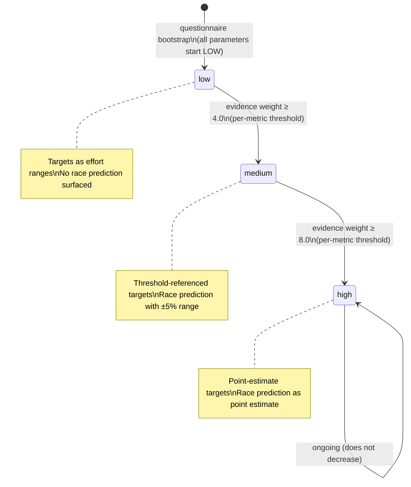

# Confidence Model — How Certainty Flows Through the System

## Purpose

- Defines per-metric confidence levels for each physiological parameter (LT1, LT2, CP, VO2max)
- Specifies the global confidence level derived from key metrics for simple consumers
- Specifies evidence-weight-based transition thresholds and how confidence propagates downstream
- Explains how each evidence source contributes to confidence for specific metrics

> **Vision rationale:** Confidence is a trust mechanism, not a performance metric. The twin never pretends to know more than it does. False precision destroys trust permanently — an athlete who receives a precise threshold target that turns out to be wrong trusts the coach less than one told "this is an estimate based on limited data." Conservative coaching language, target ranges rather than point estimates, and cautious plan structures are the natural output of a low-evidence-confidence twin. This is an invariant, not a UX choice. See `docs/vision/twin/confidence-and-uncertainty.md#the-core-principle`.

> **For the athlete-facing experience of cold start and onboarding tier definitions, see [cold-start.md](../../vision/twin/cold-start.md).**

## Onboarding Tiers vs. Data Tiers

The system uses two distinct "tier" concepts that are orthogonal to each other:

| Concept | Source | Meaning | Values |
|---------|--------|---------|--------|
| **Onboarding Tier** | Vision (`cold-start.md`) | What data was available at onboarding to bootstrap the twin | 3 tiers: imported history, peer-similar/lab, questionnaire only |
| **Data Tier** | Architecture (`data-tiers.md`) | What sensors and hardware the athlete uses during training | 6 tiers: power+RR, power+optical, RR-only, chest strap, optical HR, manual |

These are independent dimensions. A Tier 1 onboarding athlete (imported history) could train with Tier 4 hardware (optical HR, no power). A Tier 3 onboarding athlete (questionnaire only) could train with Tier 1 hardware (power meter + chest strap).

**Confidence transitions depend on data tier capabilities** (what signals are available for evidence accumulation), not on onboarding tier. Onboarding tier determines the starting point; data tier determines the rate and ceiling of evidence accumulation.

## TypeScript Schema

```typescript
type TwinConfidenceLevel = 'low' | 'medium' | 'high'

type ConfidenceTransition = {
  from: TwinConfidenceLevel
  to: TwinConfidenceLevel
  trigger: ConfidenceTransitionTrigger
  metric: string                          // which metric is transitioning
  evidence_weight: number                 // accumulated evidence weight at transition
  requirements: string
}

type ConfidenceTransitionTrigger =
  | 'evidence_threshold_met'             // accumulated evidence weight crossed threshold
  | 'lab_test_ingested'                  // lab test provides immediate high-weight evidence
  | 'field_test_ingested'                // field test provides medium-weight evidence

// Per-metric confidence breakdown on TwinState
// Each derived from respective AthletePhysiology parameter prior weight
// This is the PRIMARY confidence mechanism
type TwinMetricConfidence = {
  lt1_hr: TwinConfidenceLevel
  lt1_power: TwinConfidenceLevel | null    // null if no power data
  lt1_pace: TwinConfidenceLevel | null     // null if no pace data
  lt2_hr: TwinConfidenceLevel
  lt2_power: TwinConfidenceLevel | null      // null if no power data
  lt2_pace: TwinConfidenceLevel | null       // null if no pace data
  cp: TwinConfidenceLevel | null              // null if no power data
}

// Global confidence level derived from key metrics
// Used for simple consumers (plan structure, race prediction availability)
// Derived as the minimum confidence of LT1 HR and LT2 HR
type GlobalConfidenceLevel = {
  level: TwinConfidenceLevel
  derived_from: ('lt1_hr' | 'lt2_hr')[]   // which metrics determined this level
}

// Evidence weight thresholds for confidence transitions
// These are initial defaults based on observation weights
const CONFIDENCE_THRESHOLDS = {
  low_to_medium: 4.0,    // evidence units needed for MEDIUM
  medium_to_high: 8.0    // evidence units needed for HIGH
}

// Evidence weights by source (how much each source contributes to confidence)
const EVIDENCE_WEIGHTS = {
  questionnaire_estimate: 0.5,
  training_hr_deflection: 1.0,     // contributes to lt1_hr and lt2_hr
  training_rr_inflection: 2.5,     // contributes to lt1_hr and lt2_hr (higher quality)
  training_power_hr_ratio: 1.5,    // contributes to cp
  field_test: {
    lt1: 2.0,                      // if field test targets LT1
    lt2: 4.0,                      // if field test targets LT2
    cp: 5.0                        // if field test targets CP
  },
  lab_test: {
    lt1: 12.0,
    lt2: 15.0,
    cp: 10.0,
    vo2max: 15.0
  }
}
```

## State Transitions



Global Confidence Level

The global `confidence_level` on TwinState is derived as the **minimum confidence of LT1 HR and LT2 HR**. This provides a simple signal for consumers that don't need per-metric detail.

> ⚠️ **Design Note — When to Use Global vs Per-Metric Confidence**
>
> `confidence_level` (global) = `min(LT1 HR, LT2 HR)`. This is a convenience
> signal for consumers that need a single readiness gate — plan structure,
> race prediction availability, first-message language tier.
>
> `metric_confidence` (per-metric) is the primary mechanism. Use it when the
> consumer acts on a specific metric: workout targeting (uses LT2 pace/power
> confidence), checkpoint scheduling (targets weak metrics), post-workout
> analysis (names exact thresholds).
>
> **Decision rule:** If the consumer's behaviour changes based on which
> metric is uncertain, use per-metric. If the consumer needs a single
> "is this athlete ready for precise coaching?" gate, use global.

| Global Level | Meaning | Used By |
|--------------|---------|---------|
| LOW | At least one of LT1/LT2 is LOW | Plan structure, race prediction gate |
| MEDIUM | Both LT1 and LT2 are at least MEDIUM | Threshold-referenced coaching |
| HIGH | Both LT1 and LT2 are HIGH | Point-estimate coaching |

## Confidence Level Definitions

> **Communication under uncertainty:** The coach never says "I don't know." Instead, it communicates the boundaries of what it knows through language specificity. The athlete learns to read confidence through the specificity of coaching — more specific language means more data behind it. This builds genuine self-awareness rather than blind compliance. The four language tiers are: "Based on what you've described..." (Tier 3 cold start), "Your recent sessions suggest..." (low evidence confidence), "Your data shows..." (medium evidence confidence), "Your threshold is..." (high evidence confidence). See `docs/vision/twin/confidence-and-uncertainty.md#communication-under-uncertainty`.

### LOW
**When:** Initial state after onboarding. All athletes start here regardless of onboarding tier. See "Initial Confidence by Onboarding Tier" below for expected transition trajectories.
**Threshold estimates:** From age-graded population norms. Unreliable for individual precision.
**Coaching language:** Conservative. Targets expressed as effort descriptions ("easy aerobic effort") and ranges ("5:30–5:50/km"). Never precise numbers.
**Race prediction:** Not surfaced. `GET /athletes/{id}/prediction` returns 204.
**Plan structure:** Conservative session volumes. Long recovery buffers.

### Initial Confidence by Onboarding Tier

| Onboarding Tier | Initial Global Confidence | Expected Path to MEDIUM | Expected Path to HIGH | Rationale |
|-----------------|---------------------------|------------------------|----------------------|-----------|
| Tier 1 (imported history) | LOW (transitions fast) | 1–3 sessions | 4–8 sessions | Imported data bootstraps priors with real physiological data. Evidence weight starts below 4.0 but accumulates quickly from first sessions. |
| Tier 2 (lab test uploaded) | MEDIUM for tested metrics; LOW for untested | Immediate for tested metrics | 4–8 sessions for untested metrics | Lab test provides 12–15 evidence units, immediately exceeding the 4.0 threshold for tested metrics. Untested metrics still need real training data. |
| Tier 2 (peer-similar only) | LOW | 4–6 sessions | 8–12 sessions | Peer models provide better priors than questionnaire alone but still require real training data for meaningful confidence. |
| Tier 3 (questionnaire only) | LOW | 6–10 sessions | 12–20 sessions | Age-graded population norms only. Requires the most real training data to accumulate evidence. |

> **Note:** These are estimates based on evidence weight thresholds (4.0 for MEDIUM, 8.0 for HIGH) and typical observation weights. Actual transition speed depends on data tier capabilities (sensor quality) and training volume. These should be validated against real convergence data — see open questions below.

### Transition Velocity by Data Tier

Data tier determines what signals are available for evidence accumulation, which directly affects how quickly confidence transitions occur:

> **Vision rationale:** Data quality affects the rate of evidence accumulation. Athletes with chest straps and power meters accumulate evidence faster than those with optical HR only. Lab tests accelerate the process significantly. The twin is transparent about which data quality tier it is working with. See `docs/vision/twin/confidence-and-uncertainty.md#how-confidence-evolves`.

| Data Tier | Available Signals | Evidence Rate | Impact on Confidence |
|-----------|-------------------|---------------|---------------------|
| Tier 1 (power + chest strap RR) | HR deflection, RR inflection, power-to-HR ratio | Fastest | All metrics accumulate evidence simultaneously |
| Tier 2 (power + optical HR) | HR deflection, power-to-HR ratio (no RR) | Fast | CP and power-based metrics accumulate faster than HR-only metrics |
| Tier 3 (chest strap RR, no power) | HR deflection, RR inflection | Medium | LT1/LT2 HR accumulate; no CP or power confidence |
| Tier 4 (chest strap or optical HR) | HR deflection only | Slow | LT1/LT2 HR accumulate slowly; no RR, no power |
| Tier 5–6 (no HR or manual) | None | None | No confidence accumulation from training data |

### MEDIUM
**When:** When accumulated evidence weight for a metric reaches 4.0 (approximately 4 HR deflection sessions at weight 1.0 each, or 1 lab test at weight 12-15, or 1 field test at weight 2-4).
**Threshold estimates:** Have moved from population norms toward real data. MEDIUM confidence means the Bayesian prior has been meaningfully updated by observations.
**Coaching language:** Threshold-referenced. Targets can reference threshold estimates (e.g. "target 10 seconds per km below your threshold pace"). Expressed as ranges.
**Race prediction:** Surfaced with explicit ±5% range framing.
**Plan structure:** More precisely calibrated to the athlete's actual threshold data.

### HIGH
**When:** When accumulated evidence weight for a metric reaches 8.0 (approximately 8 HR deflection sessions, or 2 RR sessions at weight 2.5 each + 3 HR sessions, or 1 field test at weight 4.0 + 4 HR sessions, or 1 lab test at weight 12-15).
**Threshold estimates:** Sufficient data density for reliable point estimates. The Bayesian posterior has converged.
**Coaching language:** Precise. Point estimates used. Coach can make specific claims about threshold pace, zones, targets.
**Race prediction:** Surfaced as a point estimate.
**Plan structure:** Fully personalised to demonstrated threshold values.

Per-Metric Confidence

Confidence is **per-metric**, not global. Each physiological parameter accumulates evidence independently:

- **LT1 HR**: Evidence from HR deflection analysis, RR inflection, MAF tests, lab tests
- **LT2 HR**: Evidence from HR deflection analysis, RR inflection, field tests, lab tests
- **CP**: Evidence from power-to-HR ratio, CP tests, lab tests
- **LT1/LT2 Power**: Evidence from power-based sessions, lab tests
- **LT1/LT2 Pace**: Evidence from pace-based sessions (derived from HR/power correlation)

A lab test for LT2 provides evidence for LT2, not LT1. A field test for LT2 provides evidence for LT2, not LT1. The system tracks evidence accumulation per metric.

## Confidence Does Not Decrease

Confidence ratchets upward only. It does not decrease even if the athlete stops training for an extended period.

**Rationale:** The threshold estimates may drift as fitness changes, but the Bayesian prior's data density does not un-accumulate. What changes is the prior decay — older observations carry less weight, making the estimate less certain — but this is handled within the Bayesian update formula, not by downgrading the confidence enum.

> **Vision rationale:** Evidence does not disappear when an athlete takes time off; the data remains valid even if the athlete has detrained. What changes is recommendation strength and calibration freshness, not the underlying evidence confidence. The system handles two distinct scenarios differently:
>
> - **Data staleness:** When an athlete stops training or data becomes old, confidence stays at its current level. The prior decay mechanism handles uncertainty within the current confidence level — older observations carry less weight, making the estimate less certain without demoting the level. This avoids jarring coaching language changes from temporary data gaps.
> - **Algorithm improvement:** When a new algorithm improves interpretation, evidence confidence remains unchanged — the data itself has not changed. What changes is estimation certainty: the system's interpretation of that data has become more rigorous.
>
> The distinction is between time (data staleness) and correctness (algorithm improvement). See `docs/vision/twin/confidence-and-uncertainty.md#the-honesty-invariant`.

If a significant fitness disruption (illness, injury, extended break) occurs, a new TwinState is created with the current confidence level. The prior decay in the threshold detection system naturally handles stale estimates.

## Recommendation Strength vs. Evidence Confidence

Recommendation strength is distinct from evidence confidence. It represents how strongly the coach is willing to act on the current model.

| Factor | Effect on Recommendation Strength |
|---|---|
| Stale calibration data | Decreases |
| Poor execution consistency | Decreases |
| Recent calibration signal | Increases |
| High data tier (RR + power) | Increases |

Recommendation strength can decrease while evidence confidence remains constant. An athlete with 500 workouts and lab testing has high evidence confidence. If they disappear for 6 months, their recommendation strength drops because the evidence is stale — but the evidence itself remains valid.

This separation creates an elegant athlete experience:
- **Evidence confidence:** "The system knows a lot about this athlete"
- **Recommendation strength:** "The system is cautious about current recommendations"

> **Implementation note:** This distinction is not yet implemented as a separate concept in the architecture. It is partially captured by the prior decay mechanism within the Bayesian update. When recommendation strength is implemented, it should affect coaching language conservatism, plan structure, and session targeting independently of evidence confidence. See `docs/vision/twin/confidence-and-uncertainty.md#recommendation-strength`.

## Algorithm Improvement Transparency

When the twin's calibration algorithms improve, recent history is reprocessed through the updated methodology. This means the athlete benefits from better threshold detection, improved adaptation modelling, or refined execution analysis without waiting for new data to accumulate.

The reprocessing is transparent. The coach explains what changed and why it matters for training. The athlete sees their targets adjust not because their fitness changed, but because the system's understanding of their fitness became more precise.

Historical coaching decisions are not retroactively modified. The athlete can see what the twin knew at each point in time, even if the twin's knowledge has since improved. This preserves the integrity of the coaching relationship while allowing the system to get smarter over time.

Coaching recommendations are always made using the best understanding available at the time. Improved models may produce more accurate future guidance, but they do not imply previous recommendations were incorrect.

> **Vision rationale:** This transparency maintains trust. The athlete understands that the system is improving, not that it was wrong. See `docs/vision/twin/confidence-and-uncertainty.md#algorithm-improvements`.

## Downstream Effects of Confidence Level

| Consumer | Uses | LOW behaviour | MEDIUM behaviour | HIGH behaviour |
|---|---|---|---|---|
| **TwinState** | `confidence_level` (global) | Conservative coaching language | Threshold-referenced ranges | Point estimates |
| **TwinState** | `metric_confidence` (per-metric) | Null fields for missing metrics | Available metrics with appropriate precision | All available metrics at high precision |
| Workout generation agent | `metric_confidence` for primary metric | Effort descriptions | Threshold-referenced ranges | Threshold-referenced point estimates |
| Post-workout agent | `metric_confidence` per step | Avoids specific claims | Moderate specificity | High specificity; names exact thresholds |
| Plan generation | `confidence_level` (global) | Conservative volumes; more checkpoints | Calibrated to threshold; moderate checkpoints | Fully personalised; fewer checkpoints |
| Checkpoint scheduling | `metric_confidence` to target weak areas | Strongly recommend calibration checkpoints | Recommend calibration for medium-confidence metrics | Skip checkpoints for high-confidence metrics |
| Race prediction endpoint | `confidence_level` (global) | 204 No Content | Returns with ±5% range | Returns point estimate |
| First message agent | `confidence_level` (global) | Acknowledges uncertainty | Moderate confidence language | Can make specific physiological claims |

### Coaching Language by Onboarding Tier × Confidence Level

The intersection of onboarding tier and confidence level determines appropriate coaching language. This ensures honest communication that reflects both what the system knows and how it was bootstrapped:

| Onboarding Tier + Level | Coaching Language | Examples |
|------------------------|-------------------|----------|
| Tier 3 + LOW | Acknowledges questionnaire basis; defers to real data | "Based on what you've described..." / "Let's see how this feels..." / "We'll calibrate as we see your actual data." |
| Tier 2 (peer) + LOW | Acknowledges peer-based estimate; defers to real data | "From athletes like you, we estimate..." / "This is a starting point — your real data will refine it." |
| Tier 2 (lab) + MEDIUM | Acknowledges lab data for tested metrics; notes untested gaps | "Your lab test gives us confidence in [metric]. We're still learning [other metric]." |
| Tier 1 + LOW | Acknowledges imported history; notes current fitness uncertainty | "Your training history gives us a starting point..." / "We're still learning your current fitness level." |
| Any tier + MEDIUM | Threshold-referenced ranges | "Target 10 seconds per km below your threshold pace." / "Your threshold is estimated at 4:30–4:40/km." |
| Any tier + HIGH | Precise point estimates | "Your threshold pace is 4:35/km." / "Target HR: 155 bpm." |

> **Note:** Tier 1 athletes at LOW should use different language than Tier 3 athletes at LOW, even though the confidence level is the same. The onboarding tier provides context about what the system already knows, which affects how uncertainty is communicated.

## Invariants
- `confidence_level` is stored on every `TwinState` record at the time of creation. Derived as the **minimum confidence of LT1 HR and LT2 HR** (global signal for simple consumers).
- `metric_confidence` provides per-metric confidence breakdown on `TwinState`. Each derived from respective `AthletePhysiology` parameter prior weights at snapshot time. This is the **primary** confidence mechanism.
- Confidence is **per-metric**: each physiological parameter accumulates evidence independently. A field test for LT2 increases LT2 confidence, not LT1 confidence.
- Evidence weight thresholds (4.0 for MEDIUM, 8.0 for HIGH) are initial defaults based on observation weights. These should be validated against real convergence data.
- The confidence level of a `TwinState` never changes after creation
- A new `TwinState` record is created when confidence transitions
- `RacePrediction` with `confidence_level = low` is never written — the service returns null

## Runtime Ownership
Owns:
- Transition thresholds (evidence weight thresholds per metric)
- What each level permits in downstream systems
- Global confidence derivation (minimum of LT1 HR and LT2 HR)

Does Not Own:
- How the Bayesian update accumulates evidence → `02-computations/threshold-detection.md`
- Which specific `TwinState` trigger fires → `01-entities/twin-state.md`
- How agents translate confidence into language → `03-agents/`
- How LT1 is detected from natural training → `02-computations/lt1-detection.md` (new)

## Open Questions
- Evidence weight thresholds (4.0 for MEDIUM, 8.0 for HIGH) are initial defaults. These should be validated against real convergence data once sufficient athletes have been onboarded.
- The 42-day prior decay time constant is aligned with aerobic fitness decay in the Banister model. This ensures threshold estimates and fitness scores decay at roughly the same rate.
- LT1 detection is harder than LT2 detection because LT1 is a subtle physiological transition. The system uses passive inference from natural training (HR ceiling, drift analysis, recovery analysis) plus optional active tests (MAF test, controlled progression) to build LT1 confidence.

## Cross-References
- **Vision — confidence and uncertainty rationale (honesty invariant, communication under uncertainty, recommendation strength, algorithm improvements):** `docs/vision/twin/confidence-and-uncertainty.md`
- **Vision — cold start and onboarding tier definitions:** `docs/vision/twin/cold-start.md`
- **Architecture — data tier capabilities and signal hierarchy:** `00-foundations/data-tiers.md`
- **Architecture — threshold detection algorithms (Bayesian update mechanics):** `02-computations/threshold-detection.md`
- **Architecture — LT1 detection from natural training:** `02-computations/lt1-detection.md`
