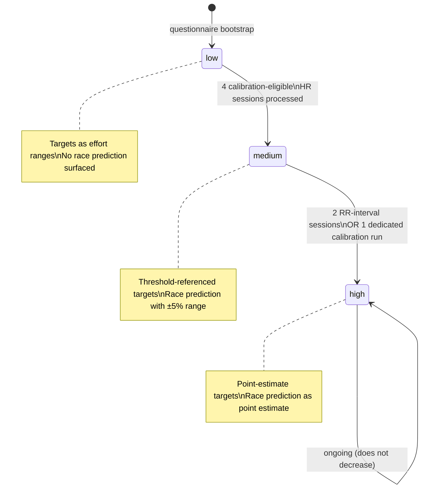

# Confidence Model — How Certainty Flows Through the System

## Purpose
- Defines the three confidence levels and what each permits in coaching output
- Specifies the exact transition thresholds and how confidence propagates downstream

## TypeScript Schema

```typescript
type TwinConfidenceLevel = 'low' | 'medium' | 'high'

type ConfidenceTransition = {
  from: TwinConfidenceLevel
  to: TwinConfidenceLevel
  trigger: ConfidenceTransitionTrigger
  requirements: string
}

type ConfidenceTransitionTrigger =
  | 'four_hr_calibration_sessions'       // LOW → MEDIUM
  | 'two_rr_sessions'                    // MEDIUM → HIGH
  | 'one_dedicated_calibration_run'      // MEDIUM → HIGH

// Per-metric confidence breakdown on TwinState
// Each derived from respective AthletePhysiology parameter prior weight
type TwinMetricConfidence = {
  lt1_hr: TwinConfidenceLevel
  lt1_power: TwinConfidenceLevel | null    // null if no power data
  lt1_pace: TwinConfidenceLevel | null     // null if no pace data
  lt2_hr: TwinConfidenceLevel
  lt2_power: TwinConfidenceLevel | null      // null if no power data
  lt2_pace: TwinConfidenceLevel | null       // null if no pace data
  cp: TwinConfidenceLevel | null              // null if no power data
}
```

## State Transitions



## Confidence Level Definitions

### LOW
**When:** Initial state after questionnaire-only bootstrap. No real training data processed.
**Threshold estimates:** From age-graded population norms. Unreliable for individual precision.
**Coaching language:** Conservative. Targets expressed as effort descriptions ("easy aerobic effort") and ranges ("5:30–5:50/km"). Never precise numbers.
**Race prediction:** Not surfaced. `GET /athletes/{id}/prediction` returns 204.
**Plan structure:** Conservative session volumes. Long recovery buffers.

### MEDIUM
**When:** After four calibration-eligible sessions with HR data have been processed.
**Threshold estimates:** Have moved from population norms toward real data. MEDIUM confidence means the Bayesian prior has been meaningfully updated by at least four observations.
**Coaching language:** Threshold-referenced. Targets can reference threshold estimates (e.g. "target 10 seconds per km below your threshold pace"). Expressed as ranges.
**Race prediction:** Surfaced with explicit ±5% range framing.
**Plan structure:** More precisely calibrated to the athlete's actual threshold data.

### HIGH
**When:** After two RR-interval sessions OR one dedicated calibration run.
**Threshold estimates:** Sufficient data density for reliable point estimates. The Bayesian posterior has converged.
**Coaching language:** Precise. Point estimates used. Coach can make specific claims about threshold pace, zones, targets.
**Race prediction:** Surfaced as a point estimate.
**Plan structure:** Fully personalised to demonstrated threshold values.

## Confidence Does Not Decrease

Confidence ratchets upward only. It does not decrease even if the athlete stops training for an extended period.

**Rationale:** The threshold estimates may drift as fitness changes, but the Bayesian prior's data density does not un-accumulate. What changes is the prior decay — older observations carry less weight, making the estimate less certain — but this is handled within the Bayesian update formula, not by downgrading the confidence enum.

If a significant fitness disruption (illness, injury, extended break) occurs, a new TwinState is created with the current confidence level. The prior decay in the threshold detection system naturally handles stale estimates.

## Downstream Effects of Confidence Level

| Consumer | Uses | LOW behaviour | MEDIUM behaviour | HIGH behaviour |
|---|---|---|---|---|
| **TwinState** | `confidence_level` (coarse) | Conservative coaching language | Threshold-referenced ranges | Point estimates |
| **TwinState** | `metric_confidence` (per-metric) | Null fields for missing metrics | Available metrics with appropriate precision | All available metrics at high precision |
| Workout generation agent | `metric_confidence` for primary metric | Effort descriptions | Threshold-referenced ranges | Threshold-referenced point estimates |
| Post-workout agent | `metric_confidence` per step | Avoids specific claims | Moderate specificity | High specificity; names exact thresholds |
| Plan generation | `confidence_level` (coarse) | Conservative volumes; more checkpoints | Calibrated to threshold; moderate checkpoints | Fully personalised; fewer checkpoints |
| Checkpoint scheduling | `metric_confidence` to target weak areas | Strongly recommend calibration checkpoints | Recommend calibration for medium-confidence metrics | Skip checkpoints for high-confidence metrics |
| Race prediction endpoint | `confidence_level` | 204 No Content | Returns with ±5% range | Returns point estimate |
| First message agent | `confidence_level` | Acknowledges uncertainty | Moderate confidence language | Can make specific physiological claims |

## Invariants
- `confidence_level` is stored on every `TwinState` record at the time of creation. Derived from `AthletePhysiology.lt2.hr.prior_weight` (coarse signal for simple consumers).
- `metric_confidence` provides per-metric confidence breakdown on `TwinState`. Each derived from respective `AthletePhysiology` parameter prior weights at snapshot time.
- The confidence level of a `TwinState` never changes after creation
- A new `TwinState` record is created when confidence transitions
- `RacePrediction` with `confidence_level = low` is never written — the service returns null

## Runtime Ownership
Owns:
- Transition thresholds
- What each level permits in downstream systems

Does Not Own:
- How the Bayesian update accumulates evidence → `02-computations/threshold-detection.md`
- Which specific `TwinState` trigger fires → `01-entities/twin-state.md`
- How agents translate confidence into language → `03-agents/`

## Open Questions
- The transition thresholds (4 HR sessions for MEDIUM, 2 RR for HIGH) are initial defaults. These should be validated against real convergence data once sufficient athletes have been onboarded.
