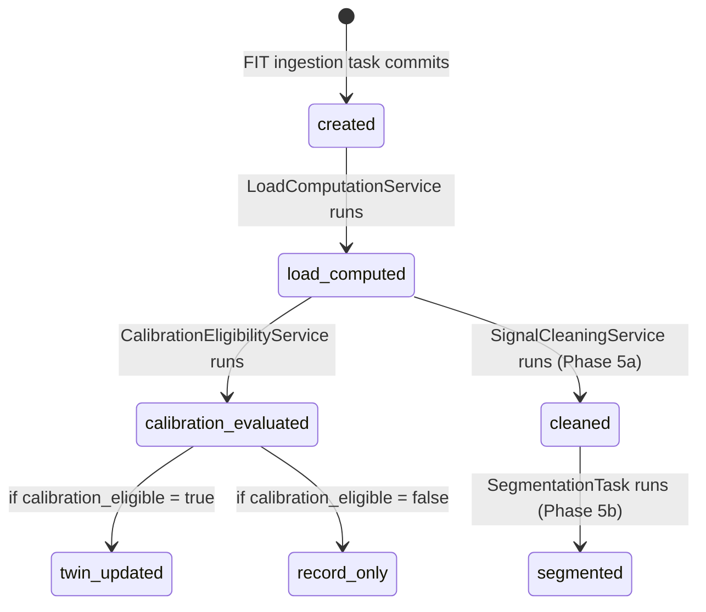

# Activity — Physiological Observation Index

## Purpose
- Lean index record for a single completed training session, storing what the twin needs
- Never stores workout summaries; the FIT file is the source of truth for everything else

## TypeScript Schema

```typescript
type ActivitySource = 'intervals_icu' | 'manual_upload' | 'garmin_direct' | 'manual_entry'

type QualityFlags = {
  hr_dropout_pct?: number           // if > 20%, disqualifies calibration eligibility
  gps_loss?: boolean
  sensor_malfunction?: boolean
  elevated_laxity_risk?: boolean    // ovulatory phase flag (3c)
}

type Activity = {
  id: string                        // UUID, PK
  athlete_id: string                // UUID, FK → Athlete
  planned_session_id: string | null // FK → PlannedSession; null for unplanned
  source: ActivitySource
  external_id: string | null        // source platform ID; for deduplication
  activity_date: string             // YYYY-MM-DD
  start_time: string                // ISO 8601 datetime
  duration_seconds: number

  // Load scores — persisted for query performance (twin reads across weeks of history)
  aerobic_load: number | null       // null for Tier 6; low-confidence for Tier 5
  neuromuscular_load: number | null // null for Tier 5 and 6
  structural_load: number | null    // null for Tier 6

  // Signal availability
  has_hr: boolean
  has_rr_intervals: boolean
  has_power: boolean

  // Calibration
  calibration_eligible: boolean
  quality_flags: QualityFlags

  // Reprocessing anchor — REQUIRED for all non-manual-entry sources
  fit_file_key: string | null       // null ONLY for source = 'manual_entry'

  // Versioning
  ingestion_pipeline_version: string | null
  cleaning_pipeline_version: string | null  // set after 5a cleaning pipeline runs
  notes: string | null
  created_at: string
}
```

## Invariants
- `fit_file_key` is REQUIRED and never null for any source other than `manual_entry`. The ingestion task must store the FIT file in object storage before creating the Activity record. If storage fails, no Activity is created and the task retries.
- `avg_hr`, `avg_pace`, `avg_power`, `avg_cadence`, `lap_data` — these fields do not exist on `Activity`. They are never added.
- `aerobic_load`, `neuromuscular_load`, `structural_load` are null at initial creation and populated by `LoadComputationService` synchronously within the ingestion task.
- `calibration_eligible` is set by `CalibrationEligibilityService` and never manually overridden.
- Source `manual_entry` activities always have `calibration_eligible = false`, null load scores, and null `fit_file_key`. These are not error conditions.
- Deduplication: `(athlete_id, external_id, source)` is unique where `external_id` is non-null. Duplicate ingestion attempts for the same external session create one Activity.

## State Transitions



## Events

### Produced
| Event | Trigger | Version | Payload |
|---|---|---|---|
| `activity_ingested` | Activity record created | v1 | `{activity_id, date, duration, has_hr, has_rr, has_power, fit_file_key}` |
| `activity_calibration_eligible` | calibration_eligible set true | v1 | `{activity_id, aerobic_load, neuromuscular_load, structural_load}` |

### Consumed
| Event | Action | Version |
|---|---|---|
| `session_completed` | Sets `planned_session_id` FK | v1 |

## APIs

```yaml
POST /athletes/{athlete_id}/activities/upload
Request: multipart/form-data
  file: FIT file, required
  planned_session_id?: UUID
Response: 202 Accepted
  task_id: string  # track ingestion progress
Auth: Bearer JWT, require_self

POST /athletes/{athlete_id}/activities
Request: (manual entry)
  source: 'manual_entry'
  activity_date: string
  duration_seconds: number
  planned_session_id?: UUID
  has_hr?: boolean
  notes?: string
Response: 201
  activity: ActivityResponse
Auth: Bearer JWT, require_self

GET /athletes/{athlete_id}/activities
Query:
  from?: date
  to?: date
  limit?: number (default 20, max 100)
  offset?: number
Response: 200
  activities: ActivityResponse[]
  total: number
Auth: Bearer JWT, require_self

GET /athletes/{athlete_id}/activities/{activity_id}
Response: 200
  activity: ActivityResponse
Auth: Bearer JWT, require_self
```

## Storage Model
| Data | Strategy | Consistency | Retention |
|---|---|---|---|
| `activities` table | append-only (no UPDATE after load scores written) | strong | indefinite |
| Raw FIT file | object storage, immutable | eventual | indefinite |
| Cleaned stream | object storage, immutable | eventual | indefinite |

## Mutation Rules
| Layer | Read | Write | Delete |
|---|---|---|---|
| API | Yes | Via upload/manual endpoints only | No |
| Service | Yes | Load scores, calibration flag, version fields only | No |
| Repository | Yes | Yes | No |

## Runtime Ownership
Owns:
- The lean observation index
- The `fit_file_key` reprocessing anchor
- Calibration eligibility flag

Does Not Own:
- Load score formulas → `02-computations/load-computation.md`
- Segmentation records → `01-entities/physiological-segment.md`
- Execution analysis → `01-entities/execution-observation.md`
- Session lifecycle (planned_session_id linkage) → `01-entities/planned-session.md`

## Idempotency
- FIT file ingestion is idempotent for the same `(athlete_id, external_id, source)` — second call returns the existing Activity
- Manual FIT upload: if the same file is uploaded twice, deduplication relies on the athlete to check; no automatic deduplication for `source = manual_upload`

## Authorization
- All endpoints require `require_self`: JWT athlete_id must match path athlete_id
- Activity data is never shared between athletes

## Failure Semantics
- Object storage failure during FIT upload → task retries; no Activity record created; 202 Accepted returns a task_id; athlete can poll for status
- `LoadComputationService` failure → Activity exists with null load scores; retry scheduled; `calibration_eligible` remains false until recomputed
- FIT parsing failure (corrupt file) → Activity NOT created; 422 returned to caller with parse error detail

## Performance Constraints
Synchronous API latency:
- `POST /activities/upload`: p95 < 500ms (async; just stores file and enqueues task)
- `GET /activities`: p95 < 200ms
- `GET /activities/{id}`: p95 < 50ms

Asynchronous operations:
- Full ingestion pipeline (parse + load + clean): p95 < 30s
- Segmentation task: p95 < 60s (runs after cleaning)

## Observability
Metrics:
- `activity.ingested.total`: by source
- `activity.calibration_eligible.rate`: percentage of ingested activities that are eligible
- `activity.ingestion.latency_ms`: time from FIT upload to load scores written
- `activity.fit_parse.failures`: count of corrupt/unreadable files
Logs:
- `activity.ingested`: activity_id, source, has_hr, has_rr, has_power, calibration_eligible
- `activity.fit_parse.failed`: athlete_id, source, error_type
Traces:
- `ingestion_pipeline`: fit_received → object_storage → parse → load_compute → calibration → twin_update

## Implementation Notes
- The `fit_file_key` pattern `fit-files/{athlete_id}/{activity_date}/{uuid}.fit` ensures activities are retrievable by athlete without a DB query
- Load scores are indexed on the `activities` table because `TwinRecalibrationService` queries them with a rolling window (e.g. last 90 days) — this passes the reprocessing test
- The `cleaning_pipeline_version` null → non-null transition is the signal that a `RawSensorStream` has been created for this activity
