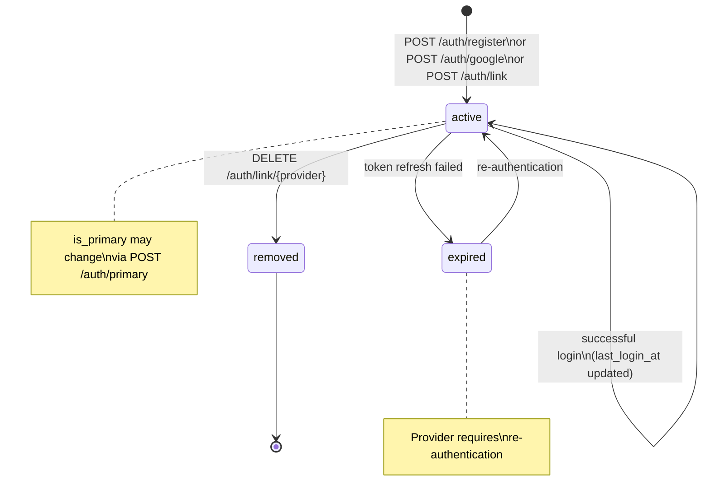

# AthleteAuth

## Purpose

- Stores authentication credentials and provider state for each athlete
- Abstracts authentication method (email/password, Google, Strava) from the core identity entity
- Enables multi-provider authentication and account linking without mutating the Athlete entity
- Owns credential lifecycle: creation, validation, token refresh, revocation

## TypeScript Schema

```typescript
type AuthProvider = 'email' | 'google' | 'strava'

type AthleteAuth = {
  id: string                          // UUID, PK
  athlete_id: string                  // UUID, FK → Athlete
  provider: AuthProvider              // authentication method
  provider_user_id: string | null     // provider-specific user ID (Google sub, Strava athlete_id)
  hashed_password: string | null      // bcrypt; null for OAuth providers
  provider_tokens: AuthTokens | null  // encrypted JSON; null for email provider
  is_primary: boolean                 // primary auth method for login
  last_login_at: string | null        // ISO 8601; updated on each login
  created_at: string                  // ISO 8601
  updated_at: string                  // ISO 8601
}

type AuthTokens = {
  access_token: string                // provider access token
  refresh_token: string | null        // provider refresh token
  expires_at: string | null           // ISO 8601; when access_token expires
  scope: string | null                // granted scopes
}

type AthleteAuthCreateRequest = {
  provider: AuthProvider
  email?: string                      // required for email provider
  password?: string                   // required for email provider; min 8 chars
  id_token?: string                   // required for Google provider
  provider_user_id?: string           // required for Strava provider
  provider_tokens?: AuthTokens        // required for Strava provider
}

type AthleteAuthLinkRequest = {
  provider: AuthProvider
  email?: string
  password?: string
  id_token?: string
  provider_user_id?: string
  provider_tokens?: AuthTokens
}

type AthleteAuthResponse = {
  id: string
  provider: AuthProvider
  is_primary: boolean
  last_login_at: string | null
  created_at: string
  // hashed_password, provider_tokens, provider_user_id never included
}
```

## Invariants

- One `AthleteAuth` record per `(athlete_id, provider)`. An athlete cannot link the same provider twice.
- `hashed_password` is never returned by any API endpoint or included in any log. Encrypted at rest.
- `provider_tokens` is never returned by any API endpoint or included in any log. Encrypted at rest.
- `provider_user_id` is never returned in API responses. Used for OAuth account matching only.
- Exactly one `AthleteAuth` record per athlete must have `is_primary = true`. Primary cannot be removed without reassigning.
- Email provider requires `hashed_password` (bcrypt). Google provider requires `provider_tokens`. Strava provider requires both `provider_tokens` and `provider_user_id`.
- OAuth tokens are refreshed transparently. A failed refresh marks the provider as requiring re-authentication.

## State Transitions



## Events

### Produced
| Event | Trigger | Version | Payload |
|---|---|---|---|
| `athlete_registered` | Athlete + AthleteAuth created (POST /auth/register or /auth/google) | v1 | `{auth_provider, has_password, profile_completed}` |
| `athlete_logged_in` | Successful login validation | v1 | `{auth_provider, token_type, ip_address, user_agent}` |
| `auth_method_added` | New AthleteAuth record created | v1 | `{provider, is_primary, has_password}` |
| `auth_method_removed` | AthleteAuth record deleted | v1 | `{provider, remaining_methods, was_primary}` |

### Consumed
None.

## APIs

```yaml
# Registration endpoints (create Athlete + AthleteAuth + AthleteProfile atomically)
POST /auth/register
Request:
  email: string, required, valid email
  password: string, required, min 8 chars
  profile: { date_of_birth, sex, height_cm?, weight_kg? }
Response: 201
  athlete: AthleteResponse
  access_token: string
  refresh_token: string
Note: Creates Athlete, AthleteAuth (provider=email), and AthleteProfile in single transaction.

POST /auth/google
Request:
  id_token: string, required  # Google ID token from client-side OAuth flow
  profile: { date_of_birth, sex, height_cm?, weight_kg? }
Response: 201
  athlete: AthleteResponse
  access_token: string
  refresh_token: string
Note: Validates id_token with Google, extracts email/sub, creates Athlete + AthleteAuth + AthleteProfile.

POST /auth/strava
Request:
  code: string, required  # Strava authorization code from client-side OAuth flow
  profile: { date_of_birth, sex, height_cm?, weight_kg? }
Response: 201
  athlete: AthleteResponse
  access_token: string
  refresh_token: string
Note: Exchanges code for tokens with Strava API, creates Athlete + AthleteAuth + AthleteProfile.

# Login endpoint
POST /auth/login
Request:
  email: string, required
  password: string, required
Response: 200
  athlete: AthleteResponse
  access_token: string
  refresh_token: string
Note: Validates credentials against AthleteAuth record. Returns 401 on failure.

POST /auth/login/google
Request:
  id_token: string, required
Response: 200
  athlete: AthleteResponse
  access_token: string
  refresh_token: string
Note: Validates Google id_token, matches provider_user_id to existing AthleteAuth.

# Token refresh
POST /auth/refresh
Request:
  refresh_token: string, required
Response: 200
  access_token: string
  refresh_token: string

# Account linking (requires authenticated athlete)
POST /athletes/{athlete_id}/auth/link
Request:
  provider: AuthProvider, required
  password?: string               # required for email provider
  id_token?: string               # required for Google provider
  provider_user_id?: string       # required for Strava provider
  provider_tokens?: AuthTokens    # required for Strava provider
Response: 201
  auth_method: AthleteAuthResponse
Auth: Bearer JWT, require_self
Note: Returns 409 if provider already linked. Returns 422 if required fields missing for provider.

DELETE /athletes/{athlete_id}/auth/link/{provider}
Response: 204
Auth: Bearer JWT, require_self
Note: Returns 409 if attempting to remove last auth method or primary without reassignment.

# Auth method management
GET /athletes/{athlete_id}/auth/methods
Response: 200
  auth_methods: AthleteAuthResponse[]  # credentials excluded
Auth: Bearer JWT, require_self

PATCH /athletes/{athlete_id}/auth/primary
Request:
  provider: AuthProvider, required
Response: 200
  auth_methods: AthleteAuthResponse[]
Auth: Bearer JWT, require_self
Note: Sets the specified provider as primary. Old primary becomes non-primary.

# Password management
PATCH /athletes/{athlete_id}/auth/password
Request:
  current_password: string, required
  new_password: string, required, min 8 chars
Response: 200
Auth: Bearer JWT, require_self
Note: Only for email provider. Returns 404 if no email provider linked.
```

## Storage Model

| Data | Strategy | Consistency | Retention |
|---|---|---|---|
| `athlete_auths` table | mutable | strong | indefinite |

**Indexes:**
- `UNIQUE (athlete_id, provider)` — one record per provider per athlete
- `INDEX (provider_user_id)` — OAuth account lookup (nullable; only set for OAuth providers)

## Mutation Rules

| Layer | Read | Write | Delete |
|---|---|---|---|
| API | Yes (excluding credentials) | POST link, PATCH password/primary | DELETE unlink |
| Service | Yes (including credentials) | Yes | Yes |
| Repository | Yes | Yes | Yes |

## Runtime Ownership

Owns:
- Authentication credentials (hashed_password, provider_tokens)
- Provider identity mapping (provider_user_id)
- Primary auth method designation
- Last login timestamp

Does Not Own:
- Athlete identity (email, onboarding status) → `01-entities/athlete.md`
- JWT token signing and verification → `03-agents/` (auth service)
- Third-party platform credentials (intervals.icu, Garmin) → `01-entities/athlete-integration.md`

## Failure Semantics

- Registration with duplicate email → 409 Conflict; no partial state created
- Google id_token validation failure → 401 Unauthorized
- Strava token exchange failure → 502 Bad Gateway (upstream provider error)
- Link already-connected provider → 409 Conflict
- Unlink last auth method → 409 Conflict
- Password validation failure → 401 Unauthorized (no timing leak; constant-time comparison)
- OAuth token refresh failure → marks provider as expired; athlete must re-authenticate

## Performance Constraints

- `POST /auth/register`: p95 < 300ms (creates Athlete + AthleteAuth + AthleteProfile atomically)
- `POST /auth/login`: p95 < 200ms (bcrypt verification)
- `POST /auth/refresh`: p95 < 100ms (token signing only)
- `POST /auth/link`: p95 < 200ms
- `GET /auth/methods`: p95 < 50ms

## Observability

Metrics:
- `athlete.auth.registrations.total`: count of new registrations by provider
- `athlete.auth.logins.total`: count of successful logins by provider
- `athlete.auth.logins.failed.total`: count of failed login attempts
- `athlete.auth.methods.linked.total`: count of linked auth methods by provider
- `athlete.auth.methods.removed.total`: count of removed auth methods by provider
- `athlete.auth.oauth.refresh.failures.total`: count of OAuth token refresh failures

Logs:
- `athlete.registered`: athlete_id, auth_provider, has_password (never log email or credentials)
- `athlete.logged_in`: athlete_id, auth_provider, success (never log credentials)
- `auth_method.linked`: athlete_id, provider
- `auth_method.removed`: athlete_id, provider

## Implementation Notes

- Registration atomically creates `Athlete` + `AthleteAuth` + `AthleteProfile` in a single database transaction. If any part fails, all roll back.
- `hashed_password` uses bcrypt with cost factor ≥12. Never stored in plaintext.
- `provider_tokens` are encrypted at rest using application-layer encryption (AES-256-GCM). The encryption key is not stored in the database.
- OAuth token refresh is handled transparently by a background task. If refresh fails, the `AthleteAuth` record is not deleted — it is marked as requiring re-authentication.
- The `require_self` FastAPI dependency validates `JWT.athlete_id === path.athlete_id`. It does not validate auth provider — all providers use the same authorization model.
- JWT claims include `athlete_id` and optionally `auth_provider`. The `auth_provider` claim is informational and does not affect authorization logic.
