# AthletePhysiology — Physiological Parameter Estimates

## Purpose
- Stores the current best estimate of the athlete's stable physiological parameters
- Maintains the full measurement history that produced each estimate
- The authoritative source of LT1, LT2, CP, VO2max, and max HR for all downstream consumers

## TypeScript Schema

```typescript
type ThresholdDimension = 'hr' | 'power' | 'pace'

type PhysiologyParameterState = {
  value: number                        // posterior mean estimate
  uncertainty: number                  // posterior uncertainty (drives range width)
  prior_weight: number                 // accumulated evidence weight (drives confidence transitions)
  dominant_source: MeasurementSource   // source currently dominating the posterior
  last_observation_date: string        // date of most recent observation
}

type AthletePhysiology = {
  id: string                           // UUID, PK
  athlete_id: string                   // UUID, FK → Athlete, one-to-one
  
  lt1: {
    hr: PhysiologyParameterState | null
    power: PhysiologyParameterState | null
    pace: PhysiologyParameterState | null
  }
  
  lt2: {
    hr: PhysiologyParameterState | null
    power: PhysiologyParameterState | null
    pace: PhysiologyParameterState | null
  }
  
  cp: PhysiologyParameterState | null           // Critical Power (running)
  
  vo2max: {
    ml_kg_min: PhysiologyParameterState | null
    power: PhysiologyParameterState | null
  }
  
  max_hr: PhysiologyParameterState | null
  
  updated_at: string
}

type MeasurementSource =
  | 'questionnaire_estimate'   // Tier 3 bootstrap from age/fitness_level population norms
  | 'training_hr_deflection'   // HR deflection analysis from calibration-eligible session
  | 'training_rr_inflection'   // HRV inflection from RR intervals — higher quality than HR deflection
  | 'training_power_hr_ratio'  // Power-to-HR ratio breakpoint — supplementary; CP only
  | 'field_test'               // Structured field protocol (time trial, critical power test)
  | 'lab_test'                 // Gold standard: lactate profile, VO2max direct measurement
```

### Multi-Dimensional Thresholds

LT1 and LT2 are physiological states, not signal values. They can be expressed in multiple signal types:

```
LT2 (physiological state)
  ├── HR expression:    172 bpm
  ├── Power expression: 285 watts (if power meter available)
  └── Pace expression:  4:05/km GAP (from GAP model)
```

The athlete's physiology doesn't change based on which sensor you're reading. But the *expression* of that physiology in signal units does change.

### Critical Power (CP)

CP is the primary performance anchor for runners with power meters. LT2 is the primary physiological anchor. When direct LT2 power estimation is unavailable, CP may be used as a proxy.

The relationship between CP and LT2:
- CP is a performance proxy for LT2 power — approximately equal for well-trained athletes
- LT2 is the physiological anchor — ranges derive from LT2
- CP is the performance reference — for training targets and comparison
- If only CP is available, treat it as LT2_power with an explicit note that it's an approximation

## Invariants
- One `AthletePhysiology` record per athlete. **Mutable current-state entity** — posterior estimates are updated in place on each threshold detection event. Historical state is captured in `TwinState` (inline values). The full measurement history is in `PhysiologyMeasurement` (append-only).
- `cp` and `vo2max` are null until a qualifying observation is made. They are never bootstrapped from questionnaire estimates — the uncertainty would be too high to be useful.
- `max_hr` is bootstrapped from `220 - age` at onboarding. It updates from observed maximum HR across sessions and is often the most accurate estimate for experienced athletes.
- `dominant_source` on each parameter reflects the source that currently dominates the posterior. For a recently lab-tested athlete this is `lab_test`; for a well-trained athlete with no lab data this is `training_rr_inflection`.
- `prior_weight` decays over time via the formula above. After ~3 years with no new observations, the prior weight approaches zero — the system becomes appropriately uncertain and reverts toward more conservative coaching language.
- **Audit Gap: `dominant_source` Transition History Not Captured** — `dominant_source` reflects the source currently dominating the posterior (e.g., `lab_test`, `training_rr_inflection`). When Bayesian updates shift the dominant source, the transition is **not recorded**. **Available for audit:** `PhysiologyMeasurement` (raw observations, append-only) and `TwinState` (inline snapshot of parameter states at each trigger). **Missing:** Which source dominated at each step, and why the weighting shifted. **Future enhancement:** When `dominant_source` changes, persist the transition (from → to → evidence_weight → trigger) as either a new field on `PhysiologyMeasurement` or a dedicated `dominant_source_transitions` table. Low priority — current snapshots in `TwinState` allow reconstruction with effort.

## State Transitions

```mermaid
stateDiagram-v2
    [*] --> bootstrapped : questionnaire_estimate\n(all parameters; low weight)
    bootstrapped --> training_calibrated : training_hr_deflection or\ntraining_rr_inflection\n(evidence weight ≥ 4.0 → MEDIUM confidence)
    training_calibrated --> training_calibrated : ongoing training updates\n(slow posterior drift)
    training_calibrated --> field_calibrated : field_test observation\n(dominant source shifts)
    training_calibrated --> lab_calibrated : lab_test observation\n(dominant source shifts strongly)
    field_calibrated --> lab_calibrated : lab_test supersedes
    lab_calibrated --> training_calibrated : prior decays over ~18 months\n(lab weight < training accumulated weight)
```



## Events

### Produced
| Event | Trigger | Version | Payload |
|---|---|---|---|
| `physiology_updated` | Any parameter posterior shifts > 1 unit | v1 | `{athlete_id, parameters_updated: PhysiologyParameter[], dominant_sources: Record<string, MeasurementSource>}` |
| `physiology_lab_test_ingested` | lab_test measurement created | v1 | `{athlete_id, parameters_measured: PhysiologyParameter[], notes}` |

### Consumed
| Event | Action | Version |
|---|---|---|
| `activity_calibration_eligible` | Triggers `ThresholdDetectionService` → `PhysiologyUpdateService` | v1 |

## APIs

```yaml
GET /athletes/{athlete_id}/physiology
Response: 200
  physiology: AthletePhysiologyResponse
  # Includes parameter states but not full measurement history
Auth: Bearer JWT, require_self

GET /athletes/{athlete_id}/physiology/measurements
Query:
  parameter?: PhysiologyParameter
  source?: MeasurementSource
  from?: date
  to?: date
  limit?: number (default 50)
Response: 200
  measurements: PhysiologyMeasurementResponse[]
Auth: Bearer JWT, require_self

POST /athletes/{athlete_id}/physiology/measurements
Description: Enter lab test, field test, or manual measurement results
Request:
  measurements:
    - parameter: PhysiologyParameter, required
      observed_value: number, required
      source: MeasurementSource, required  # field_test or lab_test only; training sources are auto-detected
      measurement_date: string, required
      raw_data_reference?: string
      notes?: string
Response: 201
  measurements: PhysiologyMeasurementResponse[]
  updated_physiology: AthletePhysiologyResponse
  recalibration_triggered: boolean
Auth: Bearer JWT, require_self
Note: source must be 'field_test' or 'lab_test' for manual entry.
      Training-derived sources are created automatically by ThresholdDetectionService.
```

## Storage Model

| Data | Strategy | Consistency | Retention |
|---|---|---|---|
| `athlete_physiology` table | mutable (posterior updated in place) | strong | indefinite |
| `physiology_measurements` table | append-only | strong | indefinite |

Unique constraint: `(athlete_id)` — one record per athlete.

Historical physiology state is captured in `TwinState` records (inline snapshot values). The full measurement history is in `physiology_measurements` (append-only).

## Mutation Rules

| Layer | Read | Write | Delete |
|---|---|---|---|
| API | Yes | POST /measurements only | No |
| Service | Yes | upsert (physiology), insert (measurements) | No |
| Repository | Yes | Yes | No |

## Runtime Ownership

Owns:
- Current posterior estimates for all physiological parameters
- Full measurement history (source, weight, date)
- The Bayesian update computation

Does Not Own:
- How training sessions produce observations → `02-computations/threshold-detection.md`
- Fitness and fatigue Banister scores → `01-entities/athlete-fitness.md`
- TwinState assembly → `01-entities/twin-state.md`

## Idempotency

- Submitting identical lab test measurements twice creates two `PhysiologyMeasurement` records but shifts the posterior only once from the first. The second is a duplicate that does not trigger recalibration (detected by: same `parameter`, `observed_value`, `measurement_date`, `source`).

## Failure Semantics

- `PhysiologyUpdateService` failure → `PhysiologyMeasurement` still written; posterior not updated; retry scheduled; existing estimates remain valid
- Invalid measurement value (e.g. LT2 < LT1) → 422 with specific validation error; no record written

## Performance Constraints

- `GET /physiology`: p95 < 30ms
- `POST /physiology/measurements` (with recalibration): p95 < 500ms (recalibration is async)

## Observability

Metrics:
- `athlete_physiology.dominant_source.distribution`: by parameter (monitors data quality across athlete base)
- `athlete_physiology.lab_test.ingested.total`: count of lab test inputs
- `athlete_physiology.prior_weight.distribution`: by parameter (monitors how well-calibrated athletes are)
Logs:
- `physiology.updated`: athlete_id, parameters_updated, dominant_source_after
- `physiology.lab_test.ingested`: athlete_id, parameters_measured

## Implementation Notes

- The `dominant_source` field is informational — it reflects the source type that currently holds the most weight in the posterior, not the most recent observation. A training session done today does not make `dominant_source = training_hr_deflection` if the prior is still dominated by last month's lab test.
- The prior decay formula uses 42 days as the time constant. This is the same time constant used for aerobic fitness in the Banister model — a deliberate alignment so that threshold estimates and fitness scores decay at roughly the same rate. As fitness drifts, so does the reliability of older threshold observations.
- For onboarding, `max_hr = 220 - age` with weight 0.5 is the bootstrap. It is quickly superseded by the first session where the athlete reaches near-maximum HR. The questionnaire does not ask for max HR directly because self-reported max HR is notoriously inaccurate.
- Bayesian update formula, observation weights by source, and ingestion flows are defined in `02-computations/physiology-update.md`.
- Threshold detection algorithms (how training-derived observations are produced) are defined in `02-computations/threshold-detection.md`.