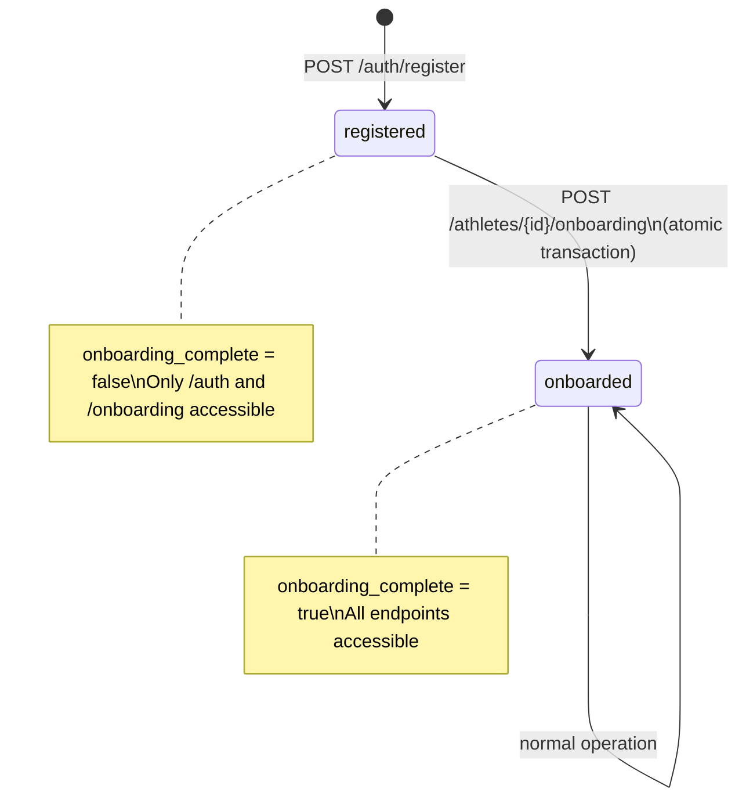

# Athlete — Root Identity Entity

## Purpose
- The root entity for every user in the system; every other entity belongs to an Athlete
- Owns authentication credentials and the onboarding completion gate

## TypeScript Schema

```typescript
type Athlete = {
  id: string                    // UUID, PK
  email: string                 // unique, indexed, lowercase
  onboarding_complete: boolean  // set true atomically with first TwinState creation
  created_at: string            // ISO 8601
}

type AthleteCreateRequest = {
  email: string
  // password is not part of Athlete — it lives in AthleteAuth
}

type AthleteResponse = {
  id: string
  email: string
  onboarding_complete: boolean
  created_at: string
  // authentication credentials are in AthleteAuth, never included here
}
```

## Invariants

- `email` is unique across all athletes. Case-insensitive uniqueness enforced at DB level via unique index on `lower(email)`.
- `onboarding_complete` is set to `true` within the same transaction that creates the first `TrainingGoal`, `TwinState`. If any part fails, it remains `false`.
- An athlete with `onboarding_complete = false` cannot access plan, coaching, or workout endpoints.
- Authentication credentials are stored in `AthleteAuth`, not in `Athlete`. See `01-entities/athlete-auth.md`.

## State Transitions



## Events

### Produced
| Event | Trigger | Version | Payload |
|---|---|---|---|
| `athlete_registered` | Athlete + AthleteAuth created (POST /auth/register or /auth/google) | v1 | `{auth_provider, has_password, profile_completed}` |
| `onboarding_completed` | Onboarding transaction commits | v1 | `{training_goal_id, twin_state_id, data_tier, confidence_level}` |

### Consumed
None. `Athlete` is a root entity with no upstream dependencies.

## APIs

```yaml
POST /auth/register
Description: Creates Athlete + AthleteAuth + AthleteProfile atomically. See 01-entities/athlete-auth.md for full auth API details.
Request:
  email: string, required, valid email
  password: string, required, min 8 chars
  profile: { date_of_birth, sex, height_cm? }
Response: 201
  athlete: AthleteResponse
  access_token: string
  refresh_token: string

GET /athletes/{athlete_id}
Response: 200
  athlete: AthleteResponse
Auth: Bearer JWT, require_self
```

## Storage Model
| Data | Strategy | Consistency | Retention |
|---|---|---|---|
| `athletes` table | mutable | strong | indefinite |

## Mutation Rules
| Layer | Read | Write | Delete |
|---|---|---|---|
| API | Yes | No (use service) | No |
| Service | Yes | Yes (`onboarding_complete` only) | No |
| Repository | Yes | Yes | No (soft-delete only if ever needed) |

## Runtime Ownership

Owns:
- Athlete identity (email, onboarding status)
- Onboarding gate (onboarding_complete flag)

Does Not Own:
- Authentication credentials (password, OAuth tokens) → `01-entities/athlete-auth.md`
- Training preferences → `01-entities/athlete-preferences.md`
- Demographic profile → `01-entities/athlete-profile.md`
- JWT token lifecycle → `03-agents/` (auth service)

## Idempotency
- `POST /auth/register` with an existing email returns 409. No partial state created.

## Authorization

- All `GET /athletes/{athlete_id}` endpoints require `require_self` — the JWT `athlete_id` must match the path parameter
- Authentication credentials are stored in `AthleteAuth` and never included in any Athlete response

## Failure Semantics
- Registration with duplicate email → 409 Conflict
- Onboarding transaction failure → full rollback; `onboarding_complete` remains `false`; 500 with retry guidance

## Performance Constraints
Synchronous API latency:
- `POST /auth/register`: p95 < 300ms
- `GET /athletes/{id}`: p95 < 50ms

## Observability

Metrics:
- `athlete.registrations.total`: count of new registrations by auth provider
- `athlete.onboardings.total`: count of completed onboardings
- `athlete.onboardings.abandoned`: registrations with `onboarding_complete = false` > 24h
- `athlete.auth.login.total`: count of successful logins by provider
- `athlete.auth.login.failed.total`: count of failed login attempts
Logs:
- `athlete.registered`: athlete_id, auth_provider (not email or credentials)
- `athlete.onboarding.completed`: athlete_id, data_tier, confidence_level

## Implementation Notes

- Registration atomically creates `Athlete` + `AthleteAuth` + `AthleteProfile` in a single database transaction. See `01-entities/athlete-auth.md` for auth-specific details.
- The `require_self` FastAPI dependency validates that JWT athlete_id === path athlete_id and returns 403 on mismatch — never 404
- The `require_self` dependency does not validate auth provider — all providers use the same authorization model
