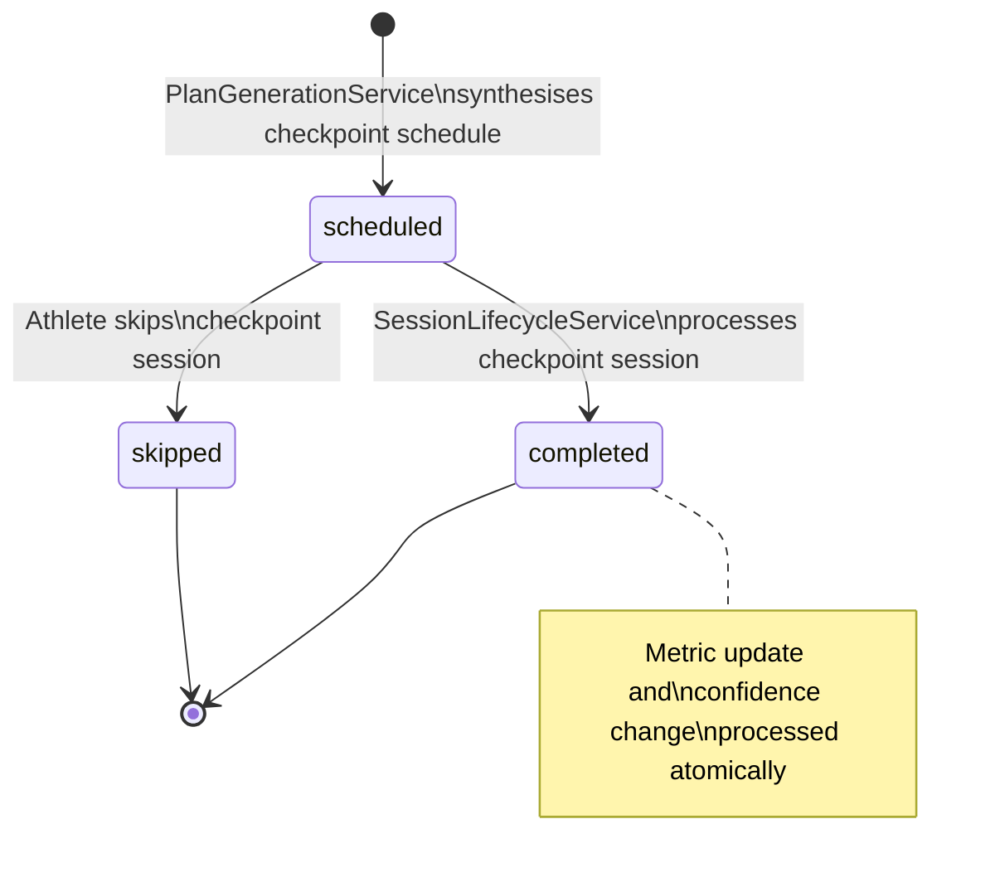

# Checkpoint — Scheduled Assessment
*A scheduled moment of assessment that provides data, reduces uncertainty, and validates progress.*

---

## Purpose
- Represents a planned assessment point within a training plan that targets a specific physiological metric or progress indicator
- Provides a common abstraction for different assessment types (calibration, benchmark, race simulation, secondary race, progress review)

---

## TypeScript Schema

```typescript
type CheckpointType =
  | 'calibration'        // test workout for specific metric
  | 'benchmark'          // standardised progress measurement
  | 'race_simulation'    // race-pace effort without full stress
  | 'secondary_race'     // B-race or C-race as assessment
  | 'progress_review'    // periodic adaptation check

type CheckpointStatus =
  | 'scheduled'          // future; no data collected yet
  | 'completed'          // session performed; data processed
  | 'skipped'            // athlete skipped the checkpoint session

type Checkpoint = {
  id: string                         // UUID, PK
  planned_session_id: string         // UUID, FK → PlannedSession (one-to-one; the session that IS the checkpoint)
  
  // Checkpoint definition
  type: CheckpointType
  target_metric: string              // e.g. "LT2", "aerobic_fitness", "race_readiness"
  secondary_metrics: string[]        // additional metrics we'll learn about
  
  // Expected outcomes
  twin_update_expected: boolean      // will this update twin state?
  replan_trigger: boolean            // will this trigger replanning if confidence changes?
  
  // Status
  status: CheckpointStatus
  
  // Completion data (set when status = completed)
  metric_updated: boolean | null     // did the target metric change?
  confidence_changed: boolean | null  // did confidence level change?
  replan_triggered: boolean | null   // was replanning triggered?
  
  created_at: string                 // ISO 8601
  completed_at: string | null        // ISO 8601; set when status → completed
}
```

---

## Invariants

- **One checkpoint per PlannedSession.** A PlannedSession may be flagged as a checkpoint, but a checkpoint cannot exist without a corresponding PlannedSession. The `training_plan_id` is derived from the PlannedSession's FK — no redundant FK on Checkpoint.
- **Checkpoint type determines expected behaviour.** Calibration checkpoints expect metric updates. Benchmark checkpoints expect progress comparison. Race simulation expects race-pace validation. Secondary race expects race performance data. Progress review expects adaptation signal.
- **Completion fields set atomically.** `metric_updated`, `confidence_changed`, `replan_triggered`, and `completed_at` are set together when status transitions to completed.
- **Checkpoint cannot be created retroactively.** Checkpoints are scheduled during plan synthesis, not after session completion.
- **Overshoot recovery uses static default until individual data is available.** The `+2 day` default applies unless `TwinState.confidence_level = 'high'` AND `AdaptationSignature` has ≥ 3 complete adaptation window observations. This prevents premature personalization from noisy data.

---

## State Transitions



---

## Checkpoint Scheduling Logic

Checkpoints are scheduled during Phase 2 (synthesis) of plan generation based on:

| Factor | Trigger | Example |
|--------|---------|---------|
| **Confidence gaps** | Low/medium confidence in a metric | LT2 confidence = MEDIUM → calibration checkpoint at week 10 |
| **Race calendar** | B/C-races exist in plan | Half-marathon B-race at week 16 → secondary race checkpoint |
| **Phase transitions** | Moving from base to build | Week 8 transition → benchmark checkpoint for aerobic fitness |
| **Regular intervals** | Every 3–4 weeks | Progress review checkpoints at weeks 4, 8, 12, 16 |

---

## Checkpoint Type Behaviours

| Type | Session Type | Primary Purpose | Twin Update | Replan Trigger |
|------|--------------|-----------------|-------------|----------------|
| `calibration` | submaximal_tempo, threshold | Refine specific metric estimate | Yes | Yes (if confidence changes) |
| `benchmark` | long_run_hr_drift, time_trial | Measure progress against baseline | Yes | Possibly |
| `race_simulation` | marathon_pace_long_run | Test readiness without full stress | Yes | Possibly |
| `secondary_race` | (actual race) | Leverage race as assessment | Yes | Yes |
| `progress_review` | weekly_form_check | Periodic adaptation signal | No | No |

---

## Events

### Produced
| Event | Trigger | Version | Payload |
|---|---|---|---|
| `checkpoint_completed` | status → completed | v1 | `{checkpoint_id, planned_session_id, checkpoint_type, target_metric, metric_updated, confidence_changed, replan_triggered}` |

### Consumed
| Event | Action | Version |
|---|---|---|
| `session_completed` | If PlannedSession is a checkpoint, transition checkpoint status | v1 |

---

## APIs

```yaml
GET /athletes/{athlete_id}/plan/checkpoints
Response: 200
  checkpoints: CheckpointResponse[]  # all checkpoints for active plan
Auth: Bearer JWT, require_self

GET /athletes/{athlete_id}/plan/checkpoints/{checkpoint_id}
Response: 200
  checkpoint: CheckpointResponse
Auth: Bearer JWT, require_self
```

---

## Storage Model

| Data | Strategy | Consistency | Retention |
|---|---|---|---|
| `checkpoints` table | append-only (status and completion fields mutable) | strong | indefinite |

Index: `(planned_session_id)` for checkpoint lookup on session completion.
Index: `(type, status)` for filtered checkpoint queries.

---

## Mutation Rules

| Layer | Read | Write | Delete |
|---|---|---|---|
| API | Yes (read-only) | No | No |
| Service | Yes | status, completion fields | No |
| Repository | Yes | Yes | No |

---

## Runtime Ownership

Owns:
- Checkpoint scheduling logic (when and where to place checkpoints)
- Checkpoint status lifecycle
- Metric update and confidence change tracking
- Overshoot recovery rules (extension calculation and effort deviation classification)

Does Not Own:
- Session distribution rules → `02-computations/plan-generation.md`
- Twin metric updates → `01-entities/twin-state.md`
- Plan regeneration logic → `02-computations/plan-generation.md`
- Adaptation observation data → `01-entities/adaptation-observation.md`

---

## Failure Semantics

- Checkpoint completion without PlannedSession found → integrity violation; alert
- Metric update fails → checkpoint marked completed with `metric_updated = false`; standard load update continues
- Replan trigger fires but synthesis fails → checkpoint completed; replan retried on next trigger

---

## Overshoot Recovery Rules

When a checkpoint completes and the athlete's actual effort deviates from prescription, recovery windows are adjusted to reflect actual physiological stress.

### Constants and Overrides

```typescript
// Static default — applied when individual data is insufficient
const OVERSHOOT_RECOVERY_EXTENSION_DAYS = 2

// Eligibility for dynamic override:
// - TwinState.confidence_level = 'high'
// - AdaptationSignature has ≥ 3 complete block observations
// If eligible, extension is scaled by the athlete's observed recovery trajectory
function computeOvershootRecovery(
  athlete_recovery_profile: AdaptationObservation[] | null,
  twin_confidence: TwinConfidenceLevel
): number {
  if (twin_confidence === 'high' && athlete_recovery_profile && athlete_recovery_profile.length >= 3) {
    const avg_recovery_days = mean(athlete_recovery_profile.map(o => o.recovery_trajectory.days_to_baseline_return))
    // Scale: athletes who recover faster get smaller extensions, slower athletes get larger
    // Floor of 1 day, ceiling of 5 days
    return clamp(Math.round(avg_recovery_days * 0.5), 1, 5)
  }
  return OVERSHOOT_RECOVERY_EXTENSION_DAYS
}
```

### Classification Logic

```typescript
type EffortDeviation = 'followed_plan' | 'overshot' | 'undershot'

function classifyEffortDeviation(
  prescribed: SessionType,
  actual_load: number,
  prescribed_load: number
): EffortDeviation {
  const deviation_ratio = actual_load / prescribed_load
  if (deviation_ratio > 1.3) return 'overshot'    // >30% above prescribed load
  if (deviation_ratio < 0.7) return 'undershot'   // >30% below prescribed load
  return 'followed_plan'
}
```

### Recovery Adjustment by Deviation

| Deviation | Recovery Adjustment | Data Quality Impact |
|-----------|--------------------|--------------------|
| `followed_plan` | Standard recovery | Normal calibration value |
| `overshot` | Extended by `computeOvershootRecovery()` days | Normal calibration value (actual stress was higher) |
| `undershot` | Standard recovery | Reduced calibration value (effort below threshold signal) |

### Invariants

- Overshoot recovery extension is applied to the next quality session spacing, not to the session itself
- The extension is communicated to the athlete in plain language by the coach
- Undershot sessions are still processed for twin calibration but flagged as lower confidence observations
- The dynamic override requires both HIGH confidence AND ≥ 3 adaptation block observations; either condition missing falls back to static default

---

## Performance Constraints

- `GET /plan/checkpoints`: p95 < 50ms
- Checkpoint completion processing: p95 < 200ms (async twin update)

---

## Observability

Metrics:
- `checkpoint.completed.total`: by type
- `checkpoint.metric_updated.rate`: metric_updated=true / total completed
- `checkpoint.replan_triggered.rate`: replan_triggered=true / total completed

Logs:
- `checkpoint.completed`: checkpoint_id, type, target_metric, metric_updated, confidence_changed

---

## Implementation Notes

- Checkpoints are scheduled as part of the strategic framework synthesis, not as separate operations.
- A PlannedSession that is a checkpoint has `checkpoint_type` and `checkpoint_metric` fields set on the PlannedSession record itself. The Checkpoint entity is created atomically with the PlannedSession.
- When a checkpoint session completes, `SessionLifecycleService` checks if the PlannedSession is a checkpoint and processes the checkpoint logic accordingly.
- Checkpoint data flows into the twin update pipeline via the existing `session_completed` event. The checkpoint-specific logic (metric update, confidence assessment, replan trigger) is handled by a dedicated checkpoint completion handler.
