# PlannedSession

- One or more records per day in a weekly plan, representing what the plan intends on a given date
- The link between weekly plan structure and both day-of workout generation and activity logging
- Tracks the full lifecycle from pending through completion, skip, miss, or redistribution
- Created by the weekly synthesis agent, not by plan generation
- Sessions may be grouped into blocks (2-3 consecutive quality sessions treated as one compound stimulus for adaptation learning)
- Supports same-day doubles with AM/PM slots and primary/secondary designation

---

## TypeScript Schema

```typescript
type SessionSlot = 'am' | 'pm'

type SessionPriority = 'primary' | 'secondary'

type PlannedSession = {
  id: string                       // UUID, PK
  weekly_plan_id: string           // UUID, FK → WeeklyPlan (weekly synthesis creates these)
  training_plan_id: string         // UUID, FK → TrainingPlan (denormalized for query performance; source of truth is WeeklyPlan.training_plan_id)
  target_date: string              // YYYY-MM-DD
  week_number: number              // 1-indexed; derived from WeeklyPlan
  phase_label: PhaseLabel          // derived from WeeklyPlan.adjusted_intent
  session_type: SessionType        // canonical type enum
  intent_description: string       // plain English; shown in near-term preview
  approximate_duration_minutes: number

  // Checkpoint metadata (set if this session is a checkpoint)
  checkpoint_type: CheckpointType | null   // null = not a checkpoint
  checkpoint_metric: string | null         // primary metric being assessed

  // Status lifecycle
  status: PlannedSessionStatus
  skip_reason: string | null       // set when status → skipped
  redistributed_to_date: string | null  // set when status → redistributed

  // Completion linkage
  activity_id: string | null       // FK → Activity; set when status → completed

  // Slot designation
  session_slot: SessionSlot | null     // null = single session day; 'am'/'pm' = double day
  session_priority: SessionPriority    // default: 'primary'

  // Block membership
  block_id: string | null          // null = standalone session; non-null = part of a block
  block_position: 'first' | 'middle' | 'last' | null  // position within block
  block_session_count: number | null  // total sessions in this block (set on all block members)

  // Non-running session support
  is_suggested: boolean               // true = suggested session (e.g. strength, yoga); false = full workout generated
}
```

---

## Invariants

- **Multiple PlannedSession records per day are allowed.** Uniqueness is enforced on `(weekly_plan_id, target_date, session_slot)` where `session_slot` distinguishes AM/PM sessions.
- **`activity_id` is set only when `status = 'completed'`.**
- **`redistributed_to_date` is set only when `status = 'redistributed'`.** A new `PlannedSession` is created for the target date when redistribution occurs — the original is not moved.
- **Primary sessions receive full workout generation.** Secondary sessions may be suggested without detailed targets (e.g. "Strength & conditioning — 30 min").
- **Recovery time is measured from primary to primary.** Secondary sessions do not reset the recovery clock.
- **Same-day doubles: AM primary + PM secondary is preferred.** This provides adequate recovery between sessions. Reverse ordering (PM primary + AM primary next day) provides longer recovery.

### Block Invariants

- **Block members must be consecutive dates.** Sessions in the same block must occur on consecutive training days.
- **Block members must all be quality sessions.** Rest, recovery_run, and easy sessions cannot be block members.
- **Block cannot span more than 3 sessions.** Prevents abuse of the block concept.
- **Block must include recovery after the last session.** The session following a block's final session must be rest or recovery_run.
- **Block is optional.** Consecutive quality sessions without a block_id are forbidden by the existing structural rule.

### Structural Session Distribution Rules

(Enforced by `WeeklySynthesisAgent` at creation and by `SessionLifecycleService` when redistributing):

- Long runs are always followed by a rest or recovery_run session
- Threshold and vo2max sessions are sandwiched between easy or rest days
- No two quality sessions (`threshold`, `vo2max`, `tempo`, `hill_repeats`, `fartlek`, `long_run`) on consecutive dates **unless they share a `block_id`**. Blocks must include recovery after the final session.

These rules serve dual purposes: they protect training quality (adequate recovery between hard efforts) and they create clean observation windows for adaptation signature learning (uninterrupted recovery signals after compound stimuli).

The `block_id` groups created by these rules are what the adaptation signature layer observes as **adaptation windows** — the atomic unit for adaptation learning. The weekly synthesis agent creates `block_id` groups of 2-3 consecutive quality sessions; the adaptation signature layer then observes the recovery response to those groups. See `01-entities/adaptation-observation.md`.

---

## State Transitions

```mermaid
stateDiagram-v2
    [*] --> pending : created by PlanGenerationService
    pending --> generated : WorkoutGenerationAgent runs
    pending --> redistributed : proactive move before target_date
    generated --> completed : Activity with planned_session_id ingested
    generated --> skipped : athlete signals skip
    generated --> missed : nightly sweep; target_date passed
    skipped --> redistributed : SessionLifecycleService finds window
    skipped --> [*] : load dropped (fatigue/illness)
    missed --> redistributed : athlete decides to make up session
```



---

## Recovery Calculation

Recovery windows are measured from **primary to primary**, not session to session.

| Current Session | Next Session | Recovery Window |
|-----------------|--------------|-----------------|
| Primary | Primary | Full recovery (standard rules) |
| Primary | Secondary | Reduced recovery (same day only) |
| Secondary | Primary | Standard recovery |
| Secondary | Secondary | Minimal (same day doubles) |

This means a double day with AM primary + PM secondary followed by a single primary session the next day provides more recovery than two primary sessions on consecutive days.

---

## Weekly Load Calculation

Weekly load is based on **total athlete availability**, not session count.

- Single session days: load = session load
- Double days: load = sum of both sessions, capped at 1.5× single session maximum

The weekly synthesis agent uses total availability (including doubles capacity) when defining macro weekly load in the phase arc.

---

## Non-Running Sessions

Secondary sessions can be suggested without full workout generation:

- **Running sessions (primary):** Full workout generated with targets
- **Non-running sessions (secondary):** Suggested with type and duration only
  - Examples: "Strength & conditioning — 30 min", "Yoga mobility — 45 min"
  - No `GeneratedWorkout` created
  - `is_suggested = true` flags these sessions

This allows the coach to prescribe non-running work (strength, yoga, mobility) when it serves running goals, without requiring detailed workout design.

---

## Events

### Produced

| Event | Trigger | Version | Payload |
|---|---|---|---|
| `planned_session_generated` | status → generated | v1 | `{planned_session_id, target_date, session_type}` |
| `session_completed` | status → completed | v1 | `{planned_session_id, activity_id, session_type, calibration_eligible, checkpoint_type?, checkpoint_metric?}` |
| `session_skipped` | status → skipped | v1 | `{planned_session_id, skip_reason, redistributed_to_date}` |
| `session_missed` | status → missed (nightly sweep) | v1 | `{planned_session_id, target_date, session_type}` |

### Consumed

| Event | Action | Version |
|---|---|---|
| `activity_ingested` | Matches to planned_session_id if provided; transitions to completed | v1 |
| `workout_generated` | Transitions status pending → generated | v1 |

---

## APIs

```yaml
GET /athletes/{athlete_id}/plan/sessions/{session_id}
Response: 200
  session: PlannedSessionResponse
Auth: Bearer JWT, require_self

POST /athletes/{athlete_id}/plan/sessions/{session_id}/skip
Request:
  reason?: string  # free text; classified by SkipConversationAgent
Response: 202 Accepted
  session: PlannedSessionResponse  # status = skipped
Auth: Bearer JWT, require_self

POST /athletes/{athlete_id}/plan/sessions/{session_id}/redistribute
Request:
  target_date: string  # YYYY-MM-DD; must not violate structural rules
Response: 200
  original_session: PlannedSessionResponse  # status = redistributed
  new_session: PlannedSessionResponse       # status = pending
Auth: Bearer JWT, require_self

GET /athletes/{athlete_id}/plan/sessions/{session_id}/substitutes
Response: 200
  substitutes: WorkoutLibraryEntryResponse[]  # up to 3 options
Auth: Bearer JWT, require_self

POST /athletes/{athlete_id}/plan/sessions/{session_id}/accept-substitute
Request:
  library_entry_id: UUID
Response: 201
  generated_workout: GeneratedWorkoutResponse
Auth: Bearer JWT, require_self
```

---

## Storage Model

| Data | Strategy | Consistency | Retention |
|---|---|---|---|
| `planned_sessions` table | append-only (status/linkage fields mutable) | strong | indefinite |

Index: `(training_plan_id, target_date, session_slot)` for plan retrieval.
Index: `(athlete_id via plan join, status, target_date)` for upcoming session queries.

---

## Mutation Rules

| Layer | Read | Write | Delete |
|---|---|---|---|
| API | Yes | status, skip_reason, redistributed_to_date, activity_id via service | No |
| Service | Yes | All status transitions and linkage fields | No |
| Repository | Yes | Yes | No |

---

## Runtime Ownership

Owns:
- Session lifecycle state machine
- Skip, miss, redistribute transitions
- Linkage between weekly plan and activity
- Block membership for compound stimuli
- Slot and priority designation for doubles

Does Not Own:
- Session distribution rules → `03-agents/weekly-synthesis-agent.md`
- Skip conversation classification → `03-agents/skip-conversation-agent.md`
- Workout library queries → `01-entities/workout-library-entry.md`
- Day-of workout generation → `01-entities/generated-workout.md`

---

## Idempotency

- Transitioning `status` to its current value → 200 no-op
- Redistribution to a date that violates structural rules → 422 with specific rule violated

---

## Failure Semantics

- Redistribution target date creates consecutive quality sessions → 422
- Redistribution target date is in the past → 422
- `session_missed` sweep failure → sessions remain `generated`; swept on next run

---

## Performance Constraints

- `GET /plan/upcoming` (5 sessions): p95 < 50ms
- Skip/redistribute: p95 < 200ms (async classification runs after response)

---

## Observability

Metrics:
- `planned_session.skip_rate`: skipped / (completed + skipped) by session_type
- `planned_session.miss_rate`: missed / (completed + missed + skipped) by phase_label
- `planned_session.redistribution_rate`
Logs:
- `planned_session.skipped`: session_id, session_type, phase_label
- `planned_session.missed`: session_id, session_type, target_date

---

## Implementation Notes

- The structural rules checked during redistribution are the same rules applied during plan generation. `SessionLifecycleService.find_redistribution_window()` runs the same validation.
- The nightly `MissedSessionSweepTask` only transitions sessions with `status = 'generated'` (workout was shown to athlete) — never `pending` sessions that were not yet due.
- When `accept-substitute` is called, a `GeneratedWorkout` is created from the library entry's embedded steps. The `PlannedSession` remains linked to the original planned session — no new PlannedSession is created for a substitution.
- Block membership is set by the weekly synthesis agent during plan creation. The agent identifies consecutive quality sessions and groups them into blocks when appropriate for adaptation learning.
- Same-day doubles are scheduled by the weekly synthesis agent based on athlete availability. The agent respects the preference for AM primary + PM secondary ordering.
