# PlannedSession — Individual Intended Training Session

## Purpose
- One record per session in the training plan, representing what the plan intends on a given date
- The link between plan structure and both day-of workout generation and activity logging
- Tracks the full lifecycle from pending through completion, skip, miss, or redistribution

## TypeScript Schema

```typescript
type PlannedSessionStatus =
  | 'pending'        // future session; no workout generated yet
  | 'generated'      // GeneratedWorkout exists for this session
  | 'completed'      // matching Activity logged; activity_id FK set
  | 'skipped'        // athlete explicitly skipped; skip_reason set
  | 'missed'         // date passed with no activity and no skip signal
  | 'redistributed'  // moved to a different date; redistributed_to_date set

type PlannedSession = {
  id: string                       // UUID, PK
  training_plan_id: string         // UUID, FK → TrainingPlan
  target_date: string              // YYYY-MM-DD
  week_number: number              // 1-indexed within the plan
  phase_label: PhaseLabel          // matches a phase in TrainingPlan.phases
  session_type: SessionType        // canonical type enum
  intent_description: string       // plain English; shown in near-term preview
  approximate_duration_minutes: number

  // Checkpoint metadata (set if this session is a checkpoint)
  checkpoint_type: CheckpointType | null   // null = not a checkpoint
  checkpoint_metric: string | null         // primary metric being assessed

  // Status lifecycle
  status: PlannedSessionStatus
  skip_reason: string | null       // set when status → skipped
  redistributed_to_date: string | null  // set when status → redistributed

  // Completion linkage
  activity_id: string | null       // FK → Activity; set when status → completed
}
```

## Invariants
- One `PlannedSession` per day per plan. A plan never has two sessions on the same day.
- `activity_id` is set only when `status = 'completed'`.
- `redistributed_to_date` is set only when `status = 'redistributed'`. A new `PlannedSession` is created for the target date when redistribution occurs — the original is not moved.
- Structural session distribution rules (enforced by `PlanGenerationService` at creation and by `SessionLifecycleService` when redistributing):
  - Long runs are always followed by a rest or recovery_run session
  - Threshold and vo2max_intervals sessions are sandwiched between easy or rest days
  - No two quality sessions (`threshold`, `vo2max_intervals`, `tempo`, `long_run`) on consecutive dates

## State Transitions

```mermaid
stateDiagram-v2
    [*] --> pending : created by PlanGenerationService
    pending --> generated : WorkoutGenerationAgent runs
    pending --> redistributed : proactive move before target_date
    generated --> completed : Activity with planned_session_id ingested
    generated --> skipped : athlete signals skip
    generated --> missed : nightly sweep; target_date passed
    skipped --> redistributed : SessionLifecycleService finds window
    skipped --> [*] : load dropped (fatigue/illness)
    missed --> redistributed : athlete decides to make up session
```



## Events

### Produced
| Event | Trigger | Version | Payload |
|---|---|---|---|
| `planned_session_generated` | status → generated | v1 | `{planned_session_id, target_date, session_type}` |
| `session_completed` | status → completed | v1 | `{planned_session_id, activity_id, session_type, calibration_eligible, checkpoint_type?, checkpoint_metric?}` |
| `session_skipped` | status → skipped | v1 | `{planned_session_id, skip_reason, redistributed_to_date}` |
| `session_missed` | status → missed (nightly sweep) | v1 | `{planned_session_id, target_date, session_type}` |

### Consumed
| Event | Action | Version |
|---|---|---|
| `activity_ingested` | Matches to planned_session_id if provided; transitions to completed | v1 |
| `workout_generated` | Transitions status pending → generated | v1 |

## APIs

```yaml
GET /athletes/{athlete_id}/plan/sessions/{session_id}
Response: 200
  session: PlannedSessionResponse
Auth: Bearer JWT, require_self

POST /athletes/{athlete_id}/plan/sessions/{session_id}/skip
Request:
  reason?: string  # free text; classified by SkipConversationAgent
Response: 202 Accepted
  session: PlannedSessionResponse  # status = skipped
Auth: Bearer JWT, require_self

POST /athletes/{athlete_id}/plan/sessions/{session_id}/redistribute
Request:
  target_date: string  # YYYY-MM-DD; must not violate structural rules
Response: 200
  original_session: PlannedSessionResponse  # status = redistributed
  new_session: PlannedSessionResponse       # status = pending
Auth: Bearer JWT, require_self

GET /athletes/{athlete_id}/plan/sessions/{session_id}/substitutes
Response: 200
  substitutes: WorkoutLibraryEntryResponse[]  # up to 3 options
Auth: Bearer JWT, require_self

POST /athletes/{athlete_id}/plan/sessions/{session_id}/accept-substitute
Request:
  library_entry_id: UUID
Response: 201
  generated_workout: GeneratedWorkoutResponse
Auth: Bearer JWT, require_self
```

## Storage Model
| Data | Strategy | Consistency | Retention |
|---|---|---|---|
| `planned_sessions` table | append-only (status/linkage fields mutable) | strong | indefinite |

Index: `(training_plan_id, target_date)` for plan retrieval.
Index: `(athlete_id via plan join, status, target_date)` for upcoming session queries.

## Mutation Rules
| Layer | Read | Write | Delete |
|---|---|---|---|
| API | Yes | status, skip_reason, redistributed_to_date, activity_id via service | No |
| Service | Yes | All status transitions and linkage fields | No |
| Repository | Yes | Yes | No |

## Runtime Ownership
Owns:
- Session lifecycle state machine
- Skip, miss, redistribute transitions
- Linkage between plan and activity

Does Not Own:
- Session distribution rules → `02-computations/plan-generation.md`
- Skip conversation classification → `03-agents/skip-conversation-agent.md`
- Workout library queries → `01-entities/workout-library-entry.md`
- Day-of workout generation → `01-entities/generated-workout.md`

## Idempotency
- Transitioning `status` to its current value → 200 no-op
- Redistribution to a date that violates structural rules → 422 with specific rule violated

## Failure Semantics
- Redistribution target date creates consecutive quality sessions → 422
- Redistribution target date is in the past → 422
- `session_missed` sweep failure → sessions remain `generated`; swept on next run

## Performance Constraints
- `GET /plan/upcoming` (5 sessions): p95 < 50ms
- Skip/redistribute: p95 < 200ms (async classification runs after response)

## Observability
Metrics:
- `planned_session.skip_rate`: skipped / (completed + skipped) by session_type
- `planned_session.miss_rate`: missed / (completed + missed + skipped) by phase_label
- `planned_session.redistribution_rate`
Logs:
- `planned_session.skipped`: session_id, session_type, phase_label
- `planned_session.missed`: session_id, session_type, target_date

## Implementation Notes
- The structural rules checked during redistribution are the same rules applied during plan generation. `SessionLifecycleService.find_redistribution_window()` runs the same validation.
- The nightly `MissedSessionSweepTask` only transitions sessions with `status = generated` (workout was shown to athlete) — never `pending` sessions that were not yet due.
- When `accept-substitute` is called, a `GeneratedWorkout` is created from the library entry's embedded steps. The `PlannedSession` remains linked to the original planned session — no new PlannedSession is created for a substitution.
