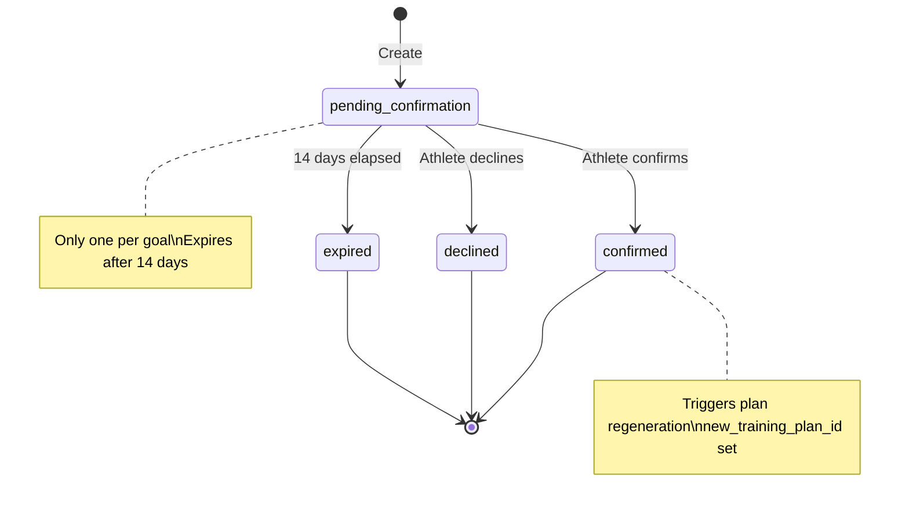

# RegenerationTask

A coordination entity that manages coach-driven proposals to change a `TrainingGoal`'s `goal_event_date`. Implements a two-step confirmation flow (Propose → Confirm) to ensure strategic date changes are transparent, rationale-driven, and explicitly accepted by the athlete.

## Purpose

-   **Enforce Authority Boundary:** Prevents direct mutation of `target_performance` goal dates via `PATCH`. Requires a coach-driven proposal and athlete confirmation.
-   **Capture Rationale:** Stores the plain-language explanation for *why* the date is changing (e.g., "Trajectory ahead — gap analysis shows you're 2 weeks early").
-   **Audit Trail:** Records who proposed the change, when, why, and whether the athlete accepted or declined.
-   **Trigger Plan Regeneration:** Upon confirmation, triggers `PlanGenerationService` to supersede the old plan and create a new one with the adjusted timeline.

## Schema

```typescript
type RegenerationTaskStatus =
  | 'pending_confirmation'  // Proposal sent; waiting for athlete response
  | 'confirmed'             // Athlete accepted; plan regenerated
  | 'declined'              // Athlete rejected; task closed
  | 'expired'               // No response after 14 days; task closed

type RegenerationTrigger =
  | 'trajectory_ahead'      // Athlete progressing faster than planned; pull date forward
  | 'trajectory_at_risk'    // Athlete behind schedule; push date back
  | 'coach_conversation'    // Manual adjustment requested via coach-athlete dialogue

type RegenerationTask = {
  id: string                     // UUID, PK
  training_goal_id: string       // UUID, FK → TrainingGoal (active goal)
  athlete_id: string             // UUID, FK → Athlete (denormalized for querying)

  // Proposal Details
  proposed_date: string          // YYYY-MM-DD; the new target goal_event_date
  rationale: string              // Plain English; surfaced to athlete in confirmation UI
  trigger: RegenerationTrigger   // What initiated this proposal

  // Lifecycle
  status: RegenerationTaskStatus
  proposed_at: string            // ISO 8601; when coach/system proposed
  proposed_by: string | null     // 'system' (auto-triggered) or coach_id (if manual)
  confirmed_at: string | null    // ISO 8601; when athlete confirmed
  confirmed_by: string | null    // athlete_id (who confirmed)
  declined_at: string | null     // ISO 8601; when athlete declined
  expired_at: string | null      // ISO 8601; auto-closed after 14 days

  // Execution Result
  new_training_plan_id: string | null  // UUID, FK → TrainingPlan (set on confirmation)
  superseded_plan_id: string | null    // UUID, FK → TrainingPlan (the old plan)
}
```

## Design Rationale: Two-Step Confirmation

Strategic date changes for `target_performance` goals are **not** administrative updates. They alter the periodization structure, phase durations, and checkpoint schedule. The two-step flow ensures:

1.  **Transparency:** The athlete sees *why* the date is being proposed (the `rationale`).
2.  **Agency:** The athlete can decline if the new date doesn't fit their life (e.g., travel, work conflicts).
3.  **Auditability:** Every change has a recorded rationale and explicit consent.
4.  **Safety:** Prevents accidental or automated changes without human review.

### Expiration Policy
Proposals expire after **14 days**. This prevents stale proposals from being confirmed months later when the athlete's context has changed. If a proposal expires, the coach must re-evaluate the trajectory and issue a new proposal if still valid.

## Invariants

### 1. One Active Proposal Per Goal
Only **one** `RegenerationTask` with `status = 'pending_confirmation'` can exist per `training_goal_id` at any time.
-   Attempting to create a second pending task returns `409 Conflict`.
-   The existing proposal must be confirmed, declined, or expired before a new one is created.

### 2. Immutable Proposal Details
Once created, `proposed_date`, `rationale`, and `trigger` are **immutable**.
-   If the coach wants to change the proposal, they must let the current one expire (or cancel it) and create a new one.
-   This preserves the audit trail of what was actually proposed.

### 3. Status Transition Rules

-   **No reverts:** Once `confirmed`, `declined`, or `expired`, the task cannot return to `pending_confirmation`.
-   **No skipping:** Cannot transition directly from `pending_confirmation` to `expired` without time elapsed (enforced by service logic).

### 4. Plan Regeneration Atomicity
When a task is confirmed:
-   `PlanGenerationService` regenerates the plan **within the same transaction** as the status update.
-   `new_training_plan_id` and `superseded_plan_id` are set atomically.
-   If plan regeneration fails, the confirmation is rolled back (task remains `pending_confirmation`).

### 5. Goal State Dependency
-   Can only be created for `TrainingGoal` with `status = 'active'`.
-   If the goal is closed (`completed`/`abandoned`) while a task is pending, the task is automatically transitioned to `expired`.

## Events

### Produced

| Event | Trigger | Version | Payload |
|---|---|---|---|
| `regeneration_task_proposed` | Task created with `status=pending_confirmation` | v1 | `{task_id, training_goal_id, athlete_id, proposed_date, rationale, trigger, expires_at}` |
| `regeneration_task_confirmed` | Athlete confirms; plan regenerated | v1 | `{task_id, training_goal_id, new_training_plan_id, superseded_plan_id, confirmed_at}` |
| `regeneration_task_declined` | Athlete declines | v1 | `{task_id, training_goal_id, declined_at}` |
| `regeneration_task_expired` | 14 days elapsed without response | v1 | `{task_id, training_goal_id, expired_at}` |

### Consumed

| Event | Action | Version |
|---|---|---|
| `training_goal_closed` | If goal is closed while task is pending, transition task to `expired` | v1 |

## APIs

### Propose (Coach or System)

```yaml
POST /athletes/{athlete_id}/goals/{goal_id}/coach-propose-date-change
Description: Creates a pending RegenerationTask. Only one pending task allowed per goal.
Request:
  proposed_date: string (YYYY-MM-DD), required
  rationale: string, required  # Plain English; e.g., "You're ahead of schedule..."
  trigger: 'trajectory_ahead' | 'trajectory_at_risk' | 'coach_conversation', required
  proposed_by?: 'system' | string  # Defaults to 'system'; set to coach_id if manual
Response: 202 Accepted
  regeneration_task: {
    id: string
    proposed_date: string
    rationale: string
    trigger: RegenerationTrigger
    status: 'pending_confirmation'
    proposed_at: string
    expires_at: string  // proposed_at + 14 days
  }
Failure:
  409 Conflict: If another pending task already exists for this goal.
  422 Unprocessable Entity: If proposed_date is in the past or < 7 days from now.
Auth: Bearer JWT, require_coach_or_self  # Coach can propose; athlete can request via conversation

GET /athletes/{athlete_id}/goals/{goal_id}/regeneration-tasks
Description: Returns all regeneration tasks for this goal (pending, confirmed, declined, expired).
Query:
  status?: RegenerationTaskStatus  # Filter by status
  limit?: number  # Default 20
Response: 200
  tasks: RegenerationTaskResponse[]  # Ordered by proposed_at desc
Auth: Bearer JWT, require_self
```

### Confirm or Decline (Athlete)

```yaml
POST /athletes/{athlete_id}/goals/{goal_id}/coach-confirm-date-change
Description: Confirms or declines a pending proposal.
Request:
  regeneration_task_id: string, required
  confirmed: boolean, required
Response:
  If confirmed: 200 OK
    regeneration_task: {
      id: string
      status: 'confirmed'
      confirmed_at: string
      new_training_plan_id: string
      superseded_plan_id: string
    }
    new_training_plan: TrainingPlanResponse  # Included for convenience
  If declined: 200 OK
    regeneration_task: {
      id: string
      status: 'declined'
      declined_at: string
    }
Failure:
  404 Not Found: If task_id doesn't exist or doesn't belong to this athlete.
  422 Unprocessable Entity: If task is not in 'pending_confirmation' status.
Auth: Bearer JWT, require_self  # Only the athlete can confirm/decline
```

## Storage Model

| Data | Strategy | Consistency | Retention |
|---|---|---|---|
| `regeneration_tasks` table | Append-only (status mutable) | Strong | Indefinite |

**Indexes:**
-   `CREATE UNIQUE INDEX idx_regeneration_tasks_pending ON regeneration_tasks (training_goal_id) WHERE status = 'pending_confirmation';` (Enforces one active proposal)
-   `CREATE INDEX idx_regeneration_tasks_athlete ON regeneration_tasks (athlete_id, proposed_at DESC);` (For athlete history view)
-   `CREATE INDEX idx_regeneration_tasks_expiry ON regeneration_tasks (status, proposed_at) WHERE status = 'pending_confirmation';` (For expiration sweep task)

## Background Tasks

### Expiration Sweep
**Trigger:** Scheduled daily at 00:00 UTC.
**Logic:**
```python
def expire_stale_proposals():
    cutoff = now() - timedelta(days=14)
    stale_tasks = repo.find_by_status_and_date('pending_confirmation', before=cutoff)
    for task in stale_tasks:
        task.status = 'expired'
        task.expired_at = now()
        repo.save(task)
        EventBus.publish('regeneration_task_expired', {...})
```
**Observability:** Metric `regeneration_task.expired.total` tracks volume.

## Observability

**Metrics:**
-   `regeneration_task.proposed.total`: By `trigger` type.
-   `regeneration_task.confirmed.rate`: Percentage of proposals accepted (confirmed / (confirmed + declined + expired)).
-   `regeneration_task.expired.total`: Count of proposals that timed out.
-   `regeneration_task.latency.confirmation_ms`: Time from proposal to confirmation (histogram).

**Logs:**
-   `regeneration_task.proposed`: `athlete_id`, `goal_id`, `trigger`, `proposed_date`, `rationale` (truncated).
-   `regeneration_task.confirmed`: `athlete_id`, `goal_id`, `task_id`, `new_plan_id`.
-   `regeneration_task.declined`: `athlete_id`, `goal_id`, `task_id`.
-   `regeneration_task.expired`: `athlete_id`, `goal_id`, `task_id`, `days_pending`.

**Alerts:**
-   **High Expiration Rate:** Alert if `expired` rate > 30% over 7 days (may indicate proposals are unrealistic or athletes are disengaged).
-   **Stagnant Proposals:** Alert if any task remains `pending_confirmation` > 15 days (expiration sweep may be failing).

## Cross-References

-   **Training Goal:** `01-entities/training-goal.md` (defines the `coach-propose-date-change` API).
-   **Plan Generation:** `02-computations/plan-generation.md` (triggered on confirmation to regenerate plan).
-   **Decision Authority:** `docs/vision/coach/decision-authority.md` ("Plan Modification Authority").
-   **Event Catalogue:** `00-foundations/event-catalogue.md` (event schemas).