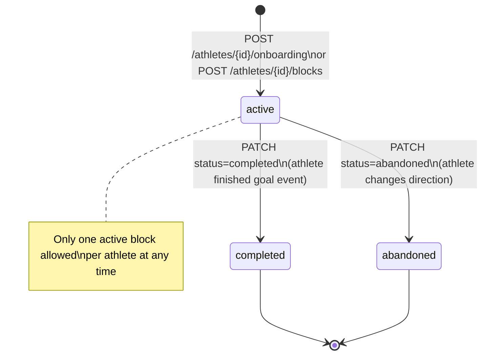

# TrainingBlock — Goal Context Container

## Purpose
- Holds the athlete's current training goal and self-reported fitness context
- The temporal container for a TrainingPlan; one active block per athlete at a time
- Append-only: semantic fields are immutable after creation; only status transitions

## TypeScript Schema

```typescript
type GoalType =
  | 'race_event'        // periodised toward specific goal; peaking, tapering, race-specific preparation
  | 'fitness_improvement' // active development; progressive overload; measurable gains
  | 'maintenance'       // consistency-focused; habit preservation; fitness preservation
  | 'recovery'          // healing-focused; conservative load; protective coaching

type GoalEventType =
  | 'marathon' | 'half_marathon' | '10k' | '5k'
  | 'ultra' | 'trail_race' | 'custom'

type TrainingBlockStatus = 'active' | 'completed' | 'abandoned'

type TrainingBlock = {
  id: string                         // UUID, PK
  athlete_id: string                 // UUID, FK → Athlete

  // Goal definition — immutable after creation
  goal_type: GoalType
  goal_event_type: GoalEventType | null   // null when goal_type ≠ 'race_event'
  goal_event_name: string | null
  goal_event_date: string | null     // YYYY-MM-DD; null for non-race_event goal types
  custom_distance_km: number | null  // > 0; only when goal_event_type = 'custom'
  goal_description: string | null    // free text; surfaced to first message agent

  // Self-reported context at creation — immutable after creation
  weekly_volume_hours: number        // >= 0; CHECK constraint
  weekly_volume_km: number           // >= 0; CHECK constraint
  fitness_level: number              // 1–5; CHECK constraint; feeds Tier 3 bootstrap
  recent_injury: string | null       // free text; surfaced to plan generation

  // Recovery context — required when goal_type = 'recovery'
  injury_severity: InjurySeverity | null  // null for other goal types

  // Status — the only mutable fields
  status: TrainingBlockStatus
  created_at: string                 // ISO 8601
  closed_at: string | null           // set when status → completed or abandoned
}
```

## Invariants
- **One active block per athlete.** Enforced by a partial unique index on `(athlete_id) WHERE status = 'active'`. Attempting to create a second active block returns 409 Conflict. The caller must explicitly close the existing block first.
- **Semantic fields are immutable after creation.** `goal_type`, `goal_event_type`, `goal_event_date`, `custom_distance_km`, `weekly_volume_hours`, `weekly_volume_km`, `fitness_level`, `recent_injury`, `injury_severity` cannot be changed via PATCH. If the athlete's situation changes materially, a new block captures the new context.
- **PATCH is restricted to** `status`, `goal_event_date`, and `goal_description` only. `goal_event_date` is an exception to the immutability rule because races get rescheduled; it triggers plan regeneration if the change is > 7 days.
- **Recovery mode requires injury_severity.** `injury_severity` is mandatory when `goal_type = 'recovery'`.
- No DELETE. Status transitions to `completed` or `abandoned` are the end state.
- `fitness_level` (1–5) feeds the Tier 3 twin bootstrap in `TwinBootstrapService`. It is the athlete's self-assessment and is never updated automatically.

## State Transitions



## Events

### Produced
| Event | Trigger | Version | Payload |
|---|---|---|---|
| `training_block_created` | Block inserted with status=active | v1 | `{training_block_id, goal_type, goal_event_type, goal_event_date, fitness_level}` |

### Consumed
| Event | Action | Version |
|---|---|---|
| `onboarding_completed` | Block already created; triggers plan generation | v1 |

## APIs

```yaml
POST /athletes/{athlete_id}/blocks
Description: Creates a new TrainingBlock. Returns 409 if one is already active.
Request:
  goal_type: GoalType, required
  goal_event_type?: GoalEventType
  goal_event_date?: string (YYYY-MM-DD)
  goal_event_name?: string
  custom_distance_km?: number
  goal_description?: string
  weekly_volume_hours: number, required
  weekly_volume_km: number, required
  fitness_level: number (1–5), required
  recent_injury?: string
  injury_severity?: 'minor' | 'moderate' | 'major'  # required when goal_type = 'recovery'
Response: 201
  training_block: TrainingBlockResponse
Auth: Bearer JWT, require_self

GET /athletes/{athlete_id}/blocks/active
Response: 200 | 404
  training_block: TrainingBlockResponse
Auth: Bearer JWT, require_self

PATCH /athletes/{athlete_id}/blocks/{block_id}
Request:
  status?: 'completed' | 'abandoned'
  goal_event_date?: string  # triggers plan regen if delta > 7 days
  goal_description?: string
Response: 200
  training_block: TrainingBlockResponse
Auth: Bearer JWT, require_self

GET /athletes/{athlete_id}/blocks
Response: 200
  blocks: TrainingBlockResponse[]  # all blocks, ordered by created_at desc
Auth: Bearer JWT, require_self
```

## Storage Model
| Data | Strategy | Consistency | Retention |
|---|---|---|---|
| `training_blocks` table | append-only (status mutable) | strong | indefinite |

Partial unique index: `CREATE UNIQUE INDEX ON training_blocks (athlete_id) WHERE status = 'active'`

## Mutation Rules
| Layer | Read | Write | Delete |
|---|---|---|---|
| API | Yes | status, goal_event_date, goal_description only | No |
| Service | Yes | All fields at creation; status/date/description after | No |
| Repository | Yes | Yes | No |

## Runtime Ownership
Owns:
- Goal context for plan generation and first message agent
- Active block enforcement (one per athlete)

Does Not Own:
- Plan generation logic → `02-computations/plan-generation.md`
- TwinState bootstrap values → `02-computations/load-computation.md`
- TrainingPlan that belongs to this block → `01-entities/training-plan.md`

## Idempotency
- Creating a block when one is already active → 409 (no partial state created)
- PATCH with the same `status` it already has → 200 (no-op)

## Failure Semantics
- `POST /blocks` with conflicting active block → 409 Conflict with message identifying the existing active block
- `PATCH` attempting to modify an immutable field → 422 Unprocessable Entity
- `PATCH status=completed` on an already-completed block → 422

## Performance Constraints
- `GET /blocks/active`: p95 < 50ms (indexed on athlete_id WHERE status='active')
- `POST /blocks`: p95 < 200ms

## Observability
Metrics:
- `training_block.created.total`: by goal_type (race_event, fitness_improvement, maintenance, recovery)
- `training_block.completed.total`
- `training_block.abandoned.total`
Logs:
- `training_block.created`: athlete_id, goal_type, goal_event_type, fitness_level
- `training_block.closed`: athlete_id, block_id, status, duration_days

## Implementation Notes
- The partial unique index on `(athlete_id) WHERE status = 'active'` enforces the constraint at the database level without application-layer race conditions
- `recent_injury` free text is passed verbatim to `PlanGenerationService` as a constraint — it is not parsed or classified
- The `goal_event_date` exception to immutability is intentional: races get postponed or changed. The 7-day delta gate prevents constant noise plan regenerations from minor date adjustments.
