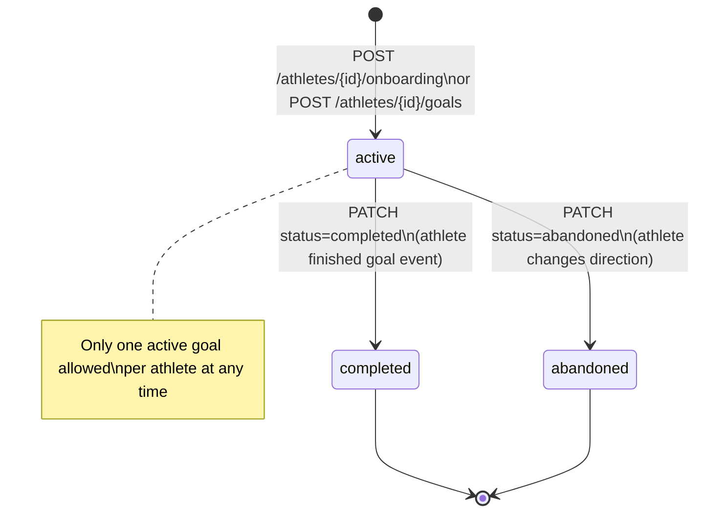

# Training Goal

- Holds the athlete's current training goal and self-reported fitness context
- The temporal container for a TrainingPlan; one active goal per athlete at a time
- Append-only: semantic fields are immutable after creation; only status transitions

---

## TypeScript Schema

```typescript
type GoalType =
  | 'race_event'        // periodised toward specific goal; peaking, tapering, race-specific preparation
  | 'fitness_improvement' // active development; progressive overload; measurable gains
  | 'maintenance'       // consistency-focused; habit preservation; fitness preservation
  | 'recovery'          // healing-focused; conservative load; protective coaching

type GoalEventType =
  | 'marathon' | 'half_marathon' | '10k' | '5k'
  | 'ultra' | 'trail_race' | 'custom'

type TrainingGoalStatus = 'active' | 'completed' | 'abandoned'

type SecondaryEventType =
  | 'half_marathon' | '10k' | '5k' | 'trail_race'

type SecondaryEventPriority = 'B' | 'C'

type SecondaryEvent = {
  id: string                      // UUID, PK
  training_goal_id: string       // UUID, FK → TrainingGoal
  event_type: SecondaryEventType
  event_date: string              // YYYY-MM-DD
  event_name: string | null
  priority: SecondaryEventPriority
}

type TrainingGoal = {
  id: string                         // UUID, PK
  athlete_id: string                 // UUID, FK → Athlete

  // Goal definition — immutable after creation
  goal_type: GoalType
  goal_event_type: GoalEventType | null   // null when goal_type ≠ 'race_event'
  goal_event_name: string | null
  goal_event_date: string | null     // YYYY-MM-DD; null for non-race_event goal types
  custom_distance_km: number | null  // > 0; only when goal_event_type = 'custom'
  goal_description: string | null    // free text; surfaced to first message agent

  // Secondary events — mutable; max 3 per goal
  secondary_events: SecondaryEvent[]

  // Self-reported context at creation — immutable after creation
  weekly_volume_hours: number        // >= 0; CHECK constraint
  weekly_volume_km: number           // >= 0; CHECK constraint
  fitness_level: number              // 1–5; CHECK constraint; feeds Tier 3 bootstrap
  recent_injury: string | null       // free text; surfaced to plan generation

  // Recovery context — required when goal_type = 'recovery'
  injury_severity: InjurySeverity | null  // null for other goal types

  // Intermediate goal — set when training length gate triggers
  intermediate_goal: IntermediateGoal | null

  // Status — the only mutable fields
  status: TrainingGoalStatus
  created_at: string                 // ISO 8601
  closed_at: string | null           // set when status → completed or abandoned
}

type IntermediateGoal = {
  description: string                         // plain English; e.g. "12-week aerobic base block"
  physiological_objectives: string[]          // e.g. ["aerobic_fitness", "threshold_power", "structural_resilience"]
  duration_weeks: number                      // 8–12 weeks
}
```

---

## Invariants

- **One active goal per athlete.** Enforced by a partial unique index on `(athlete_id) WHERE status = 'active'`. Attempting to create a second active goal returns 409 Conflict. The caller must explicitly close the existing goal first.
- **Semantic fields are immutable after creation.** `goal_type`, `goal_event_type`, `goal_event_date`, `custom_distance_km`, `weekly_volume_hours`, `weekly_volume_km`, `fitness_level`, `recent_injury`, `injury_severity` cannot be changed via PATCH. Secondary events are mutable and managed via dedicated endpoints.
- **PATCH is restricted to** `status`, `goal_event_date`, and `goal_description` only. `goal_event_date` is an exception to the immutability rule because races get rescheduled; it triggers plan regeneration if the change is > 7 days.
- **Secondary events are mutable.** `POST /athletes/{athlete_id}/goals/{goal_id}/secondary-events` creates secondary events. `PATCH` and `DELETE` on these endpoints update/remove them. Max 3 secondary events per goal.
- **Secondary events cannot conflict with A-race schedule.** Validation constraint prevents scheduling within taper phase or race week of the primary goal.
- **Recovery mode requires injury_severity.** `injury_severity` is mandatory when `goal_type = 'recovery'`.
- **Intermediate goal is set by training length gate.** `intermediate_goal` is populated when the training length gate determines the goal is >24 weeks away. The plan then covers only the intermediate duration.
- No DELETE. Status transitions to `completed` or `abandoned` are the end state.
- `fitness_level` (1–5) feeds the Tier 3 twin bootstrap in `TwinBootstrapService`. It is the athlete's self-assessment and is never updated automatically.

---

## State Transitions



---

## Events

### Produced

| Event | Trigger | Version | Payload |
|---|---|---|---|
| `training_goal_created` | Goal inserted with status=active | v1 | `{training_goal_id, goal_type, goal_event_type, goal_event_date, fitness_level}` |
| `secondary_event_registered` | Secondary event added to goal | v1 | `{secondary_event_id, training_goal_id, event_type, event_date, priority}` |
| `secondary_event_removed` | Secondary event removed from goal | v1 | `{secondary_event_id, training_goal_id, event_date}` |

### Consumed

| Event | Action | Version |
|---|---|---|
| `onboarding_completed` | Goal already created; twin model build begins | v1 |

Note: `onboarding_completed` does NOT directly trigger plan generation. Plan generation is triggered by `twin_model_ready` (produced by `twin-state.md` when the twin model is built with sufficient data). For Tier 1 athletes, this fires after historical data ingestion completes. For Tiers 2-3, this fires immediately after twin bootstrap.

---

## APIs

```yaml
POST /athletes/{athlete_id}/goals
Description: Creates a new TrainingGoal. Returns 409 if one is already active.
Request:
  goal_type: GoalType, required
  goal_event_type?: GoalEventType
  goal_event_date?: string (YYYY-MM-DD)
  goal_event_name?: string
  custom_distance_km?: number
  goal_description?: string
  weekly_volume_hours: number, required
  weekly_volume_km: number, required
  fitness_level: number (1–5), required
  recent_injury?: string
  injury_severity?: 'minor' | 'moderate' | 'major'  # required when goal_type = 'recovery'
Response: 201
  training_goal: TrainingGoalResponse
Auth: Bearer JWT, require_self

GET /athletes/{athlete_id}/goals/active
Response: 200 | 404
  training_goal: TrainingGoalResponse
Auth: Bearer JWT, require_self

PATCH /athletes/{athlete_id}/goals/{goal_id}
Request:
  status?: 'completed' | 'abandoned'
  goal_event_date?: string  # triggers plan regen if delta > 7 days
  goal_description?: string
Response: 200
  training_goal: TrainingGoalResponse
Auth: Bearer JWT, require_self

GET /athletes/{athlete_id}/goals
Response: 200
  goals: TrainingGoalResponse[]  # all goals, ordered by created_at desc
Auth: Bearer JWT, require_self

POST /athletes/{athlete_id}/goals/{goal_id}/secondary-events
Description: Registers a secondary event (B-race or C-race) on an active goal. Returns 422 if validation fails (max 3, conflict with A-race schedule).
Request:
  event_type: SecondaryEventType, required
  event_date: string (YYYY-MM-DD), required
  event_name?: string
  priority: SecondaryEventPriority, required  # 'B' or 'C'
Response: 201
  secondary_event: SecondaryEventResponse
Auth: Bearer JWT, require_self

PATCH /athletes/{athlete_id}/goals/{goal_id}/secondary-events/{event_id}
Request:
  event_date?: string  # triggers redistribution if needed
  event_name?: string
Response: 200
  secondary_event: SecondaryEventResponse
Auth: Bearer JWT, require_self

DELETE /athletes/{athlete_id}/goals/{goal_id}/secondary-events/{event_id}
Response: 200
  secondary_event: SecondaryEventResponse
Auth: Bearer JWT, require_self
```

---

## Storage Model

| Data | Strategy | Consistency | Retention |
|---|---|---|---|
| `training_goals` table | append-only (status mutable) | strong | indefinite |

Partial unique index: `CREATE UNIQUE INDEX ON training_goals (athlete_id) WHERE status = 'active'`

---

## Mutation Rules

| Layer | Read | Write | Delete |
|---|---|---|---|
| API | Yes | status, goal_event_date, goal_description only | No |
| Service | Yes | All fields at creation; status/date/description after | No |
| Repository | Yes | Yes | No |

---

## Runtime Ownership

Owns:
- Goal context for plan generation and first message agent
- Active goal enforcement (one per athlete)

Does Not Own:
- Plan generation logic → `02-computations/plan-generation.md`
- TwinState bootstrap values → `02-computations/load-computation.md`
- TrainingPlan that belongs to this goal → `01-entities/training-plan.md`

---

## Idempotency

- Creating a goal when one is already active → 409 (no partial state created)
- PATCH with the same `status` it already has → 200 (no-op)

---

## Failure Semantics

- `POST /goals` with conflicting active goal → 409 Conflict with message identifying the existing active goal
- `PATCH` attempting to modify an immutable field → 422 Unprocessable Entity
- `PATCH status=completed` on an already-completed goal → 422

---

## Performance Constraints

- `GET /goals/active`: p95 < 50ms (indexed on athlete_id WHERE status='active')
- `POST /goals`: p95 < 200ms

---

## Observability

Metrics:
- `training_goal.created.total`: by goal_type (race_event, fitness_improvement, maintenance, recovery)
- `training_goal.completed.total`
- `training_goal.abandoned.total`
Logs:
- `training_goal.created`: athlete_id, goal_type, goal_event_type, fitness_level
- `training_goal.closed`: athlete_id, goal_id, status, duration_days

---

## Implementation Notes

- The partial unique index on `(athlete_id) WHERE status = 'active'` enforces the constraint at the database level without application-layer race conditions
- `recent_injury` free text is passed verbatim to `PlanGenerationService` as a constraint — it is not parsed or classified
- The `goal_event_date` exception to immutability is intentional: races get postponed or changed. The 7-day delta gate prevents constant noise plan regenerations from minor date adjustments.
