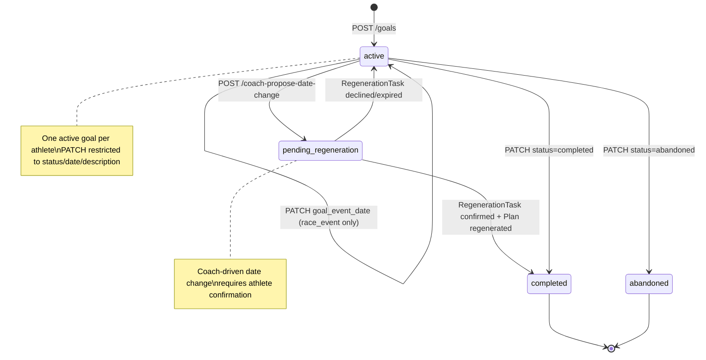

# TrainingGoal

The root context container for an athlete's training intent. Defines the goal mode, target event (if applicable), and self-reported constraints. Acts as the anchor for `TrainingPlan` generation and `RegenerationTask` coordination.

## Purpose

-   **Context for Plan Generation:** Provides the `goal_type`, `goal_event_date`, and athlete constraints that drive `PlanGenerationService`.
-   **Authority Boundary:** Enforces distinct pathways for date changes:
    -   **Athlete-Initiated:** Logistic updates for `race_event` goals (e.g., race postponed).
    -   **Coach-Driven:** Trajectory-based adjustments for `target_performance` goals (requires proposal and confirmation).
-   **Secondary Event Management:** Tracks B-races and C-races that influence plan structure but do not drive the primary periodization.

## Vision Alignment

The vision defines five goal modes, each with a distinct coaching posture, adaptive language, and transition rules. The `goal_type` enum is the architectural trigger for these behaviors.

| `goal_type` | Vision Mode | Coaching Posture | Language Cues | Transition Rules |
|---|---|---|---|---|
| `race_event` | Race/Goal Event | Periodised, peaking, tapering, race-specific preparation | "sharpening," "final prep," "race-specific," urgency | → Recovery first, then chosen mode |
| `fitness_improvement` | Fitness Improvement | Progressive overload, measurable gains, capacity building | "development," "capacity building," measurable gains | → Any mode based on readiness |
| `maintenance` | Maintenance | Consistency-focused, habit preservation, fitness preservation | "consistency," "gradual progress," patience | → Fitness Improvement when ready |
| `recovery` | Recovery | Healing-focused, conservative load, protective coaching | "healing," "protective," "gradual return" | → Fitness Improvement after healing markers |
| `target_performance` | Target Performance | Gap-analysis driven, trajectory validation, systematic progression toward measurable target | "trajectory," "target pace," "gap closing," "benchmark" | → Recovery first, then chosen mode |

**What never changes between modes:** Analysis quality, coach voice, and physiological modelling are identical in all modes. Non-race modes are not stripped-down experiences.

**Mode transitions** are coaching conversations, not administrative changes. The twin provides rationale; the coach delivers it in the appropriate voice for both current and upcoming mode. Specific transition sequences are defined in `docs/vision/product/goal-modes.md`.

---

## Schema

```typescript
type GoalType =
  | 'race_event'           // Periodized toward a specific date; peaking, tapering, race-specific prep
  | 'fitness_improvement'  // Active development; progressive overload; measurable gains
  | 'maintenance'          // Consistency-focused; habit preservation; fitness preservation
  | 'recovery'             // Healing-focused; conservative load; protective coaching
  | 'target_performance'   // Gap-analysis driven; athlete sets target time; system determines date

type GoalEventType =
  | 'marathon' | 'half_marathon' | '10k' | '5k'
  | 'ultra' | 'trail_race' | 'custom'

type TrainingGoalStatus = 'active' | 'completed' | 'abandoned'

type SecondaryEventPriority = 'B' | 'C'

type SecondaryEvent = {
  id: string                      // UUID, PK
  training_goal_id: string        // UUID, FK → TrainingGoal
  event_type: GoalEventType       // Reuse GoalEventType for simplicity
  event_date: string              // YYYY-MM-DD
  event_name: string | null
  priority: SecondaryEventPriority
}

type TrainingGoal = {
  id: string                         // UUID, PK
  athlete_id: string                 // UUID, FK → Athlete

  // Goal Definition — Immutable after creation
  goal_type: GoalType
  goal_event_type: GoalEventType | null   // Null unless goal_type = 'race_event'
  goal_event_name: string | null
  goal_event_date: string | null          // YYYY-MM-DD; Null for non-race_event types
  custom_distance_km: number | null       // > 0; Only when goal_event_type = 'custom'
  goal_description: string | null         // Free text; surfaced to first message agent

  // Self-Reported Context — Immutable after creation
  weekly_volume_hours: number        // >= 0; CHECK constraint
  weekly_volume_km: number           // >= 0; CHECK constraint
  fitness_level: number              // 1–5; CHECK constraint; feeds Tier 3 bootstrap
  recent_injury: string | null       // Free text; surfaced to plan generation

  // Recovery Context — Required when goal_type = 'recovery'
  injury_severity: InjurySeverity | null  // Null for other goal types

  // Target Performance Context — Required when goal_type = 'target_performance'
  target_distance_km: number | null  // > 0; Only when goal_type = 'target_performance'
  target_time_minutes: number | null // > 0; Only when goal_type = 'target_performance'

  // Status — The only mutable fields via direct PATCH
  status: TrainingGoalStatus
  created_at: string                 // ISO 8601
  closed_at: string | null           // Set when status → completed or abandoned
}
```

---

## Design Rationale: Authority Boundaries for Date Changes

The system enforces a strict boundary between **logistic updates** (athlete-controlled) and **strategic adjustments** (coach-driven).

### 1. Athlete-Initiated Changes (`race_event` only)
**Use Case:** A race is postponed, canceled, or rescheduled by the organizer.
**Mechanism:** Direct `PATCH` to `goal_event_date`.
**Rationale:** The athlete has sole authority over which race they are registered for. If the date changes, the plan must be regenerated to reflect the new timeline.
**Constraint:** Allowed **only** when `goal_type = 'race_event'`.

### 2. Coach-Driven Changes (`target_performance` and all modes)
**Use Case:** The twin's trajectory analysis indicates the athlete is ahead of or behind schedule for a target performance.
**Mechanism:** Two-step `RegenerationTask` flow (Propose → Confirm).
**Rationale:**
-   **Target Performance Mode:** The system determines the optimal date via gap analysis. Changing this date is a **strategic decision**, not a logistic one. It requires a coach's rationale and athlete confirmation.
-   **All Modes:** Significant date changes (>7 days) alter the periodization structure. The coach must validate that the new timeline is physiologically sound.
**Constraint:** Direct `PATCH` to `goal_event_date` is **blocked** for `target_performance` mode. Changes must flow through `RegenerationTask`.

---

## Invariants

### 1. One Active Goal Per Athlete
Enforced by a partial unique index on `(athlete_id) WHERE status = 'active'`. Attempting to create a second active goal returns `409 Conflict`. The existing goal must be explicitly closed (`status → completed` or `abandoned`) before a new one is created.

### 2. Immutability of Semantic Fields
The following fields are **immutable** after creation to preserve the historical integrity of the goal context:
-   `goal_type`, `goal_event_type`, `goal_event_name`
-   `custom_distance_km`, `weekly_volume_hours`, `weekly_volume_km`
-   `fitness_level`, `recent_injury`, `injury_severity`
-   `target_distance_km`, `target_time_minutes` (for `target_performance`)

**Rationale:** Changing these fields fundamentally alters the nature of the goal. If an athlete's intent changes (e.g., from "marathon" to "10k", or from "race_event" to "fitness_improvement"), they should close the current goal and create a new one. This preserves the audit trail of what the original plan was optimizing for.

### 3. Mutable Fields
Only the following fields can be updated via `PATCH /goals/{id}`:
-   `status` (transition to `completed` or `abandoned`)
-   `goal_event_date` (**Only** if `goal_type = 'race_event'`)
-   `goal_description` (minor textual refinements)

### 4. Secondary Event Limits
-   **Maximum 3 secondary events** per active goal.
-   **No conflicts:** Secondary events cannot fall within the taper phase or the week of the primary goal event. Validation returns `422 Unprocessable Entity` on violation.

### 5. Target Performance Date Authority
For `goal_type = 'target_performance'`, `goal_event_date` is **system-determined**. It cannot be modified via the standard `PATCH` endpoint. Changes require a `RegenerationTask` initiated by the coach (or athlete request via coach conversation) and confirmed by the athlete.

---

## State Transitions



---

## Events

### Produced

| Event | Trigger | Version | Payload |
|---|---|---|---|
| `training_goal_created` | Goal inserted with `status=active` | v1 | `{training_goal_id, goal_type, goal_event_type, goal_event_date, fitness_level}` |
| `training_goal_closed` | Status transitions to `completed` or `abandoned` | v1 | `{training_goal_id, status, closed_at, duration_days}` |
| `secondary_event_registered` | Secondary event added | v1 | `{secondary_event_id, training_goal_id, event_type, event_date, priority}` |
| `secondary_event_removed` | Secondary event removed | v1 | `{secondary_event_id, training_goal_id, event_date}` |
| `regeneration_task_proposed` | Coach proposes date change | v1 | `{task_id, training_goal_id, proposed_date, rationale, trigger}` |
| `regeneration_task_confirmed` | Athlete confirms date change | v1 | `{task_id, training_goal_id, new_goal_event_date}` |

### Consumed

| Event | Action | Version |
|---|---|---|
| `onboarding_completed` | Goal already created; twin model build begins | v1 |

*Note: `onboarding_completed` does not trigger plan generation directly. Plan generation is triggered by `twin_model_ready`.*

---

## APIs

### Standard Management

```yaml
POST /athletes/{athlete_id}/goals
Description: Creates a new TrainingGoal. Returns 409 if one is already active.
Request:
  goal_type: GoalType, required
  goal_event_type?: GoalEventType
  goal_event_date?: string (YYYY-MM-DD)
  goal_event_name?: string
  custom_distance_km?: number
  goal_description?: string
  weekly_volume_hours: number, required
  weekly_volume_km: number, required
  fitness_level: number (1–5), required
  recent_injury?: string
  injury_severity?: 'minor' | 'moderate' | 'major'  # Required if goal_type = 'recovery'
  target_distance_km?: number  # Required if goal_type = 'target_performance'
  target_time_minutes?: number  # Required if goal_type = 'target_performance'
Response: 201
  training_goal: TrainingGoalResponse
Auth: Bearer JWT, require_self

PATCH /athletes/{athlete_id}/goals/{goal_id}
Description: Updates status, description, or race event date.
Constraints:
  - goal_event_date changes are ONLY allowed if goal_type = 'race_event'.
  - target_performance goals MUST use the coach-driven regeneration endpoints.
Request:
  status?: 'completed' | 'abandoned'
  goal_event_date?: string  # Triggers plan regen if delta > 7 days
  goal_description?: string
Response: 200 | 403 (if attempting to change target_performance date)
  training_goal: TrainingGoalResponse
Auth: Bearer JWT, require_self

GET /athletes/{athlete_id}/goals/active
Response: 200 | 404
  training_goal: TrainingGoalResponse
Auth: Bearer JWT, require_self

GET /athletes/{athlete_id}/goals
Response: 200
  goals: TrainingGoalResponse[]  # All goals, ordered by created_at desc
Auth: Bearer JWT, require_self
```

### Secondary Events

```yaml
POST /athletes/{athlete_id}/goals/{goal_id}/secondary-events
Description: Registers a B-event or C-event. Max 3 per goal.
Request:
  event_type: GoalEventType, required
  event_date: string (YYYY-MM-DD), required
  event_name?: string
  priority: 'B' | 'C', required
Response: 201 | 422 (if validation fails)
  secondary_event: SecondaryEventResponse
Auth: Bearer JWT, require_self

PATCH /athletes/{athlete_id}/goals/{goal_id}/secondary-events/{event_id}
Request:
  event_date?: string  # Triggers redistribution check
  event_name?: string
Response: 200
  secondary_event: SecondaryEventResponse
Auth: Bearer JWT, require_self

DELETE /athletes/{athlete_id}/goals/{goal_id}/secondary-events/{event_id}
Response: 200
  secondary_event: SecondaryEventResponse
Auth: Bearer JWT, require_self
```

### Coach-Driven Regeneration (Target Performance)

```yaml
POST /athletes/{athlete_id}/goals/{goal_id}/coach-propose-date-change
Description: Proposes a date change based on trajectory analysis. Creates a pending RegenerationTask.
Request:
  proposed_date: string (YYYY-MM-DD), required
  rationale: string, required  # Plain English; surfaced to athlete
  trigger: 'trajectory_ahead' | 'trajectory_at_risk' | 'coach_conversation', required
Response: 202 Accepted
  regeneration_task: {
    id: string
    proposed_date: string
    rationale: string
    status: 'pending_confirmation'
    expires_at: string  # 14 days from proposal
  }
Auth: Bearer JWT, require_coach_or_self  # Coach can propose; athlete can request via conversation

POST /athletes/{athlete_id}/goals/{goal_id}/coach-confirm-date-change
Description: Confirms or declines a proposed date change.
Request:
  regeneration_task_id: string, required
  confirmed: boolean, required
Response:
  If confirmed: 200
    new_training_plan: TrainingPlanResponse
    superseded_plan_id: string
  If declined: 200
    regeneration_task: { status: 'declined' }
Auth: Bearer JWT, require_self
```

---

## Storage Model

| Data | Strategy | Consistency | Retention |
|---|---|---|---|
| `training_goals` table | Append-only (status mutable) | Strong | Indefinite |
| `secondary_events` table | Mutable | Strong | Indefinite |
| `regeneration_tasks` table | Append-only (status mutable) | Strong | Indefinite |

**Indexes:**
-   `CREATE UNIQUE INDEX idx_training_goals_active ON training_goals (athlete_id) WHERE status = 'active';`
-   `CREATE INDEX idx_regeneration_tasks_pending ON regeneration_tasks (training_goal_id, status) WHERE status = 'pending_confirmation';`

---

## Observability

**Metrics:**
-   `training_goal.created.total`: By `goal_type`.
-   `training_goal.closed.total`: By `status` (completed vs. abandoned).
-   `regeneration_task.proposed.total`: By `trigger` (trajectory_ahead, at_risk, conversation).
-   `regeneration_task.confirmed.rate`: Percentage of proposals accepted by athletes.

**Logs:**
-   `training_goal.created`: `athlete_id`, `goal_type`, `fitness_level`.
-   `training_goal.closed`: `athlete_id`, `goal_id`, `status`, `duration_days`.
-   `regeneration_task.proposed`: `athlete_id`, `goal_id`, `trigger`, `proposed_date`.
-   `regeneration_task.confirmed`: `athlete_id`, `goal_id`, `task_id`.

**Alerts:**
-   **Stagnant Proposals:** Alert if `regeneration_task` remains `pending_confirmation` > 14 days (should auto-expire, but verify logic).
-   **High Abandonment Rate:** Alert if `abandoned` rate > 20% for a specific `goal_type` cohort.

---

## Cross-References

-   **Plan Generation:** `02-computations/plan-generation.md` (consumes `TrainingGoal` to build phase arc).
-   **Regeneration Task Entity:** `01-entities/regeneration-task.md` (full schema and state machine).
-   **Decision Authority:** `docs/vision/coach/decision-authority.md` ("Plan Modification Authority").
-   **Goal Modes:** `docs/vision/product/goal-modes.md` (coaching posture per `goal_type`).