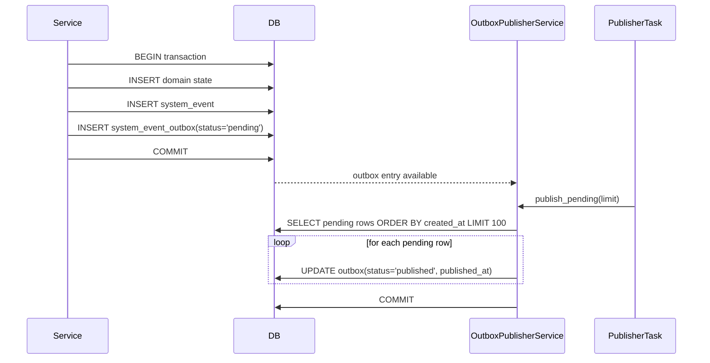

# SystemEvent — Persistent Event Log and Transactional Outbox

## Purpose
- Provides the append-only storage layer and transactional outbox mechanism for all domain events defined in `event-catalogue.md`
- Ensures events are persisted atomically with domain state and published only after transaction commit to prevent phantom state

## TypeScript Schema

### Event Envelope (stored in `system_events` table)
```typescript
type SystemEvent<T = unknown> = {
  event_id: string           // UUID, generated by producer; PK
  event_type: EventType      // from event-catalogue.md
  version: string            // e.g. "v1"
  produced_at: string        // ISO 8601; immutable after insert
  athlete_id: string         // UUID, FK → Athlete; not null (all events scoped)
  payload: T                 // JSONB; contract defined by event-catalogue
}
```

### Publication State (stored in `system_event_outbox` table)
```typescript
type EventPublicationStatus = 'pending' | 'published' | 'failed' | 'dlq'

type SystemEventOutbox = {
  event_id: string                      // FK → system_events.event_id; PK
  status: EventPublicationStatus        // current publication state
  published_at: string | null          // ISO 8601; set when status = 'published'
  attempts: number                     // default 0; increments per publish attempt
  last_error: string | null            // error message from last failed attempt
  created_at: string                   // ISO 8601
  updated_at: string                   // ISO 8601; standard mutable-table field
}
```

## Invariants

- All events are scoped to a single `athlete_id` — enforced by `NOT NULL` constraint on `system_events.athlete_id`
- `event_id` is a UUID generated by the producer at point of production; unique constraint enforced
- `system_events` is append-only — no UPDATE or DELETE operations permitted; consumers never see destructive deletes
- `system_event_outbox` is the only mutable event-related state; mutation reflects publication status only
- Event and outbox row are inserted in the same database transaction as the domain state change; rollback removes both
- Publication occurs only after the producing transaction commits successfully; prevents phantom state visibility
- Outbox `status = 'dlq'` triggers alert through failure-handling pipeline; events remain queryable for audit

## Events

### Produced
None. `SystemEvent` and `SystemEventOutbox` are terminal state — other entities write to them, but they produce no downstream events.

### Consumed
None. The publication pipeline is internal; the outbox publisher flips `status` to `'published'` without an external message bus (see `## Runtime Flow`). Future external consumers (Kafka, NATS, Redis) attach at the documented insertion point — they do not consume SystemEvent rows directly.

## APIs
None. Event persistence is internal to the platform; all writes occur via transactional outbox pattern in application services.

## Storage Model

| Data | Strategy | Consistency | Retention |
|---|---|---|---|
| `system_events` table | append-only event log | strong (within transaction) | 90 days operational; 1 year for trigger events |
| `system_event_outbox` | mutable (status fields only) | strong | 90 days after published; retained if failed/dlq |

**Trigger-event subset retention:** Events that trigger `TwinState` creation (`activity_calibration_eligible`, `physiology_updated`, `fitness_updated`, `race_prediction_updated`) are retained for 1 year for audit purposes. Other events are retained for 90 days.

**Indexes:**
- `CREATE UNIQUE INDEX idx_system_events_event_id ON system_events (event_id);`
- `CREATE INDEX idx_system_events_athlete_at ON system_events (athlete_id, produced_at DESC);`
- `CREATE INDEX idx_system_events_type_at ON system_events (event_type, produced_at DESC);`
- `CREATE INDEX idx_system_event_outbox_status ON system_event_outbox (status, created_at);`
- `CREATE INDEX idx_system_event_outbox_pending ON system_event_outbox (created_at) WHERE status IN ('pending', 'failed');`

## Mutation Rules

| Layer | Read | Write | Delete |
|---|---|---|---|
| API | No | No | No |
| Service | Yes | Yes (event + outbox in same transaction) | No |
| Repository | Yes | Yes | No |

**Publish-side ownership note:** The Service-tier write applies to two distinct services: `EventPublisher` owns the producer-side transaction (event + outbox insertion together with domain state), while `OutboxPublisherService` owns the publish-side transaction (status transition from `pending` to `published`). See ADR-013.

## Runtime Ownership

Owns:
- Persistent append-only event log for all domain events
- Transactional outbox state for reliable event publication
- Event retention partitioning and archival coordination

Does Not Own:
- Event schema definitions and versioning → `00-foundations/event-catalogue.md`
- Event routing infrastructure and consumer wiring → `04-platform/event-topology.md`
- Retry policies and DLQ routing → `04-platform/failure-handling.md`
- Task queue implementation → `04-platform/async-pipeline.md`

## Idempotency

- Event publication is at-least-once; consumers must deduplicate on `event_id` or implement idempotent handlers
- Outbox entries are processed idempotently: multiple publish attempts to the same `event_id` are safe

## Failure Semantics

- Transaction rollback: domain state and event/outbox rows are rolled back together
- Publish failure: outbox `status = 'pending'` → retry up to max attempts (configurable, default 3); on exhaustion → `status = 'dlq'` and alert fires
- DLQ entries are retained for investigation; replay mechanism provided via manual reprocessing
- The publisher is a status-transitioner, not a message-bus publisher. Adding a bus (Kafka, NATS, Redis) is a localized change to `OutboxPublisherService` — see `## Runtime Flow`. The producing services are unaffected.

## Performance Constraints

- Event persistence is synchronous within the producing transaction; p95 latency must not exceed transaction SLA
- Publisher reads pending outbox entries via periodic polling on `system_event_outbox` (`OutboxPublisherService` invoked by procrastinate periodic task, default every 15 seconds); `LISTEN/NOTIFY` on PostgreSQL is a future latency optimization

## Observability

Metrics:
- `system_event.persisted.total`: count of events written
- `system_event.outbox.pending`: count of events awaiting publication
- `system_event.outbox.failed`: count of events exceeding retry threshold
- `system_event.outbox.dlq`: count of events moved to dead-letter state

Logs:
- `system_event.persisted`: `event_id`, `event_type`, `athlete_id`, transaction_id
- `system_event.outbox.published`: `event_id`, `published_at`
- `system_event.outbox.failed`: `event_id`, `error`, `attempts`

Traces:
- `event_transaction`: spans domain write + event/outbox persistence in same transaction

## Runtime Flow



**Current implementation (no external bus).** The platform runs a PostgreSQL-native outbox: the `OutboxPublisherService` (invoked by the procrastinate periodic task `outbox_publisher` in `app/worker/app.py`) reads `system_event_outbox` for `status = 'pending'` rows, transitions them to `'published'`, and stamps `published_at`. There is no Redis, NATS, Kafka, or any other message bus in the path. The publisher is a status-transitioner, not a message-bus publisher; producing services, repositories, the outbox schema, and the API surface are unaffected by publication-target decisions.

**Future bus insertion point.** The `OutboxPublisherService` is the single chokepoint for external delivery. When a message bus is introduced:

1. Inject the bus client into `OutboxPublisherService` (constructor / module-level import — the existing `AsyncSessionLocal` / repository wiring is the model).
2. After `mark_published(event_id)` succeeds for a row, push the corresponding `SystemEvent` payload to the bus.
3. Bus consumer acknowledgement is reflected back into the outbox row (`status = 'published'`, `attempts += 1`, `last_error` on failure).

This change is localized to `OutboxPublisherService`. The transactional outbox atomicity invariant is preserved: event + outbox row remain in the same producing transaction; the bus is downstream of the outbox, never upstream. Redis/Celery remains documented as a future migration option if queue contention warrants it — see `04-platform/storage-topology.md` ("Why PostgreSQL for the task queue") and `04-platform/async-pipeline.md` ("Migration path"). The outbox table and publication state machine are independent of that decision and persist regardless of the chosen publication target.

## Implementation Notes

- Use PostgreSQL advisory locks or explicit row-level locks to ensure idempotent publication when using polling
- LISTEN/NOTIFY on `system_event_outbox` table allows near-real-time publication without tight polling loop
- Failed publications after max retries should trigger PagerDuty/Sentry alert; DLQ entry created
- Event retention partitioning by `produced_at` enables efficient archival without table scans