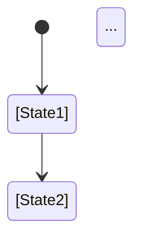

# Document Template — Contract-Based Architecture

## Template Structure
```markdown
# [Document Name] — [Brief Description]

## Purpose
- One sentence describing the entity's role
- One sentence describing its boundaries

## TypeScript Schema
```typescript
type [EntityName] = {
  [field_name]: [type, constraints...]
  ...
}
```

## Invariants
- [Rule description]
- [Rule description]
- [Rule description]

## State Transitions


## Events
### Produced
| Event | Trigger | Version | Payload |
|---|---|---|---|
| [event_name] | [trigger description] | v[1] | [schema] |
| [event_name] | [trigger description] | v[1] | [schema] |

### Consumed
| Event | Trigger | Version | Payload |
|---|---|---|---|
| [event_name] | [trigger description] | v[1] | [schema] |
| [event_name] | [trigger description] | v[1] | [schema] |
```

## APIs
```yaml
[HTTP_METHOD] [endpoint]
Request:
  [parameter]: [type, constraints]
Response: [status] [description]
    [response_field]: [type, description]
```

## Storage Model
| Data | Strategy | Consistency | Retention |
|------|----------|-------------|-----------|
| [entity_name] | mutable | strong | indefinite |
| [audit_events] | append-only | eventual | 90 days |

Note: Storage implementation details are in deployment documents.

## Mutation Rules
| Layer | Read | Write | Delete |
| ----- | ---- | ----- | ------ |
| API | Yes | No | No |
| Service | Yes | Yes | No |
| Repository | Yes | Yes | Yes |
| Read Model | Yes | No | No |

## Runtime Ownership
Owns:
- [responsibility 1]
- [responsibility 2]

Does Not Own:
- [responsibility 1]
- [responsibility 2]

## Idempotency
- [operation] idempotent by [key]
- [operation] no-ops on repeat

## Authorization
Authorization delegated to [service]:
- Ownership validation
- Self-access restrictions
- Role-based access

## Failure Semantics
- [condition] -> [behaviour]
- [condition] -> [behaviour]

## Performance Constraints
Synchronous API latency:
- [operation]: p95 < [ms]ms
- [operation]: p95 < [ms]ms

Asynchronous operations:
- [operation] (background)
- [operation] (async)

## Observability
Metrics:
- [metric_name]: [description]
Logs:
- [event_name]: [description]
Traces:
- [flow_name]: [description]

## Runtime Flow
```mermaid
sequenceDiagram
    [Component] --> [Component]
    ...
```

## Implementation Notes
- [High-level note only]
- [High-level note only]
- [High-level note only]

## Open Questions
- [unresolved decision]
- [unresolved decision]
```