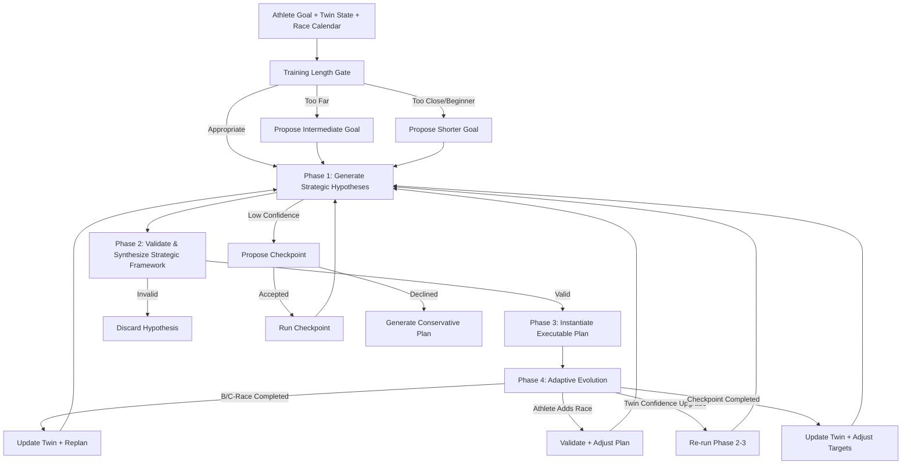
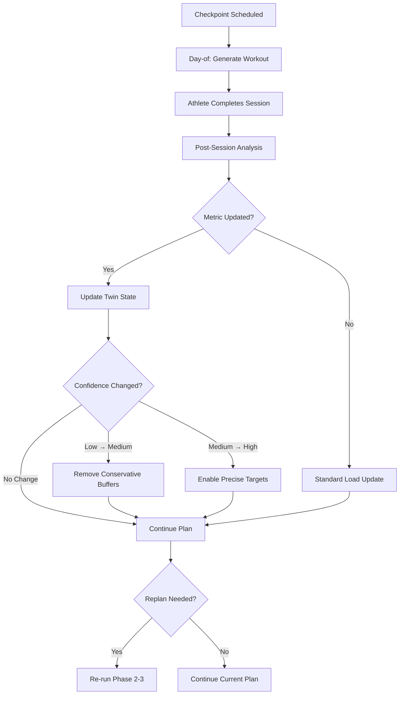

# Pheidipp Training Plan Generation: Full Vision

*Production-ready version with LLM-driven hypothesis generation, multi-race support, structured checkpoints, proactive calibration, and constraint-first validation.*

---

## 🎯 Core Philosophy

> **"The LLM is the coach. It uses the twin as its brain, the taxonomy as its playbook, the athlete's data as its compass, and the race calendar as its roadmap."**

**Key Implications**:

1. **Twin-First**: All reasoning starts with the twin model's data, confidence, and constraints.
2. **Hypothesis Spaces**: The LLM explores **3 strategic hypotheses** using structured dimensions, not complete plans.
3. **Checkpoint-Driven**: The plan is structured around **checkpoints** — scheduled moments of assessment that provide data, reduce uncertainty, and validate progress.
4. **User Agency**: Checkpoints are **strongly recommended**, not mandatory. If declined, conservative assumptions are used.
5. **Constraint-First Validation**: Invalid hypotheses are **discarded before scoring**.
6. **Coach Decides**: The coach selects the best hypothesis. The athlete accepts or abandons the plan — no choice overload.
7. **Multi-Race Support**: Plans prioritize the **A-race** but incorporate **B- and C-races** as tune-ups, calibration opportunities, or training events.
8. **Training Length Awareness**: ⚠️ **Critical gate** — If the goal is too far away, the system proposes an **intermediate goal** focused on specific physiological objectives that build toward the ultimate target. This prevents excessively long plans and keeps the athlete focused on achievable milestones.

---

## ⚠️ Training Length Gate (Critical First Step)

Before any hypothesis generation, the system **must** evaluate whether the goal timeline is appropriate. This is not a minor check — it fundamentally shapes the plan structure.

```typescript
function evaluateTrainingLength(
  weeks_until_goal: number,
  fitness_level: number,
  goal_event_type: GoalEventType
): {
  action: 'proceed' | 'propose_intermediate' | 'propose_shorter_goal'
  message: string
  intermediate_objectives?: string[]
} {
  // Goal is too far away — propose intermediate goal
  if (weeks_until_goal > 24) {
    return {
      action: 'propose_intermediate',
      message: `Your ${goal_event_type} is ${weeks_until_goal} weeks away. That's too far ` +
               `to plan in detail — too much will change in your fitness and life. ` +
               `Let's focus on a 12-week block targeting the physiological foundations ` +
               `you'll need most: aerobic base, threshold development, and structural ` +
               `resilience. We'll reassess and plan the next phase after that.`,
      intermediate_objectives: [
        'aerobic_fitness',
        'threshold_power',
        'structural_resilience'
      ]
    }
  }
  
  // Goal is too close for a beginner
  if (weeks_until_goal < 8 && fitness_level <= 2) {
    return {
      action: 'propose_shorter_goal',
      message: `With ${weeks_until_goal} weeks to your ${goal_event_type} and your current ` +
               `fitness level, a 10K or half-marathon would be a more realistic target. ` +
               `This builds race experience and confidence for the full distance later.`
    }
  }
  
  // Goal is appropriate
  return {
    action: 'proceed',
    message: ''
  }
}
```

**Why This Matters**:

| Scenario | Without Gate | With Gate |
|----------|--------------|-----------|
| Marathon 32 weeks away | Tries to plan 32 weeks — too uncertain, too many variables | Proposes 12-week block with specific objectives |
| Marathon 6 weeks away, fitness level 2 | Plans impossible race | Suggests shorter goal first |
| Half-marathon 16 weeks away | Proceeds normally | Proceeds normally |

**The Intermediate Goal Approach**:

When the gate triggers, the coach doesn't just say "too far" — it proposes a **focused 8-12 week block** targeting the most valuable physiological objectives for the ultimate goal:

> "Your marathon is 32 weeks away. Rather than guessing what you'll need in 8 months, let's spend the next 12 weeks building the aerobic base and threshold power that every marathon plan depends on. After that, we'll reassess your fitness and design the race-specific phase."

This keeps the athlete engaged, builds toward the ultimate goal, and avoids the paralysis of planning too far ahead.

---

## 🏗️ System Workflow



**Phase Ownership**:

| Phase | Owner | Output |
|-------|-------|--------|
| Training Length Gate | System | Go/No-Go + intermediate goal proposal |
| Phase 1: Strategic Hypotheses | LLM | 3 distinct hypotheses with structured dimensions |
| Phase 2: Validate & Synthesize | LLM + Validation Logic | Strategic framework |
| Phase 3: Instantiate Executable Plan | LLM | TrainingPlan + PlannedSession records |
| Phase 4: Adaptive Evolution | System + Coach | Plan adjustments based on checkpoints, races, twin updates |

---

## 🎯 Checkpoints (Unified Assessment Concept)

A **checkpoint** is any scheduled moment of assessment that provides data, reduces uncertainty, and validates progress. Checkpoints give agents a common abstraction to reason about different types of assessment throughout the plan.

### Checkpoint Hierarchy

```
Checkpoint
├─ Calibration Checkpoint
│   └─ Test workout targeting a specific physiological metric
│      Example: Submaximal tempo run to refine LT2 estimate
│
├─ Benchmark Checkpoint
│   └─ Standardized session to measure progress against baseline
│      Example: 5K time trial to assess threshold development
│
├─ Race Simulation Checkpoint
│   └─ Race-pace effort to test readiness without full race stress
│      Example: Marathon-pace long run with final 10K at race intensity
│
├─ Secondary Race Checkpoint
│   └─ B-race or C-race used as an assessment opportunity
│      Example: Half-marathon B-race to calibrate marathon pacing
│
└─ Progress Review Checkpoint
    └─ Periodic assessment of overall training response
     Example: Weekly form check + adaptation signature review
```

### Checkpoint Properties

Every checkpoint shares these properties:

```typescript
type Checkpoint = {
  id: string
  type: CheckpointType           // calibration | benchmark | race_simulation | secondary_race | progress_review
  week_number: number            // when in the plan
  target_date: string            // YYYY-MM-DD
  
  // What we're assessing
  primary_metric: string         // e.g., "LT2", "aerobic_fitness", "race_readiness"
  secondary_metrics?: string[]   // additional metrics we'll learn about
  
  // How we're assessing it
  session_type: SessionType      // the workout type
  intent_description: string     // plain English explanation
  
  // What we'll do with the data
  twin_update_expected: boolean  // will this update twin state?
  replan_trigger: boolean        // will this trigger replanning?
  
  // Coach framing
  coach_message: string          // how the coach explains this to the athlete
}

type CheckpointType = 
  | 'calibration'        // test workout for specific metric
  | 'benchmark'          // standardized progress measurement
  | 'race_simulation'    // race-pace effort without full stress
  | 'secondary_race'     // B-race or C-race as assessment
  | 'progress_review'    // periodic adaptation check
```

### How Checkpoints Are Scheduled

Checkpoints are scheduled during Phase 2 (synthesis) based on:

1. **Confidence gaps**: Low/medium confidence in a metric → schedule calibration checkpoint
2. **Race calendar**: B/C-races are naturally secondary race checkpoints
3. **Phase transitions**: Before moving from base to build → benchmark checkpoint
4. **Regular intervals**: Progress review checkpoints every 3-4 weeks

**Example Checkpoint Schedule**:

| Week | Checkpoint Type | Primary Metric | Session | Coach Framing |
|------|-----------------|----------------|---------|---------------|
| 4 | Progress Review | adaptation_signature | Weekly form check | "Let's see how your body is responding to the base phase." |
| 8 | Benchmark | aerobic_fitness | Long run with HR drift | "Time to check your aerobic development before we add intensity." |
| 10 | Calibration | LT2 | Submaximal tempo | "This tempo run will help me fine-tune your training zones." |
| 16 | Secondary Race | race_readiness | Half-marathon B-race | "This is a fitness checkpoint — I've set a controlled target." |
| 20 | Race Simulation | marathon_pace | Marathon-pace long run | "Let's test your marathon pace before race day." |

### Checkpoints vs. Regular Workouts

| Aspect | Regular Workout | Checkpoint |
|--------|-----------------|------------|
| **Purpose** | Training stimulus | Data collection |
| **Target precision** | Zone-based | Specific metric |
| **Post-session analysis** | Standard | Detailed metric update |
| **Twin update** | Load contribution | Potential threshold update |
| **Replan trigger** | No | Possibly (if confidence changes significantly) |
| **Coach framing** | Training purpose | Assessment purpose |

### Checkpoint Completion Flow



---

## 📝 Phase 1: Generate Strategic Hypotheses

### Input

```typescript
type HypothesisGenerationInput = {
  // Athlete state
  twin_state: TwinState
  athlete_preferences: AthletePreferences
  
  // Goal definition
  goal: {
    description: string
    event_type: GoalEventType
    event_date: string
  }
  
  // Race calendar
  secondary_events: SecondaryEvent[]
  
  // Existing checkpoints (if replanning)
  existing_checkpoints?: Checkpoint[]
}
```

### The 4 Primary Dimensions

The LLM varies these to create distinct hypotheses:

| Dimension | Options | Purpose |
|-----------|---------|---------|
| **Methodology** | Polarized, Pyramid, Threshold-Focused, Block Periodization, Reverse Periodization, HILF, LIHF | Overall training philosophy |
| **Approach** | Linear, Non-Linear, Block, Undulating, Step, Exponential | How load progresses over time |
| **Recovery Cycle** | Frequent, Infrequent, Micro-Cycles, Macro-Cycles | Recovery structure |
| **Load Distribution** | Polarized (80/5/15), Pyramid (60/20/20), Threshold (50/30/20), Speed-Focused (40/20/40), Endurance-Focused (70/20/10) | Zone allocation |

### Core Rule for Distinctness

> **"Each hypothesis must differ in at least 2 of the 4 primary dimensions, while respecting all twin constraints and the race calendar."**

### Step-by-Step Generation Process

#### Step 1: Analyze Athlete Profile

```json
{
  "strengths": ["aerobic_fitness=HIGH", "adaptation_signature=FAST_VOLUME"],
  "weaknesses": ["anaerobic_capacity=MEDIUM", "structural_risk=HIGH"],
  "constraints": ["no_back_to_back_hard_days", "max_load_increase=10%"],
  "race_priorities": [
    {"type": "A", "distance": "marathon", "date": "2026-10-15"},
    {"type": "B", "distance": "half-marathon", "date": "2026-08-01"}
  ],
  "confidence_gaps": [
    {"metric": "LT2", "confidence": "MEDIUM", "priority": "HIGH"},
    {"metric": "VO2max", "confidence": "HIGH", "priority": "LOW"}
  ]
}
```

#### Step 2: Select 3 Orthogonal Combinations

| Hypothesis | Methodology | Approach | Recovery Cycle | Load Distribution | Distinctness |
|------------|-------------|----------|----------------|-------------------|--------------|
| 1 | **Polarized** | Linear | Micro-Cycles | 80/5/15 | Methodology + Load Distribution |
| 2 | **Threshold** | **Non-Linear** | Frequent | 50/30/20 | Methodology + Approach |
| 3 | **Pyramid** | Block | **Macro-Cycles** | 60/20/20 | Methodology + Recovery Cycle |

#### Step 3: Align with Athlete Profile

For each hypothesis:
1. **Justify the methodology**: Why this approach suits the athlete's strengths
2. **Address weaknesses**: How this approach targets identified gaps
3. **Respect constraints**: Ensure all hard invariants are honored
4. **Incorporate race calendar**: How B/C-races fit into the plan
5. **Schedule checkpoints**: Identify when calibration, benchmark, and progress review checkpoints should occur

#### Step 4: Validate Consistency (Profile Checklist)

| Check | Example |
|-------|---------|
| **Addresses Strengths** | If `aerobic_fitness=HIGH`, methodology should leverage this |
| **Targets Weaknesses** | If `anaerobic_capacity=MEDIUM`, include Zone 4–5 work |
| **Respects Constraints** | If `structural_risk=HIGH`, no flat intervals; use hill repeats |
| **Fits Race Calendar** | B-race taper doesn't conflict with A-race build |
| **Orthogonal to Others** | Differs in ≥2 dimensions from the other hypotheses |
| **Logical Coherence** | Methodology + Approach + Recovery Cycle are compatible |
| **Checkpoints Scheduled** | Calibration and benchmark checkpoints placed at optimal times |

### Output Format

```json
{
  "hypotheses": [
    {
      "name": "Aerobic-First with Structured Recovery",
      "methodology": "Polarized",
      "approach": "Linear",
      "recovery_cycle": "Micro-Cycles",
      "load_distribution": {"zone1_2": 80, "zone3": 5, "zone4_5": 15},
      "race_considerations": {
        "A_race": {"type": "marathon", "role": "peak", "taper": "2 weeks"},
        "B_race": {"type": "half-marathon", "role": "tune-up", "taper": "3 days"}
      },
      "phase_emphasis": [
        {"name": "Base", "weeks": 8, "focus": ["aerobic_fitness", "structural_resilience"]},
        {"name": "Build", "weeks": 8, "focus": ["threshold_power", "B-race_prep"]},
        {"name": "Peak", "weeks": 3, "focus": ["marathon_specific_endurance"]}
      ],
      "checkpoints": [
        {"type": "progress_review", "week": 4, "metric": "adaptation_signature"},
        {"type": "benchmark", "week": 8, "metric": "aerobic_fitness", "session": "long_run_hr_drift"},
        {"type": "calibration", "week": 10, "metric": "LT2", "session": "submaximal_tempo"},
        {"type": "secondary_race", "week": 16, "metric": "race_readiness", "race": "B-race"},
        {"type": "race_simulation", "week": 20, "metric": "marathon_pace", "session": "marathon_pace_long_run"}
      ],
      "rationale": "Leverages your high aerobic fitness (Polarized) and fast volume adaptation (Linear). Micro-Cycles manage structural risk. B-race is a tune-up to refine pacing.",
      "risk_notes": ["May lack speed work; monitor anaerobic progress."]
    },
    {
      "name": "Threshold-Specific with Variable Load",
      "methodology": "Threshold-Focused",
      "approach": "Non-Linear",
      "recovery_cycle": "Frequent",
      "load_distribution": {"zone1_2": 50, "zone3": 30, "zone4_5": 20},
      "race_considerations": { ... },
      "phase_emphasis": [ ... ],
      "checkpoints": [ ... ],
      "rationale": "Targets your anaerobic weakness (Threshold-Focused) and variable adaptation (Non-Linear). Frequent recovery manages structural risk.",
      "risk_notes": ["High Zone 3 load may stress structural risk; monitor closely."]
    },
    {
      "name": "Balanced Block with Long Recovery",
      "methodology": "Pyramid",
      "approach": "Block",
      "recovery_cycle": "Macro-Cycles",
      "load_distribution": {"zone1_2": 60, "zone3": 20, "zone4_5": 20},
      "race_considerations": { ... },
      "phase_emphasis": [ ... ],
      "checkpoints": [ ... ],
      "rationale": "Balanced approach (Pyramid) with focused blocks (Block) and long recovery (Macro-Cycles). B-race falls in the Threshold Block as a tune-up.",
      "risk_notes": ["Block focus may neglect other systems; ensure cross-training is minimal."]
    }
  ],
  "validation": {
    "distinctness": "All 3 differ in ≥2 dimensions",
    "consistency": "All respect twin constraints and race calendar"
  }
}
```

---

## ⚖️ Phase 2: Validate & Synthesize Strategic Framework

### Step 1: Constraint-First Validation

**Hard Invariants Check**:
- No unsafe load spikes (>10% weekly increase)
- No back-to-back Zone 4–5 sessions
- Minimum 48 hours between hard sessions
- Workouts only on available days/times
- Running-only
- No overlapping tapers
- A-race always takes precedence over B/C-races
- Secondary events cannot be scheduled within A-race taper or race week

**Result**: Invalid hypotheses are **discarded immediately** (no scoring).

### Step 2: Score Valid Hypotheses

| Criterion | Weight | Description |
|-----------|--------|-------------|
| **Twin Alignment** | 50% | Addresses strengths/weaknesses |
| **Goal Fit** | 30% | Aligns with goal type and race calendar |
| **Injury Safety** | 10% | Mitigates twin-identified risks |

### Step 3: Coach Selection

The coach (LLM) selects the best hypothesis. The athlete does not choose.

### Step 4: Synthesize Strategic Framework

```json
{
  "selected_hypothesis": "Aerobic-First with Structured Recovery",
  
  "macrocycle_structure": "24-week marathon plan with B-race at Week 16",
  
  "race_schedule": [
    {"race": "C-race", "type": "10K", "week": 8, "role": "training", "taper": "none", "recovery": "3 days"},
    {"race": "B-race", "type": "half-marathon", "week": 16, "role": "tune-up", "taper": "3 days", "recovery": "5 days"},
    {"race": "A-race", "type": "marathon", "week": 24, "role": "peak", "taper": "2 weeks", "recovery": "2 weeks"}
  ],
  
  "checkpoint_schedule": [
    {"type": "progress_review", "week": 4, "metric": "adaptation_signature", "session": "weekly_form_check"},
    {"type": "benchmark", "week": 8, "metric": "aerobic_fitness", "session": "long_run_hr_drift"},
    {"type": "calibration", "week": 10, "metric": "LT2", "session": "submaximal_tempo"},
    {"type": "secondary_race", "week": 16, "metric": "race_readiness", "race": "B-race"},
    {"type": "race_simulation", "week": 20, "metric": "marathon_pace", "session": "marathon_pace_long_run"}
  ],
  
  "phase_adjustments": [
    {"phase": "Base", "adjustment": "None", "detail": "Standard base building"},
    {"phase": "Build 1", "adjustment": "C-race integration", "detail": "Week 8 is a race week; reduce load by 20% pre-race, 3 days recovery post-race"},
    {"phase": "Build 2", "adjustment": "B-race integration", "detail": "Week 16 is a race week; 3-day mini-taper, 5-day recovery"},
    {"phase": "Peak", "adjustment": "A-race taper", "detail": "Weeks 22-24 progressive taper"}
  ],
  
  "intensity_distribution": {"zone1_2": 70, "zone3": 20, "zone4_5": 10},
  
  "progression_model": {
    "volume": "+10% weekly in Base, +5% in Build 1, +0% in Build 2 (B-race week)",
    "intensity": "+0% in Base, +5% in Build 1, +0% in Build 2 (B-race week)"
  },
  
  "recovery_model": {
    "type": "Micro-Cycles",
    "structure": "Hard day + 2 easy",
    "race_recovery": {
      "C-race": "3 days easy",
      "B-race": "5 days easy",
      "A-race": "2 weeks recovery"
    }
  },
  
  "risk_mitigations": [
    "hill_repeats_instead_of_flat_intervals",
    "cap_neuromuscular_load_at_80%",
    "no_back_to_back_hard_days_except_race_weeks"
  ]
}
```

---

## 🏁 Race Roles and Handling

| Race Type | Role | Plan Integration | Taper | Recovery | Checkpoint Type |
|-----------|------|------------------|-------|----------|-----------------|
| **A-race** | Primary goal | Full peak phase; **highest priority** | 2–3 weeks | 2 weeks | Final assessment |
| **B-race** | Tune-up/confidence | **Moderate taper**; used to **refine pacing/thresholds** | 3–7 days | 5–7 days | Secondary race checkpoint |
| **C-race** | Training opportunity | **No taper**; treated as a **hard workout** | None | 3–5 days | Secondary race checkpoint |

**Key Rule**:
> **"The A-race is the only true peak. B- and C-races are tools to prepare for it."**

### Athlete-Initiated Secondary Events

B-races are often added by the athlete, not the coach. When an athlete adds a B-race:

1. **System validates**: Does the B-race fit within the existing plan?
2. **System adjusts**: If valid, the plan is regenerated to accommodate the B-race
3. **Coach provides guidance**: "I see you've added a half-marathon on August 1. That's a great opportunity to test your fitness before the marathon."

### Race Calendar Conflict Detection

At registration time, the system detects:
- Too many races too close together
- Races during key training phases
- Races that would require excessive tapering

---

## 🔄 Phase 3: Instantiate Executable Plan

**Input**: Strategic framework (from Phase 2).

**Output**: `TrainingPlan` + `PlannedSession` records covering the full plan duration.

### What Phase 3 Produces

Each `PlannedSession` record includes:
- `session_type`: threshold, vo2max_intervals, tempo, long_run, easy_aerobic, recovery_run
- `intent_description`: "Threshold session focusing on lactate clearance"
- `approximate_duration_minutes`: 60
- `target_date`: YYYY-MM-DD
- `week_number`: 1-indexed within the plan
- `phase_label`: matches a phase in TrainingPlan.phases

**Checkpoint sessions** are flagged as such in the `PlannedSession` record:

```typescript
type PlannedSession = {
  // ... existing fields ...
  
  // Checkpoint metadata (new)
  checkpoint_type?: CheckpointType    // set if this session is a checkpoint
  checkpoint_metric?: string          // primary metric being assessed
}
```

### What Phase 3 Does NOT Produce

- Specific targets (pace, power, HR) → Day-of via `WorkoutGenerationAgent`
- Workout structure (warmup, intervals, cooldown) → Day-of via `WorkoutGenerationAgent`

---

## 🔄 Phase 4: Adaptive Evolution

### Triggers

| Trigger | Action | Owner |
|---------|--------|-------|
| **Checkpoint Completed** | Update twin state; adjust intensity targets if confidence changed | System |
| **B/C-Race Completed** | Update twin state; replan remaining plan | System |
| **Athlete Adds Race** | Validate race fits existing plan; adjust if valid | System + Coach |
| **Athlete Removes Race** | Re-optimize plan for remaining races | System |
| **Twin Confidence Upgrade** | Re-run Phase 2-3 with improved data | System |
| **Goal Date Change (>7 days)** | Re-synthesize framework for new timeline | System |
| **Session Dropout (>20% in 3 weeks)** | Reassess plan viability | System |

### Post-Checkpoint Analysis

After a checkpoint completes, the system analyzes:

1. **Metric Update**: Did the twin's estimate for the target metric change?
2. **Confidence Change**: Did confidence improve (LOW → MEDIUM → HIGH)?
3. **Replan Needed**: Would a different hypothesis be better now?

**Confidence-Based Adjustments**:

| Confidence Change | Action |
|-------------------|--------|
| LOW → MEDIUM | Remove conservative buffers; enable more precise targets |
| MEDIUM → HIGH | Enable point estimates; remove ranges |
| No change | Continue current plan |

**Example**:
> "Your half-marathon confirms your LT2 is around 4:10/km — better than the 4:15 we estimated. I've updated your training zones and increased your marathon pace target slightly. The next 8 weeks will be more precise."

### Adaptive Recovery

Recovery after checkpoints (especially secondary race checkpoints) is based on actual execution:

| Scenario | Target Effort | Actual Effort | Recovery Adjustment |
|----------|---------------|---------------|---------------------|
| Athlete followed plan | Zone 3 | Zone 3 | Standard recovery |
| Athlete overshot | Zone 3 | Zone 4 | Extend recovery (+2 days) |
| Athlete undershot | Zone 3 | Zone 2 | Standard recovery (data less useful) |

---

## 🛡️ Hard Invariants (Scalable Core)

| Invariant | Rule | Rationale |
|-----------|------|-----------|
| **No unsafe load spikes** | Acute load increase ≤ **10%** week-over-week | Prevents overtraining/injury |
| **No incompatible intensity stacking** | No back-to-back **Zone 4–5** sessions | Manages fatigue and structural risk |
| **Minimum recovery spacing** | ≥ **48 hours** between hard sessions | Ensures neuromuscular recovery |
| **No schedule violating constraints** | Workouts **only** on athlete's available days/times | Respects athlete autonomy |
| **Running-only** | No non-running activities in twin calibration | Core product identity |
| **Honesty invariant** | Plans **never** pretend to know more than the twin | Builds trust |
| **No overlapping tapers** | Cannot taper for **multiple races simultaneously** | Prevents conflicting priorities |
| **A-race priority** | **A-race** always takes precedence over B/C-races | Ensures primary goal is met |
| **Secondary events outside A-race taper** | B/C-races cannot be scheduled within A-race taper or race week | Protects peak preparation |
| **Training length gate** | Goals >24 weeks away trigger intermediate goal proposal | Prevents excessively long plans |

---

## 🧠 Confidence Subsystem

| Confidence Tier | Action |
|-----------------|--------|
| **HIGH** | Full adaptation speed; no checkpoint needed |
| **MEDIUM** | **Propose calibration checkpoint** for the specific metric |
| **LOW** | **Strongly recommend calibration checkpoint**; if declined, use **conservative estimates** |

### Checkpoint as Confidence Mechanism

Checkpoints are the system's mechanism for improving confidence:

- **Not "information gain optimization"**: It's about timely assessment
- **Scheduled at optimal times**: Before race-specific phase, before key workouts
- **B-races as natural opportunities**: If a B-race exists, use it as a secondary race checkpoint
- **Standalone checkpoints**: If no B-race exists, schedule calibration or benchmark checkpoints

**Internal Note**: Internally, the system can think in terms of "information gain" — which checkpoint will most reduce uncertainty. Externally, "calibration", "benchmark", and "checkpoint" are more coach-like concepts.

---

## 🩹 Load Adjustments (Scalable)

| Risk Factor | Adjustment | Example |
|-------------|------------|---------|
| **structural_risk=HIGH** | Replace flat intervals with **hill repeats** | `4×400m flat → 4×30s hill sprints` |
| **recovery_modifier=RED** | Add **extra recovery day** after hard weeks | 3:1 hard:easy → 2:1 hard:easy |
| **adaptation_signature=SLOW_INTENSITY** | Reduce **Zone 4–5 volume by 30%** | 15% → 10% of weekly volume |
| **cycle_phase=LUTEAL** | Reduce **long run distance by 10%** | 20km → 18km |
| **sport_background=CROSSOVER** | Extend **base phase by 20%** | 8 weeks → 10 weeks |
| **B-race week** | Reduce **load by 20%** in the week before the race | Normal week: 100% → B-race week: 80% |

---

## 📜 Full Document: `vision/training-plan-generation.md`

```markdown
# Training Plan Generation
*How Pheidipp designs adaptive, LLM-driven training plans with structured hypothesis generation, checkpoints, multi-race support, and constraint-first validation.*

---

## Core Principles
1. **Twin-First Reasoning**: All decisions flow from the twin model's data, confidence, and constraints.
2. **Structured Hypotheses**: The LLM generates 3 distinct hypotheses using 4 primary dimensions (Methodology, Approach, Recovery Cycle, Load Distribution), each differing in ≥2 dimensions.
3. **Checkpoint-Driven**: The plan is structured around checkpoints — scheduled moments of assessment that provide data, reduce uncertainty, and validate progress.
4. **User Agency**: Checkpoints are strongly recommended, not mandatory. If declined, conservative assumptions are used.
5. **Constraint-First Validation**: Invalid hypotheses are discarded before scoring.
6. **Coach Decides**: The coach selects the best hypothesis. The athlete accepts or abandons the plan.
7. **Multi-Race Support**: Plans prioritize the A-race but incorporate B- and C-races as tune-ups, calibration opportunities, or training events.
8. **Training Length Awareness**: Goals >24 weeks away trigger intermediate goal proposals focused on specific physiological objectives.

---

## Training Length Gate
Before any hypothesis generation, the system evaluates whether the goal timeline is appropriate:
- Goals >24 weeks away → Propose intermediate goal (8-12 week block with specific objectives)
- Goals <8 weeks away with fitness level ≤2 → Propose shorter goal
- Otherwise → Proceed with plan generation

---

## Checkpoint Hierarchy
```
Checkpoint
├─ Calibration Checkpoint: Test workout for specific metric
├─ Benchmark Checkpoint: Standardized progress measurement
├─ Race Simulation Checkpoint: Race-pace effort without full stress
├─ Secondary Race Checkpoint: B/C-race as assessment opportunity
└─ Progress Review Checkpoint: Periodic adaptation check
```

---

## System Workflow
1. **Training Length Gate**: Evaluate goal timeline; propose intermediate goal if needed.
2. **Generate Strategic Hypotheses**: LLM creates 3 distinct coaching strategies using structured dimensions.
3. **Validate & Synthesize Strategic Framework**:
   - Step 1: Discard hypotheses violating hard invariants.
   - Step 2: Score valid hypotheses on twin alignment (50%), goal fit (30%), injury safety (10%).
   - Step 3: Coach selects best hypothesis and synthesizes strategic framework.
4. **Instantiate Executable Plan**: Convert framework into PlannedSession records.
5. **Adaptive Evolution**: Update plan based on checkpoints, race results, calendar changes.

---

## Hard Invariants (Scalable Core)
- No unsafe load spikes (>10% weekly increase).
- No back-to-back Zone 4–5 sessions.
- Minimum 48 hours between hard sessions.
- Workouts only on available days/times.
- Running-only (non-running activities excluded from twin calibration).
- No overlapping tapers.
- A-race always takes precedence over B/C-races.
- Secondary events cannot be scheduled within A-race taper or race week.
- Training length gate: goals >24 weeks away trigger intermediate goal proposal.

---

## Race Roles and Handling
| Race Type | Role | Taper | Recovery | Checkpoint Type |
|-----------|------|-------|----------|-----------------|
| A-race | Primary goal | 2–3 weeks | 2 weeks | Final assessment |
| B-race | Tune-up | 3–7 days | 5–7 days | Secondary race checkpoint |
| C-race | Training | None | 3–5 days | Secondary race checkpoint |

---

## Hypothesis Generation Methodology
| Dimension | Options |
|-----------|---------|
| Methodology | Polarized, Pyramid, Threshold-Focused, Block Periodization, Reverse Periodization, HILF, LIHF |
| Approach | Linear, Non-Linear, Block, Undulating, Step, Exponential |
| Recovery Cycle | Frequent, Infrequent, Micro-Cycles, Macro-Cycles |
| Load Distribution | Polarized (80/5/15), Pyramid (60/20/20), Threshold (50/30/20), Speed-Focused (40/20/40), Endurance-Focused (70/20/10) |

**Core Rule**: Each hypothesis must differ in ≥2 dimensions while respecting all constraints.

---

## Strategic Framework Outputs
- `selected_hypothesis`: Which hypothesis was chosen and why
- `macrocycle_structure`: Overall plan structure
- `race_schedule`: List of races with roles, tapers, and recovery
- `checkpoint_schedule`: All checkpoints with types, metrics, and timing
- `phase_adjustments`: How races and checkpoints affect phase structure
- `intensity_distribution`: Zone allocation
- `progression_model`: Volume/intensity progression rules
- `recovery_model`: Recovery cycle type, structure, and race-specific recovery
- `risk_mitigations`: Applied adjustments

---

## Adaptive Evolution
Triggers:
- Checkpoint completed → Update twin + adjust targets
- B/C-race completed → Update twin + replan
- Athlete adds race → Validate + adjust
- Athlete removes race → Re-optimize
- Twin confidence upgrade → Re-run Phase 2-3
- Goal date change (>7 days) → Re-synthesize
- Session dropout (>20% in 3 weeks) → Reassess

---

## Layered Fallback Model
1. Full Adaptive Synthesis → 2. Semi-Adaptive Constrained Synthesis → 3. Template Adaptation → 4. Static Fallback

---

## Future Directions
- Strategic Agents: Replace hypotheses with specialized agents.
- Load Vectors: Replace simple adjustments with dimensional load modifiers.
- Plan Evolution: Prioritize after initial generation is stable.
```

---

## 📋 Summary of Integration

| Component | Update | Result |
|-----------|--------|--------|
| **Training Length Gate** | Made prominent as critical first step | Prevents excessively long plans; proposes intermediate goals |
| **Checkpoints** | Unified concept with 5 subtypes | Common abstraction for agents to reason about assessment |
| **Hypothesis Generation** | 4-dimension methodology with checkpoints scheduled | Structured, repeatable, testable |
| **Phase 2 Output** | Added `checkpoint_schedule` | Checkpoints are first-class citizens in the framework |
| **Phase 3** | PlannedSession records include checkpoint metadata | Checkpoints are visible in the plan |
| **Phase 4** | Checkpoint completion triggers twin updates and potential replanning | Plans evolve based on assessment data |
| **Terminology** | "Calibration", "benchmark", "checkpoint" externally; "information gain" internally acceptable | Coach-like language for athletes |