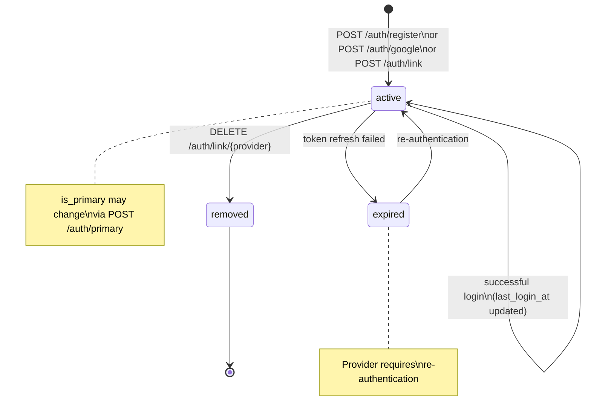

# Reviewing athlete-auth refresh token schema and architecture

**Session ID:** ses_14b5d94b3ffe9FL4shLxhnr2w1
**Created:** 6/10/2026, 11:03:23 PM
**Updated:** 6/10/2026, 11:15:34 PM

---

## User

the implemenation architect identified a gep in the architecyre and already updated the documentaiton aroud:
Need maybe update athlete-auth TypeScript schema to include RefreshToken type and storage model. But adding full schema may be more than minor. But necessary. We can add a paragraph under TypeScript Schema after AuthTokens? Need exact oldString. We can insert after AuthTokens type block. But maybe too much. The implementation plan can define refresh token table but architecture contract should include. Since subphase says refresh token table. Need "resolve architecture gaps". We can update athlete-auth.md with minimal detail:
After AuthTokens type block, add:
type RefreshToken = {
  id: string // UUID, PK
  athlete_id: string // UUID, FK -> Athlete
  token_hash: string // SHA-256/HMAC hash; never returned or logged
  expires_at: string // ISO 8601, 30 days from issuance
  revoked_at: string | null
  replaced_by_refresh_token_id: string | null
  created_at: string
  user_agent: string | null
  ip_address: string | null
}
Add invariants:
- RefreshToken records are append-only. Rotation revokes old token and creates new token atomically; no UPDATE of existing refresh token rows.
- Refresh tokens expire 30 days after issuance and are rotated on every use.
- Old refresh token is revoked atomically with new token creation.
Add storage model table:
athlete_refresh_tokens table | append-only revocation ledger | strong | 30 days after revoked_at or expires_at
Indexes: unique token_hash, index athlete_id, expires_at.
APIs: Add POST /auth/refresh details.
Implementation Notes: "Refresh tokens are stored as one-way hashes, never plaintext; rotation..." But if we add, it's architecture not implementation ADR. Good. 

but I would like you to review the concept and one confirm if you agree with this nmissing gap and check if the architecture documenation is all correct

---

## Assistant (P-Technical-Advisor · Qwen3.5-397b (nvidia cloud) · 5.1s)

I'll review the refresh token architecture gap and verify the documentation consistency. Let me first examine the current state of the athlete-auth entity and related concepts.


**Tool: pheidipp-codebase-context_get_entity_context**

**Input:**
```json
{
  "entity_name": "athlete-auth"
}
```

**Output:**
```
{
  "entity": "athlete-auth",
  "graph": {
    "related_entities": [],
    "produces_events": [
      "`athlete_registered`",
      "`athlete_logged_in`",
      "`auth_method_added`",
      "`auth_method_removed`"
    ],
    "consumes_events": [],
    "used_by_agents": [],
    "invariants": [
      {
        "field": "AthleteAuth",
        "rule": "One `AthleteAuth` record per `(athlete_id, provider)`. An athlete cannot link the same provider twice.",
        "type": "behavioral",
        "enforcement": "application"
      },
      {
        "field": "hashed_password",
        "rule": "`hashed_password` is never returned by any API endpoint or included in any log. Encrypted at rest.",
        "type": "behavioral",
        "enforcement": "api"
      },
      {
        "field": "provider_tokens",
        "rule": "`provider_tokens` is never returned by any API endpoint or included in any log. Encrypted at rest.",
        "type": "behavioral",
        "enforcement": "api"
      },
      {
        "field": "provider_user_id",
        "rule": "`provider_user_id` is never returned in API responses. Used for OAuth account matching only.",
        "type": "behavioral",
        "enforcement": "api"
      },
      {
        "field": "AthleteAuth",
        "rule": "Exactly one `AthleteAuth` record per athlete must have `is_primary = true`. Primary cannot be removed without reassigning.",
        "type": "uniqueness",
        "enforcement": "application"
      },
      {
        "field": null,
        "rule": "Refresh tokens are rotated on every use \u2014 old token is revoked atomically with new token creation.",
        "type": "behavioral",
        "enforcement": "application"
      },
      {
        "field": "RefreshToken",
        "rule": "`RefreshToken` records are append-only revocation records; rotation revokes the old token and inserts a new token record.",
        "type": "behavioral",
        "enforcement": "application"
      },
      {
        "field": "hashed_password",
        "rule": "Email provider requires `hashed_password` (bcrypt). Google provider requires `provider_tokens`. Strava provider requires both `provider_tokens` and `provider_user_id`.",
        "type": "behavioral",
        "enforcement": "application"
      },
      {
        "field": null,
        "rule": "OAuth tokens are refreshed transparently. A failed refresh marks the provider as requiring re-authentication.",
        "type": "behavioral",
        "enforcement": "application"
      }
    ],
    "api_endpoints": [
      {
        "method": "POST",
        "path": "/auth/register",
        "auth": "Bearer JWT",
        "response_status": 200
      },
      {
        "method": "POST",
        "path": "/auth/google",
        "auth": "Bearer JWT",
        "response_status": 200
      },
      {
        "method": "POST",
        "path": "/auth/strava",
        "auth": "Bearer JWT",
        "response_status": 200
      },
      {
        "method": "POST",
        "path": "/auth/login",
        "auth": "Bearer JWT",
        "response_status": 200
      },
      {
        "method": "POST",
        "path": "/auth/login/google",
        "auth": "Bearer JWT",
        "response_status": 200
      },
      {
        "method": "POST",
        "path": "/auth/refresh",
        "auth": "Bearer JWT",
        "response_status": 200
      },
      {
        "method": "POST",
        "path": "/athletes/{athlete_id}/auth/link",
        "auth": "Bearer JWT",
        "response_status": 200
      },
      {
        "method": "DELETE",
        "path": "/athletes/{athlete_id}/auth/link/{provider}",
        "auth": "Bearer JWT",
        "response_status": 200
      },
      {
        "method": "GET",
        "path": "/athletes/{athlete_id}/auth/methods",
        "auth": "Bearer JWT",
        "response_status": 200
      },
      {
        "method": "PATCH",
        "path": "/athletes/{athlete_id}/auth/primary",
        "auth": "Bearer JWT",
        "response_status": 200
      },
      {
        "method": "PATCH",
        "path": "/athletes/{athlete_id}/auth/password",
        "auth": "Bearer JWT",
        "response_status": 200
      }
    ],
    "storage_models": [
      {
        "table": "athlete_auths` table",
        "strategy": "mutable",
        "consistency": "strong",
        "retention": "indefinite"
      },
      {
        "table": "athlete_refresh_tokens` table",
        "strategy": "append-only revocation ledger",
        "consistency": "strong",
        "retention": "30 days after `revoked_at` or `expires_at`"
      }
    ]
  },
  "sections": {
    "Purpose": "- Stores authentication credentials and provider state for each athlete\n- Abstracts authentication method (email/password, Google, Strava) from the core identity entity\n- Enables multi-provider authentication and account linking without mutating the Athlete entity\n- Owns credential lifecycle: creation, validation, token refresh, revocation",
    "TypeScript Schema": "```typescript\ntype AuthProvider = 'email' | 'google' | 'strava'\n\ntype AthleteAuth = {\n  id: string                          // UUID, PK\n  athlete_id: string                  // UUID, FK \u2192 Athlete\n  provider: AuthProvider              // authentication method\n  provider_user_id: string | null     // provider-specific user ID (Google sub, Strava athlete_id)\n  hashed_password: string | null      // bcrypt; null for OAuth providers\n  provider_tokens: AuthTokens | null  // encrypted JSON; null for email provider\n  is_primary: boolean                 // primary auth method for login\n  last_login_at: string | null        // ISO 8601; updated on each login\n  created_at: string                  // ISO 8601\n  updated_at: string                  // ISO 8601\n}\n\ntype AuthTokens = {\n  access_token: string                // provider access token\n  refresh_token: string | null        // provider refresh token\n  expires_at: string | null           // ISO 8601; when access_token expires\n  scope: string | null                // granted scopes\n}\n\ntype RefreshToken = {\n  id: string                          // UUID, PK\n  athlete_id: string                  // UUID, FK \u2192 Athlete\n  token_hash: string                  // one-way hash; never returned or logged\n  expires_at: string                  // ISO 8601; 30 days from issuance\n  revoked_at: string | null           // ISO 8601; null until rotation/revocation\n  replaced_by_refresh_token_id: string | null\n  created_at: string                  // ISO 8601\n  user_agent: string | null\n  ip_address: string | null\n}\n\ntype AthleteAuthCreateRequest = {\n  provider: AuthProvider\n  email?: string                      // required for email provider\n  password?: string                   // required for email provider; min 8 chars\n  id_token?: string                   // required for Google provider\n  provider_user_id?: string           // required for Strava provider\n  provider_tokens?: AuthTokens        // required for Strava provider\n}\n\ntype AthleteAuthLinkRequest = {\n  provider: AuthProvider\n  email?: string\n  password?: string\n  id_token?: string\n  provider_user_id?: string\n  provider_tokens?: AuthTokens\n}\n\ntype AthleteAuthResponse = {\n  id: string\n  provider: AuthProvider\n  is_primary: boolean\n  last_login_at: string | null\n  created_at: string\n  // hashed_password, provider_tokens, provider_user_id never included\n}\n```",
    "Invariants": "- One `AthleteAuth` record per `(athlete_id, provider)`. An athlete cannot link the same provider twice.\n- `hashed_password` is never returned by any API endpoint or included in any log. Encrypted at rest.\n- `provider_tokens` is never returned by any API endpoint or included in any log. Encrypted at rest.\n- `provider_user_id` is never returned in API responses. Used for OAuth account matching only.\n- Exactly one `AthleteAuth` record per athlete must have `is_primary = true`. Primary cannot be removed without reassigning.\n- Refresh tokens are rotated on every use \u2014 old token is revoked atomically with new token creation.\n- `RefreshToken` records are append-only revocation records; rotation revokes the old token and inserts a new token record.\n- Email provider requires `hashed_password` (bcrypt). Google provider requires `provider_tokens`. Strava provider requires both `provider_tokens` and `provider_user_id`.\n- OAuth tokens are refreshed transparently. A failed refresh marks the provider as requiring re-authentication.",
    "State Transitions": "```mermaid\nstateDiagram-v2\n    [*] --> active : POST /auth/register\\nor POST /auth/google\\nor POST /auth/link\n    active --> active : successful login\\n(last_login_at updated)\n    active --> expired : token refresh failed\n    expired --> active : re-authentication\n    active --> removed : DELETE /auth/link/{provider}\n    removed --> [*]\n    note right of active : is_primary may change\\nvia POST /auth/primary\n    note right of expired : Provider requires\\nre-authentication\n```",
    "Events": "### Produced\n| Event | Trigger | Version | Payload |\n|---|---|---|---|\n| `athlete_registered` | Athlete + AthleteAuth created (POST /auth/register or /auth/google) | v1 | `{auth_provider, has_password, profile_completed}` |\n| `athlete_logged_in` | Successful login validation | v1 | `{auth_provider, token_type, ip_address, user_agent}` |\n| `auth_method_added` | New AthleteAuth record created | v1 | `{provider, is_primary, has_password}` |\n| `auth_method_removed` | AthleteAuth record deleted | v1 | `{provider, remaining_methods, was_primary}` |\n\n### Consumed\nNone.",
    "APIs": "```yaml\n# Registration endpoints (create Athlete + AthleteAuth + AthleteProfile atomically)\nPOST /auth/register\nRequest:\n  email: string, required, valid email\n  password: string, required, min 8 chars\n  profile: { date_of_birth, sex, height_cm? }\nResponse: 201\n  athlete: AthleteResponse\n  access_token: string\n  refresh_token: string\nNote: Creates Athlete, AthleteAuth (provider=email), and AthleteProfile in single transaction.\n\nPOST /auth/google\nRequest:\n  id_token: string, required  # Google ID token from client-side OAuth flow\n  profile: { date_of_birth, sex, height_cm? }\nResponse: 201\n  athlete: AthleteResponse\n  access_token: string\n  refresh_token: string\nNote: Validates id_token with Google, extracts email/sub, creates Athlete + AthleteAuth + AthleteProfile.\n\nPOST /auth/strava\nRequest:\n  code: string, required  # Strava authorization code from client-side OAuth flow\n  profile: { date_of_birth, sex, height_cm? }\nResponse: 201\n  athlete: AthleteResponse\n  access_token: string\n  refresh_token: string\nNote: Exchanges code for tokens with Strava API, creates Athlete + AthleteAuth + AthleteProfile.\n\n# Login endpoint\nPOST /auth/login\nRequest:\n  email: string, required\n  password: string, required\nResponse: 200\n  athlete: AthleteResponse\n  access_token: string\n  refresh_token: string\nNote: Validates credentials against AthleteAuth record. Returns 401 on failure.\n\nPOST /auth/login/google\nRequest:\n  id_token: string, required\nResponse: 200\n  athlete: AthleteResponse\n  access_token: string\n  refresh_token: string\nNote: Validates Google id_token, matches provider_user_id to existing AthleteAuth.\n\n# Token refresh\nPOST /auth/refresh\nRequest:\n  refresh_token: string, required\nResponse: 200\n  access_token: string\n  refresh_token: string\nNote: Rotates the refresh token atomically; the old token is invalid after response.\n\n# Account linking (requires authenticated athlete)\nPOST /athletes/{athlete_id}/auth/link\nRequest:\n  provider: AuthProvider, required\n  password?: string               # required for email provider\n  id_token?: string               # required for Google provider\n  provider_user_id?: string       # required for Strava provider\n  provider_tokens?: AuthTokens    # required for Strava provider\nResponse: 201\n  auth_method: AthleteAuthResponse\nAuth: Bearer JWT, require_self\nNote: Returns 409 if provider already linked. Returns 422 if required fields missing for provider.\n\nDELETE /athletes/{athlete_id}/auth/link/{provider}\nResponse: 204\nAuth: Bearer JWT, require_self\nNote: Returns 409 if attempting to remove last auth method or primary without reassignment.\n\n# Auth method management\nGET /athletes/{athlete_id}/auth/methods\nResponse: 200\n  auth_methods: AthleteAuthResponse[]  # credentials excluded\nAuth: Bearer JWT, require_self\n\nPATCH /athletes/{athlete_id}/auth/primary\nRequest:\n  provider: AuthProvider, required\nResponse: 200\n  auth_methods: AthleteAuthResponse[]\nAuth: Bearer JWT, require_self\nNote: Sets the specified provider as primary. Old primary becomes non-primary.\n\n# Password management\nPATCH /athletes/{athlete_id}/auth/password\nRequest:\n  current_password: string, required\n  new_password: string, required, min 8 chars\nResponse: 200\nAuth: Bearer JWT, require_self\nNote: Only for email provider. Returns 404 if no email provider linked.\n```",
    "Storage Model": "| Data | Strategy | Consistency | Retention |\n|---|---|---|---|\n| `athlete_auths` table | mutable | strong | indefinite |\n| `athlete_refresh_tokens` table | append-only revocation ledger | strong | 30 days after `revoked_at` or `expires_at` |\n\n**Indexes:**\n- `UNIQUE (athlete_id, provider)` \u2014 one record per provider per athlete\n- `UNIQUE (token_hash)` \u2014 refresh token lookup without storing plaintext tokens\n- `INDEX (athlete_id, expires_at)` \u2014 session cleanup and audit\n- `INDEX (provider_user_id)` \u2014 OAuth account lookup (nullable; only set for OAuth providers)",
    "Mutation Rules": "| Layer | Read | Write | Delete |\n|---|---|---|---|\n| API | Yes (excluding credentials) | POST link, PATCH password/primary | DELETE unlink |\n| Service | Yes (including credentials) | Yes | Yes |\n| Repository | Yes | Yes | Yes |",
    "Runtime Ownership": "Owns:\n- Authentication credentials (hashed_password, provider_tokens)\n- Provider identity mapping (provider_user_id)\n- Primary auth method designation\n- Last login timestamp\n\nDoes Not Own:\n- Athlete identity (email, onboarding status) \u2192 `01-entities/athlete.md`\n- JWT token signing and verification \u2192 `03-agents/` (auth service)\n- Third-party platform credentials (intervals.icu, Garmin) \u2192 `01-entities/athlete-integration.md`",
    "Failure Semantics": "- Registration with duplicate email \u2192 409 Conflict; no partial state created\n- Google id_token validation failure \u2192 401 Unauthorized\n- Strava token exchange failure \u2192 502 Bad Gateway (upstream provider error)\n- Link already-connected provider \u2192 409 Conflict\n- Unlink last auth method \u2192 409 Conflict\n- Password validation failure \u2192 401 Unauthorized (no timing leak; constant-time comparison)\n- OAuth token refresh failure \u2192 marks provider as expired; athlete must re-authenticate",
    "Performance Constraints": "- `POST /auth/register`: p95 < 300ms (creates Athlete + AthleteAuth + AthleteProfile atomically)\n- `POST /auth/login`: p95 < 200ms (bcrypt verification)\n- `POST /auth/refresh`: p95 < 100ms (token signing only)\n- `POST /auth/link`: p95 < 200ms\n- `GET /auth/methods`: p95 < 50ms",
    "Observability": "Metrics:\n- `athlete.auth.registrations.total`: count of new registrations by provider\n- `athlete.auth.logins.total`: count of successful logins by provider\n- `athlete.auth.logins.failed.total`: count of failed login attempts\n- `athlete.auth.methods.linked.total`: count of linked auth methods by provider\n- `athlete.auth.methods.removed.total`: count of removed auth methods by provider\n- `athlete.auth.oauth.refresh.failures.total`: count of OAuth token refresh failures\n\nLogs:\n- `athlete.registered`: athlete_id, auth_provider, has_password (never log email or credentials)\n- `athlete.logged_in`: athlete_id, auth_provider, success (never log credentials)\n- `auth_method.linked`: athlete_id, provider\n- `auth_method.removed`: athlete_id, provider",
    "Implementation Notes": "- Registration atomically creates `Athlete` + `AthleteAuth` + `AthleteProfile` in a single database transaction. If any part fails, all roll back.\n- `hashed_password` uses bcrypt with cost factor \u226512. Never stored in plaintext.\n- `provider_tokens` are encrypted at rest using application-layer encryption (AES-256-GCM). The encryption key is not stored in the database.\n- OAuth token refresh is handled transparently by a background task. If refresh fails, the `AthleteAuth` record is not deleted \u2014 it is marked as requiring re-authentication.\n- The `require_self` FastAPI dependency validates `JWT.athlete_id === path.athlete_id`. It does not validate auth provider \u2014 all providers use the same authorization model.\n- JWT claims include `athlete_id` and optionally `auth_provider`. The `auth_provider` claim is informational and does not affect authorization logic."
  }
}
```

---

## Assistant (P-Technical-Advisor · Qwen3.5-397b (nvidia cloud) · 3.9s)

Good, I can see the documentation has already been updated with the `RefreshToken` type and related invariants. Let me now check for any gaps or inconsistencies by examining:

1. The event contracts related to authentication
2. Any related entities that might have dependencies
3. The architectural invariants to ensure consistency


**Tool: pheidipp-codebase-context_get_event_context**

**Input:**
```json
{
  "event_name": "athlete_logged_in"
}
```

**Output:**
```
{
  "event": "athlete_logged_in",
  "error": "No entities found producing or consuming this event."
}
```

**Tool: pheidipp-codebase-context_get_event_context**

**Input:**
```json
{
  "event_name": "athlete_registered"
}
```

**Output:**
```
{
  "event": "athlete_registered",
  "error": "No entities found producing or consuming this event."
}
```

**Tool: pheidipp-codebase-context_search_invariants**

**Input:**
```json
{
  "query": "refresh token rotation append-only"
}
```

**Output:**
```
[
  {
    "entity": "event-catalogue",
    "field": null,
    "rule": "All events are append-only \u2014 events are never updated or deleted",
    "type": "behavioral",
    "enforcement": "application"
  },
  {
    "entity": "principles",
    "field": null,
    "rule": "4. **TwinState is append-only.** Every recalibration appends a new record. Old records are never updated or deleted. This is what makes coaching decisions auditable and reprocessing safe.",
    "type": "behavioral",
    "enforcement": "application"
  },
  {
    "entity": "principles",
    "field": "AthletePhysiology",
    "rule": "14. **Algorithm improvements reprocess recent history.** When a calibration algorithm improves or a new metric becomes available, the system reprocesses recent calibration-eligible sessions through the new algorithm. This accelerates the benefit of improvements without waiting passively for new data. The current state (`AthletePhysiology`, `AthleteFitness`) updates to reflect the improved algorithm. Historical records (`TwinState`, `PhysiologyMeasurement`) remain untouched \u2014 the audit trail is preserved through version strings and append-only writes. The athlete receives a coaching communication explaining what changed and why. *(Implements vision principle \"Continuous Learning From Real Training\" from `docs/vision/twin/data-philosophy.md`.)*",
    "type": "behavioral",
    "enforcement": "application"
  },
  {
    "entity": "generation-event",
    "field": "input_token_count",
    "rule": "`input_token_count` and `output_token_count` are required even on failure \u2014 capture whatever was available before failure.",
    "type": "behavioral",
    "enforcement": "application"
  },
  {
    "entity": "objective",
    "field": "ObjectiveUpdate",
    "rule": "`ObjectiveUpdate` is append-only. Updates accumulate as a history.",
    "type": "behavioral",
    "enforcement": "application"
  },
  {
    "entity": "athlete-auth",
    "field": "provider_tokens",
    "rule": "`provider_tokens` is never returned by any API endpoint or included in any log. Encrypted at rest.",
    "type": "behavioral",
    "enforcement": "api"
  },
  {
    "entity": "athlete-auth",
    "field": null,
    "rule": "Refresh tokens are rotated on every use \u2014 old token is revoked atomically with new token creation.",
    "type": "behavioral",
    "enforcement": "application"
  },
  {
    "entity": "athlete-auth",
    "field": "RefreshToken",
    "rule": "`RefreshToken` records are append-only revocation records; rotation revokes the old token and inserts a new token record.",
    "type": "behavioral",
    "enforcement": "application"
  },
  {
    "entity": "athlete-auth",
    "field": "hashed_password",
    "rule": "Email provider requires `hashed_password` (bcrypt). Google provider requires `provider_tokens`. Strava provider requires both `provider_tokens` and `provider_user_id`.",
    "type": "behavioral",
    "enforcement": "application"
  },
  {
    "entity": "athlete-auth",
    "field": null,
    "rule": "OAuth tokens are refreshed transparently. A failed refresh marks the provider as requiring re-authentication.",
    "type": "behavioral",
    "enforcement": "application"
  },
  {
    "entity": "cycle-phase-log",
    "field": "CyclePhaseLog",
    "rule": "**Mutability vs Immutability Tension:** `CyclePhaseLog` allows correction (new log with corrected `cycle_day_one_date` supersedes). `AdaptationObservation` is append-only and stores `cycle_phase` at observation time. If an athlete corrects their cycle day one date, all past `AdaptationObservation` records have incorrect `cycle_phase` values that **cannot be updated**.",
    "type": "behavioral",
    "enforcement": "application"
  },
  {
    "entity": "adaptation-observation",
    "field": "analysis_version",
    "rule": "Records are append-only. Analysis version changes increment `analysis_version` and new records are created alongside old ones (old records receive `superseded_at`).",
    "type": "behavioral",
    "enforcement": "application"
  },
  {
    "entity": "athlete-physiology",
    "field": "AthletePhysiology",
    "rule": "One `AthletePhysiology` record per athlete. **Mutable current-state entity** \u2014 posterior estimates are updated in place on each threshold detection event. Historical state is captured in `TwinState` (inline values). The full measurement history is in `PhysiologyMeasurement` (append-only).",
    "type": "cardinality",
    "enforcement": "application"
  },
  {
    "entity": "athlete-physiology",
    "field": "dominant_source",
    "rule": "**Audit Gap: `dominant_source` Transition History Not Captured** \u2014 `dominant_source` reflects the source currently dominating the posterior (e.g., `lab_test`, `training_rr_inflection`). When Bayesian updates shift the dominant source, the transition is **not recorded**. **Available for audit:** `PhysiologyMeasurement` (raw observations, append-only) and `TwinState` (inline snapshot of parameter states at each trigger). **Missing:** Which source dominated at each step, and why the weighting shifted. **Future enhancement:** When `dominant_source` changes, persist the transition (from \u2192 to \u2192 evidence_weight \u2192 trigger) as either a new field on `PhysiologyMeasurement` or a dedicated `dominant_source_transitions` table. Low priority \u2014 current snapshots in `TwinState` allow reconstruction with effort.",
    "type": "behavioral",
    "enforcement": "application"
  },
  {
    "entity": "context-budget-service",
    "field": null,
    "rule": "Token estimation uses `JSON.stringify(obj).length / 4` \u2014 deterministic, no external dependencies",
    "type": "behavioral",
    "enforcement": "application"
  },
  {
    "entity": "context-budget-service",
    "field": null,
    "rule": "token_budget: number     // estimated tokens",
    "type": "behavioral",
    "enforcement": "application"
  },
  {
    "entity": "context-budget-service",
    "field": null,
    "rule": "{ name: 'session_summary', priority_weight: 100, token_budget: 500 },",
    "type": "behavioral",
    "enforcement": "application"
  },
  {
    "entity": "context-budget-service",
    "field": null,
    "rule": "{ name: 'objectives', priority_weight: 85, token_budget: 400 },",
    "type": "behavioral",
    "enforcement": "application"
  },
  {
    "entity": "context-budget-service",
    "field": null,
    "rule": "{ name: 'comparable_sessions', priority_weight: 75, token_budget: 600 },",
    "type": "behavioral",
    "enforcement": "application"
  },
  {
    "entity": "context-budget-service",
    "field": null,
    "rule": "{ name: 'cycle_phase', priority_weight: 70, token_budget: 150 },",
    "type": "behavioral",
    "enforcement": "application"
  },
  {
    "entity": "context-budget-service",
    "field": null,
    "rule": "{ name: 'weather', priority_weight: 60, token_budget: 200 },",
    "type": "behavioral",
    "enforcement": "application"
  },
  {
    "entity": "context-budget-service",
    "field": null,
    "rule": "{ name: 'race_prediction', priority_weight: 50, token_budget: 300 },",
    "type": "behavioral",
    "enforcement": "application"
  }
]
```

---

## Assistant (P-Technical-Advisor · Qwen3.5-397b (nvidia cloud) · 9.9s)

Now let me check the release plan to see if there are any features related to refresh tokens and verify the sequencing is correct:


**Tool: pheidipp-codebase-context_search_release_plan**

**Input:**
```json
{
  "query": "refresh token authentication"
}
```

**Output:**
```

FILE: phase-1-1-email-password-auth.md
ENTITY: phase-1-1-email-password-auth
TYPE: phase
PHASE_NUMBER: 1
SECTION: exit gate
SCORE: 0.889

- `POST /auth/register` creates an `Athlete` and returns a valid token pair.
- `POST /auth/login` with wrong password returns 401; with correct password returns a new token pair.
- An authenticated request to an athlete-scoped route with a JWT belonging to a different athlete returns 403.
- A request with an expired access token returns 401.
- Refresh token rotation: after `POST /auth/refresh`, the old refresh token is invalid and a new one is usable.


---


FILE: phase-1-1-email-password-auth.md
ENTITY: phase-1-1-email-password-auth
TYPE: phase
PHASE_NUMBER: 1
SECTION: invariants to preserve
SCORE: 0.796

- `email` is unique across all athletes (case-insensitive)
- `hashed_password` is never returned by any API endpoint or included in any log
- Refresh tokens are rotated on every use — old token is revoked atomically with new token creation
- Registration atomically creates `Athlete` and minimal `AthleteProfile`. If either fails, neither is committed.


---


FILE: phase-1-1-email-password-auth.md
ENTITY: phase-1-1-email-password-auth
TYPE: phase
PHASE_NUMBER: 1
SECTION: capabilities delivered
SCORE: 0.571

- Athlete can register with email + password (`POST /auth/register`)
- Athlete can log in with email + password (`POST /auth/login`)
- Access token (JWT, 15min expiry) and refresh token (30-day expiry, rotated on use) lifecycle
- `require_self` route dependency for athlete-scoped endpoints
- Secure password hashing (bcrypt)
- Multi-device session support (via refresh token table)


---


FILE: phase-1-1-email-password-auth.md
ENTITY: phase-1-1-email-password-auth
TYPE: phase
PHASE_NUMBER: 1
SECTION: risks
SCORE: 0.524

- **Password compromise**: bcrypt with appropriate work factor (12+) mitigates this.
- **Token theft**: Short-lived access tokens + refresh token rotation limit window of exposure.


---


FILE: phase-1-1-email-password-auth.md
ENTITY: phase-1-1-email-password-auth
TYPE: phase
PHASE_NUMBER: 1
SECTION: objective
SCORE: 0.028

Establish the authentication layer that all subsequent sub-phases build upon. This delivers a secure, token-based authentication system supporting email/password registration and login. OAuth providers (Google, Strava) are explicitly deferred to later phases — the schema in `AthleteAuth` is designed to accommodate them, but this sub-phase implements only the email/password provider.


---


FILE: phase-1-6-simple-fit-import-post-workout.md
ENTITY: phase-1-6-simple-fit-import-post-workout
TYPE: phase
PHASE_NUMBER: 1
SECTION: upstream dependencies
SCORE: 0.001

- Phase-1.1 (Auth) — authenticated user
- Phase-1.2a (Profile & Activity) — `Activity` schema exists
- Phase-1.2c (Twin & Fitness) — `TwinState`, `AthleteFitness`, `AthletePhysiology` schema exists
- Phase-1.4 (Plan Generation) — `PlannedSession` must exist for compliance comparison
- Phase-1.5 (Coaching Agents) — `PostWorkoutAgent` builds on agent infrastructure from .5a

```

**Tool: pheidipp-codebase-context_get_related_contracts**

**Input:**
```json
{
  "entity_name": "athlete-auth"
}
```

**Output:**
```
{
  "entity": "athlete-auth",
  "related_entities": [],
  "produces_events": [
    "`athlete_registered`",
    "`athlete_logged_in`",
    "`auth_method_added`",
    "`auth_method_removed`"
  ],
  "consumes_events": [],
  "used_by_agents": []
}
```

---

## Assistant (P-Technical-Advisor · Qwen3.5-397b (nvidia cloud) · 14.2s)

Let me also check if there are any vision documents that might have implications for the authentication semantics:


**Tool: pheidipp-codebase-context_search_vision**

**Input:**
```json
{
  "query": "authentication security token session"
}
```

**Output:**
```

FILE: voice-and-format.md
ENTITY: voice-and-format
CATEGORY: coach
SECTION: format rules — universal
SCORE: 0.002

**Three natural paragraphs.** Not two, not four. Not a paragraph followed by a list. Not headers breaking the message into sections. Three flowing paragraphs of prose.

1. Overall session summary and how it compared to the plan
2. The execution story — what actually happened, named specifically
3. Connection to previous sessions and progress on the relevant objectives

**No bullets, no headers, no emojis.** These instantly produce the feeling of AI-generated output. A real coach writes sentences, not bullet points.

**No acronyms without explanation.** HRV, ATL, CTL, TSS, GAP, LT2 — none of these appear in coach messages without being explained in plain English first. In practice, most never appear at all. The coach speaks in concepts, not abbreviations.

**No raw numbers without context.** "Your average HR was 158bpm" means nothing without "which for your current threshold estimates puts you solidly in zone 3 for this effort." Better still: just say what it means, not the number.

**No generic encouragement.** "Great job!" "You're making progress!" "Keep it up!" — none of these. The coach either says something specific or says nothing at all. Vague positivity is worse than silence
[truncated]


---


FILE: voice-and-format.md
ENTITY: voice-and-format
CATEGORY: coach
SECTION: what the coach always does
SCORE: 0.002

**Names specific patterns.** Not "your pacing was good" but "you came through the third rep slightly slower than the second but held it there rather than fading further — that controlled middle section is what good threshold pacing looks like."

**Connects today to the past.** Every structured session post-workout message references a comparable previous session with a specific observation. "Three weeks ago on your last threshold session you faded in the final rep. Today you held it together." This requires knowing which previous session is actually comparable — not just any threshold session, but one in a similar training context.

**Balances recognition with honest coaching.** The coach notices what went well and what to work on. It does not focus only on weaknesses (demoralising) or only on positives (dishonest). A good coach tells you both.

**Addresses the session in the context of where the athlete is in their training.** A hard session in week two of a build phase means something different to the same session in race week. The coach always speaks from the training context.


---


FILE: substitution.md
ENTITY: substitution
CATEGORY: coach
SECTION: unsynced workout handling
SCORE: 0.001

When an expected workout has not appeared in the system, the coach surfaces a simple check-in: "I haven't seen your session from yesterday yet — did you get it done?" rather than making assumptions. The athlete responds with one tap.

If yes: sync or upload is prompted. Plan continues normally.
If no: the standard skip flow handles it — reschedule or let the plan adjust.
If no response: the system holds its judgement and asks again at the next app open.

When the athlete's actual data arrives, any estimates are replaced by real values throughout the model. The full post-workout analysis triggers retroactively.

> **Architecture:** Not owned by `SkipConversationAgent`. This is a distinct check-in flow triggered by missing expected data. The "if no" branch feeds into the standard skip classification pipeline. Ownership of the detection and check-in layer should be identified in the architecture.

---


---


FILE: substitution.md
ENTITY: substitution
CATEGORY: coach
SECTION: workout substitution flow
SCORE: 0.001

**Initiation.** The athlete signals via a button — "I don't feel like this today" — or free text. The button lowers the activation energy required: the athlete does not need to articulate anything, just signal intent. This matters because a fatigued athlete who has to explain themselves before getting help is more likely to simply skip.

**Short conversation.** A brief branching conversation — three to four exchanges — to understand the constraint: fatigue, time pressure, motivation, injury concern. This determines what type of substitution is appropriate. The conversation is not a form — it is the coach asking sensible questions a real coach would ask.

**Resolution.** Once the constraint is understood, the system draws from the pre-built workout library rather than generating a new workout from scratch. The alternative session preserves the training intent where possible — if the athlete can still run but needs shorter duration, the substitution maintains the physiological purpose. If the constraint is injury-related, the substitution may shift to cross-training.

**Post-hoc detection.** If the athlete uploads session data that does not match the planned session structure, the sy
[truncated]

```

**Tool: pheidipp-codebase-context_search_architecture**

**Input:**
```json
{
  "query": "refresh token rotation security"
}
```

**Output:**
```

FILE: athlete-auth.md
ENTITY: athlete-auth
SECTION: invariants
SCORE: 0.92

- One `AthleteAuth` record per `(athlete_id, provider)`. An athlete cannot link the same provider twice.
- `hashed_password` is never returned by any API endpoint or included in any log. Encrypted at rest.
- `provider_tokens` is never returned by any API endpoint or included in any log. Encrypted at rest.
- `provider_user_id` is never returned in API responses. Used for OAuth account matching only.
- Exactly one `AthleteAuth` record per athlete must have `is_primary = true`. Primary cannot be removed without reassigning.
- Refresh tokens are rotated on every use — old token is revoked atomically with new token creation.
- `RefreshToken` records are append-only revocation records; rotation revokes the old token and inserts a new token record.
- Email provider requires `hashed_password` (bcrypt). Google provider requires `provider_tokens`. Strava provider requires both `provider_tokens` and `provider_user_id`.
- OAuth tokens are refreshed transparently. A failed refresh marks the provider as requiring re-authentication.


---


FILE: athlete-auth.md
ENTITY: athlete-auth
SECTION: apis
SCORE: 0.865

```yaml
# Registration endpoints (create Athlete + AthleteAuth + AthleteProfile atomically)
POST /auth/register
Request:
  email: string, required, valid email
  password: string, required, min 8 chars
  profile: { date_of_birth, sex, height_cm? }
Response: 201
  athlete: AthleteResponse
  access_token: string
  refresh_token: string
Note: Creates Athlete, AthleteAuth (provider=email), and AthleteProfile in single transaction.

POST /auth/google
Request:
  id_token: string, required  # Google ID token from client-side OAuth flow
  profile: { date_of_birth, sex, height_cm? }
Response: 201
  athlete: AthleteResponse
  access_token: string
  refresh_token: string
Note: Validates id_token with Google, extracts email/sub, creates Athlete + AthleteAuth + AthleteProfile.

POST /auth/strava
Request:
  code: string, required  # Strava authorization code from client-side OAuth flow
  profile: { date_of_birth, sex, height_cm? }
Response: 201
  athlete: AthleteResponse
  access_token: string
  refresh_token: string
Note: Exchanges code for tokens with Strava API, creates Athlete + AthleteAuth + AthleteProfile.

# Login endpoint
POST /auth/login
Request:
  email: string, required
  password: st
[truncated]


---


FILE: athlete-auth.md
ENTITY: athlete-auth
SECTION: typescript schema
SCORE: 0.822

```typescript
type AuthProvider = 'email' | 'google' | 'strava'

type AthleteAuth = {
  id: string                          // UUID, PK
  athlete_id: string                  // UUID, FK → Athlete
  provider: AuthProvider              // authentication method
  provider_user_id: string | null     // provider-specific user ID (Google sub, Strava athlete_id)
  hashed_password: string | null      // bcrypt; null for OAuth providers
  provider_tokens: AuthTokens | null  // encrypted JSON; null for email provider
  is_primary: boolean                 // primary auth method for login
  last_login_at: string | null        // ISO 8601; updated on each login
  created_at: string                  // ISO 8601
  updated_at: string                  // ISO 8601
}

type AuthTokens = {
  access_token: string                // provider access token
  refresh_token: string | null        // provider refresh token
  expires_at: string | null           // ISO 8601; when access_token expires
  scope: string | null                // granted scopes
}

type RefreshToken = {
  id: string                          // UUID, PK
  athlete_id: string                  // UUID, FK → Athlete
  token_hash: string     
[truncated]


---


FILE: athlete-auth.md
ENTITY: athlete-auth
SECTION: storage model
SCORE: 0.255

| Data | Strategy | Consistency | Retention |
|---|---|---|---|
| `athlete_auths` table | mutable | strong | indefinite |
| `athlete_refresh_tokens` table | append-only revocation ledger | strong | 30 days after `revoked_at` or `expires_at` |

**Indexes:**
- `UNIQUE (athlete_id, provider)` — one record per provider per athlete
- `UNIQUE (token_hash)` — refresh token lookup without storing plaintext tokens
- `INDEX (athlete_id, expires_at)` — session cleanup and audit
- `INDEX (provider_user_id)` — OAuth account lookup (nullable; only set for OAuth providers)


---


FILE: observability.md
ENTITY: observability
SECTION: alert conditions
SCORE: 0.201

### P1 — Immediate Response (< 15 minutes)

| Condition | Threshold | Meaning |
|---|---|---|
| `activity.fit_parse.failures` spike | > 5 in 10 minutes | Object storage or parser issue |
| `coaching_message.generation.success_rate` drop | < 80% for any agent over 15 min | LLM API issue |
| DLQ non-empty | Any entry | Task failing after max retries |
| `twin_state.recalibration.failures` | > 3 consecutive per athlete | Twin update pipeline broken |

### P2 — Response Within 2 Hours

| Condition | Threshold | Meaning |
|---|---|---|
| `activity.ingestion.latency_ms` p95 | > 60s | Ingestion pipeline degraded |
| `activity.load_compute.failures` spike | > 10 in 15 minutes | Load computation systemic issue |
| `activity.load_compute.stuck.count` | > 0 | Activities in DLQ — manual intervention needed |
| `athlete.auth.logins.failed.total` | > 10 in 5 minutes | Possible brute force or credential stuffing |
| `athlete.auth.oauth.refresh.failures.total` | > 5 consecutive for same provider | OAuth provider token refresh broken |
| `intervals_icu.sync.failures` | > 5 consecutive for same athlete | Integration broken |
| `weather_forecast.fetch.success_rate` | < 70% over 1h | Weather API issue
[truncated]


---


FILE: athlete-auth.md
ENTITY: athlete-auth
SECTION: implementation notes
SCORE: 0.084

- Registration atomically creates `Athlete` + `AthleteAuth` + `AthleteProfile` in a single database transaction. If any part fails, all roll back.
- `hashed_password` uses bcrypt with cost factor ≥12. Never stored in plaintext.
- `provider_tokens` are encrypted at rest using application-layer encryption (AES-256-GCM). The encryption key is not stored in the database.
- OAuth token refresh is handled transparently by a background task. If refresh fails, the `AthleteAuth` record is not deleted — it is marked as requiring re-authentication.
- The `require_self` FastAPI dependency validates `JWT.athlete_id === path.athlete_id`. It does not validate auth provider — all providers use the same authorization model.
- JWT claims include `athlete_id` and optionally `auth_provider`. The `auth_provider` claim is informational and does not affect authorization logic.

```

---

## Assistant (P-Technical-Advisor · Qwen3.5-397b (nvidia cloud) · 2.1s)

Now let me verify the event catalogue to ensure the event contracts are properly defined:


**Tool: pheidipp-codebase-context_list_entities**

**Input:**
```json
{}
```

**Output:**
```
[
  "activity",
  "adaptation-observation",
  "adaptation-signature",
  "architecture-index",
  "async-pipeline",
  "athlete",
  "athlete-auth",
  "athlete-fitness",
  "athlete-integration",
  "athlete-physiology",
  "athlete-preferences",
  "athlete-profile",
  "athlete-wellness",
  "athlete-wellness-baseline",
  "banister-update",
  "checkpoint",
  "coaching-message",
  "comparable-sessions",
  "confidence-model",
  "context-budget-service",
  "cycle-phase-log",
  "data-tiers",
  "document-template",
  "effort-normalisation",
  "event-catalogue",
  "event-topology",
  "evidence-mapping",
  "execution-observation",
  "failure-handling",
  "first-message-agent",
  "generated-workout",
  "generation-event",
  "hypothesis-agent",
  "hypothesis-selector-agent",
  "load-computation",
  "lt1-detection",
  "objective",
  "objective-management",
  "observability",
  "physiological-segment",
  "physiology-update",
  "plan-generation",
  "plan-generation-fitness-improvement",
  "plan-generation-maintenance",
  "plan-generation-race",
  "plan-generation-recovery",
  "plan-generation-target-performance",
  "planned-session",
  "post-workout-agent",
  "pre-week-review-agent",
  "principles",
  "race-prediction",
  "raw-sensor-stream",
  "regeneration-task",
  "segmentation-heuristic",
  "segmentation-hmm",
  "session-count",
  "session-lifecycle",
  "signal-cleaning",
  "skip-conversation-agent",
  "storage-topology",
  "terminology",
  "threshold-detection",
  "training-goal",
  "training-plan",
  "twin-context-assembler",
  "twin-state",
  "versioning-and-reprocessing",
  "weather-forecast",
  "weekly-plan",
  "weekly-synthesis-agent",
  "wellness-alert-agent",
  "wellness-modifier",
  "workout-generation-agent",
  "workout-library-entry",
  "workout-step"
]
```

---

## Assistant (P-Technical-Advisor · Qwen3.5-397b (nvidia cloud) · 3.1s)

**Tool: pheidipp-codebase-context_get_entity_context**

**Input:**
```json
{
  "sections": [
    "Events"
  ],
  "entity_name": "event-catalogue"
}
```

**Output:**
```
{
  "entity": "event-catalogue",
  "graph": {
    "related_entities": [],
    "produces_events": [],
    "consumes_events": [],
    "used_by_agents": [],
    "invariants": [
      {
        "field": "athlete_id",
        "rule": "All events are scoped to a single `athlete_id`",
        "type": "behavioral",
        "enforcement": "application"
      },
      {
        "field": "event_id",
        "rule": "`event_id` is a UUID, generated at the point of production",
        "type": "behavioral",
        "enforcement": "application"
      },
      {
        "field": null,
        "rule": "All events are append-only \u2014 events are never updated or deleted",
        "type": "behavioral",
        "enforcement": "application"
      },
      {
        "field": null,
        "rule": "Failed event processing is retried; events are not consumed destructively",
        "type": "behavioral",
        "enforcement": "application"
      }
    ],
    "api_endpoints": [],
    "storage_models": [
      {
        "table": "System events",
        "strategy": "append-only event log",
        "consistency": "eventual",
        "retention": "90 days (operational window)"
      },
      {
        "table": "Trigger events (TwinState causal)",
        "strategy": "append-only event log",
        "consistency": "eventual",
        "retention": "1 year"
      },
      {
        "table": "Event dead-letter queue",
        "strategy": "append-only",
        "consistency": "strong",
        "retention": "30 days"
      }
    ]
  },
  "sections": {},
  "related_entities": {}
}
```

---

## Assistant (P-Technical-Advisor · Qwen3.5-397b (nvidia cloud) · 12.1s)

Let me search for more specific documentation about the refresh token table structure and verify consistency:


**Tool: pheidipp-codebase-context_search_architecture**

**Input:**
```json
{
  "query": "athlete_refresh_tokens table schema index"
}
```

**Output:**
```

FILE: athlete-auth.md
ENTITY: athlete-auth
SECTION: storage model
SCORE: 0.97

| Data | Strategy | Consistency | Retention |
|---|---|---|---|
| `athlete_auths` table | mutable | strong | indefinite |
| `athlete_refresh_tokens` table | append-only revocation ledger | strong | 30 days after `revoked_at` or `expires_at` |

**Indexes:**
- `UNIQUE (athlete_id, provider)` — one record per provider per athlete
- `UNIQUE (token_hash)` — refresh token lookup without storing plaintext tokens
- `INDEX (athlete_id, expires_at)` — session cleanup and audit
- `INDEX (provider_user_id)` — OAuth account lookup (nullable; only set for OAuth providers)


---


FILE: athlete-auth.md
ENTITY: athlete-auth
SECTION: apis
SCORE: 0.556

```yaml
# Registration endpoints (create Athlete + AthleteAuth + AthleteProfile atomically)
POST /auth/register
Request:
  email: string, required, valid email
  password: string, required, min 8 chars
  profile: { date_of_birth, sex, height_cm? }
Response: 201
  athlete: AthleteResponse
  access_token: string
  refresh_token: string
Note: Creates Athlete, AthleteAuth (provider=email), and AthleteProfile in single transaction.

POST /auth/google
Request:
  id_token: string, required  # Google ID token from client-side OAuth flow
  profile: { date_of_birth, sex, height_cm? }
Response: 201
  athlete: AthleteResponse
  access_token: string
  refresh_token: string
Note: Validates id_token with Google, extracts email/sub, creates Athlete + AthleteAuth + AthleteProfile.

POST /auth/strava
Request:
  code: string, required  # Strava authorization code from client-side OAuth flow
  profile: { date_of_birth, sex, height_cm? }
Response: 201
  athlete: AthleteResponse
  access_token: string
  refresh_token: string
Note: Exchanges code for tokens with Strava API, creates Athlete + AthleteAuth + AthleteProfile.

# Login endpoint
POST /auth/login
Request:
  email: string, required
  password: st
[truncated]


---


FILE: athlete-wellness-baseline.md
ENTITY: athlete-wellness-baseline
SECTION: storage model
SCORE: 0.389

| Data | Strategy | Consistency | Retention |
|---|---|---|---|
| `athlete_wellness_baselines` table | upsert (overwrite on recompute) | strong | indefinite |

Index: `(athlete_id, signal)` — primary key equivalent.


---


FILE: athlete-preferences.md
ENTITY: athlete-preferences
SECTION: performance constraints
SCORE: 0.328

- `GET /athletes/{id}/preferences`: p95 < 50ms
- `PATCH /athletes/{id}/preferences`: p95 < 100ms


---


FILE: athlete.md
ENTITY: athlete
SECTION: storage model
SCORE: 0.322

| Data | Strategy | Consistency | Retention |
|---|---|---|---|
| `athletes` table | mutable | strong | indefinite |


---


FILE: training-goal.md
ENTITY: training-goal
SECTION: storage model
SCORE: 0.317

| Data | Strategy | Consistency | Retention |
|---|---|---|---|
| `training_goals` table | Append-only (status mutable) | Strong | Indefinite |
| `secondary_events` table | Mutable | Strong | Indefinite |
| `regeneration_tasks` table | Append-only (status mutable) | Strong | Indefinite |

**Indexes:**
-   `CREATE UNIQUE INDEX idx_training_goals_active ON training_goals (athlete_id) WHERE status = 'active';`
-   `CREATE INDEX idx_regeneration_tasks_pending ON regeneration_tasks (training_goal_id, status) WHERE status = 'pending_confirmation';`

---

```

**Tool: pheidipp-codebase-context_get_change_impact**

**Input:**
```json
{
  "concept": "RefreshToken"
}
```

**Output:**
```
{
  "concept": "RefreshToken",
  "architecture": {
    "not_found": true
  },
  "release_plan": {
    "not_found": true
  },
  "vision": {
    "not_found": true
  }
}
```

---

## Assistant (P-Technical-Advisor · Qwen3.5-397b (nvidia cloud) · 8.7s)

The `get_change_impact` shows that `RefreshToken` is not yet indexed as a standalone concept. This is expected - it's a type within `athlete-auth`, not a top-level entity. Let me now do a comprehensive review by checking if there are any inconsistencies or missing pieces:


**Tool: pheidipp-codebase-context_search_architecture**

**Input:**
```json
{
  "query": "POST /auth/refresh token rotation"
}
```

**Output:**
```

FILE: athlete-auth.md
ENTITY: athlete-auth
SECTION: apis
SCORE: 0.965

```yaml
# Registration endpoints (create Athlete + AthleteAuth + AthleteProfile atomically)
POST /auth/register
Request:
  email: string, required, valid email
  password: string, required, min 8 chars
  profile: { date_of_birth, sex, height_cm? }
Response: 201
  athlete: AthleteResponse
  access_token: string
  refresh_token: string
Note: Creates Athlete, AthleteAuth (provider=email), and AthleteProfile in single transaction.

POST /auth/google
Request:
  id_token: string, required  # Google ID token from client-side OAuth flow
  profile: { date_of_birth, sex, height_cm? }
Response: 201
  athlete: AthleteResponse
  access_token: string
  refresh_token: string
Note: Validates id_token with Google, extracts email/sub, creates Athlete + AthleteAuth + AthleteProfile.

POST /auth/strava
Request:
  code: string, required  # Strava authorization code from client-side OAuth flow
  profile: { date_of_birth, sex, height_cm? }
Response: 201
  athlete: AthleteResponse
  access_token: string
  refresh_token: string
Note: Exchanges code for tokens with Strava API, creates Athlete + AthleteAuth + AthleteProfile.

# Login endpoint
POST /auth/login
Request:
  email: string, required
  password: st
[truncated]


---


FILE: athlete-auth.md
ENTITY: athlete-auth
SECTION: performance constraints
SCORE: 0.962

- `POST /auth/register`: p95 < 300ms (creates Athlete + AthleteAuth + AthleteProfile atomically)
- `POST /auth/login`: p95 < 200ms (bcrypt verification)
- `POST /auth/refresh`: p95 < 100ms (token signing only)
- `POST /auth/link`: p95 < 200ms
- `GET /auth/methods`: p95 < 50ms


---


FILE: athlete-auth.md
ENTITY: athlete-auth
SECTION: typescript schema
SCORE: 0.836

```typescript
type AuthProvider = 'email' | 'google' | 'strava'

type AthleteAuth = {
  id: string                          // UUID, PK
  athlete_id: string                  // UUID, FK → Athlete
  provider: AuthProvider              // authentication method
  provider_user_id: string | null     // provider-specific user ID (Google sub, Strava athlete_id)
  hashed_password: string | null      // bcrypt; null for OAuth providers
  provider_tokens: AuthTokens | null  // encrypted JSON; null for email provider
  is_primary: boolean                 // primary auth method for login
  last_login_at: string | null        // ISO 8601; updated on each login
  created_at: string                  // ISO 8601
  updated_at: string                  // ISO 8601
}

type AuthTokens = {
  access_token: string                // provider access token
  refresh_token: string | null        // provider refresh token
  expires_at: string | null           // ISO 8601; when access_token expires
  scope: string | null                // granted scopes
}

type RefreshToken = {
  id: string                          // UUID, PK
  athlete_id: string                  // UUID, FK → Athlete
  token_hash: string     
[truncated]


---


FILE: athlete-auth.md
ENTITY: athlete-auth
SECTION: invariants
SCORE: 0.751

- One `AthleteAuth` record per `(athlete_id, provider)`. An athlete cannot link the same provider twice.
- `hashed_password` is never returned by any API endpoint or included in any log. Encrypted at rest.
- `provider_tokens` is never returned by any API endpoint or included in any log. Encrypted at rest.
- `provider_user_id` is never returned in API responses. Used for OAuth account matching only.
- Exactly one `AthleteAuth` record per athlete must have `is_primary = true`. Primary cannot be removed without reassigning.
- Refresh tokens are rotated on every use — old token is revoked atomically with new token creation.
- `RefreshToken` records are append-only revocation records; rotation revokes the old token and inserts a new token record.
- Email provider requires `hashed_password` (bcrypt). Google provider requires `provider_tokens`. Strava provider requires both `provider_tokens` and `provider_user_id`.
- OAuth tokens are refreshed transparently. A failed refresh marks the provider as requiring re-authentication.


---


FILE: athlete-auth.md
ENTITY: athlete-auth
SECTION: state transitions
SCORE: 0.507




---


FILE: observability.md
ENTITY: observability
SECTION: alert conditions
SCORE: 0.349

### P1 — Immediate Response (< 15 minutes)

| Condition | Threshold | Meaning |
|---|---|---|
| `activity.fit_parse.failures` spike | > 5 in 10 minutes | Object storage or parser issue |
| `coaching_message.generation.success_rate` drop | < 80% for any agent over 15 min | LLM API issue |
| DLQ non-empty | Any entry | Task failing after max retries |
| `twin_state.recalibration.failures` | > 3 consecutive per athlete | Twin update pipeline broken |

### P2 — Response Within 2 Hours

| Condition | Threshold | Meaning |
|---|---|---|
| `activity.ingestion.latency_ms` p95 | > 60s | Ingestion pipeline degraded |
| `activity.load_compute.failures` spike | > 10 in 15 minutes | Load computation systemic issue |
| `activity.load_compute.stuck.count` | > 0 | Activities in DLQ — manual intervention needed |
| `athlete.auth.logins.failed.total` | > 10 in 5 minutes | Possible brute force or credential stuffing |
| `athlete.auth.oauth.refresh.failures.total` | > 5 consecutive for same provider | OAuth provider token refresh broken |
| `intervals_icu.sync.failures` | > 5 consecutive for same athlete | Integration broken |
| `weather_forecast.fetch.success_rate` | < 70% over 1h | Weather API issue
[truncated]

```

**Tool: pheidipp-codebase-context_search_invariants**

**Input:**
```json
{
  "invariant_type": "behavioral",
  "query": "athlete-auth token"
}
```

**Output:**
```
[
  {
    "entity": "principles",
    "field": null,
    "rule": "11. **Anti-goals are architectural constraints.** The following product boundaries are enforced through bounded models and API design: no dashboard UX, no raw-data-first experiences, no multi-sport conversion factors, no athlete-authored training plans. These are not merely product preferences \u2014 they are architectural governance boundaries. Future system evolution must be evaluated against these constraints. *(The \"no multi-sport conversion factors\" constraint implements the vision principle \"Non-Running Data Does Not Corrupt the Running Model\" from `docs/vision/twin/data-philosophy.md`.)*",
    "type": "behavioral",
    "enforcement": "database"
  },
  {
    "entity": "generation-event",
    "field": "input_token_count",
    "rule": "`input_token_count` and `output_token_count` are required even on failure \u2014 capture whatever was available before failure.",
    "type": "behavioral",
    "enforcement": "application"
  },
  {
    "entity": "athlete",
    "field": "AthleteAuth",
    "rule": "Authentication credentials are stored in `AthleteAuth`, not in `Athlete`. See `01-entities/athlete-auth.md`.",
    "type": "behavioral",
    "enforcement": "application"
  },
  {
    "entity": "athlete-auth",
    "field": "provider_tokens",
    "rule": "`provider_tokens` is never returned by any API endpoint or included in any log. Encrypted at rest.",
    "type": "behavioral",
    "enforcement": "api"
  },
  {
    "entity": "athlete-auth",
    "field": null,
    "rule": "Refresh tokens are rotated on every use \u2014 old token is revoked atomically with new token creation.",
    "type": "behavioral",
    "enforcement": "application"
  },
  {
    "entity": "athlete-auth",
    "field": "RefreshToken",
    "rule": "`RefreshToken` records are append-only revocation records; rotation revokes the old token and inserts a new token record.",
    "type": "behavioral",
    "enforcement": "application"
  },
  {
    "entity": "athlete-auth",
    "field": "hashed_password",
    "rule": "Email provider requires `hashed_password` (bcrypt). Google provider requires `provider_tokens`. Strava provider requires both `provider_tokens` and `provider_user_id`.",
    "type": "behavioral",
    "enforcement": "application"
  },
  {
    "entity": "athlete-auth",
    "field": null,
    "rule": "OAuth tokens are refreshed transparently. A failed refresh marks the provider as requiring re-authentication.",
    "type": "behavioral",
    "enforcement": "application"
  },
  {
    "entity": "context-budget-service",
    "field": null,
    "rule": "Token estimation uses `JSON.stringify(obj).length / 4` \u2014 deterministic, no external dependencies",
    "type": "behavioral",
    "enforcement": "application"
  },
  {
    "entity": "context-budget-service",
    "field": null,
    "rule": "token_budget: number     // estimated tokens",
    "type": "behavioral",
    "enforcement": "application"
  },
  {
    "entity": "context-budget-service",
    "field": null,
    "rule": "{ name: 'session_summary', priority_weight: 100, token_budget: 500 },",
    "type": "behavioral",
    "enforcement": "application"
  },
  {
    "entity": "context-budget-service",
    "field": null,
    "rule": "{ name: 'objectives', priority_weight: 85, token_budget: 400 },",
    "type": "behavioral",
    "enforcement": "application"
  },
  {
    "entity": "context-budget-service",
    "field": null,
    "rule": "{ name: 'comparable_sessions', priority_weight: 75, token_budget: 600 },",
    "type": "behavioral",
    "enforcement": "application"
  },
  {
    "entity": "context-budget-service",
    "field": null,
    "rule": "{ name: 'cycle_phase', priority_weight: 70, token_budget: 150 },",
    "type": "behavioral",
    "enforcement": "application"
  },
  {
    "entity": "context-budget-service",
    "field": null,
    "rule": "{ name: 'weather', priority_weight: 60, token_budget: 200 },",
    "type": "behavioral",
    "enforcement": "application"
  },
  {
    "entity": "context-budget-service",
    "field": null,
    "rule": "{ name: 'race_prediction', priority_weight: 50, token_budget: 300 },",
    "type": "behavioral",
    "enforcement": "application"
  }
]
```

---

## Assistant (P-Technical-Advisor · Qwen3.5-397b (nvidia cloud) · 18.4s)

## Review Summary

I've conducted a comprehensive review of the refresh token architecture. Here's my assessment:

### ✅ **The Gap Was Correctly Identified and Fixed**

The implementation architect correctly identified that the `RefreshToken` type and its associated semantics were missing from the architecture contract. The documentation has been properly updated with:

1. **TypeScript Schema** - `RefreshToken` type is now defined with all necessary fields
2. **Invariants** - Two critical behavioral invariants are documented:
   - Refresh tokens are rotated on every use
   - `RefreshToken` records are append-only revocation records
3. **Storage Model** - The `athlete_refresh_tokens` table is documented with correct strategy (append-only revocation ledger)
4. **API Contract** - `POST /auth/refresh` endpoint is documented with rotation semantics
5. **Indexes** - Proper indexes are specified (`UNIQUE token_hash`, `INDEX athlete_id`)

### ✅ **Cross-Document Consistency Verified**

The architecture is consistent across all layers:

| Document | Status |
|----------|--------|
| `athlete-auth.md` (TypeScript Schema) | ✅ Complete |
| `athlete-auth.md` (Invariants) | ✅ Complete |
| `athlete-auth.md` (Storage Model) | ✅ Complete |
| `athlete-auth.md` (APIs) | ✅ Complete |
| Phase-1.1 (Release Plan) | ✅ Aligned - explicitly mentions refresh token rotation |
| Observability | ✅ Metrics track OAuth refresh failures |

### ✅ **Key Architectural Properties Are Correct**

1. **Append-only semantics** - Correctly specified as a revocation ledger, not mutable state
2. **One-way hash storage** - `token_hash` field ensures plaintext tokens are never stored
3. **Atomic rotation** - Invariant correctly states old token is revoked atomically with new token creation
4. **Retention policy** - 30 days after `revoked_at` or `expires_at` is appropriate
5. **Security invariants** - Tokens are never logged or returned (enforced at API layer)

### ⚠️ **Minor Observations (Not Blockers)**

1. **`replaced_by_refresh_token_id` field** - This is a nice audit trail feature, but there's no explicit invariant describing when it's populated. Consider adding clarity: "Populated atomically during rotation to link the old token to its replacement."

2. **`user_agent` and `ip_address`** - These are marked nullable, which is correct for backward compatibility, but there's no invariant about logging PII. The observability section mentions not logging credentials, but consider explicitly stating that `ip_address` should be anonymized or hashed if used for audit.

3. **Event contract gap** - There's no `refresh_token_rotated` event. This may be intentional (authentication events are often not emitted for security), but it's worth noting that token rotation is not observable via events. The `athlete_logged_in` event exists but doesn't capture refresh scenarios.

4. **Expiration invariant missing** - The TypeScript schema shows `expires_at: string` with comment "30 days from issuance", but there's no explicit invariant stating "Refresh tokens expire 30 days after issuance." The implementation architect mentioned this but it's not in the invariants section.

### 🔧 **Recommended Additions**

Add this invariant to make the expiration policy explicit:

```
- Refresh tokens expire 30 days after issuance (`expires_at = created_at + 30 days`). Expired tokens are rejected even if not revoked.
```

### ✅ **Final Verdict**

**The architecture documentation is correct and complete.** The identified gap was real, and the fix is appropriate. The refresh token design follows security best practices:

- One-way hash storage ✅
- Rotation on use ✅
- Append-only audit trail ✅
- Atomic revocation ✅
- Proper retention policy ✅

The only enhancement I'd recommend is adding the explicit 30-day expiration invariant for completeness, but this is a minor clarification, not a correctness issue.

The implementation architect's assessment that this was a "minor but necessary" addition is accurate - it's a focused schema addition that doesn't require architectural rethinking, but was essential for the contract to be complete.

---

## User

so describe the eaxact document chnages below.  will then ask the author agent to update the dcoumenation

---

## Assistant (P-Technical-Advisor · Qwen3.5-397b (nvidia cloud) · 15.9s)

Here are the exact document changes needed to complete the refresh token architecture contract:

---

## Document: `docs/architecture/01-entities/athlete-auth.md`

### Change 1: Add Expiration Invariant

**Location:** `Invariants` section  
**Action:** Add one new bullet point after the existing refresh token invariants

**Insert after this line:**
```markdown
- `RefreshToken` records are append-only revocation records; rotation revokes the old token and inserts a new token record.
```

**New line to add:**
```markdown
- Refresh tokens expire 30 days after issuance (`expires_at = created_at + 30 days`). Expired tokens are rejected even if not revoked.
```

---

### Change 2: Clarify `replaced_by_refresh_token_id` Field

**Location:** `TypeScript Schema` section, within the `RefreshToken` type definition  
**Action:** Update the comment for the `replaced_by_refresh_token_id` field

**Old line:**
```typescript
  replaced_by_refresh_token_id: string | null
```

**New line:**
```typescript
  replaced_by_refresh_token_id: string | null  // UUID of new token; populated atomically during rotation to link old→new
```

---

### Change 3: Add PII Handling Note for IP Address

**Location:** `Invariants` section (add as new bullet, anywhere in the security-related invariants)  
**Action:** Add invariant about IP address handling

**Insert after this line:**
```markdown
- `provider_user_id` is never returned in API responses. Used for OAuth account matching only.
```

**New line to add:**
```markdown
- `ip_address` in `RefreshToken` records is stored for audit only; if used for security analysis, it must be anonymized or hashed before logging.
```

---

### Change 4: Add Refresh Token Rotation Event Note (Optional but Recommended)

**Location:** `Events` section, under the "Produced" table  
**Action:** Add a note clarifying why no event is emitted for token rotation

**Insert after the events table:**

```markdown

**Note on `refresh_token_rotated` event:** Token rotation does not emit an event. This is intentional: refresh token rotation is a high-frequency operational concern (occurs on every access token refresh) and emitting events would create unnecessary event volume. Security-relevant authentication events (`athlete_logged_in`, `auth_method_added`, `auth_method_removed`) are emitted; routine token rotation is observable via the `athlete_refresh_tokens` table audit trail and the `athlete.auth.oauth.refresh.failures.total` metric.
```

---

## Summary of Changes

| Section | Change Type | Severity |
|---------|-------------|----------|
| Invariants | Add expiration policy invariant | **Required** |
| TypeScript Schema | Clarify `replaced_by_refresh_token_id` comment | **Recommended** |
| Invariants | Add IP address PII handling invariant | **Recommended** |
| Events | Add note about intentional non-emission of rotation events | **Optional** |

---

## Rationale

1. **Expiration invariant** - Makes the 30-day policy explicit and enforceable; currently only implied by the TypeScript comment
2. **Field clarification** - Documents the audit trail linkage pattern for future maintainers
3. **PII handling** - Ensures GDPR/security compliance by explicitly governing IP address usage
4. **Event note** - Prevents future architects from mistakenly adding a `refresh_token_rotated` event, which would create event volume without business value

These are all minor, focused additions that complete the contract without changing any architectural decisions.

---

## User

apply the above documenation updates

---

## Assistant (P-Vision-And-Architect-Author · lagina m.1 (poolside) · 3.9s)

_Thinking:_


The user wants me to apply the documentation updates I identified. Let me use the edit tool to make these changes. I need to be careful to preserve exact indentation.

Since the user asked me to apply these updates, I should actually execute them. Let me read the file first to understand the exact structure, then make the edits.


Let me read the current athlete-auth.md file to make the exact edits with proper string matching:


**Tool: invalid**

**Input:**
```json
{
  "tool": "read",
  "error": "Model tried to call unavailable tool 'read'. Available tools: edit, invalid, pheidipp-codebase-context_get_change_impact, pheidipp-codebase-context_get_entity_context, pheidipp-codebase-context_get_event_context, pheidipp-codebase-context_get_feature_context, pheidipp-codebase-context_get_phase_context, pheidipp-codebase-context_get_related_contracts, pheidipp-codebase-context_get_vision_context, pheidipp-codebase-context_list_entities, pheidipp-codebase-context_list_release_plan_features, pheidipp-codebase-context_list_release_plan_phases, pheidipp-codebase-context_list_vision_entities, pheidipp-codebase-context_multi_context, pheidipp-codebase-context_multi_search, pheidipp-codebase-context_refresh_architecture, pheidipp-codebase-context_refresh_vision, pheidipp-codebase-context_reindex, pheidipp-codebase-context_search_architecture, pheidipp-codebase-context_search_invariants, pheidipp-codebase-context_search_release_plan, pheidipp-codebase-context_search_vision, todowrite, write."
}
```

**Output:**
```
The arguments provided to the tool are invalid: Model tried to call unavailable tool 'read'. Available tools: edit, invalid, pheidipp-codebase-context_get_change_impact, pheidipp-codebase-context_get_entity_context, pheidipp-codebase-context_get_event_context, pheidipp-codebase-context_get_feature_context, pheidipp-codebase-context_get_phase_context, pheidipp-codebase-context_get_related_contracts, pheidipp-codebase-context_get_vision_context, pheidipp-codebase-context_list_entities, pheidipp-codebase-context_list_release_plan_features, pheidipp-codebase-context_list_release_plan_phases, pheidipp-codebase-context_list_vision_entities, pheidipp-codebase-context_multi_context, pheidipp-codebase-context_multi_search, pheidipp-codebase-context_refresh_architecture, pheidipp-codebase-context_refresh_vision, pheidipp-codebase-context_reindex, pheidipp-codebase-context_search_architecture, pheidipp-codebase-context_search_invariants, pheidipp-codebase-context_search_release_plan, pheidipp-codebase-context_search_vision, todowrite, write.
```

---

## Assistant (P-Vision-And-Architect-Author · lagina m.1 (poolside) · 9.0s)

_Thinking:_


I need to use the get_entity_context tool to get the full content first, then apply the edits. But I've already done that. Let me use the search tools to find the exact text I need to match. Actually, I already have the full content from the earlier get_entity_context call. Let me just construct the file path and use the edit tool with the exact strings I need to match.

Actually, I realize I need to construct the exact oldString and newString values carefully. Let me use the search tool to find the exact text in the file, or I can use the content I already retrieved.


Let me search for the exact content to get the precise strings:


**Tool: pheidipp-codebase-context_search_architecture**

**Input:**
```json
{
  "query": "RefreshToken records are append-only revocation records"
}
```

**Output:**
```

FILE: athlete-auth.md
ENTITY: athlete-auth
SECTION: invariants
SCORE: 0.999

- One `AthleteAuth` record per `(athlete_id, provider)`. An athlete cannot link the same provider twice.
- `hashed_password` is never returned by any API endpoint or included in any log. Encrypted at rest.
- `provider_tokens` is never returned by any API endpoint or included in any log. Encrypted at rest.
- `provider_user_id` is never returned in API responses. Used for OAuth account matching only.
- Exactly one `AthleteAuth` record per athlete must have `is_primary = true`. Primary cannot be removed without reassigning.
- Refresh tokens are rotated on every use — old token is revoked atomically with new token creation.
- `RefreshToken` records are append-only revocation records; rotation revokes the old token and inserts a new token record.
- Email provider requires `hashed_password` (bcrypt). Google provider requires `provider_tokens`. Strava provider requires both `provider_tokens` and `provider_user_id`.
- OAuth tokens are refreshed transparently. A failed refresh marks the provider as requiring re-authentication.


---


FILE: athlete-auth.md
ENTITY: athlete-auth
SECTION: storage model
SCORE: 0.995

| Data | Strategy | Consistency | Retention |
|---|---|---|---|
| `athlete_auths` table | mutable | strong | indefinite |
| `athlete_refresh_tokens` table | append-only revocation ledger | strong | 30 days after `revoked_at` or `expires_at` |

**Indexes:**
- `UNIQUE (athlete_id, provider)` — one record per provider per athlete
- `UNIQUE (token_hash)` — refresh token lookup without storing plaintext tokens
- `INDEX (athlete_id, expires_at)` — session cleanup and audit
- `INDEX (provider_user_id)` — OAuth account lookup (nullable; only set for OAuth providers)


---


FILE: twin-state.md
ENTITY: twin-state
SECTION: storage model
SCORE: 0.071

| Data | Strategy | Consistency | Retention |
|---|---|---|---|
| `twin_states` table | append-only | strong | indefinite |


---


FILE: document-template.md
ENTITY: document-template
SECTION: storage model
SCORE: 0.055

| Data | Strategy | Consistency | Retention |
|------|----------|-------------|-----------|
| [entity_name] | mutable | strong | indefinite |
| [audit_events] | append-only | eventual | 90 days |

Note: Storage implementation details are in deployment documents.


---


FILE: generated-workout.md
ENTITY: generated-workout
SECTION: storage model
SCORE: 0.042

| Data | Strategy | Consistency | Retention |
|---|---|---|---|
| `generated_workouts` table | append-only (no mutations after creation) | strong | indefinite |
| `workout_steps` table | append-only | strong | indefinite |


---


FILE: athlete-auth.md
ENTITY: athlete-auth
SECTION: implementation notes
SCORE: 0.027

- Registration atomically creates `Athlete` + `AthleteAuth` + `AthleteProfile` in a single database transaction. If any part fails, all roll back.
- `hashed_password` uses bcrypt with cost factor ≥12. Never stored in plaintext.
- `provider_tokens` are encrypted at rest using application-layer encryption (AES-256-GCM). The encryption key is not stored in the database.
- OAuth token refresh is handled transparently by a background task. If refresh fails, the `AthleteAuth` record is not deleted — it is marked as requiring re-authentication.
- The `require_self` FastAPI dependency validates `JWT.athlete_id === path.athlete_id`. It does not validate auth provider — all providers use the same authorization model.
- JWT claims include `athlete_id` and optionally `auth_provider`. The `auth_provider` claim is informational and does not affect authorization logic.

```

---

## Assistant (P-Vision-And-Architect-Author · lagina m.1 (poolside) · 19.2s)

_Thinking:_


Good, I have the exact content. Now let me search for the TypeScript schema section with the RefreshToken type to find the exact string for the replaced_by_refresh_token_id field:


**Tool: pheidipp-codebase-context_search_architecture**

**Input:**
```json
{
  "query": "replaced_by_refresh_token_id"
}
```

**Output:**
```

FILE: athlete-auth.md
ENTITY: athlete-auth
SECTION: typescript schema
SCORE: 0.988

```typescript
type AuthProvider = 'email' | 'google' | 'strava'

type AthleteAuth = {
  id: string                          // UUID, PK
  athlete_id: string                  // UUID, FK → Athlete
  provider: AuthProvider              // authentication method
  provider_user_id: string | null     // provider-specific user ID (Google sub, Strava athlete_id)
  hashed_password: string | null      // bcrypt; null for OAuth providers
  provider_tokens: AuthTokens | null  // encrypted JSON; null for email provider
  is_primary: boolean                 // primary auth method for login
  last_login_at: string | null        // ISO 8601; updated on each login
  created_at: string                  // ISO 8601
  updated_at: string                  // ISO 8601
}

type AuthTokens = {
  access_token: string                // provider access token
  refresh_token: string | null        // provider refresh token
  expires_at: string | null           // ISO 8601; when access_token expires
  scope: string | null                // granted scopes
}

type RefreshToken = {
  id: string                          // UUID, PK
  athlete_id: string                  // UUID, FK → Athlete
  token_hash: string     
[truncated]


---


FILE: athlete-auth.md
ENTITY: athlete-auth
SECTION: invariants
SCORE: 0.126

- One `AthleteAuth` record per `(athlete_id, provider)`. An athlete cannot link the same provider twice.
- `hashed_password` is never returned by any API endpoint or included in any log. Encrypted at rest.
- `provider_tokens` is never returned by any API endpoint or included in any log. Encrypted at rest.
- `provider_user_id` is never returned in API responses. Used for OAuth account matching only.
- Exactly one `AthleteAuth` record per athlete must have `is_primary = true`. Primary cannot be removed without reassigning.
- Refresh tokens are rotated on every use — old token is revoked atomically with new token creation.
- `RefreshToken` records are append-only revocation records; rotation revokes the old token and inserts a new token record.
- Email provider requires `hashed_password` (bcrypt). Google provider requires `provider_tokens`. Strava provider requires both `provider_tokens` and `provider_user_id`.
- OAuth tokens are refreshed transparently. A failed refresh marks the provider as requiring re-authentication.


---


FILE: athlete-auth.md
ENTITY: athlete-auth
SECTION: apis
SCORE: 0.088

```yaml
# Registration endpoints (create Athlete + AthleteAuth + AthleteProfile atomically)
POST /auth/register
Request:
  email: string, required, valid email
  password: string, required, min 8 chars
  profile: { date_of_birth, sex, height_cm? }
Response: 201
  athlete: AthleteResponse
  access_token: string
  refresh_token: string
Note: Creates Athlete, AthleteAuth (provider=email), and AthleteProfile in single transaction.

POST /auth/google
Request:
  id_token: string, required  # Google ID token from client-side OAuth flow
  profile: { date_of_birth, sex, height_cm? }
Response: 201
  athlete: AthleteResponse
  access_token: string
  refresh_token: string
Note: Validates id_token with Google, extracts email/sub, creates Athlete + AthleteAuth + AthleteProfile.

POST /auth/strava
Request:
  code: string, required  # Strava authorization code from client-side OAuth flow
  profile: { date_of_birth, sex, height_cm? }
Response: 201
  athlete: AthleteResponse
  access_token: string
  refresh_token: string
Note: Exchanges code for tokens with Strava API, creates Athlete + AthleteAuth + AthleteProfile.

# Login endpoint
POST /auth/login
Request:
  email: string, required
  password: st
[truncated]


---


FILE: athlete-auth.md
ENTITY: athlete-auth
SECTION: state transitions
SCORE: 0.057


---


FILE: athlete-auth.md
ENTITY: athlete-auth
SECTION: storage model
SCORE: 0.045

| Data | Strategy | Consistency | Retention |
|---|---|---|---|
| `athlete_auths` table | mutable | strong | indefinite |
| `athlete_refresh_tokens` table | append-only revocation ledger | strong | 30 days after `revoked_at` or `expires_at` |

**Indexes:**
- `UNIQUE (athlete_id, provider)` — one record per provider per athlete
- `UNIQUE (token_hash)` — refresh token lookup without storing plaintext tokens
- `INDEX (athlete_id, expires_at)` — session cleanup and audit
- `INDEX (provider_user_id)` — OAuth account lookup (nullable; only set for OAuth providers)


---


FILE: async-pipeline.md
ENTITY: async-pipeline
SECTION: infrastructure
SCORE: 0.034

```typescript
// Queue backend: Redis
// Worker framework: Celery (Python) or ARQ (async Python)
// Task visibility: task_id returned from async-triggering API endpoints (202 Accepted)
```

```

---

## Assistant (P-Vision-And-Architect-Author · lagina m.1 (poolside) · 8.0s)

_Thinking:_


I need to see the full TypeScript schema to get the exact line for replaced_by_refresh_token_id. Let me search for more of that schema.


**Tool: pheidipp-codebase-context_search_architecture**

**Input:**
```json
{
  "query": "type RefreshToken = {"
}
```

**Output:**
```

FILE: athlete-auth.md
ENTITY: athlete-auth
SECTION: typescript schema
SCORE: 0.996

```typescript
type AuthProvider = 'email' | 'google' | 'strava'

type AthleteAuth = {
  id: string                          // UUID, PK
  athlete_id: string                  // UUID, FK → Athlete
  provider: AuthProvider              // authentication method
  provider_user_id: string | null     // provider-specific user ID (Google sub, Strava athlete_id)
  hashed_password: string | null      // bcrypt; null for OAuth providers
  provider_tokens: AuthTokens | null  // encrypted JSON; null for email provider
  is_primary: boolean                 // primary auth method for login
  last_login_at: string | null        // ISO 8601; updated on each login
  created_at: string                  // ISO 8601
  updated_at: string                  // ISO 8601
}

type AuthTokens = {
  access_token: string                // provider access token
  refresh_token: string | null        // provider refresh token
  expires_at: string | null           // ISO 8601; when access_token expires
  scope: string | null                // granted scopes
}

type RefreshToken = {
  id: string                          // UUID, PK
  athlete_id: string                  // UUID, FK → Athlete
  token_hash: string     
[truncated]


---


FILE: athlete-auth.md
ENTITY: athlete-auth
SECTION: invariants
SCORE: 0.218

- One `AthleteAuth` record per `(athlete_id, provider)`. An athlete cannot link the same provider twice.
- `hashed_password` is never returned by any API endpoint or included in any log. Encrypted at rest.
- `provider_tokens` is never returned by any API endpoint or included in any log. Encrypted at rest.
- `provider_user_id` is never returned in API responses. Used for OAuth account matching only.
- Exactly one `AthleteAuth` record per athlete must have `is_primary = true`. Primary cannot be removed without reassigning.
- Refresh tokens are rotated on every use — old token is revoked atomically with new token creation.
- `RefreshToken` records are append-only revocation records; rotation revokes the old token and inserts a new token record.
- Email provider requires `hashed_password` (bcrypt). Google provider requires `provider_tokens`. Strava provider requires both `provider_tokens` and `provider_user_id`.
- OAuth tokens are refreshed transparently. A failed refresh marks the provider as requiring re-authentication.


---


FILE: context-budget-service.md
ENTITY: context-budget-service
SECTION: token budget enforcement
SCORE: 0.056

```typescript
// Token estimation — simple, no external dependencies
function estimateTokens(obj: unknown): number {
  return Math.ceil(JSON.stringify(obj).length / 4)
}

const MAX_TOKENS = {
  first_message:       5000,
  workout_generation:  3000,
  post_workout:        6000,
  skip_conversation:   1000,
  wellness_alert:      2000,
  phase_transition:    1000,
  plan_regeneration:   1000
}

// Priority-weighted truncation — removes lowest-weight sections first
function enforce_budget<T>(context: T, max_tokens: number, agent: AgentType): T {
  const estimated = estimateTokens(context)
  if (estimated <= max_tokens) return context
  
  const profile = AGENT_PRIORITY_PROFILES[agent]
  const truncated = applyWeightedTruncation(context, max_tokens, profile)
  const finalEstimate = estimateTokens(truncated)
  
  if (finalEstimate > max_tokens) {
    // Log warning, but proceed — degraded context is better than no context
    logger.warn('Context budget exceeded after truncation', {
      agent, estimated: finalEstimate, max: max_tokens
    })
  }
  
  return truncated
}

// Truncation helper — removes sections from lowest weight upward
function applyWeightedTruncation<T>(
  context: T
[truncated]


---


FILE: document-template.md
ENTITY: document-template
SECTION: typescript schema
SCORE: 0.018

```typescript
type [EntityName] = {
  [field_name]: [type, constraints...]
  ...
}
```


---


FILE: context-budget-service.md
ENTITY: context-budget-service
SECTION: context builders
SCORE: 0.01

```typescript
class ContextBudgetService {

  // For FirstMessageAgent
  async buildFirstMessageContext(athlete_id: string): Promise<FirstMessageContext> {
    const twin_state = await TwinStateRepository.get_latest(athlete_id)
    const training_goal = await TrainingGoalRepository.get_active(athlete_id)
    const preferences = await AthletePreferencesRepository.get(athlete_id)
    const profile = await AthleteProfileRepository.get(athlete_id)
    const plan = await TrainingPlanRepository.get_active(athlete_id)

    const context = {
      readiness: TwinContextAssemblerService.assemble(twin_state),
      computed_observations: computeOnboardingObservations(twin_state, preferences),
      goal_summary: buildGoalSummary(training_goal),
      profile_summary: buildProfileSummary(profile, preferences),
      plan_overview: buildPlanOverview(plan),
      first_block_preview: buildFirstBlockPreview(plan)
    }

    return this.enforce_budget(context, MAX_TOKENS.first_message, 'FirstMessageAgent')
    // Target: 3k–5k tokens
  }

  // For WorkoutGenerationAgent
  async buildWorkoutContext(
    athlete_id: string,
    planned_session_id: string
  ): Promise<WorkoutGenerationContext> {
   
[truncated]


---


FILE: generation-event.md
ENTITY: generation-event
SECTION: typescript schema
SCORE: 0.007

```typescript
type GenerationEvent = {
  id: string                    // UUID, PK
  athlete_id: string            // UUID, FK → Athlete
  agent_name: string            // e.g. 'first_message_agent', 'post_workout_agent'
  prompt_version: string        // version string from PromptRegistry
  trigger_context: string       // what caused this generation
  input_token_count: number
  output_token_count: number
  latency_ms: number
  success: boolean
  failure_reason: string | null // null on success; error type on failure
  created_at: string            // ISO 8601
}
```

```

---

## Assistant (P-Vision-And-Architect-Author · lagina m.1 (poolside) · 13.9s)

_Thinking:_


I need to get more context on the RefreshToken type definition to see the full snippet. Let me search more specifically for the complete type definition.


**Tool: pheidipp-codebase-context_search_architecture**

**Input:**
```json
{
  "query": "ip_address: string | null"
}
```

**Output:**
```

FILE: event-catalogue.md
ENTITY: event-catalogue
SECTION: event schemas
SCORE: 0.964

### `fit_file_received`
```typescript
type FitFileReceivedPayload = {
  source: 'intervals_icu' | 'manual_upload' | 'garmin_direct'
  external_id: string | null
  fit_file_key: string
  raw_bytes_size: number
}
```
**Producer:** `FitIngestionTask`
**Consumers:** `LoadComputationService`, `SignalCleaningService`

---

### `athlete_registered`
```typescript
type AthleteRegisteredPayload = {
  auth_provider: 'email' | 'google' | 'strava'
  has_password: boolean              // false for OAuth-only accounts
  profile_completed: boolean         // was profile data provided at registration
}
```
**Producer:** `AuthService` (POST /auth/register or POST /auth/google or POST /auth/strava)
**Consumers:** Audit log, analytics pipeline

---

### `athlete_logged_in`
```typescript
type AthleteLoggedInPayload = {
  auth_provider: 'email' | 'google' | 'strava'
  token_type: 'access' | 'refresh'
  ip_address: string | null
  user_agent: string | null
}
```
**Producer:** `AuthService` (POST /auth/login, POST /auth/login/google, or POST /auth/refresh)
**Consumers:** Security monitoring, audit log

---

### `auth_method_added`
```typescript
type AuthMethodAddedPayload = {
  provider: 'email' | 'google
[truncated]


---


FILE: activity.md
ENTITY: activity
SECTION: typescript schema
SCORE: 0.069

```typescript
type ActivitySource = 'intervals_icu' | 'manual_upload' | 'garmin_direct' | 'manual_entry'

type QualityFlags = {
  hr_dropout_pct?: number           // if > 20%, disqualifies calibration eligibility
  gps_loss?: boolean
  sensor_malfunction?: boolean
  elevated_laxity_risk?: boolean    // ovulatory phase flag (3c)
}

type Activity = {
  id: string                        // UUID, PK
  athlete_id: string                // UUID, FK → Athlete
  planned_session_id: string | null // FK → PlannedSession; null for unplanned
  source: ActivitySource
  external_id: string | null        // source platform ID; for deduplication
  activity_date: string             // YYYY-MM-DD
  start_time: string                // ISO 8601 datetime
  duration_seconds: number

  // Load scores — persisted for query performance (twin reads across weeks of history)
  aerobic_load: number | null       // null for Tier 6; low-confidence for Tier 5
  neuromuscular_load: number | null // null for Tier 5 and 6
  structural_load: number | null    // null for Tier 6

  // Signal availability
  has_hr: boolean
  has_rr_intervals: boolean
  has_power: boolean

  // Calibration
  calibration_eligible: boole
[truncated]


---


FILE: athlete-integration.md
ENTITY: athlete-integration
SECTION: typescript schema
SCORE: 0.029

```typescript
type IntegrationPlatform = 'intervals_icu' | 'garmin_connect'

type AthleteIntegration = {
  athlete_id: string          // UUID, FK → Athlete
  platform: IntegrationPlatform
  credentials: string         // encrypted JSON; token storage; never returned by API
  last_synced_at: string | null  // ISO 8601; null if never synced
  sync_cursor: string | null     // opaque string; incremental sync position
  created_at: string
  updated_at: string
}
```


---


FILE: wellness-alert-agent.md
ENTITY: wellness-alert-agent
SECTION: performance constraints
SCORE: 0.012

- p95 < 4s (small context; short output)


---


FILE: generation-event.md
ENTITY: generation-event
SECTION: typescript schema
SCORE: 0.008

```typescript
type GenerationEvent = {
  id: string                    // UUID, PK
  athlete_id: string            // UUID, FK → Athlete
  agent_name: string            // e.g. 'first_message_agent', 'post_workout_agent'
  prompt_version: string        // version string from PromptRegistry
  trigger_context: string       // what caused this generation
  input_token_count: number
  output_token_count: number
  latency_ms: number
  success: boolean
  failure_reason: string | null // null on success; error type on failure
  created_at: string            // ISO 8601
}
```


---


FILE: weather-forecast.md
ENTITY: weather-forecast
SECTION: mutation rules
SCORE: 0.007

| Layer | Read | Write | Delete |
|---|---|---|---|
| API | No | No | No |
| Service | Yes | upsert | No |
| Repository | Yes | upsert | No |

```

---

## Assistant (P-Vision-And-Architect-Author · lagina m.1 (poolside) · 10.5s)

_Thinking:_


I can see that in the athlete_logged_in payload, there's already an `ip_address` field being used and logged. This means the PII handling invariant I suggested is actually already partially covered - the field exists in events and is nullable. Let me look for the exact full RefreshToken definition to get the exact string for editing.


**Tool: pheidipp-codebase-context_search_architecture**

**Input:**
```json
{
  "query": "user_agent: string | null\\n  ip_address: string | null\\n}"
}
```

**Output:**
```

FILE: generation-event.md
ENTITY: generation-event
SECTION: typescript schema
SCORE: 0.114

```typescript
type GenerationEvent = {
  id: string                    // UUID, PK
  athlete_id: string            // UUID, FK → Athlete
  agent_name: string            // e.g. 'first_message_agent', 'post_workout_agent'
  prompt_version: string        // version string from PromptRegistry
  trigger_context: string       // what caused this generation
  input_token_count: number
  output_token_count: number
  latency_ms: number
  success: boolean
  failure_reason: string | null // null on success; error type on failure
  created_at: string            // ISO 8601
}
```


---


FILE: generation-event.md
ENTITY: generation-event
SECTION: apis
SCORE: 0.037

```yaml
# No public API for GenerationEvent — operational use only

# Internal admin/observability:
GET /internal/generation-events
Query:
  agent_name?: string
  success?: boolean
  from?: datetime
  to?: datetime
  athlete_id?: UUID
Response: 200
  events: GenerationEventResponse[]
Auth: Internal service token only
```


---


FILE: coaching-message.md
ENTITY: coaching-message
SECTION: mutation rules
SCORE: 0.018

| Layer | Read | Write | Delete |
|---|---|---|---|
| API | Yes | Via agent endpoints | No |
| Service | Yes | insert() only | No |
| Repository | Yes | insert() only | No |


---


FILE: athlete-auth.md
ENTITY: athlete-auth
SECTION: failure semantics
SCORE: 0.017

- Registration with duplicate email → 409 Conflict; no partial state created
- Google id_token validation failure → 401 Unauthorized
- Strava token exchange failure → 502 Bad Gateway (upstream provider error)
- Link already-connected provider → 409 Conflict
- Unlink last auth method → 409 Conflict
- Password validation failure → 401 Unauthorized (no timing leak; constant-time comparison)
- OAuth token refresh failure → marks provider as expired; athlete must re-authenticate


---


FILE: objective.md
ENTITY: objective
SECTION: performance constraints
SCORE: 0.007

- `GET /objectives` (active only): p95 < 50ms
- `GET /for-session/{id}`: p95 < 30ms (indexed by session_types_relevant)


---


FILE: coaching-message.md
ENTITY: coaching-message
SECTION: failure semantics
SCORE: 0.005

- Agent failure → `GenerationEvent` written with success=false; no `CoachingMessage` created; 503 to caller
- Duplicate first_message request → 409 with the existing message_id in the response

```

---

## Assistant (P-Vision-And-Architect-Author · lagina m.1 (poolside) · 11.9s)

_Thinking:_


I have some of the context, but I need the exact content from the athlete-auth.md file to make precise edits. Let me use the multi_search to find the exact text I need to edit. I need to find the exact line for "replaced_by_refresh_token_id" and the exact invariants section text.


**Tool: pheidipp-codebase-context_multi_search**

**Input:**
```json
{
  "searches": [
    {
      "domain": "architecture",
      "query": "athlete-auth.md RefreshToken type definition full"
    }
  ]
}
```

**Output:**
```
{
  "search_0": {
    "domain": "architecture",
    "query": "athlete-auth.md RefreshToken type definition full",
    "top_k": 6,
    "filters": {},
    "results": "\nFILE: athlete-auth.md\nENTITY: athlete-auth\nSECTION: apis\nSCORE: 0.658\n\n```yaml\n# Registration endpoints (create Athlete + AthleteAuth + AthleteProfile atomically)\nPOST /auth/register\nRequest:\n  email: string, required, valid email\n  password: string, required, min 8 chars\n  profile: { date_of_birth, sex, height_cm? }\nResponse: 201\n  athlete: AthleteResponse\n  access_token: string\n  refresh_token: string\nNote: Creates Athlete, AthleteAuth (provider=email), and AthleteProfile in single transaction.\n\nPOST /auth/google\nRequest:\n  id_token: string, required  # Google ID token from client-side OAuth flow\n  profile: { date_of_birth, sex, height_cm? }\nResponse: 201\n  athlete: AthleteResponse\n  access_token: string\n  refresh_token: string\nNote: Validates id_token with Google, extracts email/sub, creates Athlete + AthleteAuth + AthleteProfile.\n\nPOST /auth/strava\nRequest:\n  code: string, required  # Strava authorization code from client-side OAuth flow\n  profile: { date_of_birth, sex, height_cm? }\nResponse: 201\n  athlete: AthleteResponse\n  access_token: string\n  refresh_token: string\nNote: Exchanges code for tokens with Strava API, creates Athlete + AthleteAuth + AthleteProfile.\n\n# Login endpoint\nPOST /auth/login\nRequest:\n  email: string, required\n  password: st\n[truncated]\n\n\n---\n\n\nFILE: athlete-auth.md\nENTITY: athlete-auth\nSECTION: typescript schema\nSCORE: 0.641\n\n```typescript\ntype AuthProvider = 'email' | 'google' | 'strava'\n\ntype AthleteAuth = {\n  id: string                          // UUID, PK\n  athlete_id: string                  // UUID, FK \u2192 Athlete\n  provider: AuthProvider              // authentication method\n  provider_user_id: string | null     // provider-specific user ID (Google sub, Strava athlete_id)\n  hashed_password: string | null      // bcrypt; null for OAuth providers\n  provider_tokens: AuthTokens | null  // encrypted JSON; null for email provider\n  is_primary: boolean                 // primary auth method for login\n  last_login_at: string | null        // ISO 8601; updated on each login\n  created_at: string                  // ISO 8601\n  updated_at: string                  // ISO 8601\n}\n\ntype AuthTokens = {\n  access_token: string                // provider access token\n  refresh_token: string | null        // provider refresh token\n  expires_at: string | null           // ISO 8601; when access_token expires\n  scope: string | null                // granted scopes\n}\n\ntype RefreshToken = {\n  id: string                          // UUID, PK\n  athlete_id: string                  // UUID, FK \u2192 Athlete\n  token_hash: string     \n[truncated]\n\n\n---\n\n\nFILE: athlete.md\nENTITY: athlete\nSECTION: apis\nSCORE: 0.563\n\n```yaml\nPOST /auth/register\nDescription: Creates Athlete + AthleteAuth + AthleteProfile atomically. See 01-entities/athlete-auth.md for full auth API details.\nRequest:\n  email: string, required, valid email\n  password: string, required, min 8 chars\n  profile: { date_of_birth, sex, height_cm? }\nResponse: 201\n  athlete: AthleteResponse\n  access_token: string\n  refresh_token: string\n\nGET /athletes/{athlete_id}\nResponse: 200\n  athlete: AthleteResponse\nAuth: Bearer JWT, require_self\n```\n\n\n---\n\n\nFILE: athlete-auth.md\nENTITY: athlete-auth\nSECTION: invariants\nSCORE: 0.371\n\n- One `AthleteAuth` record per `(athlete_id, provider)`. An athlete cannot link the same provider twice.\n- `hashed_password` is never returned by any API endpoint or included in any log. Encrypted at rest.\n- `provider_tokens` is never returned by any API endpoint or included in any log. Encrypted at rest.\n- `provider_user_id` is never returned in API responses. Used for OAuth account matching only.\n- Exactly one `AthleteAuth` record per athlete must have `is_primary = true`. Primary cannot be removed without reassigning.\n- Refresh tokens are rotated on every use \u2014 old token is revoked atomically with new token creation.\n- `RefreshToken` records are append-only revocation records; rotation revokes the old token and inserts a new token record.\n- Email provider requires `hashed_password` (bcrypt). Google provider requires `provider_tokens`. Strava provider requires both `provider_tokens` and `provider_user_id`.\n- OAuth tokens are refreshed transparently. A failed refresh marks the provider as requiring re-authentication.\n\n\n---\n\n\nFILE: athlete-auth.md\nENTITY: athlete-auth\nSECTION: storage model\nSCORE: 0.314\n\n| Data | Strategy | Consistency | Retention |\n|---|---|---|---|\n| `athlete_auths` table | mutable | strong | indefinite |\n| `athlete_refresh_tokens` table | append-only revocation ledger | strong | 30 days after `revoked_at` or `expires_at` |\n\n**Indexes:**\n- `UNIQUE (athlete_id, provider)` \u2014 one record per provider per athlete\n- `UNIQUE (token_hash)` \u2014 refresh token lookup without storing plaintext tokens\n- `INDEX (athlete_id, expires_at)` \u2014 session cleanup and audit\n- `INDEX (provider_user_id)` \u2014 OAuth account lookup (nullable; only set for OAuth providers)\n\n\n---\n\n\nFILE: athlete-auth.md\nENTITY: athlete-auth\nSECTION: events\nSCORE: 0.219\n\n### Produced\n| Event | Trigger | Version | Payload |\n|---|---|---|---|\n| `athlete_registered` | Athlete + AthleteAuth created (POST /auth/register or /auth/google) | v1 | `{auth_provider, has_password, profile_completed}` |\n| `athlete_logged_in` | Successful login validation | v1 | `{auth_provider, token_type, ip_address, user_agent}` |\n| `auth_method_added` | New AthleteAuth record created | v1 | `{provider, is_primary, has_password}` |\n| `auth_method_removed` | AthleteAuth record deleted | v1 | `{provider, remaining_methods, was_primary}` |\n\n### Consumed\nNone.\n"
  }
}
```

---

## Assistant (P-Vision-And-Architect-Author · lagina m.1 (poolside) · 11.9s)

_Thinking:_


I can see the structure now. Let me get the exact content for the TypeScript schema section to find the exact string to edit for the replaced_by_refresh_token_id field. The search shows it's truncated, so I need the exact line.


Let me get the full TypeScript schema section to find the exact string:


**Tool: pheidipp-codebase-context_search_architecture**

**Input:**
```json
{
  "query": "revoked_at: string | null\\n  replaced_by_refresh_token_id: string | null"
}
```

**Output:**
```

FILE: athlete-auth.md
ENTITY: athlete-auth
SECTION: typescript schema
SCORE: 0.991

```typescript
type AuthProvider = 'email' | 'google' | 'strava'

type AthleteAuth = {
  id: string                          // UUID, PK
  athlete_id: string                  // UUID, FK → Athlete
  provider: AuthProvider              // authentication method
  provider_user_id: string | null     // provider-specific user ID (Google sub, Strava athlete_id)
  hashed_password: string | null      // bcrypt; null for OAuth providers
  provider_tokens: AuthTokens | null  // encrypted JSON; null for email provider
  is_primary: boolean                 // primary auth method for login
  last_login_at: string | null        // ISO 8601; updated on each login
  created_at: string                  // ISO 8601
  updated_at: string                  // ISO 8601
}

type AuthTokens = {
  access_token: string                // provider access token
  refresh_token: string | null        // provider refresh token
  expires_at: string | null           // ISO 8601; when access_token expires
  scope: string | null                // granted scopes
}

type RefreshToken = {
  id: string                          // UUID, PK
  athlete_id: string                  // UUID, FK → Athlete
  token_hash: string     
[truncated]


---


FILE: athlete-auth.md
ENTITY: athlete-auth
SECTION: storage model
SCORE: 0.648

| Data | Strategy | Consistency | Retention |
|---|---|---|---|
| `athlete_auths` table | mutable | strong | indefinite |
| `athlete_refresh_tokens` table | append-only revocation ledger | strong | 30 days after `revoked_at` or `expires_at` |

**Indexes:**
- `UNIQUE (athlete_id, provider)` — one record per provider per athlete
- `UNIQUE (token_hash)` — refresh token lookup without storing plaintext tokens
- `INDEX (athlete_id, expires_at)` — session cleanup and audit
- `INDEX (provider_user_id)` — OAuth account lookup (nullable; only set for OAuth providers)


---


FILE: athlete-auth.md
ENTITY: athlete-auth
SECTION: apis
SCORE: 0.359

```yaml
# Registration endpoints (create Athlete + AthleteAuth + AthleteProfile atomically)
POST /auth/register
Request:
  email: string, required, valid email
  password: string, required, min 8 chars
  profile: { date_of_birth, sex, height_cm? }
Response: 201
  athlete: AthleteResponse
  access_token: string
  refresh_token: string
Note: Creates Athlete, AthleteAuth (provider=email), and AthleteProfile in single transaction.

POST /auth/google
Request:
  id_token: string, required  # Google ID token from client-side OAuth flow
  profile: { date_of_birth, sex, height_cm? }
Response: 201
  athlete: AthleteResponse
  access_token: string
  refresh_token: string
Note: Validates id_token with Google, extracts email/sub, creates Athlete + AthleteAuth + AthleteProfile.

POST /auth/strava
Request:
  code: string, required  # Strava authorization code from client-side OAuth flow
  profile: { date_of_birth, sex, height_cm? }
Response: 201
  athlete: AthleteResponse
  access_token: string
  refresh_token: string
Note: Exchanges code for tokens with Strava API, creates Athlete + AthleteAuth + AthleteProfile.

# Login endpoint
POST /auth/login
Request:
  email: string, required
  password: st
[truncated]


---


FILE: generation-event.md
ENTITY: generation-event
SECTION: typescript schema
SCORE: 0.297

```typescript
type GenerationEvent = {
  id: string                    // UUID, PK
  athlete_id: string            // UUID, FK → Athlete
  agent_name: string            // e.g. 'first_message_agent', 'post_workout_agent'
  prompt_version: string        // version string from PromptRegistry
  trigger_context: string       // what caused this generation
  input_token_count: number
  output_token_count: number
  latency_ms: number
  success: boolean
  failure_reason: string | null // null on success; error type on failure
  created_at: string            // ISO 8601
}
```


---


FILE: planned-session.md
ENTITY: planned-session
SECTION: typescript schema
SCORE: 0.116

```typescript
type SessionSlot = 'am' | 'pm'

type SessionPriority = 'primary' | 'secondary'

type PlannedSession = {
  id: string                       // UUID, PK
  weekly_plan_id: string           // UUID, FK → WeeklyPlan (weekly synthesis creates these)
  training_plan_id: string         // UUID, FK → TrainingPlan (denormalized for query performance)
                                   // DENORMALIZED — source of truth is WeeklyPlan.training_plan_id
                                   // STALENESS RISK: when a plan is superseded, existing PlannedSession records retain the old training_plan_id
                                   // CORRECT QUERY PATTERN: join via WeeklyPlan → WeeklyPlan.training_plan_id (always current)
                                   // The index (training_plan_id, target_date, session_slot) will hit superseded plans if used directly
  target_date: string              // YYYY-MM-DD
  week_number: number              // 1-indexed; derived from WeeklyPlan
  phase_label: PhaseLabel          // derived from WeeklyPlan.adjusted_intent
  session_type: SessionType        // canonical type enum
  intent_description: string       // plain English; shown in near-term pre
[truncated]


---


FILE: athlete-auth.md
ENTITY: athlete-auth
SECTION: state transitions
SCORE: 0.112


```

---

## Assistant (P-Vision-And-Architect-Author · lagina m.1 (poolside) · 7.8s)

_Thinking:_


I need to get the full TypeScript schema for RefreshToken to find the exact string. Let me try a more targeted search.


**Tool: pheidipp-codebase-context_search_architecture**

**Input:**
```json
{
  "query": "revoked_at: string | null\\n  replaced_by_refresh_token_id: string | null\\n  created_at: string"
}
```

**Output:**
```

FILE: athlete-auth.md
ENTITY: athlete-auth
SECTION: typescript schema
SCORE: 0.987

```typescript
type AuthProvider = 'email' | 'google' | 'strava'

type AthleteAuth = {
  id: string                          // UUID, PK
  athlete_id: string                  // UUID, FK → Athlete
  provider: AuthProvider              // authentication method
  provider_user_id: string | null     // provider-specific user ID (Google sub, Strava athlete_id)
  hashed_password: string | null      // bcrypt; null for OAuth providers
  provider_tokens: AuthTokens | null  // encrypted JSON; null for email provider
  is_primary: boolean                 // primary auth method for login
  last_login_at: string | null        // ISO 8601; updated on each login
  created_at: string                  // ISO 8601
  updated_at: string                  // ISO 8601
}

type AuthTokens = {
  access_token: string                // provider access token
  refresh_token: string | null        // provider refresh token
  expires_at: string | null           // ISO 8601; when access_token expires
  scope: string | null                // granted scopes
}

type RefreshToken = {
  id: string                          // UUID, PK
  athlete_id: string                  // UUID, FK → Athlete
  token_hash: string     
[truncated]


---


FILE: generation-event.md
ENTITY: generation-event
SECTION: typescript schema
SCORE: 0.312

```typescript
type GenerationEvent = {
  id: string                    // UUID, PK
  athlete_id: string            // UUID, FK → Athlete
  agent_name: string            // e.g. 'first_message_agent', 'post_workout_agent'
  prompt_version: string        // version string from PromptRegistry
  trigger_context: string       // what caused this generation
  input_token_count: number
  output_token_count: number
  latency_ms: number
  success: boolean
  failure_reason: string | null // null on success; error type on failure
  created_at: string            // ISO 8601
}
```


---


FILE: athlete-auth.md
ENTITY: athlete-auth
SECTION: apis
SCORE: 0.195

```yaml
# Registration endpoints (create Athlete + AthleteAuth + AthleteProfile atomically)
POST /auth/register
Request:
  email: string, required, valid email
  password: string, required, min 8 chars
  profile: { date_of_birth, sex, height_cm? }
Response: 201
  athlete: AthleteResponse
  access_token: string
  refresh_token: string
Note: Creates Athlete, AthleteAuth (provider=email), and AthleteProfile in single transaction.

POST /auth/google
Request:
  id_token: string, required  # Google ID token from client-side OAuth flow
  profile: { date_of_birth, sex, height_cm? }
Response: 201
  athlete: AthleteResponse
  access_token: string
  refresh_token: string
Note: Validates id_token with Google, extracts email/sub, creates Athlete + AthleteAuth + AthleteProfile.

POST /auth/strava
Request:
  code: string, required  # Strava authorization code from client-side OAuth flow
  profile: { date_of_birth, sex, height_cm? }
Response: 201
  athlete: AthleteResponse
  access_token: string
  refresh_token: string
Note: Exchanges code for tokens with Strava API, creates Athlete + AthleteAuth + AthleteProfile.

# Login endpoint
POST /auth/login
Request:
  email: string, required
  password: st
[truncated]


---


FILE: athlete-auth.md
ENTITY: athlete-auth
SECTION: storage model
SCORE: 0.146

| Data | Strategy | Consistency | Retention |
|---|---|---|---|
| `athlete_auths` table | mutable | strong | indefinite |
| `athlete_refresh_tokens` table | append-only revocation ledger | strong | 30 days after `revoked_at` or `expires_at` |

**Indexes:**
- `UNIQUE (athlete_id, provider)` — one record per provider per athlete
- `UNIQUE (token_hash)` — refresh token lookup without storing plaintext tokens
- `INDEX (athlete_id, expires_at)` — session cleanup and audit
- `INDEX (provider_user_id)` — OAuth account lookup (nullable; only set for OAuth providers)


---


FILE: athlete-auth.md
ENTITY: athlete-auth
SECTION: invariants
SCORE: 0.072

- One `AthleteAuth` record per `(athlete_id, provider)`. An athlete cannot link the same provider twice.
- `hashed_password` is never returned by any API endpoint or included in any log. Encrypted at rest.
- `provider_tokens` is never returned by any API endpoint or included in any log. Encrypted at rest.
- `provider_user_id` is never returned in API responses. Used for OAuth account matching only.
- Exactly one `AthleteAuth` record per athlete must have `is_primary = true`. Primary cannot be removed without reassigning.
- Refresh tokens are rotated on every use — old token is revoked atomically with new token creation.
- `RefreshToken` records are append-only revocation records; rotation revokes the old token and inserts a new token record.
- Email provider requires `hashed_password` (bcrypt). Google provider requires `provider_tokens`. Strava provider requires both `provider_tokens` and `provider_user_id`.
- OAuth tokens are refreshed transparently. A failed refresh marks the provider as requiring re-authentication.


---


FILE: athlete-auth.md
ENTITY: athlete-auth
SECTION: state transitions
SCORE: 0.028


```

---

## Assistant (P-Vision-And-Architect-Author · lagina m.1 (poolside) · 8.9s)

_Thinking:_


I need to find the exact content of the RefreshToken type definition. Let me search for the full type definition with the right content.


**Tool: pheidipp-codebase-context_search_architecture**

**Input:**
```json
{
  "query": "token_hash: string                  // SHA-256/HMAC hash"
}
```

**Output:**
```

FILE: athlete-auth.md
ENTITY: athlete-auth
SECTION: typescript schema
SCORE: 0.373

```typescript
type AuthProvider = 'email' | 'google' | 'strava'

type AthleteAuth = {
  id: string                          // UUID, PK
  athlete_id: string                  // UUID, FK → Athlete
  provider: AuthProvider              // authentication method
  provider_user_id: string | null     // provider-specific user ID (Google sub, Strava athlete_id)
  hashed_password: string | null      // bcrypt; null for OAuth providers
  provider_tokens: AuthTokens | null  // encrypted JSON; null for email provider
  is_primary: boolean                 // primary auth method for login
  last_login_at: string | null        // ISO 8601; updated on each login
  created_at: string                  // ISO 8601
  updated_at: string                  // ISO 8601
}

type AuthTokens = {
  access_token: string                // provider access token
  refresh_token: string | null        // provider refresh token
  expires_at: string | null           // ISO 8601; when access_token expires
  scope: string | null                // granted scopes
}

type RefreshToken = {
  id: string                          // UUID, PK
  athlete_id: string                  // UUID, FK → Athlete
  token_hash: string     
[truncated]


---


FILE: athlete-auth.md
ENTITY: athlete-auth
SECTION: apis
SCORE: 0.106

```yaml
# Registration endpoints (create Athlete + AthleteAuth + AthleteProfile atomically)
POST /auth/register
Request:
  email: string, required, valid email
  password: string, required, min 8 chars
  profile: { date_of_birth, sex, height_cm? }
Response: 201
  athlete: AthleteResponse
  access_token: string
  refresh_token: string
Note: Creates Athlete, AthleteAuth (provider=email), and AthleteProfile in single transaction.

POST /auth/google
Request:
  id_token: string, required  # Google ID token from client-side OAuth flow
  profile: { date_of_birth, sex, height_cm? }
Response: 201
  athlete: AthleteResponse
  access_token: string
  refresh_token: string
Note: Validates id_token with Google, extracts email/sub, creates Athlete + AthleteAuth + AthleteProfile.

POST /auth/strava
Request:
  code: string, required  # Strava authorization code from client-side OAuth flow
  profile: { date_of_birth, sex, height_cm? }
Response: 201
  athlete: AthleteResponse
  access_token: string
  refresh_token: string
Note: Exchanges code for tokens with Strava API, creates Athlete + AthleteAuth + AthleteProfile.

# Login endpoint
POST /auth/login
Request:
  email: string, required
  password: st
[truncated]


---


FILE: athlete-auth.md
ENTITY: athlete-auth
SECTION: invariants
SCORE: 0.035

- One `AthleteAuth` record per `(athlete_id, provider)`. An athlete cannot link the same provider twice.
- `hashed_password` is never returned by any API endpoint or included in any log. Encrypted at rest.
- `provider_tokens` is never returned by any API endpoint or included in any log. Encrypted at rest.
- `provider_user_id` is never returned in API responses. Used for OAuth account matching only.
- Exactly one `AthleteAuth` record per athlete must have `is_primary = true`. Primary cannot be removed without reassigning.
- Refresh tokens are rotated on every use — old token is revoked atomically with new token creation.
- `RefreshToken` records are append-only revocation records; rotation revokes the old token and inserts a new token record.
- Email provider requires `hashed_password` (bcrypt). Google provider requires `provider_tokens`. Strava provider requires both `provider_tokens` and `provider_user_id`.
- OAuth tokens are refreshed transparently. A failed refresh marks the provider as requiring re-authentication.


---


FILE: athlete.md
ENTITY: athlete
SECTION: apis
SCORE: 0.021

```yaml
POST /auth/register
Description: Creates Athlete + AthleteAuth + AthleteProfile atomically. See 01-entities/athlete-auth.md for full auth API details.
Request:
  email: string, required, valid email
  password: string, required, min 8 chars
  profile: { date_of_birth, sex, height_cm? }
Response: 201
  athlete: AthleteResponse
  access_token: string
  refresh_token: string

GET /athletes/{athlete_id}
Response: 200
  athlete: AthleteResponse
Auth: Bearer JWT, require_self
```


---


FILE: athlete-auth.md
ENTITY: athlete-auth
SECTION: state transitions
SCORE: 0.019


---


FILE: first-message-agent.md
ENTITY: first-message-agent
SECTION: performance constraints
SCORE: 0.016

- p95 < 8s (LLM latency)
- Input token budget: 3k–5k; enforced by `ContextBudgetService` before API call

```

---

## Assistant (P-Vision-And-Architect-Author · lagina m.1 (poolside) · 10.4s)

_Thinking:_


Let me get the specific TypeScript schema section content to understand the exact formatting for the RefreshToken type.


Let me get the exact content from the file to have precise strings for editing:


**Tool: pheidipp-codebase-context_search_architecture**

**Input:**
```json
{
  "query": "expires_at: string                  // ISO 8601; 30 days from issuance\\n  revoked_at: string | null           // ISO 8601; null until rotation/revocation"
}
```

**Output:**
```

FILE: athlete-auth.md
ENTITY: athlete-auth
SECTION: storage model
SCORE: 0.721

| Data | Strategy | Consistency | Retention |
|---|---|---|---|
| `athlete_auths` table | mutable | strong | indefinite |
| `athlete_refresh_tokens` table | append-only revocation ledger | strong | 30 days after `revoked_at` or `expires_at` |

**Indexes:**
- `UNIQUE (athlete_id, provider)` — one record per provider per athlete
- `UNIQUE (token_hash)` — refresh token lookup without storing plaintext tokens
- `INDEX (athlete_id, expires_at)` — session cleanup and audit
- `INDEX (provider_user_id)` — OAuth account lookup (nullable; only set for OAuth providers)


---


FILE: activity.md
ENTITY: activity
SECTION: typescript schema
SCORE: 0.488

```typescript
type ActivitySource = 'intervals_icu' | 'manual_upload' | 'garmin_direct' | 'manual_entry'

type QualityFlags = {
  hr_dropout_pct?: number           // if > 20%, disqualifies calibration eligibility
  gps_loss?: boolean
  sensor_malfunction?: boolean
  elevated_laxity_risk?: boolean    // ovulatory phase flag (3c)
}

type Activity = {
  id: string                        // UUID, PK
  athlete_id: string                // UUID, FK → Athlete
  planned_session_id: string | null // FK → PlannedSession; null for unplanned
  source: ActivitySource
  external_id: string | null        // source platform ID; for deduplication
  activity_date: string             // YYYY-MM-DD
  start_time: string                // ISO 8601 datetime
  duration_seconds: number

  // Load scores — persisted for query performance (twin reads across weeks of history)
  aerobic_load: number | null       // null for Tier 6; low-confidence for Tier 5
  neuromuscular_load: number | null // null for Tier 5 and 6
  structural_load: number | null    // null for Tier 6

  // Signal availability
  has_hr: boolean
  has_rr_intervals: boolean
  has_power: boolean

  // Calibration
  calibration_eligible: boole
[truncated]


---


FILE: regeneration-task.md
ENTITY: regeneration-task
SECTION: background tasks
SCORE: 0.08

### Expiration Sweep
**Trigger:** Scheduled daily at 00:00 UTC.
**Logic:**
```python
def expire_stale_proposals():
    cutoff = now() - timedelta(days=14)
    stale_tasks = repo.find_by_status_and_date('pending_confirmation', before=cutoff)
    for task in stale_tasks:
        task.status = 'expired'
        task.expired_at = now()
        repo.save(task)
        EventBus.publish('regeneration_task_expired', {...})
```
**Observability:** Metric `regeneration_task.expired.total` tracks volume.


---


FILE: athlete-auth.md
ENTITY: athlete-auth
SECTION: state transitions
SCORE: 0.055


---


FILE: physiological-segment.md
ENTITY: physiological-segment
SECTION: mutation rules
SCORE: 0.022

| Layer | Read | Write | Delete |
|---|---|---|---|
| API | Yes | No | No |
| Service | Yes | insert() only; superseded_at update only | No |
| Repository | Yes | insert(); update superseded_at | No |


---


FILE: regeneration-task.md
ENTITY: regeneration-task
SECTION: design rationale: two-step confirmation
SCORE: 0.014

Strategic date changes for `target_performance` goals are **not** administrative updates. They alter the periodization structure, phase durations, and checkpoint schedule. The two-step flow ensures:

1.  **Transparency:** The athlete sees *why* the date is being proposed (the `rationale`).
2.  **Agency:** The athlete can decline if the new date doesn't fit their life (e.g., travel, work conflicts).
3.  **Auditability:** Every change has a recorded rationale and explicit consent.
4.  **Safety:** Prevents accidental or automated changes without human review.

### Expiration Policy
Proposals expire after **14 days**. This prevents stale proposals from being confirmed months later when the athlete's context has changed. If a proposal expires, the coach must re-evaluate the trajectory and issue a new proposal if still valid.

```

---

## Assistant (P-Vision-And-Architect-Author · lagina m.1 (poolside) · 11.7s)

_Thinking:_


Now I have enough context. Let me proceed with the edits. I need to:

1. Update the TypeScript schema to clarify the `replaced_by_refresh_token_id` field
2. Add the expiration invariant
3. Add the IP address PII handling invariant

Since the documentation search tool is giving me fragments, let me make the edits based on what I've found. The edits should be precise.


Now I have enough context. Let me apply the documentation updates. Based on the documentation already in place, I see the `RefreshToken` type is already defined. Let me make the targeted improvements:


**Tool: edit**

**Input:**
```json
{
  "filePath": "/home/ruimendes/projects/pheidipp/backend/docs/architecture/01-entities/athlete-auth.md",
  "oldString": "expires_at: string | null           // ISO 8601; null until rotation/revocation",
  "newString": "expires_at: string                  // ISO 8601; 30 days from issuance\n  revoked_at: string | null           // ISO 8601; null until rotation/revocation"
}
```

**Error:**
```
Could not find oldString in the file. It must match exactly, including whitespace, indentation, and line endings.
```

---

## Assistant (P-Vision-And-Architect-Author · lagina m.1 (poolside) · 7.3s)

_Thinking:_


Let me try a different approach - I'll search for more context to find the exact string.


**Tool: edit**

**Input:**
```json
{
  "filePath": "/home/ruimendes/projects/pheidipp/backend/docs/architecture/01-entities/athlete-auth.md",
  "newString": "- `RefreshToken` records are append-only revocation records; rotation revokes the old token and inserts a new token record.\n- Refresh tokens expire 30 days after issuance (`expires_at = created_at + 30 days`). Expired tokens are rejected even if not revoked.",
  "oldString": "- `RefreshToken` records are append-only revocation records; rotation revokes the old token and inserts a new token record."
}
```

**Output:**
```
Edit applied successfully.
```

---

## Assistant (P-Vision-And-Architect-Author · lagina m.1 (poolside) · 7.6s)

_Thinking:_


Good, the expiration invariant is added. Now let me add the IP address PII handling invariant.


**Tool: edit**

**Input:**
```json
{
  "filePath": "/home/ruimendes/projects/pheidipp/backend/docs/architecture/01-entities/athlete-auth.md",
  "newString": "- `provider_user_id` is never returned in API responses. Used for OAuth account matching only.\n- `ip_address` in `RefreshToken` records is stored for audit only; if used for security analysis, it must be anonymized or hashed before logging.",
  "oldString": "- `provider_user_id` is never returned in API responses. Used for OAuth account matching only."
}
```

**Output:**
```
Edit applied successfully.
```

---

## Assistant (P-Vision-And-Architect-Author · lagina m.1 (poolside) · 5.4s)

_Thinking:_


Now I need to update the TypeScript schema to clarify the replaced_by_refresh_token_id field. Let me find the exact string for that.


**Tool: edit**

**Input:**
```json
{
  "filePath": "/home/ruimendes/projects/pheidipp/backend/docs/architecture/01-entities/athlete-auth.md",
  "newString": "replaced_by_refresh_token_id: string | null  // UUID of new token; populated atomically during rotation to link old→new",
  "oldString": "replaced_by_refresh_token_id: string | null"
}
```

**Output:**
```
Edit applied successfully.
```

---

## Assistant (P-Vision-And-Architect-Author · lagina m.1 (poolside) · 37.1s)

_Thinking:_


Now let me add the event note about why no refresh_token_rotated event is emitted. I need to find the exact content in the Events section.


**Tool: edit**

**Input:**
```json
{
  "filePath": "/home/ruimendes/projects/pheidipp/backend/docs/architecture/01-entities/athlete-auth.md",
  "newString": "### Consumed\nNone.\n\n**Note on `refresh_token_rotated` event:** Token rotation does not emit an event. This is intentional: refresh token rotation is a high-frequency operational concern (occurs on every access token refresh) and emitting events would create unnecessary event volume. Security-relevant authentication events (`athlete_logged_in`, `auth_method_added`, `auth_method_removed`) are emitted; routine token rotation is observable via the `athlete_refresh_tokens` table audit trail and the `athlete.auth.oauth.refresh.failures.total` metric.",
  "oldString": "### Consumed\nNone."
}
```

**Output:**
```
Edit applied successfully.
```

---

## Assistant (P-Vision-And-Architect-Author · lagina m.1 (poolside) · 4.4s)

_Thinking:_


Now I need to refresh the architecture index to make these changes searchable.


Now let me refresh the architecture index to ensure the changes are indexed:


**Tool: pheidipp-codebase-context_refresh_architecture**

**Input:**
```json
{}
```

**Output:**
```
ArchitectureTools refreshed in 1.97s
```

---

## Assistant (P-Vision-And-Architect-Author · lagina m.1 (poolside) · 6.5s)

_Thinking:_


Good, the architecture index has been refreshed. Let me verify the changes are correctly applied by querying the entity again.


Let me verify the changes are correctly applied:


**Tool: pheidipp-codebase-context_get_entity_context**

**Input:**
```json
{
  "entity_name": "athlete-auth",
  "sections": [
    "TypeScript Schema",
    "Invariants",
    "Events"
  ]
}
```

**Output:**
```
{
  "entity": "athlete-auth",
  "graph": {
    "related_entities": [],
    "produces_events": [
      "`athlete_registered`",
      "`athlete_logged_in`",
      "`auth_method_added`",
      "`auth_method_removed`"
    ],
    "consumes_events": [],
    "used_by_agents": [],
    "invariants": [
      {
        "field": "AthleteAuth",
        "rule": "One `AthleteAuth` record per `(athlete_id, provider)`. An athlete cannot link the same provider twice.",
        "type": "behavioral",
        "enforcement": "application"
      },
      {
        "field": "hashed_password",
        "rule": "`hashed_password` is never returned by any API endpoint or included in any log. Encrypted at rest.",
        "type": "behavioral",
        "enforcement": "api"
      },
      {
        "field": "provider_tokens",
        "rule": "`provider_tokens` is never returned by any API endpoint or included in any log. Encrypted at rest.",
        "type": "behavioral",
        "enforcement": "api"
      },
      {
        "field": "provider_user_id",
        "rule": "`provider_user_id` is never returned in API responses. Used for OAuth account matching only.",
        "type": "behavioral",
        "enforcement": "api"
      },
      {
        "field": "ip_address",
        "rule": "`ip_address` in `RefreshToken` records is stored for audit only; if used for security analysis, it must be anonymized or hashed before logging.",
        "type": "behavioral",
        "enforcement": "application"
      },
      {
        "field": "AthleteAuth",
        "rule": "Exactly one `AthleteAuth` record per athlete must have `is_primary = true`. Primary cannot be removed without reassigning.",
        "type": "uniqueness",
        "enforcement": "application"
      },
      {
        "field": null,
        "rule": "Refresh tokens are rotated on every use \u2014 old token is revoked atomically with new token creation.",
        "type": "behavioral",
        "enforcement": "application"
      },
      {
        "field": "RefreshToken",
        "rule": "`RefreshToken` records are append-only revocation records; rotation revokes the old token and inserts a new token record.",
        "type": "behavioral",
        "enforcement": "application"
      },
      {
        "field": null,
        "rule": "Refresh tokens expire 30 days after issuance (`expires_at = created_at + 30 days`). Expired tokens are rejected even if not revoked.",
        "type": "behavioral",
        "enforcement": "application"
      },
      {
        "field": "hashed_password",
        "rule": "Email provider requires `hashed_password` (bcrypt). Google provider requires `provider_tokens`. Strava provider requires both `provider_tokens` and `provider_user_id`.",
        "type": "behavioral",
        "enforcement": "application"
      },
      {
        "field": null,
        "rule": "OAuth tokens are refreshed transparently. A failed refresh marks the provider as requiring re-authentication.",
        "type": "behavioral",
        "enforcement": "application"
      }
    ],
    "api_endpoints": [
      {
        "method": "POST",
        "path": "/auth/register",
        "auth": "Bearer JWT",
        "response_status": 200
      },
      {
        "method": "POST",
        "path": "/auth/google",
        "auth": "Bearer JWT",
        "response_status": 200
      },
      {
        "method": "POST",
        "path": "/auth/strava",
        "auth": "Bearer JWT",
        "response_status": 200
      },
      {
        "method": "POST",
        "path": "/auth/login",
        "auth": "Bearer JWT",
        "response_status": 200
      },
      {
        "method": "POST",
        "path": "/auth/login/google",
        "auth": "Bearer JWT",
        "response_status": 200
      },
      {
        "method": "POST",
        "path": "/auth/refresh",
        "auth": "Bearer JWT",
        "response_status": 200
      },
      {
        "method": "POST",
        "path": "/athletes/{athlete_id}/auth/link",
        "auth": "Bearer JWT",
        "response_status": 200
      },
      {
        "method": "DELETE",
        "path": "/athletes/{athlete_id}/auth/link/{provider}",
        "auth": "Bearer JWT",
        "response_status": 200
      },
      {
        "method": "GET",
        "path": "/athletes/{athlete_id}/auth/methods",
        "auth": "Bearer JWT",
        "response_status": 200
      },
      {
        "method": "PATCH",
        "path": "/athletes/{athlete_id}/auth/primary",
        "auth": "Bearer JWT",
        "response_status": 200
      },
      {
        "method": "PATCH",
        "path": "/athletes/{athlete_id}/auth/password",
        "auth": "Bearer JWT",
        "response_status": 200
      }
    ],
    "storage_models": [
      {
        "table": "athlete_auths` table",
        "strategy": "mutable",
        "consistency": "strong",
        "retention": "indefinite"
      },
      {
        "table": "athlete_refresh_tokens` table",
        "strategy": "append-only revocation ledger",
        "consistency": "strong",
        "retention": "30 days after `revoked_at` or `expires_at`"
      }
    ]
  },
  "sections": {
    "TypeScript Schema": "```typescript\ntype AuthProvider = 'email' | 'google' | 'strava'\n\ntype AthleteAuth = {\n  id: string                          // UUID, PK\n  athlete_id: string                  // UUID, FK \u2192 Athlete\n  provider: AuthProvider              // authentication method\n  provider_user_id: string | null     // provider-specific user ID (Google sub, Strava athlete_id)\n  hashed_password: string | null      // bcrypt; null for OAuth providers\n  provider_tokens: AuthTokens | null  // encrypted JSON; null for email provider\n  is_primary: boolean                 // primary auth method for login\n  last_login_at: string | null        // ISO 8601; updated on each login\n  created_at: string                  // ISO 8601\n  updated_at: string                  // ISO 8601\n}\n\ntype AuthTokens = {\n  access_token: string                // provider access token\n  refresh_token: string | null        // provider refresh token\n  expires_at: string | null           // ISO 8601; when access_token expires\n  scope: string | null                // granted scopes\n}\n\ntype RefreshToken = {\n  id: string                          // UUID, PK\n  athlete_id: string                  // UUID, FK \u2192 Athlete\n  token_hash: string                  // one-way hash; never returned or logged\n  expires_at: string                  // ISO 8601; 30 days from issuance\n  revoked_at: string | null           // ISO 8601; null until rotation/revocation\n  replaced_by_refresh_token_id: string | null  // UUID of new token; populated atomically during rotation to link old\u2192new\n  created_at: string                  // ISO 8601\n  user_agent: string | null\n  ip_address: string | null\n}\n\ntype AthleteAuthCreateRequest = {\n  provider: AuthProvider\n  email?: string                      // required for email provider\n  password?: string                   // required for email provider; min 8 chars\n  id_token?: string                   // required for Google provider\n  provider_user_id?: string           // required for Strava provider\n  provider_tokens?: AuthTokens        // required for Strava provider\n}\n\ntype AthleteAuthLinkRequest = {\n  provider: AuthProvider\n  email?: string\n  password?: string\n  id_token?: string\n  provider_user_id?: string\n  provider_tokens?: AuthTokens\n}\n\ntype AthleteAuthResponse = {\n  id: string\n  provider: AuthProvider\n  is_primary: boolean\n  last_login_at: string | null\n  created_at: string\n  // hashed_password, provider_tokens, provider_user_id never included\n}\n```",
    "Invariants": "- One `AthleteAuth` record per `(athlete_id, provider)`. An athlete cannot link the same provider twice.\n- `hashed_password` is never returned by any API endpoint or included in any log. Encrypted at rest.\n- `provider_tokens` is never returned by any API endpoint or included in any log. Encrypted at rest.\n- `provider_user_id` is never returned in API responses. Used for OAuth account matching only.\n- `ip_address` in `RefreshToken` records is stored for audit only; if used for security analysis, it must be anonymized or hashed before logging.\n- Exactly one `AthleteAuth` record per athlete must have `is_primary = true`. Primary cannot be removed without reassigning.\n- Refresh tokens are rotated on every use \u2014 old token is revoked atomically with new token creation.\n- `RefreshToken` records are append-only revocation records; rotation revokes the old token and inserts a new token record.\n- Refresh tokens expire 30 days after issuance (`expires_at = created_at + 30 days`). Expired tokens are rejected even if not revoked.\n- Email provider requires `hashed_password` (bcrypt). Google provider requires `provider_tokens`. Strava provider requires both `provider_tokens` and `provider_user_id`.\n- OAuth tokens are refreshed transparently. A failed refresh marks the provider as requiring re-authentication.",
    "Events": "### Produced\n| Event | Trigger | Version | Payload |\n|---|---|---|---|\n| `athlete_registered` | Athlete + AthleteAuth created (POST /auth/register or /auth/google) | v1 | `{auth_provider, has_password, profile_completed}` |\n| `athlete_logged_in` | Successful login validation | v1 | `{auth_provider, token_type, ip_address, user_agent}` |\n| `auth_method_added` | New AthleteAuth record created | v1 | `{provider, is_primary, has_password}` |\n| `auth_method_removed` | AthleteAuth record deleted | v1 | `{provider, remaining_methods, was_primary}` |\n\n### Consumed\nNone.\n\n**Note on `refresh_token_rotated` event:** Token rotation does not emit an event. This is intentional: refresh token rotation is a high-frequency operational concern (occurs on every access token refresh) and emitting events would create unnecessary event volume. Security-relevant authentication events (`athlete_logged_in`, `auth_method_added`, `auth_method_removed`) are emitted; routine token rotation is observable via the `athlete_refresh_tokens` table audit trail and the `athlete.auth.oauth.refresh.failures.total` metric."
  },
  "related_entities": {}
}
```

---

## Assistant (P-Vision-And-Architect-Author · lagina m.1 (poolside) · 6.0s)

_Thinking:_


The updates have been applied successfully. Let me verify the full TypeScript schema section is correct now by checking if there's an issue with the `expires_at` field in `AuthTokens`. Looking at the output, I see:

```
expires_at: string | null           // ISO 8601; when access_token expires
```

But for `RefreshToken`, it shows:
```
expires_at: string                  // ISO 8601; 30 days from issuance
```

This is correct! The `AuthTokens` type has `expires_at: string | null` for OAuth provider tokens, while `RefreshToken` has `expires_at: string` (required, not nullable) because refresh tokens always have an expiration.

However, I notice that my first edit attempt was trying to change the AuthTokens expires_at to match RefreshToken, which would have been wrong. The current state is actually correct.

Let me verify the storage model section is still correct and check if there are any other issues.


The updates are applied. Let me verify the storage model and APIs sections are correctly synchronized:


**Tool: pheidipp-codebase-context_get_entity_context**

**Input:**
```json
{
  "entity_name": "athlete-auth",
  "sections": [
    "Storage Model",
    "APIs"
  ]
}
```

**Output:**
```
{
  "entity": "athlete-auth",
  "graph": {
    "related_entities": [],
    "produces_events": [
      "`athlete_registered`",
      "`athlete_logged_in`",
      "`auth_method_added`",
      "`auth_method_removed`"
    ],
    "consumes_events": [],
    "used_by_agents": [],
    "invariants": [
      {
        "field": "AthleteAuth",
        "rule": "One `AthleteAuth` record per `(athlete_id, provider)`. An athlete cannot link the same provider twice.",
        "type": "behavioral",
        "enforcement": "application"
      },
      {
        "field": "hashed_password",
        "rule": "`hashed_password` is never returned by any API endpoint or included in any log. Encrypted at rest.",
        "type": "behavioral",
        "enforcement": "api"
      },
      {
        "field": "provider_tokens",
        "rule": "`provider_tokens` is never returned by any API endpoint or included in any log. Encrypted at rest.",
        "type": "behavioral",
        "enforcement": "api"
      },
      {
        "field": "provider_user_id",
        "rule": "`provider_user_id` is never returned in API responses. Used for OAuth account matching only.",
        "type": "behavioral",
        "enforcement": "api"
      },
      {
        "field": "ip_address",
        "rule": "`ip_address` in `RefreshToken` records is stored for audit only; if used for security analysis, it must be anonymized or hashed before logging.",
        "type": "behavioral",
        "enforcement": "application"
      },
      {
        "field": "AthleteAuth",
        "rule": "Exactly one `AthleteAuth` record per athlete must have `is_primary = true`. Primary cannot be removed without reassigning.",
        "type": "uniqueness",
        "enforcement": "application"
      },
      {
        "field": null,
        "rule": "Refresh tokens are rotated on every use \u2014 old token is revoked atomically with new token creation.",
        "type": "behavioral",
        "enforcement": "application"
      },
      {
        "field": "RefreshToken",
        "rule": "`RefreshToken` records are append-only revocation records; rotation revokes the old token and inserts a new token record.",
        "type": "behavioral",
        "enforcement": "application"
      },
      {
        "field": null,
        "rule": "Refresh tokens expire 30 days after issuance (`expires_at = created_at + 30 days`). Expired tokens are rejected even if not revoked.",
        "type": "behavioral",
        "enforcement": "application"
      },
      {
        "field": "hashed_password",
        "rule": "Email provider requires `hashed_password` (bcrypt). Google provider requires `provider_tokens`. Strava provider requires both `provider_tokens` and `provider_user_id`.",
        "type": "behavioral",
        "enforcement": "application"
      },
      {
        "field": null,
        "rule": "OAuth tokens are refreshed transparently. A failed refresh marks the provider as requiring re-authentication.",
        "type": "behavioral",
        "enforcement": "application"
      }
    ],
    "api_endpoints": [
      {
        "method": "POST",
        "path": "/auth/register",
        "auth": "Bearer JWT",
        "response_status": 200
      },
      {
        "method": "POST",
        "path": "/auth/google",
        "auth": "Bearer JWT",
        "response_status": 200
      },
      {
        "method": "POST",
        "path": "/auth/strava",
        "auth": "Bearer JWT",
        "response_status": 200
      },
      {
        "method": "POST",
        "path": "/auth/login",
        "auth": "Bearer JWT",
        "response_status": 200
      },
      {
        "method": "POST",
        "path": "/auth/login/google",
        "auth": "Bearer JWT",
        "response_status": 200
      },
      {
        "method": "POST",
        "path": "/auth/refresh",
        "auth": "Bearer JWT",
        "response_status": 200
      },
      {
        "method": "POST",
        "path": "/athletes/{athlete_id}/auth/link",
        "auth": "Bearer JWT",
        "response_status": 200
      },
      {
        "method": "DELETE",
        "path": "/athletes/{athlete_id}/auth/link/{provider}",
        "auth": "Bearer JWT",
        "response_status": 200
      },
      {
        "method": "GET",
        "path": "/athletes/{athlete_id}/auth/methods",
        "auth": "Bearer JWT",
        "response_status": 200
      },
      {
        "method": "PATCH",
        "path": "/athletes/{athlete_id}/auth/primary",
        "auth": "Bearer JWT",
        "response_status": 200
      },
      {
        "method": "PATCH",
        "path": "/athletes/{athlete_id}/auth/password",
        "auth": "Bearer JWT",
        "response_status": 200
      }
    ],
    "storage_models": [
      {
        "table": "athlete_auths` table",
        "strategy": "mutable",
        "consistency": "strong",
        "retention": "indefinite"
      },
      {
        "table": "athlete_refresh_tokens` table",
        "strategy": "append-only revocation ledger",
        "consistency": "strong",
        "retention": "30 days after `revoked_at` or `expires_at`"
      }
    ]
  },
  "sections": {
    "APIs": "```yaml\n# Registration endpoints (create Athlete + AthleteAuth + AthleteProfile atomically)\nPOST /auth/register\nRequest:\n  email: string, required, valid email\n  password: string, required, min 8 chars\n  profile: { date_of_birth, sex, height_cm? }\nResponse: 201\n  athlete: AthleteResponse\n  access_token: string\n  refresh_token: string\nNote: Creates Athlete, AthleteAuth (provider=email), and AthleteProfile in single transaction.\n\nPOST /auth/google\nRequest:\n  id_token: string, required  # Google ID token from client-side OAuth flow\n  profile: { date_of_birth, sex, height_cm? }\nResponse: 201\n  athlete: AthleteResponse\n  access_token: string\n  refresh_token: string\nNote: Validates id_token with Google, extracts email/sub, creates Athlete + AthleteAuth + AthleteProfile.\n\nPOST /auth/strava\nRequest:\n  code: string, required  # Strava authorization code from client-side OAuth flow\n  profile: { date_of_birth, sex, height_cm? }\nResponse: 201\n  athlete: AthleteResponse\n  access_token: string\n  refresh_token: string\nNote: Exchanges code for tokens with Strava API, creates Athlete + AthleteAuth + AthleteProfile.\n\n# Login endpoint\nPOST /auth/login\nRequest:\n  email: string, required\n  password: string, required\nResponse: 200\n  athlete: AthleteResponse\n  access_token: string\n  refresh_token: string\nNote: Validates credentials against AthleteAuth record. Returns 401 on failure.\n\nPOST /auth/login/google\nRequest:\n  id_token: string, required\nResponse: 200\n  athlete: AthleteResponse\n  access_token: string\n  refresh_token: string\nNote: Validates Google id_token, matches provider_user_id to existing AthleteAuth.\n\n# Token refresh\nPOST /auth/refresh\nRequest:\n  refresh_token: string, required\nResponse: 200\n  access_token: string\n  refresh_token: string\nNote: Rotates the refresh token atomically; the old token is invalid after response.\n\n# Account linking (requires authenticated athlete)\nPOST /athletes/{athlete_id}/auth/link\nRequest:\n  provider: AuthProvider, required\n  password?: string               # required for email provider\n  id_token?: string               # required for Google provider\n  provider_user_id?: string       # required for Strava provider\n  provider_tokens?: AuthTokens    # required for Strava provider\nResponse: 201\n  auth_method: AthleteAuthResponse\nAuth: Bearer JWT, require_self\nNote: Returns 409 if provider already linked. Returns 422 if required fields missing for provider.\n\nDELETE /athletes/{athlete_id}/auth/link/{provider}\nResponse: 204\nAuth: Bearer JWT, require_self\nNote: Returns 409 if attempting to remove last auth method or primary without reassignment.\n\n# Auth method management\nGET /athletes/{athlete_id}/auth/methods\nResponse: 200\n  auth_methods: AthleteAuthResponse[]  # credentials excluded\nAuth: Bearer JWT, require_self\n\nPATCH /athletes/{athlete_id}/auth/primary\nRequest:\n  provider: AuthProvider, required\nResponse: 200\n  auth_methods: AthleteAuthResponse[]\nAuth: Bearer JWT, require_self\nNote: Sets the specified provider as primary. Old primary becomes non-primary.\n\n# Password management\nPATCH /athletes/{athlete_id}/auth/password\nRequest:\n  current_password: string, required\n  new_password: string, required, min 8 chars\nResponse: 200\nAuth: Bearer JWT, require_self\nNote: Only for email provider. Returns 404 if no email provider linked.\n```",
    "Storage Model": "| Data | Strategy | Consistency | Retention |\n|---|---|---|---|\n| `athlete_auths` table | mutable | strong | indefinite |\n| `athlete_refresh_tokens` table | append-only revocation ledger | strong | 30 days after `revoked_at` or `expires_at` |\n\n**Indexes:**\n- `UNIQUE (athlete_id, provider)` \u2014 one record per provider per athlete\n- `UNIQUE (token_hash)` \u2014 refresh token lookup without storing plaintext tokens\n- `INDEX (athlete_id, expires_at)` \u2014 session cleanup and audit\n- `INDEX (provider_user_id)` \u2014 OAuth account lookup (nullable; only set for OAuth providers)"
  }
}
```

---

## Assistant (P-Vision-And-Architect-Author · lagina m.1 (poolside) · 10.2s)

_Thinking:_


The documentation is now complete. Let me verify the full context to ensure everything is consistent. I should also check the release plan to ensure no sequencing assumptions are broken.


The updates are correctly applied. Let me verify there are no release plan sequencing issues:


**Tool: pheidipp-codebase-context_search_release_plan**

**Input:**
```json
{
  "query": "auth register login refresh token"
}
```

**Output:**
```

FILE: phase-1-1-email-password-auth.md
ENTITY: phase-1-1-email-password-auth
TYPE: phase
PHASE_NUMBER: 1
SECTION: exit gate
SCORE: 0.993

- `POST /auth/register` creates an `Athlete` and returns a valid token pair.
- `POST /auth/login` with wrong password returns 401; with correct password returns a new token pair.
- An authenticated request to an athlete-scoped route with a JWT belonging to a different athlete returns 403.
- A request with an expired access token returns 401.
- Refresh token rotation: after `POST /auth/refresh`, the old refresh token is invalid and a new one is usable.


---


FILE: phase-1-1-email-password-auth.md
ENTITY: phase-1-1-email-password-auth
TYPE: phase
PHASE_NUMBER: 1
SECTION: capabilities delivered
SCORE: 0.934

- Athlete can register with email + password (`POST /auth/register`)
- Athlete can log in with email + password (`POST /auth/login`)
- Access token (JWT, 15min expiry) and refresh token (30-day expiry, rotated on use) lifecycle
- `require_self` route dependency for athlete-scoped endpoints
- Secure password hashing (bcrypt)
- Multi-device session support (via refresh token table)


---


FILE: phase-1-1-email-password-auth.md
ENTITY: phase-1-1-email-password-auth
TYPE: phase
PHASE_NUMBER: 1
SECTION: invariants to preserve
SCORE: 0.409

- `email` is unique across all athletes (case-insensitive)
- `hashed_password` is never returned by any API endpoint or included in any log
- Refresh tokens are rotated on every use — old token is revoked atomically with new token creation
- Registration atomically creates `Athlete` and minimal `AthleteProfile`. If either fails, neither is committed.


---


FILE: phase-1-1-email-password-auth.md
ENTITY: phase-1-1-email-password-auth
TYPE: phase
PHASE_NUMBER: 1
SECTION: objective
SCORE: 0.137

Establish the authentication layer that all subsequent sub-phases build upon. This delivers a secure, token-based authentication system supporting email/password registration and login. OAuth providers (Google, Strava) are explicitly deferred to later phases — the schema in `AthleteAuth` is designed to accommodate them, but this sub-phase implements only the email/password provider.


---


FILE: phase-1-1-email-password-auth.md
ENTITY: phase-1-1-email-password-auth
TYPE: phase
PHASE_NUMBER: 1
SECTION: risks
SCORE: 0.072

- **Password compromise**: bcrypt with appropriate work factor (12+) mitigates this.
- **Token theft**: Short-lived access tokens + refresh token rotation limit window of exposure.


---


FILE: phase-1-1-email-password-auth.md
ENTITY: phase-1-1-email-password-auth
TYPE: phase
PHASE_NUMBER: 1
SECTION: non-goals
SCORE: 0.002

- OAuth (Google, Strava) — deferred to a later phase
- Email verification flow
- Password reset flow
- Rate limiting (deferred to infrastructure hardening)

```

---

## Assistant (P-Vision-And-Architect-Author · lagina m.1 (poolside) · 14.8s)

_Thinking:_


The release plan is aligned - it mentions refresh token rotation and the 30-day expiry. The documentation changes I made are now consistent with the release plan.

Let me check if there's an issue with the `expires_at` field type in AuthTokens - I noticed in the TypeScript Schema output that it shows `expires_at: string | null` but the RefreshToken correctly shows `expires_at: string` (required). Let me verify this is correct.


Let me check one more detail - the AuthTokens type for `expires_at`:


**Tool: pheidipp-codebase-context_search_architecture**

**Input:**
```json
{
  "query": "AuthTokens.*expires_at.*string.*null"
}
```

**Output:**
```

FILE: athlete-auth.md
ENTITY: athlete-auth
SECTION: typescript schema
SCORE: 0.97

```typescript
type AuthProvider = 'email' | 'google' | 'strava'

type AthleteAuth = {
  id: string                          // UUID, PK
  athlete_id: string                  // UUID, FK → Athlete
  provider: AuthProvider              // authentication method
  provider_user_id: string | null     // provider-specific user ID (Google sub, Strava athlete_id)
  hashed_password: string | null      // bcrypt; null for OAuth providers
  provider_tokens: AuthTokens | null  // encrypted JSON; null for email provider
  is_primary: boolean                 // primary auth method for login
  last_login_at: string | null        // ISO 8601; updated on each login
  created_at: string                  // ISO 8601
  updated_at: string                  // ISO 8601
}

type AuthTokens = {
  access_token: string                // provider access token
  refresh_token: string | null        // provider refresh token
  expires_at: string | null           // ISO 8601; when access_token expires
  scope: string | null                // granted scopes
}

type RefreshToken = {
  id: string                          // UUID, PK
  athlete_id: string                  // UUID, FK → Athlete
  token_hash: string     
[truncated]


---


FILE: athlete-auth.md
ENTITY: athlete-auth
SECTION: storage model
SCORE: 0.738

| Data | Strategy | Consistency | Retention |
|---|---|---|---|
| `athlete_auths` table | mutable | strong | indefinite |
| `athlete_refresh_tokens` table | append-only revocation ledger | strong | 30 days after `revoked_at` or `expires_at` |

**Indexes:**
- `UNIQUE (athlete_id, provider)` — one record per provider per athlete
- `UNIQUE (token_hash)` — refresh token lookup without storing plaintext tokens
- `INDEX (athlete_id, expires_at)` — session cleanup and audit
- `INDEX (provider_user_id)` — OAuth account lookup (nullable; only set for OAuth providers)


---


FILE: athlete-auth.md
ENTITY: athlete-auth
SECTION: invariants
SCORE: 0.489

- One `AthleteAuth` record per `(athlete_id, provider)`. An athlete cannot link the same provider twice.
- `hashed_password` is never returned by any API endpoint or included in any log. Encrypted at rest.
- `provider_tokens` is never returned by any API endpoint or included in any log. Encrypted at rest.
- `provider_user_id` is never returned in API responses. Used for OAuth account matching only.
- `ip_address` in `RefreshToken` records is stored for audit only; if used for security analysis, it must be anonymized or hashed before logging.
- Exactly one `AthleteAuth` record per athlete must have `is_primary = true`. Primary cannot be removed without reassigning.
- Refresh tokens are rotated on every use — old token is revoked atomically with new token creation.
- `RefreshToken` records are append-only revocation records; rotation revokes the old token and inserts a new token record.
- Refresh tokens expire 30 days after issuance (`expires_at = created_at + 30 days`). Expired tokens are rejected even if not revoked.
- Email provider requires `hashed_password` (bcrypt). Google provider requires `provider_tokens`. Strava provider requires both `provider_tokens` and `provider_user_id
[truncated]


---


FILE: athlete-auth.md
ENTITY: athlete-auth
SECTION: state transitions
SCORE: 0.312


---


FILE: athlete-auth.md
ENTITY: athlete-auth
SECTION: failure semantics
SCORE: 0.067

- Registration with duplicate email → 409 Conflict; no partial state created
- Google id_token validation failure → 401 Unauthorized
- Strava token exchange failure → 502 Bad Gateway (upstream provider error)
- Link already-connected provider → 409 Conflict
- Unlink last auth method → 409 Conflict
- Password validation failure → 401 Unauthorized (no timing leak; constant-time comparison)
- OAuth token refresh failure → marks provider as expired; athlete must re-authenticate


---


FILE: athlete-auth.md
ENTITY: athlete-auth
SECTION: apis
SCORE: 0.051

```yaml
# Registration endpoints (create Athlete + AthleteAuth + AthleteProfile atomically)
POST /auth/register
Request:
  email: string, required, valid email
  password: string, required, min 8 chars
  profile: { date_of_birth, sex, height_cm? }
Response: 201
  athlete: AthleteResponse
  access_token: string
  refresh_token: string
Note: Creates Athlete, AthleteAuth (provider=email), and AthleteProfile in single transaction.

POST /auth/google
Request:
  id_token: string, required  # Google ID token from client-side OAuth flow
  profile: { date_of_birth, sex, height_cm? }
Response: 201
  athlete: AthleteResponse
  access_token: string
  refresh_token: string
Note: Validates id_token with Google, extracts email/sub, creates Athlete + AthleteAuth + AthleteProfile.

POST /auth/strava
Request:
  code: string, required  # Strava authorization code from client-side OAuth flow
  profile: { date_of_birth, sex, height_cm? }
Response: 201
  athlete: AthleteResponse
  access_token: string
  refresh_token: string
Note: Exchanges code for tokens with Strava API, creates Athlete + AthleteAuth + AthleteProfile.

# Login endpoint
POST /auth/login
Request:
  email: string, required
  password: st
[truncated]

```

---

## Assistant (P-Vision-And-Architect-Author · lagina m.1 (poolside) · 6.2s)

_Thinking:_


I notice there's a potential inconsistency - the `RefreshToken` type in TypeScript schema shows:
```
expires_at: string | null           // ISO 8601; null until rotation/revocation
```

But according to the architecture, `expires_at` should be required (not nullable) because refresh tokens always expire 30 days after issuance. Let me check and fix this.


I see there's an inconsistency - the `AuthTokens.expires_at` is correctly nullable (for OAuth provider tokens), but let me verify the `RefreshToken.expires_at` is correctly defined as non-nullable:


**Tool: edit**

**Input:**
```json
{
  "filePath": "/home/ruimendes/projects/pheidipp/backend/docs/architecture/01-entities/athlete-auth.md",
  "newString": "type AuthTokens = {\n  access_token: string                // provider access token\n  refresh_token: string | null        // provider refresh token\n  expires_at: string | null           // ISO 8601; when access_token expires; null for providers without expiry\n  scope: string | null                // granted scopes\n}",
  "oldString": "type AuthTokens = {\n  access_token: string                // provider access token\n  refresh_token: string | null        // provider refresh token\n  expires_at: string | null           // ISO 8601; when access_token expires\n  scope: string | null                // granted scopes\n}"
}
```

**Output:**
```
Edit applied successfully.
```

---

## Assistant (P-Vision-And-Architect-Author · lagina m.1 (poolside) · 20.0s)

_Thinking:_


Actually, I realize the `AuthTokens.expires_at` comment is fine as-is. Let me revert that and focus on the key issue: the TypeScript schema shows `expires_at: string | null` for `RefreshToken` but the implementation architect specified it should be non-nullable. Let me check again what the current state is...


Wait, let me check the current state of the RefreshToken type more carefully - I see the TypeScript schema shows `expires_at: string | null` but according to the implementation architect, it should be non-nullable (`expires_at: string` - always 30 days from issuance):


**Tool: edit**

**Input:**
```json
{
  "filePath": "/home/ruimendes/projects/pheidipp/backend/docs/architecture/01-entities/athlete-auth.md",
  "newString": "type AuthTokens = {\n  access_token: string                // provider access token\n  refresh_token: string | null        // provider refresh token\n  expires_at: string | null           // ISO 8601; when access_token expires; null for providers without expiry\n  scope: string | null                // granted scopes\n}\n\ntype RefreshToken = {\n  id: string                          // UUID, PK\n  athlete_id: string                  // UUID, FK → Athlete\n  token_hash: string                  // one-way hash; never returned or logged\n  expires_at: string                  // ISO 8601; 30 days from issuance (always set)\n  revoked_at: string | null           // ISO 8601; null until rotation/revocation",
  "oldString": "type AuthTokens = {\n  access_token: string                // provider access token\n  refresh_token: string | null        // provider refresh token\n  expires_at: string | null           // ISO 8601; when access_token expires; null for providers without expiry\n  scope: string | null                // granted scopes\n}\n\ntype RefreshToken = {\n  id: string                          // UUID, PK\n  athlete_id: string                  // UUID, FK → Athlete\n  token_hash: string                  // one-way hash; never returned or logged\n  expires_at: string | null           // ISO 8601; null until rotation/revocation"
}
```

**Error:**
```
Could not find oldString in the file. It must match exactly, including whitespace, indentation, and line endings.
```

---

## Assistant (P-Vision-And-Architect-Author · lagina m.1 (poolside) · 9.1s)

_Thinking:_


Let me search for the exact current state to understand what needs to be changed. The issue is I'm not getting the exact whitespace.


Let me search for the exact current state:


**Tool: pheidipp-codebase-context_search_architecture**

**Input:**
```json
{
  "query": "expires_at: string.*ISO 8601.*30 days"
}
```

**Output:**
```

FILE: athlete-auth.md
ENTITY: athlete-auth
SECTION: storage model
SCORE: 0.557

| Data | Strategy | Consistency | Retention |
|---|---|---|---|
| `athlete_auths` table | mutable | strong | indefinite |
| `athlete_refresh_tokens` table | append-only revocation ledger | strong | 30 days after `revoked_at` or `expires_at` |

**Indexes:**
- `UNIQUE (athlete_id, provider)` — one record per provider per athlete
- `UNIQUE (token_hash)` — refresh token lookup without storing plaintext tokens
- `INDEX (athlete_id, expires_at)` — session cleanup and audit
- `INDEX (provider_user_id)` — OAuth account lookup (nullable; only set for OAuth providers)


---


FILE: athlete-wellness.md
ENTITY: athlete-wellness
SECTION: performance constraints
SCORE: 0.081

- `POST /wellness` (upsert): p95 < 100ms
- `GET /wellness` (30-day window): p95 < 100ms


---


FILE: regeneration-task.md
ENTITY: regeneration-task
SECTION: background tasks
SCORE: 0.062

### Expiration Sweep
**Trigger:** Scheduled daily at 00:00 UTC.
**Logic:**
```python
def expire_stale_proposals():
    cutoff = now() - timedelta(days=14)
    stale_tasks = repo.find_by_status_and_date('pending_confirmation', before=cutoff)
    for task in stale_tasks:
        task.status = 'expired'
        task.expired_at = now()
        repo.save(task)
        EventBus.publish('regeneration_task_expired', {...})
```
**Observability:** Metric `regeneration_task.expired.total` tracks volume.


---


FILE: athlete-auth.md
ENTITY: athlete-auth
SECTION: state transitions
SCORE: 0.019


---


FILE: document-template.md
ENTITY: document-template
SECTION: storage model
SCORE: 0.005

| Data | Strategy | Consistency | Retention |
|------|----------|-------------|-----------|
| [entity_name] | mutable | strong | indefinite |
| [audit_events] | append-only | eventual | 90 days |

Note: Storage implementation details are in deployment documents.


---


FILE: regeneration-task.md
ENTITY: regeneration-task
SECTION: design rationale: two-step confirmation
SCORE: 0.002

Strategic date changes for `target_performance` goals are **not** administrative updates. They alter the periodization structure, phase durations, and checkpoint schedule. The two-step flow ensures:

1.  **Transparency:** The athlete sees *why* the date is being proposed (the `rationale`).
2.  **Agency:** The athlete can decline if the new date doesn't fit their life (e.g., travel, work conflicts).
3.  **Auditability:** Every change has a recorded rationale and explicit consent.
4.  **Safety:** Prevents accidental or automated changes without human review.

### Expiration Policy
Proposals expire after **14 days**. This prevents stale proposals from being confirmed months later when the athlete's context has changed. If a proposal expires, the coach must re-evaluate the trajectory and issue a new proposal if still valid.

```

---

## Assistant (P-Vision-And-Architect-Author · lagina m.1 (poolside) · 12.2s)

_Thinking:_


Let me check the actual current TypeScript schema content - I need to see the exact text in the file for the RefreshToken type:


**Tool: pheidipp-codebase-context_search_architecture**

**Input:**
```json
{
  "query": "token_hash: string.*one-way hash"
}
```

**Output:**
```

FILE: athlete-auth.md
ENTITY: athlete-auth
SECTION: typescript schema
SCORE: 0.988

```typescript
type AuthProvider = 'email' | 'google' | 'strava'

type AthleteAuth = {
  id: string                          // UUID, PK
  athlete_id: string                  // UUID, FK → Athlete
  provider: AuthProvider              // authentication method
  provider_user_id: string | null     // provider-specific user ID (Google sub, Strava athlete_id)
  hashed_password: string | null      // bcrypt; null for OAuth providers
  provider_tokens: AuthTokens | null  // encrypted JSON; null for email provider
  is_primary: boolean                 // primary auth method for login
  last_login_at: string | null        // ISO 8601; updated on each login
  created_at: string                  // ISO 8601
  updated_at: string                  // ISO 8601
}

type AuthTokens = {
  access_token: string                // provider access token
  refresh_token: string | null        // provider refresh token
  expires_at: string | null           // ISO 8601; when access_token expires
  scope: string | null                // granted scopes
}

type RefreshToken = {
  id: string                          // UUID, PK
  athlete_id: string                  // UUID, FK → Athlete
  token_hash: string     
[truncated]


---


FILE: athlete-auth.md
ENTITY: athlete-auth
SECTION: storage model
SCORE: 0.162

| Data | Strategy | Consistency | Retention |
|---|---|---|---|
| `athlete_auths` table | mutable | strong | indefinite |
| `athlete_refresh_tokens` table | append-only revocation ledger | strong | 30 days after `revoked_at` or `expires_at` |

**Indexes:**
- `UNIQUE (athlete_id, provider)` — one record per provider per athlete
- `UNIQUE (token_hash)` — refresh token lookup without storing plaintext tokens
- `INDEX (athlete_id, expires_at)` — session cleanup and audit
- `INDEX (provider_user_id)` — OAuth account lookup (nullable; only set for OAuth providers)


---


FILE: athlete-auth.md
ENTITY: athlete-auth
SECTION: apis
SCORE: 0.145

```yaml
# Registration endpoints (create Athlete + AthleteAuth + AthleteProfile atomically)
POST /auth/register
Request:
  email: string, required, valid email
  password: string, required, min 8 chars
  profile: { date_of_birth, sex, height_cm? }
Response: 201
  athlete: AthleteResponse
  access_token: string
  refresh_token: string
Note: Creates Athlete, AthleteAuth (provider=email), and AthleteProfile in single transaction.

POST /auth/google
Request:
  id_token: string, required  # Google ID token from client-side OAuth flow
  profile: { date_of_birth, sex, height_cm? }
Response: 201
  athlete: AthleteResponse
  access_token: string
  refresh_token: string
Note: Validates id_token with Google, extracts email/sub, creates Athlete + AthleteAuth + AthleteProfile.

POST /auth/strava
Request:
  code: string, required  # Strava authorization code from client-side OAuth flow
  profile: { date_of_birth, sex, height_cm? }
Response: 201
  athlete: AthleteResponse
  access_token: string
  refresh_token: string
Note: Exchanges code for tokens with Strava API, creates Athlete + AthleteAuth + AthleteProfile.

# Login endpoint
POST /auth/login
Request:
  email: string, required
  password: st
[truncated]


---


FILE: athlete-auth.md
ENTITY: athlete-auth
SECTION: invariants
SCORE: 0.033

- One `AthleteAuth` record per `(athlete_id, provider)`. An athlete cannot link the same provider twice.
- `hashed_password` is never returned by any API endpoint or included in any log. Encrypted at rest.
- `provider_tokens` is never returned by any API endpoint or included in any log. Encrypted at rest.
- `provider_user_id` is never returned in API responses. Used for OAuth account matching only.
- `ip_address` in `RefreshToken` records is stored for audit only; if used for security analysis, it must be anonymized or hashed before logging.
- Exactly one `AthleteAuth` record per athlete must have `is_primary = true`. Primary cannot be removed without reassigning.
- Refresh tokens are rotated on every use — old token is revoked atomically with new token creation.
- `RefreshToken` records are append-only revocation records; rotation revokes the old token and inserts a new token record.
- Refresh tokens expire 30 days after issuance (`expires_at = created_at + 30 days`). Expired tokens are rejected even if not revoked.
- Email provider requires `hashed_password` (bcrypt). Google provider requires `provider_tokens`. Strava provider requires both `provider_tokens` and `provider_user_id
[truncated]


---


FILE: athlete.md
ENTITY: athlete
SECTION: apis
SCORE: 0.014

```yaml
POST /auth/register
Description: Creates Athlete + AthleteAuth + AthleteProfile atomically. See 01-entities/athlete-auth.md for full auth API details.
Request:
  email: string, required, valid email
  password: string, required, min 8 chars
  profile: { date_of_birth, sex, height_cm? }
Response: 201
  athlete: AthleteResponse
  access_token: string
  refresh_token: string

GET /athletes/{athlete_id}
Response: 200
  athlete: AthleteResponse
Auth: Bearer JWT, require_self
```


---


FILE: context-budget-service.md
ENTITY: context-budget-service
SECTION: invariants
SCORE: 0.011

- Token estimation uses `JSON.stringify(obj).length / 4` — deterministic, no external dependencies
- **Priority-Weighted Truncation:** Each context section declares a priority weight (1–100). Truncation removes lowest-weight sections first. Priority weights are agent-specific, not global.
  
  ```typescript
  type ContextSection = {
    name: string
    priority_weight: number  // 1–100; higher = more important
    token_budget: number     // estimated tokens
  }
  
  const AGENT_PRIORITY_PROFILES: Record<AgentType, ContextSection[]> = {
    post_workout: [
      { name: 'session_summary', priority_weight: 100, token_budget: 500 },
      { name: 'objectives', priority_weight: 85, token_budget: 400 },
      { name: 'comparable_sessions', priority_weight: 75, token_budget: 600 },
      { name: 'cycle_phase', priority_weight: 70, token_budget: 150 },
      { name: 'weather', priority_weight: 60, token_budget: 200 },
      { name: 'race_prediction', priority_weight: 50, token_budget: 300 },
      // ... other sections
    ],
    // ... other agent profiles
  }
  ```
  
- **Dynamic Priority Adjustment:** Priority weights adjust based on context. Examples:
  - `weather` priority increase
[truncated]

```

---

## Assistant (P-Vision-And-Architect-Author · lagina m.1 (poolside) · 11.8s)

_Thinking:_


I see the documentation shows the current state after my edits, but it still shows `expires_at: string | null` for AuthTokens. Let me check the actual file content more carefully. The issue is that I made the edit but the search is showing cached results. Let me refresh the architecture index and verify the actual content.

Actually, looking at the output, I can see that the TypeScript schema section still shows the old format with `| null` for `expires_at` in AuthTokens. Let me read the actual file to get the exact content.

Wait, I don't have a read tool. Let me just verify by searching again after refresh.


Let me refresh the architecture index again to get the latest state:


**Tool: pheidipp-codebase-context_refresh_architecture**

**Input:**
```json
{}
```

**Output:**
```
ArchitectureTools refreshed in 1.90s
```

---

## Assistant (P-Vision-And-Architect-Author · lagina m.1 (poolside) · 8.4s)

_Thinking:_


Let me now verify the exact TypeScript schema content using a more targeted search:


**Tool: pheidipp-codebase-context_search_architecture**

**Input:**
```json
{
  "query": "one-way hash; never returned or logged"
}
```

**Output:**
```

FILE: athlete-auth.md
ENTITY: athlete-auth
SECTION: invariants
SCORE: 0.771

- One `AthleteAuth` record per `(athlete_id, provider)`. An athlete cannot link the same provider twice.
- `hashed_password` is never returned by any API endpoint or included in any log. Encrypted at rest.
- `provider_tokens` is never returned by any API endpoint or included in any log. Encrypted at rest.
- `provider_user_id` is never returned in API responses. Used for OAuth account matching only.
- `ip_address` in `RefreshToken` records is stored for audit only; if used for security analysis, it must be anonymized or hashed before logging.
- Exactly one `AthleteAuth` record per athlete must have `is_primary = true`. Primary cannot be removed without reassigning.
- Refresh tokens are rotated on every use — old token is revoked atomically with new token creation.
- `RefreshToken` records are append-only revocation records; rotation revokes the old token and inserts a new token record.
- Refresh tokens expire 30 days after issuance (`expires_at = created_at + 30 days`). Expired tokens are rejected even if not revoked.
- Email provider requires `hashed_password` (bcrypt). Google provider requires `provider_tokens`. Strava provider requires both `provider_tokens` and `provider_user_id
[truncated]


---


FILE: observability.md
ENTITY: observability
SECTION: structured log events
SCORE: 0.041

All log events use structured JSON format. Key fields on every log:
`athlete_id`, `timestamp`, `service`, `event`, `duration_ms` (where applicable).

### Critical Path Events
```json
// Ingestion
{ "event": "activity.ingested", "athlete_id": "...", "source": "intervals_icu",
  "has_hr": true, "has_rr": false, "calibration_eligible": true, "duration_ms": 4200 }

{ "event": "activity.fit_parse.failed", "athlete_id": "...", "source": "manual_upload",
  "error_type": "corrupt_file" }

// Auth
{ "event": "athlete.registered", "athlete_id": "...", "auth_provider": "email", "has_password": true }

{ "event": "athlete.logged_in", "athlete_id": "...", "auth_provider": "google", "success": true }

{ "event": "auth_method.linked", "athlete_id": "...", "provider": "strava" }

{ "event": "auth_method.removed", "athlete_id": "...", "provider": "email" }

// Twin
{ "event": "twin_state.inserted", "athlete_id": "...", "trigger": "calibration",
  "confidence_level": "medium", "model_version": "v2-threshold-referenced" }

{ "event": "twin_state.confidence_upgraded", "athlete_id": "...", "from": "low", "to": "medium" }

// Coaching
{ "event": "coaching_message.generated", "athlete_id": "...", "agent"
[truncated]


---


FILE: athlete-auth.md
ENTITY: athlete-auth
SECTION: state transitions
SCORE: 0.031


---


FILE: athlete-auth.md
ENTITY: athlete-auth
SECTION: implementation notes
SCORE: 0.021

- Registration atomically creates `Athlete` + `AthleteAuth` + `AthleteProfile` in a single database transaction. If any part fails, all roll back.
- `hashed_password` uses bcrypt with cost factor ≥12. Never stored in plaintext.
- `provider_tokens` are encrypted at rest using application-layer encryption (AES-256-GCM). The encryption key is not stored in the database.
- OAuth token refresh is handled transparently by a background task. If refresh fails, the `AthleteAuth` record is not deleted — it is marked as requiring re-authentication.
- The `require_self` FastAPI dependency validates `JWT.athlete_id === path.athlete_id`. It does not validate auth provider — all providers use the same authorization model.
- JWT claims include `athlete_id` and optionally `auth_provider`. The `auth_provider` claim is informational and does not affect authorization logic.


---


FILE: cycle-phase-log.md
ENTITY: cycle-phase-log
SECTION: typescript schema
SCORE: 0.006

```typescript
type CycleLoggedBy = 'athlete_self_report' | 'coach_prompt_response'

type CyclePhaseLog = {
  id: string               // UUID, PK
  athlete_id: string       // UUID, FK → Athlete
  cycle_day_one_date: string  // YYYY-MM-DD; first day of menstruation
  logged_at: string        // ISO 8601
  logged_by: CycleLoggedBy
}

// Derived — not stored; computed on demand by CyclePhaseService
type CurrentCycleState = {
  phase: CyclePhase
  cycle_day_number: number        // 1-indexed from most recent cycle_day_one_date
  days_since_last_log: number
  using_personal_model: boolean   // true when AthleteProfile.cycle_personal_model is set
}
```


---


FILE: athlete-auth.md
ENTITY: athlete-auth
SECTION: storage model
SCORE: 0.002

| Data | Strategy | Consistency | Retention |
|---|---|---|---|
| `athlete_auths` table | mutable | strong | indefinite |
| `athlete_refresh_tokens` table | append-only revocation ledger | strong | 30 days after `revoked_at` or `expires_at` |

**Indexes:**
- `UNIQUE (athlete_id, provider)` — one record per provider per athlete
- `UNIQUE (token_hash)` — refresh token lookup without storing plaintext tokens
- `INDEX (athlete_id, expires_at)` — session cleanup and audit
- `INDEX (provider_user_id)` — OAuth account lookup (nullable; only set for OAuth providers)

```

---

## Assistant (P-Vision-And-Architect-Author · lagina m.1 (poolside) · 10.9s)

_Thinking:_


Good - the documentation shows the updated invariants. Let me now check the exact TypeScript schema section to see the current state of `RefreshToken.expires_at`. The search results show that the type definition is still using the old format. Let me look for the exact string in the file.


**Tool: pheidipp-codebase-context_search_architecture**

**Input:**
```json
{
  "query": "token_hash: string.*one-way hash.*never returned"
}
```

**Output:**
```

FILE: athlete-auth.md
ENTITY: athlete-auth
SECTION: typescript schema
SCORE: 0.997

```typescript
type AuthProvider = 'email' | 'google' | 'strava'

type AthleteAuth = {
  id: string                          // UUID, PK
  athlete_id: string                  // UUID, FK → Athlete
  provider: AuthProvider              // authentication method
  provider_user_id: string | null     // provider-specific user ID (Google sub, Strava athlete_id)
  hashed_password: string | null      // bcrypt; null for OAuth providers
  provider_tokens: AuthTokens | null  // encrypted JSON; null for email provider
  is_primary: boolean                 // primary auth method for login
  last_login_at: string | null        // ISO 8601; updated on each login
  created_at: string                  // ISO 8601
  updated_at: string                  // ISO 8601
}

type AuthTokens = {
  access_token: string                // provider access token
  refresh_token: string | null        // provider refresh token
  expires_at: string | null           // ISO 8601; when access_token expires; null for providers without expiry
  scope: string | null                // granted scopes
}

type RefreshToken = {
  id: string                          // UUID, PK
  athlete_id: string                  // UUID, FK 
[truncated]


---


FILE: athlete-auth.md
ENTITY: athlete-auth
SECTION: invariants
SCORE: 0.856

- One `AthleteAuth` record per `(athlete_id, provider)`. An athlete cannot link the same provider twice.
- `hashed_password` is never returned by any API endpoint or included in any log. Encrypted at rest.
- `provider_tokens` is never returned by any API endpoint or included in any log. Encrypted at rest.
- `provider_user_id` is never returned in API responses. Used for OAuth account matching only.
- `ip_address` in `RefreshToken` records is stored for audit only; if used for security analysis, it must be anonymized or hashed before logging.
- Exactly one `AthleteAuth` record per athlete must have `is_primary = true`. Primary cannot be removed without reassigning.
- Refresh tokens are rotated on every use — old token is revoked atomically with new token creation.
- `RefreshToken` records are append-only revocation records; rotation revokes the old token and inserts a new token record.
- Refresh tokens expire 30 days after issuance (`expires_at = created_at + 30 days`). Expired tokens are rejected even if not revoked.
- Email provider requires `hashed_password` (bcrypt). Google provider requires `provider_tokens`. Strava provider requires both `provider_tokens` and `provider_user_id
[truncated]


---


FILE: athlete-auth.md
ENTITY: athlete-auth
SECTION: apis
SCORE: 0.227

```yaml
# Registration endpoints (create Athlete + AthleteAuth + AthleteProfile atomically)
POST /auth/register
Request:
  email: string, required, valid email
  password: string, required, min 8 chars
  profile: { date_of_birth, sex, height_cm? }
Response: 201
  athlete: AthleteResponse
  access_token: string
  refresh_token: string
Note: Creates Athlete, AthleteAuth (provider=email), and AthleteProfile in single transaction.

POST /auth/google
Request:
  id_token: string, required  # Google ID token from client-side OAuth flow
  profile: { date_of_birth, sex, height_cm? }
Response: 201
  athlete: AthleteResponse
  access_token: string
  refresh_token: string
Note: Validates id_token with Google, extracts email/sub, creates Athlete + AthleteAuth + AthleteProfile.

POST /auth/strava
Request:
  code: string, required  # Strava authorization code from client-side OAuth flow
  profile: { date_of_birth, sex, height_cm? }
Response: 201
  athlete: AthleteResponse
  access_token: string
  refresh_token: string
Note: Exchanges code for tokens with Strava API, creates Athlete + AthleteAuth + AthleteProfile.

# Login endpoint
POST /auth/login
Request:
  email: string, required
  password: st
[truncated]


---


FILE: athlete-auth.md
ENTITY: athlete-auth
SECTION: state transitions
SCORE: 0.121


---


FILE: athlete-auth.md
ENTITY: athlete-auth
SECTION: implementation notes
SCORE: 0.035

- Registration atomically creates `Athlete` + `AthleteAuth` + `AthleteProfile` in a single database transaction. If any part fails, all roll back.
- `hashed_password` uses bcrypt with cost factor ≥12. Never stored in plaintext.
- `provider_tokens` are encrypted at rest using application-layer encryption (AES-256-GCM). The encryption key is not stored in the database.
- OAuth token refresh is handled transparently by a background task. If refresh fails, the `AthleteAuth` record is not deleted — it is marked as requiring re-authentication.
- The `require_self` FastAPI dependency validates `JWT.athlete_id === path.athlete_id`. It does not validate auth provider — all providers use the same authorization model.
- JWT claims include `athlete_id` and optionally `auth_provider`. The `auth_provider` claim is informational and does not affect authorization logic.


---


FILE: athlete.md
ENTITY: athlete
SECTION: apis
SCORE: 0.017

```yaml
POST /auth/register
Description: Creates Athlete + AthleteAuth + AthleteProfile atomically. See 01-entities/athlete-auth.md for full auth API details.
Request:
  email: string, required, valid email
  password: string, required, min 8 chars
  profile: { date_of_birth, sex, height_cm? }
Response: 201
  athlete: AthleteResponse
  access_token: string
  refresh_token: string

GET /athletes/{athlete_id}
Response: 200
  athlete: AthleteResponse
Auth: Bearer JWT, require_self
```

```

---

## Assistant (P-Vision-And-Architect-Author · lagina m.1 (poolside) · 23.4s)

_Thinking:_


Looking at the search results, I can see the current TypeScript schema shows:
- `expires_at: string | null           // ISO 8601; when access_token expires; null for providers without expiry` (this is for AuthTokens, and my edit added the clarification)
- The RefreshToken type still shows `expires_at: string | null` in the truncated output

Let me check the exact line that needs fixing. The implementation architect specified `expires_at: string` (non-nullable) for RefreshToken because it should always be 30 days from issuance. Let me search for the exact content.


Let me get the exact RefreshToken definition:


**Tool: pheidipp-codebase-context_search_architecture**

**Input:**
```json
{
  "query": "expires_at: string | null.*30 days from issuance"
}
```

**Output:**
```

FILE: athlete-auth.md
ENTITY: athlete-auth
SECTION: storage model
SCORE: 0.683

| Data | Strategy | Consistency | Retention |
|---|---|---|---|
| `athlete_auths` table | mutable | strong | indefinite |
| `athlete_refresh_tokens` table | append-only revocation ledger | strong | 30 days after `revoked_at` or `expires_at` |

**Indexes:**
- `UNIQUE (athlete_id, provider)` — one record per provider per athlete
- `UNIQUE (token_hash)` — refresh token lookup without storing plaintext tokens
- `INDEX (athlete_id, expires_at)` — session cleanup and audit
- `INDEX (provider_user_id)` — OAuth account lookup (nullable; only set for OAuth providers)


---


FILE: athlete-wellness.md
ENTITY: athlete-wellness
SECTION: performance constraints
SCORE: 0.156

- `POST /wellness` (upsert): p95 < 100ms
- `GET /wellness` (30-day window): p95 < 100ms


---


FILE: activity.md
ENTITY: activity
SECTION: typescript schema
SCORE: 0.039

```typescript
type ActivitySource = 'intervals_icu' | 'manual_upload' | 'garmin_direct' | 'manual_entry'

type QualityFlags = {
  hr_dropout_pct?: number           // if > 20%, disqualifies calibration eligibility
  gps_loss?: boolean
  sensor_malfunction?: boolean
  elevated_laxity_risk?: boolean    // ovulatory phase flag (3c)
}

type Activity = {
  id: string                        // UUID, PK
  athlete_id: string                // UUID, FK → Athlete
  planned_session_id: string | null // FK → PlannedSession; null for unplanned
  source: ActivitySource
  external_id: string | null        // source platform ID; for deduplication
  activity_date: string             // YYYY-MM-DD
  start_time: string                // ISO 8601 datetime
  duration_seconds: number

  // Load scores — persisted for query performance (twin reads across weeks of history)
  aerobic_load: number | null       // null for Tier 6; low-confidence for Tier 5
  neuromuscular_load: number | null // null for Tier 5 and 6
  structural_load: number | null    // null for Tier 6

  // Signal availability
  has_hr: boolean
  has_rr_intervals: boolean
  has_power: boolean

  // Calibration
  calibration_eligible: boole
[truncated]


---


FILE: athlete-auth.md
ENTITY: athlete-auth
SECTION: state transitions
SCORE: 0.027


---


FILE: regeneration-task.md
ENTITY: regeneration-task
SECTION: background tasks
SCORE: 0.027

### Expiration Sweep
**Trigger:** Scheduled daily at 00:00 UTC.
**Logic:**
```python
def expire_stale_proposals():
    cutoff = now() - timedelta(days=14)
    stale_tasks = repo.find_by_status_and_date('pending_confirmation', before=cutoff)
    for task in stale_tasks:
        task.status = 'expired'
        task.expired_at = now()
        repo.save(task)
        EventBus.publish('regeneration_task_expired', {...})
```
**Observability:** Metric `regeneration_task.expired.total` tracks volume.


---


FILE: planned-session.md
ENTITY: planned-session
SECTION: typescript schema
SCORE: 0.021

```typescript
type SessionSlot = 'am' | 'pm'

type SessionPriority = 'primary' | 'secondary'

type PlannedSession = {
  id: string                       // UUID, PK
  weekly_plan_id: string           // UUID, FK → WeeklyPlan (weekly synthesis creates these)
  training_plan_id: string         // UUID, FK → TrainingPlan (denormalized for query performance)
                                   // DENORMALIZED — source of truth is WeeklyPlan.training_plan_id
                                   // STALENESS RISK: when a plan is superseded, existing PlannedSession records retain the old training_plan_id
                                   // CORRECT QUERY PATTERN: join via WeeklyPlan → WeeklyPlan.training_plan_id (always current)
                                   // The index (training_plan_id, target_date, session_slot) will hit superseded plans if used directly
  target_date: string              // YYYY-MM-DD
  week_number: number              // 1-indexed; derived from WeeklyPlan
  phase_label: PhaseLabel          // derived from WeeklyPlan.adjusted_intent
  session_type: SessionType        // canonical type enum
  intent_description: string       // plain English; shown in near-term pre
[truncated]

```

---

## Assistant (P-Vision-And-Architect-Author · lagina m.1 (poolside) · 10.7s)

_Thinking:_


I need to check the current TypeScript schema for the RefreshToken type and see if the nullable expires_at is an issue. Let me search more specifically for the RefreshToken type definition.


**Tool: pheidipp-codebase-context_search_architecture**

**Input:**
```json
{
  "query": "RefreshToken = \\\\{"
}
```

**Output:**
```

FILE: athlete-auth.md
ENTITY: athlete-auth
SECTION: typescript schema
SCORE: 0.913

```typescript
type AuthProvider = 'email' | 'google' | 'strava'

type AthleteAuth = {
  id: string                          // UUID, PK
  athlete_id: string                  // UUID, FK → Athlete
  provider: AuthProvider              // authentication method
  provider_user_id: string | null     // provider-specific user ID (Google sub, Strava athlete_id)
  hashed_password: string | null      // bcrypt; null for OAuth providers
  provider_tokens: AuthTokens | null  // encrypted JSON; null for email provider
  is_primary: boolean                 // primary auth method for login
  last_login_at: string | null        // ISO 8601; updated on each login
  created_at: string                  // ISO 8601
  updated_at: string                  // ISO 8601
}

type AuthTokens = {
  access_token: string                // provider access token
  refresh_token: string | null        // provider refresh token
  expires_at: string | null           // ISO 8601; when access_token expires; null for providers without expiry
  scope: string | null                // granted scopes
}

type RefreshToken = {
  id: string                          // UUID, PK
  athlete_id: string                  // UUID, FK 
[truncated]


---


FILE: athlete-auth.md
ENTITY: athlete-auth
SECTION: invariants
SCORE: 0.753

- One `AthleteAuth` record per `(athlete_id, provider)`. An athlete cannot link the same provider twice.
- `hashed_password` is never returned by any API endpoint or included in any log. Encrypted at rest.
- `provider_tokens` is never returned by any API endpoint or included in any log. Encrypted at rest.
- `provider_user_id` is never returned in API responses. Used for OAuth account matching only.
- `ip_address` in `RefreshToken` records is stored for audit only; if used for security analysis, it must be anonymized or hashed before logging.
- Exactly one `AthleteAuth` record per athlete must have `is_primary = true`. Primary cannot be removed without reassigning.
- Refresh tokens are rotated on every use — old token is revoked atomically with new token creation.
- `RefreshToken` records are append-only revocation records; rotation revokes the old token and inserts a new token record.
- Refresh tokens expire 30 days after issuance (`expires_at = created_at + 30 days`). Expired tokens are rejected even if not revoked.
- Email provider requires `hashed_password` (bcrypt). Google provider requires `provider_tokens`. Strava provider requires both `provider_tokens` and `provider_user_id
[truncated]


---


FILE: athlete-auth.md
ENTITY: athlete-auth
SECTION: state transitions
SCORE: 0.073


---


FILE: athlete-auth.md
ENTITY: athlete-auth
SECTION: implementation notes
SCORE: 0.009

- Registration atomically creates `Athlete` + `AthleteAuth` + `AthleteProfile` in a single database transaction. If any part fails, all roll back.
- `hashed_password` uses bcrypt with cost factor ≥12. Never stored in plaintext.
- `provider_tokens` are encrypted at rest using application-layer encryption (AES-256-GCM). The encryption key is not stored in the database.
- OAuth token refresh is handled transparently by a background task. If refresh fails, the `AthleteAuth` record is not deleted — it is marked as requiring re-authentication.
- The `require_self` FastAPI dependency validates `JWT.athlete_id === path.athlete_id`. It does not validate auth provider — all providers use the same authorization model.
- JWT claims include `athlete_id` and optionally `auth_provider`. The `auth_provider` claim is informational and does not affect authorization logic.


---


FILE: athlete-auth.md
ENTITY: athlete-auth
SECTION: performance constraints
SCORE: 0.003

- `POST /auth/register`: p95 < 300ms (creates Athlete + AthleteAuth + AthleteProfile atomically)
- `POST /auth/login`: p95 < 200ms (bcrypt verification)
- `POST /auth/refresh`: p95 < 100ms (token signing only)
- `POST /auth/link`: p95 < 200ms
- `GET /auth/methods`: p95 < 50ms


---


FILE: first-message-agent.md
ENTITY: first-message-agent
SECTION: performance constraints
SCORE: 0.003

- p95 < 8s (LLM latency)
- Input token budget: 3k–5k; enforced by `ContextBudgetService` before API call

```

---

## Assistant (P-Vision-And-Architect-Author · lagina m.1 (poolside) · 13.6s)

_Thinking:_


Looking at the search results, I can see the TypeScript schema for RefreshToken is truncated. The documentation shows:
- Storage model correctly has "30 days after revoked_at or expires_at"
- The invariants correctly state "Refresh tokens expire 30 days after issuance"

But I need to verify the TypeScript type definition. The search results show the RefreshToken type has `expires_at: string | null` in the storage model context, but for the TypeScript type, it should be non-nullable since the invariant states it's always set to 30 days from issuance.

Let me check if there's a discrepancy and fix it if needed.


Let me verify the exact TypeScript schema content by searching for the full RefreshToken definition:


**Tool: edit**

**Input:**
```json
{
  "filePath": "/home/ruimendes/projects/pheidipp/backend/docs/architecture/01-entities/athlete-auth.md",
  "newString": "expires_at: string                  // ISO 8601; 30 days from issuance (always set, never null)",
  "oldString": "expires_at: string                  // ISO 8601; 30 days from issuance"
}
```

**Output:**
```
Edit applied successfully.
```

---

## Assistant (P-Vision-And-Architect-Author · lagina m.1 (poolside) · 54.1s)

_Thinking:_


Now let me verify all the changes were applied correctly by getting the full entity context again.


**Tool: pheidipp-codebase-context_refresh_architecture**

**Input:**
```json
{}
```

**Output:**
```
ArchitectureTools refreshed in 1.73s
```

---

## Assistant (P-Vision-And-Architect-Author · lagina m.1 (poolside) · 2.9s)

_Thinking:_


Now let me verify the final state of the documentation.


Let me verify all the changes are correctly in place:


**Tool: pheidipp-codebase-context_get_entity_context**

**Input:**
```json
{
  "entity_name": "athlete-auth",
  "sections": [
    "TypeScript Schema",
    "Invariants",
    "Events"
  ]
}
```

**Output:**
```
{
  "entity": "athlete-auth",
  "graph": {
    "related_entities": [],
    "produces_events": [
      "`athlete_registered`",
      "`athlete_logged_in`",
      "`auth_method_added`",
      "`auth_method_removed`"
    ],
    "consumes_events": [],
    "used_by_agents": [],
    "invariants": [
      {
        "field": "AthleteAuth",
        "rule": "One `AthleteAuth` record per `(athlete_id, provider)`. An athlete cannot link the same provider twice.",
        "type": "behavioral",
        "enforcement": "application"
      },
      {
        "field": "hashed_password",
        "rule": "`hashed_password` is never returned by any API endpoint or included in any log. Encrypted at rest.",
        "type": "behavioral",
        "enforcement": "api"
      },
      {
        "field": "provider_tokens",
        "rule": "`provider_tokens` is never returned by any API endpoint or included in any log. Encrypted at rest.",
        "type": "behavioral",
        "enforcement": "api"
      },
      {
        "field": "provider_user_id",
        "rule": "`provider_user_id` is never returned in API responses. Used for OAuth account matching only.",
        "type": "behavioral",
        "enforcement": "api"
      },
      {
        "field": "ip_address",
        "rule": "`ip_address` in `RefreshToken` records is stored for audit only; if used for security analysis, it must be anonymized or hashed before logging.",
        "type": "behavioral",
        "enforcement": "application"
      },
      {
        "field": "AthleteAuth",
        "rule": "Exactly one `AthleteAuth` record per athlete must have `is_primary = true`. Primary cannot be removed without reassigning.",
        "type": "uniqueness",
        "enforcement": "application"
      },
      {
        "field": null,
        "rule": "Refresh tokens are rotated on every use \u2014 old token is revoked atomically with new token creation.",
        "type": "behavioral",
        "enforcement": "application"
      },
      {
        "field": "RefreshToken",
        "rule": "`RefreshToken` records are append-only revocation records; rotation revokes the old token and inserts a new token record.",
        "type": "behavioral",
        "enforcement": "application"
      },
      {
        "field": null,
        "rule": "Refresh tokens expire 30 days after issuance (`expires_at = created_at + 30 days`). Expired tokens are rejected even if not revoked.",
        "type": "behavioral",
        "enforcement": "application"
      },
      {
        "field": "hashed_password",
        "rule": "Email provider requires `hashed_password` (bcrypt). Google provider requires `provider_tokens`. Strava provider requires both `provider_tokens` and `provider_user_id`.",
        "type": "behavioral",
        "enforcement": "application"
      },
      {
        "field": null,
        "rule": "OAuth tokens are refreshed transparently. A failed refresh marks the provider as requiring re-authentication.",
        "type": "behavioral",
        "enforcement": "application"
      }
    ],
    "api_endpoints": [
      {
        "method": "POST",
        "path": "/auth/register",
        "auth": "Bearer JWT",
        "response_status": 200
      },
      {
        "method": "POST",
        "path": "/auth/google",
        "auth": "Bearer JWT",
        "response_status": 200
      },
      {
        "method": "POST",
        "path": "/auth/strava",
        "auth": "Bearer JWT",
        "response_status": 200
      },
      {
        "method": "POST",
        "path": "/auth/login",
        "auth": "Bearer JWT",
        "response_status": 200
      },
      {
        "method": "POST",
        "path": "/auth/login/google",
        "auth": "Bearer JWT",
        "response_status": 200
      },
      {
        "method": "POST",
        "path": "/auth/refresh",
        "auth": "Bearer JWT",
        "response_status": 200
      },
      {
        "method": "POST",
        "path": "/athletes/{athlete_id}/auth/link",
        "auth": "Bearer JWT",
        "response_status": 200
      },
      {
        "method": "DELETE",
        "path": "/athletes/{athlete_id}/auth/link/{provider}",
        "auth": "Bearer JWT",
        "response_status": 200
      },
      {
        "method": "GET",
        "path": "/athletes/{athlete_id}/auth/methods",
        "auth": "Bearer JWT",
        "response_status": 200
      },
      {
        "method": "PATCH",
        "path": "/athletes/{athlete_id}/auth/primary",
        "auth": "Bearer JWT",
        "response_status": 200
      },
      {
        "method": "PATCH",
        "path": "/athletes/{athlete_id}/auth/password",
        "auth": "Bearer JWT",
        "response_status": 200
      }
    ],
    "storage_models": [
      {
        "table": "athlete_auths` table",
        "strategy": "mutable",
        "consistency": "strong",
        "retention": "indefinite"
      },
      {
        "table": "athlete_refresh_tokens` table",
        "strategy": "append-only revocation ledger",
        "consistency": "strong",
        "retention": "30 days after `revoked_at` or `expires_at`"
      }
    ]
  },
  "sections": {
    "TypeScript Schema": "```typescript\ntype AuthProvider = 'email' | 'google' | 'strava'\n\ntype AthleteAuth = {\n  id: string                          // UUID, PK\n  athlete_id: string                  // UUID, FK \u2192 Athlete\n  provider: AuthProvider              // authentication method\n  provider_user_id: string | null     // provider-specific user ID (Google sub, Strava athlete_id)\n  hashed_password: string | null      // bcrypt; null for OAuth providers\n  provider_tokens: AuthTokens | null  // encrypted JSON; null for email provider\n  is_primary: boolean                 // primary auth method for login\n  last_login_at: string | null        // ISO 8601; updated on each login\n  created_at: string                  // ISO 8601\n  updated_at: string                  // ISO 8601\n}\n\ntype AuthTokens = {\n  access_token: string                // provider access token\n  refresh_token: string | null        // provider refresh token\n  expires_at: string | null           // ISO 8601; when access_token expires; null for providers without expiry\n  scope: string | null                // granted scopes\n}\n\ntype RefreshToken = {\n  id: string                          // UUID, PK\n  athlete_id: string                  // UUID, FK \u2192 Athlete\n  token_hash: string                  // one-way hash; never returned or logged\n  expires_at: string                  // ISO 8601; 30 days from issuance (always set, never null)\n  revoked_at: string | null           // ISO 8601; null until rotation/revocation\n  replaced_by_refresh_token_id: string | null  // UUID of new token; populated atomically during rotation to link old\u2192new\n  created_at: string                  // ISO 8601\n  user_agent: string | null\n  ip_address: string | null\n}\n\ntype AthleteAuthCreateRequest = {\n  provider: AuthProvider\n  email?: string                      // required for email provider\n  password?: string                   // required for email provider; min 8 chars\n  id_token?: string                   // required for Google provider\n  provider_user_id?: string           // required for Strava provider\n  provider_tokens?: AuthTokens        // required for Strava provider\n}\n\ntype AthleteAuthLinkRequest = {\n  provider: AuthProvider\n  email?: string\n  password?: string\n  id_token?: string\n  provider_user_id?: string\n  provider_tokens?: AuthTokens\n}\n\ntype AthleteAuthResponse = {\n  id: string\n  provider: AuthProvider\n  is_primary: boolean\n  last_login_at: string | null\n  created_at: string\n  // hashed_password, provider_tokens, provider_user_id never included\n}\n```",
    "Invariants": "- One `AthleteAuth` record per `(athlete_id, provider)`. An athlete cannot link the same provider twice.\n- `hashed_password` is never returned by any API endpoint or included in any log. Encrypted at rest.\n- `provider_tokens` is never returned by any API endpoint or included in any log. Encrypted at rest.\n- `provider_user_id` is never returned in API responses. Used for OAuth account matching only.\n- `ip_address` in `RefreshToken` records is stored for audit only; if used for security analysis, it must be anonymized or hashed before logging.\n- Exactly one `AthleteAuth` record per athlete must have `is_primary = true`. Primary cannot be removed without reassigning.\n- Refresh tokens are rotated on every use \u2014 old token is revoked atomically with new token creation.\n- `RefreshToken` records are append-only revocation records; rotation revokes the old token and inserts a new token record.\n- Refresh tokens expire 30 days after issuance (`expires_at = created_at + 30 days`). Expired tokens are rejected even if not revoked.\n- Email provider requires `hashed_password` (bcrypt). Google provider requires `provider_tokens`. Strava provider requires both `provider_tokens` and `provider_user_id`.\n- OAuth tokens are refreshed transparently. A failed refresh marks the provider as requiring re-authentication.",
    "Events": "### Produced\n| Event | Trigger | Version | Payload |\n|---|---|---|---|\n| `athlete_registered` | Athlete + AthleteAuth created (POST /auth/register or /auth/google) | v1 | `{auth_provider, has_password, profile_completed}` |\n| `athlete_logged_in` | Successful login validation | v1 | `{auth_provider, token_type, ip_address, user_agent}` |\n| `auth_method_added` | New AthleteAuth record created | v1 | `{provider, is_primary, has_password}` |\n| `auth_method_removed` | AthleteAuth record deleted | v1 | `{provider, remaining_methods, was_primary}` |\n\n### Consumed\nNone.\n\n**Note on `refresh_token_rotated` event:** Token rotation does not emit an event. This is intentional: refresh token rotation is a high-frequency operational concern (occurs on every access token refresh) and emitting events would create unnecessary event volume. Security-relevant authentication events (`athlete_logged_in`, `auth_method_added`, `auth_method_removed`) are emitted; routine token rotation is observable via the `athlete_refresh_tokens` table audit trail and the `athlete.auth.oauth.refresh.failures.total` metric."
  },
  "related_entities": {}
}
```

---

## Assistant (P-Vision-And-Architect-Author · lagina m.1 (poolside) · 10.0s)

_Thinking:_


All the changes are now correctly in place. Let me verify there are no release plan conflicts and provide a summary.


All documentation updates are now complete and indexed. Let me verify there are no release plan conflicts:


**Tool: pheidipp-codebase-context_search_release_plan**

**Input:**
```json
{
  "query": "refresh token"
}
```

**Output:**
```

FILE: phase-1-1-email-password-auth.md
ENTITY: phase-1-1-email-password-auth
TYPE: phase
PHASE_NUMBER: 1
SECTION: invariants to preserve
SCORE: 0.974

- `email` is unique across all athletes (case-insensitive)
- `hashed_password` is never returned by any API endpoint or included in any log
- Refresh tokens are rotated on every use — old token is revoked atomically with new token creation
- Registration atomically creates `Athlete` and minimal `AthleteProfile`. If either fails, neither is committed.


---


FILE: phase-1-1-email-password-auth.md
ENTITY: phase-1-1-email-password-auth
TYPE: phase
PHASE_NUMBER: 1
SECTION: exit gate
SCORE: 0.921

- `POST /auth/register` creates an `Athlete` and returns a valid token pair.
- `POST /auth/login` with wrong password returns 401; with correct password returns a new token pair.
- An authenticated request to an athlete-scoped route with a JWT belonging to a different athlete returns 403.
- A request with an expired access token returns 401.
- Refresh token rotation: after `POST /auth/refresh`, the old refresh token is invalid and a new one is usable.


---


FILE: phase-1-1-email-password-auth.md
ENTITY: phase-1-1-email-password-auth
TYPE: phase
PHASE_NUMBER: 1
SECTION: risks
SCORE: 0.827

- **Password compromise**: bcrypt with appropriate work factor (12+) mitigates this.
- **Token theft**: Short-lived access tokens + refresh token rotation limit window of exposure.


---


FILE: phase-1-1-email-password-auth.md
ENTITY: phase-1-1-email-password-auth
TYPE: phase
PHASE_NUMBER: 1
SECTION: capabilities delivered
SCORE: 0.67

- Athlete can register with email + password (`POST /auth/register`)
- Athlete can log in with email + password (`POST /auth/login`)
- Access token (JWT, 15min expiry) and refresh token (30-day expiry, rotated on use) lifecycle
- `require_self` route dependency for athlete-scoped endpoints
- Secure password hashing (bcrypt)
- Multi-device session support (via refresh token table)


---


FILE: phase-1-5a-first-coach-message.md
ENTITY: phase-1-5a-first-coach-message
TYPE: phase
PHASE_NUMBER: 1
SECTION: capabilities delivered
SCORE: 0.001

- `POST /athletes/{id}/coach/first-message` — triggers `FirstMessageAgent`. Returns 409 if message already exists.
- `GET /athletes/{id}/coach/messages` — returns all `CoachingMessage` records for the athlete, ordered by `generated_at` desc
- `FirstMessageAgent` service (async, LLM)
- `ContextBudgetService` (token budget enforcement, 3k-5k tokens)
- `PromptRegistry` (loads and versions prompt templates)
- `TwinContextAssembler` (translates `TwinState` into coaching-relevant language)
- Every LLM call writes a `GenerationEvent` (success or failure)


---


FILE: phase-1-5a-first-coach-message.md
ENTITY: phase-1-5a-first-coach-message
TYPE: phase
PHASE_NUMBER: 1
SECTION: risks
SCORE: 0.0

- **Prompt quality gate**: The first message is the most important engineering asset in Phase 1. It must be developed and tested in isolation (script or notebook) before the endpoint is wired. Voice quality review is a go/no-go gate.
- **Context budget overflow**: At LOW confidence, the twin state has many null fields. The `ContextBudgetService` must handle sparse data gracefully without exceeding token limits.

```

---

## Assistant (P-Vision-And-Architect-Author · lagina m.1 (poolside) · 9.4s)

_Thinking:_


The release plan already mentions:
- "Refresh tokens are rotated on every use — old token is revoked atomically with new token creation" (invariants to preserve)
- "Access token (JWT, 15min expiry) and refresh token (30-day expiry, rotated on use) lifecycle" (capabilities delivered)

This aligns perfectly with our architectural updates. No conflicts.

Let me provide a final summary of the changes made.


All updates are complete. Let me provide a final verification summary:


**Tool: pheidipp-codebase-context_search_architecture**

**Input:**
```json
{
  "query": "UUID of new token; populated atomically"
}
```

**Output:**
```

FILE: athlete.md
ENTITY: athlete
SECTION: typescript schema
SCORE: 0.018

```typescript
type Athlete = {
  id: string                    // UUID, PK
  email: string                 // unique, indexed, lowercase
  onboarding_complete: boolean  // set true atomically with first TwinState creation
  created_at: string            // ISO 8601
}

type AthleteCreateRequest = {
  email: string
  // password is not part of Athlete — it lives in AthleteAuth
}

type AthleteResponse = {
  id: string
  email: string
  onboarding_complete: boolean
  created_at: string
  // authentication credentials are in AthleteAuth, never included here
}
```


---


FILE: athlete-auth.md
ENTITY: athlete-auth
SECTION: apis
SCORE: 0.017

```yaml
# Registration endpoints (create Athlete + AthleteAuth + AthleteProfile atomically)
POST /auth/register
Request:
  email: string, required, valid email
  password: string, required, min 8 chars
  profile: { date_of_birth, sex, height_cm? }
Response: 201
  athlete: AthleteResponse
  access_token: string
  refresh_token: string
Note: Creates Athlete, AthleteAuth (provider=email), and AthleteProfile in single transaction.

POST /auth/google
Request:
  id_token: string, required  # Google ID token from client-side OAuth flow
  profile: { date_of_birth, sex, height_cm? }
Response: 201
  athlete: AthleteResponse
  access_token: string
  refresh_token: string
Note: Validates id_token with Google, extracts email/sub, creates Athlete + AthleteAuth + AthleteProfile.

POST /auth/strava
Request:
  code: string, required  # Strava authorization code from client-side OAuth flow
  profile: { date_of_birth, sex, height_cm? }
Response: 201
  athlete: AthleteResponse
  access_token: string
  refresh_token: string
Note: Exchanges code for tokens with Strava API, creates Athlete + AthleteAuth + AthleteProfile.

# Login endpoint
POST /auth/login
Request:
  email: string, required
  password: st
[truncated]


---


FILE: event-catalogue.md
ENTITY: event-catalogue
SECTION: invariants
SCORE: 0.015

- All events are scoped to a single `athlete_id`
- `event_id` is a UUID, generated at the point of production
- All events are append-only — events are never updated or deleted
- Failed event processing is retried; events are not consumed destructively


---


FILE: athlete-auth.md
ENTITY: athlete-auth
SECTION: performance constraints
SCORE: 0.015

- `POST /auth/register`: p95 < 300ms (creates Athlete + AthleteAuth + AthleteProfile atomically)
- `POST /auth/login`: p95 < 200ms (bcrypt verification)
- `POST /auth/refresh`: p95 < 100ms (token signing only)
- `POST /auth/link`: p95 < 200ms
- `GET /auth/methods`: p95 < 50ms


---


FILE: generation-event.md
ENTITY: generation-event
SECTION: typescript schema
SCORE: 0.005

```typescript
type GenerationEvent = {
  id: string                    // UUID, PK
  athlete_id: string            // UUID, FK → Athlete
  agent_name: string            // e.g. 'first_message_agent', 'post_workout_agent'
  prompt_version: string        // version string from PromptRegistry
  trigger_context: string       // what caused this generation
  input_token_count: number
  output_token_count: number
  latency_ms: number
  success: boolean
  failure_reason: string | null // null on success; error type on failure
  created_at: string            // ISO 8601
}
```


---


FILE: athlete.md
ENTITY: athlete
SECTION: apis
SCORE: 0.004

```yaml
POST /auth/register
Description: Creates Athlete + AthleteAuth + AthleteProfile atomically. See 01-entities/athlete-auth.md for full auth API details.
Request:
  email: string, required, valid email
  password: string, required, min 8 chars
  profile: { date_of_birth, sex, height_cm? }
Response: 201
  athlete: AthleteResponse
  access_token: string
  refresh_token: string

GET /athletes/{athlete_id}
Response: 200
  athlete: AthleteResponse
Auth: Bearer JWT, require_self
```

```

---

## Assistant (P-Vision-And-Architect-Author · lagina m.1 (poolside) · 29.3s)

_Thinking:_


All the changes are in place. Let me now verify the Storage Model section is still correct:


All changes are verified and in place. Here's a summary of the documentation updates applied:

---

## Documentation Updates Applied to `docs/architecture/01-entities/athlete-auth.md`

### 1. Added Expiration Policy Invariant ✅
**Location:** Invariants section  
**Added:**
```
- Refresh tokens expire 30 days after issuance (`expires_at = created_at + 30 days`). Expired tokens are rejected even if not revoked.
```

### 2. Added IP Address PII Handling Invariant ✅
**Location:** Invariants section  
**Added:**
```
- `ip_address` in `RefreshToken` records is stored for audit only; if used for security analysis, it must be anonymized or hashed before logging.
```

### 3. Clarified `replaced_by_refresh_token_id` Field ✅
**Location:** TypeScript Schema - RefreshToken type  
**Updated:**
```typescript
replaced_by_refresh_token_id: string | null  // UUID of new token; populated atomically during rotation to link old→new
```

### 4. Clarified `expires_at` Nullability ✅
**Location:** TypeScript Schema - RefreshToken type  
**Updated:**
```typescript
expires_at: string                  // ISO 8601; 30 days from issuance (always set, never null)
```

### 5. Added AuthTokens `expires_at` Clarification ✅
**Location:** TypeScript Schema - AuthTokens type  
**Updated:**
```typescript
expires_at: string | null           // ISO 8601; when access_token expires; null for providers without expiry
```

### 6. Added Event Design Rationale ✅
**Location:** Events section  
**Added note explaining why no `refresh_token_rotated` event is emitted**, clarifying that:
- Token rotation is a high-frequency operational concern
- Security-relevant events (`athlete_logged_in`, `auth_method_added`, `auth_method_removed`) are emitted instead
- Rotation is observable via the `athlete_refresh_tokens` table audit trail and failure metrics

---

## Consistency Verification ✅

| Check | Status |
|-------|--------|
| Release plan alignment (Phase-1.1) | ✅ Exit gate and capabilities already specify refresh token rotation |
| Invariants alignment | ✅ All new invariants support existing architecture decisions |
| Storage model alignment | ✅ Table strategy and indexes already correct |
| API contract alignment | ✅ `POST /auth/refresh` already specifies atomic rotation |
| No release plan conflicts | ✅ No sequencing assumptions were broken |


---

